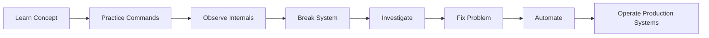
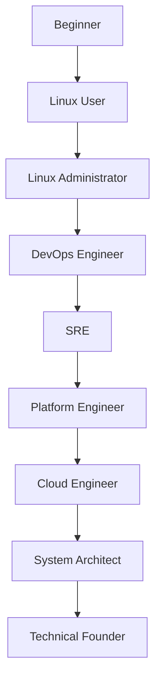

# Linux Engineering Labs

> Theory teaches concepts.
>
> Labs build engineers.
>
> Real expertise comes from breaking systems, observing failures, investigating root causes, and recovering services under pressure.

---

# Why This Section Exists

Many Linux resources teach commands.

Few teach engineering.

You can memorize hundreds of commands and still struggle when:

* A production server crashes
* A service refuses to start
* DNS suddenly fails
* Storage becomes full
* CPU usage reaches 100%
* Memory starts disappearing
* Kubernetes nodes become unhealthy
* Containers stop communicating
* Databases become slow

The difference between a beginner and an experienced engineer is not command knowledge.

The difference is troubleshooting ability.

This labs section exists to develop that ability.

---

# The Problem With Traditional Learning

Most learning follows this pattern:

```text
Read Commands
      ↓
Run Commands
      ↓
Pass Interview
```

Real engineering looks like this:

```text
System Failure
      ↓
Observe Symptoms
      ↓
Collect Evidence
      ↓
Build Hypothesis
      ↓
Verify Assumptions
      ↓
Find Root Cause
      ↓
Fix Problem
      ↓
Prevent Recurrence
```

This repository trains the second skill.

---

# Lab Philosophy

Every lab is designed around engineering thinking.

We focus on:

* Why systems behave the way they do
* How Linux internals work
* What happens during failures
* How to diagnose problems
* How to recover safely
* How to prevent future incidents

Our goal is not command memorization.

Our goal is systems understanding.

---

# Learning Journey



---

# Engineering Maturity Path



Each lab contributes to this journey.

---

# Lab Categories

## Beginner Labs

Build fundamental Linux confidence.

Topics:

* Navigation
* Files
* Directories
* Searching
* Editing
* Redirection
* Pipelines
* Daily workflows

Goal:

Become comfortable living inside Linux.

---

## Filesystem Labs

Explore how Linux stores data.

Topics:

* Inodes
* Ext4
* Mounts
* Links
* Filesystem structures
* Corruption scenarios
* Storage architecture

Goal:

Understand where data actually lives.

---

## Permissions Labs

Understand Linux security foundations.

Topics:

* Users
* Groups
* Ownership
* Permissions
* ACLs
* sudo
* setuid
* setgid

Goal:

Understand access control deeply.

---

## Process Labs

Explore running applications.

Topics:

* Process lifecycle
* Scheduling
* Signals
* CPU utilization
* Memory usage
* Debugging

Goal:

Understand how Linux executes workloads.

---

## Networking Labs

Learn how machines communicate.

Topics:

* TCP/IP
* Routing
* DNS
* HTTP
* Firewalls
* Packet analysis

Goal:

Understand how data moves across systems.

---

## Storage Labs

Learn how Linux manages disks.

Topics:

* Partitions
* LVM
* RAID
* Swap
* Performance
* Storage bottlenecks

Goal:

Understand persistent data systems.

---

## Systemd Labs

Understand modern Linux service management.

Topics:

* Services
* Targets
* Timers
* Journals
* Dependency chains
* Recovery

Goal:

Understand how Linux boots and runs services.

---

## Bash Labs

Learn Linux automation.

Topics:

* Variables
* Loops
* Functions
* Log processing
* Monitoring scripts
* Maintenance automation

Goal:

Transform manual work into repeatable automation.

---

## Troubleshooting Labs

Develop real engineering instincts.

Topics:

* CPU spikes
* Memory leaks
* Disk exhaustion
* Service failures
* Network outages
* DNS issues

Goal:

Think like an SRE.

---

## Production Labs

Build complete systems.

Examples:

* Web servers
* Reverse proxies
* Monitoring systems
* Backup systems
* Logging pipelines

Goal:

Operate real infrastructure.

---

## Docker Labs

Learn Linux containers from first principles.

Topics:

* Namespaces
* Cgroups
* OverlayFS
* Networking
* Storage
* Security

Goal:

Understand containers beyond Docker commands.

---

## Kubernetes Labs

Learn orchestration fundamentals.

Topics:

* Pods
* Networking
* Storage
* Scheduling
* Troubleshooting

Goal:

Understand how modern platforms operate.

---

## Cloud Labs

Connect Linux to modern infrastructure.

Topics:

* Virtual machines
* Networking
* IAM
* Storage
* Load balancing
* Autoscaling

Goal:

Operate Linux at cloud scale.

---

## Distributed Systems Labs

Learn internet-scale thinking.

Topics:

* Replication
* Consistency
* Caching
* Queues
* Failure handling
* Latency

Goal:

Understand systems beyond a single server.

---

## Capstone Projects

Complete end-to-end engineering challenges.

Examples:

* Build a hosting platform
* Build a monitoring stack
* Build a container platform
* Build a mini cloud
* Build a production-ready infrastructure

Goal:

Combine all previous knowledge.

---

# Lab Difficulty Levels

Each lab contains multiple challenge levels.

## Level 1 — Guided

Step-by-step instructions.

Suitable for beginners.

```text
Follow Instructions
      ↓
Observe Output
      ↓
Understand Concept
```

---

## Level 2 — Semi-Guided

Partial instructions.

You fill in missing pieces.

```text
Problem
      ↓
Hints
      ↓
Solution
```

---

## Level 3 — Independent

Real engineering scenario.

No instructions.

```text
Problem
      ↓
Investigation
      ↓
Diagnosis
      ↓
Recovery
```

---

# Expected Engineering Mindset

Do not ask:

> Which command fixes this?

Ask:

> Why did this happen?

Do not ask:

> Which service failed?

Ask:

> What chain of events caused failure?

Do not ask:

> How do I restart it?

Ask:

> Why did restarting work?

Engineers investigate causes.

Operators only execute commands.

---

# Recommended Lab Environment

Use one of:

* VirtualBox
* VMware
* KVM
* Multipass
* Docker
* Cloud VM

Recommended distributions:

* Ubuntu Server LTS
* Debian
* Rocky Linux
* AlmaLinux

Minimum:

```text
2 CPU
4 GB RAM
30 GB Storage
```

Preferred:

```text
4 CPU
8 GB RAM
50+ GB Storage
```

---

# Safety Rules

Many labs intentionally create failures.

Always:

* Use virtual machines
* Snapshot before experiments
* Never run destructive commands on production systems
* Verify commands before execution

Examples:

```bash
rm -rf
mkfs
dd
fdisk
parted
kill -9
```

Understand them before using them.

---

# How To Use This Section

Recommended order:

```text
Beginner
    ↓
Filesystem
    ↓
Permissions
    ↓
Processes
    ↓
Networking
    ↓
Storage
    ↓
Systemd
    ↓
Bash
    ↓
Troubleshooting
    ↓
Production
    ↓
Docker
    ↓
Kubernetes
    ↓
Cloud
    ↓
Distributed Systems
    ↓
Capstone Projects
```

---

# Final Goal

By completing these labs, you should be able to:

* Understand Linux internals
* Diagnose production incidents
* Operate servers confidently
* Design infrastructure
* Build cloud-native systems
* Debug distributed applications
* Think like a platform engineer
* Think like a systems architect

The objective is not learning Linux.

The objective is becoming an engineer who can build, operate, troubleshoot, and scale modern systems.
