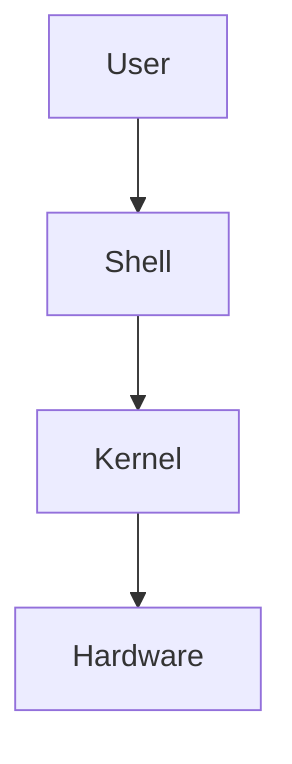
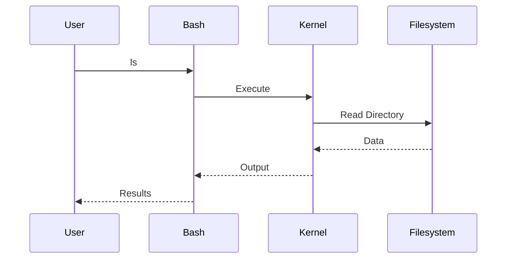
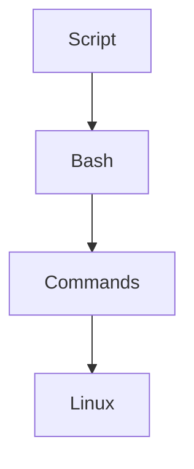
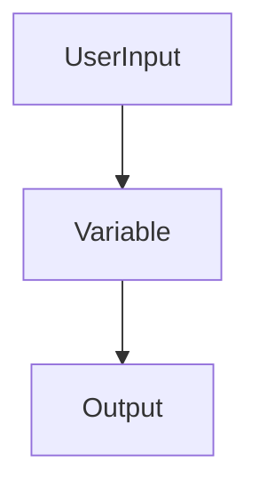
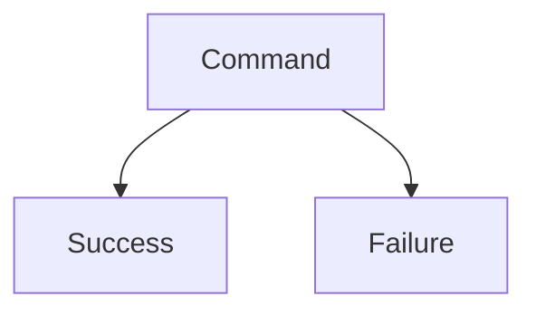
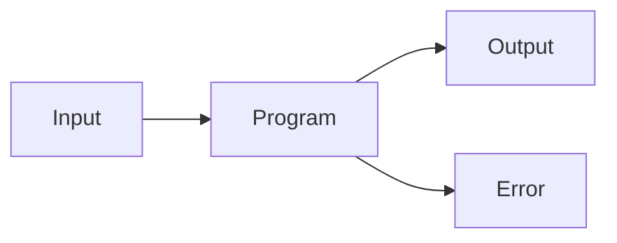
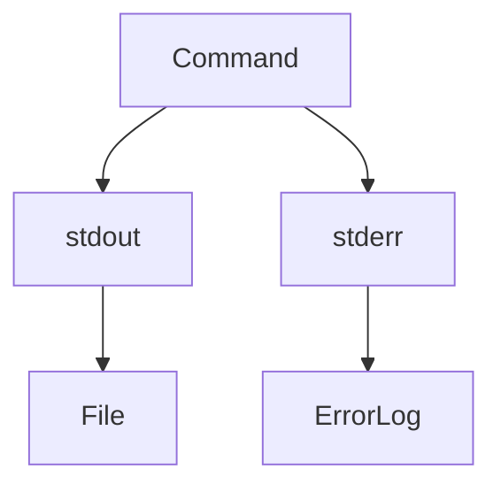
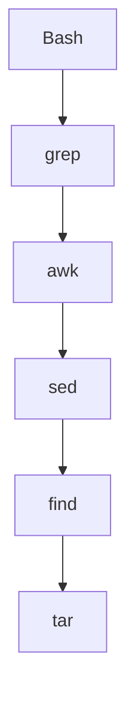

# Lab 01 — Bash Fundamentals: Learning the Language of Linux Automation

> Linux Fundamentals Mastery
>
> Bash Scripting Labs Series
>
> Track:
>
> Linux Fundamentals → Shell Scripting → Automation Engineering → Platform Engineering
>
> Lab Goal:
>
> Understand what Bash actually is, why shell scripting powers Linux infrastructure, how commands become automation, and how engineers use Bash to control servers, containers, cloud infrastructure, and production systems.

---

# Why This Lab Exists

Most Linux users learn commands like:

```bash
ls
pwd
cd
cp
mv
```

But eventually every engineer encounters a problem:

```text
I Can Execute Commands

But How Do I Automate Them?
```

Examples:

```text
Backup Files

Monitor Servers

Deploy Applications

Process Logs

Manage Containers

Automate Maintenance
```

Running commands manually does not scale.

Automation is required.

Bash exists to solve this problem.

---

# The Most Important Lesson

Bash is not:

```text
A Programming Language
```

in the same sense as:

```text
C

C++

Java

Python
```

Bash is:

```text
A Command Automation Language
```

Its primary purpose is:

```text
Automating Linux Operations
```

Understanding this changes how you learn Bash.

---

# The Fundamental Question

Imagine:

```bash
mkdir backup
cp *.log backup/
tar -czf backup.tar.gz backup/
```

Works perfectly.

Now imagine doing it:

```text
Every Day

For 500 Servers

For 5 Years
```

Manually impossible.

Question:

```text
How Do We Teach Linux

To Perform The Work?
```

Answer:

```text
Shell Scripts
```

---

# Mental Model

Think of Linux as a factory.

Commands are:

```text
Individual Workers
```

Example:

```bash
cp
```

copies files.

```bash
grep
```

searches text.

```bash
tar
```

creates archives.

---

Bash acts as:

```text
Factory Manager
```

coordinating workers.

---

Visualization:


Bash orchestrates commands.

---

# What Is Bash?

Bash means:

```text
Bourne Again Shell
```

A shell is:

```text
A Program

Between

Users

And

The Linux Kernel
```

---

# Linux Architecture



The shell translates human instructions into system actions.

---

# Why Bash Became Dominant

Linux systems needed:

```text
Interactive Commands

Automation

Text Processing

System Administration
```

Bash solved all four.

---

# Bash Is Everywhere

Used in:

```text
Linux Servers

Cloud Infrastructure

Docker

Kubernetes

CI/CD Pipelines

DevOps Tools
```

Even modern cloud platforms rely heavily on shell scripting.

---

# Understanding The Shell

When you type:

```bash
ls
```

What happens?

---

# Internal Flow



The shell acts as a translator.

---

# Your First Script

Create:

```bash
nano hello.sh
```

Content:

```bash
#!/bin/bash

echo "Hello Linux Engineering"
```

---

Run:

```bash
bash hello.sh
```

Output:

```text
Hello Linux Engineering
```

Congratulations.

You have automated Linux.

---

# Understanding The Shebang

First line:

```bash
#!/bin/bash
```

called:

```text
Shebang
```

Meaning:

```text
Use Bash

To Execute This Script
```

---

# Visualization

```text
Script

↓

Shebang

↓

Bash Interpreter

↓

Execution
```

---

# Why Shebang Matters

Without it:

Linux may not know:

```text
Which Interpreter

Should Execute The File
```

---

# Making Scripts Executable

Permission:

```bash
chmod +x hello.sh
```

Run:

```bash
./hello.sh
```

Linux now executes directly.

---

# Script Execution Flow



---

# Understanding Commands

Every Bash script is fundamentally:

```text
A Sequence Of Commands
```

Example:

```bash
#!/bin/bash

pwd
date
hostname
```

---

Output:

```text
Current Directory

Current Time

System Hostname
```

---

# Lab 1 — System Information Script

Create:

```bash
nano system-info.sh
```

Content:

```bash
#!/bin/bash

echo "Hostname:"
hostname

echo "Kernel:"
uname -r

echo "Current User:"
whoami
```

---

Run:

```bash
bash system-info.sh
```

Observe automation in action.

---

# Variables

Variables store information.

Example:

```bash
NAME="Linux"
```

Access:

```bash
echo $NAME
```

Output:

```text
Linux
```

---

# Mental Model

Variables are:

```text
Labels

Attached To Data
```

---

Visualization:

```text
NAME

↓

Linux
```

---

# Why Variables Matter

Without variables:

```text
Hardcoded Values
```

With variables:

```text
Reusable Automation
```

---

# Example

```bash
SERVER="web-01"

echo $SERVER
```

Output:

```text
web-01
```

---

# Lab 2 — User Greeting

```bash
#!/bin/bash

USER_NAME="Engineer"

echo "Welcome $USER_NAME"
```

Run script.

Observe variable expansion.

---

# User Input

Scripts can ask questions.

Example:

```bash
read NAME
```

---

Complete example:

```bash
#!/bin/bash

echo "Enter name:"

read NAME

echo "Hello $NAME"
```

---

Visualization:



---

# Command Substitution

Store command output.

Example:

```bash
DATE=$(date)
```

---

Output:

```bash
echo $DATE
```

Stores current time.

---

# Why This Matters

Scripts can dynamically collect:

```text
Time

Hostnames

IP Addresses

Disk Usage
```

---

# Example

```bash
HOST=$(hostname)

echo $HOST
```

Automation becomes intelligent.

---

# Lab 3 — Dynamic System Report

```bash
#!/bin/bash

HOST=$(hostname)

DATE=$(date)

echo "Host: $HOST"

echo "Date: $DATE"
```

---

# Understanding Exit Codes

Every Linux command returns:

```text
Success

Or

Failure
```

---

Success:

```text
0
```

Failure:

```text
Non-Zero
```

---

Example:

```bash
ls
echo $?
```

Output:

```text
0
```

---

Failed command:

```bash
ls nonexistent
echo $?
```

Output:

```text
2
```

---

# Why Exit Codes Matter

Automation depends on:

```text
Knowing

Whether Commands Succeeded
```

---

Visualization



---

# Linux Philosophy

Programs communicate using:

```text
Exit Codes

Text Streams

Signals
```

Bash uses all three.

---

# Understanding Standard Streams

Every process has:

```text
stdin

stdout

stderr
```

---

Visualization



---

# Example

```bash
echo "Hello"
```

writes to:

```text
stdout
```

---

Failed command:

```bash
ls fake-directory
```

writes to:

```text
stderr
```

---

# Why Streams Matter

Modern Linux automation depends on:

```text
Pipes

Redirection

Logging

Monitoring
```

---

# Lab 4 — Redirect Output

Write:

```bash
date > time.txt
```

Observe:

```text
Output Stored In File
```

---

Append:

```bash
date >> time.txt
```

---

Error output:

```bash
ls fake 2> error.log
```

---

# Visualization



---

# Understanding Comments

Comments explain scripts.

Example:

```bash
# Backup database
```

Ignored by Bash.

---

# Why Comments Matter

Production scripts live for years.

Future engineers need context.

---

# Lab 5 — Mini Automation Script

```bash
#!/bin/bash

echo "=== System Report ==="

hostname

date

uptime
```

Run:

```bash
bash report.sh
```

Observe multiple commands automated together.

---

# Bash And Linux Internals

Important truth:

```text
Bash Rarely Does The Work
```

Commands perform the work.

Bash coordinates them.

---

Visualization



This is why Bash is powerful.

---

# Bash And DevOps

Examples:

```text
Server Provisioning

Application Deployment

Monitoring

Backup Automation

Container Management
```

Most DevOps pipelines still contain Bash.

---

# Bash And Docker

Example:

```bash
docker build
docker run
docker logs
```

Often wrapped in Bash scripts.

---

# Bash And Kubernetes

Examples:

```bash
kubectl get pods

kubectl rollout restart

kubectl logs
```

frequently automated with Bash.

---

# Bash And Cloud

Cloud engineers automate:

```text
AWS

Azure

GCP
```

using shell scripts.

---

# Real Production Example

Deployment Script:

```bash
#!/bin/bash

git pull

npm install

npm run build

systemctl restart api
```

One command:

```bash
./deploy.sh
```

Performs entire deployment.

---

# Common Mistakes

## Mistake 1

Not using shebang.

---

## Mistake 2

Forgetting executable permissions.

---

## Mistake 3

Ignoring exit codes.

---

## Mistake 4

Hardcoding values.

---

## Mistake 5

Writing scripts without comments.

---

# Engineering Mindset

Beginner:

```text
How Do I Run Commands?
```

Linux User:

```text
How Do I Combine Commands?
```

Administrator:

```text
How Do I Automate Repetitive Work?
```

DevOps Engineer:

```text
How Do I Automate Infrastructure?
```

Platform Engineer:

```text
How Do I Build Reliable Automation Systems?
```

That progression begins with Bash.

---

# Interview Questions

### Beginner

What is Bash?

### Beginner

What is a shell?

### Intermediate

What is a shebang?

### Intermediate

How do variables work?

### Intermediate

What is command substitution?

### Advanced

What are exit codes?

### Advanced

Difference between stdout and stderr?

### Advanced

Why is Bash important for DevOps?

### Advanced

How does Bash interact with Linux internals?

### Advanced

When should Bash be used instead of Python?

---

# Cheat Sheet

Create script:

```bash
nano script.sh
```

Shebang:

```bash
#!/bin/bash
```

Execute:

```bash
bash script.sh
```

Make executable:

```bash
chmod +x script.sh
```

Run:

```bash
./script.sh
```

Variable:

```bash
NAME="Linux"
echo $NAME
```

Input:

```bash
read NAME
```

Command substitution:

```bash
HOST=$(hostname)
```

Exit code:

```bash
echo $?
```

Redirect output:

```bash
> file.txt
```

Append:

```bash
>> file.txt
```

Error redirect:

```bash
2> error.log
```

---

# Lab Success Criteria

You should now be able to:

* Explain what Bash is
* Understand shell architecture
* Create scripts
* Use shebangs
* Work with variables
* Read user input
* Use command substitution
* Understand exit codes
* Understand stdout and stderr
* Connect Bash to Linux automation
* Think like an automation engineer

At this point, you should stop thinking:

```text
Bash Is A Programming Language
```

and start thinking:

```text
Bash Is The Automation Layer

That Connects

Linux Commands

Linux Services

Linux Infrastructure

And Human Intent
```

Because Bash is ultimately the language that teaches Linux how to work for you.
