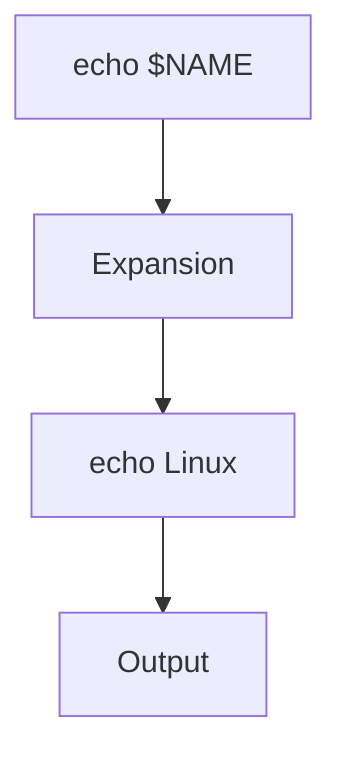
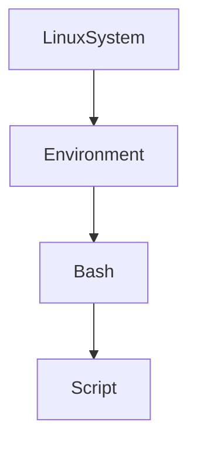
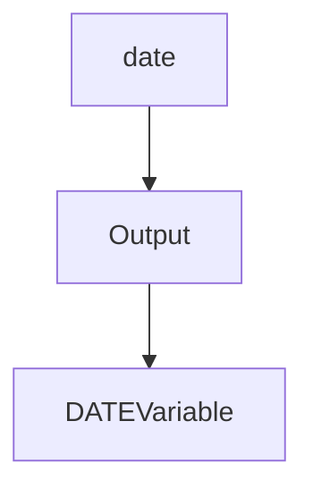
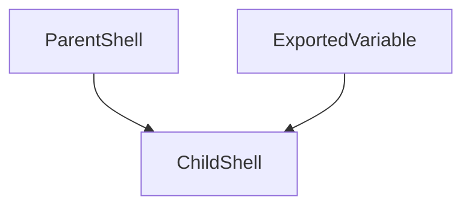
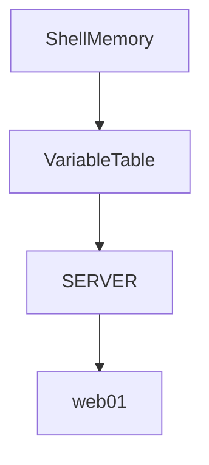

# Lab 02 — Variables: The Memory System of Bash Automation

> Linux Fundamentals Mastery
>
> Bash Scripting Labs Series
>
> Track:
>
> Linux Fundamentals → Shell Scripting → Automation Engineering → Infrastructure Engineering
>
> Lab Goal:
>
> Understand what variables really are, why automation is impossible without them, how Bash stores and expands variables internally, and how production engineers use variables to build flexible, reusable, and scalable automation.

---

# Why This Lab Exists

Imagine writing a script like this:

```bash
#!/bin/bash

echo "Deploying web-server-01"

ssh web-server-01

scp app.tar.gz web-server-01:/opt/app
```

Works.

Until tomorrow.

Tomorrow you need:

```text
web-server-02
```

Then:

```text
web-server-03
```

Then:

```text
100 Servers
```

Hardcoding becomes a disaster.

This is why variables exist.

Variables allow scripts to:

```text
Remember Information

Reuse Information

Modify Behavior

Adapt Dynamically
```

Without variables:

```text
Automation Does Not Scale
```

---

# The Most Important Lesson

Variables are not:

```text
Just Containers For Values
```

Variables are:

```text
The Memory Layer

Of Automation
```

They allow Linux to:

```text
Remember

Decide

Adapt

Respond
```

to changing environments.

---

# Mental Model

Imagine a warehouse.

Without labels:

```text
Boxes Everywhere

Nothing Organized

Impossible To Find Anything
```

Variables act like labels.

Example:

```text
SERVER_NAME
```

points to:

```text
web-prod-01
```

Visualization:

```text
SERVER_NAME
      ↓
web-prod-01
```

The variable is not the data.

The variable is the reference to the data.

---

# The Fundamental Problem

Suppose:

```bash
echo "Connecting to 192.168.1.50"
```

Works today.

Tomorrow:

```text
IP Changes
```

Now every script breaks.

Instead:

```bash
SERVER_IP="192.168.1.50"

echo "Connecting to $SERVER_IP"
```

Change once.

Everything updates automatically.

---

# How Bash Sees Variables

When Bash encounters:

```bash
NAME="Linux"
```

it stores:

```text
NAME → Linux
```

in the shell's memory.

---

# Internal Architecture


---

# Creating Variables

Basic syntax:

```bash
VARIABLE=value
```

Example:

```bash
NAME=Linux
```

Access:

```bash
echo $NAME
```

Output:

```text
Linux
```

---

# Important Rule

NO spaces.

Correct:

```bash
NAME=Linux
```

Wrong:

```bash
NAME = Linux
```

Why?

Because Bash interprets:

```text
NAME

=

Linux
```

as separate commands.

---

# Lab 1 — First Variable

Create:

```bash
nano variables.sh
```

Content:

```bash
#!/bin/bash

NAME=Linux

echo $NAME
```

Run:

```bash
bash variables.sh
```

Observe:

```text
Linux
```

---

# Variable Expansion

This process:

```bash
echo $NAME
```

is called:

```text
Variable Expansion
```

Bash replaces:

```text
$NAME
```

with:

```text
Linux
```

before executing.

---

# Visualization



---

# Why Expansion Matters

Bash scripts constantly replace variables with actual values.

This is the foundation of automation.

---

# Lab 2 — Multiple Variables

```bash
#!/bin/bash

FIRST=Linux

SECOND=Engineering

echo $FIRST

echo $SECOND
```

Output:

```text
Linux

Engineering
```

---

# Combining Variables

Example:

```bash
FIRST=Linux

SECOND=Mastery

echo "$FIRST $SECOND"
```

Output:

```text
Linux Mastery
```

---

# Visualization

```text
FIRST  → Linux
SECOND → Mastery

↓

Linux Mastery
```

---

# Strings

Variables often store text.

Example:

```bash
COURSE="Linux Engineering"
```

Access:

```bash
echo $COURSE
```

Output:

```text
Linux Engineering
```

---

# Why Quotes Matter

Without quotes:

```bash
COURSE=Linux Engineering
```

Bash sees:

```text
COURSE=Linux

Engineering
```

which breaks.

Use:

```bash
COURSE="Linux Engineering"
```

instead.

---

# Numbers

Variables can store numbers.

Example:

```bash
COUNT=100
```

Output:

```bash
echo $COUNT
```

Result:

```text
100
```

---

# Important Truth

Bash treats everything as text initially.

Example:

```bash
NUMBER=100
```

is actually:

```text
"100"
```

until arithmetic operations occur.

---

# Environment Variables

One of the most important Linux concepts.

Examples:

```bash
echo $HOME

echo $USER

echo $PATH
```

These already exist.

---

# What Are Environment Variables?

Environment variables store:

```text
System Information

Configuration

Runtime Settings
```

used by processes.

---

# Example

```bash
echo $HOME
```

Output:

```text
/home/user
```

---

# Visualization



---

# Why Environment Variables Exist

Instead of hardcoding:

```bash
/home/vipul
```

Linux provides:

```bash
$HOME
```

Portable.

Reusable.

Reliable.

---

# Lab 3 — Explore Environment Variables

Run:

```bash
env
```

Observe:

```text
USER

HOME

PATH

SHELL

LANG
```

These variables power Linux.

---

# The Famous PATH Variable

View:

```bash
echo $PATH
```

Example:

```text
/usr/local/bin:/usr/bin:/bin
```

---

# Why PATH Matters

When you type:

```bash
ls
```

Bash searches:

```text
PATH Directories
```

for:

```text
ls
```

---

# PATH Lookup Visualization


Without PATH:

```text
Every Command

Needs Full Path
```

---

# User Input Variables

Scripts become interactive.

Example:

```bash
read NAME
```

Store:

```text
User Input

Into Variable
```

---

# Lab 4 — User Greeting

```bash
#!/bin/bash

echo "Enter your name"

read NAME

echo "Welcome $NAME"
```

Run script.

Observe dynamic behavior.

---

# Command Substitution

Variables can store command output.

Example:

```bash
DATE=$(date)
```

---

Meaning:

```text
Run date

Store Result
```

---

# Visualization



---

# Lab 5 — Dynamic System Information

```bash
#!/bin/bash

HOST=$(hostname)

DATE=$(date)

echo "Host: $HOST"

echo "Date: $DATE"
```

Observe automatic data collection.

---

# Variable Scope

Critical production concept.

---

# Local Variable

Exists only in current shell.

Example:

```bash
NAME=Linux
```

---

# Exported Variable

Available to child processes.

Example:

```bash
export NAME=Linux
```

---

# Visualization



---

# Lab 6 — Export Variables

```bash
export PROJECT=LinuxMastery
```

Verify:

```bash
env | grep PROJECT
```

Output:

```text
PROJECT=LinuxMastery
```

---

# Why Export Matters

Many applications depend on:

```text
Environment Variables
```

Examples:

```text
Database URLs

API Keys

Application Configuration

Cloud Credentials
```

---

# Production Example

Node.js:

```bash
DATABASE_URL=postgres://...
```

Python:

```bash
SECRET_KEY=...
```

Docker:

```bash
ENV NODE_ENV=production
```

Kubernetes:

```yaml
env:
  - name: DATABASE_URL
```

Variables power modern infrastructure.

---

# Default Values

Example:

```bash
echo ${NAME:-Guest}
```

Meaning:

```text
Use NAME

Otherwise Use Guest
```

---

# Why This Matters

Production scripts often run in:

```text
Development

Testing

Staging

Production
```

Variables may be missing.

Defaults prevent failures.

---

# Variable Naming Best Practices

Good:

```bash
SERVER_NAME

DATABASE_URL

APP_ENV
```

Bad:

```bash
x

a

temp
```

Variables should communicate intent.

---

# Naming Visualization

```text
SERVER_NAME

↓

Immediate Meaning
```

vs

```text
x

↓

Confusion
```

---

# Linux Internals

Bash stores variables in memory.

Example:

```bash
SERVER=web01
```

Creates:

```text
Key → Value
```

inside the shell process.

---

# Internal Representation



---

# Variables In Production

Examples:

```text
Server Names

IP Addresses

Ports

Cloud Regions

API Keys

Database Endpoints

Container Tags
```

Almost every production system relies on variables.

---

# Docker Connection

Dockerfile:

```dockerfile
ENV NODE_ENV=production
```

creates environment variables.

Containers depend heavily on variables.

---

# Kubernetes Connection

Example:

```yaml
env:
- name: APP_ENV
  value: production
```

Variables configure applications dynamically.

---

# Cloud Connection

AWS:

```bash
AWS_ACCESS_KEY_ID
```

Azure:

```bash
AZURE_SUBSCRIPTION_ID
```

GCP:

```bash
GOOGLE_APPLICATION_CREDENTIALS
```

Cloud automation relies on variables.

---

# Common Mistakes

## Mistake 1

Spaces around =

Wrong:

```bash
NAME = Linux
```

---

## Mistake 2

Forgetting $

Wrong:

```bash
echo NAME
```

Correct:

```bash
echo $NAME
```

---

## Mistake 3

Not quoting strings.

---

## Mistake 4

Using meaningless names.

---

## Mistake 5

Hardcoding values instead of variables.

---

# Engineering Mindset

Beginner:

```text
Variables Store Data
```

Linux User:

```text
Variables Make Scripts Reusable
```

Administrator:

```text
Variables Manage Configuration
```

DevOps Engineer:

```text
Variables Enable Automation
```

Platform Engineer:

```text
Variables Separate

Code

From

Configuration
```

That principle powers modern infrastructure.

---

# Interview Questions

### Beginner

What is a variable?

### Beginner

How do you create a variable in Bash?

### Intermediate

What is variable expansion?

### Intermediate

What are environment variables?

### Intermediate

What does export do?

### Advanced

How does PATH work?

### Advanced

What is command substitution?

### Advanced

How do variables relate to Docker?

### Advanced

How do variables relate to Kubernetes?

### Advanced

Why should configuration be separated from code?

---

# Cheat Sheet

Create variable:

```bash
NAME=Linux
```

Access:

```bash
echo $NAME
```

String:

```bash
COURSE="Linux Engineering"
```

Input:

```bash
read NAME
```

Environment:

```bash
env
```

Export:

```bash
export NAME=Linux
```

Command substitution:

```bash
DATE=$(date)
```

Default value:

```bash
${NAME:-Guest}
```

Home directory:

```bash
echo $HOME
```

Path:

```bash
echo $PATH
```

---

# Lab Success Criteria

You should now be able to:

* Understand what variables are
* Create and use variables
* Understand variable expansion
* Work with strings and numbers
* Use environment variables
* Export variables
* Use command substitution
* Understand PATH
* Connect variables to Docker and Kubernetes
* Think like an automation engineer

At this point, you should stop thinking:

```text
Variables Store Values
```

and start thinking:

```text
Variables Are The Memory Layer

That Allows Linux Automation

To Become Dynamic

Reusable

Portable

And Scalable
```

Because every modern automation system is ultimately built on the ability to remember and reuse information.
