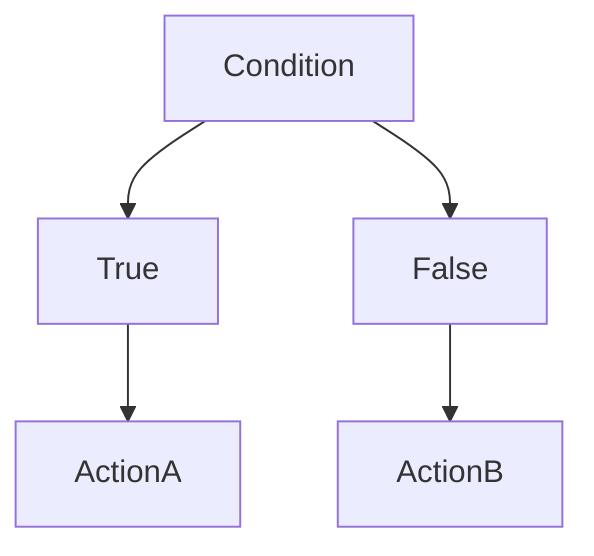
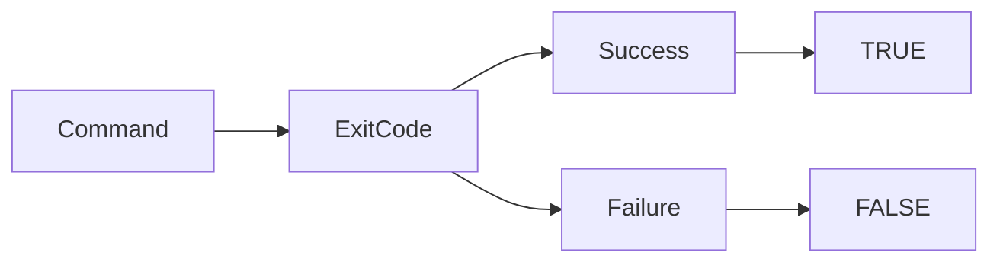
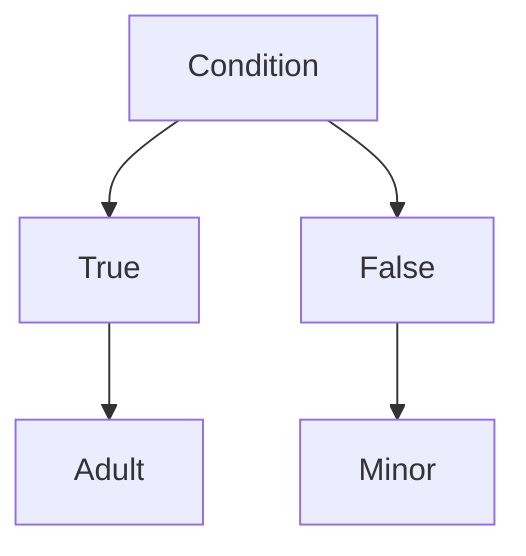
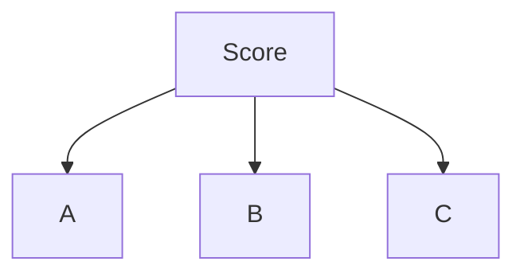
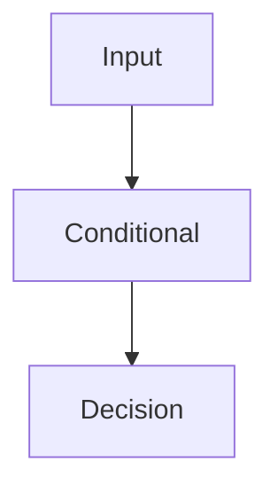
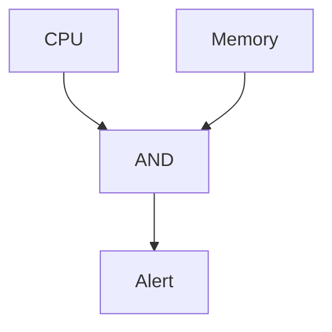
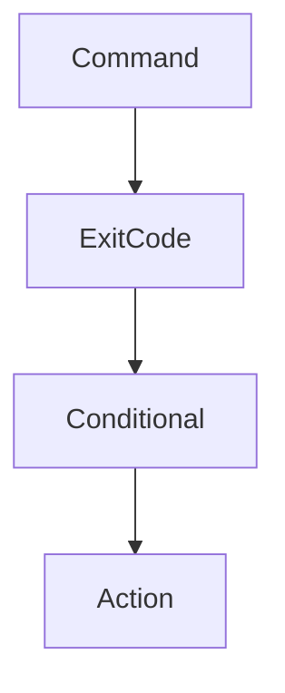

# Lab 03 — Conditionals: Teaching Linux How to Make Decisions

> Linux Fundamentals Mastery
>
> Bash Scripting Labs Series
>
> Track:
>
> Linux Fundamentals → Automation → Decision Making → Infrastructure Engineering
>
> Lab Goal:
>
> Understand how Bash scripts make decisions, how Linux automation reacts to changing conditions, how conditionals power production systems, and how engineers build intelligent automation instead of static command sequences.

---

# Why This Lab Exists

So far our scripts have behaved like robots.

Example:

```bash
#!/bin/bash

echo "Backup Started"

tar -czf backup.tar.gz /data

echo "Backup Complete"
```

The script executes:

```text
Line 1

↓

Line 2

↓

Line 3
```

No thinking.

No decisions.

No adaptation.

Real systems require:

```text
If Disk Is Full

Do Something Different

If Service Is Down

Recover It

If User Exists

Skip Creation

If Backup Failed

Send Alert
```

This is where conditionals become essential.

---

# The Most Important Lesson

Without conditionals:

```text
Automation Executes Commands
```

With conditionals:

```text
Automation Makes Decisions
```

Conditionals transform scripts from:

```text
Static Instructions
```

into:

```text
Adaptive Systems
```

---

# Mental Model

Imagine a traffic signal.

Without decision-making:

```text
Always Green
```

Chaos.

Instead:

```text
IF Traffic Exists

↓

Allow Movement

ELSE

↓

Wait
```

Conditionals are traffic signals for automation.

---

# The Fundamental Problem

Imagine:

```bash
systemctl restart nginx
```

Should Linux always restart nginx?

No.

Better question:

```text
Is nginx actually down?
```

If:

```text
Running
```

No action needed.

If:

```text
Failed
```

Recovery required.

Conditionals allow Linux to determine the difference.

---

# What Is A Conditional?

A conditional evaluates:

```text
Condition

↓

True Or False

↓

Decision
```

---

# Visualization



This pattern powers almost all automation.

---

# Real World Examples

Examples:

```text
If Server Is Reachable

If Disk Usage > 80%

If User Exists

If Backup Failed

If CPU Usage High

If Memory Exhausted
```

Production engineering is essentially:

```text
Condition Evaluation

+

Automated Response
```

---

# Understanding Boolean Logic

Every conditional eventually becomes:

```text
TRUE

or

FALSE
```

Examples:

```text
File Exists → TRUE

File Missing → FALSE

Disk Full → TRUE

Disk Healthy → FALSE
```

---

# First Conditional

Syntax:

```bash
if CONDITION
then
    COMMAND
fi
```

Example:

```bash
#!/bin/bash

if true
then
    echo "Condition met"
fi
```

Output:

```text
Condition met
```

---

# Understanding fi

Many beginners ask:

```text
Why fi?
```

Because:

```text
if

↓

fi
```

marks:

```text
Beginning

And

End
```

of the conditional block.

---

# Visualization

```text
if

↓

Commands

↓

fi
```

Think:

```text
Open Block

↓

Execute Logic

↓

Close Block
```

---

# Lab 1 — Simple Decision

```bash
#!/bin/bash

if true
then
    echo "Linux is awesome"
fi
```

Run script.

Observe execution.

---

# Testing Exit Codes

This is how Linux really evaluates conditions.

Example:

```bash
if ls /tmp
then
    echo "Directory Exists"
fi
```

Why?

Because:

```text
ls Success

↓

Exit Code 0

↓

TRUE
```

---

# Linux Philosophy

Important principle:

```text
Commands Return Exit Codes

Conditionals Interpret Them
```

---

# Visualization



---

# Why This Matters

Everything in Linux depends on:

```text
Exit Codes
```

Examples:

```text
systemctl

docker

kubectl

git

ssh
```

All communicate through exit codes.

---

# Using Test Conditions

Most Bash conditionals use:

```bash
[ CONDITION ]
```

Example:

```bash
NAME="Linux"

if [ "$NAME" = "Linux" ]
then
    echo "Match"
fi
```

Output:

```text
Match
```

---

# How Bash Evaluates

Bash internally checks:

```text
Linux

=

Linux
```

Result:

```text
TRUE
```

---

# Visualization

```mermaid
flowchart TD

Linux

==

Linux

-->

TRUE

-->

Execute
```

---

# Lab 2 — String Comparison

```bash
#!/bin/bash

OS="Linux"

if [ "$OS" = "Linux" ]
then
    echo "Linux Detected"
fi
```

Experiment with different values.

---

# Equality Operators

| Operator | Meaning   |
| -------- | --------- |
| =        | Equal     |
| !=       | Not Equal |

---

Example:

```bash
if [ "$USER" != "root" ]
then
    echo "Not running as root"
fi
```

---

# Why This Matters

Production scripts often validate:

```text
Environment

User

Configuration

Hostname

Region
```

before execution.

---

# Numeric Comparisons

Bash provides numeric operators.

| Operator | Meaning          |
| -------- | ---------------- |
| -eq      | Equal            |
| -ne      | Not Equal        |
| -gt      | Greater Than     |
| -lt      | Less Than        |
| -ge      | Greater Or Equal |
| -le      | Less Or Equal    |

---

Example:

```bash
AGE=25

if [ "$AGE" -gt 18 ]
then
    echo "Adult"
fi
```

Output:

```text
Adult
```

---

# Visualization

```text
25 > 18

↓

TRUE

↓

Adult
```

---

# Lab 3 — Age Checker

```bash
#!/bin/bash

AGE=20

if [ "$AGE" -ge 18 ]
then
    echo "Eligible"
fi
```

---

# Why Numbers Matter

Production systems constantly compare:

```text
CPU Usage

Memory Usage

Disk Usage

Request Counts

Network Traffic
```

All require numeric comparisons.

---

# if-else

Real systems need alternatives.

Syntax:

```bash
if CONDITION
then
    COMMAND
else
    COMMAND
fi
```

---

Example:

```bash
AGE=15

if [ "$AGE" -ge 18 ]
then
    echo "Adult"
else
    echo "Minor"
fi
```

---

Visualization



---

# Lab 4 — User Access Control

```bash
#!/bin/bash

USER_ROLE="guest"

if [ "$USER_ROLE" = "admin" ]
then
    echo "Full Access"
else
    echo "Limited Access"
fi
```

---

# Production Connection

Authentication systems work exactly this way.

Example:

```text
If Admin

↓

Allow Action

Else

↓

Deny Action
```

---

# if-elif-else

Multiple decisions.

Syntax:

```bash
if CONDITION
then
    COMMAND

elif CONDITION
then
    COMMAND

else
    COMMAND
fi
```

---

# Example

```bash
SCORE=85

if [ "$SCORE" -ge 90 ]
then
    echo "A"

elif [ "$SCORE" -ge 80 ]
then
    echo "B"

else
    echo "C"
fi
```

---

# Visualization



---

# Lab 5 — System Load Classification

```bash
LOAD=85

if [ "$LOAD" -gt 90 ]
then
    echo "Critical"

elif [ "$LOAD" -gt 70 ]
then
    echo "Warning"

else
    echo "Healthy"
fi
```

This resembles real monitoring systems.

---

# File Testing

One of the most common uses of conditionals.

---

# Check File Exists

```bash
if [ -f test.txt ]
then
    echo "File Exists"
fi
```

---

# Check Directory Exists

```bash
if [ -d /tmp ]
then
    echo "Directory Exists"
fi
```

---

# Common File Tests

| Test | Meaning      |
| ---- | ------------ |
| -f   | Regular File |
| -d   | Directory    |
| -r   | Readable     |
| -w   | Writable     |
| -x   | Executable   |
| -e   | Exists       |

---

# Lab 6 — Backup Validation

```bash
if [ -f backup.tar.gz ]
then
    echo "Backup Available"
else
    echo "Backup Missing"
fi
```

Production backup systems use similar checks.

---

# User Input + Conditionals

Interactive automation.

Example:

```bash
echo "Enter age"

read AGE

if [ "$AGE" -ge 18 ]
then
    echo "Access Granted"
else
    echo "Access Denied"
fi
```

---

# Visualization



---

# Logical Operators

Complex decisions require:

```text
AND

OR

NOT
```

---

# AND

```bash
if [ "$CPU" -gt 80 ] && [ "$MEMORY" -gt 80 ]
then
    echo "System Under Pressure"
fi
```

Both conditions required.

---

# OR

```bash
if [ "$CPU" -gt 90 ] || [ "$MEMORY" -gt 90 ]
then
    echo "Alert"
fi
```

Either condition sufficient.

---

# NOT

```bash
if [ ! -f backup.tar.gz ]
then
    echo "Backup Missing"
fi
```

Reverse result.

---

# Logic Visualization



---

# Linux Internals

Remember:

```text
Conditionals

Do Not Evaluate Reality
```

They evaluate:

```text
Exit Codes

Values

Expressions
```

The shell simply interprets results.

---

# Internal Architecture



This powers nearly every Linux automation workflow.

---

# Production Example 1

## Disk Usage Monitoring

```bash
USAGE=92

if [ "$USAGE" -gt 90 ]
then
    echo "Critical Storage Alert"
fi
```

---

# Production Example 2

## Service Recovery

```bash
if systemctl is-active nginx >/dev/null
then
    echo "Healthy"
else
    systemctl restart nginx
fi
```

Real-world self-healing automation.

---

# Production Example 3

## Backup Validation

```bash
if [ -f backup.tar.gz ]
then
    echo "Backup Successful"
else
    echo "Backup Failed"
fi
```

---

# Production Example 4

## Deployment Validation

```bash
if git pull
then
    echo "Deploy Continue"
else
    echo "Deployment Failed"
fi
```

---

# Docker Connection

Automation often checks:

```bash
if docker ps
```

before:

```text
Deployment

Monitoring

Scaling
```

---

# Kubernetes Connection

Examples:

```bash
if kubectl get pods
```

Production scripts constantly evaluate cluster state.

---

# Cloud Connection

Cloud automation evaluates:

```text
Instance State

Storage Capacity

Load Balancer Health

Auto Scaling Metrics
```

using conditionals.

---

# Common Mistakes

## Mistake 1

Forgetting spaces.

Wrong:

```bash
if [ "$A"="Linux" ]
```

Correct:

```bash
if [ "$A" = "Linux" ]
```

---

## Mistake 2

Using = for numbers.

Wrong:

```bash
if [ "$NUM" = 10 ]
```

Prefer:

```bash
if [ "$NUM" -eq 10 ]
```

---

## Mistake 3

Ignoring quotes.

Wrong:

```bash
if [ $NAME = Linux ]
```

Correct:

```bash
if [ "$NAME" = "Linux" ]
```

---

## Mistake 4

Ignoring exit codes.

Linux conditionals are built on exit-code logic.

---

# Engineering Mindset

Beginner:

```text
Conditionals Compare Values
```

Linux User:

```text
Conditionals Control Script Flow
```

Administrator:

```text
Conditionals Automate Decisions
```

DevOps Engineer:

```text
Conditionals Automate Operations
```

Platform Engineer:

```text
Conditionals Encode Operational Policies
```

SRE:

```text
Conditionals Enable Self-Healing Systems
```

That progression defines modern automation.

---

# Interview Questions

### Beginner

What is an if statement?

### Beginner

Why is fi required?

### Intermediate

Difference between = and -eq?

### Intermediate

How do file tests work?

### Intermediate

How do exit codes relate to conditionals?

### Advanced

Why are exit codes central to Linux automation?

### Advanced

How would you automate service recovery?

### Advanced

Explain AND, OR, and NOT operators.

### Advanced

How do conditionals support monitoring systems?

### Advanced

How do conditionals support Kubernetes automation?

---

# Cheat Sheet

Basic if:

```bash
if CONDITION
then
    COMMAND
fi
```

if-else:

```bash
if CONDITION
then
    COMMAND
else
    COMMAND
fi
```

String compare:

```bash
[ "$A" = "$B" ]
```

Not equal:

```bash
[ "$A" != "$B" ]
```

Numeric:

```bash
[ "$NUM" -gt 10 ]
```

File exists:

```bash
[ -f file.txt ]
```

Directory exists:

```bash
[ -d /tmp ]
```

AND:

```bash
&&
```

OR:

```bash
||
```

NOT:

```bash
!
```

Exit code:

```bash
echo $?
```

---

# Lab Success Criteria

You should now be able to:

* Understand decision-making in Bash
* Use if, else, and elif
* Compare strings and numbers
* Test files and directories
* Use logical operators
* Understand exit-code-based decisions
* Build adaptive scripts
* Automate operational responses
* Connect conditionals to DevOps workflows
* Think like an automation engineer

At this point, you should stop thinking:

```text
Scripts Execute Commands
```

and start thinking:

```text
Scripts Observe Conditions

Evaluate Reality

Make Decisions

And Execute Actions

Based On The Current State

Of The System
```

Because conditionals are the mechanism that transforms automation from a sequence of commands into an intelligent operational system.
