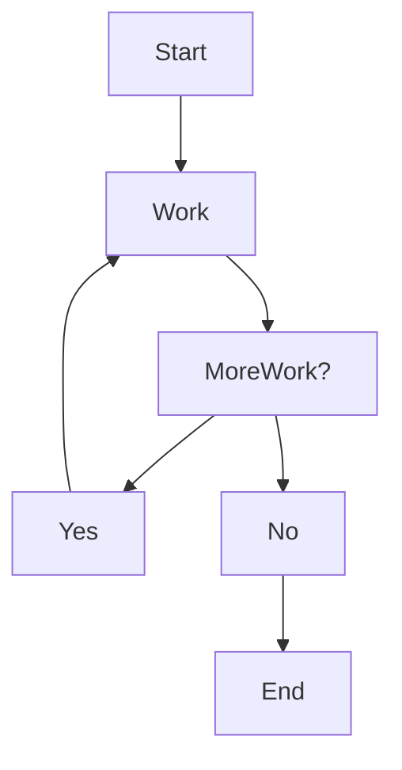
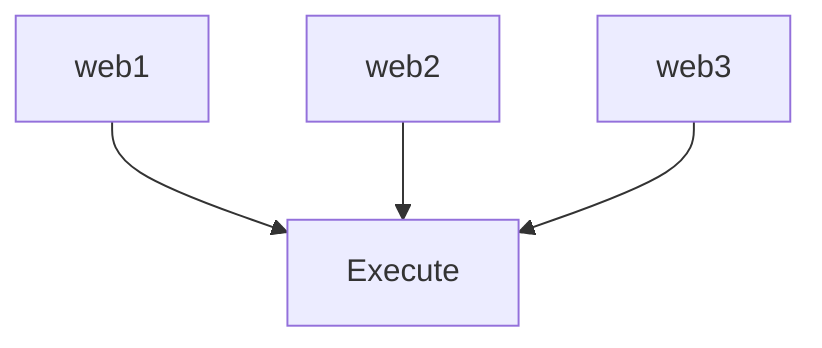
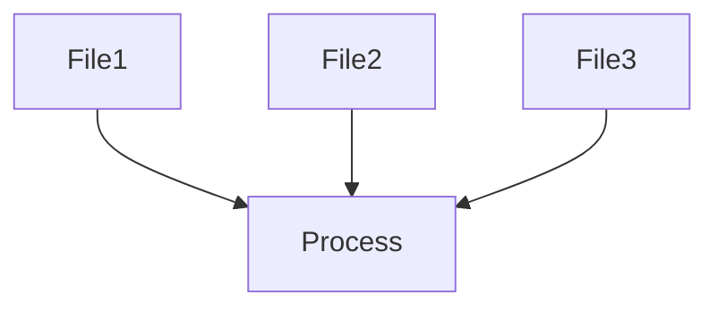
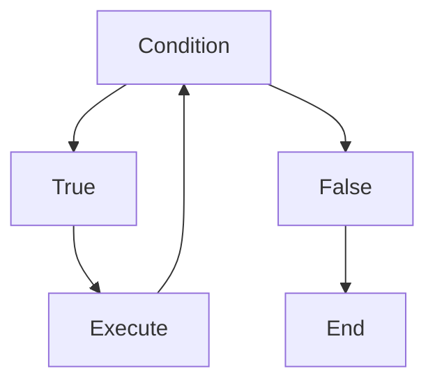
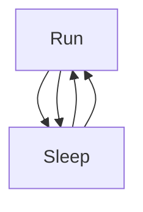
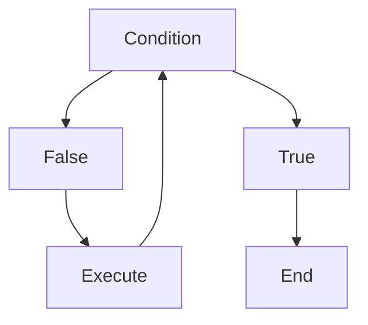
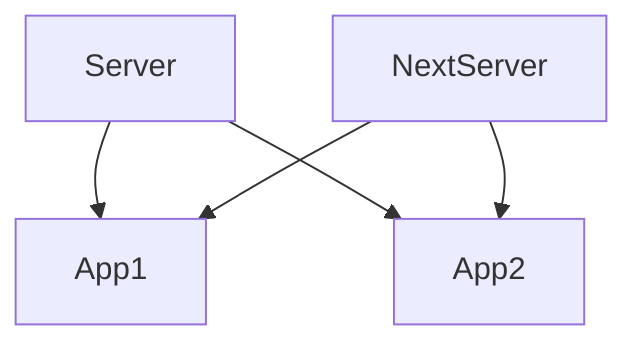
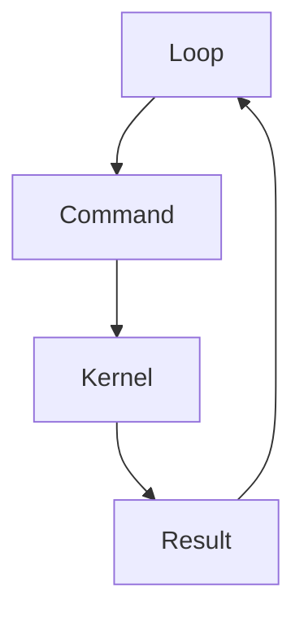

# Lab 04 — Loops: Teaching Linux to Repeat Work at Scale

> Linux Fundamentals Mastery
>
> Bash Scripting Labs Series
>
> Track:
>
> Linux Fundamentals → Automation → Repetition → Infrastructure Engineering
>
> Lab Goal:
>
> Understand why loops exist, how Bash automates repetitive tasks, how Linux engineers manage thousands of servers and files with loops, and how loops become the foundation of large-scale automation systems.

---

# Why This Lab Exists

Imagine a company with:

```text
10 Servers
```

You need to check disk usage on every server.

You could run:

```bash
ssh server1 df -h

ssh server2 df -h

ssh server3 df -h

...

ssh server10 df -h
```

Painful.

Now imagine:

```text
100 Servers
```

Or:

```text
10,000 Servers
```

Impossible manually.

Question:

```text
How Can Linux Perform
The Same Task
Repeatedly?
```

Answer:

```text
Loops
```

---

# The Most Important Lesson

Variables give scripts:

```text
Memory
```

Conditionals give scripts:

```text
Decision Making
```

Loops give scripts:

```text
Scale
```

Without loops:

```text
Automation Remains Small
```

With loops:

```text
Automation Becomes Infrastructure
```

---

# Mental Model

Imagine a factory.

A worker performs:

```text
Task

↓

Task

↓

Task

↓

Task
```

repeatedly.

Instead of hiring:

```text
100 Workers
```

one worker repeats the same process.

Loops do the same thing.

---

# The Fundamental Problem

Suppose you have:

```text
100 Log Files
```

Need to compress all of them.

Without loops:

```bash
gzip app1.log
gzip app2.log
gzip app3.log
...
```

Disaster.

With loops:

```bash
for file in *.log
do
    gzip "$file"
done
```

Linux now performs repetitive work automatically.

---

# What Is A Loop?

A loop means:

```text
Repeat Actions

Until Work Is Finished
```

---

# Visualization



This pattern powers large-scale automation.

---

# Why Loops Matter

Production systems constantly repeat operations:

```text
Check Servers

Process Files

Monitor Services

Collect Metrics

Deploy Containers

Backup Data
```

Loops make these operations practical.

---

# Bash Loop Types

The most important loop types:

```text
for

while

until
```

Master these three.

Master Bash automation.

---

# Understanding for Loops

The most common loop.

Mental model:

```text
For Each Item

Perform Action
```

---

# Syntax

```bash
for item in LIST
do
    COMMAND
done
```

---

# Example

```bash
for server in web1 web2 web3
do
    echo $server
done
```

Output:

```text
web1

web2

web3
```

---

# Internal Visualization



The loop processes one item at a time.

---

# Lab 1 — First Loop

Create:

```bash
nano first-loop.sh
```

Content:

```bash
#!/bin/bash

for name in Linux Docker Kubernetes
do
    echo $name
done
```

Run:

```bash
bash first-loop.sh
```

Observe repeated execution.

---

# What Bash Is Doing

Internally:

Iteration 1:

```text
name=Linux
```

Iteration 2:

```text
name=Docker
```

Iteration 3:

```text
name=Kubernetes
```

Same code.

Different data.

---

# Loop Execution Flow

```mermaid
sequenceDiagram

Loop->>Linux: Execute

Loop->>Docker: Execute

Loop->>Kubernetes: Execute

Loop-->>End: Complete
```

---

# Numeric Loops

Common requirement:

```text
Run Something

N Times
```

Example:

```bash
for i in {1..5}
do
    echo $i
done
```

Output:

```text
1
2
3
4
5
```

---

# Visualization

```text
1

↓

2

↓

3

↓

4

↓

5
```

---

# Lab 2 — Counter Loop

```bash
#!/bin/bash

for i in {1..10}
do
    echo "Iteration $i"
done
```

Observe automatic counting.

---

# Why Counters Matter

Used for:

```text
Testing

Retries

Monitoring

Batch Processing

Load Generation
```

---

# Processing Files

One of the most important real-world uses.

Example:

```bash
for file in *.txt
do
    echo $file
done
```

---

# Visualization



Every file receives identical treatment.

---

# Lab 3 — File Processor

Create files:

```bash
touch a.txt b.txt c.txt
```

Run:

```bash
for file in *.txt
do
    echo "Processing $file"
done
```

Observe automation.

---

# Production Example

Compress logs:

```bash
for file in *.log
do
    gzip "$file"
done
```

Large-scale maintenance task.

---

# Understanding while Loops

while means:

```text
Repeat

While Condition Is True
```

---

# Syntax

```bash
while CONDITION
do
    COMMAND
done
```

---

# Example

```bash
COUNT=1

while [ $COUNT -le 5 ]
do
    echo $COUNT

    COUNT=$((COUNT+1))
done
```

Output:

```text
1
2
3
4
5
```

---

# Visualization



---

# How while Really Works

Step 1:

```text
COUNT=1
```

Check:

```text
1 <= 5
```

TRUE.

Execute.

Increment.

Repeat.

---

# Lab 4 — Server Polling Simulation

```bash
COUNT=1

while [ $COUNT -le 3 ]
do
    echo "Checking Server"

    COUNT=$((COUNT+1))
done
```

Represents monitoring behavior.

---

# Production Connection

Monitoring systems operate similarly.

Example:

```text
Check Service

↓

Wait

↓

Check Again

↓

Wait

↓

Check Again
```

Continuous loops.

---

# Infinite Loops

Sometimes repetition never ends.

Example:

```bash
while true
do
    echo "Running"

    sleep 5
done
```

---

# Visualization



Never terminates.

---

# Why Infinite Loops Matter

Many Linux services operate like this:

```text
Monitor

Wait

Monitor

Wait
```

for years.

---

# Example

Basic monitoring daemon:

```bash
while true
do
    date

    sleep 60
done
```

---

# Understanding until Loops

Opposite of while.

while:

```text
Run While True
```

until:

```text
Run Until True
```

---

# Example

```bash
COUNT=1

until [ $COUNT -gt 5 ]
do
    echo $COUNT

    COUNT=$((COUNT+1))
done
```

Output:

```text
1
2
3
4
5
```

---

# Comparison

while:

```text
Continue If Condition True
```

until:

```text
Continue If Condition False
```

---

# Visualization



---

# Nested Loops

Loops inside loops.

Example:

```bash
for server in web1 web2
do
    for app in nginx redis
    do
        echo "$server $app"
    done
done
```

Output:

```text
web1 nginx

web1 redis

web2 nginx

web2 redis
```

---

# Visualization



---

# Why Nested Loops Matter

Used in:

```text
Cluster Operations

Infrastructure Audits

Configuration Management
```

---

# Loop Control

Sometimes loops need interruption.

---

# break

Terminates loop.

Example:

```bash
for i in {1..10}
do
    if [ "$i" -eq 5 ]
    then
        break
    fi

    echo $i
done
```

Output:

```text
1
2
3
4
```

---

# Visualization

```text
1

↓

2

↓

3

↓

4

↓

BREAK

↓

END
```

---

# continue

Skip current iteration.

Example:

```bash
for i in {1..5}
do
    if [ "$i" -eq 3 ]
    then
        continue
    fi

    echo $i
done
```

Output:

```text
1
2
4
5
```

---

# Visualization

```text
1

↓

2

↓

3 SKIPPED

↓

4

↓

5
```

---

# Linux Internals

Remember:

```text
Loops

Do Not Create New Commands
```

They repeatedly execute:

```text
Existing Commands
```

The shell manages repetition.

---

# Internal Architecture



This cycle continues until termination.

---

# Production Example 1

## Check Multiple Servers

```bash
for server in web1 web2 web3
do
    ping -c 1 "$server"
done
```

Infrastructure auditing.

---

# Production Example 2

## Service Monitoring

```bash
while true
do
    systemctl is-active nginx

    sleep 60
done
```

Basic monitoring.

---

# Production Example 3

## Log Processing

```bash
for file in *.log
do
    grep ERROR "$file"
done
```

Log analysis automation.

---

# Production Example 4

## Docker Operations

```bash
for container in $(docker ps -q)
do
    docker inspect "$container"
done
```

Container management.

---

# Kubernetes Connection

Loops frequently automate:

```bash
kubectl get pods
```

Example:

```bash
for pod in $(kubectl get pods -o name)
do
    kubectl describe "$pod"
done
```

Cluster-wide operations.

---

# Cloud Connection

Cloud engineers loop through:

```text
Instances

Volumes

Databases

Regions
```

for automation.

---

# Performance Considerations

Small loops:

```text
Cheap
```

Large loops:

```text
Potentially Expensive
```

Example:

```text
100 Files
```

Easy.

```text
10 Million Files
```

Requires optimization.

---

# Common Bottlenecks

Loops often suffer from:

```text
Network Latency

Disk I/O

API Calls

Process Creation
```

not Bash itself.

---

# Scaling Considerations

Bad:

```text
Loop Through

100,000 Servers

Sequentially
```

Good:

```text
Parallel Processing
```

Large-scale infrastructure eventually requires concurrency.

---

# Common Mistakes

## Mistake 1

Infinite loops without sleep.

Bad:

```bash
while true
do
    echo "Running"
done
```

Consumes CPU.

---

## Mistake 2

Forgetting variable updates.

Bad:

```bash
COUNT=1

while [ $COUNT -le 5 ]
do
    echo $COUNT
done
```

Infinite loop.

---

## Mistake 3

Not quoting variables.

---

## Mistake 4

Using loops for tasks better handled by commands.

---

## Mistake 5

Ignoring performance implications.

---

# Engineering Mindset

Beginner:

```text
Loops Repeat Commands
```

Linux User:

```text
Loops Automate Repetition
```

Administrator:

```text
Loops Manage Multiple Systems
```

DevOps Engineer:

```text
Loops Automate Infrastructure
```

Platform Engineer:

```text
Loops Operate At Scale
```

SRE:

```text
Loops Power Monitoring

Recovery

And Reliability Automation
```

That progression transforms scripting into engineering.

---

# Interview Questions

### Beginner

What is a loop?

### Beginner

Difference between for and while?

### Intermediate

What is an infinite loop?

### Intermediate

What does break do?

### Intermediate

What does continue do?

### Advanced

How do loops support infrastructure automation?

### Advanced

Why are loops important for Kubernetes administration?

### Advanced

What performance problems can loops create?

### Advanced

How would you process 1 million files efficiently?

### Advanced

Design a server monitoring script using loops.

---

# Cheat Sheet

For loop:

```bash
for item in LIST
do
    COMMAND
done
```

Numeric:

```bash
for i in {1..10}
```

While:

```bash
while CONDITION
do
    COMMAND
done
```

Until:

```bash
until CONDITION
do
    COMMAND
done
```

Increment:

```bash
COUNT=$((COUNT+1))
```

Break:

```bash
break
```

Continue:

```bash
continue
```

Infinite loop:

```bash
while true
do
    COMMAND
done
```

---

# Lab Success Criteria

You should now be able to:

* Understand why loops exist
* Use for loops
* Use while loops
* Use until loops
* Process files automatically
* Automate repetitive tasks
* Use break and continue
* Understand infinite loops
* Connect loops to DevOps and cloud automation
* Think like an infrastructure engineer

At this point, you should stop thinking:

```text
How Do I Execute This Command?
```

and start thinking:

```text
How Do I Execute This Command

Across Hundreds Of Files

Thousands Of Servers

Millions Of Events

With Minimal Human Effort?
```

Because loops are the mechanism that transforms Linux automation from single actions into scalable infrastructure operations.
