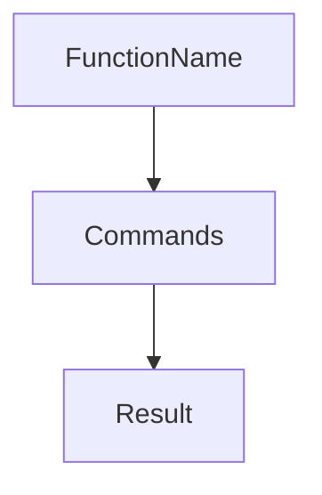
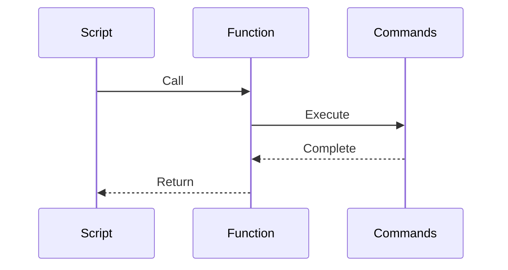
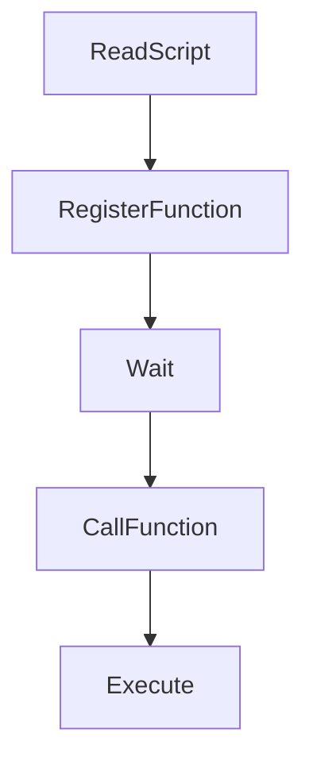
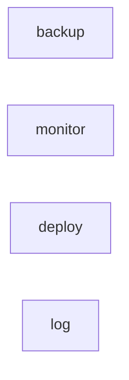
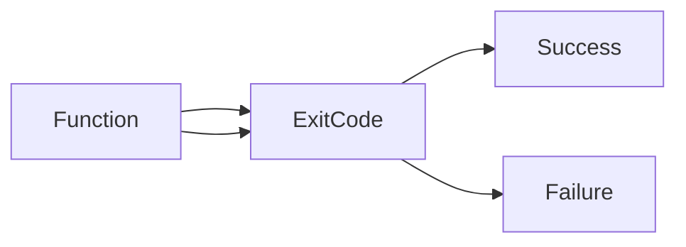
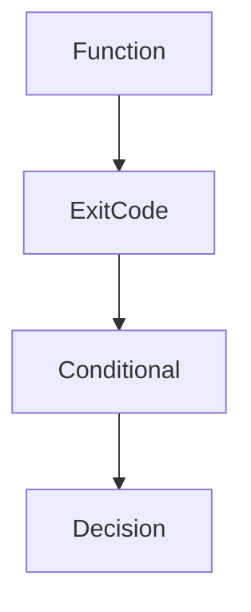
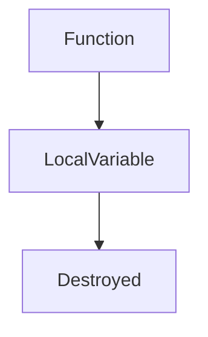
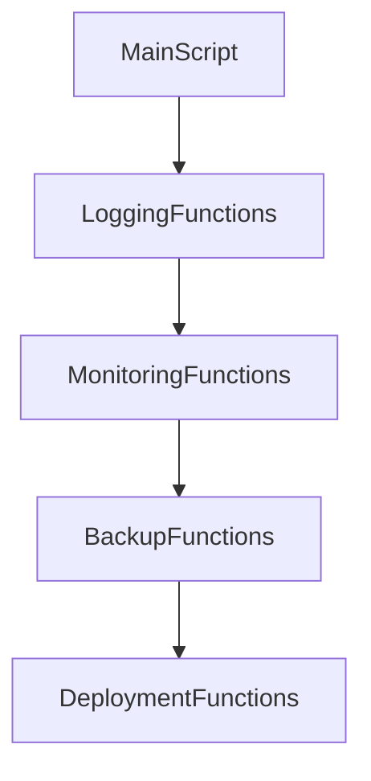
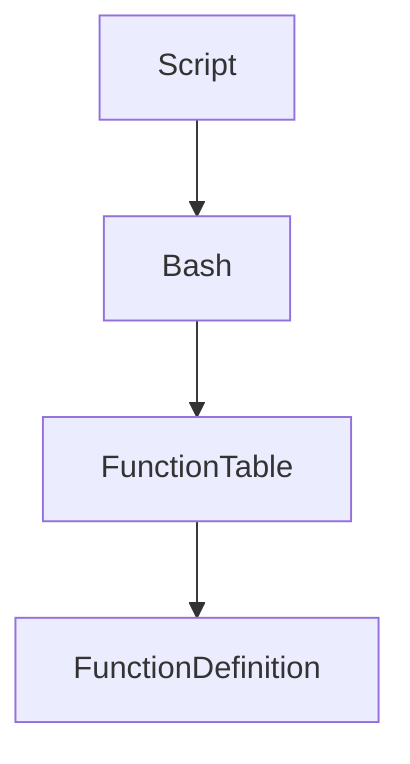

# Lab 05 — Functions: Building Reusable Automation Like an Engineer

> Linux Fundamentals Mastery
>
> Bash Scripting Labs Series
>
> Track:
>
> Linux Fundamentals → Automation → Software Engineering → Platform Engineering
>
> Lab Goal:
>
> Understand why functions exist, how they transform scripts from command collections into engineered systems, how Linux administrators and DevOps engineers build reusable automation, and how functions become the foundation of production-grade Bash scripting.

---

# Why This Lab Exists

Most beginners write scripts like this:

```bash
#!/bin/bash

echo "Checking disk usage..."
df -h

echo "Checking memory..."
free -h

echo "Checking disk usage..."
df -h

echo "Checking memory..."
free -h

echo "Checking disk usage..."
df -h
```

It works.

But it creates a problem:

```text
Repeated Code
```

Now imagine:

```text
500 Lines

1000 Lines

5000 Lines
```

of duplicated logic.

Maintenance becomes impossible.

Functions exist to solve this problem.

---

# The Most Important Lesson

Without functions:

```text
Scripts Are Lists Of Commands
```

With functions:

```text
Scripts Become Systems
```

Functions allow engineers to:

```text
Organize Logic

Reuse Logic

Maintain Logic

Scale Logic
```

This is the first major step from:

```text
Scripting

→

Engineering
```

---

# Mental Model

Imagine a factory.

Without specialization:

```text
Every Worker

Knows Every Task
```

Chaos.

With specialization:

```text
Worker A → Packaging

Worker B → Shipping

Worker C → Quality Control
```

Each worker performs one job well.

Functions are specialized workers.

---

# The Fundamental Problem

Suppose you need:

```text
Health Checks
```

for:

```text
CPU

Memory

Disk

Network
```

Without functions:

```bash
echo "CPU Check"
...

echo "Memory Check"
...

echo "Disk Check"
...
```

Repeated everywhere.

With functions:

```bash
check_cpu

check_memory

check_disk
```

Cleaner.

More maintainable.

More scalable.

---

# What Is A Function?

A function is:

```text
A Named Block Of Reusable Logic
```

---

# Visualization



Instead of repeating commands:

```text
Call Function
```

---

# Real-World Analogy

Think of a restaurant.

You don't train every employee to:

```text
Cook

Serve

Clean

Manage Inventory
```

Instead:

```text
Kitchen Team

Serving Team

Cleaning Team
```

Functions create specialization inside automation.

---

# Why Functions Matter

Functions solve:

```text
Code Duplication

Complexity

Maintenance Problems

Scalability Problems
```

Production automation depends heavily on functions.

---

# Basic Function Syntax

```bash
function_name() {

    commands

}
```

---

# Example

```bash
hello() {

    echo "Hello Linux"

}
```

Call function:

```bash
hello
```

Output:

```text
Hello Linux
```

---

# Function Execution Flow



---

# Lab 1 — First Function

Create:

```bash
nano functions.sh
```

Content:

```bash
#!/bin/bash

greet() {

    echo "Welcome To Linux Engineering"

}

greet
```

Run:

```bash
bash functions.sh
```

Observe execution.

---

# What Bash Is Doing

Step 1:

```text
Read Function Definition
```

Step 2:

```text
Store Function
```

Step 3:

```text
Wait For Function Call
```

Step 4:

```text
Execute Function
```

---

# Internal Visualization



---

# Why Functions Are Powerful

Imagine:

```bash
backup_database
```

Instead of:

```bash
pg_dump ...
gzip ...
upload ...
verify ...
log ...
```

One name.

Many actions.

Abstraction begins.

---

# Lab 2 — Multiple Functions

```bash
#!/bin/bash

cpu_check() {

    echo "Checking CPU"

}

memory_check() {

    echo "Checking Memory"

}

cpu_check

memory_check
```

Observe modular design.

---

# Engineering Principle

Functions should do:

```text
One Thing Well
```

Bad:

```text
Backup

Monitoring

Deployment

Logging

Everything
```

inside one function.

Good:

```text
backup()

monitor()

deploy()

log()
```

---

# Visualization



Small specialized units.

---

# Function Parameters

Functions become powerful when they accept data.

Example:

```bash
greet() {

    echo "Hello $1"

}
```

Call:

```bash
greet Linux
```

Output:

```text
Hello Linux
```

---

# Understanding $1

Function arguments:

| Variable | Meaning         |
| -------- | --------------- |
| $1       | First Argument  |
| $2       | Second Argument |
| $3       | Third Argument  |

---

# Visualization

```text
greet Linux

↓

$1

↓

Linux
```

---

# Lab 3 — Greeting Function

```bash
#!/bin/bash

greet() {

    echo "Welcome $1"

}

greet DevOps

greet SRE

greet PlatformEngineer
```

Output:

```text
Welcome DevOps

Welcome SRE

Welcome PlatformEngineer
```

---

# Why Parameters Matter

Without parameters:

```text
Static Functions
```

With parameters:

```text
Reusable Functions
```

---

# Production Example

Instead of:

```bash
backup_server1

backup_server2

backup_server3
```

Use:

```bash
backup server1

backup server2

backup server3
```

Much cleaner.

---

# Multiple Parameters

Example:

```bash
create_user() {

    echo "User: $1"

    echo "Role: $2"

}
```

Call:

```bash
create_user alice admin
```

Output:

```text
User: alice

Role: admin
```

---

# Lab 4 — Server Deployment Function

```bash
deploy() {

    echo "Deploying To $1"

}
```

Call:

```bash
deploy web01

deploy web02

deploy web03
```

Observe reuse.

---

# Function Return Values

Bash functions primarily return:

```text
Exit Codes
```

Just like Linux commands.

---

# Example

```bash
success() {

    return 0

}
```

---

```bash
failure() {

    return 1

}
```

---

# Visualization



---

# Why Return Codes Matter

Linux automation depends on:

```text
Success

Failure
```

not:

```text
True

False
```

in the traditional programming sense.

---

# Lab 5 — Success And Failure

```bash
test_backup() {

    return 0

}

test_backup

echo $?
```

Output:

```text
0
```

Success.

---

# Functions Inside Conditionals

Example:

```bash
check_service() {

    systemctl is-active nginx >/dev/null

}
```

Use:

```bash
if check_service
then
    echo "Healthy"
else
    echo "Failed"
fi
```

---

# Visualization



This pattern powers production automation.

---

# Function Scope

Variables inside functions can leak.

Example:

```bash
test() {

    NAME="Linux"

}
```

Accessible outside.

---

# Better Approach

Use:

```bash
local NAME="Linux"
```

---

# Why local Matters

Prevents:

```text
Unexpected Variable Changes
```

---

# Visualization



after function ends.

---

# Lab 6 — Local Variables

```bash
test_function() {

    local NAME="Linux"

    echo $NAME

}

test_function
```

Observe normal behavior.

---

# Function Libraries

Production engineers often create:

```text
Shared Function Collections
```

Example:

```text
logging.sh

network.sh

backup.sh

monitoring.sh
```

---

# Architecture Example



This is how large Bash projects are structured.

---

# Functions And DRY Principle

One of the most important engineering concepts.

DRY:

```text
Don't Repeat Yourself
```

Bad:

```text
Same Logic

Repeated Everywhere
```

Good:

```text
Logic Written Once

Function Reused Many Times
```

Functions enable DRY.

---

# Linux Internals

When Bash reads:

```bash
check_disk() {

    df -h

}
```

it stores:

```text
Function Name

↓

Command Block
```

inside shell memory.

Execution occurs only when called.

---

# Internal Architecture



Functions become reusable objects within the shell.

---

# Production Example 1

## Health Check Framework

```bash
check_cpu()

check_memory()

check_disk()

check_network()
```

Each function performs one responsibility.

---

# Production Example 2

## Deployment Pipeline

```bash
pull_code()

run_tests()

build_application()

deploy_application()
```

Functions organize deployment logic.

---

# Production Example 3

## Monitoring System

```bash
collect_metrics()

check_thresholds()

send_alerts()
```

Modular automation.

---

# Production Example 4

## Backup Framework

```bash
backup_database()

backup_files()

verify_backup()

upload_backup()
```

Real-world architecture.

---

# Docker Connection

Deployment scripts often contain:

```bash
build_image()

push_image()

deploy_container()
```

Functions simplify container automation.

---

# Kubernetes Connection

Cluster automation frequently uses:

```bash
check_pods()

restart_pods()

validate_cluster()
```

as reusable functions.

---

# Cloud Connection

Infrastructure automation commonly includes:

```bash
create_instance()

attach_storage()

configure_network()
```

Functions organize cloud operations.

---

# Performance Considerations

Functions are:

```text
Extremely Lightweight
```

Bash stores definitions in memory.

Execution overhead is minimal.

---

# Scalability Considerations

Small scripts:

```text
Optional
```

Large scripts:

```text
Essential
```

Once scripts exceed:

```text
100+

200+

500+ Lines
```

functions become mandatory.

---

# Common Mistakes

## Mistake 1

Duplicating code.

---

## Mistake 2

Creating giant functions.

Bad:

```text
1000 Line Function
```

---

## Mistake 3

Ignoring parameters.

---

## Mistake 4

Not using local variables.

---

## Mistake 5

Functions doing multiple unrelated tasks.

---

# Engineering Mindset

Beginner:

```text
Functions Reduce Typing
```

Linux User:

```text
Functions Reuse Logic
```

Administrator:

```text
Functions Organize Automation
```

DevOps Engineer:

```text
Functions Create Reusable Infrastructure Workflows
```

Platform Engineer:

```text
Functions Build Operational Frameworks
```

SRE:

```text
Functions Standardize Reliability Operations
```

That progression moves scripting toward software engineering.

---

# Interview Questions

### Beginner

What is a function?

### Beginner

Why use functions?

### Intermediate

How are parameters passed?

### Intermediate

What is $1?

### Intermediate

What does local do?

### Advanced

How do functions improve maintainability?

### Advanced

How are functions stored internally by Bash?

### Advanced

How would you structure a 1000-line Bash project?

### Advanced

Why are functions critical for DevOps automation?

### Advanced

Design a reusable deployment framework using functions.

---

# Cheat Sheet

Create function:

```bash
my_function() {

    commands

}
```

Call function:

```bash
my_function
```

First argument:

```bash
$1
```

Second argument:

```bash
$2
```

Return success:

```bash
return 0
```

Return failure:

```bash
return 1
```

Local variable:

```bash
local NAME="Linux"
```

Function with parameter:

```bash
greet() {

    echo "Hello $1"

}
```

Call:

```bash
greet Linux
```

---

# Lab Success Criteria

You should now be able to:

* Understand why functions exist
* Create reusable functions
* Pass arguments to functions
* Use return codes
* Integrate functions with conditionals
* Use local variables
* Apply DRY principles
* Organize large Bash projects
* Connect functions to DevOps workflows
* Think like an automation engineer

At this point, you should stop thinking:

```text
How Do I Write More Commands?
```

and start thinking:

```text
How Do I Build Reusable

Maintainable

Scalable

Operational Components

That Can Be Combined

Into Larger Automation Systems?
```

Because functions are the bridge between simple scripts and production-grade engineering.
