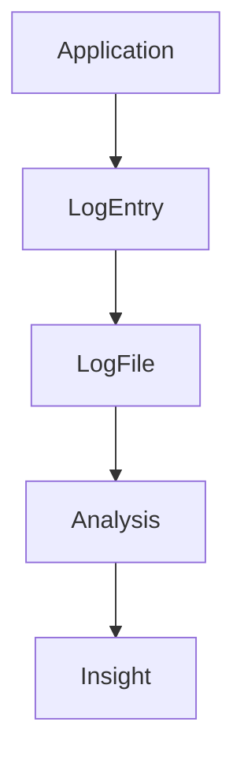
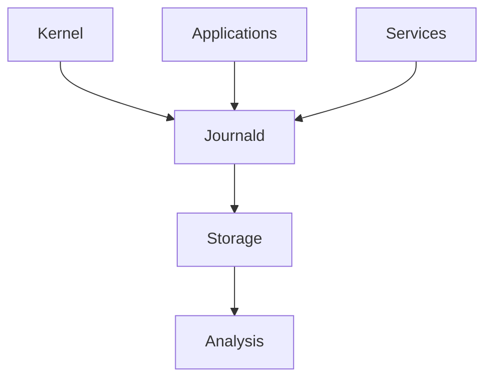
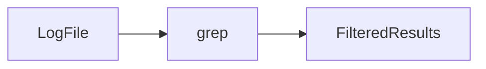
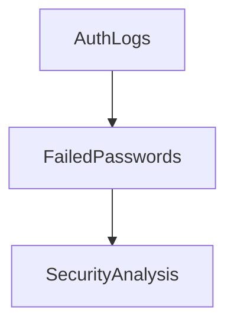
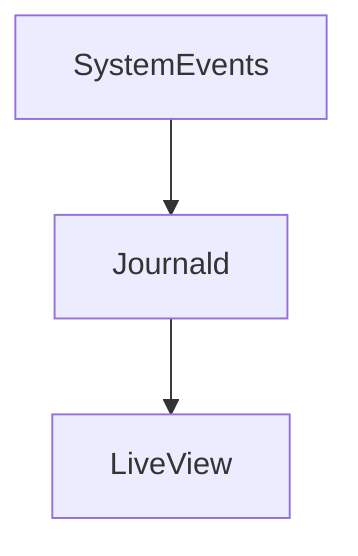
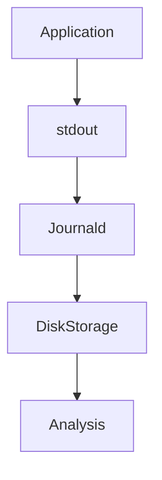

# Lab 06 — Log Processing: Learning to Read the Story of a Linux System

> Linux Fundamentals Mastery
>
> Bash Scripting Labs Series
>
> Track:
>
> Linux Fundamentals → Observability → Troubleshooting → SRE Engineering
>
> Lab Goal:
>
> Learn how Linux logs work, how engineers extract information from millions of log lines, how Bash becomes a log analysis engine, and how production teams use logs to investigate failures, security incidents, and performance problems.

---

# Why This Lab Exists

When beginners encounter a problem:

```text
Application Crashed
```

They often ask:

```text
What Happened?
```

Linux already knows.

The answer is usually stored in:

```text
Logs
```

The challenge is not:

```text
Generating Logs
```

The challenge is:

```text
Finding Meaning
Inside Massive Amounts Of Data
```

Modern systems generate:

```text
Thousands

Millions

Billions
```

of log entries.

Engineers must transform:

```text
Raw Events
```

into:

```text
Operational Intelligence
```

This is log processing.

---

# The Most Important Lesson

Logs are not:

```text
Text Files
```

Logs are:

```text
Historical Records

Of System Behavior
```

Every log line answers:

```text
What Happened?

When Did It Happen?

Why Did It Happen?

What Happened Next?
```

---

# Mental Model

Think of a log file as:

```text
A Flight Recorder
```

inside an aircraft.

When something goes wrong:

```text
Engineers Read The Recorder
```

to reconstruct events.

Linux logs serve the same purpose.

---

# The Fundamental Problem

Suppose:

```text
Website Offline
```

Question:

```text
Why?
```

Possible causes:

```text
Application Crash

Database Failure

Disk Full

Network Outage

Security Attack
```

The answer is usually buried inside logs.

---

# The Value Of Logs

Logs reveal:

```text
User Activity

System Activity

Application Activity

Security Events

Infrastructure Events
```

Without logs:

```text
Troubleshooting Becomes Guessing
```

---

# Understanding Log Flow



This pipeline powers observability.

---

# Linux Logging Architecture

Modern Linux systems generate logs from:

```text
Kernel

Applications

Services

Containers

Databases

Web Servers
```

---

# Architecture Visualization



---

# Common Log Locations

System logs:

```bash
/var/log/
```

Examples:

```text
/var/log/syslog

/var/log/messages

/var/log/auth.log

/var/log/kern.log
```

---

# Why Logs Matter

Logs provide:

```text
Observability
```

Observability answers:

```text
What Is Happening?

Why Is It Happening?

What Will Happen Next?
```

---

# Lab 1 — Explore Log Files

View log directory:

```bash
ls -lh /var/log
```

Observe:

```text
Many Files

Different Purposes

Different Sizes
```

Think:

```text
Each File Tells A Different Story
```

---

# Understanding Log Structure

Typical log:

```text
Jun 25 10:00:01 server sshd[1234]: User login successful
```

Components:

```text
Timestamp

Hostname

Service

Message
```

---

# Visualization

```text
Timestamp
     ↓
Jun 25 10:00:01

Hostname
     ↓
server

Service
     ↓
sshd

Event
     ↓
User login successful
```

---

# Lab 2 — Read Logs

View:

```bash
cat /var/log/syslog
```

or:

```bash
journalctl
```

Observe:

```text
Events Ordered By Time
```

Logs are timelines.

---

# Why Time Matters

Most investigations answer:

```text
What Happened Before?

What Happened During?

What Happened After?
```

Time ordering is critical.

---

# Better Than cat

Large logs require:

```bash
less /var/log/syslog
```

Navigate:

```text
Up

Down

Search

Jump
```

Efficiently.

---

# The First Log Processing Tool

## grep

Searches text.

Example:

```bash
grep sshd /var/log/auth.log
```

Shows:

```text
Only SSH Events
```

---

# Visualization



---

# Why grep Is Powerful

Instead of reading:

```text
1 Million Lines
```

Read:

```text
50 Relevant Lines
```

---

# Lab 3 — Search For Errors

Example:

```bash
grep ERROR application.log
```

Or:

```bash
grep Failed auth.log
```

Observe:

```text
Focused Investigation
```

---

# Case Insensitive Search

Example:

```bash
grep -i error application.log
```

Matches:

```text
error

Error

ERROR
```

---

# Counting Events

Example:

```bash
grep ERROR app.log | wc -l
```

Output:

```text
Number Of Errors
```

---

# Why Counts Matter

Production engineers often ask:

```text
How Many Failures?

How Many Requests?

How Many Login Attempts?
```

---

# Lab 4 — Count Login Events

```bash
grep sshd /var/log/auth.log | wc -l
```

Measure activity.

---

# Extracting Patterns

Example:

```bash
grep "Failed password" /var/log/auth.log
```

Useful for:

```text
Security Analysis
```

---

# Security Investigation Example

Find failed logins:

```bash
grep "Failed password" auth.log
```

Questions:

```text
Single User?

Repeated Attempts?

Possible Attack?
```

---

# Visualization



---

# Using awk

awk extracts fields.

Example:

```bash
awk '{print $1}' logfile
```

Outputs:

```text
First Column
```

---

# Why awk Matters

Logs contain:

```text
Structured Information
```

awk extracts:

```text
IPs

Users

Status Codes

Timestamps
```

---

# Lab 5 — Extract IP Addresses

Example log:

```text
192.168.1.10 login success
```

Command:

```bash
awk '{print $1}' access.log
```

Output:

```text
192.168.1.10
```

---

# Visualization

```text
Log Entry

↓

Field Extraction

↓

Useful Data
```

---

# Sorting Data

Example:

```bash
sort access.log
```

Orders entries.

---

# Unique Values

Example:

```bash
sort access.log | uniq
```

Removes duplicates.

---

# Why Unique Matters

Find:

```text
Unique Users

Unique IPs

Unique Hosts
```

---

# Lab 6 — Top Login Sources

```bash
awk '{print $1}' access.log | sort | uniq -c
```

Output:

```text
Count IP
```

Powerful operational insight.

---

# Understanding Pipelines

Linux's superpower:

```bash
grep ERROR app.log | awk '{print $1}' | sort | uniq
```

---

# Visualization


Each tool performs one task.

Together:

```text
Complex Analysis
```

---

# Production Log Analysis

Example:

```bash
grep 500 access.log
```

Find:

```text
Server Errors
```

---

Count:

```bash
grep 500 access.log | wc -l
```

Measure impact.

---

# HTTP Log Investigation

Typical entry:

```text
10.0.0.5 GET /api 500
```

Questions:

```text
Who?

What Endpoint?

What Status Code?
```

Logs answer all three.

---

# Lab 7 — Analyze Web Errors

Create:

```text
10.0.0.1 GET /home 200
10.0.0.2 GET /login 500
10.0.0.3 GET /api 500
```

Find errors:

```bash
grep 500 access.log
```

Count:

```bash
grep 500 access.log | wc -l
```

---

# Working With journalctl

Modern Linux systems use:

```text
journald
```

View logs:

```bash
journalctl
```

---

# Service Logs

Example:

```bash
journalctl -u nginx
```

Observe:

```text
Service History
```

---

# Recent Events

Example:

```bash
journalctl -n 50
```

Shows:

```text
Latest 50 Events
```

---

# Live Monitoring

Equivalent of:

```text
Watching The System In Real Time
```

Command:

```bash
journalctl -f
```

---

# Visualization



---

# Real-Time Monitoring

Example:

```bash
journalctl -u nginx -f
```

Observe events as they happen.

Critical during incidents.

---

# Linux Internals

Log generation flow:



Every event becomes historical evidence.

---

# Production Example 1

## Service Failure Investigation

```bash
journalctl -u nginx
```

Questions:

```text
Why Did Startup Fail?
```

Logs provide answers.

---

# Production Example 2

## Security Incident

```bash
grep "Failed password" auth.log
```

Detect:

```text
Brute Force Attempts
```

---

# Production Example 3

## API Outage

```bash
grep ERROR api.log
```

Find:

```text
Exceptions

Database Errors

Timeouts
```

---

# Production Example 4

## Kubernetes Debugging

```bash
kubectl logs pod-name
```

Same principle.

Different platform.

Logs remain critical.

---

# Docker Connection

View container logs:

```bash
docker logs container-id
```

Log analysis remains identical.

---

# Kubernetes Connection

```bash
kubectl logs pod-name
```

Modern cloud-native systems still depend on logs.

---

# Cloud Connection

Cloud providers generate:

```text
Application Logs

Audit Logs

Security Logs

Network Logs
```

Log processing remains fundamental.

---

# Performance Considerations

Small log:

```text
Easy
```

Large log:

```text
Gigabytes

Terabytes
```

Requires efficient filtering.

---

# Common Bottlenecks

Processing:

```text
Huge Files

Complex Regex

Network Storage
```

can become expensive.

---

# Scaling Log Analysis

Evolution:

```text
grep

↓

awk

↓

Centralized Logging

↓

ELK

↓

Splunk

↓

Cloud Logging Platforms
```

All begin with simple Bash log processing.

---

# Common Mistakes

## Mistake 1

Reading entire logs manually.

---

## Mistake 2

Ignoring timestamps.

---

## Mistake 3

Searching without filtering.

---

## Mistake 4

Ignoring error frequency.

---

## Mistake 5

Focusing on symptoms instead of root causes.

---

# Engineering Mindset

Beginner:

```text
Logs Show Messages
```

Linux User:

```text
Logs Explain Problems
```

Administrator:

```text
Logs Support Troubleshooting
```

DevOps Engineer:

```text
Logs Provide Observability
```

SRE:

```text
Logs Reveal Failure Patterns
```

Platform Engineer:

```text
Logs Become Operational Intelligence
```

That progression transforms log reading into system understanding.

---

# Interview Questions

### Beginner

What is a log file?

### Beginner

Where are Linux logs stored?

### Intermediate

What does grep do?

### Intermediate

What does journalctl do?

### Intermediate

Why are timestamps important?

### Advanced

How would you investigate a service failure?

### Advanced

How would you identify a brute-force attack?

### Advanced

Difference between logs, metrics, and traces?

### Advanced

How do centralized logging systems work?

### Advanced

Design a log analysis pipeline for a large platform.

---

# Cheat Sheet

View logs:

```bash
cat logfile
```

Search:

```bash
grep ERROR logfile
```

Case-insensitive:

```bash
grep -i error logfile
```

Count:

```bash
wc -l logfile
```

Extract field:

```bash
awk '{print $1}'
```

Sort:

```bash
sort logfile
```

Unique:

```bash
uniq
```

Service logs:

```bash
journalctl -u nginx
```

Recent logs:

```bash
journalctl -n 100
```

Live logs:

```bash
journalctl -f
```

---

# Lab Success Criteria

You should now be able to:

* Understand why logs exist
* Navigate Linux log files
* Search logs efficiently
* Extract information using grep
* Analyze fields using awk
* Count and summarize events
* Investigate service failures
* Analyze security events
* Work with journalctl
* Think like an observability engineer

At this point, you should stop thinking:

```text
Logs Are Just Text Files
```

and start thinking:

```text
Logs Are The Historical Memory

Of A Linux System

Containing The Evidence

Needed To Explain

Failures

Performance Problems

Security Incidents

And Operational Behavior
```

Because every production investigation eventually becomes a log investigation.
