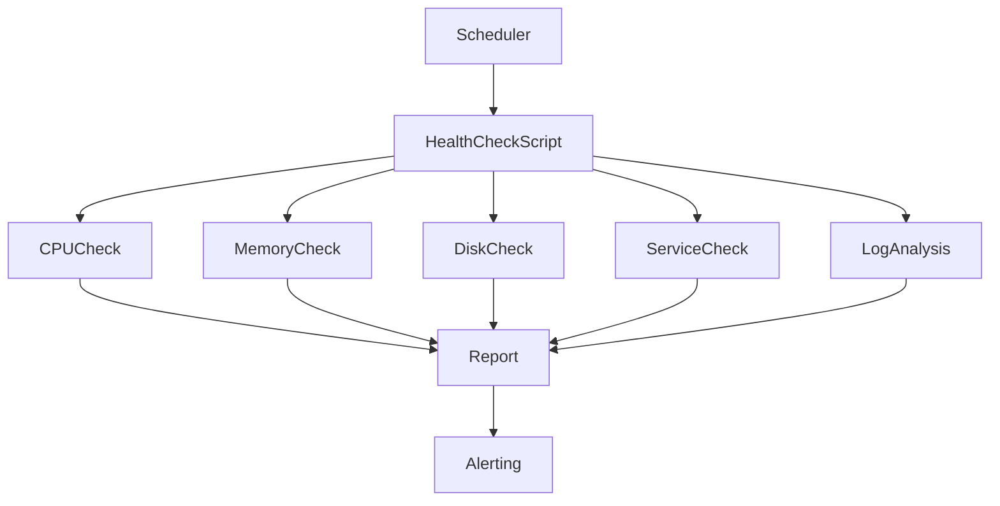
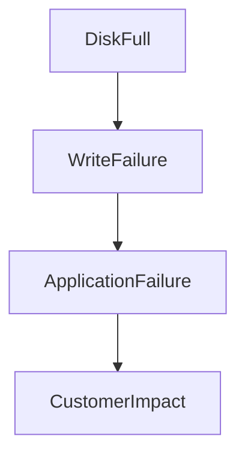
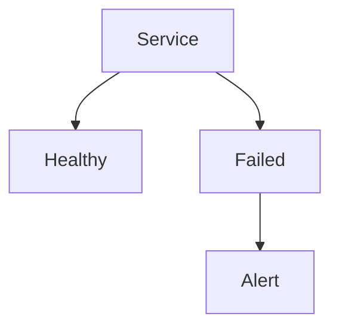
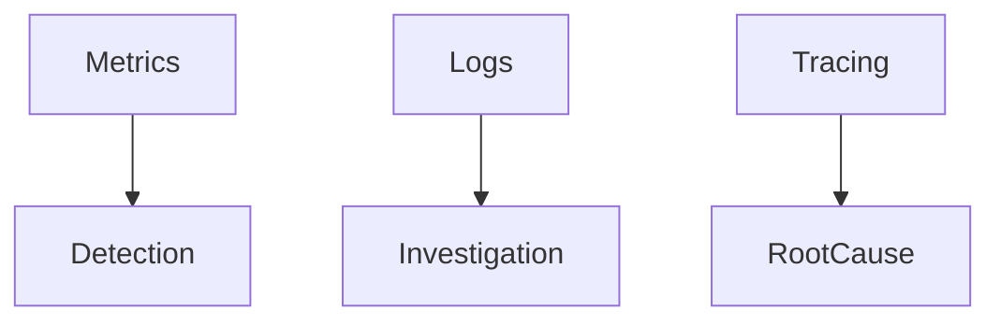
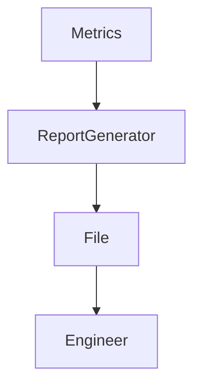
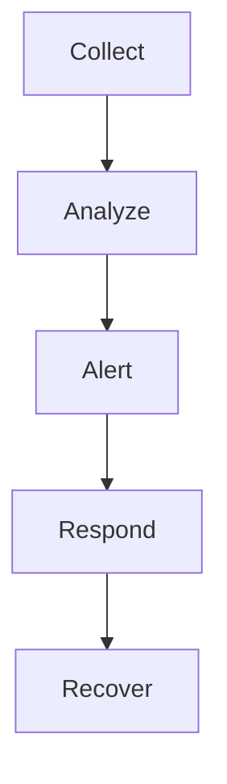
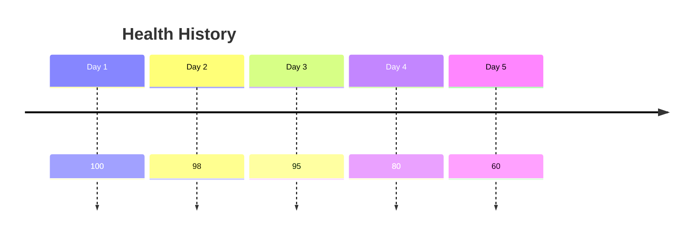
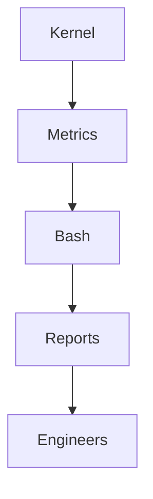

# Lab 07 — Automation Project: Building a Production-Grade Linux Server Health Monitoring System

> Linux Fundamentals Mastery
>
> Bash Scripting Labs Series
>
> Track:
>
> Linux Fundamentals → Automation → Observability → SRE Engineering
>
> Project Type:
>
> End-to-End Real-World Automation Project
>
> Lab Goal:
>
> Build a complete Linux server monitoring and health-check automation system using Bash. Learn how real infrastructure teams automate operational visibility, collect system metrics, generate reports, detect failures, and build the foundation of modern monitoring platforms.

---

# Why This Project Exists

Up until now you've learned:

```text
Variables

Conditionals

Loops

Functions

Log Processing
```

But production engineers don't learn these concepts separately.

They combine them into:

```text
Automation Systems
```

This project teaches how all Bash concepts work together.

---

# The Reality Of Production Systems

Imagine you are responsible for:

```text
10 Servers
```

Checking health manually is possible.

Now imagine:

```text
100 Servers
```

Still possible.

Now imagine:

```text
10,000 Servers
```

Manual monitoring becomes impossible.

Automation becomes mandatory.

---

# The Most Important Lesson

Modern infrastructure is built on one idea:

```text
Humans Don't Scale

Automation Does
```

This project teaches that mindset.

---

# What We Are Building

A complete monitoring system that checks:

```text
CPU Usage

Memory Usage

Disk Usage

Load Average

Running Services

Network Connectivity

Log Errors

System Uptime
```

and generates:

```text
Health Reports

Alerts

Historical Records
```

---

# Final Architecture



---

# Why This Matters

Every monitoring platform eventually performs:

```text
Collect

Analyze

Decide

Alert
```

The same workflow we'll build here.

---

# Project Directory Structure

```text
server-monitor/

├── monitor.sh
├── reports/
├── logs/
├── config/
│
├── cpu.sh
├── memory.sh
├── disk.sh
├── network.sh
├── services.sh
└── alerts.sh
```

This mirrors real automation projects.

---

# Phase 1 — Basic Health Check Script

Create:

```bash
mkdir server-monitor

cd server-monitor
```

Create:

```bash
nano monitor.sh
```

---

# Project Skeleton

```bash
#!/bin/bash

echo "======================"
echo "Server Health Report"
echo "======================"
```

Run:

```bash
bash monitor.sh
```

---

# Why Start Small?

Production systems evolve:

```text
Simple

↓

Useful

↓

Reliable

↓

Scalable
```

Never build everything at once.

---

# Phase 2 — CPU Monitoring

Add function:

```bash
cpu_check() {

    echo "CPU Information"

    top -bn1 | head -5

}
```

Call:

```bash
cpu_check
```

---

# Why CPU Matters

High CPU usage often indicates:

```text
Traffic Spike

Infinite Loop

Runaway Process

Resource Starvation
```

---

# CPU Monitoring Architecture


---

# Phase 3 — Memory Monitoring

Function:

```bash
memory_check() {

    echo "Memory Information"

    free -h

}
```

Call:

```bash
memory_check
```

---

# Why Memory Matters

Memory exhaustion causes:

```text
Application Crashes

OOM Kills

Performance Degradation
```

---

# Production Incident Example

```text
Traffic Increase

↓

Memory Exhausted

↓

OOM Killer

↓

Application Terminated
```

Monitoring prevents surprises.

---

# Phase 4 — Disk Monitoring

Function:

```bash
disk_check() {

    echo "Disk Usage"

    df -h

}
```

---

# Why Disk Monitoring Is Critical

Disk full incidents are among the most common Linux outages.

Symptoms:

```text
Database Failures

Application Errors

Log Failures

Backup Failures
```

---

# Disk Failure Chain



---

# Phase 5 — Service Monitoring

Check important services.

Example:

```bash
service_check() {

    systemctl is-active nginx

}
```

---

# Better Version

```bash
service_check() {

    if systemctl is-active nginx >/dev/null
    then
        echo "nginx OK"

    else
        echo "nginx FAILED"
    fi

}
```

---

# Why Service Monitoring Exists

Customers don't care:

```text
CPU Usage
```

Customers care:

```text
Can I Use The Service?
```

---

# Service Health Flow



---

# Phase 6 — Network Monitoring

Function:

```bash
network_check() {

    ping -c 2 8.8.8.8

}
```

---

# Why Network Checks Matter

Many outages are actually:

```text
Routing Problems

DNS Failures

Internet Connectivity Issues
```

---

# Connectivity Architecture


---

# Phase 7 — Log Monitoring

Search for errors.

Example:

```bash
log_check() {

    grep -i error /var/log/syslog | tail -10

}
```

---

# Why Logs Matter

Metrics tell you:

```text
Something Is Wrong
```

Logs tell you:

```text
Why It Is Wrong
```

---

# Observability Pyramid



---

# Phase 8 — Generate Health Score

Create a simple score.

Example:

```bash
HEALTH=100
```

Subtract points for:

```text
Service Failures

Disk Issues

Network Failures
```

---

# Example

```bash
if ! systemctl is-active nginx >/dev/null
then
    HEALTH=$((HEALTH-20))
fi
```

---

# Why Scoring Matters

Humans understand:

```text
Health = 95
```

faster than:

```text
200 Pages Of Logs
```

---

# Phase 9 — Report Generation

Create reports directory.

```bash
mkdir reports
```

---

Store report:

```bash
REPORT="reports/report-$(date +%F).txt"
```

---

Write:

```bash
echo "Health Report" > "$REPORT"
```

Append:

```bash
echo "CPU Check" >> "$REPORT"
```

---

# Report Flow



---

# Example Report

```text
Server Health Report

Date: 2026-01-01

CPU: OK

Memory: OK

Disk: OK

Network: OK

nginx: OK

Health Score: 100
```

---

# Phase 10 — Automated Alerts

Example:

```bash
if [ "$HEALTH" -lt 80 ]
then
    echo "ALERT: Health Critical"
fi
```

---

# Why Alerts Exist

Monitoring without alerting is:

```text
Data Collection

Not Monitoring
```

---

# Monitoring Lifecycle



---

# Advanced Project Upgrade 1

Monitor multiple services.

Example:

```bash
SERVICES="nginx ssh docker"
```

Loop:

```bash
for service in $SERVICES
do
    systemctl is-active "$service"
done
```

---

# Why Loops Matter

Real environments have:

```text
10+

100+

1000+
```

services.

Automation scales monitoring.

---

# Advanced Project Upgrade 2

Log Historical Metrics

Store:

```bash
date >> history.log
```

Save health score:

```bash
echo "$HEALTH" >> history.log
```

Build trend analysis.

---

# Historical Monitoring



Trends reveal failures before outages occur.

---

# Advanced Project Upgrade 3

Top Resource Consumers

Example:

```bash
ps aux --sort=-%cpu | head
```

---

Find:

```text
CPU Hogs

Memory Hogs
```

---

# Why This Matters

Most incidents eventually become:

```text
Find The Process

Causing The Problem
```

---

# Advanced Project Upgrade 4

Disk Alerting

Example:

```bash
USAGE=$(df / | awk 'NR==2 {print $5}' | tr -d '%')
```

---

Check:

```bash
if [ "$USAGE" -gt 80 ]
then
    echo "Disk Warning"
fi
```

---

# Real Production Example

This exact pattern exists inside:

```text
Nagios

Zabbix

Prometheus Exporters

Cloud Monitoring Systems
```

The concepts are identical.

---

# Linux Internals

Monitoring works because Linux exposes:

```text
/proc

/sys

System Calls

Kernel Metrics
```

Everything eventually comes from the kernel.

---

# Monitoring Architecture



---

# Docker Connection

Monitor:

```bash
docker ps
```

Check:

```bash
docker stats
```

Same monitoring principles.

---

# Kubernetes Connection

Monitor:

```bash
kubectl get pods
```

Check:

```bash
kubectl top pods
```

Cluster monitoring is an evolution of the same concepts.

---

# Cloud Connection

Cloud monitoring systems collect:

```text
CPU

Memory

Disk

Network

Application Metrics
```

exactly like this project.

---

# Production Scenario

Imagine:

```text
E-Commerce Website
```

Traffic spike occurs.

Monitoring detects:

```text
CPU = 95%

Memory = 90%

Response Time Increasing
```

Alert fires.

Engineers respond before outage.

This is why monitoring exists.

---

# Common Mistakes

## Mistake 1

Collecting data without analysis.

---

## Mistake 2

Monitoring too many things.

---

## Mistake 3

Ignoring historical trends.

---

## Mistake 4

No alerting.

---

## Mistake 5

No reports.

---

## Mistake 6

Monitoring symptoms instead of causes.

---

# Engineering Mindset

Beginner:

```text
How Do I Check CPU?
```

Linux User:

```text
How Do I Check CPU Automatically?
```

Administrator:

```text
How Do I Monitor The Server?
```

DevOps Engineer:

```text
How Do I Monitor Hundreds Of Servers?
```

SRE:

```text
How Do I Detect Failure Before Users Notice?
```

Platform Engineer:

```text
How Do I Build Reliable Observability Systems?
```

That progression defines modern operations.

---

# Interview Questions

### Beginner

Why do monitoring systems exist?

### Intermediate

What metrics should every server monitor?

### Intermediate

Why is disk monitoring important?

### Advanced

How would you design a health monitoring script?

### Advanced

Difference between metrics and logs?

### Advanced

How would you detect early warning signs of outages?

### Advanced

Design a monitoring architecture for 1000 servers.

### Advanced

How does monitoring integrate with incident response?

---

# Final Challenge

Extend the project to include:

```text
Email Alerts

Slack Alerts

Service Recovery

Automatic Restarts

Historical Dashboards

Multiple Server Monitoring

Container Monitoring

Kubernetes Monitoring
```

---

# Lab Success Criteria

You should now be able to:

* Build a complete Bash automation project
* Monitor Linux system health
* Use variables, loops, functions, and conditionals together
* Generate reports
* Process logs
* Detect failures
* Create alerts
* Understand monitoring architecture
* Connect Bash automation to modern observability systems
* Think like a Linux administrator, DevOps engineer, and SRE

At this point, you should stop thinking:

```text
How Do I Write Bash Scripts?
```

and start thinking:

```text
How Do I Build Reliable

Observable

Automated

Self-Monitoring Systems

That Reduce Human Work

And Increase Infrastructure Reliability?
```

Because that is the real purpose of automation engineering.
