# Lab 08 — Production Maintenance Script: Building a Real Linux Operations Automation Framework

> Linux Fundamentals Mastery
>
> Bash Scripting Labs Series
>
> Track:
>
> Linux Fundamentals → Automation → Operations Engineering → SRE Engineering
>
> Lab Goal:
>
> Build a production-style Linux maintenance automation system that performs routine operational tasks automatically, generates maintenance reports, detects unhealthy systems, cleans resources safely, and demonstrates how real infrastructure teams manage servers at scale.

---

# Why This Lab Exists

Most Linux learning ends at:

```bash
ls
cp
mv
grep
```

Some engineers continue to:

```bash
if
for
while
functions
```

But real production engineers eventually ask:

```text
How Do We Maintain Hundreds

Or Thousands

Of Linux Systems

Without Hiring Hundreds

Of Engineers?
```

The answer is:

```text
Operations Automation
```

---

# The Reality Of Production

Every Linux server accumulates:

```text
Logs

Temporary Files

Zombie Processes

Old Backups

Unused Packages

Disk Fragmentation

Resource Pressure
```

Over time:

```text
Healthy Server

↓

Degraded Server

↓

Unstable Server

↓

Outage
```

Maintenance prevents this progression.

---

# The Most Important Lesson

Production operations are not:

```text
Fixing Problems
```

Production operations are:

```text
Preventing Problems
```

before users notice them.

---

# Mental Model

Think of Linux servers like cars.

You can:

```text
Drive Until Failure
```

or:

```text
Perform Maintenance

And Avoid Failure
```

Production engineers choose maintenance.

---

# What We Are Building

A maintenance framework that:

```text
Checks Disk Usage

Checks Memory Usage

Analyzes Logs

Removes Temporary Files

Archives Old Logs

Detects Failed Services

Generates Reports

Calculates Health Scores
```

---

# Final Architecture

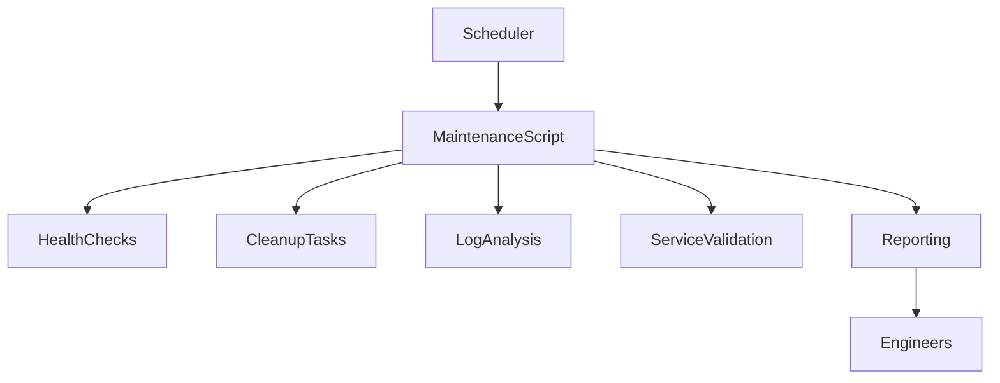

---

# Why Maintenance Automation Exists

Without automation:

```text
Engineer

↓

Manual Work

↓

Human Error

↓

Outages
```

With automation:

```text
Automation

↓

Consistent Operations

↓

Higher Reliability
```

---

# Project Structure

```text
maintenance-framework/

├── maintenance.sh
├── reports/
├── archives/
├── logs/
│
├── cleanup.sh
├── monitoring.sh
├── reporting.sh
└── services.sh
```

This resembles real operations tooling.

---

# Understanding Server Maintenance

Maintenance activities generally fall into:

```text
Monitoring

Cleanup

Optimization

Validation

Reporting
```

---

# Maintenance Lifecycle


This cycle repeats forever.

---

# Phase 1 — Build The Framework

Create project:

```bash
mkdir maintenance-framework

cd maintenance-framework
```

Create script:

```bash
nano maintenance.sh
```

---

# Script Skeleton

```bash
#!/bin/bash

echo "================================="
echo "Production Maintenance Framework"
echo "================================="
```

---

# Why Frameworks Matter

Large automation systems require:

```text
Structure

Consistency

Predictability
```

instead of random scripts.

---

# Phase 2 — System Information Collection

Function:

```bash
system_info() {

    echo "Hostname: $(hostname)"

    echo "Date: $(date)"

    echo "Kernel: $(uname -r)"

}
```

Call:

```bash
system_info
```

---

# Why Collect Metadata?

Every maintenance report should answer:

```text
Which Server?

When?

What Environment?
```

---

# Phase 3 — Disk Health Analysis

Function:

```bash
disk_check() {

    df -h

}
```

---

# Better Production Version

```bash
disk_check() {

    ROOT_USAGE=$(df / | awk 'NR==2 {print $5}' | tr -d '%')

    echo "Root Disk Usage: ${ROOT_USAGE}%"

}
```

---

# Why Disk Checks Matter

Disk issues are among the most common causes of:

```text
Database Failures

Application Failures

Log Collection Failures

Backup Failures
```

---

# Disk Failure Chain

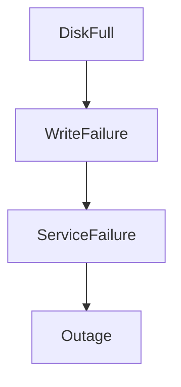

---

# Phase 4 — Memory Health Analysis

Function:

```bash
memory_check() {

    free -h

}
```

---

# Advanced Version

```bash
memory_check() {

    free | awk '/Mem:/ {print $3 "/" $2}'

}
```

---

# Why Memory Monitoring Exists

Memory exhaustion leads to:

```text
OOM Killer

Application Crashes

Container Restarts

Performance Degradation
```

---

# Memory Failure Flow

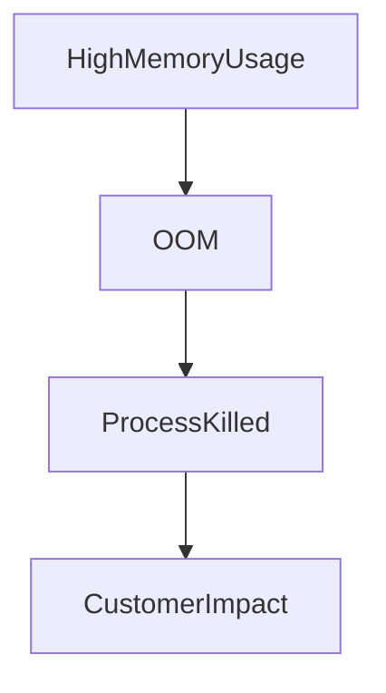

---

# Phase 5 — Service Validation

Check critical services.

Example:

```bash
service_check() {

    SERVICES="ssh cron"

    for service in $SERVICES
    do

        if systemctl is-active "$service" >/dev/null
        then
            echo "$service OK"

        else
            echo "$service FAILED"

        fi

    done

}
```

---

# Why Service Checks Matter

Infrastructure exists to deliver:

```text
Running Services
```

not:

```text
Running Servers
```

---

# Service Dependency Model

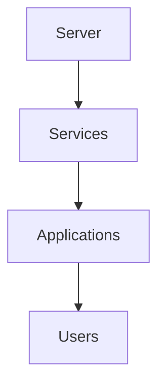

Users care about services.

---

# Phase 6 — Temporary File Cleanup

Find temp files.

Example:

```bash
cleanup_temp() {

    find /tmp -type f -mtime +7

}
```

---

# Production Cleanup

```bash
find /tmp -type f -mtime +7 -delete
```

---

# Why Cleanup Matters

Temporary files accumulate.

Over time:

```text
Storage Waste

↓

Performance Impact

↓

Disk Pressure
```

---

# Cleanup Architecture

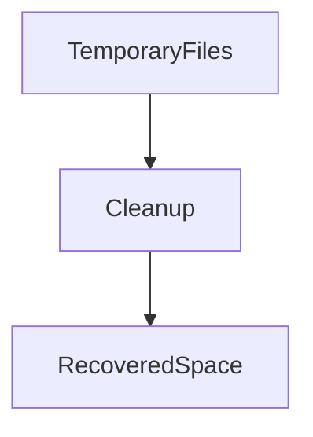

---

# Phase 7 — Log Maintenance

Check log growth.

Example:

```bash
du -sh /var/log
```

---

# Archive Old Logs

Example:

```bash
tar -czf logs-archive.tar.gz /var/log
```

---

# Why Log Management Matters

Logs are critical.

But:

```text
Unlimited Growth

=

Storage Disaster
```

---

# Log Lifecycle

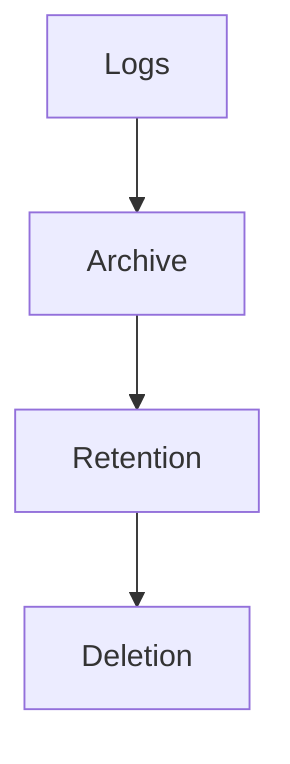

This is exactly how enterprises manage logs.

---

# Phase 8 — Detect Large Files

Find files consuming space.

Example:

```bash
find / -type f -size +500M 2>/dev/null
```

---

# Why Large Files Matter

Many outages are caused by:

```text
Unexpected File Growth
```

Examples:

```text
Debug Logs

Core Dumps

Backups

Database Exports
```

---

# Phase 9 — Zombie Process Detection

Check:

```bash
ps aux | awk '$8 ~ /Z/'
```

---

# Why Zombies Matter

Large numbers of zombie processes indicate:

```text
Application Bugs

Process Management Problems
```

---

# Process Lifecycle Visualization

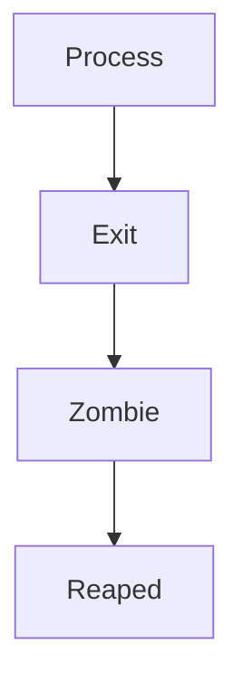

---

# Phase 10 — Generate Health Score

Start:

```bash
HEALTH=100
```

---

Subtract:

```text
Disk Problems

Service Failures

Memory Pressure

Log Issues
```

---

Example

```bash
if [ "$ROOT_USAGE" -gt 80 ]
then
    HEALTH=$((HEALTH-10))
fi
```

---

# Why Scores Matter

Humans quickly understand:

```text
Health = 95
```

compared to:

```text
500 Lines Of Raw Output
```

---

# Report Generation

Create:

```bash
mkdir reports
```

---

Report file:

```bash
REPORT="reports/maintenance-$(date +%F).txt"
```

---

Write:

```bash
echo "Maintenance Report" > "$REPORT"
```

Append:

```bash
echo "Health Score: $HEALTH" >> "$REPORT"
```

---

# Reporting Flow

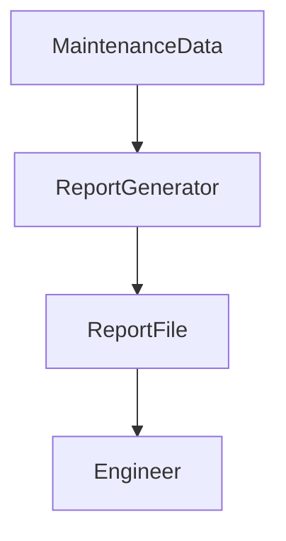

---

# Production Maintenance Report Example

```text
Production Maintenance Report

Hostname: web-01

Disk Usage: 42%

Memory Usage: 56%

Services:
ssh OK
cron OK

Health Score: 98
```

---

# Advanced Upgrade 1 — Automatic Recovery

Example:

```bash
if ! systemctl is-active nginx >/dev/null
then
    systemctl restart nginx
fi
```

---

# Why Self-Healing Matters

Modern systems increasingly move toward:

```text
Detection

↓

Automatic Recovery

↓

Validation
```

---

# Self-Healing Architecture

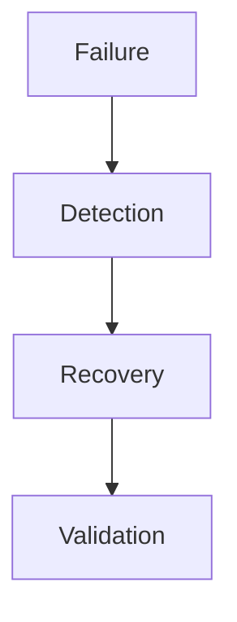

---

# Advanced Upgrade 2 — Maintenance Logs

Record maintenance execution.

Example:

```bash
echo "$(date) Maintenance Complete" >> maintenance.log
```

---

# Why Maintenance Logging Matters

Engineers need:

```text
Audit Trails

Historical Records

Compliance Evidence
```

---

# Advanced Upgrade 3 — Security Checks

Check:

```bash
last -n 20
```

Review:

```text
Recent Logins
```

---

Check:

```bash
grep "Failed password" /var/log/auth.log
```

---

# Security Maintenance Flow

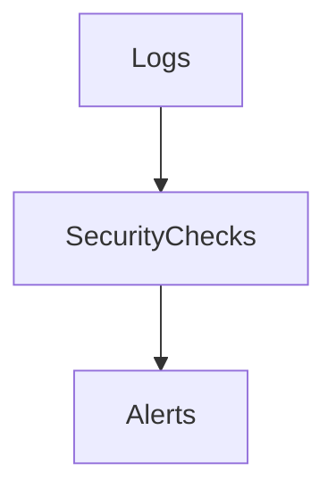

---

# Advanced Upgrade 4 — Package Updates

Check:

```bash
apt list --upgradable
```

or:

```bash
dnf check-update
```

---

# Why Updates Matter

Updates provide:

```text
Security Fixes

Bug Fixes

Performance Improvements
```

---

# Linux Internals

Maintenance relies on:

```text
Kernel Metrics

/proc

/sys

systemd

Filesystem Metadata
```

The script is simply collecting information already exposed by Linux.

---

# Maintenance Data Flow

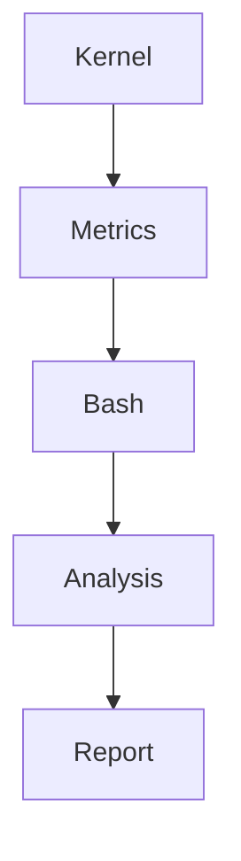

---

# Docker Connection

Maintenance tasks include:

```bash
docker system df

docker image prune

docker container prune
```

Container infrastructure requires maintenance too.

---

# Kubernetes Connection

Examples:

```bash
kubectl get pods

kubectl top nodes

kubectl get events
```

Cluster maintenance follows the same principles.

---

# Cloud Connection

Cloud maintenance includes:

```text
Storage Cleanup

Instance Health

Security Updates

Backup Verification

Cost Optimization
```

The concepts remain identical.

---

# Real Production Scenario

Imagine:

```text
200 Linux Servers
```

Every night:

```text
Health Checks

Log Rotation

Disk Cleanup

Backup Verification

Service Validation

Report Generation
```

run automatically.

This is exactly how many production environments operate.

---

# Common Mistakes

## Mistake 1

Deleting files without verification.

---

## Mistake 2

Running cleanup without backups.

---

## Mistake 3

Ignoring reports.

---

## Mistake 4

No historical records.

---

## Mistake 5

Monitoring without action.

---

## Mistake 6

Aggressive automation without safeguards.

---

# Engineering Mindset

Beginner:

```text
How Do I Fix Problems?
```

Linux User:

```text
How Do I Detect Problems?
```

Administrator:

```text
How Do I Maintain Systems?
```

DevOps Engineer:

```text
How Do I Automate Maintenance?
```

SRE:

```text
How Do I Prevent Outages?
```

Platform Engineer:

```text
How Do I Build Self-Maintaining Infrastructure?
```

That progression represents operational maturity.

---

# Interview Questions

### Beginner

Why is server maintenance important?

### Intermediate

What tasks belong in a maintenance script?

### Intermediate

Why should logs be rotated?

### Advanced

How would you design a maintenance framework?

### Advanced

How would you prevent dangerous cleanup operations?

### Advanced

Difference between monitoring and maintenance?

### Advanced

How would you maintain 1000 Linux servers?

### Advanced

How does maintenance improve reliability?

---

# Final Challenge

Extend this framework with:

```text
Email Notifications

Slack Alerts

Backup Verification

Patch Management

Container Maintenance

Kubernetes Maintenance

Cloud Cost Auditing

Automatic Recovery Workflows
```

---

# Lab Success Criteria

You should now be able to:

* Build a production maintenance framework
* Automate health checks
* Detect operational risks
* Generate maintenance reports
* Clean resources safely
* Validate services
* Understand preventive operations
* Connect maintenance to reliability engineering
* Connect Linux maintenance to cloud and Kubernetes operations
* Think like an operations engineer

At this point, you should stop thinking:

```text
How Do I Fix Broken Systems?
```

and start thinking:

```text
How Do I Build Systems

That Stay Healthy

Require Less Human Intervention

Recover Quickly

And Continue Delivering Value

For Years?
```

Because elite infrastructure teams spend far more time preventing failures than reacting to them.
