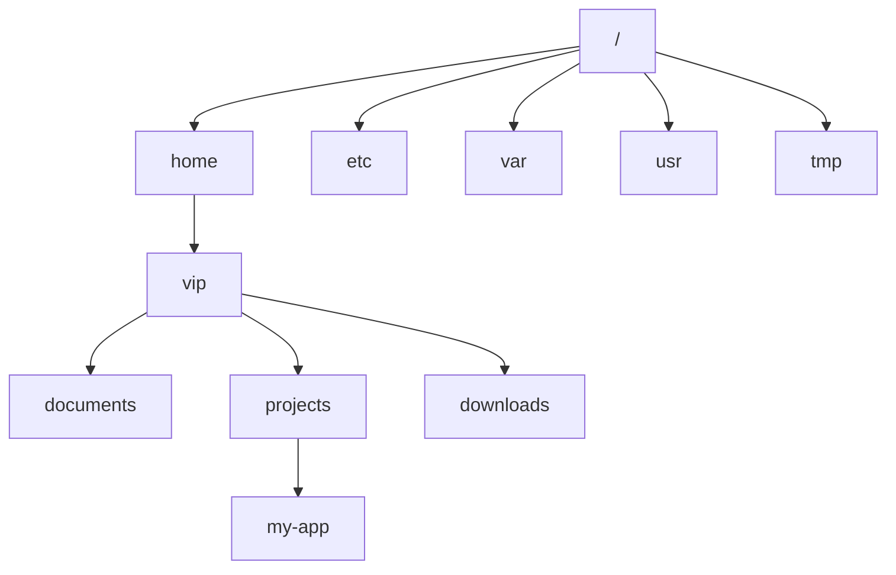
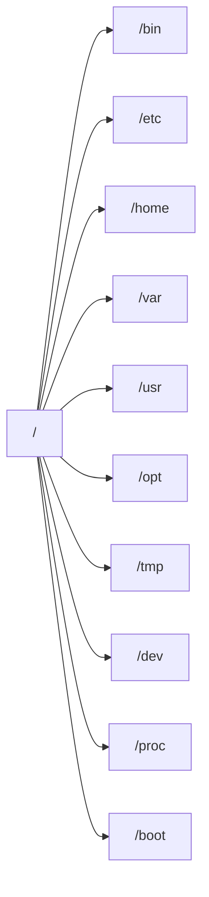
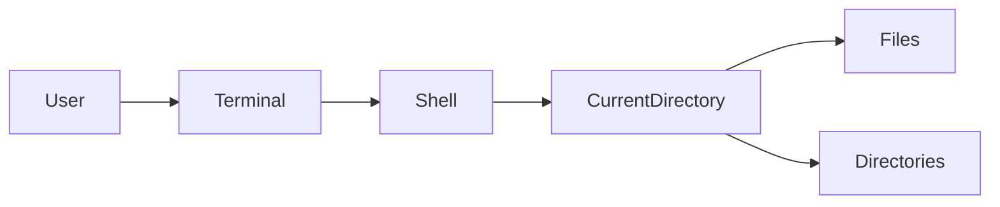
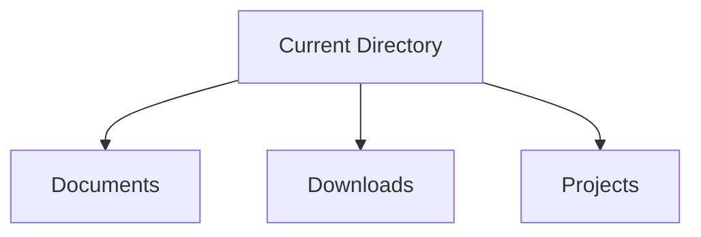
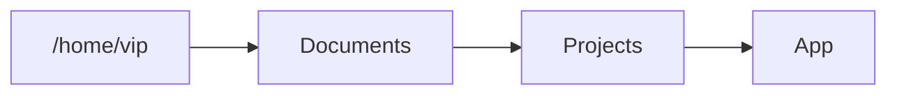
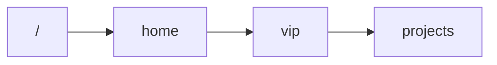
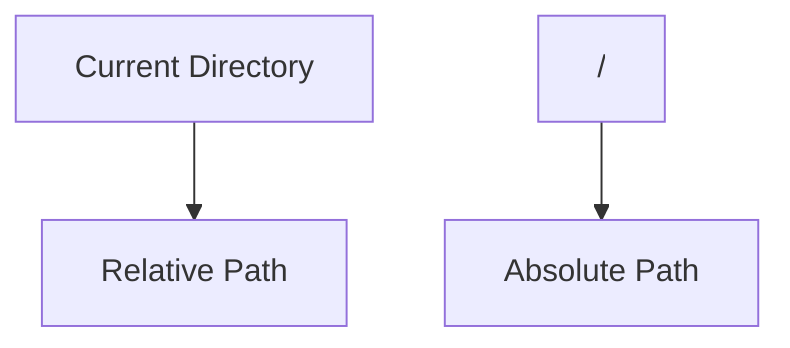
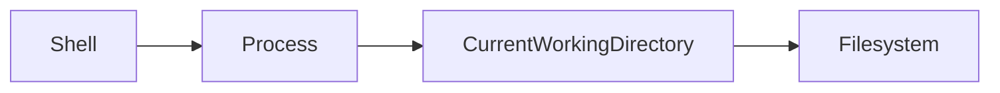

# Lab 01 – Linux Navigation

> Before you learn Linux administration, networking, Docker, Kubernetes, cloud, or distributed systems, you must learn how to move through a Linux system efficiently.
>
> Navigation is the foundation of everything else.

---

# Lab Objective

By the end of this lab you will:

* Understand how Linux organizes files and directories
* Navigate confidently using the terminal
* Understand absolute and relative paths
* Learn directory hierarchy concepts
* Build command-line intuition
* Develop habits used by Linux administrators, DevOps engineers, and SREs

---

# Why This Matters

Imagine a production engineer receives an alert:

```text
Database backups are failing.
```

The engineer immediately starts navigating:

```bash
cd /var/log
cd /var/lib/postgresql
cd /etc
```

Every troubleshooting session starts with navigation.

Every deployment starts with navigation.

Every infrastructure investigation starts with navigation.

If you cannot move through Linux quickly, everything becomes slower.

---

# The Problem Linux Navigation Solves

A computer contains:

```text
Thousands of folders
Millions of files
Configurations
Logs
Applications
Libraries
Services
Databases
Containers
```

Without navigation:

```text
You are lost.
```

With navigation:

```text
You can locate anything.
```

---

# Mental Model

Think of Linux as a giant city.

```text
Linux System
│
├── Houses (Files)
│
├── Streets (Directories)
│
├── City Map (Filesystem Tree)
│
└── You (Current Working Directory)
```

Your terminal always has a location.

Just like Google Maps knows where you are.

Linux knows where you are.

This location is called:

```text
Current Working Directory (CWD)
```

---

# Visualizing Navigation



Current location might be:

```text
/home/vip/projects/my-app
```

---

# First Principles

Every file on Linux lives inside a hierarchy.

Unlike Windows:

```text
C:\
D:\
E:\
```

Linux has:

```text
One filesystem tree
```

Everything begins from:

```text
/
```

called:

```text
Root Directory
```

---

# Linux Filesystem Hierarchy



---

# Important Directories

| Directory | Purpose              |
| --------- | -------------------- |
| /         | Root                 |
| /home     | User files           |
| /etc      | Configuration        |
| /var      | Logs & changing data |
| /usr      | Applications         |
| /tmp      | Temporary files      |
| /boot     | Boot files           |
| /proc     | Kernel information   |
| /dev      | Devices              |

---

# Navigation Architecture



---

# Core Commands

---

# pwd

Print Working Directory

Shows where you currently are.

```bash
pwd
```

Example:

```bash
/home/vip/projects
```

Visualization:

```mermaid
flowchart LR

User --> pwd

pwd --> "/home/vip/projects"
```

---

# Lab Task 1

Run:

```bash
pwd
```

Questions:

* Where are you?
* Which user directory are you in?

---

# ls

List contents.

```bash
ls
```

Example:

```bash
Documents
Downloads
Projects
```

---

# Visualization



---

# Useful Variants

```bash
ls -l
```

Long listing.

```bash
ls -a
```

Show hidden files.

```bash
ls -lh
```

Human readable sizes.

```bash
ls -la
```

Most commonly used.

---

# Lab Task 2

Run:

```bash
ls
ls -l
ls -la
```

Observe:

* Hidden files
* Permissions
* Ownership

---

# cd Command

Change directory.

```bash
cd directory-name
```

Example:

```bash
cd Documents
```

---

# Navigation Flow



---

# Lab Task 3

Create navigation path:

```bash
mkdir -p practice/linux/navigation
```

Move into it:

```bash
cd practice
cd linux
cd navigation
```

Verify:

```bash
pwd
```

---

# Absolute Paths

Absolute paths start from root.

Example:

```bash
/home/vip/projects
```

Visualization:



Absolute path always starts from:

```text
/
```

---

# Relative Paths

Relative paths start from current location.

Example:

Current:

```text
/home/vip
```

Move:

```bash
cd projects
```

Linux interprets:

```text
/home/vip/projects
```

automatically.

---

# Relative vs Absolute



---

# Dot (.)

Current Directory

```bash
.
```

means:

```text
where I am now
```

Example:

```bash
ls .
```

---

# Double Dot (..)

Parent Directory

Example:

```bash
cd ..
```

Visualization:

```mermaid
graph TD

ROOT["/"]

ROOT --> HOME

HOME --> USER

USER --> PROJECTS

PROJECTS --> APP

APP --> ".."

".. " --> PROJECTS
```

---

# Lab Task 4

Navigate:

```bash
cd ..
pwd
```

Repeat multiple times.

Observe movement.

---

# Home Directory Shortcut

```bash
cd ~
```

returns:

```text
/home/username
```

Visualization:

```mermaid
flowchart LR

Anywhere --> "~"

"~" --> HomeDirectory
```

---

# Return Home Quickly

```bash
cd
```

or

```bash
cd ~
```

---

# Previous Directory Shortcut

Move:

```bash
cd /tmp
```

Return:

```bash
cd -
```

Visualization:

```mermaid
flowchart LR

A["/home/user"]

A --> B["/tmp"]

B --> "cd -"

"cd -" --> A
```

---

# Lab Task 5

Run:

```bash
cd /tmp
pwd

cd -
pwd
```

Observe.

---

# Explore Linux

Visit:

```bash
cd /
ls
```

Explore:

```bash
cd /etc
cd /var
cd /usr
cd /tmp
```

Record observations.

---

# Guided Exploration Challenge

Visit:

```bash
/
/etc
/home
/usr
/var
/tmp
```

Questions:

1. Which directory contains logs?
2. Which contains user files?
3. Which contains configurations?

---

# Semi-Guided Challenge

Create:

```text
linux-lab/
├── notes
├── scripts
├── configs
└── backups
```

Requirements:

* Use mkdir
* Use relative paths
* Verify using pwd and ls

---

# Independent Challenge

Starting location:

```text
/home/user
```

Goal:

Create:

```text
/home/user/projects/linux-labs/navigation
```

Rules:

* Use minimum commands
* Verify every step

---

# Linux Internals

Where does the shell store your location?

The shell maintains:

```text
Current Working Directory (CWD)
```

Kernel tracks this information per process.

Visualization:



Every process has its own:

```text
Current Working Directory
```

---

# Production Connection

When debugging production systems:

```bash
cd /var/log
```

Check logs.

```bash
cd /etc
```

Check configurations.

```bash
cd /var/lib
```

Check application data.

```bash
cd /srv
```

Check services.

Navigation becomes a daily skill.

---

# Common Mistakes

## Mistake 1

Confusing:

```bash
/
```

with

```bash
~
```

Root:

```text
/
```

Home:

```text
/home/user
```

---

## Mistake 2

Using wrong relative paths.

Example:

```bash
cd project
```

when directory does not exist.

Verify with:

```bash
ls
```

---

## Mistake 3

Getting lost.

Solution:

```bash
pwd
```

Always know your location.

---

# Troubleshooting

## Problem

```bash
No such file or directory
```

Check:

```bash
pwd
ls
```

Verify path.

---

## Problem

Wrong directory.

Recover:

```bash
cd ~
```

or

```bash
cd -
```

---

# Engineering Mindset

Beginners think:

```text
How do I run this command?
```

Engineers think:

```text
Where am I?
What filesystem am I touching?
What data lives here?
Could this impact production?
```

Location awareness is critical.

---

# Interview Questions

### What does pwd do?

Prints current working directory.

---

### Difference between absolute and relative paths?

Absolute:

```text
Starts from /
```

Relative:

```text
Starts from current directory
```

---

### What does cd .. do?

Moves to parent directory.

---

### What does ~ represent?

Home directory.

---

### What does cd - do?

Returns to previous directory.

---

# Cheat Sheet

```bash
pwd                 # show current location

ls                  # list files

ls -l               # detailed list

ls -la              # show hidden files

cd directory        # move into directory

cd ..               # parent directory

cd ~                # home directory

cd                  # home directory

cd -                # previous directory

ls /etc             # list another directory

pwd && ls           # show location and files
```

---

# Lab Success Criteria

You can complete this lab when you can:

* Navigate without GUI
* Explain filesystem hierarchy
* Use pwd confidently
* Use ls variants
* Understand relative paths
* Understand absolute paths
* Move through Linux efficiently
* Explore unknown systems safely

Congratulations.

You have learned the first skill every Linux engineer uses hundreds of times every day.
