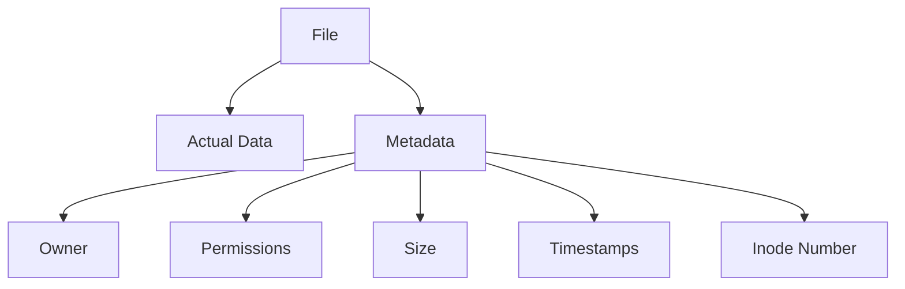
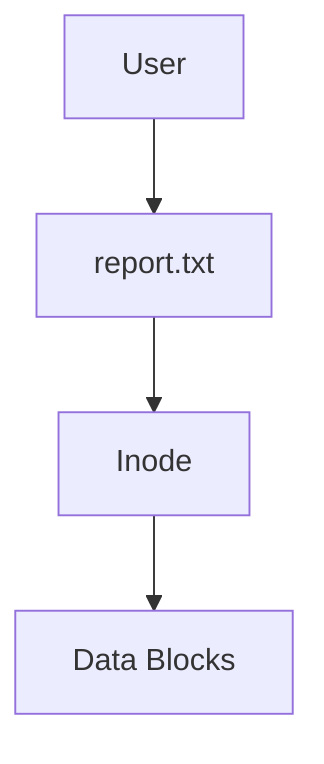
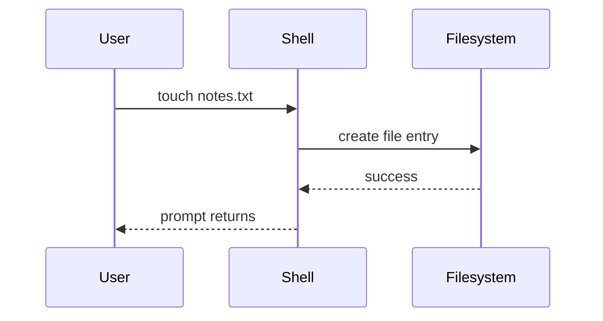
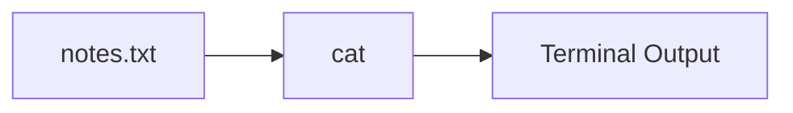
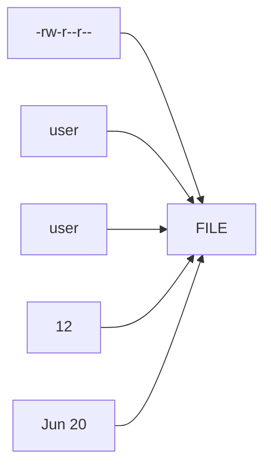
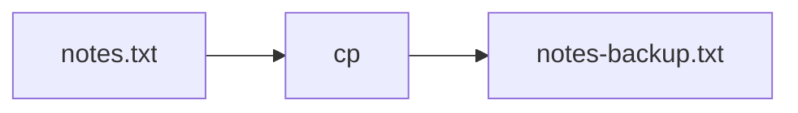
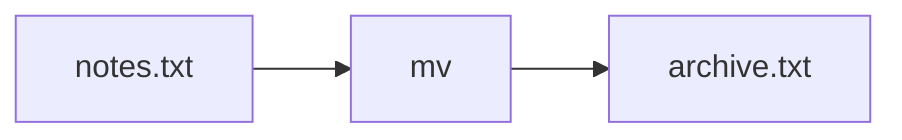
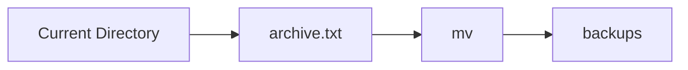
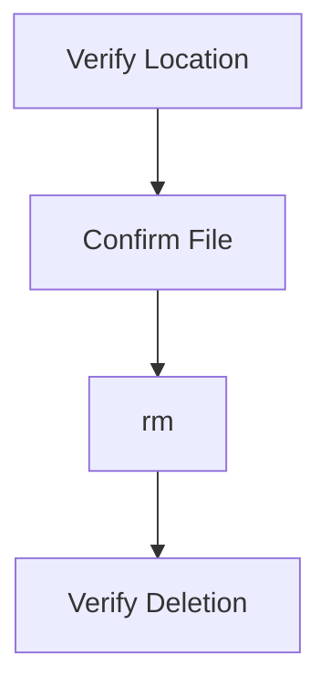
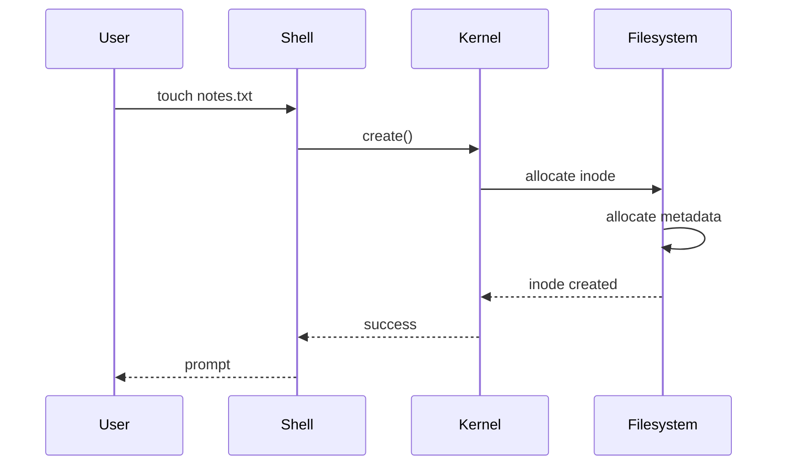

# Lab 02 – Working With Files

> Files are the foundation of Linux.
>
> Configuration is stored in files.
>
> Logs are stored in files.
>
> Applications are files.
>
> Shell scripts are files.
>
> Databases ultimately write data into files.
>
> Containers use files.
>
> Kubernetes stores manifests as files.
>
> Understanding files is understanding Linux.

---

# Lab Objective

By the end of this lab you will:

* Understand what a file really is
* Create files
* View file contents
* Copy files
* Move files
* Rename files
* Delete files safely
* Understand file metadata
* Learn how Linux represents files internally
* Develop habits used by Linux administrators and DevOps engineers

---

# Why This Matters

Imagine these real-world situations:

```text
A service fails because a configuration file changed.

A deployment breaks because a script file is missing.

An application crashes because a log file filled the disk.

A database becomes unavailable because data files were deleted.
```

All of these are file-related problems.

Most production incidents involve files somewhere in the chain.

---

# Problem This Lab Solves

A Linux system may contain:

```text
Millions of files
Configuration files
Log files
Application binaries
Libraries
Databases
Backups
Container images
```

Without understanding files:

```text
You cannot understand Linux.
```

---

# Mental Model

Think of a file as a container.

```text
Box
 ├── Name
 ├── Content
 ├── Owner
 ├── Permissions
 ├── Timestamp
 └── Metadata
```

But Linux sees files differently.

Linux sees:

```text
Data + Metadata
```

The filename is only a human-friendly label.

---

# First Principles

Everything in Linux is represented as a file.

Examples:

```text
Regular Files
Directories
Devices
Sockets
Pipes
Processes (via /proc)
```

This philosophy is one reason Linux is powerful.

---

# Linux View of Files



---

# Filesystem Perspective



A filename points to an inode.

The inode points to the actual data.

This concept becomes critical later when studying:

* Inodes
* Hard Links
* Filesystems
* Storage Engineering

---

# Lab Environment Setup

Create a workspace.

```bash
mkdir -p ~/linux-labs/files
cd ~/linux-labs/files
```

Verify:

```bash
pwd
```

Expected:

```text
/home/<user>/linux-labs/files
```

---

# Creating Files

## Method 1: touch

```bash
touch notes.txt
```

Check:

```bash
ls
```

Expected:

```text
notes.txt
```

---

# What Actually Happened?



---

# Lab Task 1

Create:

```bash
touch app.log
touch config.conf
touch backup.sql
```

Verify:

```bash
ls
```

---

# Viewing Files

A file exists.

Now we need to read it.

---

# cat

Display file contents.

Create data:

```bash
echo "Hello Linux" > notes.txt
```

Read:

```bash
cat notes.txt
```

Output:

```text
Hello Linux
```

---

# Visualization



---

# Lab Task 2

Create:

```bash
echo "Learning Linux" > learning.txt
```

View:

```bash
cat learning.txt
```

---

# Creating Multi-Line Files

```bash
cat > server.conf
```

Enter:

```text
server=nginx
port=80
env=production
```

Press:

```text
CTRL + D
```

Read:

```bash
cat server.conf
```

---

# Understanding File Size

Check:

```bash
ls -lh
```

Example:

```text
4.0K notes.txt
```

---

# File Metadata

Run:

```bash
ls -l notes.txt
```

Example:

```text
-rw-r--r-- 1 user user 12 Jun 20 notes.txt
```

---

# Breaking Metadata Down



---

# Deep Metadata Inspection

Use:

```bash
stat notes.txt
```

Example:

```text
Size
Access
Modify
Change
Inode
Permissions
Owner
```

---

# Why stat Matters

Production engineers use:

```bash
stat
```

to investigate:

```text
Who changed a file?
When was it modified?
Has size increased?
Is a process writing data?
```

---

# Copying Files

Use:

```bash
cp source.txt backup.txt
```

Example:

```bash
cp notes.txt notes-backup.txt
```

Verify:

```bash
ls
```

---

# Copy Workflow



---

# Lab Task 3

Create:

```bash
cp learning.txt learning-copy.txt
```

Verify contents:

```bash
cat learning-copy.txt
```

---

# Moving Files

Move:

```bash
mv notes.txt archive.txt
```

File renamed.

---

# Important Insight

Linux does not have a separate rename command.

```bash
mv
```

performs:

```text
Move
Rename
```

---

# Rename Flow



---

# Lab Task 4

Rename:

```bash
mv learning-copy.txt old-learning.txt
```

Verify:

```bash
ls
```

---

# Moving Between Directories

Create:

```bash
mkdir backups
```

Move:

```bash
mv archive.txt backups/
```

Verify:

```bash
ls backups
```

---

# Move Architecture



---

# Deleting Files

Remove:

```bash
rm old-learning.txt
```

Verify:

```bash
ls
```

---

# Critical Warning

```text
rm does NOT use a recycle bin.

Deletion is immediate.
```

---

# Production Incident Example

Many engineers have accidentally run:

```bash
rm -rf
```

against the wrong directory.

Result:

```text
Application Down
Data Lost
Production Outage
```

Always verify:

```bash
pwd
ls
```

before deletion.

---

# Safe Deletion Habit

Before:

```bash
rm file.txt
```

Check:

```bash
pwd
ls
```

Then remove.

---

# Deletion Workflow



---

# File Types

Check:

```bash
ls -l
```

Leading character matters.

Examples:

```text
- Regular File
d Directory
l Symlink
c Character Device
b Block Device
```

---

# Example

```bash
ls -l /
```

Observe:

```text
drwxr-xr-x
```

Directories begin with:

```text
d
```

---

# Understanding Hidden Files

Files beginning with:

```text
.
```

are hidden.

Examples:

```text
.bashrc
.profile
.gitconfig
```

View:

```bash
ls -la
```

---

# Why Hidden Files Exist

Store:

```text
Configuration
Preferences
Shell Settings
Tool Configurations
```

Examples:

```text
Git
Docker
SSH
Bash
Kubernetes
```

---

# Real Production Example

Engineers often troubleshoot:

```text
~/.ssh/config
~/.bashrc
~/.kube/config
```

These are hidden files.

---

# Guided Challenge

Create:

```text
project/
├── app.log
├── config.conf
├── database.sql
└── backup.log
```

Commands allowed:

```text
mkdir
touch
ls
```

---

# Semi-Guided Challenge

Create:

```text
project/
└── backups/
```

Copy:

```text
database.sql
```

into backups.

Verify:

```bash
ls
ls backups
```

---

# Independent Challenge

Build:

```text
linux-project/

├── configs
│   ├── nginx.conf
│   └── app.conf
│
├── logs
│   ├── app.log
│   └── access.log
│
└── backups
```

Requirements:

* Create files
* Copy files
* Rename one file
* Delete one file
* Verify structure

---

# Linux Internals

What happens when you create a file?



---

# Modern World Connections

Files power:

| Technology   | Uses Files        |
| ------------ | ----------------- |
| Docker       | Images, Layers    |
| Kubernetes   | YAML Manifests    |
| Nginx        | Config Files      |
| PostgreSQL   | Database Files    |
| Redis        | Persistence Files |
| Linux Kernel | Device Files      |
| Git          | Object Files      |

---

# Performance Considerations

Millions of files can create:

```text
Slow directory listing
Backup delays
Filesystem overhead
Metadata bottlenecks
```

Engineers often optimize:

```text
Directory structure
File counts
Storage layouts
```

---

# Security Considerations

Files may contain:

```text
Passwords
Secrets
API Keys
SSH Keys
Certificates
```

Never:

```text
Expose secrets
Store credentials carelessly
Use world-writable permissions
```

---

# Common Mistakes

## Mistake 1

Deleting before checking.

Bad:

```bash
rm file.txt
```

Good:

```bash
pwd
ls
rm file.txt
```

---

## Mistake 2

Overwriting accidentally.

```bash
cp new.conf old.conf
```

Previous content lost.

---

## Mistake 3

Ignoring hidden files.

```bash
ls
```

does not show:

```text
.bashrc
.gitignore
```

Use:

```bash
ls -la
```

---

# Troubleshooting

## File Missing

Check:

```bash
pwd
ls
```

Maybe wrong directory.

---

## Cannot Read File

Check:

```bash
ls -l
```

Permissions issue.

---

## Copy Failed

Check:

```bash
ls
```

Verify source exists.

---

# Engineering Mindset

Beginners think:

```text
A file is just data.
```

Engineers think:

```text
A file has:

Data
Metadata
Ownership
Permissions
Lifecycle
Performance implications
Security implications
```

---

# Interview Questions

### What is a file?

A collection of data and metadata managed by the filesystem.

---

### What does touch do?

Creates a file or updates timestamps.

---

### Difference between cp and mv?

```text
cp -> copy

mv -> move or rename
```

---

### What does rm do?

Removes files permanently.

---

### What does stat show?

Detailed file metadata.

---

### Why are hidden files used?

To store configuration and system settings.

---

# Cheat Sheet

```bash
touch file.txt

cat file.txt

echo "hello" > file.txt

cp file.txt backup.txt

mv file.txt newfile.txt

mkdir backups

mv newfile.txt backups/

rm file.txt

ls -l

ls -la

ls -lh

stat file.txt
```

---

# Lab Success Criteria

You can complete this lab when you can:

✅ Create files

✅ Read files

✅ Copy files

✅ Rename files

✅ Move files

✅ Delete files safely

✅ Understand metadata

✅ Use stat

✅ Explain how Linux stores files

✅ Connect files to modern systems such as Docker, Kubernetes, databases, and cloud infrastructure

Congratulations.

You now understand one of the most fundamental building blocks of Linux engineering.
