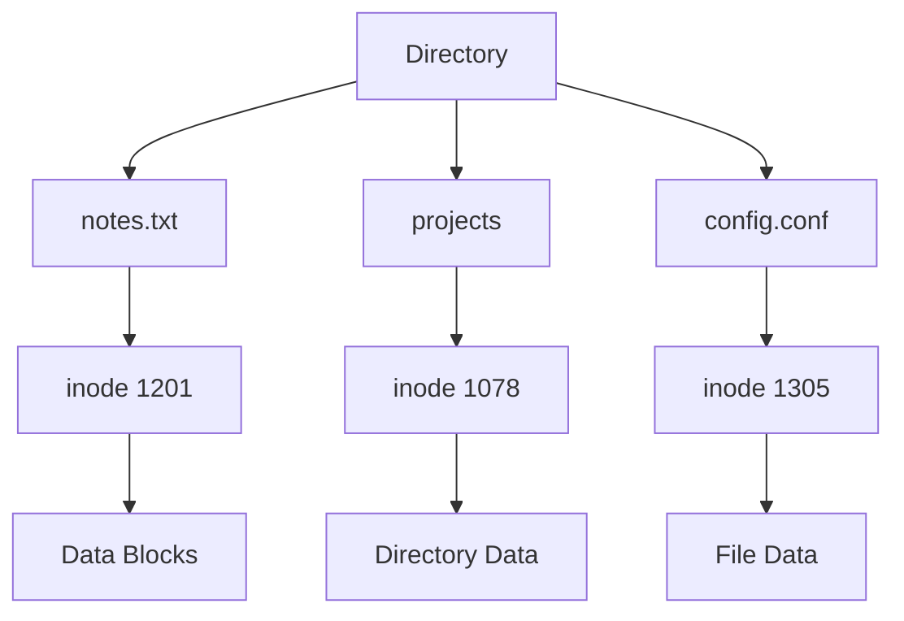
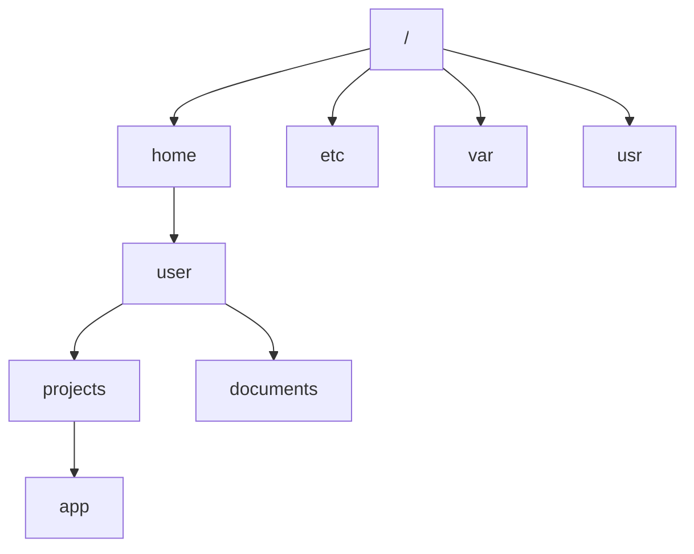
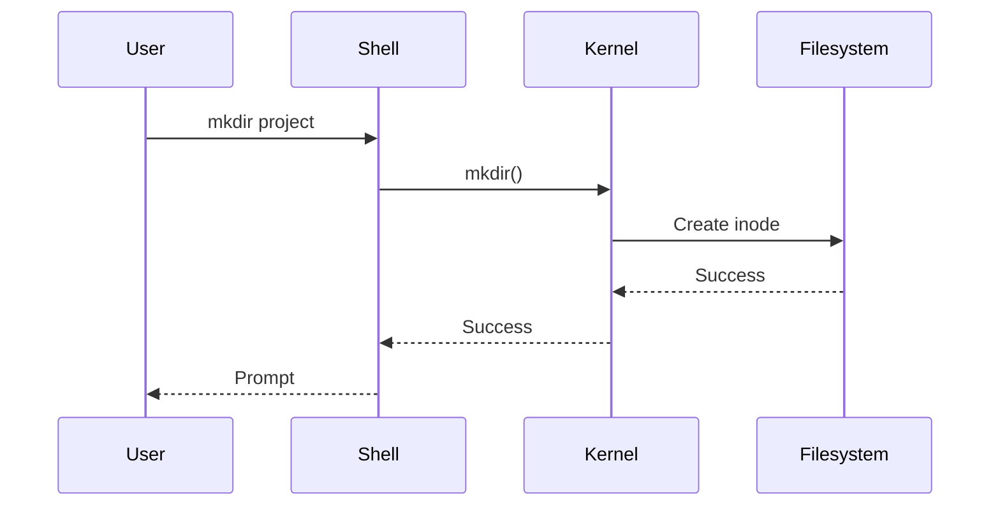
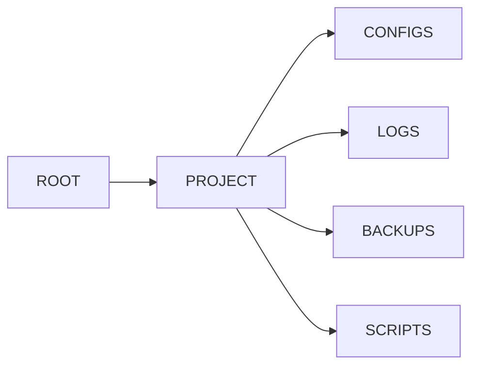
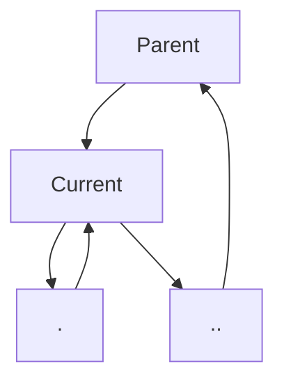
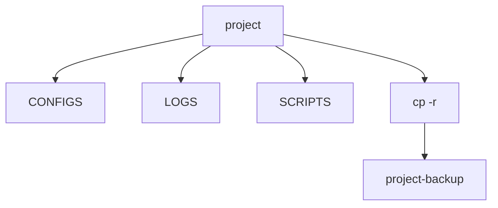
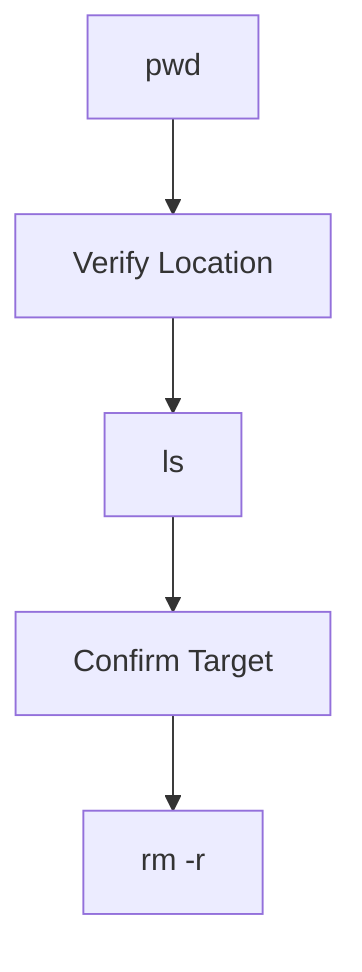
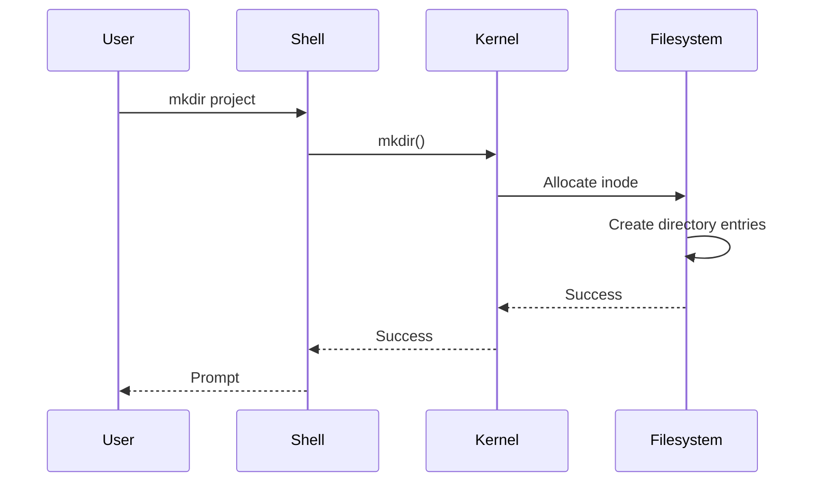
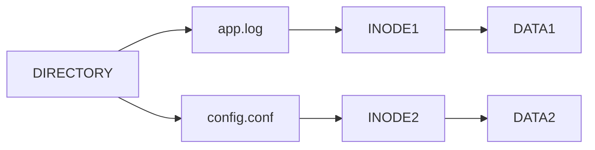

# Lab 03 – Working With Directories

> Files store data.
>
> Directories organize data.
>
> Without directories, a Linux system containing millions of files would be impossible to manage.
>
> Directories are one of the most important abstractions in computing.

---

# Lab Objective

By the end of this lab you will:

* Understand what directories really are
* Create directories efficiently
* Create nested directory structures
* Copy directories
* Move directories
* Rename directories
* Delete directories safely
* Understand Linux directory internals
* Learn directory organization strategies used in production systems
* Build intuition for filesystem hierarchy design

---

# Why This Matters

Imagine a Linux server running:

```text
Web Server
Database
Docker
Kubernetes
Monitoring
Logging
Backups
CI/CD
```

Each component generates:

```text
Configurations
Logs
Data
Scripts
Backups
Certificates
```

Without directories:

```text
Millions of files in one location
```

Finding anything becomes impossible.

Directories solve this problem.

---

# Real World Example

Consider a Kubernetes node.

```text
/var
├── log
├── lib
├── cache
├── tmp
└── spool
```

Each directory exists for a reason.

A good engineer understands:

```text
Why the structure exists
What belongs there
What should never belong there
```

---

# Mental Model

Think of directories as folders in a giant city.

```text
Linux Filesystem

City
│
├── Neighborhoods (Directories)
│
├── Buildings (Subdirectories)
│
└── Houses (Files)
```

Directories provide:

```text
Organization
Isolation
Scalability
Management
Security
```

---

# First Principles

Many beginners think:

```text
Directory = Folder
```

That is true from a user perspective.

Internally:

```text
Directory = Special File
```

This is one of the most important Linux concepts.

---

# Linux Internal View

A directory contains mappings.

```text
Filename
    ↓
Inode Number
```

Example:

```text
documents
      ↓
inode 1052

projects
      ↓
inode 1078

notes.txt
      ↓
inode 1201
```

A directory does NOT store actual file contents.

It stores references.

---

# Directory Architecture



---

# Directory Hierarchy



---

# Lab Environment Setup

Create workspace.

```bash
mkdir -p ~/linux-labs/directories
cd ~/linux-labs/directories
```

Verify:

```bash
pwd
```

---

# Creating Directories

Use:

```bash
mkdir project
```

Verify:

```bash
ls
```

Expected:

```text
project
```

---

# Creation Flow



---

# Lab Task 1

Create:

```bash
mkdir documents
mkdir downloads
mkdir scripts
```

Verify:

```bash
ls
```

---

# Creating Multiple Directories

Instead of:

```bash
mkdir dir1
mkdir dir2
mkdir dir3
```

Use:

```bash
mkdir dir1 dir2 dir3
```

---

# Lab Task 2

Create:

```bash
mkdir dev test prod
```

Verify:

```bash
ls
```

---

# Nested Directories

Production systems rarely use flat structures.

Example:

```text
project
│
├── configs
├── logs
├── backups
└── scripts
```

Create:

```bash
mkdir -p project/configs
```

---

# Why -p Matters

Without:

```bash
mkdir project/configs
```

Parent must exist.

With:

```bash
mkdir -p project/configs
```

Linux creates everything.

---

# Nested Creation Flow



---

# Lab Task 3

Create:

```bash
mkdir -p company/dev/frontend
mkdir -p company/dev/backend
mkdir -p company/dev/database
```

Verify:

```bash
tree company
```

If tree is unavailable:

```bash
ls -R company
```

---

# Viewing Directory Trees

Install:

```bash
sudo apt install tree
```

Then:

```bash
tree
```

Example:

```text
project
├── configs
├── logs
├── scripts
└── backups
```

---

# Production Example

A web application:

```text
my-app

├── src
├── tests
├── logs
├── backups
├── scripts
└── configs
```

Large projects depend on structure.

---

# Current Directory Entries

Every directory contains:

```text
.
..
```

View:

```bash
ls -la
```

---

# Meaning of .

```text
Current Directory
```

Example:

```bash
cd .
```

No movement.

---

# Meaning of ..

```text
Parent Directory
```

Example:

```bash
cd ..
```

Move upward.

---

# Visualization



---

# Copying Directories

Files:

```bash
cp file1 file2
```

Directories require:

```bash
cp -r source destination
```

Example:

```bash
cp -r project project-backup
```

---

# Recursive Copy



---

# Lab Task 4

Create:

```bash
mkdir -p app/logs
```

Copy:

```bash
cp -r app app-backup
```

Verify:

```bash
tree
```

---

# Moving Directories

Move:

```bash
mv app backup-app
```

This renames.

---

# Move Example

```bash
mv project /tmp
```

Moves directory.

---

# Move Architecture


---

# Lab Task 5

Create:

```bash
mkdir old-project
```

Rename:

```bash
mv old-project new-project
```

Verify:

```bash
ls
```

---

# Removing Empty Directories

Use:

```bash
rmdir test
```

Works only when empty.

---

# Example

```bash
mkdir temp
rmdir temp
```

---

# Removing Non-Empty Directories

Use:

```bash
rm -r project
```

---

# Critical Warning

Never run:

```bash
rm -rf /
```

Historically:

```text
Entire systems destroyed
Production outages caused
Critical data deleted
```

Always verify.

---

# Safe Deletion Workflow



---

# Lab Task 6

Create:

```bash
mkdir remove-me
```

Delete:

```bash
rmdir remove-me
```

Create:

```bash
mkdir -p test/data
```

Delete:

```bash
rm -r test
```

---

# Understanding Directory Permissions

A directory controls:

```text
Who can enter
Who can list
Who can create files
Who can delete files
```

This becomes critical later in:

```text
Linux Permissions
ACLs
Security Hardening
```

---

# Real Production Structure

Nginx:

```text
/etc/nginx
├── nginx.conf
├── sites-enabled
└── sites-available
```

PostgreSQL:

```text
/var/lib/postgresql
```

Docker:

```text
/var/lib/docker
```

Kubernetes:

```text
/etc/kubernetes
```

Directories organize infrastructure.

---

# Linux Internals

Directory creation:



---

# Data Flow Inside a Directory



---

# Modern World Connections

Directories power:

| Technology   | Directory Usage     |
| ------------ | ------------------- |
| Docker       | Layer storage       |
| Kubernetes   | Config directories  |
| PostgreSQL   | Database storage    |
| Redis        | Persistence files   |
| Nginx        | Site configuration  |
| Linux Kernel | Virtual filesystems |
| CI/CD        | Build artifacts     |

---

# Performance Considerations

Poor structures create:

```text
Slow searches
Complex backups
Difficult maintenance
Long deployments
```

Good structures create:

```text
Organization
Predictability
Automation
Scalability
```

---

# Security Considerations

Improper directory management can expose:

```text
Logs
Secrets
Certificates
SSH Keys
Backups
```

Always know:

```text
Who owns a directory
Who can access it
Who can modify it
```

---

# Guided Challenge

Create:

```text
website

├── html
├── css
├── js
├── images
└── backups
```

Verify using:

```bash
tree
```

---

# Semi-Guided Challenge

Create:

```text
company

├── dev
├── qa
├── staging
└── production
```

Then:

```text
Copy dev
Rename qa
Delete staging
```

---

# Independent Challenge

Build:

```text
startup-platform

├── backend
│   ├── api
│   ├── configs
│   └── logs
│
├── frontend
│   ├── assets
│   └── builds
│
├── infrastructure
│   ├── docker
│   ├── kubernetes
│   └── monitoring
│
└── backups
```

Requirements:

* Use mkdir -p
* Copy a subtree
* Rename a subtree
* Delete a subtree
* Verify using tree

---

# Common Mistakes

## Mistake 1

Using:

```bash
cp project backup
```

Instead of:

```bash
cp -r project backup
```

---

## Mistake 2

Deleting wrong directory.

Always:

```bash
pwd
ls
```

before deletion.

---

## Mistake 3

Building flat structures.

Bad:

```text
1000 files in one directory
```

Good:

```text
Organized hierarchy
```

---

# Troubleshooting

## Directory Not Found

Check:

```bash
pwd
ls
```

---

## Cannot Remove Directory

Check if:

```text
Directory is empty
```

Use:

```bash
ls
```

---

## Copy Failed

Verify source exists:

```bash
ls
```

---

# Engineering Mindset

Beginners see:

```text
Folders
```

Engineers see:

```text
Namespace organization
Filesystem hierarchy
Access boundaries
Operational structure
Scalability strategy
```

Directories are architecture.

Not just folders.

---

# Interview Questions

### What is a directory?

A special file containing filename-to-inode mappings.

---

### Difference between mkdir and mkdir -p?

```text
mkdir      -> Single level

mkdir -p   -> Recursive creation
```

---

### Difference between rmdir and rm -r?

```text
rmdir -> Empty directory only

rm -r -> Recursive deletion
```

---

### Why is a directory considered a file?

Because Linux stores directory information as filesystem objects with inodes.

---

### Why are directories important?

They provide organization, scalability, security, and manageability.

---

# Cheat Sheet

```bash
mkdir project

mkdir dir1 dir2 dir3

mkdir -p app/logs

tree

ls -R

cp -r source backup

mv old new

rmdir emptydir

rm -r project

pwd

ls -la
```

---

# Lab Success Criteria

You can complete this lab when you can:

✅ Create directories

✅ Create nested structures

✅ Copy directories

✅ Move directories

✅ Rename directories

✅ Delete directories safely

✅ Explain directory internals

✅ Explain inode mappings

✅ Understand production directory structures

✅ Design clean filesystem layouts

Congratulations.

You now understand one of the most fundamental organizational mechanisms in Linux and modern infrastructure systems.
