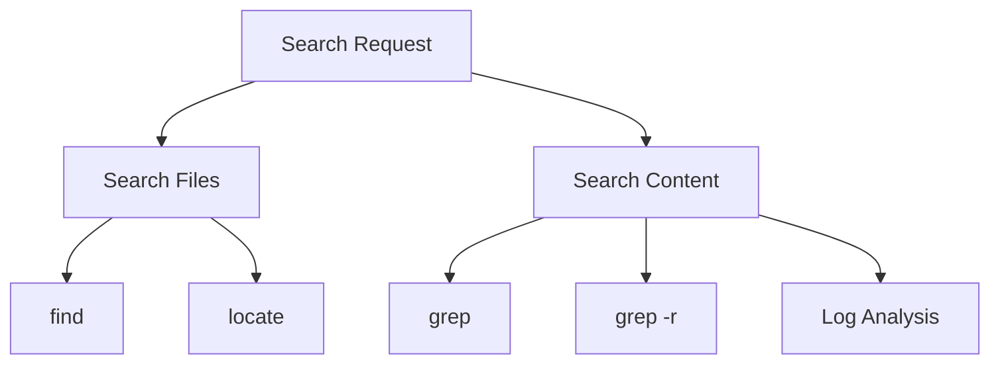
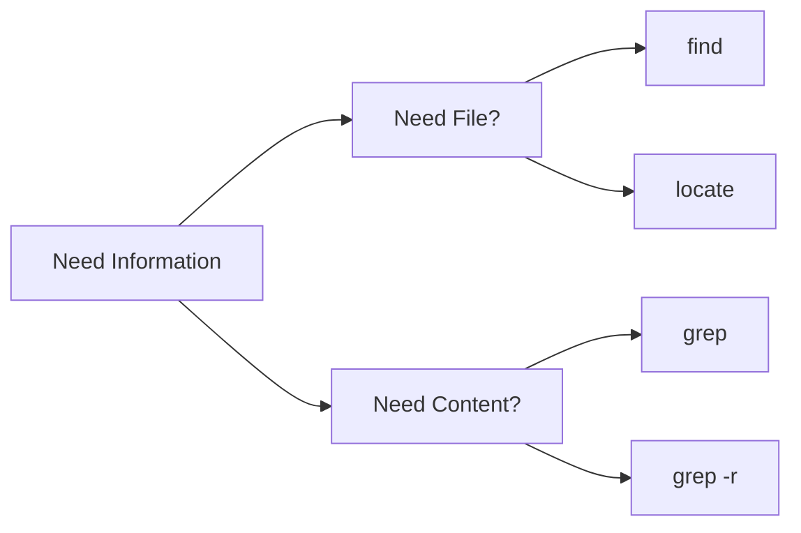
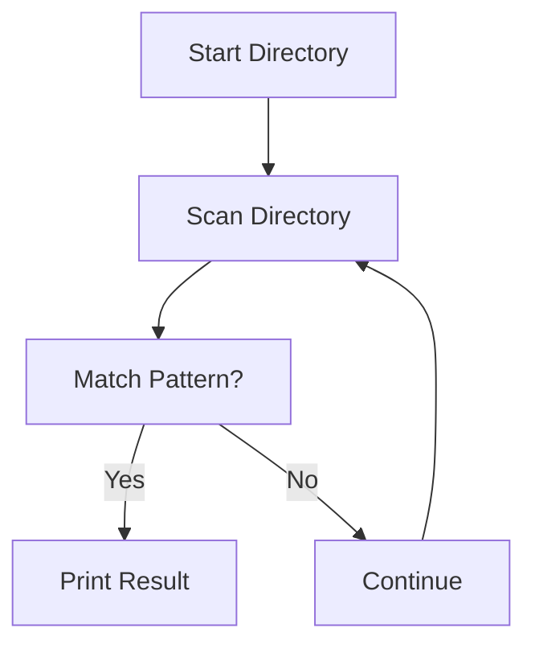
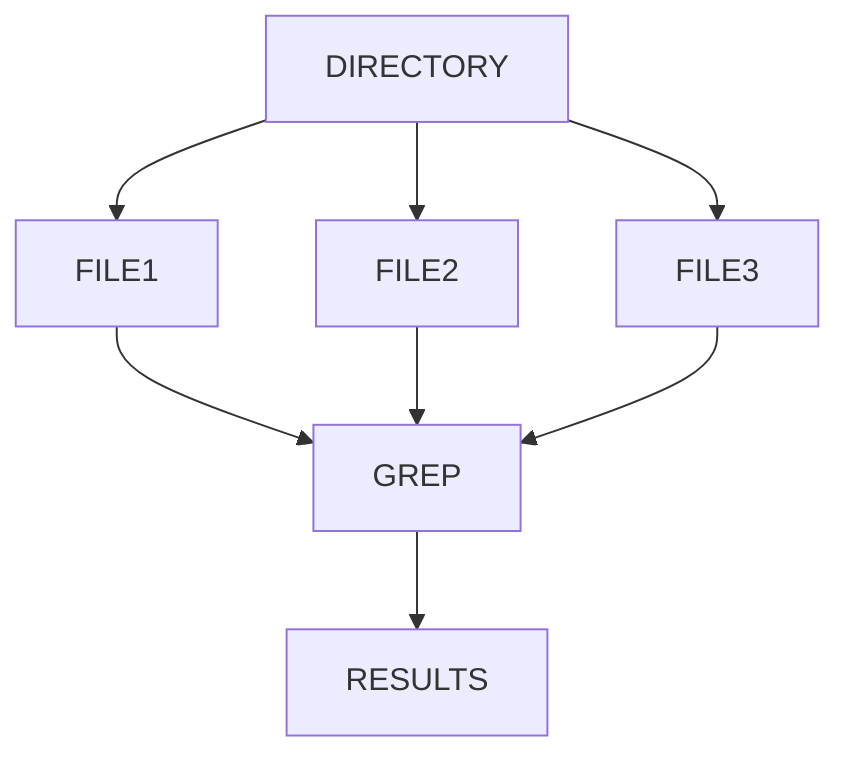
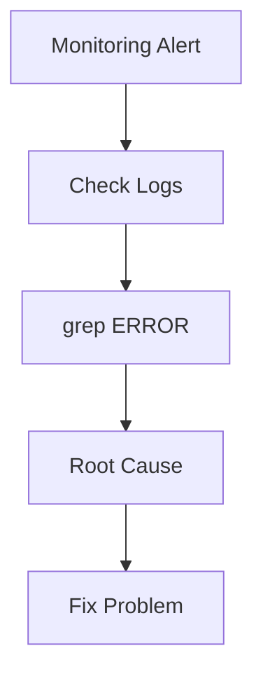
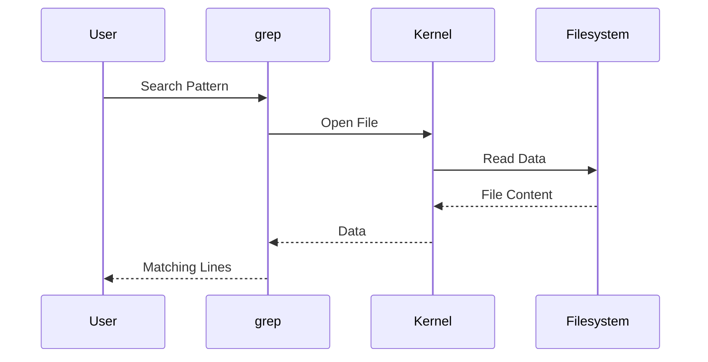

# Lab 04 – Searching Data in Linux

> Modern systems generate enormous amounts of data.
>
> Logs.
>
> Configuration files.
>
> Application source code.
>
> Kubernetes manifests.
>
> Docker configurations.
>
> Database dumps.
>
> Monitoring outputs.
>
> The challenge is not creating data.
>
> The challenge is finding the right data at the right time.

---

# Lab Objective

By the end of this lab, you will:

* Understand how Linux searches files and content
* Find files quickly using multiple techniques
* Search inside files efficiently
* Use grep effectively
* Understand recursive searching
* Search logs like production engineers
* Investigate system problems using search tools
* Build troubleshooting habits used by SREs and DevOps engineers

---

# Why This Matters

Imagine it is 2:00 AM.

Your monitoring system alerts:

```text
Production API is down.
```

Your server contains:

```text
10,000+ files
50+ services
Gigabytes of logs
Multiple applications
Containers
```

You need answers immediately.

Questions include:

```text
Which log contains the error?

Which configuration changed?

Which process is failing?

Where is the application configuration?

Which container generated the error?
```

Searching is one of the most valuable Linux skills.

---

# The Problem Searching Solves

Without search:

```text
Manually open files
Read line by line
Waste hours
Miss critical clues
```

With search:

```text
Locate data in seconds
Identify failures quickly
Troubleshoot efficiently
Automate investigations
```

---

# Mental Model

Think of Linux as a massive library.

```text
Linux Filesystem

Library
│
├── Books (Files)
├── Shelves (Directories)
├── Chapters (Content)
└── Search Engine (grep/find)
```

Without search:

```text
Find one page manually
```

With search:

```text
Jump directly to relevant information
```

---

# First Principles

There are two major search categories:

## Search for Files

Find:

```text
Where is nginx.conf?

Where is app.log?

Where is backup.sql?
```

Tools:

```text
find
locate
```

---

## Search Inside Files

Find:

```text
ERROR
WARNING
database connection failed
```

Tools:

```text
grep
egrep
fgrep
```

---

# Search Architecture



---

# Lab Environment Setup

Create workspace.

```bash
mkdir -p ~/linux-labs/searching
cd ~/linux-labs/searching
```

Create sample files.

```bash
touch app.log
touch database.log
touch nginx.conf
touch config.conf
touch users.txt
```

Add content.

```bash
echo "ERROR Database Connection Failed" > app.log
echo "WARNING Memory Usage High" > database.log
echo "server_name example.com" > nginx.conf
echo "APP_ENV=production" > config.conf
```

---

# Understanding Search Types



---

# Searching for Files with find

The most important file search tool.

Basic syntax:

```bash
find <path> <condition>
```

Example:

```bash
find . -name "app.log"
```

Output:

```text
./app.log
```

---

# How find Works



---

# Lab Task 1

Find:

```bash
find . -name "database.log"
```

Find:

```bash
find . -name "*.conf"
```

Observe output.

---

# Searching by File Type

Find only directories:

```bash
find . -type d
```

Find only files:

```bash
find . -type f
```

---

# Lab Task 2

Run:

```bash
find . -type f
find . -type d
```

Understand the difference.

---

# Searching by Size

Create:

```bash
dd if=/dev/zero of=bigfile.bin bs=1M count=10
```

Search:

```bash
find . -size +5M
```

Meaning:

```text
Files larger than 5 MB
```

---

# Production Example

Find huge log files:

```bash
find /var/log -size +500M
```

Useful when:

```text
Disk Full
Storage Alert
Server Running Out Of Space
```

---

# Searching by Modification Time

Find recently changed files:

```bash
find . -mtime -1
```

Meaning:

```text
Modified within 1 day
```

---

# Production Scenario

Investigate:

```text
System broke after configuration change.
```

Find recent changes:

```bash
find /etc -mtime -1
```

---

# Search by Permissions

Find world writable files:

```bash
find / -perm -002
```

Security teams use this frequently.

---

# Searching with locate

Unlike find:

```text
find = real-time scan

locate = database lookup
```

Install database:

```bash
sudo updatedb
```

Search:

```bash
locate nginx.conf
```

---

# locate Architecture


---

# Difference Between find and locate

| Feature       | find   | locate        |
| ------------- | ------ | ------------- |
| Real Time     | Yes    | No            |
| Fast          | Slower | Very Fast     |
| Accurate      | Yes    | Depends on DB |
| Large Systems | Slower | Faster        |

---

# Searching Inside Files with grep

Most important troubleshooting tool.

Search:

```bash
grep "ERROR" app.log
```

Output:

```text
ERROR Database Connection Failed
```

---

# grep Workflow


---

# Lab Task 3

Search:

```bash
grep "WARNING" database.log
```

Search:

```bash
grep "APP_ENV" config.conf
```

---

# Case Insensitive Search

Normal:

```bash
grep "error" app.log
```

Might fail.

Use:

```bash
grep -i "error" app.log
```

---

# Search Line Numbers

```bash
grep -n "ERROR" app.log
```

Example:

```text
1:ERROR Database Connection Failed
```

Useful for debugging.

---

# Recursive Search

Search entire directory:

```bash
grep -r "ERROR" .
```

This is one of the most used commands in production.

---

# Recursive Search Architecture



---

# Lab Task 4

Create:

```bash
mkdir logs
echo "ERROR API Failed" > logs/api.log
echo "ERROR Database Down" > logs/db.log
```

Search:

```bash
grep -r "ERROR" .
```

---

# Count Matches

Count errors:

```bash
grep -c "ERROR" logs/api.log
```

Output:

```text
1
```

---

# Display Only File Names

```bash
grep -l "ERROR" *.log
```

Useful when:

```text
Hundreds of log files exist.
```

---

# Search In Logs

Create:

```bash
cat > server.log
```

Paste:

```text
INFO Server Started
INFO User Login
ERROR Database Failed
WARNING Memory High
ERROR API Timeout
```

Press:

```text
CTRL + D
```

Search:

```bash
grep "ERROR" server.log
```

---

# Production Log Investigation



---

# Search Multiple Patterns

Search:

```bash
grep -E "ERROR|WARNING" server.log
```

Output:

```text
ERROR Database Failed
WARNING Memory High
ERROR API Timeout
```

---

# Production Scenario

Find:

```text
Errors
Warnings
Timeouts
Connection Failures
```

Quickly.

---

# Combining Commands

Find log files:

```bash
find . -name "*.log"
```

Search contents:

```bash
grep -r "ERROR" .
```

Combined workflow:


---

# Guided Challenge

Create:

```text
project

├── logs
│   ├── api.log
│   ├── db.log
│   └── auth.log
```

Add:

```text
INFO
WARNING
ERROR
```

messages.

Tasks:

```text
Find all logs
Search ERROR
Search WARNING
Count matches
```

---

# Semi-Guided Challenge

Create:

```text
configs
```

Store:

```text
database.url
redis.url
api.key
```

Use grep to find:

```text
redis
```

---

# Independent Challenge

Build:

```text
company

├── app
│   ├── logs
│   ├── configs
│   └── scripts

├── database
│   ├── logs
│   └── backups
```

Requirements:

* Search files
* Search contents
* Search recursively
* Search recent files
* Search large files

---

# Linux Internals

When grep runs:



---

# Modern World Connections

Searching is used everywhere.

| Technology | Usage              |
| ---------- | ------------------ |
| Docker     | Container logs     |
| Kubernetes | Pod logs           |
| Nginx      | Access logs        |
| PostgreSQL | Error logs         |
| CI/CD      | Build logs         |
| Linux      | System logs        |
| Cloud      | Instance debugging |

---

# Performance Considerations

Searching large systems can be expensive.

Example:

```bash
grep -r ERROR /
```

Bad idea.

Reasons:

```text
Millions of files
High disk I/O
CPU consumption
Slow execution
```

Search narrowly.

---

# Security Considerations

Search tools often reveal:

```text
Passwords
Tokens
Secrets
Certificates
API Keys
```

Be careful.

Example:

```bash
grep -r "password" .
```

May expose sensitive information.

---

# Common Mistakes

## Mistake 1

Searching entire filesystem.

```bash
grep -r ERROR /
```

Too expensive.

---

## Mistake 2

Using locate without updating database.

```bash
updatedb
```

required periodically.

---

## Mistake 3

Ignoring case sensitivity.

Use:

```bash
grep -i
```

when unsure.

---

# Troubleshooting

## No Results

Check:

```bash
ls
cat file
```

Verify content exists.

---

## Too Many Results

Restrict search:

```bash
grep ERROR app.log
```

instead of:

```bash
grep -r ERROR .
```

---

## Slow Search

Use:

```bash
locate
```

for filename searches.

---

# Engineering Mindset

Beginners search manually.

Engineers search systematically.

Ask:

```text
What am I searching?

File?
Content?
Recent change?
Large file?
Security issue?
```

Choose the right tool.

---

# Interview Questions

### Difference between find and locate?

```text
find   -> Real-time search

locate -> Database-based search
```

---

### What does grep do?

Searches text for patterns.

---

### What does grep -r do?

Recursively searches directories.

---

### How do you find recently modified files?

```bash
find . -mtime -1
```

---

### How do you search for all .log files?

```bash
find . -name "*.log"
```

---

### How do SREs use grep?

To analyze logs and troubleshoot production incidents.

---

# Cheat Sheet

```bash
find . -name "*.log"

find . -type f

find . -type d

find . -size +100M

find . -mtime -1

locate nginx.conf

grep "ERROR" file.log

grep -i "error" file.log

grep -n "ERROR" file.log

grep -r "ERROR" .

grep -c "ERROR" file.log

grep -l "ERROR" *.log

grep -E "ERROR|WARNING" file.log
```

---

# Lab Success Criteria

You can complete this lab when you can:

✅ Search for files

✅ Search file contents

✅ Use find confidently

✅ Use grep confidently

✅ Search recursively

✅ Analyze logs

✅ Locate configuration files

✅ Investigate failures using search tools

✅ Explain how Linux performs searches internally

Congratulations.

You now possess one of the most important troubleshooting skills used by Linux administrators, DevOps engineers, cloud engineers, SREs, and platform engineers every day.
