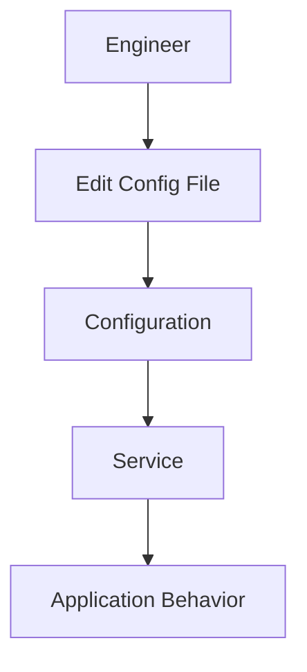
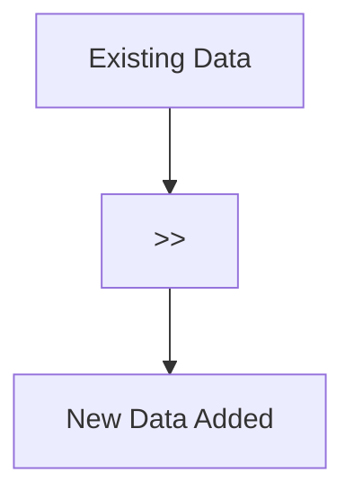
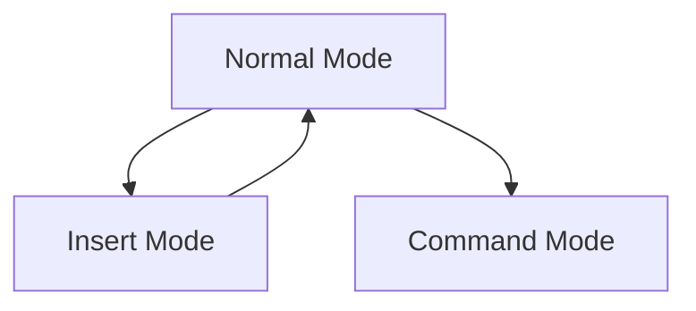
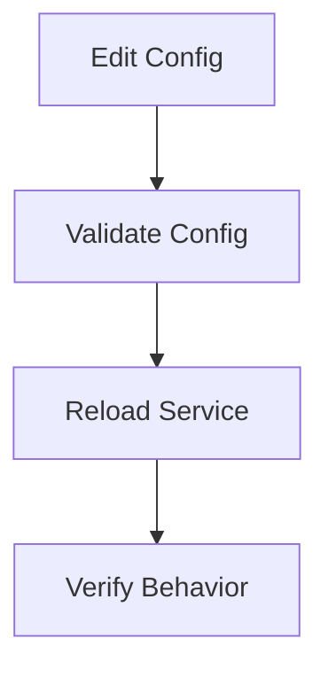
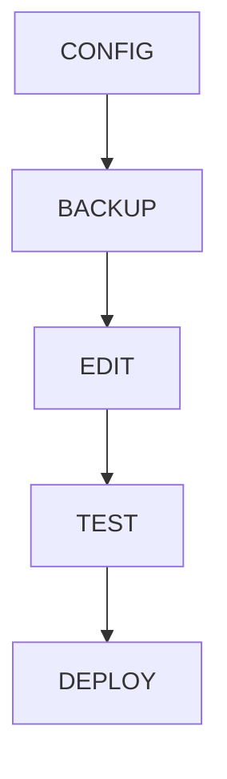
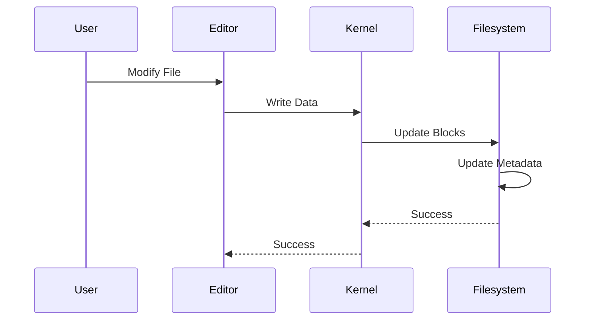

# Lab 05 – Editing Files in Linux

> Linux systems are controlled through files.
>
> Want to configure Nginx?
>
> Edit a file.
>
> Want to configure Docker?
>
> Edit a file.
>
> Want to configure Kubernetes?
>
> Edit a YAML file.
>
> Want to configure PostgreSQL?
>
> Edit a file.
>
> Modern infrastructure is largely the art of editing text files correctly.

---

# Lab Objective

By the end of this lab you will:

* Understand why text files are central to Linux
* Create and edit files from the command line
* Use nano effectively
* Understand basic Vim operations
* Edit configuration files safely
* Learn production editing workflows
* Understand how Linux stores changes
* Develop habits used by Linux administrators, DevOps engineers, SREs, and Platform Engineers

---

# Why This Matters

Imagine a production incident:

```text
Website returning 502 errors.
```

Investigation reveals:

```text
Incorrect Nginx configuration.
```

Solution:

```text
Edit nginx.conf
Reload service
Verify fix
```

Or:

```text
Database not starting
```

Cause:

```text
Incorrect PostgreSQL configuration
```

Again:

```text
Edit configuration file
```

Most Linux administration eventually becomes:

```text
Read file
Understand file
Modify file
Validate file
```

---

# The Problem Editing Solves

Modern Linux systems contain:

```text
Configuration Files
Application Files
Scripts
Logs
YAML Files
JSON Files
INI Files
Environment Files
```

Without editing:

```text
Cannot configure systems
Cannot automate
Cannot troubleshoot
Cannot deploy applications
```

---

# Mental Model

Think of files as instruction manuals.

```text
Application
     ↑
 Reads
     ↑
Configuration File
```

When you edit the file:

```text
You change application behavior.
```

---

# Infrastructure Configuration Flow



---

# First Principles

Linux follows a simple philosophy:

```text
Store everything as text whenever possible.
```

Why?

Text files are:

```text
Human Readable
Easy To Backup
Easy To Search
Easy To Automate
Easy To Version Control
```

---

# Examples in Real Systems

| Technology     | Configuration File |
| -------------- | ------------------ |
| Nginx          | nginx.conf         |
| SSH            | sshd_config        |
| Docker Compose | docker-compose.yml |
| Kubernetes     | deployment.yaml    |
| PostgreSQL     | postgresql.conf    |
| Redis          | redis.conf         |
| Systemd        | *.service          |

---

# Editing Architecture


---

# Lab Environment Setup

Create workspace:

```bash
mkdir -p ~/linux-labs/editing
cd ~/linux-labs/editing
```

Create file:

```bash
touch notes.txt
```

---

# Method 1: Using echo

Quick edits.

Create:

```bash
echo "Hello Linux" > notes.txt
```

View:

```bash
cat notes.txt
```

Output:

```text
Hello Linux
```

---

# Understanding >


---

# Important Warning

This command:

```bash
echo "New Data" > notes.txt
```

overwrites the file.

Previous content:

```text
Lost
```

---

# Lab Task 1

Create:

```bash
echo "Linux Fundamentals" > course.txt
```

Verify:

```bash
cat course.txt
```

Replace content:

```bash
echo "Linux Engineering" > course.txt
```

Observe.

---

# Appending Data

Use:

```bash
>>
```

instead of:

```bash
>
```

Example:

```bash
echo "Day 1" > journal.txt
echo "Day 2" >> journal.txt
echo "Day 3" >> journal.txt
```

View:

```bash
cat journal.txt
```

Output:

```text
Day 1
Day 2
Day 3
```

---

# Append Workflow



---

# Lab Task 2

Create:

```bash
echo "INFO Server Started" > app.log
```

Append:

```bash
echo "INFO User Login" >> app.log
echo "ERROR Database Failed" >> app.log
```

View:

```bash
cat app.log
```

---

# Editing with Nano

Nano is beginner friendly.

Open:

```bash
nano notes.txt
```

---

# Nano Interface

```text
+--------------------------------+
| File Content                   |
|                                |
|                                |
+--------------------------------+
| ^G Help  ^O Save  ^X Exit      |
+--------------------------------+
```

---

# Common Nano Operations

Save:

```text
CTRL + O
```

Exit:

```text
CTRL + X
```

Search:

```text
CTRL + W
```

Cut:

```text
CTRL + K
```

Paste:

```text
CTRL + U
```

---

# Lab Task 3

Open:

```bash
nano notes.txt
```

Add:

```text
Linux
Docker
Kubernetes
Cloud
```

Save and exit.

Verify:

```bash
cat notes.txt
```

---

# Why Nano Matters

During production incidents:

```text
SSH Into Server
Edit Configuration
Save
Restart Service
```

Nano is often available everywhere.

---

# Editing with Vim

Most advanced Linux engineers know Vim.

Open:

```bash
vim notes.txt
```

---

# Vim Mental Model

Vim has modes.



---

# Enter Insert Mode

Press:

```text
i
```

Now type normally.

---

# Exit Insert Mode

Press:

```text
ESC
```

---

# Save File

Type:

```vim
:w
```

---

# Save and Exit

```vim
:wq
```

---

# Exit Without Saving

```vim
:q!
```

---

# Minimal Vim Survival Guide

```text
i       Insert
ESC     Normal Mode
:w      Save
:wq     Save & Exit
:q!     Quit Without Saving
```

---

# Lab Task 4

Create:

```bash
vim config.conf
```

Add:

```text
ENV=production
PORT=8080
DEBUG=false
```

Save and exit.

---

# Editing Production Configurations

Example:

```bash
sudo nano /etc/nginx/nginx.conf
```

or

```bash
sudo vim /etc/nginx/nginx.conf
```

Modify.

Then verify:

```bash
nginx -t
```

Then reload:

```bash
systemctl reload nginx
```

---

# Production Workflow



---

# Never Edit Blindly

Before editing:

```bash
cp nginx.conf nginx.conf.backup
```

This simple habit has saved countless outages.

---

# Backup Workflow



---

# Lab Task 5

Create:

```bash
cp config.conf config.conf.backup
```

Edit original.

Compare:

```bash
cat config.conf
cat config.conf.backup
```

---

# Editing Large Files

View without opening editor:

```bash
less large.log
```

Navigation:

```text
Space   Next Page
b       Previous Page
/       Search
q       Quit
```

---

# Why less Exists

Large logs may contain:

```text
Millions of lines
```

Opening them fully is inefficient.

---

# Real Production Example

Investigating logs:

```bash
less /var/log/syslog
```

Search:

```text
/ERROR
```

Jump directly to errors.

---

# Linux Internals

What happens during editing?



---

# File Modification Flow


---

# Timestamps

Edit file:

```bash
stat notes.txt
```

Observe:

```text
Access
Modify
Change
```

Modify time updates.

---

# Production Example

Find recently edited files:

```bash
find /etc -mtime -1
```

Useful when:

```text
A change caused an outage.
```

---

# Configuration Management

Modern infrastructure uses:

```text
Git
Ansible
Terraform
Helm
Kubernetes YAML
```

All depend on text file editing.

---

# Modern World Connections

Editing files powers:

| Technology     | File Types      |
| -------------- | --------------- |
| Docker         | Dockerfile      |
| Kubernetes     | YAML            |
| Nginx          | .conf           |
| Redis          | redis.conf      |
| PostgreSQL     | postgresql.conf |
| GitHub Actions | YAML            |
| Terraform      | .tf             |

---

# Performance Considerations

Large files can cause:

```text
Slow Editors
Memory Usage
High Disk I/O
```

Tools like:

```bash
less
grep
sed
awk
```

often outperform full editors.

---

# Security Considerations

Editing wrong files can expose:

```text
Passwords
Secrets
API Keys
Certificates
```

Always verify:

```bash
pwd
ls
```

before editing.

---

# Common Mistakes

## Mistake 1

Using:

```bash
>
```

instead of:

```bash
>>
```

Result:

```text
Data overwritten
```

---

## Mistake 2

Editing production config without backup.

Always:

```bash
cp config config.backup
```

---

## Mistake 3

Reloading service without validation.

Always:

```bash
Validate
Then Reload
```

---

# Troubleshooting

## Changes Not Appearing

Check:

```bash
cat file
```

Verify save occurred.

---

## Vim Frozen

Likely in Normal Mode.

Press:

```text
i
```

to enter Insert Mode.

---

## Cannot Save

Check:

```bash
ls -l
```

Permission issue.

---

# Engineering Mindset

Beginners edit files.

Engineers edit systems.

Remember:

```text
Configuration File
        ↓
Service
        ↓
Application
        ↓
Users
```

A single line change can:

```text
Fix an outage
Create an outage
Improve performance
Create security risks
```

Treat every edit seriously.

---

# Interview Questions

### Difference between > and >> ?

```text
>    Overwrite

>>   Append
```

---

### Why use Nano?

Simple and beginner friendly.

---

### Why learn Vim?

Available on almost every Linux server.

Fast for advanced users.

---

### Why backup config files?

Allows rollback if changes break systems.

---

### What does stat show?

File metadata including timestamps.

---

### Why validate configs before reload?

Prevents broken services from being deployed.

---

# Cheat Sheet

```bash
nano file.txt

vim file.txt

echo "data" > file.txt

echo "data" >> file.txt

cat file.txt

less file.txt

cp config.conf config.conf.backup

stat file.txt

:w

:wq

:q!
```

---

# Lab Success Criteria

You can complete this lab when you can:

✅ Create and edit files

✅ Use echo safely

✅ Understand overwrite vs append

✅ Use Nano confidently

✅ Perform basic Vim operations

✅ Create backups before editing

✅ Understand configuration management

✅ Explain how Linux writes file changes

✅ Connect editing to Docker, Kubernetes, databases, and cloud systems

Congratulations.

You now possess one of the most important day-to-day skills used by Linux administrators, DevOps engineers, SREs, cloud engineers, and platform engineers.
