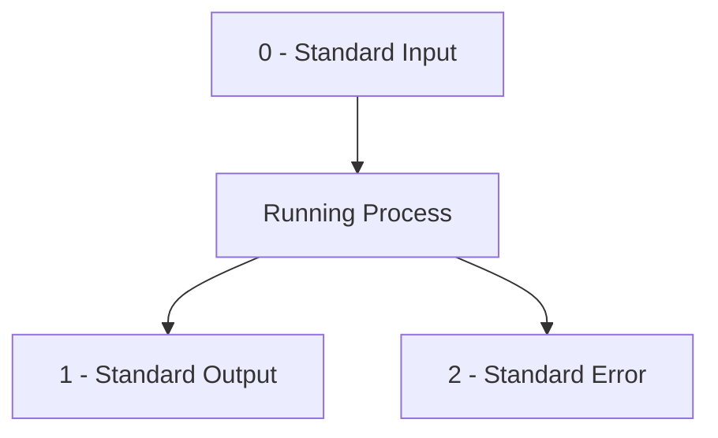
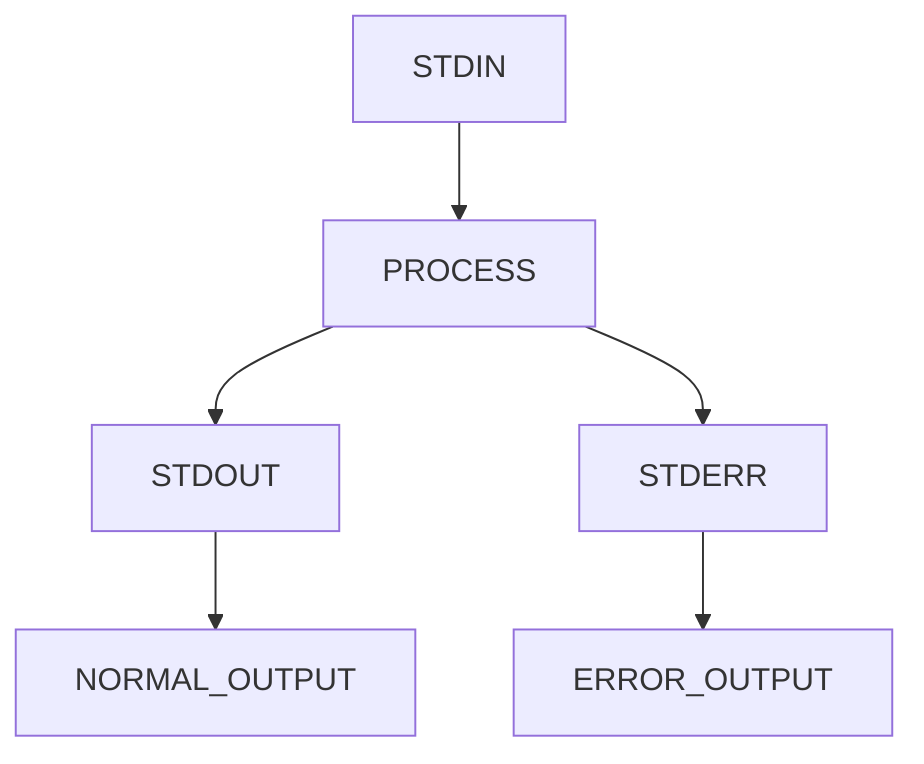
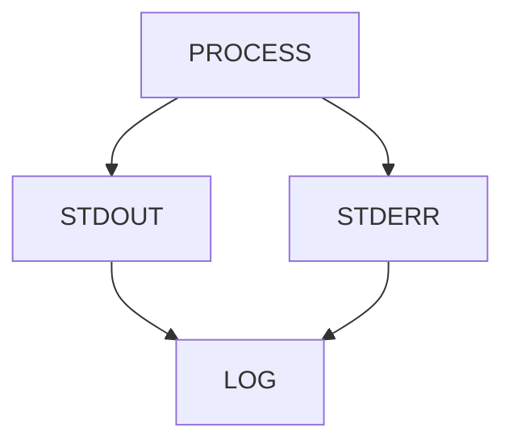
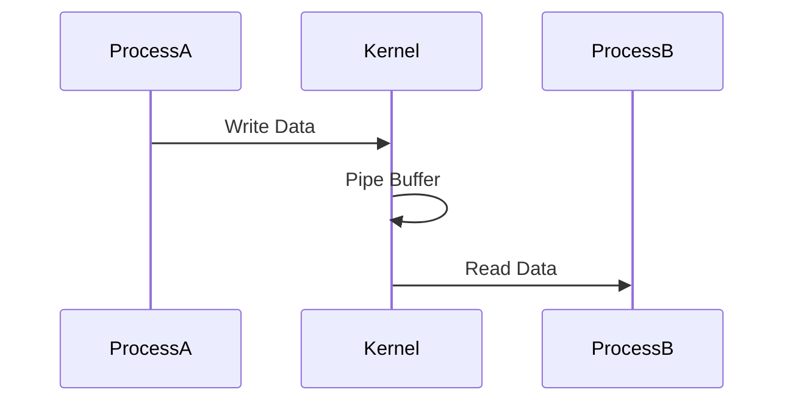

# Lab 06 – Pipes and Redirection

> Pipes and redirection are among the most powerful ideas in Linux.
>
> They are why small Linux tools can be combined into incredibly powerful systems.
>
> Docker logs, Kubernetes troubleshooting, monitoring pipelines, CI/CD systems, log processing, security analysis, observability platforms, and distributed systems debugging all rely on the same fundamental concepts you will learn in this lab.
>
> This lab is not about symbols like `|`, `>`, or `<`.
>
> It is about understanding how Linux moves data between processes.

---

# Lab Objective

By the end of this lab you will:

* Understand Linux input/output streams
* Understand Standard Input (STDIN)
* Understand Standard Output (STDOUT)
* Understand Standard Error (STDERR)
* Master output redirection
* Master input redirection
* Master pipelines
* Combine multiple commands together
* Build data-processing workflows
* Think like a Linux engineer

---

# Why This Matters

Imagine you are troubleshooting a production API server.

Logs contain:

```text
20 million lines
```

You need:

```text
Only ERROR messages
Only from today
Only from one service
Only top 10 occurrences
```

You could:

```text
Read manually for hours
```

Or:

```bash
cat app.log | grep ERROR | sort | uniq -c | sort -nr | head
```

Result:

```text
5 seconds
```

This is Linux engineering.

---

# The Problem Pipes Solve

Without pipes:

```text
Program A
Produces Data

Program B
Needs Data

Program C
Needs Results
```

You would need:

```text
Temporary files
Manual work
Complex software
```

Linux solved this decades ago.

---

# Mental Model

Think of Linux commands as factory machines.

```text
Machine A -> Machine B -> Machine C
```

Each machine:

```text
Receives Input
Processes Data
Produces Output
```

Pipes connect machines together.

---

# Data Processing Factory


---

# First Principles

Every Linux process starts with three streams.

```text
STDIN
STDOUT
STDERR
```

These are the foundation of Linux communication.

---

# The Three Standard Streams



---

# Think Like Water Flow

```text
Input Pipe
      ↓

Program

      ↓
Output Pipe

      ↓
Result
```

Linux commands process streams.

Not files.

Not screens.

Streams.

---

# Understanding STDIN

Standard Input means:

```text
Where data comes from
```

Example:

```bash
cat
```

Now type:

```text
Hello Linux
```

Press:

```text
CTRL+D
```

Output:

```text
Hello Linux
```

Why?

Because:


---

# Understanding STDOUT

Standard Output means:

```text
Normal program output
```

Example:

```bash
ls
```

Produces:

```text
file1.txt
file2.txt
```

This appears on screen.

The screen receives STDOUT.

---

# STDOUT Architecture


---

# Understanding STDERR

Standard Error contains:

```text
Errors
Warnings
Failures
```

Example:

```bash
ls does-not-exist
```

Output:

```text
No such file or directory
```

This comes through:

```text
STDERR
```

---

# STDERR Architecture


---

# Why Linux Separates Output

Imagine:

```bash
backup-script
```

Produces:

```text
Normal Logs
Error Logs
```

Keeping them separate allows:

```text
Automation
Monitoring
Observability
Debugging
```

---

# Combined Stream Model



---

# Lab Environment Setup

Create workspace:

```bash
mkdir -p ~/linux-labs/pipes
cd ~/linux-labs/pipes
```

Create file:

```bash
echo "Linux" > data.txt
echo "Docker" >> data.txt
echo "Kubernetes" >> data.txt
```

---

# Output Redirection (>)

Normally:

```bash
echo "Hello"
```

Output:

```text
Hello
```

Displayed on terminal.

With redirection:

```bash
echo "Hello" > file.txt
```

Output goes into file.

---

# Redirection Flow


---

# Lab Task 1

Run:

```bash
echo "Linux Fundamentals" > notes.txt
```

Verify:

```bash
cat notes.txt
```

---

# Important Warning

`>` overwrites.

Example:

```bash
echo "A" > file.txt
echo "B" > file.txt
```

Result:

```text
B
```

Previous content destroyed.

---

# Append Redirection (>>)

Append instead of overwrite.

```bash
echo "Line 1" > log.txt
echo "Line 2" >> log.txt
echo "Line 3" >> log.txt
```

Result:

```text
Line 1
Line 2
Line 3
```

---

# Append Architecture


---

# Lab Task 2

Create:

```bash
echo "INFO Server Started" > app.log
echo "INFO User Login" >> app.log
echo "ERROR DB Failed" >> app.log
```

View:

```bash
cat app.log
```

---

# Redirecting Errors

Normal output:

```bash
ls
```

Error:

```bash
ls missing-file
```

Redirect STDERR:

```bash
ls missing-file 2> error.log
```

Check:

```bash
cat error.log
```

---

# STDERR Redirection


---

# Why This Matters

Production systems often use:

```bash
application 2> errors.log
```

to separate failures from normal output.

---

# Redirect Both STDOUT and STDERR

```bash
command > output.log 2>&1
```

Meaning:

```text
STDOUT -> output.log
STDERR -> output.log
```

---

# Combined Logging



---

# Lab Task 3

Run:

```bash
ls existing-file missing-file > output.log 2>&1
```

Observe:

```bash
cat output.log
```

---

# Input Redirection (<)

Instead of keyboard input:

```bash
cat < data.txt
```

Input comes from file.

---

# Input Flow


---

# Why Input Redirection Exists

Useful for:

```text
Scripts
Automation
Batch Processing
Testing
```

---

# Introducing Pipes (|)

Pipe:

```bash
|
```

Connects commands.

Output of one command becomes input of another.

---

# Pipe Architecture


---

# First Pipe Example

```bash
cat data.txt | sort
```

Meaning:

```text
cat produces output

sort consumes output
```

---

# Data Flow


---

# Lab Task 4

Create:

```bash
echo "banana" > fruits.txt
echo "apple" >> fruits.txt
echo "orange" >> fruits.txt
```

Run:

```bash
cat fruits.txt | sort
```

Observe sorted output.

---

# Filtering Data with grep

Search:

```bash
cat app.log | grep ERROR
```

Output:

```text
ERROR DB Failed
```

---

# Search Pipeline


---

# Counting Results

```bash
cat app.log | grep ERROR | wc -l
```

Meaning:

```text
Find errors

Count them
```

---

# Multi-Step Processing


---

# Real Production Example

Count failed logins:

```bash
cat auth.log | grep FAILED | wc -l
```

---

# Sorting Data

Example:

```bash
cat fruits.txt | sort
```

Reverse:

```bash
cat fruits.txt | sort -r
```

---

# Unique Values

Create:

```bash
echo apple > items.txt
echo apple >> items.txt
echo banana >> items.txt
```

Run:

```bash
cat items.txt | sort | uniq
```

---

# Unique Pipeline


---

# Most Common Production Pipeline

```bash
cat app.log | grep ERROR | sort | uniq -c | sort -nr
```

What happens?


---

# Why Pipes Made Linux Famous

Instead of building:

```text
One Giant Tool
```

Linux philosophy is:

```text
Many Small Tools
```

Connected through pipes.

---

# Linux Philosophy


---

# Guided Challenge

Create:

```bash
echo ERROR > logs.txt
echo INFO >> logs.txt
echo ERROR >> logs.txt
echo WARNING >> logs.txt
```

Tasks:

```text
Find ERROR entries
Count ERROR entries
Sort entries
Remove duplicates
```

---

# Semi-Guided Challenge

Build pipeline:

```text
Read file

Search INFO

Count lines
```

Expected tools:

```text
cat
grep
wc
```

---

# Independent Challenge

Create:

```text
server.log
```

with:

```text
100+ lines
INFO
WARNING
ERROR
DEBUG
```

Build pipelines to:

```text
Count errors

Count warnings

Show unique errors

Show top occurring messages
```

---

# Linux Internals

What happens when a pipe is created?



---

# Pipe Buffer Internals


Kernel creates a temporary buffer.

Processes communicate through it.

---

# Modern World Connections

Pipes power:

| Technology       | Usage              |
| ---------------- | ------------------ |
| Docker Logs      | Log Processing     |
| Kubernetes       | kubectl pipelines  |
| CI/CD            | Build Pipelines    |
| Monitoring       | Metrics Processing |
| Security         | Log Analysis       |
| Observability    | Event Streams      |
| Data Engineering | Data Pipelines     |

---

# Performance Considerations

Good:

```bash
grep ERROR file.log
```

Bad:

```bash
cat file.log | grep ERROR
```

Why?

Because:

```text
Extra process created
Extra CPU work
```

Engineers optimize pipelines.

---

# Security Considerations

Pipelines often process:

```text
Logs
Credentials
Secrets
API Keys
Tokens
```

Be careful where output is redirected.

Example:

```bash
command > public.log
```

may leak sensitive information.

---

# Common Mistakes

## Mistake 1

Using:

```bash
>
```

instead of:

```bash
>>
```

Result:

```text
Data loss
```

---

## Mistake 2

Ignoring STDERR.

Important errors disappear.

---

## Mistake 3

Creating unnecessarily long pipelines.

Keep them readable.

---

# Troubleshooting

## Empty Output

Check:

```bash
cat file
```

Verify source data exists.

---

## No Matches

Check:

```bash
grep -i
```

Maybe case mismatch.

---

## Missing Error Logs

Redirect STDERR correctly:

```bash
2>
```

---

# Engineering Mindset

Beginners see:

```text
Commands
```

Engineers see:

```text
Data Streams
```

Think:

```text
Input

Processing

Output
```

This mindset scales from:

```text
Linux Commands

→ Bash Scripts

→ CI/CD Pipelines

→ Docker

→ Kubernetes

→ Distributed Data Pipelines
```

---

# Interview Questions

### What are STDIN, STDOUT, and STDERR?

```text
STDIN  = Input

STDOUT = Normal Output

STDERR = Error Output
```

---

### What does > do?

Redirect output and overwrite.

---

### What does >> do?

Append output.

---

### What does | do?

Connect output of one process to input of another.

---

### What does 2> do?

Redirect STDERR.

---

### Why are pipes important?

They allow composition of small tools into powerful workflows.

---

# Cheat Sheet

```bash
echo hello > file.txt

echo hello >> file.txt

cat < file.txt

ls > output.log

ls missing 2> error.log

command > output.log 2>&1

cat file.txt | sort

cat file.txt | grep ERROR

cat file.txt | grep ERROR | wc -l

cat file.txt | sort | uniq

cat file.txt | grep ERROR | sort | uniq -c

grep ERROR app.log
```

---

# Lab Success Criteria

You can complete this lab when you can:

✅ Explain STDIN, STDOUT, STDERR

✅ Use output redirection

✅ Use append redirection

✅ Redirect errors

✅ Redirect input

✅ Build pipelines

✅ Process logs with pipelines

✅ Understand pipe internals

✅ Explain why Linux uses streams

✅ Connect pipes to Docker, Kubernetes, CI/CD, observability, and distributed systems

Congratulations.

You have learned one of the most powerful concepts in Linux and one of the core ideas that influenced modern cloud-native engineering.
