# Lab 07 – Command Line Productivity

> The difference between a beginner and an experienced Linux engineer is often not knowledge.
>
> It is speed.
>
> Senior engineers navigate faster.
>
> Search faster.
>
> Debug faster.
>
> Automate faster.
>
> Recover incidents faster.
>
> This lab teaches the productivity techniques that experienced Linux administrators, DevOps engineers, SREs, cloud engineers, and platform engineers use every day.

---

# Lab Objective

By the end of this lab you will:

* Navigate Linux faster
* Master shell history
* Use command completion efficiently
* Search command history
* Use aliases
* Use command chaining
* Work with multiple terminals
* Improve troubleshooting speed
* Learn engineering workflows
* Build habits used in production environments

---

# Why This Matters

Imagine a production outage.

You have:

```text
5 minutes
```

to investigate.

You need to:

```text
Check logs
Inspect services
Find configuration files
Analyze network connections
Review system resources
```

A beginner may need:

```text
30 minutes
```

An experienced engineer may need:

```text
3 minutes
```

The difference is productivity.

---

# The Real Problem

Most beginners use Linux like this:

```text
Type Command
     ↓
Wait
     ↓
Type Again
     ↓
Wait
```

Experienced engineers use Linux like this:

```text
History
Aliases
Completion
Pipelines
Automation
Keyboard Shortcuts
```

Result:

```text
10x Faster
```

---

# Mental Model

Think of Linux as a cockpit.

A beginner uses:

```text
One Button At A Time
```

An experienced engineer uses:

```text
Keyboard Shortcuts
Automation
Macros
Muscle Memory
```

---

# Productivity Architecture

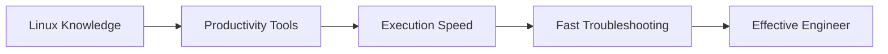

---

# First Principles

Engineering productivity is:

```text
Reducing Repetition
```

Every repeated action should become:

```text
Shortcut
Alias
Automation
Script
```

---

# Lab Environment Setup

```bash
mkdir -p ~/linux-labs/productivity
cd ~/linux-labs/productivity
```

---

# Command History

Linux remembers commands.

View history:

```bash
history
```

Example:

```text
1 pwd
2 ls
3 cd projects
4 cat file.txt
```

---

# Why History Matters

Instead of:

```text
Re-typing Commands
```

Use:

```text
History Recall
```

---

# History Architecture

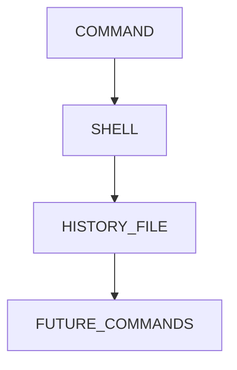

---

# Lab Task 1

Run:

```bash
pwd
ls
date
history
```

Observe history entries.

---

# Using Arrow Keys

Press:

```text
↑
```

Previous command.

Press:

```text
↓
```

Next command.

This alone saves thousands of keystrokes.

---

# Reverse History Search

One of the most valuable shortcuts.

Press:

```text
CTRL + R
```

Search:

```text
docker
```

Linux finds previous matching commands.

Example:

```bash
docker ps
```

appears instantly.

---

# Reverse Search Workflow

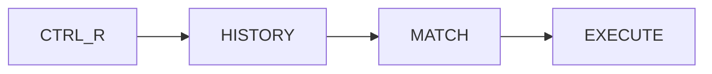

---

# Lab Task 2

Run:

```bash
docker --help
```

or

```bash
ls
```

Press:

```text
CTRL + R
```

Search for:

```text
ls
```

Observe results.

---

# Tab Completion

One of Linux's greatest productivity features.

Instead of:

```bash
cd /home/user/projects/linux-labs
```

Type:

```bash
cd /ho<TAB>
```

Linux completes automatically.

---

# Completion Architecture

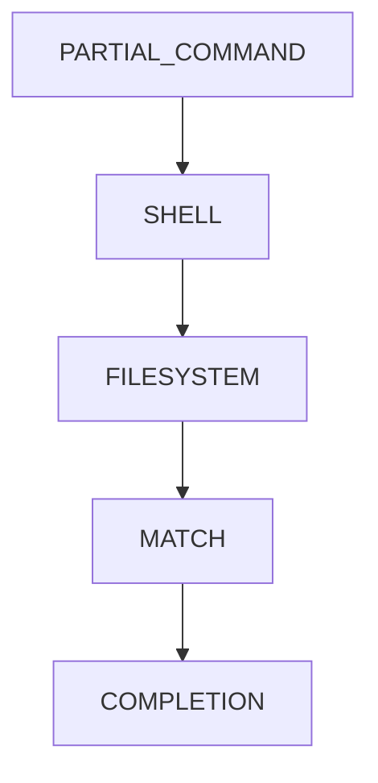

---

# Lab Task 3

Create:

```bash
mkdir productivity-demo
```

Try:

```bash
cd pro<TAB>
```

Observe completion.

---

# Double Tab Discovery

Type:

```bash
cd /
```

Then:

```text
<TAB><TAB>
```

Linux displays options.

Useful for exploration.

---

# Command Chaining

Instead of:

```bash
pwd
ls
date
```

Use:

```bash
pwd ; ls ; date
```

---

# Chaining Architecture

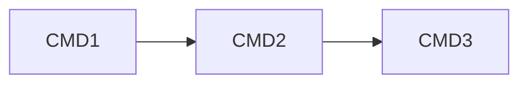

---

# Lab Task 4

Run:

```bash
pwd ; ls ; whoami
```

Observe sequential execution.

---

# Conditional Execution

Run next command only if previous succeeds.

```bash
mkdir test && cd test
```

Meaning:

```text
Create Directory

IF SUCCESS

Change Directory
```

---

# Conditional Flow

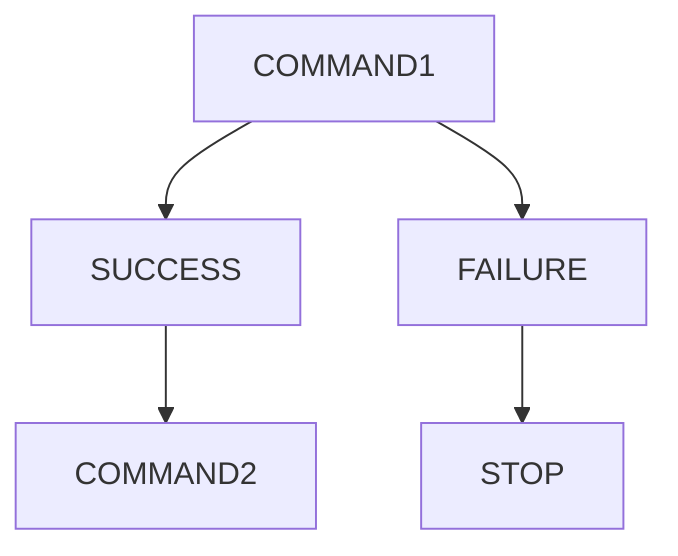

---

# Why Engineers Love &&

Common example:

```bash
git pull && npm install && npm run build
```

If one step fails:

```text
Stop Immediately
```

---

# Alternative: ||

Run command if previous fails.

Example:

```bash
mkdir test || echo "Already Exists"
```

---

# Failure Handling Flow

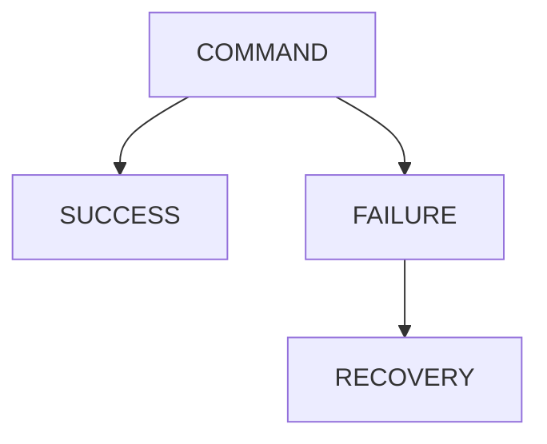

---

# Aliases

Engineers automate repetitive commands.

Example:

```bash
alias ll='ls -la'
```

Now:

```bash
ll
```

works.

---

# Alias Architecture

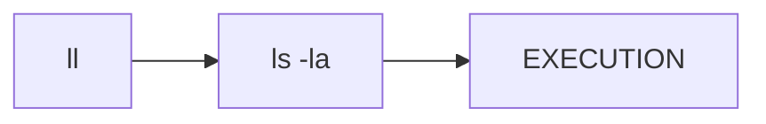

---

# Lab Task 5

Create:

```bash
alias ll='ls -la'
```

Run:

```bash
ll
```

---

# Permanent Aliases

Temporary:

```bash
alias ll='ls -la'
```

Permanent:

```bash
nano ~/.bashrc
```

Add:

```bash
alias ll='ls -la'
alias gs='git status'
alias k='kubectl'
```

Reload:

```bash
source ~/.bashrc
```

---

# Why DevOps Engineers Use Aliases

Examples:

```bash
alias k='kubectl'

alias kgp='kubectl get pods'

alias kgs='kubectl get svc'
```

Huge productivity gains.

---

# Using clear

Clear terminal:

```bash
clear
```

Shortcut:

```text
CTRL + L
```

Much faster.

---

# Viewing Command History Efficiently

Search:

```bash
history | grep docker
```

Example:

```bash
history | grep kubectl
```

---

# Production Example

Find previous deployment commands.

```bash
history | grep deploy
```

Useful during incidents.

---

# Reusing Previous Arguments

Linux provides:

```bash
!$
```

Example:

```bash
mkdir project
cd !$
```

Expands to:

```bash
cd project
```

---

# Workflow Visualization

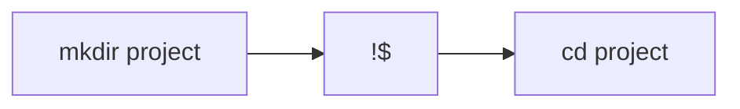

---

# Repeat Previous Command

Run:

```bash
!!
```

Repeats last command.

Example:

```bash
sudo !!
```

Common pattern:

```bash
apt update
```

Fails.

Then:

```bash
sudo !!
```

Expands:

```bash
sudo apt update
```

---

# Productivity Example

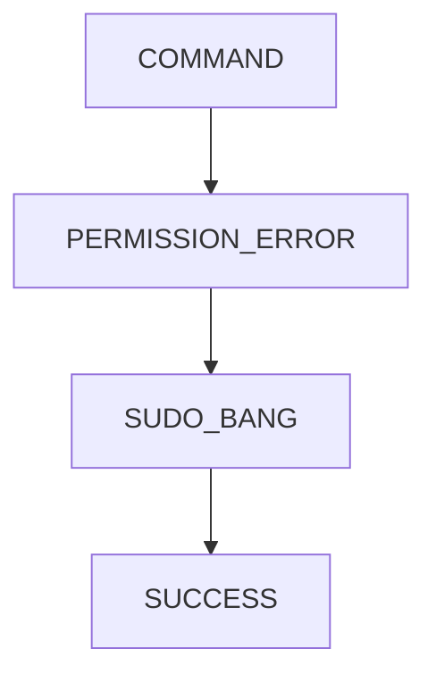

---

# Multiple Terminal Workflow

Experienced engineers rarely use one terminal.

Typical setup:

```text
Terminal 1 → Logs
Terminal 2 → Application
Terminal 3 → Monitoring
Terminal 4 → Commands
```

---

# Production Investigation

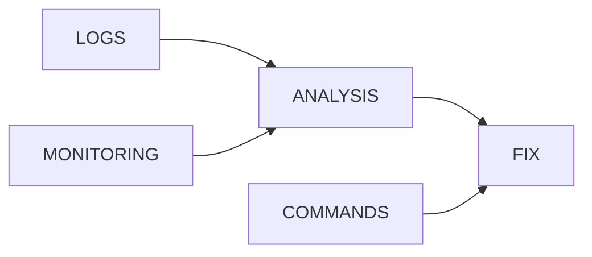

---

# Terminal Multiplexers

Tools:

```text
tmux
screen
```

Allow:

```text
Multiple Sessions
Persistent Sessions
Remote Workflows
```

---

# Why tmux Matters

Imagine:

```text
SSH Connection Lost
```

Without tmux:

```text
Work Lost
```

With tmux:

```text
Work Continues
```

---

# Basic tmux Commands

Install:

```bash
sudo apt install tmux
```

Start:

```bash
tmux
```

Detach:

```text
CTRL+B D
```

Reattach:

```bash
tmux attach
```

---

# tmux Architecture

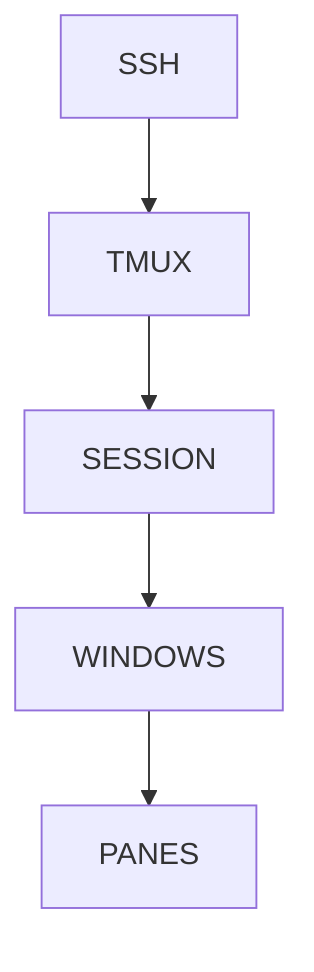

---

# Keyboard Shortcuts Every Engineer Uses

| Shortcut | Purpose              |
| -------- | -------------------- |
| CTRL+C   | Stop Process         |
| CTRL+L   | Clear Screen         |
| CTRL+R   | Search History       |
| CTRL+A   | Start Of Line        |
| CTRL+E   | End Of Line          |
| CTRL+U   | Delete Before Cursor |
| CTRL+K   | Delete After Cursor  |
| TAB      | Completion           |

---

# Lab Task 6

Practice:

```text
CTRL+A
CTRL+E
CTRL+R
CTRL+L
TAB
```

until comfortable.

---

# Production Scenario

Investigating server issue.

Workflow:

```bash
history | grep nginx

cd /var/log/nginx

grep ERROR access.log

tail -f error.log
```

Engineer productivity directly affects recovery time.

---

# Linux Internals

Where is history stored?

Usually:

```bash
~/.bash_history
```

View:

```bash
cat ~/.bash_history
```

---

# Shell Productivity Architecture

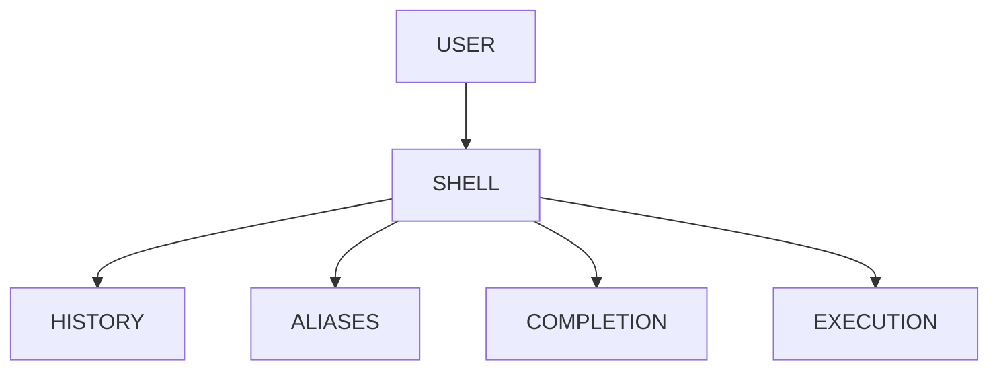

---

# Modern World Connections

Productivity techniques power:

| Technology           | Usage                     |
| -------------------- | ------------------------- |
| Docker               | Fast Container Management |
| Kubernetes           | kubectl Shortcuts         |
| GitOps               | Git Workflows             |
| CI/CD                | Automation                |
| Cloud                | Fast Troubleshooting      |
| SRE                  | Incident Response         |
| Platform Engineering | Operational Efficiency    |

---

# Performance Considerations

A slow engineer:

```text
100 Commands
100 Repetitions
```

A productive engineer:

```text
Aliases
History
Automation
```

Less typing.

Fewer mistakes.

Faster outcomes.

---

# Security Considerations

History can contain:

```text
Passwords
Tokens
Secrets
API Keys
```

Avoid:

```bash
command --password=mysecret
```

because it may enter history.

---

# Common Mistakes

## Mistake 1

Ignoring TAB completion.

Huge productivity loss.

---

## Mistake 2

Re-typing commands repeatedly.

Use:

```text
History
CTRL+R
```

---

## Mistake 3

Never creating aliases.

Results in unnecessary work.

---

## Mistake 4

Working in one terminal.

Use multiple terminals or tmux.

---

# Troubleshooting

## Alias Not Working

Check:

```bash
alias
```

Verify definition.

---

## History Missing

Check:

```bash
echo $HISTFILE
```

Usually:

```text
~/.bash_history
```

---

## Completion Not Working

Verify shell:

```bash
echo $SHELL
```

---

# Engineering Mindset

Beginners focus on:

```text
Learning Commands
```

Experienced engineers focus on:

```text
Reducing Friction
```

Ask:

```text
Can this be faster?

Can this be automated?

Can this be reused?
```

That mindset eventually becomes:

```text
Shell Scripts

→ Automation

→ CI/CD

→ Infrastructure as Code

→ Platform Engineering
```

---

# Interview Questions

### What does CTRL+R do?

Search command history.

---

### What is an alias?

A shortcut for another command.

---

### Difference between ; and && ?

```text
;   Always Execute Next

&&  Execute Only On Success
```

---

### What does !! do?

Repeat previous command.

---

### What does !$ do?

Reuse previous command's last argument.

---

### Why use tmux?

Persistent terminal sessions and multitasking.

---

# Cheat Sheet

```bash
history

history | grep docker

alias ll='ls -la'

source ~/.bashrc

pwd ; ls ; date

mkdir project && cd project

mkdir project || echo "exists"

!!

!$

clear

tmux

tmux attach
```

---

# Lab Success Criteria

You can complete this lab when you can:

✅ Use command history efficiently

✅ Search history with CTRL+R

✅ Use TAB completion

✅ Create aliases

✅ Use command chaining

✅ Use conditional execution

✅ Reuse previous commands

✅ Use multiple terminal workflows

✅ Understand tmux basics

✅ Work significantly faster in Linux

Congratulations.

You have started developing one of the biggest differences between beginners and professional Linux engineers:

**Command-line efficiency and operational speed.**
