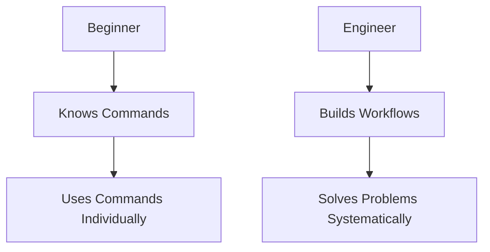
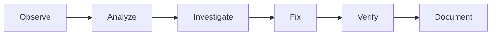
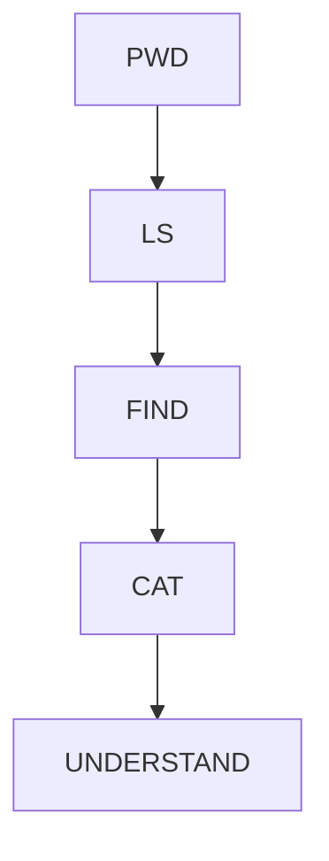
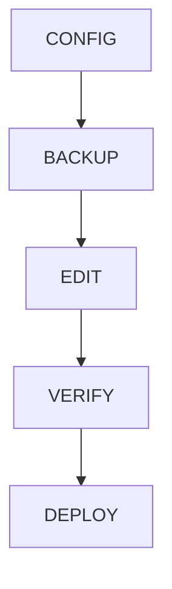
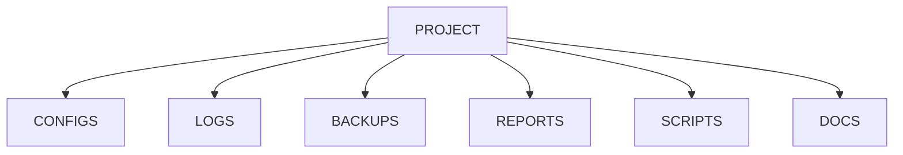
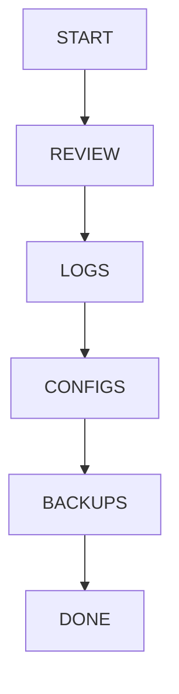
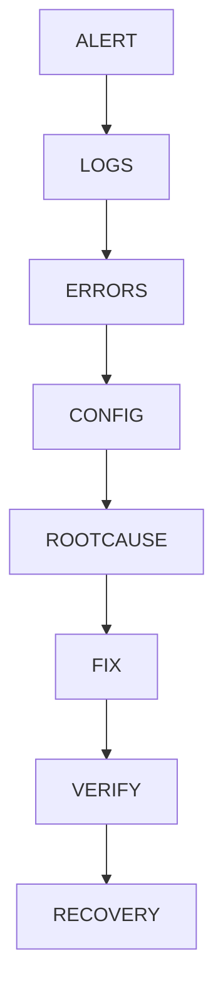
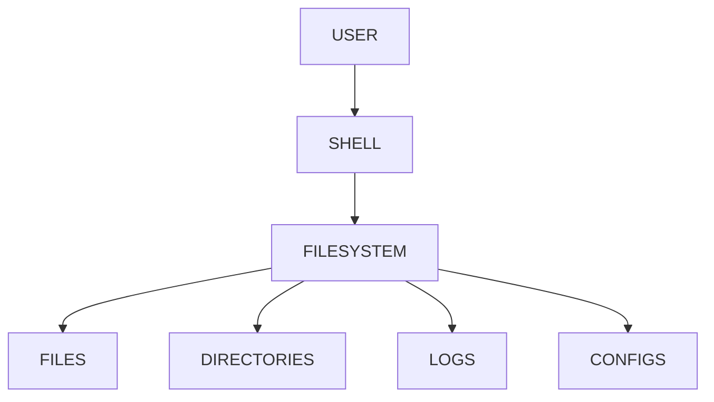

# Lab 08 – Building a Linux Workflow

> Commands are not the goal.
>
> Workflows are the goal.
>
> Beginners learn commands.
>
> Engineers build workflows.
>
> Senior engineers think in systems.
>
> They combine navigation, file operations, searching, editing, redirection, pipelines, automation, and troubleshooting into repeatable operational workflows.
>
> This lab brings together everything learned in the Beginner Labs and transforms it into a practical engineering workflow.

---

# Lab Objective

By the end of this lab you will:

* Combine multiple Linux skills together
* Build repeatable workflows
* Think like an administrator
* Think like a DevOps engineer
* Think like an SRE
* Develop operational habits
* Understand incident response workflows
* Create efficient daily Linux routines
* Build foundations for automation

---

# Why This Matters

Most Linux courses teach:

```text
pwd
ls
cd
cat
grep
nano
```

Individually.

Real engineers never use commands individually.

They use workflows.

Example:

```text
Alert Arrives
      ↓
Check Logs
      ↓
Find Error
      ↓
Inspect Configuration
      ↓
Validate Change
      ↓
Restart Service
      ↓
Verify Recovery
```

This is a workflow.

---

# The Problem This Lab Solves

Beginners often know commands but struggle with:

```text
Where do I start?

What should I check first?

How do I investigate?

How do I organize my work?

How do I avoid mistakes?
```

Workflows solve this.

---

# Mental Model

Think of Linux as a workshop.

Commands are tools.

```text
Hammer
Screwdriver
Wrench
Drill
```

Knowing tools is useful.

But building something requires a process.

Linux workflows are those processes.

---

# Engineer vs Beginner



---

# First Principles

Every operational task follows:

```text
Observe

Understand

Investigate

Modify

Verify

Document
```

Never skip steps.

---

# Universal Engineering Workflow



This pattern appears everywhere:

* Linux
* Docker
* Kubernetes
* Databases
* Cloud
* Distributed Systems

---

# Lab Environment Setup

Create a realistic environment.

```bash
mkdir -p ~/linux-workflow-lab
cd ~/linux-workflow-lab
```

Create structure:

```bash
mkdir logs configs backups scripts reports
```

Create sample files:

```bash
touch logs/app.log
touch logs/error.log

touch configs/app.conf
touch configs/database.conf

touch reports/report.txt
```

---

# Workflow 1: Daily System Inspection

Every Linux engineer performs some variation of this.

---

## Step 1: Know Where You Are

```bash
pwd
```

Verify:

```bash
ls
```

---

## Step 2: Inspect Files

```bash
ls -lah
```

Look for:

```text
Large Files
Recent Changes
Unexpected Files
```

---

## Step 3: Search Important Data

```bash
find . -name "*.conf"
```

Find configurations.

---

## Step 4: Inspect Content

```bash
cat configs/app.conf
```

---

## Workflow Visualization



---

# Lab Task 1

Perform:

```bash
pwd

ls -lah

find . -name "*.conf"
```

Record observations.

---

# Workflow 2: Investigating Application Errors

This is one of the most common production activities.

---

# Scenario

Users report:

```text
Application Not Working
```

---

## Step 1: Locate Logs

```bash
find . -name "*.log"
```

---

## Step 2: Search Errors

```bash
grep ERROR logs/*.log
```

---

## Step 3: Count Errors

```bash
grep ERROR logs/*.log | wc -l
```

---

## Step 4: Identify Patterns

```bash
grep ERROR logs/*.log | sort | uniq -c
```

---

# Investigation Workflow


---

# Lab Task 2

Add sample errors:

```bash
echo "ERROR Database Failed" >> logs/error.log
echo "ERROR Timeout" >> logs/error.log
echo "ERROR Timeout" >> logs/error.log
```

Investigate using:

```bash
grep

sort

uniq

wc
```

---

# Workflow 3: Safe Configuration Changes

One of the most important operational skills.

---

# Golden Rule

Never edit production configuration without backup.

---

## Step 1: Locate Configuration

```bash
find configs -name "*.conf"
```

---

## Step 2: Create Backup

```bash
cp configs/app.conf backups/app.conf.bak
```

---

## Step 3: Edit

```bash
nano configs/app.conf
```

---

## Step 4: Verify

```bash
cat configs/app.conf
```

---

## Step 5: Compare

```bash
diff backups/app.conf.bak configs/app.conf
```

---

# Safe Editing Workflow



---

# Why This Matters

Many outages happen because:

```text
Direct Edit
      ↓
Broken Configuration
      ↓
Service Failure
```

Backups reduce risk.

---

# Lab Task 3

Create:

```bash
echo "ENV=dev" > configs/app.conf
```

Backup:

```bash
cp configs/app.conf backups/
```

Change:

```bash
echo "ENV=prod" > configs/app.conf
```

Compare:

```bash
diff backups/app.conf configs/app.conf
```

---

# Workflow 4: Log Analysis Pipeline

One of the most valuable Linux skills.

---

# Scenario

Large application log.

Need:

```text
Only Errors
```

---

# Pipeline

```bash
cat logs/error.log | grep ERROR
```

---

# Better Pipeline

```bash
grep ERROR logs/error.log
```

---

# Advanced Pipeline

```bash
grep ERROR logs/error.log \
| sort \
| uniq -c \
| sort -nr
```

---

# Pipeline Architecture


---

# Lab Task 4

Create:

```bash
echo "ERROR API" >> logs/error.log
echo "ERROR API" >> logs/error.log
echo "ERROR DB" >> logs/error.log
```

Run:

```bash
grep ERROR logs/error.log \
| sort \
| uniq -c \
| sort -nr
```

---

# Workflow 5: Project Organization

Engineers organize work consistently.

---

# Poor Structure

```text
project

1000 files here
```

---

# Better Structure

```text
project

├── configs
├── logs
├── backups
├── scripts
├── reports
└── docs
```

---

# Architecture



---

# Why Organization Matters

Benefits:

```text
Faster Navigation

Better Automation

Easier Troubleshooting

Scalability
```

---

# Workflow 6: Daily Engineer Routine

A realistic workflow.

---

## Morning

Check environment.

```bash
pwd
ls
```

---

## Review Changes

```bash
find . -mtime -1
```

---

## Review Logs

```bash
grep ERROR logs/*.log
```

---

## Verify Configurations

```bash
find configs -name "*.conf"
```

---

## Backup Important Data

```bash
cp configs/*.conf backups/
```

---

# Daily Workflow Diagram



---

# Workflow 7: Incident Response

This is where Linux engineering becomes valuable.

---

# Incident

```text
Service Down
```

---

## Step 1

Gather Evidence.

```bash
pwd
ls
```

---

## Step 2

Locate Logs.

```bash
find . -name "*.log"
```

---

## Step 3

Search Errors.

```bash
grep ERROR logs/*.log
```

---

## Step 4

Inspect Configuration.

```bash
find . -name "*.conf"
```

---

## Step 5

Compare Recent Changes.

```bash
diff backups/app.conf configs/app.conf
```

---

## Step 6

Apply Fix.

---

## Step 7

Verify.

---

# Incident Response Architecture



---

# Workflow 8: Building Your First Operational Playbook

Create:

```text
playbook.md
```

Contents:

```text
1. Verify location

2. Check files

3. Review logs

4. Search errors

5. Check configs

6. Backup before change

7. Verify after change

8. Document findings
```

This becomes a repeatable operational process.

---

# Linux Internals Perspective

Everything learned so far interacts with:



Linux workflows are simply structured interactions with the filesystem.

---

# Modern World Connections

These workflows scale directly into:

| Technology | Same Workflow             |
| ---------- | ------------------------- |
| Docker     | Container Logs            |
| Kubernetes | Pod Investigation         |
| PostgreSQL | Database Troubleshooting  |
| Redis      | Config Analysis           |
| Nginx      | Log Investigation         |
| AWS        | EC2 Operations            |
| GCP        | VM Troubleshooting        |
| Azure      | Infrastructure Operations |

---

# Example: Kubernetes

Same workflow.

```text
Pod Fails
      ↓
View Logs
      ↓
Search Errors
      ↓
Inspect YAML
      ↓
Apply Fix
      ↓
Verify
```

Only tools change.

The workflow remains.

---

# Performance Considerations

Good workflow:

```text
Find Relevant Data Quickly
```

Bad workflow:

```text
Open Everything
Read Everything
Waste Time
```

Efficient workflows reduce:

```text
CPU Time
Human Time
Incident Duration
Operational Cost
```

---

# Security Considerations

Always:

```text
Backup Before Editing

Verify Before Deleting

Inspect Before Executing
```

Avoid:

```bash
rm -rf
```

without verification.

---

# Common Mistakes

## Mistake 1

Jumping directly to a fix.

Engineers investigate first.

---

## Mistake 2

Editing without backup.

---

## Mistake 3

Ignoring logs.

Logs often contain answers.

---

## Mistake 4

No verification after changes.

---

## Mistake 5

No documentation.

Future engineers need context.

---

# Troubleshooting Framework

Use:

```text
Observe

Collect Evidence

Analyze

Hypothesize

Verify

Fix

Validate

Document
```

Every time.

---

# Engineering Mindset

Beginners think:

```text
Which command should I run?
```

Engineers think:

```text
What workflow should I follow?
```

Commands solve tasks.

Workflows solve problems.

---

# Interview Questions

### What is a Linux workflow?

A repeatable sequence of actions used to perform operational tasks efficiently and safely.

---

### Why backup before editing?

To enable rollback if changes cause failures.

---

### Why review logs first?

Logs often contain direct evidence of failures.

---

### What is incident response?

A structured process for investigating and resolving system issues.

---

### Why are workflows important?

They reduce mistakes, improve consistency, and accelerate troubleshooting.

---

# Cheat Sheet

```bash
pwd

ls -lah

find . -name "*.conf"

find . -name "*.log"

grep ERROR logs/*.log

grep ERROR logs/*.log | wc -l

grep ERROR logs/*.log | sort | uniq -c

cp config.conf config.conf.bak

diff old.conf new.conf

history

cat file
```

---

# Final Capstone Challenge

Build:

```text
linux-operations-lab

├── configs
├── logs
├── backups
├── scripts
├── reports
└── docs
```

Requirements:

```text
Create Files

Search Files

Edit Files

Backup Files

Analyze Logs

Use Pipelines

Document Findings

Create Operational Workflow
```

---

# Lab Success Criteria

You can complete this lab when you can:

✅ Navigate confidently

✅ Manage files and directories

✅ Search efficiently

✅ Edit safely

✅ Analyze logs

✅ Build pipelines

✅ Follow operational workflows

✅ Investigate incidents systematically

✅ Think beyond individual commands

✅ Operate Linux like an engineer

Congratulations.

You have completed the Beginner Labs section.

More importantly, you have started thinking like a Linux engineer rather than a Linux user.

The next sections of this repository will build on these workflows and scale them into:

```text
Linux Administration

→ System Internals

→ Networking

→ Storage

→ Services

→ Docker

→ Kubernetes

→ Cloud

→ Distributed Systems

→ Platform Engineering
```
