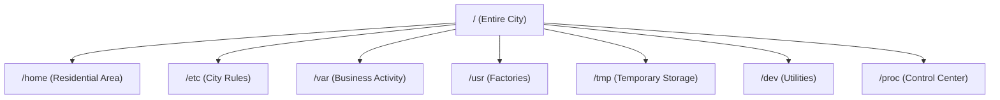
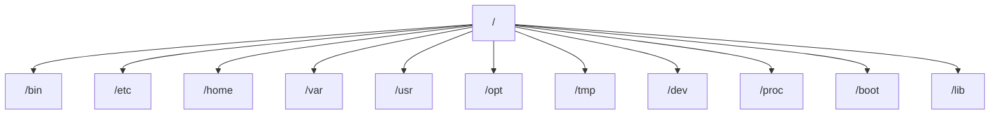
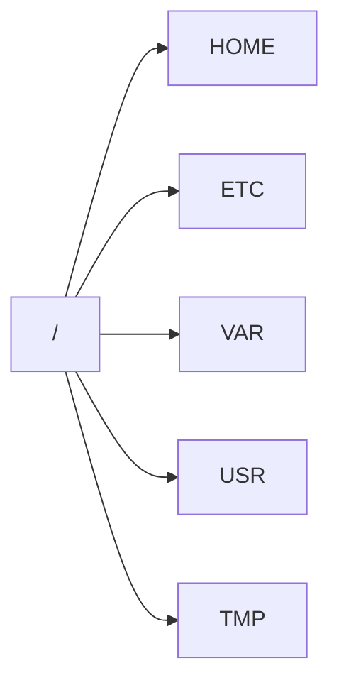
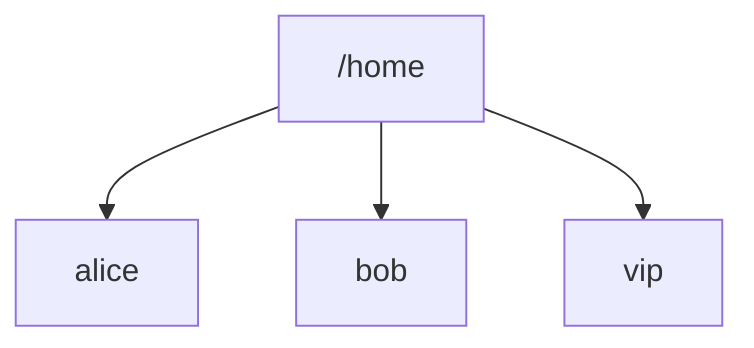
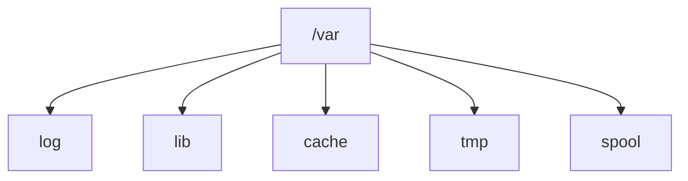
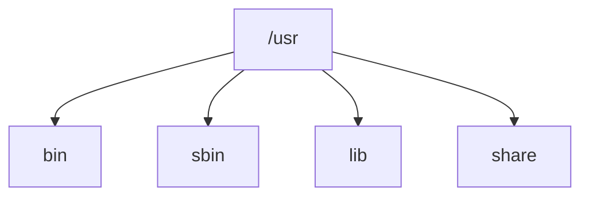
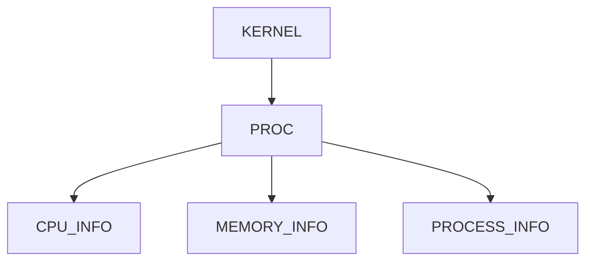
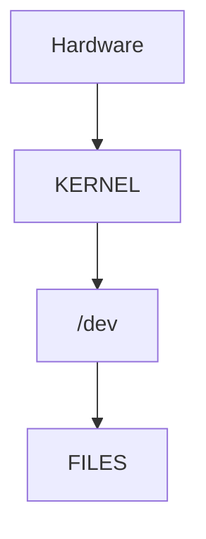
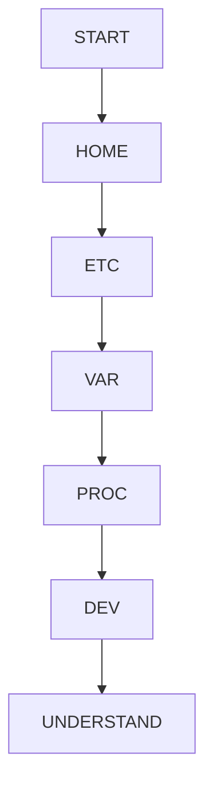
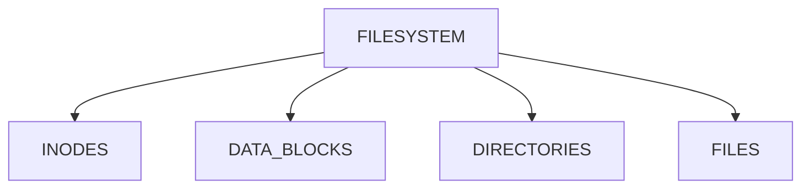

# Lab 01 – Filesystem Exploration

> Most Linux users see files and directories.
>
> Linux engineers see a filesystem.
>
> Filesystems are one of the most important abstractions in computing.
>
> Every database, container, cloud VM, Kubernetes node, application, and operating system ultimately depends on the filesystem.
>
> Before learning inodes, ext4, XFS, storage engineering, Docker storage, Kubernetes volumes, or cloud block storage, you must first learn how to explore and understand a Linux filesystem.

---

# Lab Objective

By the end of this lab you will:

* Understand the Linux filesystem hierarchy
* Explore important system directories
* Understand the purpose of each directory
* Learn how applications use the filesystem
* Understand filesystem relationships
* Build intuition for Linux storage organization
* Develop skills used by administrators, DevOps engineers, SREs, and platform engineers

---

# Why This Matters

Imagine a production outage.

An application suddenly fails.

You need answers:

```text
Where are logs stored?

Where are configuration files?

Where is application data?

Where are service definitions?

Where does Docker store images?

Where does PostgreSQL store data?
```

Without filesystem knowledge:

```text
You are guessing.
```

With filesystem knowledge:

```text
You know exactly where to investigate.
```

---

# The Problem This Lab Solves

A Linux system contains:

```text
Millions of files

Thousands of directories

Applications

Logs

Configurations

Libraries

Devices

Kernel information
```

Without structure:

```text
Chaos
```

The Linux filesystem provides:

```text
Organization

Predictability

Scalability

Manageability
```

---

# Mental Model

Think of Linux as a city.

```text
Linux System

├── Government Buildings
├── Residential Areas
├── Factories
├── Warehouses
├── Roads
└── Utilities
```

Each directory has a purpose.

---

# Filesystem City Analogy



---

# First Principles

Everything begins at:

```text
/
```

called:

```text
Root Directory
```

Every path originates here.

Unlike Windows:

```text
C:
D:
E:
```

Linux uses:

```text
Single Unified Tree
```

---

# Linux Filesystem Hierarchy Standard (FHS)

Linux follows a standard layout.

This standard ensures:

```text
Applications know where files belong.

Administrators know where data lives.

Tools work consistently.
```

---

# Filesystem Architecture



---

# Lab Environment Setup

Open terminal.

Navigate:

```bash
cd /
```

Verify:

```bash
pwd
```

Expected:

```text
/
```

---

# Step 1: Explore Root

List contents:

```bash
ls /
```

Better:

```bash
ls -lah /
```

Observe:

```text
bin
boot
dev
etc
home
proc
tmp
usr
var
```

---

# Visualization



---

# Lab Task 1

Run:

```bash
ls -lah /
```

Answer:

```text
Which directories exist?

Which are familiar?

Which are unfamiliar?
```

---

# Step 2: Explore /home

Navigate:

```bash
cd /home
```

List:

```bash
ls -lah
```

---

# Purpose

Stores:

```text
User Files

Documents

Downloads

Projects

Personal Configuration
```

Example:

```text
/home/vip
```

---

# Home Directory Architecture



---

# Lab Task 2

Explore:

```bash
cd ~

pwd

ls -lah
```

Observe:

```text
Documents

Downloads

Projects

Hidden Files
```

---

# Step 3: Explore /etc

Navigate:

```bash
cd /etc
```

---

# Purpose

Stores:

```text
System Configuration
```

Examples:

```text
passwd

hosts

ssh

nginx

systemd

resolv.conf
```

---

# Why /etc Matters

Most production investigations eventually reach:

```text
/etc
```

because configuration controls behavior.

---

# Configuration Flow


---

# Lab Task 3

Explore:

```bash
ls /etc
```

Find:

```bash
ls /etc/ssh

ls /etc/systemd
```

---

# Step 4: Explore /var

Navigate:

```bash
cd /var
```

---

# Purpose

Stores changing data.

Examples:

```text
Logs

Caches

Databases

Spool Files

Application Data
```

---

# Why /var Matters

Most troubleshooting begins here.

---

# /var Structure



---

# Lab Task 4

Explore:

```bash
ls /var

ls /var/log
```

Observe:

```text
syslog

auth.log

kern.log
```

---

# Production Scenario

Investigating outage:

```bash
cd /var/log

grep ERROR *
```

Most engineers spend significant time in:

```text
/var/log
```

---

# Step 5: Explore /usr

Navigate:

```bash
cd /usr
```

---

# Purpose

Stores:

```text
Applications

Libraries

Documentation

Tools
```

---

# Visualization



---

# Example

Find bash:

```bash
which bash
```

Output:

```text
/usr/bin/bash
```

---

# Lab Task 5

Explore:

```bash
ls /usr/bin | head

ls /usr/lib | head
```

Observe:

```text
Thousands of tools
```

---

# Step 6: Explore /tmp

Navigate:

```bash
cd /tmp
```

---

# Purpose

Temporary storage.

Applications use:

```text
Temporary Files

Caches

Working Data
```

---

# Important Property

Often cleared:

```text
After reboot
```

---

# Lab Task 6

Create:

```bash
touch /tmp/testfile
```

Verify:

```bash
ls /tmp
```

---

# Step 7: Explore /proc

One of the most important Linux directories.

Navigate:

```bash
cd /proc
```

---

# Mental Model

```text
Virtual Filesystem
```

Not real files.

Generated by the kernel.

---

# Architecture



---

# Examples

View CPU information:

```bash
cat /proc/cpuinfo
```

View memory:

```bash
cat /proc/meminfo
```

View uptime:

```bash
cat /proc/uptime
```

---

# Why /proc Matters

Monitoring tools use:

```text
/proc
```

to gather system metrics.

---

# Lab Task 7

Run:

```bash
cat /proc/cpuinfo | head

cat /proc/meminfo | head
```

Observe output.

---

# Step 8: Explore /dev

Navigate:

```bash
cd /dev
```

---

# Linux Philosophy

Everything is a file.

Devices are represented as files.

---

# Architecture



---

# Examples

```bash
ls /dev
```

Find:

```text
null

zero

sda

tty
```

---

# Useful Devices

Null device:

```bash
echo test > /dev/null
```

Output disappears.

---

# Lab Task 8

Run:

```bash
ls /dev | head
```

Observe.

---

# Filesystem Mapping Exercise

Match:

| Directory | Purpose         |
| --------- | --------------- |
| /home     | User Data       |
| /etc      | Configuration   |
| /var      | Changing Data   |
| /usr      | Applications    |
| /tmp      | Temporary Files |
| /proc     | Kernel Data     |
| /dev      | Devices         |

---

# Guided Challenge

Explore:

```bash
/

/home

/etc

/var

/usr

/tmp

/proc

/dev
```

Create notes:

```text
Purpose

Interesting Files

Potential Use Cases
```

---

# Semi-Guided Challenge

Find:

```text
System Configurations

Logs

User Files

Installed Programs

CPU Information
```

Use only:

```bash
cd

ls

cat

find
```

---

# Independent Challenge

Answer:

```text
Where are logs stored?

Where are user files stored?

Where are configurations stored?

Where does kernel information live?

Where do temporary files live?

Where are installed applications?
```

Verify answers using commands.

---

# Production Exploration Workflow



---

# Linux Internals

Every directory explored today belongs to a filesystem.

Internally:



Future labs will explore:

```text
Inodes

Ext4

XFS

Storage Internals

Filesystem Performance
```

---

# Modern World Connections

Filesystem knowledge directly impacts:

| Technology   | Filesystem Usage    |
| ------------ | ------------------- |
| Docker       | Image Storage       |
| Kubernetes   | Volumes             |
| PostgreSQL   | Database Files      |
| Redis        | Persistence         |
| Nginx        | Configurations      |
| Linux Kernel | Virtual Filesystems |
| Cloud VMs    | Root Volumes        |

---

# Performance Considerations

Filesystem layout affects:

```text
Disk I/O

Backup Speed

Application Performance

Storage Scalability
```

Poor understanding often causes:

```text
Storage Incidents

Disk Full Events

Slow Systems
```

---

# Security Considerations

Critical data lives in:

```text
/etc

/home

/var
```

Engineers must understand:

```text
Ownership

Permissions

Access Controls
```

before making changes.

---

# Common Mistakes

## Mistake 1

Treating all directories equally.

Each exists for a reason.

---

## Mistake 2

Storing application data in random locations.

Follow Linux standards.

---

## Mistake 3

Ignoring /var/log during troubleshooting.

Logs often reveal the problem.

---

## Mistake 4

Editing files in /etc without backups.

Always create backups.

---

# Troubleshooting

## Cannot Find Logs

Check:

```bash
cd /var/log
```

---

## Cannot Find Configuration

Check:

```bash
cd /etc
```

---

## Need System Information

Check:

```bash
cat /proc/*
```

---

## Need Device Information

Check:

```bash
ls /dev
```

---

# Engineering Mindset

Beginners see:

```text
Folders
```

Engineers see:

```text
System Architecture
```

Ask:

```text
Why does this directory exist?

What belongs here?

What should never belong here?

How does software use it?
```

That mindset leads to:

```text
Linux Administration

Storage Engineering

Cloud Infrastructure

Platform Engineering
```

---

# Interview Questions

### What is the root directory?

```text
/
```

Top of the filesystem hierarchy.

---

### What is stored in /etc?

System configuration.

---

### What is stored in /var?

Changing data such as logs and databases.

---

### What is /proc?

Virtual filesystem exposing kernel information.

---

### Why is /dev important?

Represents hardware devices as files.

---

### What is the purpose of /usr?

Stores applications, libraries, and tools.

---

# Cheat Sheet

```bash
cd /

ls -lah /

cd /etc

cd /var/log

cd /usr/bin

cat /proc/cpuinfo

cat /proc/meminfo

ls /dev

which bash

find /etc -name "*.conf"
```

---

# Lab Success Criteria

You can complete this lab when you can:

✅ Explain the Linux filesystem hierarchy

✅ Navigate key system directories

✅ Understand the purpose of /etc

✅ Understand the purpose of /var

✅ Understand the purpose of /usr

✅ Understand the purpose of /proc

✅ Understand the purpose of /dev

✅ Investigate systems using filesystem knowledge

✅ Connect filesystem organization to Docker, Kubernetes, databases, and cloud infrastructure

Congratulations.

You have completed your first deep filesystem lab and developed the mental model required for understanding Linux storage, filesystem internals, containers, and modern infrastructure.
