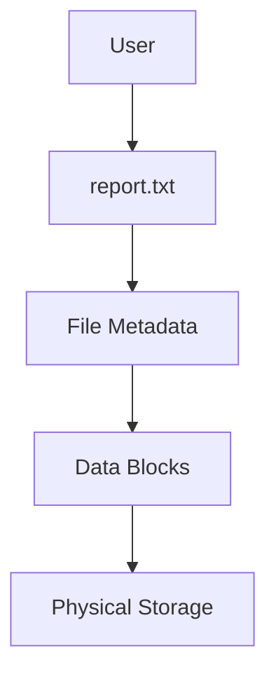
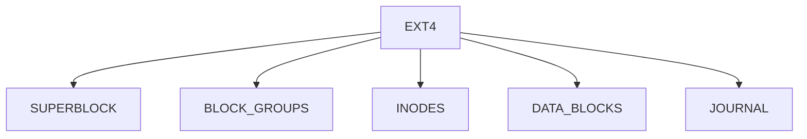
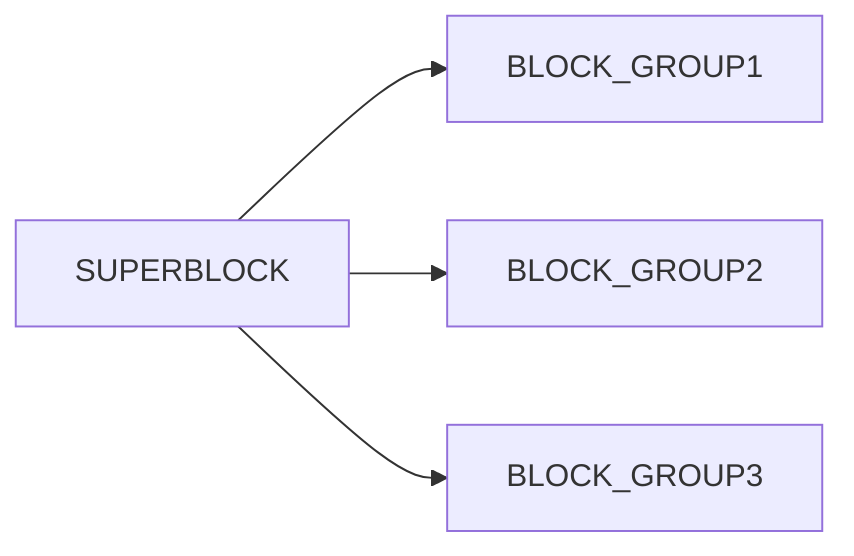
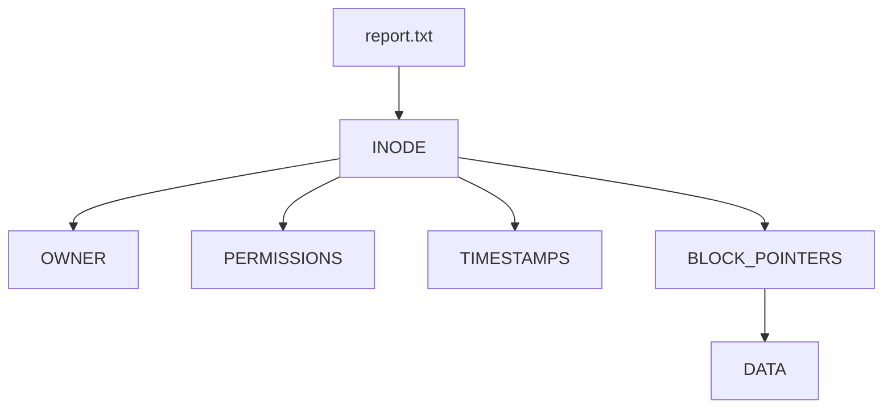
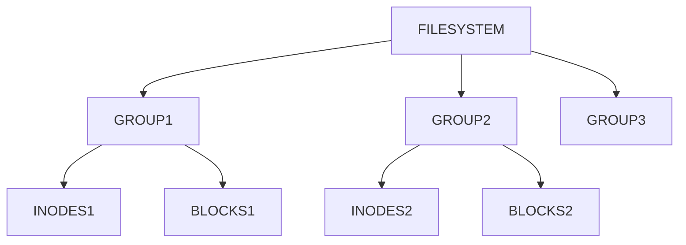
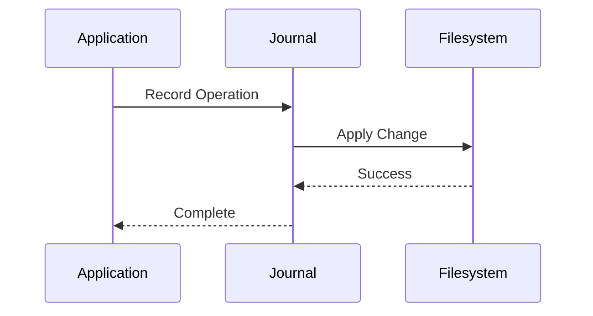
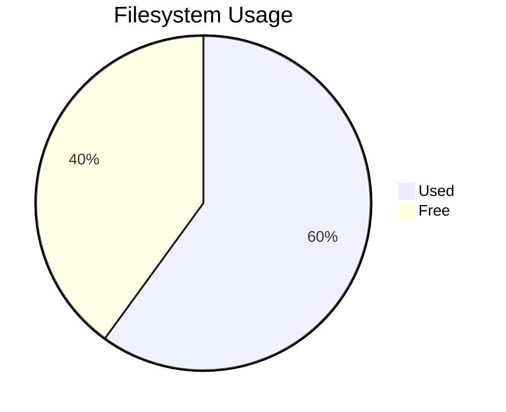
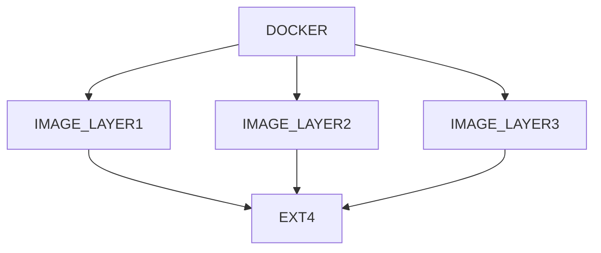
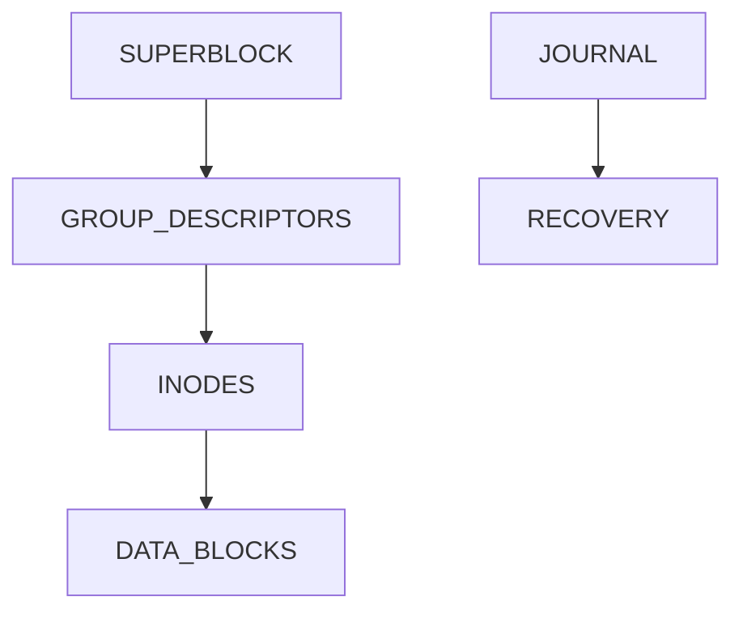

# Lab 02 – EXT4 Investigation

> Most Linux users create files.
>
> Linux engineers ask:
>
> **Where is the file actually stored?**
>
> **How does Linux find it?**
>
> **Why does ext4 survive crashes?**
>
> **What happens when a file is deleted?**
>
> **Why can a filesystem become slow?**
>
> This lab is not about using files.
>
> This lab is about understanding one of the most important technologies powering Linux:
>
> **The EXT4 Filesystem.**

---

# Lab Objective

By the end of this lab you will:

* Understand what EXT4 really is
* Explore a live EXT4 filesystem
* Investigate filesystem metadata
* Understand superblocks
* Understand block groups
* Understand inodes
* Understand journaling
* Investigate filesystem behavior
* Connect filesystem concepts to databases, Docker, Kubernetes, and cloud systems

---

# Why This Matters

Imagine:

```text
Database suddenly crashes.

Power outage occurs.

Server reboots.

Filesystem still recovers.
```

Why?

Because EXT4 was designed to survive.

Now imagine:

```text
Millions of files

Terabytes of storage

Thousands of containers
```

Linux still finds files quickly.

Why?

Because of filesystem design.

Understanding EXT4 means understanding how Linux stores data.

---

# The Problem EXT4 Solves

Storage devices only understand:

```text
Blocks

Bytes

Sectors
```

Humans want:

```text
Directories

Files

Permissions

Ownership

Timestamps
```

A filesystem bridges these worlds.

---

# Mental Model

Think of a filesystem as a library.

```text
Storage Disk

┌────────────────────────┐
│ Millions of Books      │
│ Millions of Pages      │
│ Millions of Locations  │
└────────────────────────┘
```

Without organization:

```text
Chaos
```

Filesystem provides:

```text
Catalog
Index
Location Tracking
Metadata
Recovery
```

---

# EXT4 Library Model



---

# First Principles

Linux never stores files directly.

Linux stores:

```text
Metadata
+
Data
```

Example:

```text
report.txt
```

contains:

```text
Filename
Owner
Permissions
Size
Timestamps
Data Location
```

EXT4 manages all of this.

---

# What Is EXT4?

EXT4 means:

```text
Fourth Extended Filesystem
```

Evolution:

```text
EXT
  ↓
EXT2
  ↓
EXT3
  ↓
EXT4
```

---

# Evolution Timeline


---

# Why EXT4 Became Popular

Advantages:

```text
Reliable

Fast

Journaling

Large Files

Large Filesystems

Production Proven
```

Used by:

```text
Ubuntu

Debian

Many Cloud Systems

Virtual Machines

Servers
```

---

# Lab Environment Setup

Check filesystem type:

```bash
df -T
```

Example:

```text
Filesystem Type
/dev/sda1 ext4
```

---

# Lab Task 1

Run:

```bash
df -T
```

Answer:

```text
Which filesystem type is used?

Is root mounted on ext4?
```

---

# EXT4 Architecture



---

# Understanding the Superblock

Think of the superblock as:

```text
Filesystem Brain
```

Contains:

```text
Filesystem Size

Block Size

Inode Count

Filesystem State

Mount Information
```

Without it:

```text
Filesystem Cannot Operate
```

---

# EXT4 Layout



---

# Investigating Superblock

Display filesystem info:

```bash
sudo tune2fs -l /dev/sda1
```

(Replace device name if different.)

---

# Sample Output

```text
Filesystem volume name

Block count

Free blocks

Inode count

Filesystem state
```

---

# Lab Task 2

Find root device:

```bash
df -h /
```

Then:

```bash
sudo tune2fs -l <device>
```

Observe:

```text
Block Size

Inode Count

Filesystem Features
```

---

# What Are Blocks?

Storage is divided into blocks.

Example:

```text
4 KB Block
```

Filesystem stores data inside blocks.

---

# Block Visualization


Example file:

```text
20 KB
```

requires:

```text
5 x 4KB blocks
```

---

# Why Blocks Exist

Without blocks:

```text
Complex storage management
```

With blocks:

```text
Predictable allocation
Efficient lookup
```

---

# Understanding Inodes

Most important EXT4 concept.

---

# Mental Model

Filename:

```text
report.txt
```

is NOT the file.

The inode is the file.

---

# Inode Architecture



---

# What Inode Stores

```text
Owner

Group

Permissions

Size

Creation Time

Modification Time

Block Locations
```

Not stored:

```text
Filename
```

---

# Lab Task 3

Create file:

```bash
touch testfile
```

Inspect:

```bash
ls -i testfile
```

Output:

```text
123456 testfile
```

That number is:

```text
Inode Number
```

---

# Deep Inspection

Use:

```bash
stat testfile
```

Observe:

```text
Inode

Size

Permissions

Owner
```

---

# Inode Visualization


---

# Why Inodes Matter

Future topics:

```text
Hard Links

Filesystem Recovery

Storage Debugging

Performance Analysis
```

all depend on inode knowledge.

---

# Understanding Block Groups

A huge filesystem is divided into groups.

Why?

Because searching entire disk would be slow.

---

# Block Group Architecture



---

# Why Block Groups Exist

Benefits:

```text
Reduced Disk Seeks

Better Locality

Faster Performance
```

---

# Journaling

One of EXT4's greatest features.

---

# The Problem

Imagine:

```text
Write File

Power Failure

System Crash
```

Without journaling:

```text
Corrupted Filesystem
```

---

# Journaling Solution

Before changing data:

```text
Write Intent To Journal

Perform Change

Mark Complete
```

---

# Journaling Flow



---

# Why Journaling Matters

Used in:

```text
Databases

Cloud Systems

Distributed Systems

Containers
```

Same principle:

```text
Write Ahead Logging
```

---

# EXT4 and Databases

Notice similarity:

```text
EXT4 Journal

Database WAL
```

Both:

```text
Protect Data

Recover From Crashes
```

---

# Lab Task 4

Check mount options:

```bash
mount | grep ext4
```

Observe journaling-related options.

---

# Investigating Space Usage

Check filesystem:

```bash
df -h
```

---

# Understanding Output

```text
Filesystem

Size

Used

Available

Mounted On
```

---

# Visualization



---

# Lab Task 5

Run:

```bash
df -h
```

Answer:

```text
How much space is free?

How much is used?
```

---

# Investigating Inode Usage

Filesystem can run out of:

```text
Space
```

OR

```text
Inodes
```

---

# Check Inodes

```bash
df -i
```

Output:

```text
Inodes

Used

Free
```

---

# Real Production Problem

Disk shows:

```text
50% free
```

Yet:

```text
Cannot create file
```

Cause:

```text
No free inodes
```

---

# Lab Task 6

Run:

```bash
df -i
```

Observe inode usage.

---

# Deleted Files Mystery

Deleting file:

```bash
rm file.txt
```

does not always erase data immediately.

---

# Internal Process


---

# Why Recovery Sometimes Works

Blocks may remain untouched until reused.

This is how recovery tools function.

---

# Performance Investigation

Large directory:

```text
Millions of Files
```

can cause:

```text
Slow Lookups

Slow Metadata Operations
```

---

# Why Metadata Matters

Operations like:

```bash
ls -l
```

must retrieve:

```text
Inode

Permissions

Ownership

Timestamps
```

for every file.

---

# Docker Connection

Docker images ultimately become:

```text
Files

Directories

Layers
```

stored on EXT4.

---

# Docker Storage View



---

# Kubernetes Connection

Pods use:

```text
Volumes

Persistent Volumes

Host Storage
```

which eventually reach:

```text
EXT4
```

or another filesystem.

---

# Cloud Connection

Cloud Block Storage:

```text
AWS EBS

Azure Disk

GCP Persistent Disk
```

often formatted with:

```text
EXT4
```

inside the VM.

---

# Guided Challenge

Investigate:

```bash
df -T

df -h

df -i
```

Record:

```text
Filesystem Type

Free Space

Inode Usage
```

---

# Semi-Guided Challenge

Create:

```bash
mkdir ext4-lab
cd ext4-lab

touch file1 file2 file3
```

Inspect:

```bash
ls -i

stat file1
```

Document findings.

---

# Independent Challenge

Answer:

```text
What is a superblock?

What is an inode?

What is journaling?

Why are block groups used?

How does EXT4 recover after crashes?
```

Using observations from this lab.

---

# Linux Internals Deep Dive

EXT4 internally manages:



This architecture enables:

```text
Reliability

Performance

Scalability
```

---

# Performance Considerations

EXT4 performance depends on:

```text
Block Size

File Count

Directory Size

Storage Device

Journaling Mode
```

Common bottlenecks:

```text
Millions of Small Files

Metadata Operations

Fragmentation
```

---

# Security Considerations

Filesystem metadata controls:

```text
Ownership

Permissions

Access Control
```

Incorrect settings can expose:

```text
Logs

Secrets

Configurations

Databases
```

---

# Common Mistakes

## Mistake 1

Thinking filename is the file.

Reality:

```text
Inode is the file.
```

---

## Mistake 2

Ignoring inode exhaustion.

---

## Mistake 3

Ignoring filesystem health.

---

## Mistake 4

Assuming deletion instantly removes data.

---

# Troubleshooting

## Disk Full

Check:

```bash
df -h
```

---

## Cannot Create Files

Check:

```bash
df -i
```

---

## Need Filesystem Information

Check:

```bash
sudo tune2fs -l <device>
```

---

## Investigating Metadata

Use:

```bash
stat filename
```

---

# Engineering Mindset

Beginners see:

```text
Files
```

Engineers see:

```text
Superblocks

Inodes

Block Groups

Data Blocks

Journals
```

Ask:

```text
How is this stored?

How is it recovered?

How is it located?

How does it scale?
```

These are the questions storage engineers, database engineers, kernel engineers, cloud engineers, and platform engineers ask.

---

# Interview Questions

### What is EXT4?

Fourth Extended Filesystem used by Linux.

---

### What is an inode?

Metadata structure describing a file.

---

### Does inode contain filename?

No.

Directory entries contain filenames.

---

### What is a superblock?

Filesystem metadata describing the entire filesystem.

---

### Why does EXT4 use journaling?

To recover safely from crashes.

---

### Why are block groups used?

To improve performance and reduce disk seeks.

---

### What command shows inode usage?

```bash
df -i
```

---

### What command shows filesystem type?

```bash
df -T
```

---

# Cheat Sheet

```bash
df -T

df -h

df -i

mount | grep ext4

ls -i

stat filename

touch file1

sudo tune2fs -l /dev/sda1

cat /proc/filesystems
```

---

# Lab Success Criteria

You can complete this lab when you can:

✅ Explain EXT4 architecture

✅ Explain superblocks

✅ Explain inodes

✅ Explain block groups

✅ Explain journaling

✅ Investigate filesystem metadata

✅ Analyze inode usage

✅ Connect EXT4 to Docker storage

✅ Connect EXT4 to Kubernetes volumes

✅ Connect EXT4 to cloud block storage

✅ Think about storage like an engineer

Congratulations.

You have moved beyond simply using Linux filesystems and started understanding the storage architecture that powers modern operating systems, databases, containers, and cloud infrastructure.
