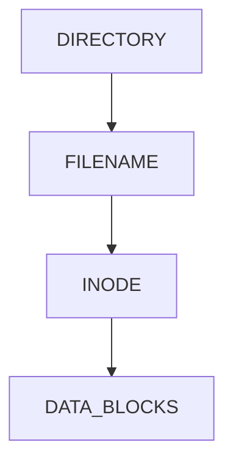
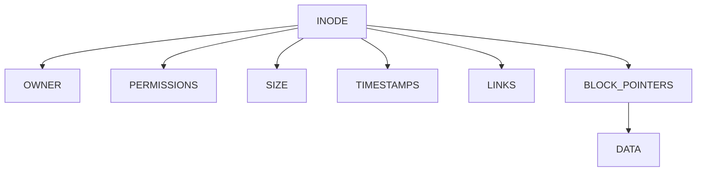
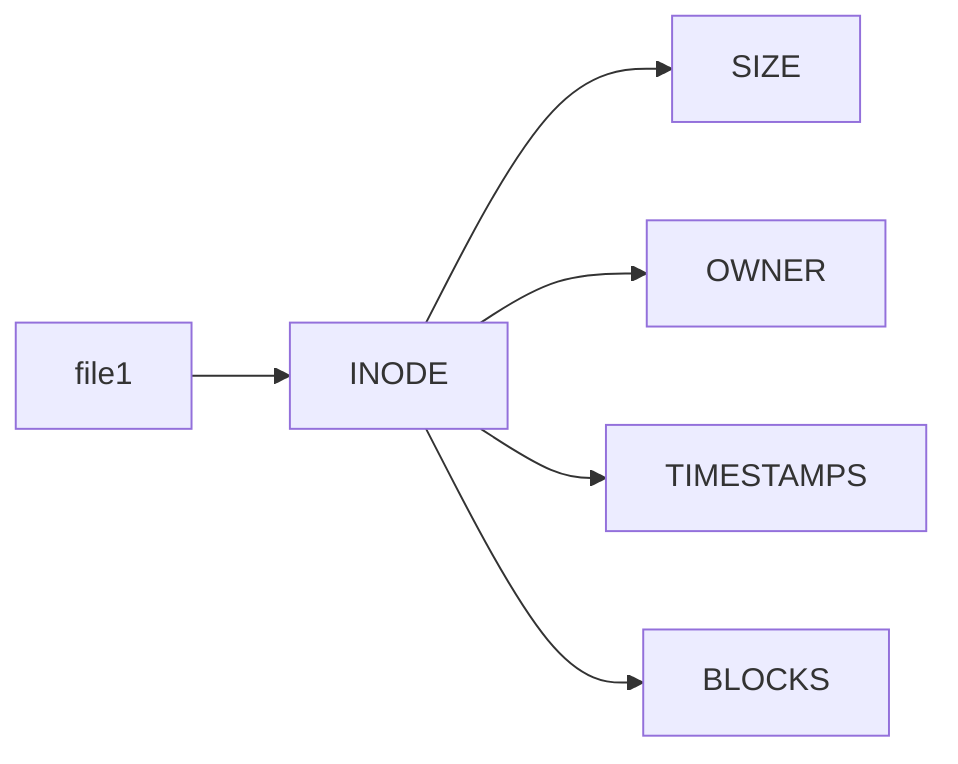
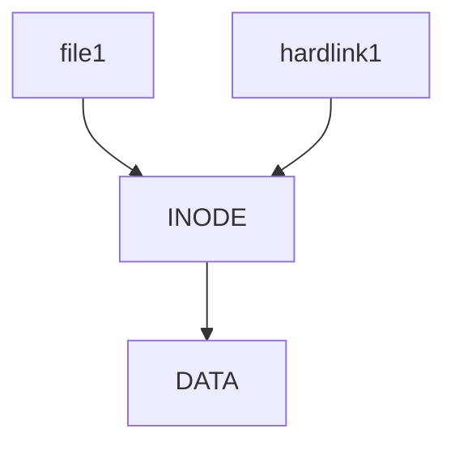
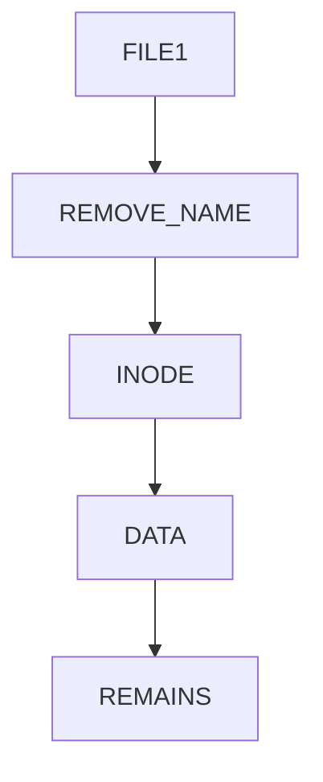
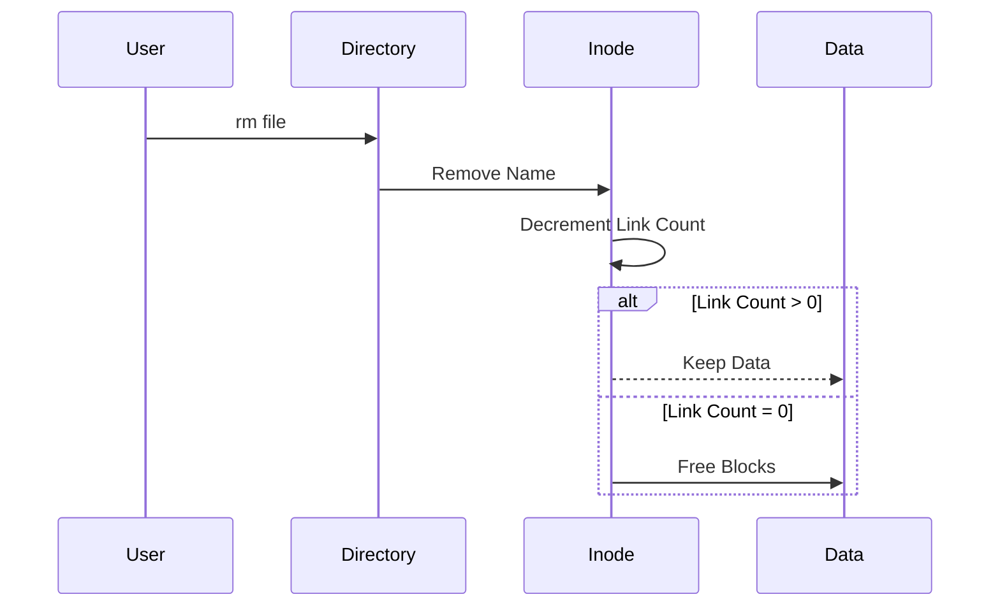
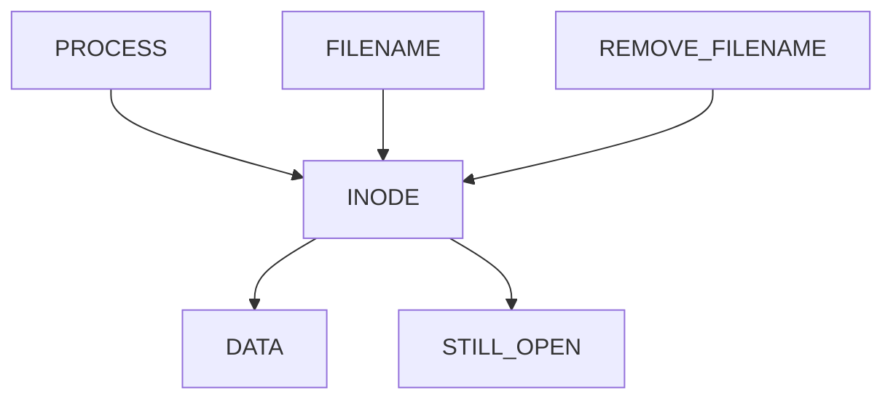
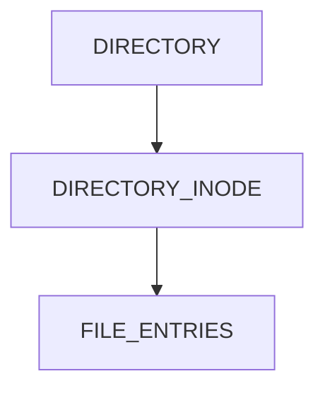
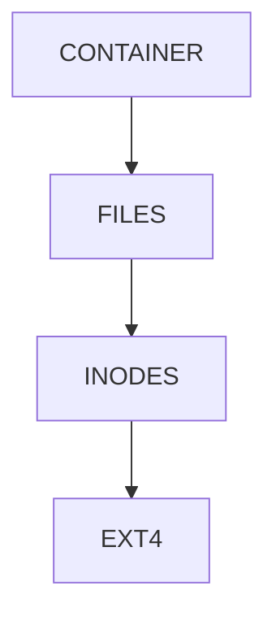
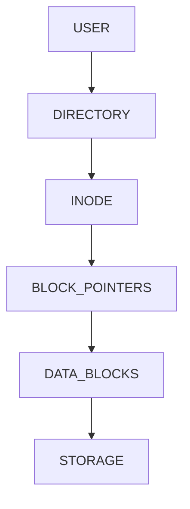

# Lab 03 – Inode Analysis

> Most Linux users think:
>
> ```text
> File = Filename + Data
> ```
>
> Linux engineers know:
>
> ```text
> Filename ≠ File
> ```
>
> The filename is merely a label.
>
> The inode is the actual identity of the file.
>
> Understanding inodes is one of the biggest transitions from Linux user to Linux engineer.
>
> Hard links, file deletion, filesystem recovery, storage debugging, Docker storage, database storage, and filesystem performance all depend on inode knowledge.

---

# Lab Objective

By the end of this lab you will:

* Understand what an inode really is
* Analyze inode metadata
* Investigate inode allocation
* Understand inode-to-data relationships
* Understand hard links
* Understand inode exhaustion
* Understand file deletion internals
* Investigate filesystem behavior
* Connect inode concepts to modern infrastructure

---

# Why This Matters

Imagine:

```text
Application crashes.

Disk shows free space.

Yet new files cannot be created.
```

Why?

Because:

```text
No free inodes remain.
```

Or:

```text
A deleted log file still consumes disk space.
```

Why?

Because:

```text
A process still holds the inode open.
```

Many production incidents involve inodes.

Most engineers never learn them deeply.

---

# The Problem Inodes Solve

Storage devices understand:

```text
Blocks
Sectors
Addresses
```

Humans understand:

```text
Files
Directories
Permissions
Ownership
```

Linux needs a structure that maps:

```text
Human View
      ↓
Storage Reality
```

That structure is:

```text
Inode
```

---

# Mental Model

Think of a library.

A book has:

```text
Title
Author
Location
Pages
```

The library does not find books using titles.

It finds them using an internal catalog ID.

In Linux:

```text
Filename = Book Title

Inode = Catalog ID
```

---

# File Identity Model


Important:

```text
Filename is not the file.

Inode is the file.
```

---

# First Principles

Every file has:

```text
Name
Metadata
Data
```

Linux separates them.

---

# Linux Architecture



---

# What Is Stored In An Inode?

An inode contains:

```text
Owner

Group

Permissions

File Size

Access Time

Modification Time

Change Time

Block Locations

Link Count

File Type
```

---

# What Is NOT Stored?

Surprisingly:

```text
Filename
```

is not stored inside inode.

The filename lives inside directory entries.

---

# Inode Structure



---

# Lab Environment Setup

Create workspace.

```bash
mkdir -p ~/inode-lab
cd ~/inode-lab
```

Create files:

```bash
touch file1
touch file2
touch file3
```

---

# Viewing Inode Numbers

Display inode numbers:

```bash
ls -i
```

Example:

```text
248193 file1

248194 file2

248195 file3
```

---

# Lab Task 1

Run:

```bash
ls -i
```

Answer:

```text
Does each file have a different inode?
```

---

# Why Different Inodes?

Each inode uniquely identifies a filesystem object.

Think:

```text
Student Roll Number

Employee ID

Database Primary Key

Filesystem Inode
```

---

# Investigating File Metadata

Use:

```bash
stat file1
```

Observe:

```text
Size

Blocks

Permissions

Owner

Inode

Links
```

---

# Metadata Visualization



---

# Lab Task 2

Run:

```bash
stat file1
```

Record:

```text
Inode Number

Permissions

Size

Link Count
```

---

# Understanding Link Count

Create:

```bash
echo "Hello Linux" > file1
```

Check:

```bash
stat file1
```

Observe:

```text
Links: 1
```

Why?

Because one directory entry points to this inode.

---

# Hard Link Introduction

Create:

```bash
ln file1 hardlink1
```

Now:

```bash
ls -li
```

Observe:

```text
Same inode number
```

---

# Hard Link Architecture



---

# Lab Task 3

Run:

```bash
ln file1 hardlink1

ls -li
```

Answer:

```text
Do both files share inode numbers?
```

---

# Why Hard Links Matter

Now Linux sees:

```text
Two names

One inode

One data set
```

---

# Experiment

Modify:

```bash
echo "New Content" >> hardlink1
```

Read:

```bash
cat file1
```

Output changes.

Why?

Because:

```text
Same inode

Same data blocks
```

---

# Data Flow


---

# Investigating Link Count

Check:

```bash
stat file1
```

Observe:

```text
Links: 2
```

Linux tracks:

```text
How many directory entries reference inode
```

---

# Hard Link Deletion Mystery

Delete:

```bash
rm file1
```

Now:

```bash
cat hardlink1
```

Still works.

Why?

---

# Deletion Architecture



The inode still exists.

---

# Why?

Link count:

```text
2 → 1
```

Data remains.

Only one filename disappeared.

---

# Real File Deletion Process



---

# Lab Task 4

Create:

```bash
touch test
ln test test-link
```

Delete:

```bash
rm test
```

Check:

```bash
ls

stat test-link
```

Observe.

---

# Understanding Inode Allocation

Create many files:

```bash
touch file{1..100}
```

Check:

```bash
ls -i
```

Notice:

```text
Inodes are allocated dynamically.
```

Not always sequential.

---

# Inode Allocation Model


---

# Investigating Inode Usage

View filesystem inode statistics:

```bash
df -i
```

Example:

```text
Inodes

Used

Free

Use%
```

---

# Why This Matters

Filesystem can fail because:

```text
Disk Full
```

OR

```text
Inodes Full
```

---

# Production Incident

Server:

```text
Disk Usage = 30%

Free Space Available
```

But:

```text
Cannot create files
```

Cause:

```text
Millions of tiny files

No free inodes
```

---

# Lab Task 5

Run:

```bash
df -i
```

Record:

```text
Total Inodes

Used Inodes

Free Inodes
```

---

# Understanding Open Deleted Files

One of the most important production concepts.

---

# Scenario

Log file:

```bash
app.log
```

Size:

```text
20 GB
```

Deleted:

```bash
rm app.log
```

Disk space:

```text
Still not freed
```

Why?

---

# Open File Architecture



---

# Real Cause

Process still holds:

```text
Open File Descriptor
```

The inode survives.

Data survives.

Disk space survives.

---

# Investigating Open Files

Use:

```bash
lsof
```

or:

```bash
lsof | grep deleted
```

---

# Why SREs Care

Common production issue:

```text
Deleted Logs

Disk Still Full
```

Root cause:

```text
Open Inodes
```

---

# Inodes and Directories

Directories also have inodes.

Check:

```bash
ls -id .
```

Example:

```text
784512 .
```

Directory itself has an inode.

---

# Directory Architecture



---

# Lab Task 6

Run:

```bash
ls -id .
ls -id ..
```

Observe inode numbers.

---

# Inodes and Performance

Large systems often contain:

```text
Millions of files
```

Metadata operations become expensive.

Examples:

```bash
ls -l
find
stat
```

Need inode lookups.

---

# Metadata Bottleneck


Storage systems often become:

```text
Metadata Bound
```

before data bound.

---

# Docker Connection

Docker images contain:

```text
Files

Directories

Layers
```

Each backed by inodes.

---

# Docker Storage View



---

# Kubernetes Connection

Pods generate:

```text
Logs

Temporary Files

Volumes
```

All consume:

```text
Inodes
```

---

# Real Kubernetes Incident

Node:

```text
Disk Usage 40%
```

Yet:

```text
Pods Fail
```

Cause:

```text
Inode Exhaustion
```

Millions of log files.

---

# Database Connection

Databases store:

```text
Tables

Indexes

WAL Files

Checkpoints
```

All become filesystem objects.

Each object:

```text
Consumes Inodes
```

---

# Guided Challenge

Create:

```bash
touch app.log
```

Create hard link:

```bash
ln app.log app-copy.log
```

Investigate:

```bash
ls -li

stat
```

Delete one.

Observe behavior.

---

# Semi-Guided Challenge

Create:

```bash
touch file{1..50}
```

Investigate:

```bash
ls -i

df -i
```

Document findings.

---

# Independent Challenge

Answer:

```text
What is an inode?

Why isn't filename stored in inode?

How do hard links work?

Why does deleted data sometimes remain?

How can inode exhaustion occur?

Why are inodes important for containers?
```

---

# Linux Internals Deep Dive

File access path:



Every file operation follows this path.

---

# Performance Considerations

Operations heavily dependent on inodes:

```text
ls -l

find

stat

backup software

container startup
```

Large inode counts increase:

```text
Metadata I/O

Disk Seeks

Filesystem Traversal Time
```

---

# Security Considerations

Inode metadata controls:

```text
Ownership

Permissions

Access Control
```

Incorrect metadata may expose:

```text
Sensitive Files

Logs

Configurations

Secrets
```

---

# Common Mistakes

## Mistake 1

Thinking filename is file.

Reality:

```text
Filename → Inode → Data
```

---

## Mistake 2

Ignoring inode exhaustion.

---

## Mistake 3

Deleting files without checking open descriptors.

---

## Mistake 4

Confusing hard links with copies.

---

# Troubleshooting

## Disk Full But Space Exists

Check:

```bash
df -i
```

---

## Deleted Log Still Consuming Space

Check:

```bash
lsof | grep deleted
```

---

## Need File Metadata

Use:

```bash
stat file
```

---

## Need Inode Numbers

Use:

```bash
ls -i
```

---

# Engineering Mindset

Beginners see:

```text
Files
```

Engineers see:

```text
Directory Entries

Inodes

Block Pointers

Data Blocks
```

Ask:

```text
How is this file located?

How is it stored?

How is it deleted?

How is it recovered?

How does it scale?
```

These questions lead toward:

```text
Storage Engineering

Filesystem Engineering

Kernel Engineering

Database Engineering

Cloud Infrastructure
```

---

# Interview Questions

### What is an inode?

Filesystem metadata structure describing a file.

---

### Does inode contain filename?

No.

Directory entries contain filenames.

---

### What command displays inode numbers?

```bash
ls -i
```

---

### What command displays inode metadata?

```bash
stat file
```

---

### What is a hard link?

Another filename pointing to the same inode.

---

### Why does deleted data sometimes remain?

Because inode still exists through links or open file descriptors.

---

### What command shows inode usage?

```bash
df -i
```

---

### What happens when link count reaches zero?

Filesystem can reclaim inode and data blocks.

---

# Cheat Sheet

```bash
ls -i

ls -li

stat file

ln file hardlink

df -i

lsof

lsof | grep deleted

touch file

rm file

ls -id .

ls -id ..
```

---

# Lab Success Criteria

You can complete this lab when you can:

✅ Explain inode architecture

✅ Analyze inode metadata

✅ Create hard links

✅ Explain link counts

✅ Explain file deletion internals

✅ Investigate inode exhaustion

✅ Understand open deleted files

✅ Connect inodes to Docker storage

✅ Connect inodes to Kubernetes nodes

✅ Think like a storage engineer

Congratulations.

You now understand one of the most fundamental data structures in Linux and one of the key concepts behind filesystems, containers, databases, and modern infrastructure.
