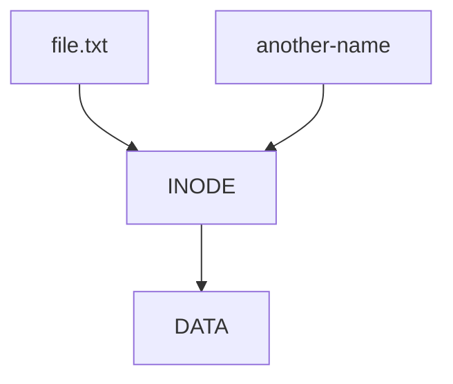
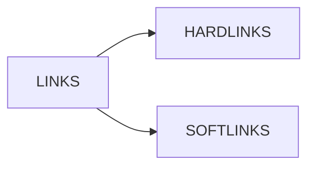
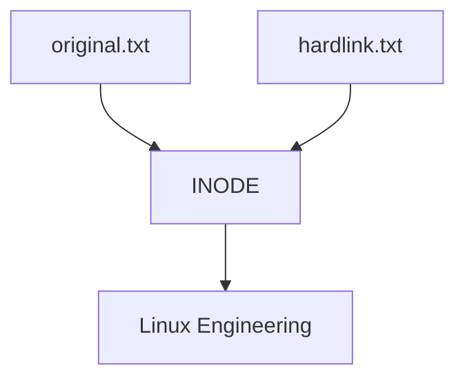
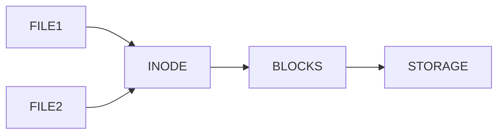
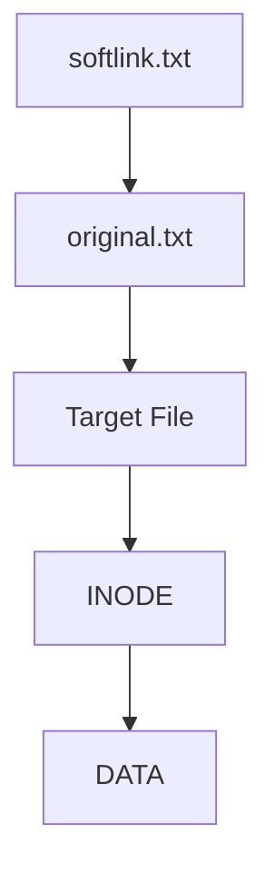
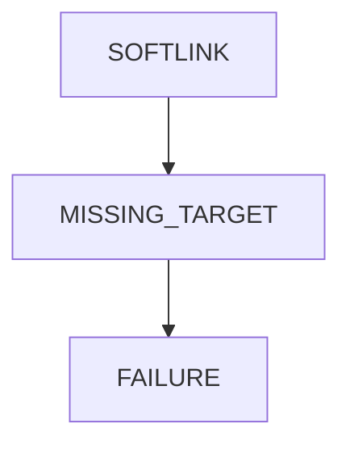
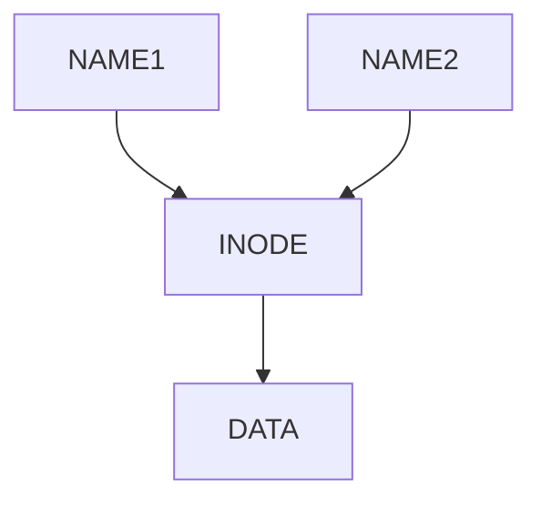
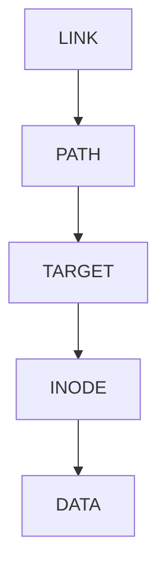
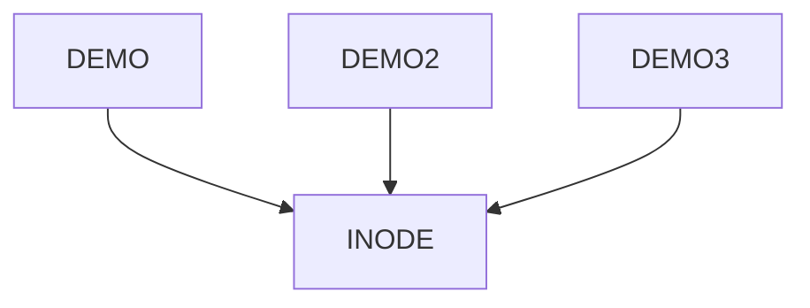

# Lab 04 – Hard Links vs Soft Links

> Links are one of the most misunderstood concepts in Linux.
>
> Many engineers use them daily without truly understanding them.
>
> Yet links are everywhere:
>
> * Linux commands
> * Shared libraries
> * Docker images
> * Kubernetes volumes
> * Configuration management
> * Package managers
> * Cloud-native systems
>
> Understanding links requires understanding one fundamental truth:
>
> ```text
> A filename is not a file.
> ```
>
> This lab builds directly on inode knowledge and shows how Linux creates multiple paths to the same data.

---

# Lab Objective

By the end of this lab you will:

* Understand why links exist
* Understand hard links deeply
* Understand symbolic (soft) links deeply
* Compare hard links vs soft links
* Investigate inode behavior
* Analyze link counts
* Understand broken symlinks
* Connect links to modern infrastructure
* Think like a filesystem engineer

---

# Why This Matters

Imagine:

```text
/usr/bin/python3
```

appears to exist.

But where is it actually?

Or:

```text
/etc/nginx/sites-enabled/default
```

appears to be a file.

But is it?

Or:

```text
kubectl
```

appears in your PATH.

How does Linux find it?

The answer often involves links.

---

# The Problem Links Solve

Suppose multiple applications need:

```text
Same File
Same Data
Same Resource
```

Without links:

```text
Duplicate Copies
Wasted Storage
Synchronization Problems
```

With links:

```text
Single Data Source
Multiple Access Paths
```

---

# Mental Model

Think of a city.

A building exists at one location.

People may know it as:

```text
City Hall

Government Office

Administration Center
```

Multiple names.

Same building.

Hard links work similarly.

---

# First Principles

Remember from previous lab:

```text
Filename ≠ File
```

Linux architecture:


The inode is the actual file.

---

# Link Architecture



Two names.

One inode.

One file.

---

# Types of Links

Linux supports:

```text
Hard Links

Symbolic Links (Soft Links)
```

---

# Comparison Overview



---

# Lab Environment Setup

Create workspace:

```bash
mkdir -p ~/link-lab
cd ~/link-lab
```

Create file:

```bash
echo "Linux Engineering" > original.txt
```

---

# Understanding Hard Links

Create hard link:

```bash
ln original.txt hardlink.txt
```

View:

```bash
ls -li
```

Example:

```text
348291 original.txt

348291 hardlink.txt
```

Notice:

```text
Same inode
```

---

# Hard Link Visualization



---

# Lab Task 1

Create:

```bash
ln original.txt hardlink.txt
```

Verify:

```bash
ls -li
```

Answer:

```text
Do both files share the same inode?
```

---

# Why Hard Links Work

Linux does not see:

```text
Original File
Copy File
```

Linux sees:

```text
Two directory entries

One inode
```

---

# Metadata Investigation

Run:

```bash
stat original.txt
```

Observe:

```text
Links: 2
```

Meaning:

```text
Two filenames reference inode
```

---

# Hard Link Data Flow



---

# Lab Task 2

Modify:

```bash
echo "Docker" >> hardlink.txt
```

Read:

```bash
cat original.txt
```

Observe:

```text
Content changed
```

Why?

Because:

```text
Same inode
Same data blocks
```

---

# Hard Link Deletion

Delete:

```bash
rm original.txt
```

Check:

```bash
cat hardlink.txt
```

Still exists.

---

# Why?

Because:

```text
Link Count

2 → 1
```

The inode survives.

---

# Hard Link Deletion Flow

```mermaid
sequenceDiagram

participant User

participant Directory

participant Inode

User->>Directory: Delete original.txt

Directory->>Inode: Remove one reference

Inode-->>Directory: Link count = 1

Inode remains alive
```

---

# Hard Link Properties

Advantages:

```text
No extra storage

Same inode

Survives filename deletion

Fast access
```

Disadvantages:

```text
Cannot cross filesystems

Cannot link directories (normally)

Harder to manage
```

---

# Understanding Soft Links

Create symbolic link:

```bash
ln -s original.txt softlink.txt
```

View:

```bash
ls -li
```

Example:

```text
348291 original.txt

982344 softlink.txt
```

Notice:

```text
Different inode
```

---

# Why Different Inode?

Because soft link is:

```text
A special file
```

Its content contains:

```text
Path To Target
```

---

# Soft Link Architecture



---

# Mental Model

Hard Link:

```text
Two Names
One Person
```

Soft Link:

```text
Person
↓
Business Card
↓
Address
```

---

# Lab Task 3

Create:

```bash
ln -s original.txt softlink.txt
```

Inspect:

```bash
ls -l
```

Example:

```text
softlink.txt -> original.txt
```

---

# Understanding Symlink Resolution

When opening:

```text
softlink.txt
```

Linux performs:


Extra lookup occurs.

---

# Broken Symlink

Delete target:

```bash
rm original.txt
```

Check:

```bash
cat softlink.txt
```

Result:

```text
No such file or directory
```

---

# Why?

The link contains:

```text
Path Only
```

The target disappeared.

---

# Broken Symlink Architecture



---

# Lab Task 4

Create:

```bash
echo "test" > app.conf
ln -s app.conf config-link
```

Delete:

```bash
rm app.conf
```

Try:

```bash
cat config-link
```

Observe failure.

---

# Investigating Symlinks

Display:

```bash
ls -l
```

Output:

```text
config-link -> app.conf
```

Find symlinks:

```bash
find . -type l
```

---

# Hard Link vs Soft Link

| Feature                    | Hard Link  | Soft Link |
| -------------------------- | ---------- | --------- |
| Same Inode                 | Yes        | No        |
| Cross Filesystems          | No         | Yes       |
| Survives Original Deletion | Yes        | No        |
| Can Link Directories       | Usually No | Yes       |
| Extra Lookup               | No         | Yes       |
| Storage Overhead           | Minimal    | Small     |

---

# Deep Internal Comparison

## Hard Link



---

## Soft Link



---

# Investigating Link Counts

Create:

```bash
echo hello > file1
```

Check:

```bash
stat file1
```

Observe:

```text
Links: 1
```

Create hard link:

```bash
ln file1 file2
```

Check again:

```bash
stat file1
```

Observe:

```text
Links: 2
```

---

# Lab Task 5

Create:

```bash
touch demo

ln demo demo2

ln demo demo3
```

Inspect:

```bash
stat demo
```

Question:

```text
What is link count now?
```

---

# Hard Links and Inodes

View:

```bash
ls -li
```

Expected:

```text
Same inode everywhere
```

Visualization:



---

# Why Linux Uses Links

Many Linux commands use symlinks.

Example:

```bash
ls -l /bin
```

or

```bash
ls -l /usr/bin/python*
```

You will often see:

```text
python -> python3
```

---

# Real System Example


This allows:

```text
Backward Compatibility

Version Management

Simpler Upgrades
```

---

# Nginx Example

Common structure:

```text
/etc/nginx

├── sites-available
└── sites-enabled
```

Enable site:

```bash
ln -s site.conf sites-enabled/site.conf
```

---

# Nginx Architecture


---

# Docker Connection

Docker image layers use concepts similar to:

```text
References

Shared Objects

Metadata Links
```

Reducing storage duplication.

---

# Kubernetes Connection

Kubernetes often mounts:

```text
Secrets

ConfigMaps

Volumes
```

using filesystem abstractions involving symbolic links.

---

# Package Manager Connection

Many package managers create:

```text
Versioned Files

Compatibility Links

Shared Library Links
```

Example:

```text
libssl.so

→ libssl.so.3
```

---

# Storage Efficiency

Hard links help:

```text
Avoid Duplicate Data

Save Disk Space

Reduce Storage Waste
```

---

# Performance Considerations

Hard links:

```text
Direct inode access

Very fast
```

Soft links:

```text
Extra lookup required

Slight overhead
```

Usually negligible.

---

# Security Considerations

Symlink attacks exist.

Example:

```text
Application follows symlink

Unexpected file accessed
```

This is why:

```text
Secure software validates paths
```

---

# Guided Challenge

Create:

```bash
echo "Linux" > training.txt

ln training.txt hard1

ln -s training.txt soft1
```

Investigate:

```bash
ls -li

stat training.txt

cat hard1

cat soft1
```

---

# Semi-Guided Challenge

Delete:

```bash
training.txt
```

Observe:

```bash
cat hard1

cat soft1
```

Explain differences.

---

# Independent Challenge

Build:

```text
project

├── configs
│   └── app.conf
│
├── enabled
│   └── symlink
│
└── backups
```

Requirements:

```text
Create hard links

Create symlinks

Investigate inode counts

Delete targets

Observe behavior
```

---

# Linux Internals Deep Dive

Hard link lookup:


---

# Soft link lookup:


---

# Common Mistakes

## Mistake 1

Thinking hard links are copies.

They are not.

---

## Mistake 2

Thinking symlinks contain data.

They contain paths.

---

## Mistake 3

Deleting target and expecting symlink to work.

---

## Mistake 4

Ignoring link counts.

---

# Troubleshooting

## Find Symlinks

```bash
find . -type l
```

---

## Check Link Count

```bash
stat file
```

---

## Show Inodes

```bash
ls -li
```

---

## Identify Broken Symlinks

```bash
find . -xtype l
```

---

# Engineering Mindset

Beginners see:

```text
Files
```

Engineers see:

```text
Directory Entries

Inodes

References

Metadata

Storage Efficiency
```

Ask:

```text
Is this data duplicated?

Or merely referenced?
```

This mindset appears everywhere:

```text
Linux Filesystems

Docker Layers

Git Objects

Database References

Cloud Storage
```

---

# Interview Questions

### What is a hard link?

A directory entry pointing to an existing inode.

---

### What is a symbolic link?

A special file containing a path to another file.

---

### Which shares inode with target?

```text
Hard Link
```

---

### Which survives target deletion?

```text
Hard Link
```

---

### Which can cross filesystems?

```text
Soft Link
```

---

### How do you create a hard link?

```bash
ln source target
```

---

### How do you create a symbolic link?

```bash
ln -s source target
```

---

### How do you view inode numbers?

```bash
ls -li
```

---

# Cheat Sheet

```bash
ln source hardlink

ln -s source softlink

ls -li

ls -l

stat file

find . -type l

find . -xtype l

rm file

cat link
```

---

# Lab Success Criteria

You can complete this lab when you can:

✅ Explain hard links

✅ Explain symbolic links

✅ Compare inode behavior

✅ Create both link types

✅ Analyze link counts

✅ Explain broken symlinks

✅ Connect links to Nginx

✅ Connect links to Docker concepts

✅ Connect links to Kubernetes storage

✅ Think in references instead of files

Congratulations.

You now understand one of the most elegant and powerful abstractions in Linux filesystems and one of the foundational ideas behind modern storage systems, package managers, containers, and cloud-native infrastructure.
