# Lab 05 – Mount Points

> One of the most powerful ideas in Linux is that storage appears as part of a single filesystem tree.
>
> Users see:
>
> ```text
> /
> ├── home
> ├── var
> ├── etc
> └── data
> ```
>
> But Linux sees:
>
> ```text
> Multiple Filesystems
> Multiple Disks
> Multiple Devices
> Multiple Storage Layers
> ```
>
> connected together through **mount points**.
>
> Mount points are one of the most important concepts in Linux, cloud infrastructure, Docker, Kubernetes, databases, and storage engineering.

---

# Lab Objective

By the end of this lab you will:

* Understand why mount points exist
* Understand Linux's unified filesystem model
* Explore mounted filesystems
* Mount and unmount filesystems
* Understand virtual filesystems
* Investigate storage devices
* Understand fstab
* Connect mount points to cloud storage
* Connect mount points to Docker and Kubernetes
* Think like a storage engineer

---

# Why This Matters

Imagine:

```text
AWS EBS Volume Attached
```

How does Linux access it?

Or:

```text
New SSD Installed
```

How does Linux use it?

Or:

```text
Docker Volume Mounted
```

Where does container data go?

Or:

```text
Kubernetes Persistent Volume
```

How does a Pod access storage?

The answer:

```text
Mount Points
```

---

# The Problem Mount Points Solve

Storage devices are separate.

Example:

```text
Disk 1
Disk 2
USB Drive
Network Storage
Cloud Volume
```

Applications need:

```text
One Unified View
```

Linux solves this using mounting.

---

# Mental Model

Think of a city.

Multiple roads connect different areas.

Citizens experience:

```text
One City
```

even though:

```text
Different Neighborhoods
Different Buildings
Different Infrastructure
```

exist underneath.

Mount points create a similar illusion.

---

# Unified Filesystem View

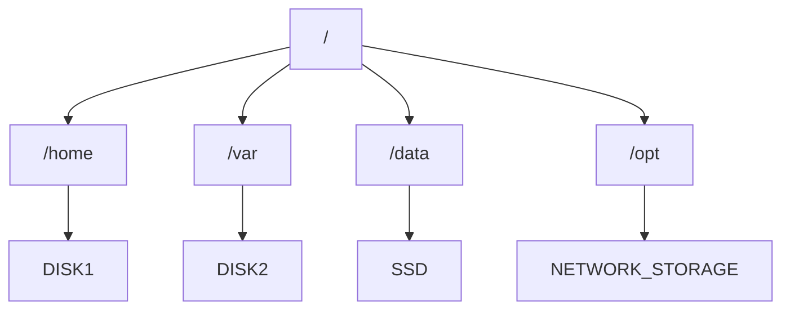

Users see:

```text
One Filesystem Tree
```

Linux manages:

```text
Many Filesystems
```

---

# First Principles

Linux uses:

```text
Single Directory Tree
```

Unlike Windows:

```text
C:
D:
E:
```

Linux uses:

```text
/
```

Everything exists under root.

---

# Windows vs Linux

### Windows

```text
C:
D:
E:
```

Multiple roots.

---

### Linux

```text
/

├── home
├── var
├── data
└── backup
```

Single root.

---

# Architecture

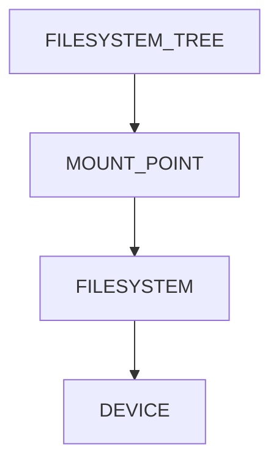

---

# What Is A Mount Point?

A mount point is:

```text
A directory where a filesystem becomes accessible.
```

Example:

```text
/data
```

could represent:

```text
Entire SSD
```

---

# Mount Point Visualization

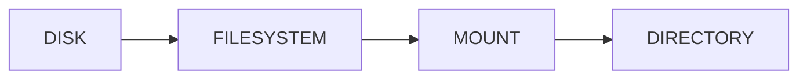

---

# Real Example

```text
/dev/sdb1
```

mounted at:

```text
/data
```

Users access:

```text
/data
```

not:

```text
/dev/sdb1
```

---

# Storage Access Flow


---

# Lab Environment Setup

View mounted filesystems:

```bash
mount
```

Large output appears.

---

# Better View

```bash
mount | less
```

---

# Modern View

```bash
findmnt
```

Example:

```text
TARGET SOURCE FSTYPE

/      /dev/sda1 ext4
```

---

# Lab Task 1

Run:

```bash
findmnt
```

Answer:

```text
How many mount points exist?

What filesystem types appear?
```

---

# Understanding Root Filesystem

Display:

```bash
findmnt /
```

Example:

```text
TARGET SOURCE

/      /dev/sda1
```

---

# Visualization

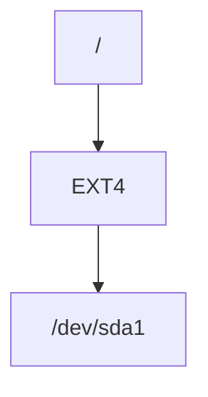

---

# Investigating Storage Devices

Display:

```bash
lsblk
```

Example:

```text
sda
├── sda1
├── sda2

sdb
└── sdb1
```

---

# Device Hierarchy

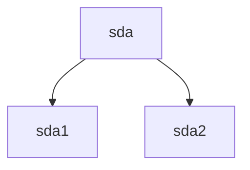

---

# Why lsblk Matters

Storage engineers use:

```bash
lsblk
```

daily.

It reveals:

```text
Disks
Partitions
Mount Points
Relationships
```

---

# Lab Task 2

Run:

```bash
lsblk
```

Identify:

```text
Root partition

Additional partitions

Mounted devices
```

---

# Device To Mount Mapping

```bash
lsblk -f
```

Output:

```text
NAME

FSTYPE

UUID

MOUNTPOINT
```

---

# Visualization


---

# Understanding Virtual Filesystems

Not all filesystems come from disks.

Example:

```text
/proc

/sys

/dev
```

---

# Why?

Linux exposes kernel information as files.

---

# Virtual Filesystem Architecture

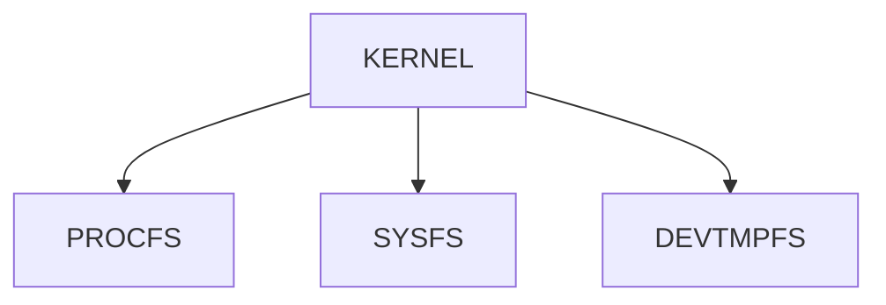

---

# Investigating Virtual Mounts

Run:

```bash
mount | grep proc
```

Observe:

```text
proc on /proc
```

---

# Lab Task 3

Investigate:

```bash
mount | grep proc

mount | grep sys

mount | grep tmpfs
```

Document findings.

---

# Temporary Filesystems

Example:

```text
tmpfs
```

Lives in:

```text
Memory
```

instead of:

```text
Disk
```

---

# Architecture

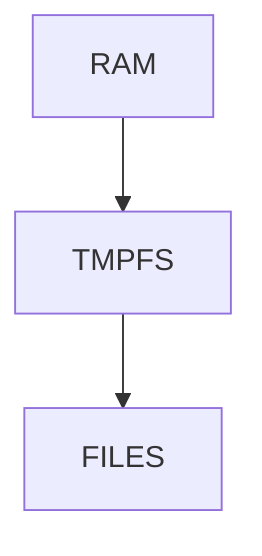

---

# Why tmpfs Exists

Useful for:

```text
Fast Temporary Storage

Caches

Containers

Build Systems
```

---

# Investigating tmpfs

Run:

```bash
df -h | grep tmpfs
```

Observe.

---

# Mounting A Filesystem

Create directory:

```bash
sudo mkdir /mnt/demo
```

This becomes mount point.

---

# Mount Workflow


---

# Example Mount

```bash
sudo mount /dev/sdb1 /mnt/demo
```

Meaning:

```text
Attach filesystem

Expose at /mnt/demo
```

---

# Lab Task 4

Do not mount production devices.

Instead inspect:

```bash
man mount
```

and understand syntax.

---

# What Happens During Mount?

Before:

```text
/mnt/demo

(empty directory)
```

After:

```text
/mnt/demo

contains filesystem contents
```

Linux overlays the directory.

---

# Mount Operation Visualization

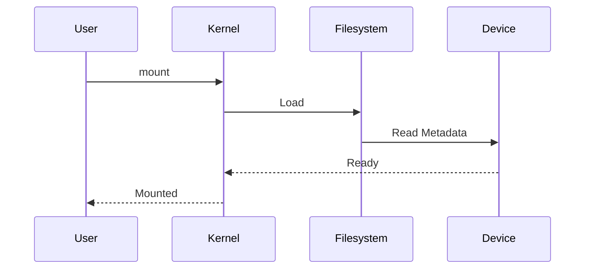

---

# Unmounting

Detach filesystem:

```bash
sudo umount /mnt/demo
```

Notice:

```text
umount

NOT

unmount
```

---

# Why Unmount?

Ensures:

```text
Data Flushed

Metadata Updated

Filesystem Consistent
```

---

# Unmount Flow

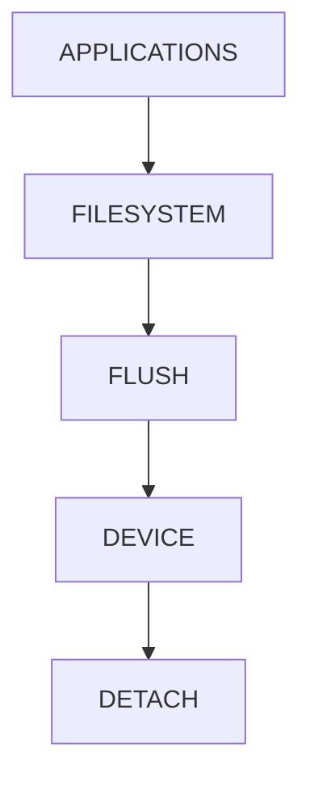

---

# Common Error

```bash
umount: target is busy
```

Meaning:

```text
Process still using filesystem
```

---

# Find Busy Processes

Use:

```bash
lsof +D /mnt/demo
```

or:

```bash
fuser -m /mnt/demo
```

---

# Lab Task 5

Investigate:

```bash
man umount

man lsof
```

Understand recovery process.

---

# Persistent Mounts

Temporary mount:

```text
Lost after reboot
```

Need persistence.

---

# Enter fstab

File:

```text
/etc/fstab
```

Controls automatic mounting.

---

# View Configuration

```bash
cat /etc/fstab
```

Example:

```text
UUID=xxxx / ext4 defaults 0 1
```

---

# Boot Process

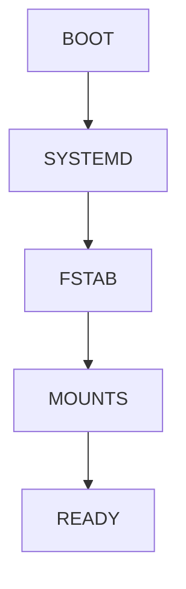

---

# Why fstab Matters

Without it:

```text
Manual Mounting After Every Reboot
```

With it:

```text
Automatic Storage Setup
```

---

# Lab Task 6

Inspect:

```bash
cat /etc/fstab
```

Identify:

```text
Root filesystem

Swap

Additional mounts
```

---

# Mount Options

Common options:

```text
rw

ro

noexec

nosuid

nodev
```

---

# Security Example

```text
noexec
```

prevents execution.

Useful for:

```text
Shared Storage

Temporary Storage
```

---

# Security Architecture

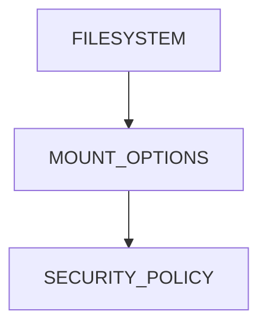

---

# Docker Connection

Docker volumes are mounted.

Example:

```bash
docker run -v data:/app/data
```

Internally:

```text
Filesystem Mount
```

---

# Docker Storage Architecture

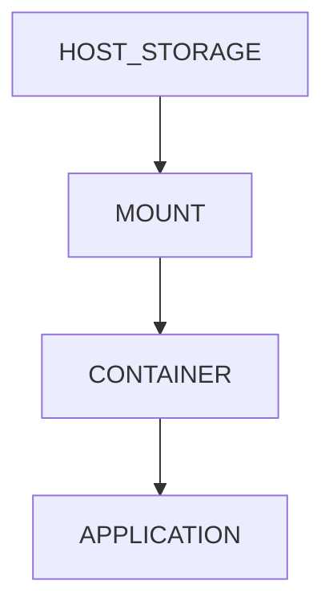

---

# Kubernetes Connection

Persistent Volume:

```text
PV
```

mounted into:

```text
Pod
```

using mount mechanisms.

---

# Kubernetes Storage Flow


---

# Cloud Connection

AWS:

```text
EBS Volume
```

attached as:

```text
/dev/nvme1n1
```

Then:

```text
Filesystem Created

Mounted
```

---

# Cloud Storage Architecture

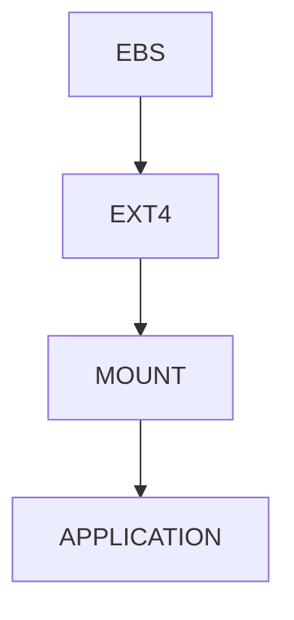

---

# Database Connection

Databases often mount:

```text
Dedicated Storage
```

at:

```text
/var/lib/postgresql

/var/lib/mysql
```

Benefits:

```text
Isolation

Performance

Scalability
```

---

# Guided Challenge

Investigate:

```bash
findmnt

lsblk

lsblk -f

df -h
```

Create a map of your system.

---

# Semi-Guided Challenge

Answer:

```text
Which filesystem contains root?

Which contain tmpfs?

Which are virtual filesystems?

Which are disk-backed?
```

---

# Independent Challenge

Build a storage diagram of your Linux machine using:

```bash
findmnt

lsblk

df -h
```

Create a Mermaid diagram showing:

```text
Device

Filesystem

Mount Point

Usage
```

---

# Linux Internals Deep Dive

Mount namespace view:

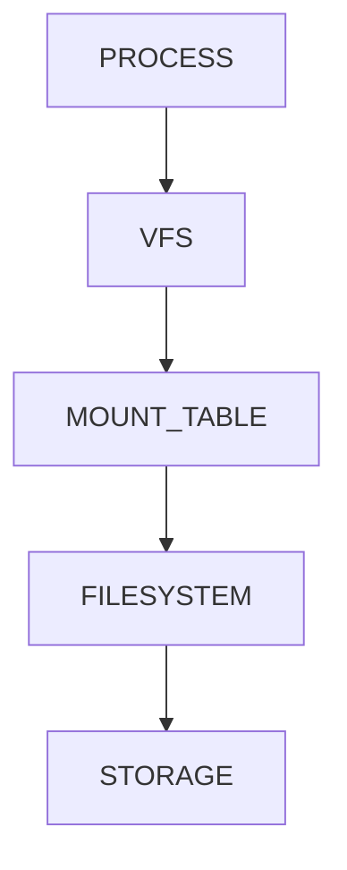

The Linux kernel uses:

```text
Virtual Filesystem Layer (VFS)
```

to unify all filesystems.

---

# Performance Considerations

Mount design affects:

```text
Storage Throughput

IOPS

Latency

Scalability
```

Poor mount planning causes:

```text
Disk Contention

Storage Bottlenecks

Database Slowdowns
```

---

# Security Considerations

Important mount options:

```text
ro

nodev

nosuid

noexec
```

can significantly reduce attack surface.

---

# Common Mistakes

## Mistake 1

Confusing device with mount point.

```text
/dev/sdb1 ≠ /data
```

---

## Mistake 2

Forgetting persistence.

Mount disappears after reboot.

---

## Mistake 3

Unmounting active filesystems.

---

## Mistake 4

Ignoring mount security options.

---

## Mistake 5

Assuming all filesystems come from disks.

Virtual filesystems exist.

---

# Troubleshooting

## What Is Mounted?

```bash
findmnt
```

---

## Which Device?

```bash
lsblk -f
```

---

## Disk Usage?

```bash
df -h
```

---

## Busy Unmount?

```bash
lsof +D <mountpoint>

fuser -m <mountpoint>
```

---

## Mount Configuration?

```bash
cat /etc/fstab
```

---

# Engineering Mindset

Beginners see:

```text
Folders
```

Engineers see:

```text
Storage Hierarchy

Filesystem Layers

Mount Trees

Kernel Abstractions
```

Ask:

```text
Where is this data actually stored?

Which filesystem owns it?

Which device backs it?

How is it mounted?

What happens after reboot?
```

Those questions lead toward:

```text
Storage Engineering

Cloud Infrastructure

Database Engineering

Platform Engineering

Kubernetes Storage

Distributed Systems
```

---

# Interview Questions

### What is a mount point?

A directory where a filesystem becomes accessible.

---

### Why does Linux use mount points?

To provide a unified filesystem hierarchy.

---

### What command shows mounted filesystems?

```bash
findmnt
```

---

### What command shows storage devices?

```bash
lsblk
```

---

### What file controls persistent mounts?

```text
/etc/fstab
```

---

### Difference between mount and umount?

```text
mount  = attach filesystem

umount = detach filesystem
```

---

### What is tmpfs?

Memory-backed filesystem.

---

### Why are mount options important?

They affect:

```text
Security

Performance

Behavior
```

---

# Cheat Sheet

```bash
findmnt

mount

lsblk

lsblk -f

df -h

mount | grep proc

mount | grep tmpfs

sudo mount /dev/sdb1 /mnt/demo

sudo umount /mnt/demo

cat /etc/fstab

lsof +D /mnt/demo

fuser -m /mnt/demo
```

---

# Lab Success Criteria

You can complete this lab when you can:

✅ Explain mount points

✅ Explain Linux's unified filesystem model

✅ Investigate mounted filesystems

✅ Use findmnt effectively

✅ Understand device-to-filesystem mapping

✅ Explain virtual filesystems

✅ Understand fstab

✅ Explain mounting and unmounting

✅ Connect mount points to Docker volumes

✅ Connect mount points to Kubernetes storage

✅ Connect mount points to cloud block storage

✅ Think like a storage engineer

Congratulations.

You now understand one of the most important abstractions in Linux and the foundation upon which cloud storage, container storage, database storage, and Kubernetes persistent storage are built.
