# Lab 06 – Filesystem Corruption Simulation

> Every storage engineer eventually learns a painful lesson:
>
> ```text
> Hardware Fails
> Power Fails
> Humans Make Mistakes
> Software Has Bugs
> Storage Gets Corrupted
> ```
>
> The real question is not:
>
> ```text
> Will corruption happen?
> ```
>
> The real question is:
>
> ```text
> How will you detect it?
>
> How will you recover from it?
>
> How will you prevent data loss?
> ```
>
> This lab teaches filesystem corruption safely using loopback devices and disposable filesystems.
>
> **Never perform corruption experiments on production systems.**

---

# Lab Objective

By the end of this lab you will:

* Understand filesystem corruption
* Understand why corruption occurs
* Safely simulate corruption
* Investigate filesystem metadata damage
* Use fsck
* Understand journaling recovery
* Understand storage resilience
* Connect filesystem recovery to databases
* Connect recovery concepts to cloud systems
* Think like a storage engineer

---

# Safety First

⚠️ Never run these experiments on:

```text
Production Servers

Personal Laptops

Important Data

Cloud Production Volumes

Database Storage
```

Use:

```text
Disposable Filesystem Images

Virtual Machines

Lab Environments
```

Only.

---

# Why This Matters

Imagine:

```text
Datacenter Power Failure
```

Or:

```text
Kernel Panic
```

Or:

```text
Storage Controller Crash
```

Or:

```text
Unexpected Server Reboot
```

What happens to:

```text
Filesystem Metadata?

Directories?

Files?

Databases?
```

Understanding corruption helps explain why modern systems use:

```text
Journaling

WAL

Replication

Snapshots

Backups
```

---

# The Problem

Storage devices write data in pieces.

Example:

```text
Write File

Write Metadata

Update Directory

Update Inode
```

What if power fails halfway?

---

# Corruption Scenario

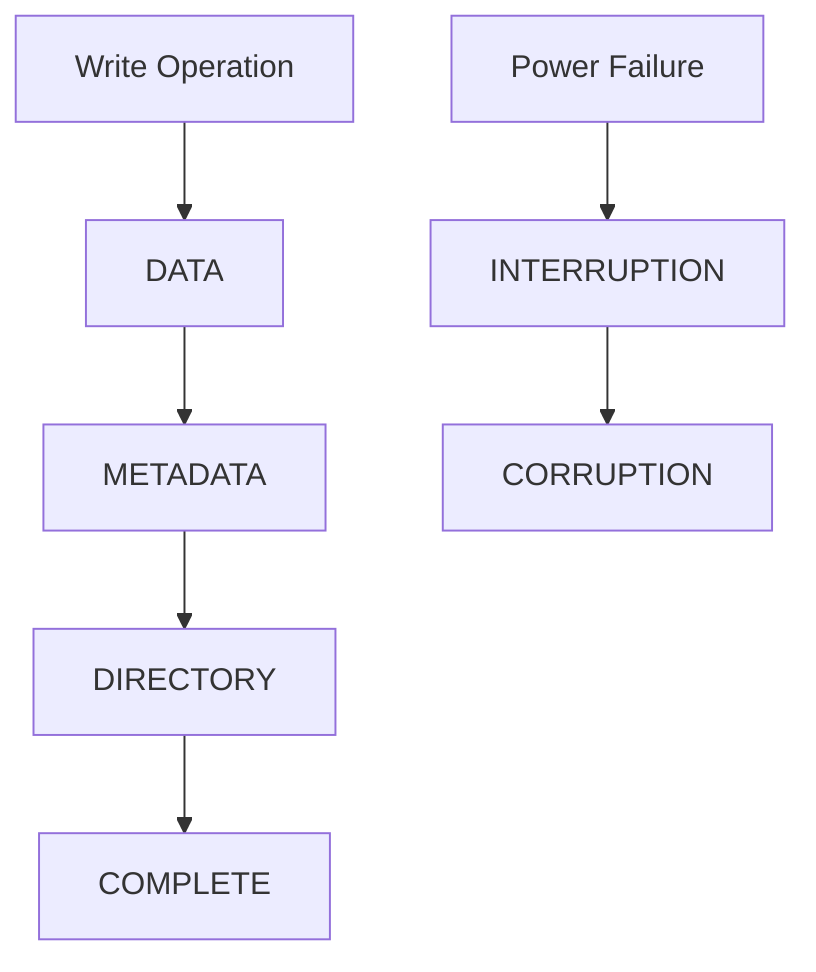

---

# Mental Model

Think of a library.

You add a new book.

Steps:

```text
Place Book

Update Catalog

Update Shelf Index
```

If power fails after:

```text
Place Book
```

but before:

```text
Update Catalog
```

The library becomes inconsistent.

Filesystems face the same challenge.

---

# First Principles

A filesystem must maintain:

```text
Consistency

Integrity

Recoverability
```

Corruption means:

```text
Filesystem Metadata No Longer Agrees
```

---

# Common Causes Of Corruption

```text
Power Failure

Bad RAM

Disk Failure

Kernel Bugs

Storage Driver Bugs

Human Error

Unexpected Reboots
```

---

# Corruption Landscape

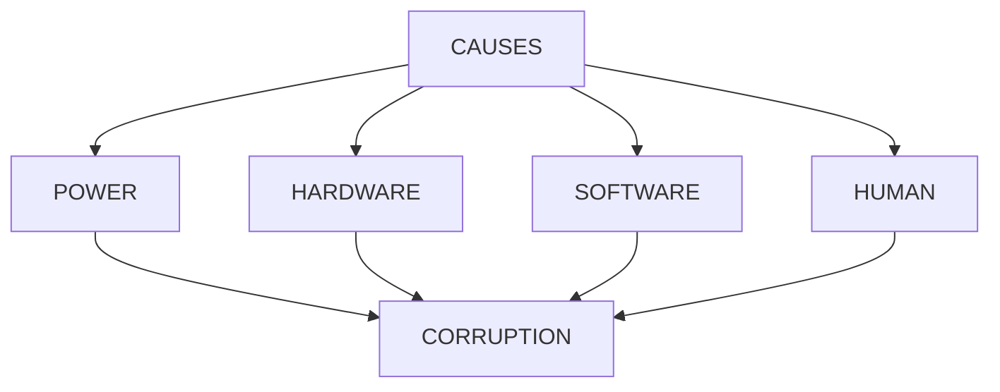

---

# Lab Environment Setup

We create a virtual disk.

Create image:

```bash
dd if=/dev/zero of=fs-lab.img bs=1M count=200
```

Result:

```text
200MB Virtual Disk
```

---

# Create EXT4 Filesystem

```bash
mkfs.ext4 fs-lab.img
```

Observe:

```text
Superblock

Inodes

Journal

Block Groups
```

created.

---

# Architecture

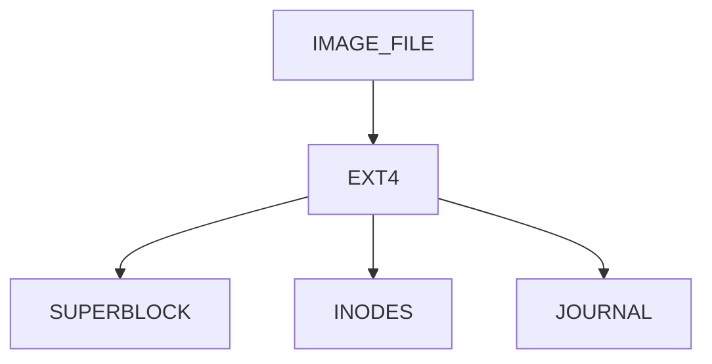

---

# Lab Task 1

Create:

```bash
dd if=/dev/zero of=fs-lab.img bs=1M count=200

mkfs.ext4 fs-lab.img
```

Document output.

---

# Mounting The Filesystem

Create mount point:

```bash
mkdir mount-test
```

Mount:

```bash
sudo mount -o loop fs-lab.img mount-test
```

Verify:

```bash
df -h
```

---

# Loop Device Architecture


---

# Why Loop Devices Matter

They allow:

```text
Filesystem Experiments

VM Images

Container Images

Disk Simulation
```

without physical disks.

---

# Lab Task 2

Mount image.

Verify:

```bash
mount | grep fs-lab
```

---

# Create Data

Generate files:

```bash
touch mount-test/file{1..100}

echo "Linux Storage" > mount-test/important.txt
```

Verify:

```bash
ls mount-test
```

---

# Filesystem State

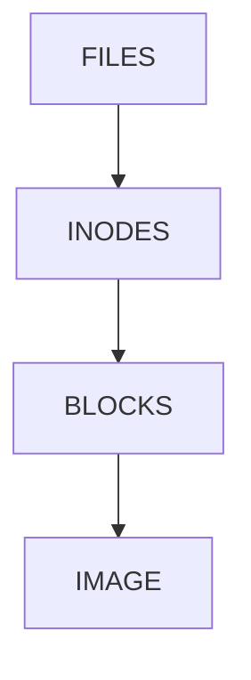

---

# Understanding Clean Filesystems

Check status:

```bash
sudo tune2fs -l fs-lab.img | grep state
```

Example:

```text
Filesystem state: clean
```

---

# Why State Matters

Clean:

```text
Properly Unmounted
```

Dirty:

```text
Potential Recovery Needed
```

---

# Journaling Refresher

EXT4 protects metadata using journals.

---

# Journaling Workflow

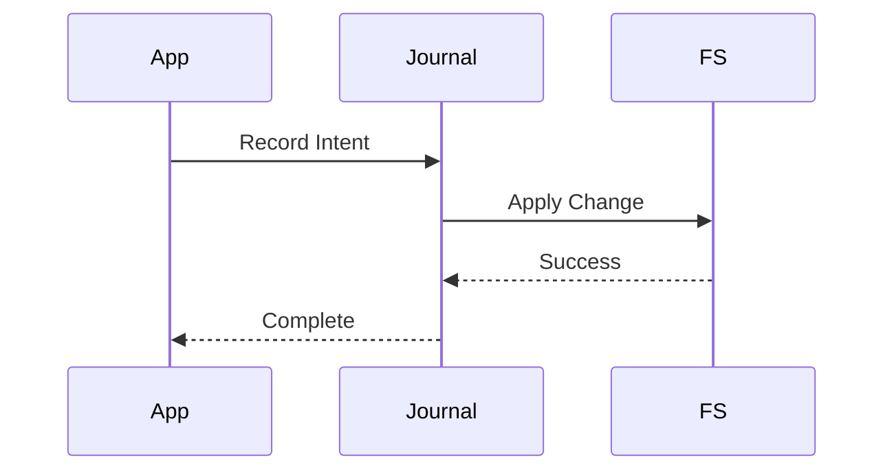

---

# Simulating Unsafe Shutdown

Unmount properly first:

```bash
sudo umount mount-test
```

Check filesystem:

```bash
sudo fsck -n fs-lab.img
```

Expected:

```text
Clean
```

---

# Understanding fsck

Filesystem Check.

Purpose:

```text
Verify Integrity

Repair Metadata

Recover Structures
```

---

# Architecture

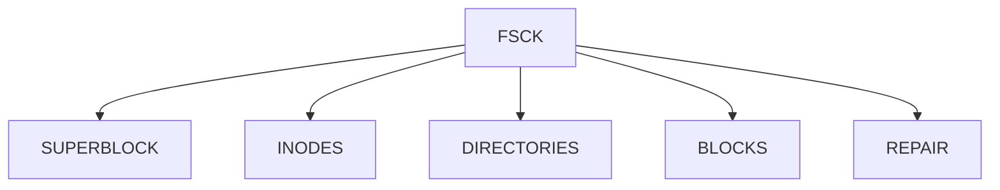

---

# Lab Task 3

Run:

```bash
sudo fsck -n fs-lab.img
```

Observe results.

---

# Simulating Corruption Safely

⚠️ Lab image only.

Never use real disks.

Overwrite small portion:

```bash
dd if=/dev/urandom of=fs-lab.img bs=512 count=20 seek=10 conv=notrunc
```

This intentionally damages metadata.

---

# What Just Happened?


Filesystem structures may now be invalid.

---

# Lab Task 4

Corrupt image.

Document command.

Do NOT do this on real systems.

---

# Detecting Corruption

Run:

```bash
sudo fsck -n fs-lab.img
```

Possible output:

```text
Bad inode

Corrupt superblock

Directory errors

Block bitmap differences
```

---

# Corruption Detection Flow

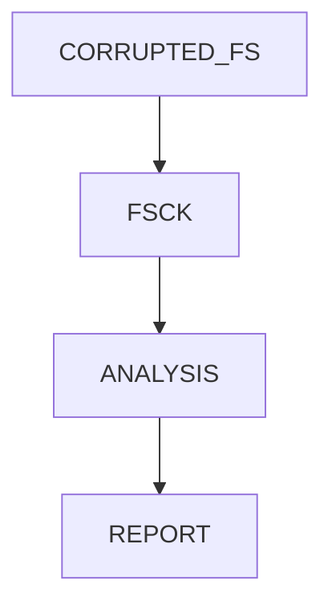

---

# Understanding What fsck Checks

Checks:

```text
Superblock

Group Descriptors

Block Bitmaps

Inode Tables

Directory Structures

Link Counts
```

---

# Deep Inspection

Filesystem layers:

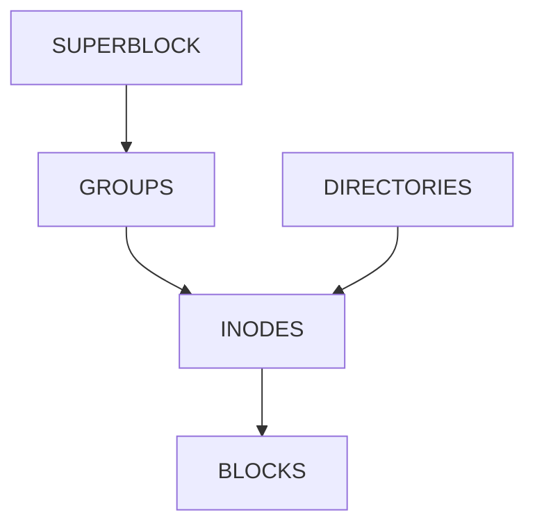

Any inconsistency may trigger repairs.

---

# Recovering Filesystem

Repair:

```bash
sudo fsck -y fs-lab.img
```

Meaning:

```text
Automatically Fix Problems
```

---

# Recovery Workflow

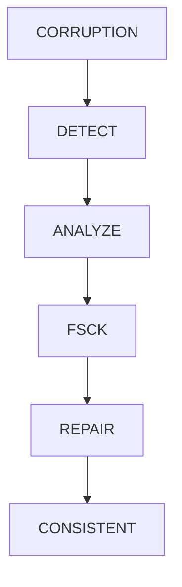

---

# Lab Task 5

Run:

```bash
sudo fsck -y fs-lab.img
```

Observe repair actions.

---

# Superblock Recovery

EXT4 stores backup superblocks.

Why?

Because:

```text
Superblock Corruption
```

must not destroy entire filesystem.

---

# Backup Superblock Design

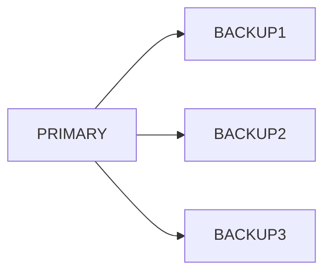

---

# Viewing Backup Superblocks

```bash
sudo mke2fs -n fs-lab.img
```

Shows:

```text
Backup Superblocks
```

---

# Lab Task 6

Run:

```bash
sudo mke2fs -n fs-lab.img
```

Record backup locations.

---

# Investigating Lost+Found

EXT4 recovery sometimes places files into:

```text
lost+found
```

Check:

```bash
sudo mount -o loop fs-lab.img mount-test
```

Then:

```bash
ls mount-test/lost+found
```

---

# Why lost+found Exists

Recovery may discover:

```text
Orphaned Inodes

Unlinked Files

Recovered Data
```

and place them here.

---

# Recovery Architecture

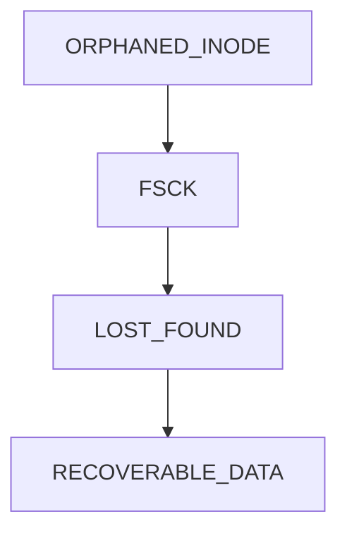

---

# Database Connection

Databases fear corruption.

PostgreSQL solves this using:

```text
WAL

Checksums

Replication
```

Similar principle:

```text
Write Before Commit
```

---

# Filesystem Journal vs Database WAL

| Filesystem        | Database             |
| ----------------- | -------------------- |
| Journal           | WAL                  |
| Metadata Recovery | Transaction Recovery |
| Crash Protection  | Crash Protection     |
| Consistency       | Consistency          |

---

# PostgreSQL Analogy


Similar to EXT4 journaling.

---

# Docker Connection

Docker images:

```text
Filesystem Layers
```

Corruption can affect:

```text
Containers

Volumes

Persistent Data
```

---

# Kubernetes Connection

Kubernetes nodes rely on:

```text
EXT4

XFS

Cloud Volumes
```

Corruption can impact:

```text
Pods

Volumes

Persistent Storage
```

---

# Cloud Connection

Cloud providers protect storage using:

```text
Replication

Checksums

Snapshots

Redundancy
```

because corruption is inevitable.

---

# Real Production Incident

Scenario:

```text
Power Failure

Database Server Reboots

Filesystem Dirty
```

Recovery:

```text
Journal Replay

Filesystem Check

Database WAL Replay

Service Recovery
```

---

# Production Recovery Flow

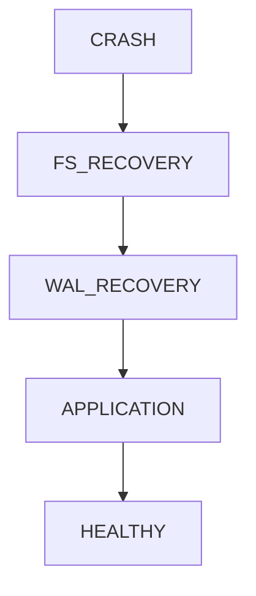

---

# Guided Challenge

Create:

```bash
fs-lab.img
```

Perform:

```text
Create

Mount

Write Data

Check State

Run fsck
```

Document results.

---

# Semi-Guided Challenge

Answer:

```text
What does fsck inspect?

Why does journaling exist?

Why are backup superblocks needed?

Why does lost+found exist?
```

---

# Independent Challenge

Create a recovery diagram showing:

```text
Filesystem

Journal

Crash

fsck

Recovery

Application Restart
```

using Mermaid.

---

# Linux Internals Deep Dive

EXT4 recovery path:

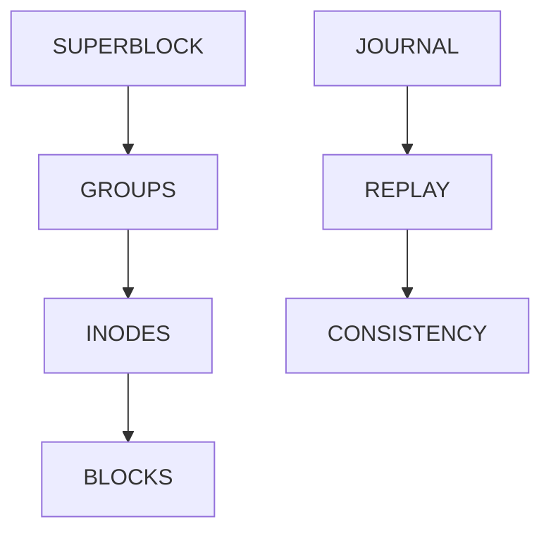

This is why Linux filesystems survive many failures.

---

# Performance Considerations

Filesystem checking can be expensive.

Large systems:

```text
10 TB

50 TB

100 TB
```

may require significant recovery time.

Modern journaling reduces this.

---

# Security Considerations

Corruption may be caused by:

```text
Failing Hardware

Malicious Tampering

Unexpected Shutdowns
```

Monitor:

```text
SMART Data

Kernel Logs

Filesystem Health
```

---

# Common Mistakes

## Mistake 1

Running fsck on mounted production filesystem.

Dangerous.

---

## Mistake 2

Assuming journaling protects user data completely.

It primarily protects metadata consistency.

---

## Mistake 3

Ignoring filesystem warnings.

---

## Mistake 4

No backups.

Recovery is not backup.

---

## Mistake 5

Testing corruption on real disks.

Never do this.

---

# Troubleshooting

## Filesystem Dirty

Check:

```bash
sudo tune2fs -l <device>
```

---

## Filesystem Errors

Run:

```bash
sudo fsck -n
```

---

## Repair Needed

Use:

```bash
sudo fsck -y
```

carefully.

---

## Superblock Corruption

Inspect:

```bash
sudo mke2fs -n <device>
```

for backup superblocks.

---

# Engineering Mindset

Beginners think:

```text
Storage Stores Data
```

Engineers think:

```text
Storage Fails

Metadata Corrupts

Recovery Matters
```

Ask:

```text
What happens if power fails?

What happens if metadata is damaged?

What happens if recovery fails?

How do we restore service?
```

Those questions lead toward:

```text
Storage Engineering

Database Engineering

SRE

Cloud Infrastructure

Disaster Recovery
```

---

# Interview Questions

### What is fsck?

Filesystem consistency checker and repair tool.

---

### Why does filesystem corruption occur?

Power failures, hardware issues, software bugs, and improper shutdowns.

---

### What is journaling?

Recording filesystem operations before applying them.

---

### What is lost+found?

Directory used to store recovered filesystem objects.

---

### Why are backup superblocks important?

They allow recovery if the primary superblock becomes corrupted.

---

### What does fsck check?

```text
Superblocks

Inodes

Directories

Block Maps

Link Counts
```

---

### Does journaling eliminate corruption?

No.

It reduces and helps recover from corruption.

---

# Cheat Sheet

```bash
dd if=/dev/zero of=fs-lab.img bs=1M count=200

mkfs.ext4 fs-lab.img

sudo mount -o loop fs-lab.img mount-test

sudo umount mount-test

sudo fsck -n fs-lab.img

sudo fsck -y fs-lab.img

sudo tune2fs -l fs-lab.img

sudo mke2fs -n fs-lab.img

mount

findmnt

lsblk
```

---

# Lab Success Criteria

You can complete this lab when you can:

✅ Explain filesystem corruption

✅ Explain journaling

✅ Create a disposable EXT4 filesystem

✅ Use loopback devices

✅ Run fsck safely

✅ Explain superblock recovery

✅ Understand lost+found

✅ Connect EXT4 recovery to database WAL

✅ Connect recovery to cloud infrastructure

✅ Think like a storage engineer

Congratulations.

You now understand one of the most important realities of systems engineering:

```text
Storage Is Not About Writing Data.

Storage Is About Recovering Data When Things Go Wrong.
```
