# Lab 07 – Filesystem Performance

> Most engineers blame:
>
> ```text
> CPU
> Memory
> Network
> ```
>
> when systems become slow.
>
> But in many production systems the real bottleneck is:
>
> ```text
> Storage
> ```
>
> More specifically:
>
> ```text
> Filesystem Performance
> ```
>
> Databases, Kubernetes clusters, Docker hosts, CI/CD systems, AI pipelines, cloud workloads, and distributed systems all depend heavily on filesystem performance.
>
> This lab teaches you how filesystems actually affect application speed and how engineers investigate storage bottlenecks.

---

# Lab Objective

By the end of this lab you will:

* Understand filesystem performance fundamentals
* Measure storage performance
* Understand IOPS
* Understand throughput
* Understand latency
* Analyze metadata performance
* Investigate filesystem bottlenecks
* Understand caching effects
* Connect filesystem performance to databases
* Connect filesystem performance to cloud infrastructure

---

# Why This Matters

Imagine:

```text
Database CPU Usage = 10%

Memory Usage = 30%

Network Usage = Low
```

Yet:

```text
Application Response Time = 3 Seconds
```

Why?

Possible answer:

```text
Storage Latency
```

Or:

```text
Metadata Bottleneck
```

Or:

```text
Filesystem Saturation
```

Many production outages are actually storage performance problems.

---

# The Problem

Applications need:

```text
Read Files

Write Files

Update Metadata

Create Files

Delete Files
```

All require filesystem operations.

Slow filesystem:

```text
Slow Application
```

---

# Mental Model

Think of a warehouse.

Application:

```text
Customer
```

Filesystem:

```text
Warehouse
```

Storage:

```text
Shelves
```

If finding items takes too long:

```text
Business Becomes Slow
```

---

# Storage Performance Stack

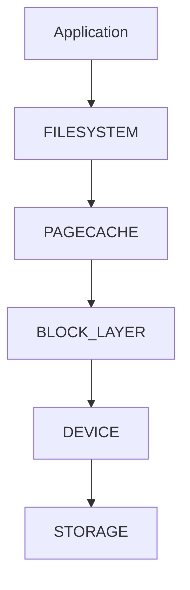

---

# First Principles

Filesystem performance is usually determined by:

```text
Latency

IOPS

Throughput

Metadata Performance

Caching
```

Understanding these five concepts explains most storage behavior.

---

# What Is Latency?

Latency is:

```text
How Long One Operation Takes
```

Example:

```text
Read One Block

2 ms
```

Latency:

```text
2 milliseconds
```

---

# Latency Visualization


---

# Why Latency Matters

Application waits.

```text
Request
 ↓
Disk Read
 ↓
Response
```

High latency means:

```text
Slow Application
```

---

# Real Example

```text
SSD Read = 0.1 ms

HDD Read = 10 ms
```

Difference:

```text
100x
```

---

# What Is Throughput?

Throughput measures:

```text
How Much Data Per Second
```

Examples:

```text
100 MB/s

500 MB/s

2 GB/s
```

---

# Throughput Visualization


Think:

```text
Water Through Pipe
```

---

# Throughput Example

Copy file:

```bash
cp huge-file.iso backup.iso
```

Filesystem throughput determines:

```text
How Fast Copy Completes
```

---

# What Is IOPS?

IOPS means:

```text
Input Output Operations Per Second
```

Measures:

```text
How Many Operations

Not How Much Data
```

---

# Example

Storage A:

```text
100 IOPS
```

Storage B:

```text
100,000 IOPS
```

Huge difference.

---

# IOPS Visualization

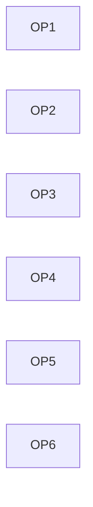

More operations per second:

```text
Higher IOPS
```

---

# Why Databases Care

Database workload:

```text
Small Random Reads

Small Random Writes
```

Needs:

```text
High IOPS
```

---

# Why Backup Systems Care

Backup workload:

```text
Large Sequential Reads
```

Needs:

```text
High Throughput
```

Different workload.

Different bottleneck.

---

# Performance Triangle

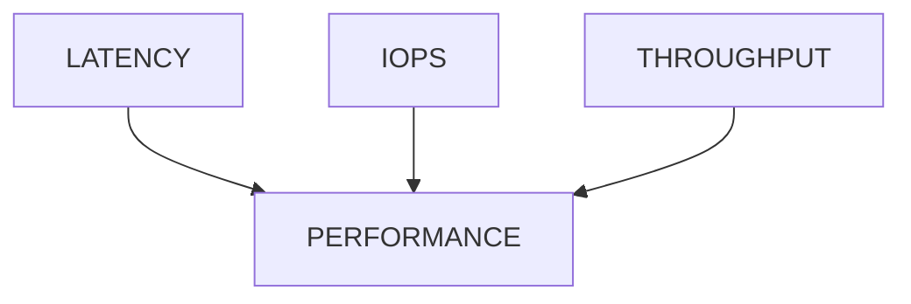

---

# Lab Environment Setup

Create workspace:

```bash
mkdir -p ~/filesystem-performance-lab

cd ~/filesystem-performance-lab
```

---

# Measuring Disk Usage

Check:

```bash
df -h
```

Observe:

```text
Filesystem

Used

Available

Mounted On
```

---

# Why Capacity Matters

Nearly full filesystems often become slower.

Reasons:

```text
Fragmentation

Allocation Difficulty

Metadata Overhead
```

---

# Lab Task 1

Run:

```bash
df -h
```

Document:

```text
Filesystem

Size

Used

Available
```

---

# Measuring Device Performance

Basic test:

```bash
dd if=/dev/zero of=testfile bs=1M count=1024
```

Creates:

```text
1 GB file
```

---

# Performance Measurement Flow

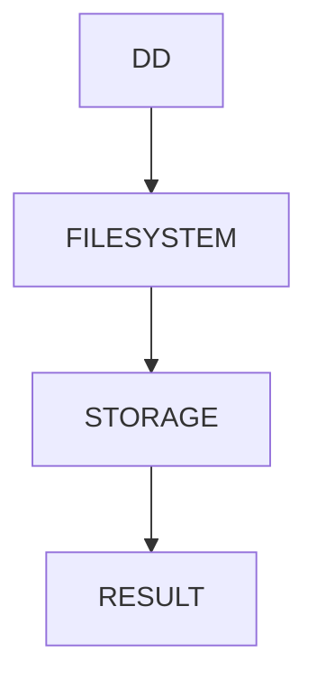

---

# Lab Task 2

Run:

```bash
time dd if=/dev/zero of=testfile bs=1M count=512
```

Observe:

```text
Elapsed Time

Write Speed
```

---

# Understanding Read Performance

Read file:

```bash
time cat testfile > /dev/null
```

Measure:

```text
Read Time
```

---

# Read Path


---

# Why Results Change

Second read often faster.

Reason:

```text
Linux Page Cache
```

---

# Understanding Page Cache

Linux keeps recently used data in memory.

Instead of:

```text
Disk Read
```

Linux may perform:

```text
Memory Read
```

---

# Cache Architecture

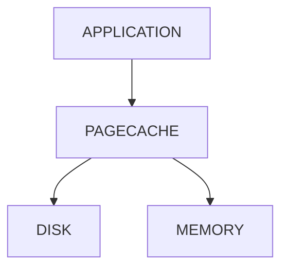

---

# Why Cache Exists

Disk:

```text
Slow
```

Memory:

```text
Fast
```

Cache bridges gap.

---

# Lab Task 3

Run:

```bash
time cat testfile > /dev/null
```

twice.

Compare results.

---

# Metadata Performance

Many systems fail due to metadata bottlenecks.

Example:

```text
Millions of Small Files
```

---

# Why?

Operations require:

```text
Inode Lookup

Permission Check

Directory Traversal
```

---

# Metadata Workflow

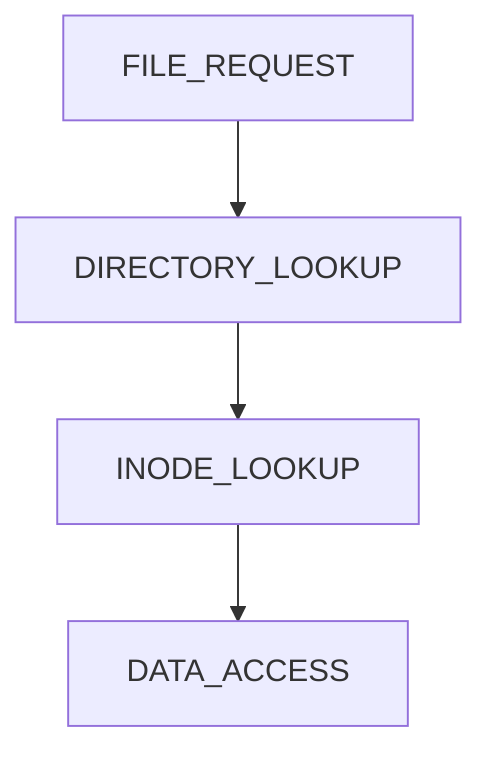

---

# Create Metadata Load

```bash
mkdir metadata-test

cd metadata-test

touch file{1..10000}
```

---

# Measure Listing

```bash
time ls > /dev/null
```

Observe.

---

# Lab Task 4

Create:

```bash
mkdir metadata-test

cd metadata-test

touch file{1..5000}
```

Measure:

```bash
time ls > /dev/null
```

---

# Why Small Files Hurt

Consider:

```text
1 GB File
```

versus:

```text
1,000,000 Files

1 KB Each
```

Same size.

Very different performance.

---

# Metadata Cost

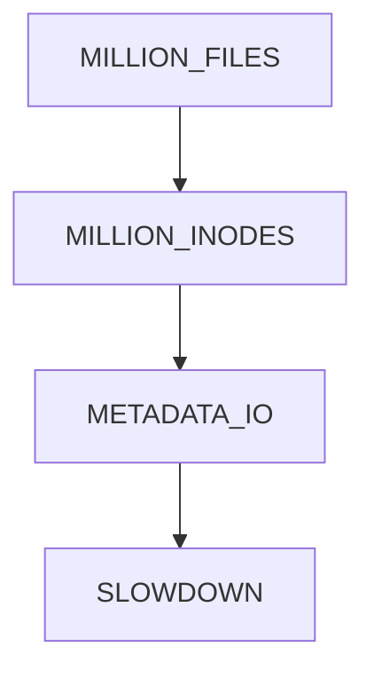

---

# Random vs Sequential Access

Two storage patterns.

---

# Sequential

```text
Read Block 1

Read Block 2

Read Block 3
```

Fast.

---

# Random

```text
Read Block 1

Read Block 50000

Read Block 7

Read Block 8000
```

Slower.

---

# Visualization

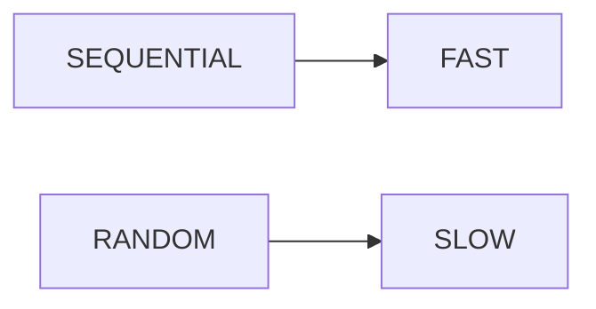

---

# Why Databases Are Difficult

Databases generate:

```text
Random Reads

Random Writes
```

Storage must work harder.

---

# Filesystem Fragmentation

Over time:

```text
File Pieces

Become Scattered
```

---

# Fragmentation Model

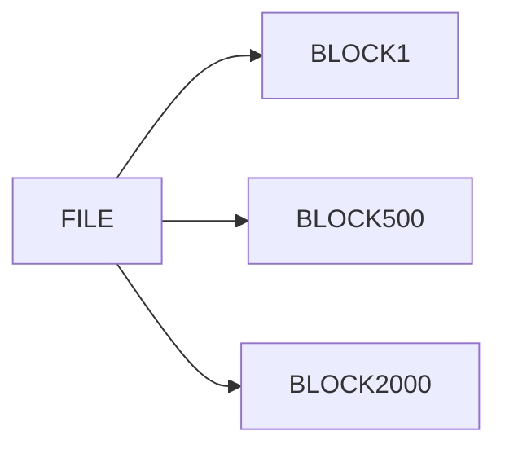

More seeks.

More latency.

---

# Modern SSD Advantage

SSD:

```text
No Mechanical Head
```

Less fragmentation impact.

---

# HDD Problem

HDD:

```text
Physical Movement Required
```

Fragmentation hurts significantly.

---

# Understanding Mount Options

View:

```bash
mount
```

Options affect:

```text
Caching

Write Behavior

Performance
```

---

# Common Performance Options

```text
noatime

relatime

discard
```

---

# Why noatime Helps

Without:

```text
Every Read

Updates Access Time
```

Extra writes occur.

---

# Performance Flow

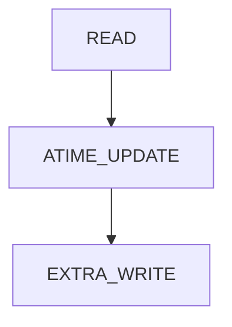

---

# Lab Task 5

Inspect:

```bash
mount | grep " / "
```

Identify:

```text
Filesystem Type

Mount Options
```

---

# Measuring I/O Activity

Use:

```bash
iostat
```

Install if needed:

```bash
sudo apt install sysstat
```

Run:

```bash
iostat -x 1
```

---

# Understanding iostat

Important fields:

```text
r/s

w/s

await

util
```

---

# Visualization

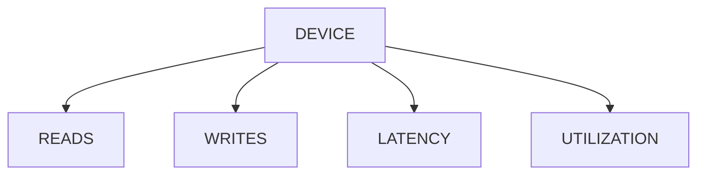

---

# Why await Matters

Represents:

```text
Average Wait Time
```

High:

```text
Storage Bottleneck
```

---

# Lab Task 6

Run:

```bash
iostat -x 1
```

Observe:

```text
Device Utilization

Wait Times

Reads

Writes
```

---

# Production Investigation Workflow

Storage complaint:

```text
Application Slow
```

Investigation:

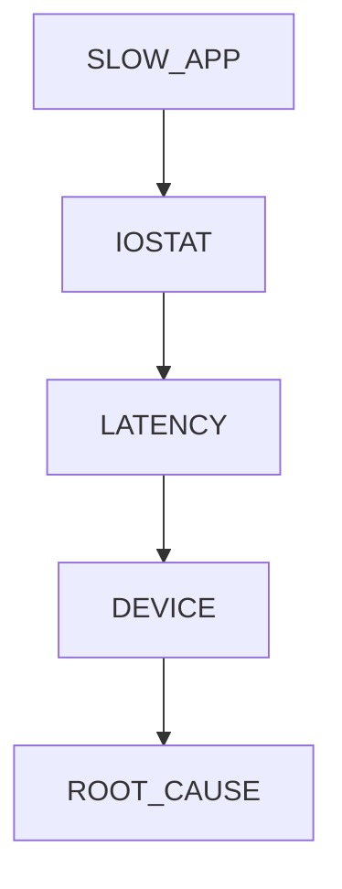

---

# Database Connection

PostgreSQL depends heavily on:

```text
Filesystem

Page Cache

WAL Storage

Random I/O
```

---

# Database Architecture

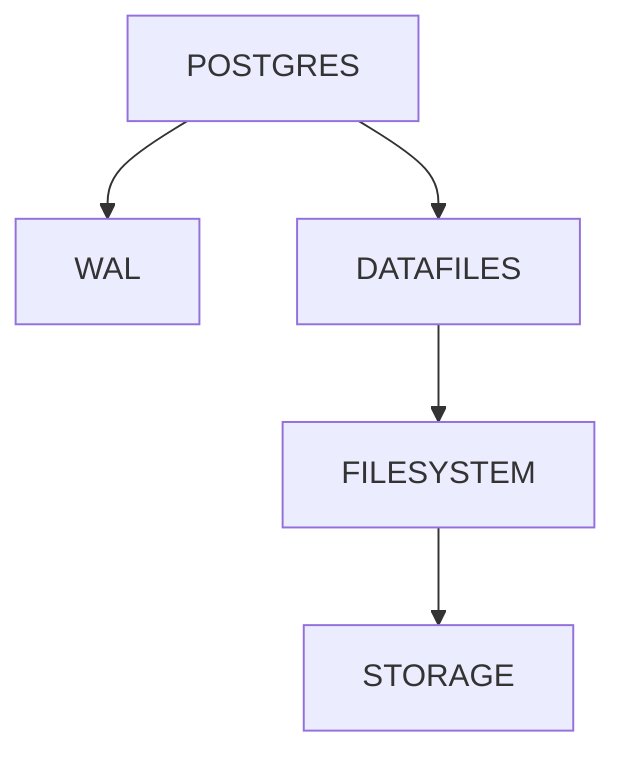

---

# Docker Connection

Containers share host filesystem.

Performance issues often come from:

```text
OverlayFS

Volume Performance

Host Storage
```

not Docker itself.

---

# Docker Storage Flow

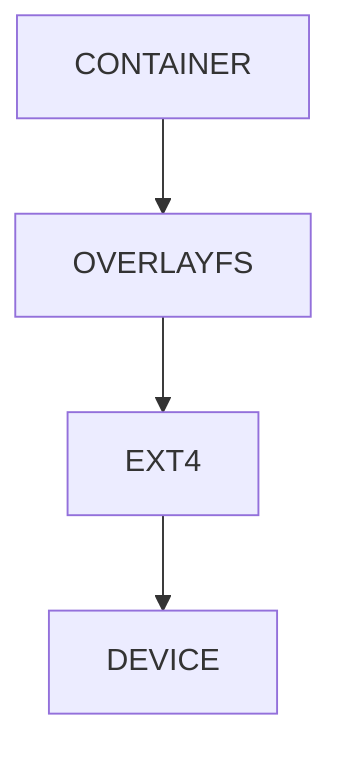

---

# Kubernetes Connection

Pods depend on:

```text
Node Storage

Persistent Volumes

Cloud Disks
```

Filesystem performance affects:

```text
Application Performance
```

directly.

---

# Cloud Connection

Cloud volumes differ greatly.

Example:

```text
Standard HDD

SSD

Provisioned IOPS SSD
```

Each provides different:

```text
Latency

IOPS

Throughput
```

---

# Cloud Storage Hierarchy

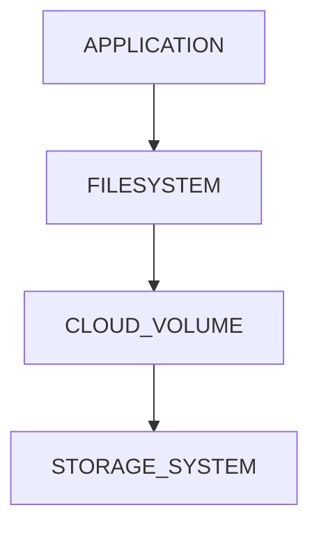

---

# Guided Challenge

Measure:

```bash
df -h

time dd

time cat

mount
```

Document:

```text
Storage Type

Write Speed

Read Speed

Filesystem Type
```

---

# Semi-Guided Challenge

Create:

```text
5000+ files
```

Measure:

```bash
time ls

time find
```

Explain results.

---

# Independent Challenge

Investigate:

```text
Filesystem Type

Mount Options

Storage Device

Cache Effects

Metadata Performance
```

Create a performance report.

---

# Linux Internals Deep Dive

Actual read path:

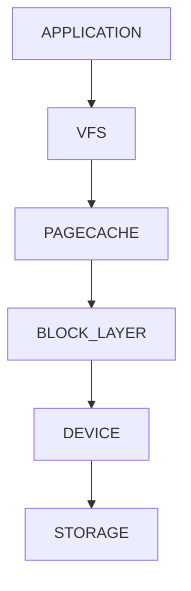

This architecture powers:

```text
Linux

Docker

Kubernetes

Databases

Cloud Systems
```

---

# Performance Considerations

Major bottlenecks:

```text
Small Files

Random IO

Metadata Operations

Fragmentation

Slow Storage

Cache Misses
```

---

# Security Considerations

Performance tuning must not sacrifice:

```text
Integrity

Durability

Recovery
```

Example:

```text
Faster Writes
```

may increase:

```text
Data Loss Risk
```

during crashes.

---

# Common Mistakes

## Mistake 1

Blaming CPU.

Storage is bottleneck.

---

## Mistake 2

Ignoring latency.

---

## Mistake 3

Ignoring metadata costs.

---

## Mistake 4

Benchmarking cached reads.

---

## Mistake 5

Confusing throughput with IOPS.

---

# Troubleshooting

## High Disk Usage

```bash
df -h
```

---

## High Latency

```bash
iostat -x 1
```

---

## Filesystem Type

```bash
df -T
```

---

## Mount Options

```bash
mount
```

---

## Metadata Investigation

```bash
stat file

find
```

---

# Engineering Mindset

Beginners see:

```text
Files
```

Engineers see:

```text
Latency

IOPS

Metadata

Caches

Block Devices
```

Ask:

```text
Is this CPU bound?

Memory bound?

Network bound?

Storage bound?
```

That mindset leads toward:

```text
Storage Engineering

Database Engineering

Cloud Engineering

Platform Engineering

Performance Engineering
```

---

# Interview Questions

### What is latency?

Time required for a storage operation.

---

### What is throughput?

Amount of data transferred per second.

---

### What is IOPS?

Input/output operations per second.

---

### Why is page cache important?

It reduces expensive disk access.

---

### Why can small files be slow?

Metadata operations dominate.

---

### What tool measures storage statistics?

```bash
iostat
```

---

### What command measures execution time?

```bash
time
```

---

### Why do databases care about IOPS?

They perform many small random reads and writes.

---

# Cheat Sheet

```bash
df -h

df -T

time dd if=/dev/zero of=testfile bs=1M count=1024

time cat testfile > /dev/null

mount

iostat -x 1

stat file

find .

lsblk
```

---

# Lab Success Criteria

You can complete this lab when you can:

✅ Explain latency

✅ Explain throughput

✅ Explain IOPS

✅ Explain page cache

✅ Measure filesystem performance

✅ Investigate metadata bottlenecks

✅ Analyze storage behavior

✅ Connect filesystem performance to databases

✅ Connect filesystem performance to Docker

✅ Connect filesystem performance to Kubernetes

✅ Think like a performance engineer

Congratulations.

You now understand a critical truth of production systems:

```text
Applications Do Not Run On CPUs.

Applications Run On Entire Systems.

And Storage Is Often The Slowest Part Of The System.
```
