# Lab 08 – Production Storage Layout

> Beginners ask:
>
> ```text
> Where should I store my files?
> ```
>
> Experienced Linux engineers ask:
>
> ```text
> Which storage tier should hold this workload?
>
> What happens when disks fill up?
>
> How do I isolate failures?
>
> How do I scale storage?
>
> How do I protect critical data?
> ```
>
> Production storage is not about storing files.
>
> It is about:
>
> ```text
> Reliability
> Scalability
> Recoverability
> Performance
> Security
> Observability
> ```
>
> This lab teaches how real-world Linux systems organize storage for applications, databases, containers, cloud workloads, and large-scale infrastructure.

---

# Lab Objective

By the end of this lab you will:

* Understand production storage design
* Design storage layouts for servers
* Separate operating system and application data
* Isolate database storage
* Plan storage for containers
* Design backup layouts
* Understand storage tiers
* Understand capacity planning
* Understand storage observability
* Think like a platform engineer

---

# Why This Matters

Imagine:

```text
Production Database
```

and

```text
Application Logs
```

share the same disk.

One day:

```text
Log Explosion
```

fills storage.

Result:

```text
Database Stops
Application Crashes
Users Impacted
```

Storage design determines:

```text
System Reliability
```

---

# The Problem

A Linux server stores:

```text
Operating System

Applications

Databases

Logs

Backups

Containers

Monitoring Data

Temporary Files
```

Should all live on one disk?

Absolutely not.

---

# Mental Model

Think of a city.

You do not place:

```text
Hospital

Airport

Power Plant

School

Factory
```

inside one building.

Similarly:

```text
Critical Workloads

Need Isolation
```

---

# Production Storage Philosophy

```text
Separate Workloads

Separate Failure Domains

Separate Performance Domains
```

---

# Storage Architecture Overview

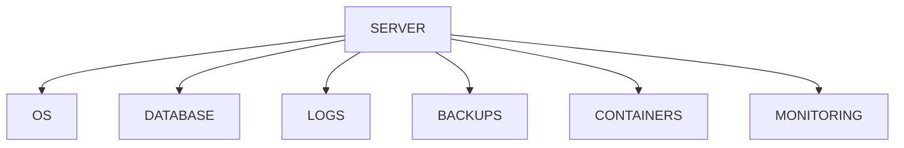

---

# First Principles

Production storage design optimizes:

```text
Availability

Performance

Security

Recovery

Scalability
```

Not convenience.

---

# Bad Storage Layout

```text
/

├── OS
├── Logs
├── PostgreSQL
├── Docker
├── Backups
└── Monitoring
```

Single disk.

Single failure domain.

Single bottleneck.

---

# Failure Scenario

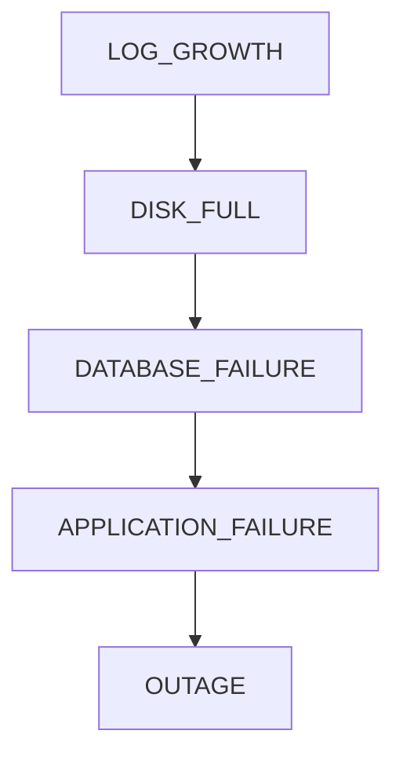

---

# Better Storage Layout

```text
Disk 1 → Operating System

Disk 2 → Databases

Disk 3 → Logs

Disk 4 → Backups

Disk 5 → Containers
```

---

# Production Layout Visualization

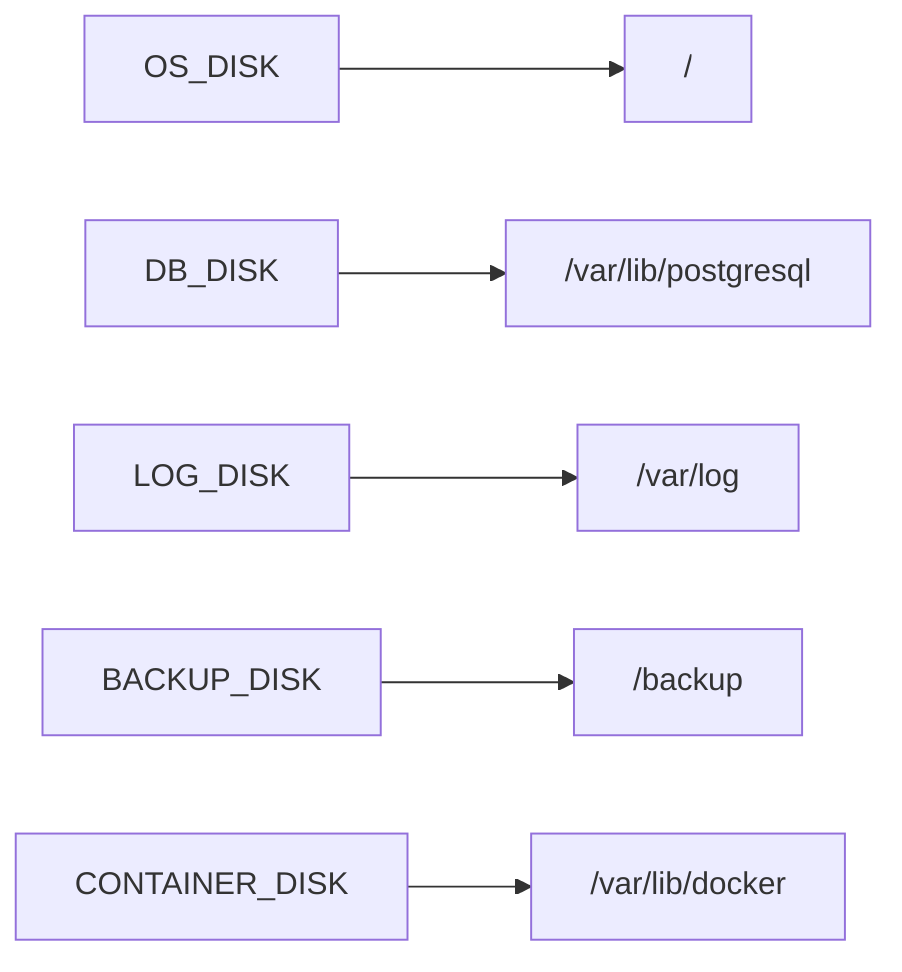

---

# Lab Environment

Investigate current storage:

```bash
df -h

lsblk

findmnt
```

Document:

```text
Devices

Filesystems

Mount Points
```

---

# Lab Task 1

Map your system.

Create:

```text
Device → Filesystem → Mount Point
```

diagram.

---

# Understanding Storage Tiers

Not all data is equally important.

---

# Tier 1 Storage

Mission Critical

Examples:

```text
Databases

Transaction Logs

Customer Data
```

Requirements:

```text
Fast

Reliable

Redundant
```

---

# Tier 2 Storage

Application Data

Examples:

```text
Application Files

Uploaded Content
```

Requirements:

```text
Good Performance

Backups
```

---

# Tier 3 Storage

Archive Data

Examples:

```text
Backups

Historical Logs

Reports
```

Requirements:

```text
Cheap

Durable
```

---

# Storage Tier Architecture

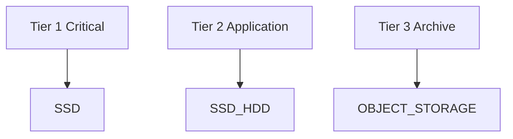

---

# Operating System Storage

Separate OS from data.

---

# Typical Layout

```text
/

/boot

/home

/tmp
```

OS disk should contain:

```text
System Components Only
```

---

# Why?

OS upgrades become easier.

Recovery becomes easier.

Replacement becomes easier.

---

# Database Storage

Databases deserve dedicated storage.

---

# PostgreSQL Example

```text
/var/lib/postgresql
```

Should ideally live on:

```text
Dedicated SSD
```

---

# Database Architecture

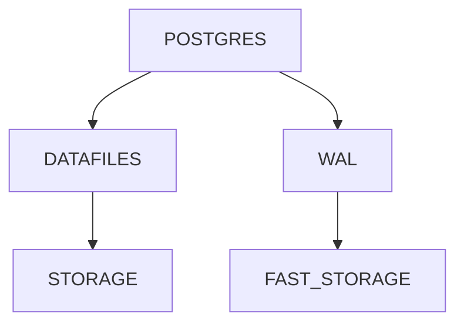

---

# Why Separate Databases?

Databases generate:

```text
Random Reads

Random Writes

Heavy Metadata Activity
```

Mixing with logs causes contention.

---

# Lab Task 2

Identify:

```text
Where PostgreSQL would store:

Data

WAL

Backups
```

on your system.

---

# Log Storage

Logs grow unpredictably.

---

# Real Incident

```text
Application Bug

↓

Millions Of Log Entries

↓

Disk Full

↓

Production Outage
```

---

# Logging Architecture

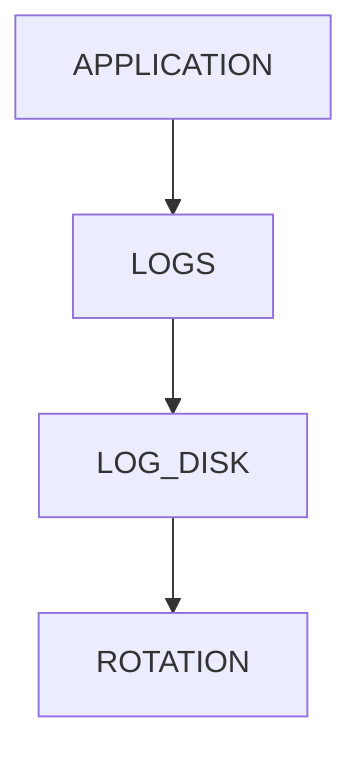

---

# Recommended Layout

```text
/var/log
```

on dedicated volume.

Large systems:

```text
Separate Log Storage
```

---

# Containers

Docker stores:

```text
Images

Layers

Volumes

Containers
```

Default:

```text
/var/lib/docker
```

---

# Why Separate Docker Storage?

Docker hosts can consume:

```text
Hundreds Of GB

Thousands Of Layers
```

rapidly.

---

# Docker Storage Layout

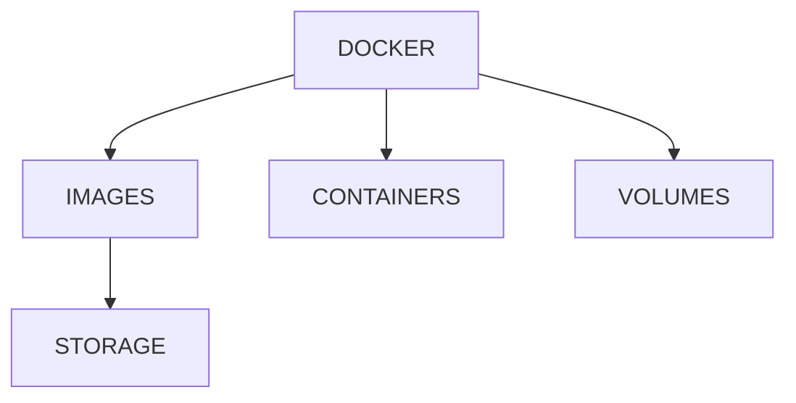

---

# Kubernetes Nodes

Nodes contain:

```text
Containers

Images

Volumes

Logs

Temporary Data
```

Storage must be planned.

---

# Kubernetes Storage Architecture

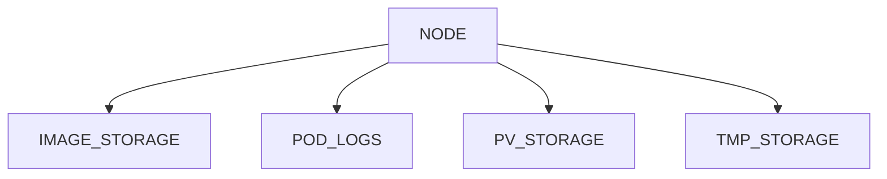

---

# Lab Task 3

Estimate:

```text
Docker Images

Docker Volumes

Logs

Temporary Data
```

storage growth on a production node.

---

# Backup Storage

Never store backups:

```text
On Same Disk
```

as production data.

---

# Wrong

```text
Database

Backup

Same Disk
```

Disk failure destroys both.

---

# Correct

```text
Database Disk

↓

Remote Backup
```

---

# Backup Architecture


---

# Cloud Production Layout

Typical VM:

```text
Root Volume

Data Volume

Backup Volume
```

---

# AWS Example

```text
EBS Root Volume

EBS Database Volume

S3 Backups
```

---

# Cloud Storage Architecture

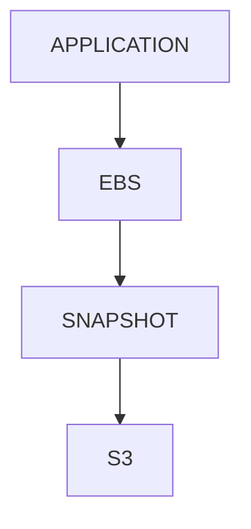

---

# Capacity Planning

One of the most ignored skills.

---

# Questions Engineers Ask

```text
How fast is storage growing?

When will disk become full?

How many logs are generated daily?

How much backup storage is needed?
```

---

# Capacity Planning Formula

```text
Current Usage
+
Growth Rate
+
Safety Margin
=
Required Capacity
```

---

# Example

```text
Current: 500 GB

Growth: 20 GB/month

12 Months:

740 GB

Add Safety Margin:

1 TB
```

---

# Capacity Planning Visualization


---

# Observability

Storage must be monitored.

---

# Critical Metrics

```text
Disk Usage

IOPS

Latency

Throughput

Inode Usage
```

---

# Monitoring Architecture

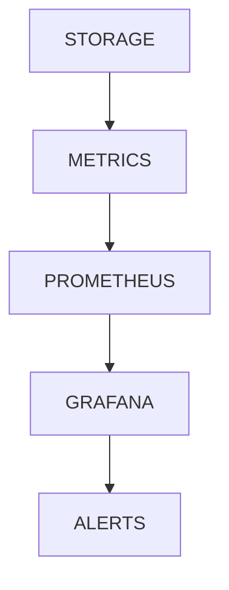

---

# Lab Task 4

Collect:

```bash
df -h

df -i

iostat -x 1
```

Document:

```text
Usage

Inodes

Performance
```

---

# Storage Isolation

Modern systems isolate workloads.

---

# Example

```text
Database Disk

Log Disk

Container Disk

Backup Disk
```

Each has:

```text
Independent Failure Domain
```

---

# Failure Domain Visualization

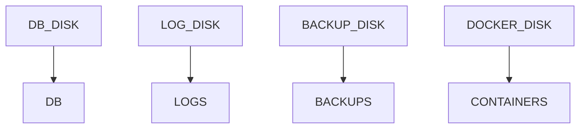

Failure affects only one area.

---

# Security Considerations

Different storage areas require different policies.

---

# Examples

Database:

```text
Encrypted

Restricted Access
```

Logs:

```text
Append Only
```

Backups:

```text
Offsite
```

---

# Security Architecture

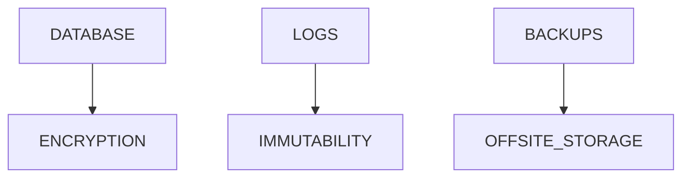

---

# Performance Considerations

Separate workloads reduce:

```text
Disk Contention

Queue Depth

Latency
```

---

# Performance Architecture

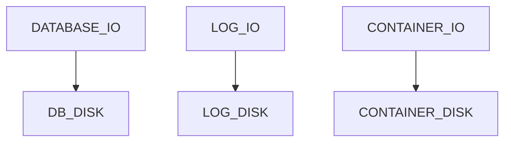

---

# Real Production Layout

Medium SaaS Company

```text
Disk 1 → OS

Disk 2 → PostgreSQL

Disk 3 → WAL

Disk 4 → Logs

Disk 5 → Docker

Remote → Backups
```

---

# Large Scale Layout

```text
Root Volume

Database SSD Array

Object Storage

Backup Cluster

Monitoring Cluster
```

---

# Production Storage Blueprint

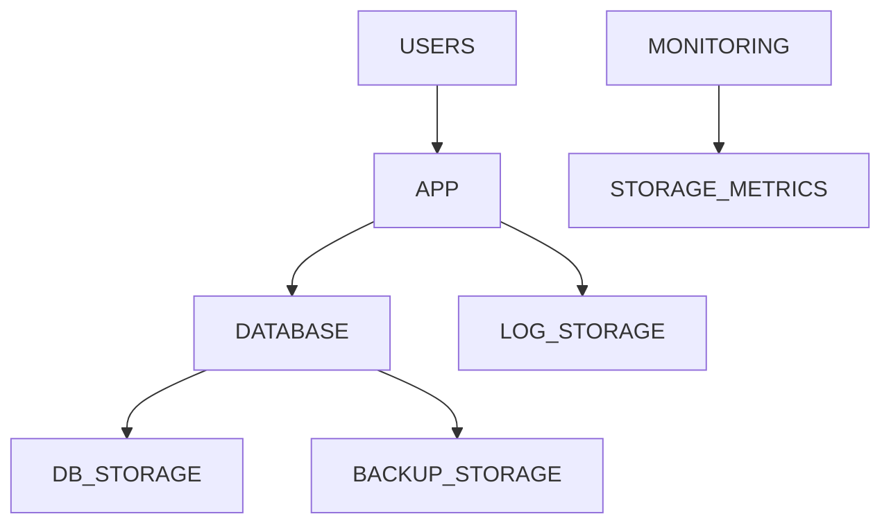

---

# Guided Challenge

Design storage for:

```text
Blog Platform

PostgreSQL

Docker

Nginx

Monitoring
```

Create mount points.

---

# Semi-Guided Challenge

Design storage for:

```text
1000 Daily Users

10 GB Database

500 GB Uploads
```

Estimate:

```text
Growth

Backup Size

Storage Layout
```

---

# Independent Challenge

Design storage architecture for:

```text
Multi-Service SaaS

PostgreSQL

Redis

Docker

Prometheus

Grafana

Object Storage
```

Include:

```text
Mount Points

Backup Strategy

Capacity Plan

Recovery Plan
```

---

# Linux Internals Deep Dive

Every storage decision eventually becomes:

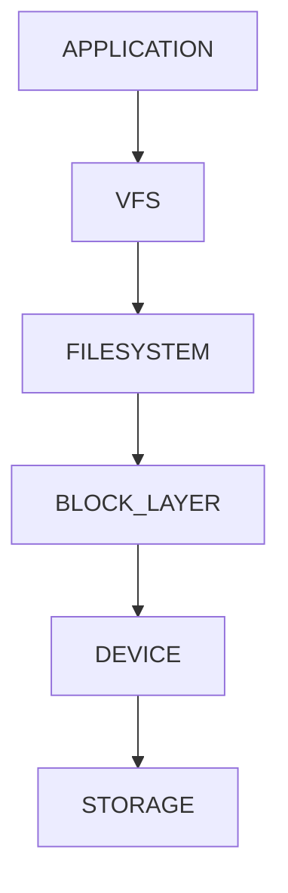

Production architecture is simply deciding:

```text
Which workloads use which storage.
```

---

# Common Mistakes

## Mistake 1

Everything on root filesystem.

---

## Mistake 2

No storage growth planning.

---

## Mistake 3

Backups on same disk.

---

## Mistake 4

Ignoring inode monitoring.

---

## Mistake 5

Sharing database and logs.

---

## Mistake 6

No storage observability.

---

# Troubleshooting

## What Uses Storage?

```bash
du -sh /*
```

---

## Which Filesystem Is Full?

```bash
df -h
```

---

## Inode Usage

```bash
df -i
```

---

## Mounted Volumes

```bash
findmnt
```

---

## Device Mapping

```bash
lsblk -f
```

---

# Engineering Mindset

Beginners think:

```text
Where should I save my files?
```

Engineers think:

```text
How will this storage fail?

How will it scale?

How will it recover?

How will it be monitored?

How will it affect performance?
```

That mindset leads toward:

```text
Storage Engineering

Platform Engineering

Cloud Engineering

SRE

System Architecture
```

---

# Interview Questions

### Why separate database storage?

To isolate performance and failures.

---

### Why separate logs?

To prevent disk exhaustion impacting critical workloads.

---

### Why should backups be offsite?

To survive disk and server failures.

---

### What metrics should storage monitoring collect?

```text
Capacity

IOPS

Latency

Throughput

Inodes
```

---

### Why is capacity planning important?

To prevent unexpected outages.

---

### Why separate Docker storage?

To isolate container growth and performance impact.

---

### What is a failure domain?

A boundary where failure remains isolated.

---

# Cheat Sheet

```bash
df -h

df -i

lsblk

lsblk -f

findmnt

du -sh /*

iostat -x 1

mount

cat /etc/fstab
```

---

# Lab Success Criteria

You can complete this lab when you can:

✅ Design production storage layouts

✅ Separate OS and application data

✅ Design database storage

✅ Design Docker storage

✅ Design Kubernetes node storage

✅ Design backup architecture

✅ Perform capacity planning

✅ Monitor storage health

✅ Understand storage failure domains

✅ Think like a platform engineer

✅ Think like a system architect

Congratulations.

You have completed the Filesystem Labs journey.

You now understand not only how Linux stores files, but how real production systems organize, protect, monitor, scale, and recover storage across databases, containers, cloud infrastructure, and distributed systems.

That is the difference between a Linux user and a Linux engineer.
