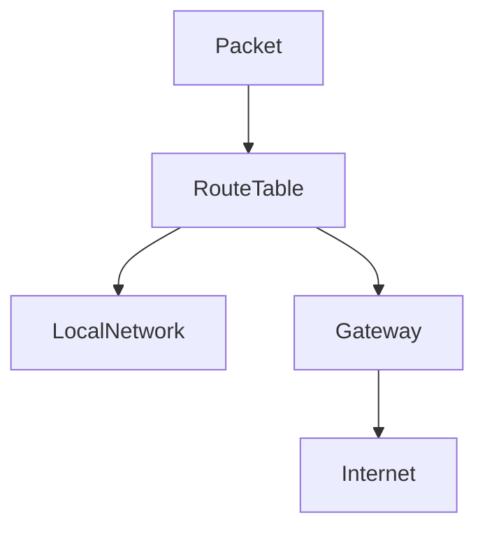
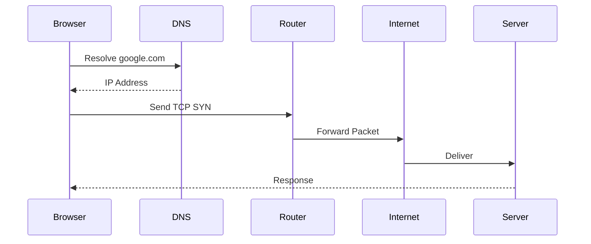
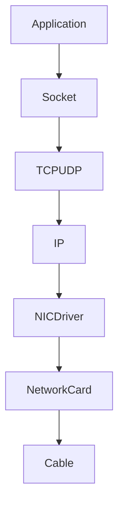

# lab-01-network-basics.md

````markdown
# Lab 01 — Network Basics

> Linux Fundamentals Mastery Repository
>
> Learning Level:
>
> Beginner → Intermediate → Production Engineer
>
> Goal:
>
> Build deep intuition about how computers communicate across networks before touching advanced networking, cloud networking, Kubernetes networking, service meshes, and distributed systems.

---

# Why This Lab Exists

Most Linux users memorize commands like:

```bash
ping
ip addr
netstat
ss
traceroute
````

But they often cannot answer:

* What actually happens when I open a website?
* How does my machine find another machine?
* Why does DNS failure break everything?
* Why does ping work but browser fails?
* Why do containers need virtual networking?
* Why are cloud networks so complicated?

This lab builds the mental foundation required for:

* Linux Networking
* Docker Networking
* Kubernetes Networking
* Cloud Networking
* Load Balancers
* Firewalls
* Service Discovery
* Distributed Systems

Without these fundamentals, advanced networking becomes memorization.

---

# Problem This Lab Solves

Imagine:

You type:

```bash
google.com
```

inside a browser.

Seconds later:

* DNS resolves the name
* TCP connection established
* Packets routed
* Switches forward frames
* Routers forward packets
* Firewalls inspect traffic
* Load balancers distribute requests
* Servers respond

Yet most engineers never visualize this process.

This lab helps you understand the entire journey.

---

# Mental Model

Think of networking like a postal system.

| Real World    | Networking    |
| ------------- | ------------- |
| Person        | Computer      |
| House Address | IP Address    |
| Person Name   | Domain Name   |
| Post Office   | Router        |
| Letter        | Packet        |
| Postal Route  | Routing       |
| City Map      | Routing Table |
| Phone Book    | DNS           |

When Alice sends a letter to Bob:

1. Address must exist
2. Postal system must know route
3. Letter travels through multiple locations
4. Eventually arrives

Networks work exactly the same way.

---

# Learning Objectives

After completing this lab you should understand:

* IP Address
* MAC Address
* DNS
* Gateway
* Router
* Switch
* Port
* TCP
* UDP
* Routing
* Packets
* Network Interfaces

---

# Lab Environment

Check Linux version:

```bash
uname -a
```

Check hostname:

```bash
hostname
```

Check current user:

```bash
whoami
```

---

# Step 1 — Discover Your Network Identity

View network interfaces:

```bash
ip addr
```

Example:

```text
2: eth0
    inet 192.168.1.100/24
```

---

## What Is Happening?

Your machine has:

* Interface
* IP Address
* Network Mask

Example:

```text
192.168.1.100/24
```

Means:

```text
Network = 192.168.1.0
Host = 100
```

---

# Visualizing Network Addressing

```text
Network: 192.168.1.0/24

+--------------------------------+
| 192.168.1.1    Router          |
| 192.168.1.10   Laptop          |
| 192.168.1.20   Phone           |
| 192.168.1.30   TV              |
| 192.168.1.100  Linux Machine   |
+--------------------------------+
```

All devices belong to same network.

---

# Step 2 — Understand Interfaces

List interfaces:

```bash
ip link
```

Example:

```text
lo
eth0
wlan0
docker0
```

---

# Interface Types

## lo

Loopback interface

```text
127.0.0.1
```

Machine talking to itself.

---

## eth0

Ethernet adapter.

---

## wlan0

Wireless adapter.

---

## docker0

Docker bridge network.

Important later for containers.

---

# Visual

```text
Application
      |
      V
+-------------+
| Interface   |
+-------------+
      |
      V
Network
```

---

# Step 3 — Find Default Gateway

Run:

```bash
ip route
```

Example:

```text
default via 192.168.1.1 dev eth0
```

---

# What Is Gateway?

Gateway is:

```text
Exit Door Of Your Network
```

Visual:

```text
Laptop
   |
   |
192.168.1.100
   |
   |
Router
192.168.1.1
   |
Internet
```

Without gateway:

```text
Can talk locally
Cannot reach internet
```

---

# Step 4 — Understand DNS

Try:

```bash
ping google.com
```

Then:

```bash
ping 8.8.8.8
```

---

# Why This Matters

If:

```bash
ping 8.8.8.8
```

works

but

```bash
ping google.com
```

fails

Then:

```text
Network OK
DNS Broken
```

Common production issue.

---

# View DNS Configuration

```bash
cat /etc/resolv.conf
```

Example:

```text
nameserver 8.8.8.8
```

---

# DNS Flow


---

# Step 5 — Inspect Routing

Run:

```bash
ip route
```

Example:

```text
192.168.1.0/24 dev eth0
default via 192.168.1.1
```

---

# Routing Mental Model

Router asks:

```text
Where should this packet go?
```

Uses routing table.

---

# Visual



---

# Step 6 — Understand MAC Addresses

Display:

```bash
ip link
```

Example:

```text
08:00:27:12:34:56
```

This is MAC address.

---

# IP vs MAC

| IP               | MAC              |
| ---------------- | ---------------- |
| Logical Address  | Physical Address |
| Changes          | Usually fixed    |
| Internet Routing | Local Delivery   |

---

# Delivery Process

```text
DNS -> IP

IP -> Route

Route -> MAC

MAC -> Device
```

---

# Visualization


---

# Step 7 — Observe Active Connections

Run:

```bash
ss -tulnp
```

---

# What Does This Show?

Open ports.

Example:

```text
22 SSH
80 HTTP
443 HTTPS
```

---

# Port Mental Model

Apartment Building:

```text
IP Address = Building

Port = Apartment
```

Example:

```text
192.168.1.10:22
192.168.1.10:80
192.168.1.10:443
```

Same building.

Different apartments.

---

# Step 8 — Trace Packet Journey

Install if needed:

```bash
sudo apt install traceroute
```

Run:

```bash
traceroute google.com
```

---

# What You See

```text
Router
ISP Router
Regional Router
Backbone Router
Destination
```

---

# Visualization


---

# Step 9 — Observe Network Statistics

Run:

```bash
ip -s link
```

---

# Understand Counters

Receive:

```text
RX
```

Transmit:

```text
TX
```

Errors:

```text
Dropped
Errors
Overruns
```

These become important in production troubleshooting.

---

# Data Flow Deep Dive

Opening:

```text
https://google.com
```

Produces:



---

# Linux Internals

Networking stack exists inside kernel.

```text
Application
      |
Socket API
      |
TCP/UDP
      |
IP Layer
      |
Driver
      |
NIC
      |
Wire
```

---

# Network Stack Visualization



---

# Modern World Connections

---

## Docker

Containers use:

```text
veth pairs
bridge networks
NAT
```

All based on Linux networking.

---

## Kubernetes

Every pod gets IP.

Networking relies on:

```text
Linux namespaces
Linux routing
Linux bridges
Linux virtual interfaces
```

---

## Cloud

AWS VPC

Azure VNet

GCP VPC

All abstract Linux networking concepts.

---

# Production Scenario 1

Cannot access website.

Check:

```bash
ping 8.8.8.8
```

Works.

Check:

```bash
ping google.com
```

Fails.

Diagnosis:

```text
DNS Problem
```

---

# Production Scenario 2

Internet unavailable.

Check:

```bash
ip route
```

No default gateway.

Diagnosis:

```text
Routing Problem
```

---

# Production Scenario 3

Server unreachable.

Check:

```bash
ss -tulnp
```

Port not listening.

Diagnosis:

```text
Application Problem
```

---

# Performance Considerations

Networking performance affected by:

* Latency
* Packet Loss
* Congestion
* DNS Speed
* Routing Efficiency
* NIC Speed

---

# Bottleneck Visualization

```text
CPU
 |
 V

Application
 |
 V

Network Stack
 |
 V

NIC
 |
 V

Switch
 |
 V

Router
 |
 V

Internet
```

Slowest component becomes bottleneck.

---

# Security Considerations

Never expose unnecessary ports.

Inspect:

```bash
ss -tulnp
```

Common dangerous mistakes:

```text
Open database ports
Open admin ports
Weak firewall rules
```

---

# Troubleshooting Workflow

When network fails:

Step 1

```bash
ip addr
```

Interface present?

---

Step 2

```bash
ip route
```

Gateway exists?

---

Step 3

```bash
ping gateway
```

Reach local router?

---

Step 4

```bash
ping 8.8.8.8
```

Internet reachable?

---

Step 5

```bash
ping google.com
```

DNS working?

---

Step 6

```bash
traceroute google.com
```

Where does path break?

---

# Common Mistakes

## Mistake 1

Thinking DNS is internet.

DNS is only name resolution.

---

## Mistake 2

Confusing MAC and IP.

Different layers.

---

## Mistake 3

Ignoring routing table.

Most connectivity issues involve routing.

---

## Mistake 4

Blaming firewall first.

Verify fundamentals first.

---

# Engineering Mindset

Good engineers think:

```text
What layer is failing?
```

Not:

```text
Network broken.
```

Always isolate:

1. Interface
2. IP
3. Route
4. DNS
5. Port
6. Application

Layer-by-layer debugging scales from laptops to global systems.

---

# Interview Questions

### Beginner

What is IP address?

### Beginner

Difference between IP and MAC?

### Beginner

What is DNS?

### Intermediate

What is default gateway?

### Intermediate

What happens when browser opens google.com?

### Intermediate

How does routing work?

### Advanced

Explain Linux networking stack.

### Advanced

How does Kubernetes networking depend on Linux networking?

### Advanced

Why can ping succeed while browser fails?

### Advanced

Difference between TCP failure and DNS failure?

---

# Cheat Sheet

## Interfaces

```bash
ip addr
ip link
```

## Routing

```bash
ip route
```

## DNS

```bash
cat /etc/resolv.conf
```

## Connectivity

```bash
ping 8.8.8.8
ping google.com
```

## Open Ports

```bash
ss -tulnp
```

## Trace Path

```bash
traceroute google.com
```

## Statistics

```bash
ip -s link
```
