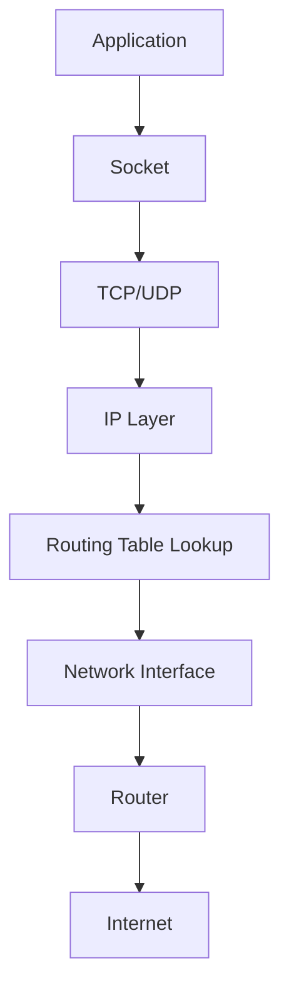
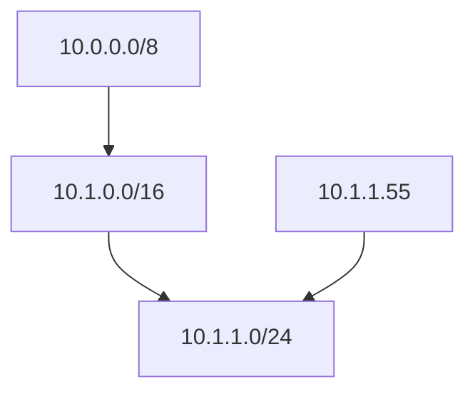
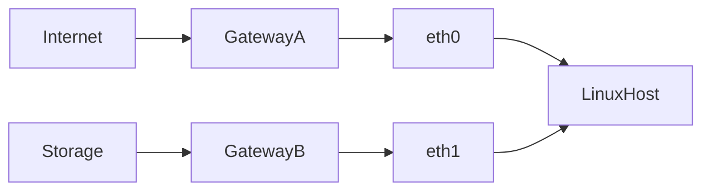

# Lab 02 — Routing Analysis

> Linux Fundamentals Mastery
>
> Track: Networking → Routing → Production Troubleshooting
>
> Objective:
>
> Learn how Linux decides where packets go, how routing tables work internally, how modern cloud/container systems depend on routing, and how engineers diagnose routing failures in production.

---

# Why This Lab Exists

Most engineers know how to run:

```bash
ip route
```

Very few understand:

* Why a packet chooses one interface instead of another
* How Linux selects routes
* Why traffic sometimes leaves through the wrong gateway
* Why containers lose connectivity
* Why VPNs break networking
* Why Kubernetes nodes become unreachable
* Why cloud instances cannot communicate despite correct security rules

The answer is almost always:

> Routing.

Routing is one of the most important concepts in all of computing infrastructure.

Every distributed system, cloud platform, container runtime, service mesh, and Kubernetes cluster ultimately relies on routing decisions.

---

# The Fundamental Question

Every packet causes Linux to answer a single question:

```text
Where should this packet go next?
```

Everything in routing exists to answer that question.

---

# Mental Model

Imagine you are shipping a package.

You know the destination:

```text
1600 Amphitheatre Parkway
Mountain View, California
```

But you don't know:

* Which road to take
* Which highway to use
* Which city to cross

Your GPS decides.

Linux routing table is the GPS of networking.

---

# Routing in One Sentence

Routing is the process of determining the next hop for a packet.

Not the final destination.

Only the next step.

---

# Packet Journey

Suppose:

```text
Your Machine:
192.168.1.100

Destination:
8.8.8.8
```

Linux checks:

```text
Can I reach it directly?
```

If no:

```text
Send packet to gateway.
```

Gateway decides next hop.

---

# Routing Architecture



Notice:

Applications never perform routing.

Kernel does.

---

# Observe Current Routes

Display routing table:

```bash
ip route
```

Example:

```text
default via 192.168.1.1 dev eth0

192.168.1.0/24 dev eth0 proto kernel
```

---

# Understanding This Output

Route 1:

```text
192.168.1.0/24 dev eth0
```

Meaning:

```text
All local traffic
goes directly through eth0
```

Route 2:

```text
default via 192.168.1.1
```

Meaning:

```text
Everything else
goes to router
```

---

# Visualizing Route Selection

```text
Destination?

├─ Local Network?
│      │
│      └─ Direct Delivery
│
└─ Internet?
       │
       └─ Gateway
```

---

# The Routing Decision Process

Linux performs:

```text
1. Read destination IP
2. Search routing table
3. Find best match
4. Select interface
5. Send packet
```

This happens millions of times per second.

---

# Kernel Route Lookup

Inspect route for a specific destination:

```bash
ip route get 8.8.8.8
```

Example:

```text
8.8.8.8 via 192.168.1.1 dev eth0
```

This command reveals:

```text
What route Linux would actually use
```

One of the most valuable networking commands.

---

# Longest Prefix Match

The Most Important Routing Rule

Linux always chooses:

```text
Most Specific Route
```

Not first route.

Not shortest route.

Most specific route.

---

Example:

```text
10.0.0.0/8

10.1.0.0/16

10.1.1.0/24
```

Destination:

```text
10.1.1.55
```

Linux chooses:

```text
10.1.1.0/24
```

Because it is most specific.

---

# Visualization



---

# Why Longest Prefix Match Exists

Without it:

```text
Large networks become impossible.
```

ISPs

Cloud Providers

Data Centers

Kubernetes Clusters

all depend on this behavior.

---

# Route Metrics

Sometimes multiple routes exist.

Linux needs a tie breaker.

Example:

```text
default via 192.168.1.1 metric 100

default via 10.0.0.1 metric 200
```

Linux chooses:

```text
metric 100
```

Lower metric wins.

---

# Multi-Homed Servers

Production servers often have:

```text
eth0
eth1
eth2
```

Connected to different networks.

Example:

```text
Internet Traffic

Management Traffic

Storage Traffic
```

Each may have separate routes.

---

# Investigating Interfaces

```bash
ip addr
```

Questions:

```text
Which interfaces exist?

Which IPs are assigned?

Which route uses which interface?
```

---

# Routing Table Visualization



---

# Route Cache and Performance

Imagine:

```text
10 million packets
```

Linux cannot recompute everything repeatedly.

Modern kernels optimize route lookups aggressively.

Why?

Routing is on the critical path of every packet.

---

# Production Scenario

## Incident

Application timeout.

Symptoms:

```text
DNS Works

Ping Works

Application Fails
```

Investigation:

```bash
ip route get DESTINATION_IP
```

Result:

```text
Traffic leaving wrong interface
```

Root Cause:

```text
Incorrect route metric
```

---

# VPN Failure Analysis

Common scenario:

Connect VPN.

Suddenly:

```text
Internal services work

Internet fails
```

Why?

VPN adds:

```text
New default route
```

Routing table changes.

Traffic follows new path.

---

# Container Networking Connection

Docker creates:

```text
docker0
```

Linux bridge.

Check:

```bash
ip route
```

Typical output:

```text
172.17.0.0/16 dev docker0
```

Meaning:

```text
Container traffic
uses docker bridge route
```

---

# Kubernetes Connection

Every pod receives an IP.

Linux routing tables determine:

```text
Pod-to-Pod traffic

Pod-to-Service traffic

Node-to-Node traffic
```

Without routing:

```text
Kubernetes does not work.
```

---

# Cloud Networking Connection

AWS VPC

Azure VNet

GCP VPC

All expose routing tables.

What are they really?

Distributed Linux routing concepts at cloud scale.

---

# Route Failure Investigation Workflow

Step 1

Check interfaces:

```bash
ip addr
```

---

Step 2

Check routes:

```bash
ip route
```

---

Step 3

Check kernel decision:

```bash
ip route get DESTINATION_IP
```

---

Step 4

Verify gateway:

```bash
ping GATEWAY_IP
```

---

Step 5

Trace path:

```bash
traceroute DESTINATION
```

---

Step 6

Observe packets:

```bash
tcpdump -i eth0
```

---

# What The Kernel Is Thinking

Packet arrives.

Kernel asks:

```text
Do I own this destination?
```

If no:

```text
Which route matches?
```

If multiple:

```text
Which prefix is longest?
```

If tie:

```text
Which metric is lower?
```

Then:

```text
Forward packet.
```

This entire process occurs in microseconds.

---

# Common Mistakes

## Mistake 1

Assuming gateway is broken.

Actually:

```text
Wrong route selected.
```

---

## Mistake 2

Ignoring metrics.

Metrics often determine failures.

---

## Mistake 3

Not using:

```bash
ip route get
```

Engineers frequently inspect tables but never inspect actual route decisions.

---

## Mistake 4

Thinking cloud networking is different.

Cloud networking is routing plus abstraction.

---

# Engineering Mindset

Junior Engineer:

```text
Network is broken.
```

Senior Engineer:

```text
Which routing decision is incorrect?
```

Infrastructure Engineers think in:

```text
Paths

Interfaces

Gateways

Next Hops

Prefixes
```

not applications.

---

# Interview Questions

### Beginner

What is a routing table?

### Beginner

What is a default route?

### Intermediate

How does Linux choose a route?

### Intermediate

What is a route metric?

### Intermediate

Explain longest prefix match.

### Advanced

Why is longest prefix match required?

### Advanced

How does Kubernetes depend on Linux routing?

### Advanced

How would you debug asymmetric routing?

### Advanced

How do cloud VPC route tables relate to Linux routing tables?

---

# Cheat Sheet

View routes:

```bash
ip route
```

View route decision:

```bash
ip route get 8.8.8.8
```

View interfaces:

```bash
ip addr
```

View statistics:

```bash
ip -s link
```

Trace packet path:

```bash
traceroute 8.8.8.8
```

Capture packets:

```bash
tcpdump -i eth0
```

---

# Lab Success Criteria

You should now be able to:

* Explain how Linux chooses routes
* Explain longest prefix match
* Interpret routing tables
* Understand default gateways
* Diagnose wrong-route failures
* Investigate VPN routing issues
* Understand Docker routing
* Understand Kubernetes routing
* Relate cloud networking to Linux routing
* Debug production routing incidents
