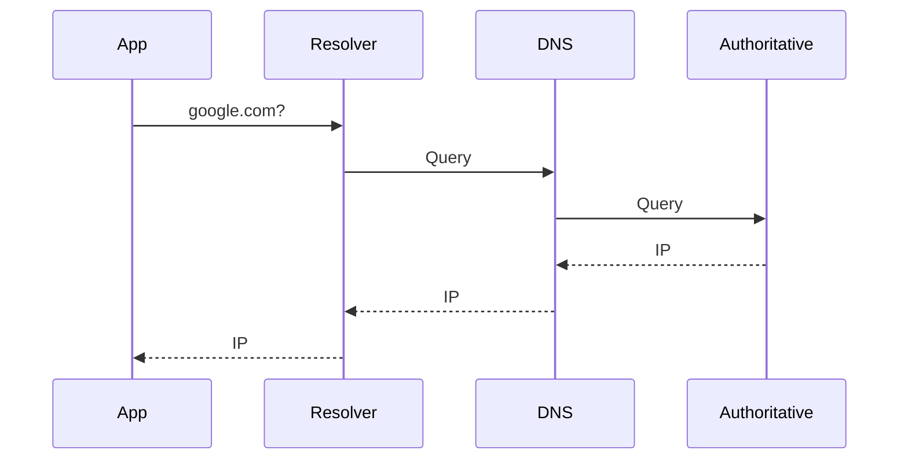
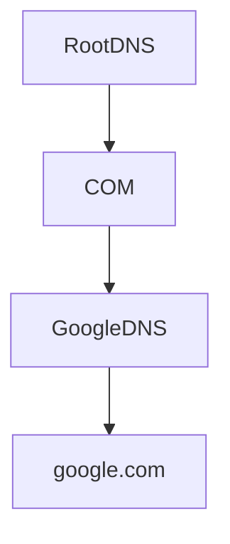

# Lab 03 — DNS Debugging

> Linux Fundamentals Mastery
>
> Track: Networking → DNS → Production Troubleshooting
>
> Objective:
>
> Learn how DNS actually works, how Linux performs name resolution, how to debug DNS failures in production, and why DNS is one of the most critical dependencies in modern infrastructure.

---

# Why This Lab Exists

Most engineers think DNS is:

```text
DNS = Domain Name → IP Address
```

This is technically true.

But it is dangerously incomplete.

In reality DNS is:

* Internet phonebook
* Service discovery system
* Cloud infrastructure dependency
* Kubernetes dependency
* Load balancing mechanism
* Failover mechanism
* Distributed database

Modern systems break when DNS breaks.

Not because servers are down.

Because systems can no longer find each other.

---

# The Most Expensive DNS Mistake

When an application fails:

Most engineers say:

```text
Application Problem
```

Experienced engineers ask:

```text
Can the application still resolve dependencies?
```

Because:

* Database access depends on DNS
* API calls depend on DNS
* Cloud services depend on DNS
* Kubernetes services depend on DNS

Many "application outages" are actually DNS outages.

---

# Mental Model

Imagine every service in the world had only numbers:

```text
142.250.183.14
104.18.32.45
172.217.160.78
```

Humans cannot operate like that.

DNS provides names:

```text
google.com
github.com
api.company.internal
database.production.local
```

DNS allows humans and software to locate services.

Think of DNS as:

```text
Internet GPS + Phonebook
```

---

# The Fundamental Question

Every DNS lookup asks:

```text
Where is this service located?
```

DNS exists to answer that question.

---

# DNS Resolution Architecture


---

# Real DNS Journey

Suppose:

```bash
curl https://github.com
```

Before TCP.

Before TLS.

Before HTTP.

DNS happens first.

Without DNS:

```text
No IP

No Connection

No Application
```

---

# Observe DNS Configuration

Linux resolver configuration:

```bash
cat /etc/resolv.conf
```

Example:

```text
nameserver 8.8.8.8
nameserver 1.1.1.1
```

This file tells Linux:

```text
Where DNS queries should be sent.
```

---

# Modern Linux Reality

Many engineers think:

```text
/etc/resolv.conf
```

is always the source of truth.

Not always.

Modern systems may use:

* systemd-resolved
* NetworkManager
* DHCP-generated configuration
* VPN-generated configuration
* Cloud-init configuration

Always verify actual resolver behavior.

---

# Investigate Active Resolver

```bash
resolvectl status
```

Important on modern distributions.

Shows:

* DNS servers
* Search domains
* Per-interface DNS configuration

---

# Understanding DNS Failure Layers

DNS failures happen at multiple layers.

```text
Application

↓

Resolver

↓

Local Cache

↓

DNS Server

↓

Recursive Resolver

↓

Authoritative Server

↓

DNS Record
```

The failure could exist anywhere.

---

# DNS Record Types Engineers Must Know

| Record | Purpose           |
| ------ | ----------------- |
| A      | IPv4 Address      |
| AAAA   | IPv6 Address      |
| CNAME  | Alias             |
| MX     | Mail Server       |
| TXT    | Metadata          |
| NS     | Name Server       |
| PTR    | Reverse Lookup    |
| SRV    | Service Discovery |

---

# Production Importance

Most engineers only know:

```text
A Record
```

Production engineers know:

```text
SRV
TXT
CNAME
MX
PTR
```

because distributed systems depend on them.

---

# Investigating DNS Queries

Install tools:

```bash
sudo apt install dnsutils
```

---

# Using dig

Query DNS:

```bash
dig google.com
```

Output contains:

```text
QUESTION SECTION
ANSWER SECTION
AUTHORITY SECTION
ADDITIONAL SECTION
```

Understanding these sections is critical.

---

# DNS Query Flow



---

# Most Valuable Debugging Command

```bash
dig google.com
```

But even better:

```bash
dig google.com +trace
```

This shows the entire DNS resolution path.

---

# What +trace Reveals

```text
Root Server

↓

TLD Server

↓

Authoritative Server

↓

Answer
```

You can literally watch DNS working.

---

# Visualizing Global DNS



---

# Root Servers

Most engineers never learn this.

DNS begins at root servers.

Represented as:

```text
.
```

Example:

```text
.
└── com
     └── google.com
```

Everything starts from root.

---

# Understanding DNS Caching

Without caching:

```text
Every request

↓

Root DNS

↓

TLD DNS

↓

Authoritative DNS
```

Internet would collapse.

Caching makes DNS scalable.

---

# Cache Visualization


---

# Why DNS Can Be Fast

First query:

```text
50ms
```

Second query:

```text
1ms
```

Reason:

```text
Cache Hit
```

---

# TTL (Time To Live)

Observe:

```bash
dig google.com
```

Look for:

```text
TTL
```

TTL determines:

```text
How long DNS results remain cached.
```

---

# Production Tradeoff

Large TTL:

```text
Better performance

Slower failover
```

Small TTL:

```text
Faster failover

More DNS traffic
```

Engineering is always tradeoffs.

---

# DNS and Load Balancing

Many people think load balancing means:

```text
NGINX
HAProxy
```

Not always.

DNS can perform load balancing.

Example:

```text
api.company.com

10.1.1.1
10.1.1.2
10.1.1.3
```

DNS rotates answers.

---

# Investigate Name Resolution

Use:

```bash
getent hosts google.com
```

Why important?

Because:

```text
dig tests DNS

getent tests Linux resolution
```

Huge difference.

---

# Linux Name Resolution Internals

Linux follows:

```bash
cat /etc/nsswitch.conf
```

Example:

```text
hosts: files dns
```

Meaning:

1. Check /etc/hosts
2. Then DNS

---

# Why This Matters

You may see:

```bash
dig google.com
```

working

while

```bash
curl google.com
```

fails.

Because Linux resolution path differs from direct DNS queries.

---

# Investigating /etc/hosts

Check:

```bash
cat /etc/hosts
```

Example:

```text
127.0.0.1 localhost
10.0.0.5 database
```

This bypasses DNS entirely.

---

# Production Scenario

Database unreachable.

Application error:

```text
Database Connection Failed
```

Investigation:

```bash
getent hosts database.internal
```

Result:

```text
No resolution
```

Root cause:

```text
Broken DNS entry
```

Not database failure.

---

# Kubernetes Connection

Kubernetes depends heavily on DNS.

Example:

```text
frontend-service

backend-service

database-service
```

Pods communicate through names.

Not IPs.

---

# Kubernetes DNS Flow


If CoreDNS fails:

```text
Cluster Appears Broken
```

Even when pods are healthy.

---

# Cloud Infrastructure Connection

Cloud systems rely on DNS for:

* Load balancers
* Managed databases
* Service endpoints
* Internal services

Example:

```text
rds.amazonaws.com
```

You never connect directly to IPs.

---

# DNS Failure Investigation Workflow

## Step 1

Check connectivity.

```bash
ping 8.8.8.8
```

Works?

---

## Step 2

Check DNS resolution.

```bash
dig google.com
```

---

## Step 3

Check Linux resolver.

```bash
getent hosts google.com
```

---

## Step 4

Check resolver configuration.

```bash
cat /etc/resolv.conf
```

---

## Step 5

Check active resolver.

```bash
resolvectl status
```

---

## Step 6

Query specific DNS server.

```bash
dig @8.8.8.8 google.com
```

---

## Step 7

Trace full resolution path.

```bash
dig google.com +trace
```

---

# Advanced Investigation

Measure DNS latency:

```bash
dig google.com
```

Observe:

```text
Query time: 5 ms
```

Large values indicate:

* Slow resolver
* Network latency
* DNS server overload

---

# DNS Observability

Capture DNS traffic:

```bash
sudo tcpdump -i any port 53
```

Watch queries in real time.

This is often how production incidents are diagnosed.

---

# What The Kernel Is Thinking

Application asks:

```text
Connect to api.company.com
```

Kernel responds:

```text
I need an IP first.
```

Resolver begins lookup.

Only after DNS succeeds can networking continue.

---

# Common Production Incidents

## Incident 1

Ping IP works.

Hostname fails.

Cause:

```text
DNS Failure
```

---

## Incident 2

Some users succeed.

Others fail.

Cause:

```text
DNS Cache Inconsistency
```

---

## Incident 3

Application randomly fails.

Cause:

```text
Intermittent DNS Timeout
```

---

## Incident 4

Kubernetes service unreachable.

Cause:

```text
CoreDNS Failure
```

---

# Common Mistakes

## Mistake 1

Testing only with dig.

Applications use full resolver stack.

Use:

```bash
getent hosts
```

too.

---

## Mistake 2

Ignoring /etc/hosts.

Can override DNS completely.

---

## Mistake 3

Assuming DNS is simple.

DNS is a globally distributed database.

---

## Mistake 4

Ignoring TTL.

Many outages are cache-related.

---

# Engineering Mindset

Junior Engineer:

```text
Website is down.
```

Senior Engineer:

```text
Can we still resolve the service?
```

Infrastructure Engineer:

```text
Which layer of name resolution failed?
```

That question often reduces hours of troubleshooting into minutes.

---

# Interview Questions

### Beginner

What is DNS?

### Beginner

What is an A record?

### Intermediate

Explain DNS resolution process.

### Intermediate

What is TTL?

### Intermediate

Difference between dig and getent?

### Advanced

How does Linux perform name resolution?

### Advanced

Explain DNS caching.

### Advanced

Why can dig succeed while applications fail?

### Advanced

How does Kubernetes depend on DNS?

### Advanced

How would you debug a production DNS outage?

---

# Cheat Sheet

View resolver:

```bash
cat /etc/resolv.conf
```

Check active resolver:

```bash
resolvectl status
```

DNS query:

```bash
dig google.com
```

Full trace:

```bash
dig google.com +trace
```

Specific server:

```bash
dig @8.8.8.8 google.com
```

Linux resolution:

```bash
getent hosts google.com
```

Hosts file:

```bash
cat /etc/hosts
```

Packet capture:

```bash
tcpdump -i any port 53
```

---

# Lab Success Criteria

You should now be able to:

* Explain DNS from first principles
* Understand recursive resolution
* Understand root → TLD → authoritative flow
* Analyze DNS records
* Debug Linux name resolution
* Diagnose DNS outages
* Understand DNS caching and TTL
* Troubleshoot Kubernetes DNS failures
* Investigate cloud DNS issues
* Think like an infrastructure engineer during DNS incidents
