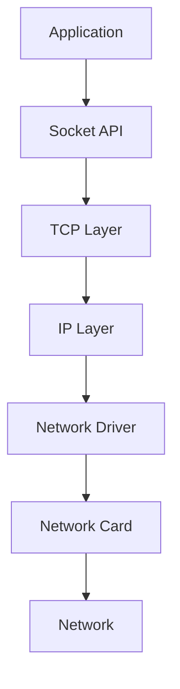
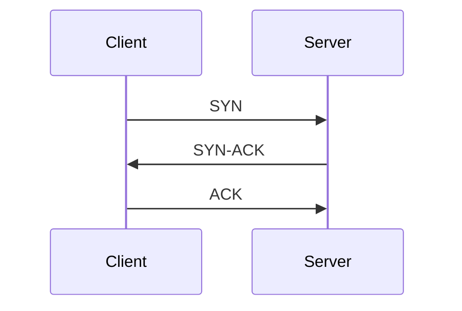
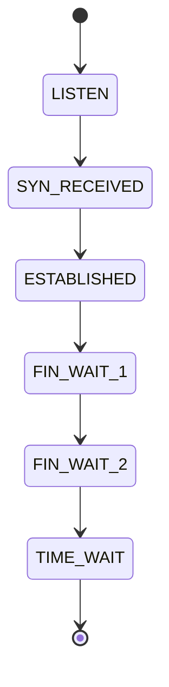
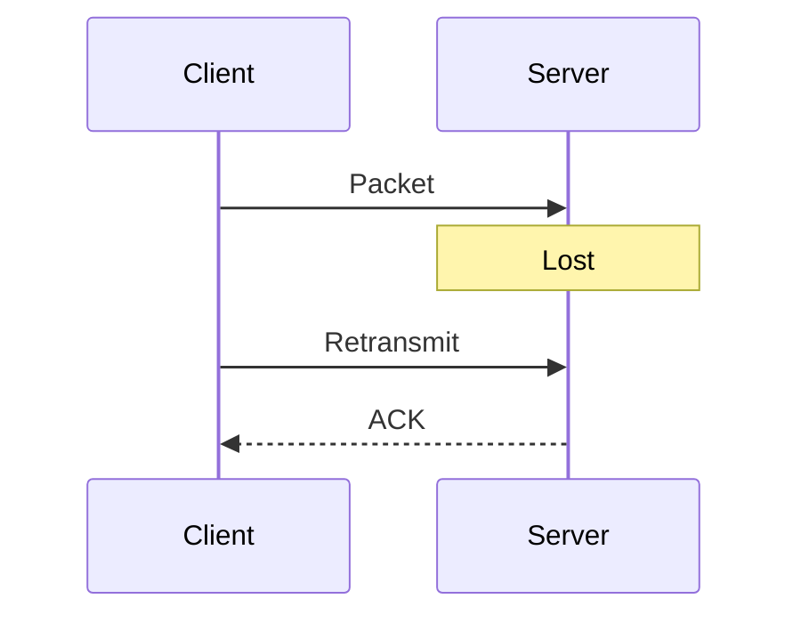

# Lab 04 — TCP Investigation

> Linux Fundamentals Mastery
>
> Track: Networking → TCP → Production Troubleshooting
>
> Objective:
>
> Understand how TCP actually works inside Linux, why TCP exists, how reliability is achieved over unreliable networks, how modern applications depend on TCP, and how to investigate TCP failures in production environments.

---

# Why This Lab Exists

Most engineers use:

```bash
curl
ssh
git
docker pull
kubectl
apt update
```

without realizing that almost everything they do relies on TCP.

When applications become slow, connections fail, requests timeout, databases disconnect, or Kubernetes services become unstable, TCP is often involved.

Yet many engineers only know:

```text
TCP = Reliable Protocol
```

That explanation is far too shallow.

This lab teaches how TCP actually behaves inside Linux and how production engineers investigate TCP problems.

---

# The Fundamental Problem TCP Solves

Imagine sending a 100-page document through a courier service.

Problems immediately appear:

* Pages can be lost
* Pages can arrive out of order
* Pages can be duplicated
* Pages can be delayed
* Pages can be corrupted

Networks have the same problems.

IP provides delivery.

TCP provides reliability.

---

# Mental Model

Think of IP as:

```text
Postal Service
```

Think of TCP as:

```text
Certified Mail Service
```

TCP guarantees:

* Delivery confirmation
* Ordering
* Retransmission
* Flow control
* Congestion control

Without TCP:

```text
Web browsing becomes unreliable.

Database connections become unreliable.

Distributed systems become unreliable.
```

---

# Where TCP Lives

TCP is part of the Linux kernel.

Applications never directly manage:

* Packet retransmission
* Packet ordering
* Congestion control

The kernel does.

---

# Linux Network Stack



---

# Understanding A TCP Connection

Suppose:

```bash
curl https://github.com
```

Before data transfer:

```text
TCP connection must exist.
```

TCP does not start with data.

TCP starts with trust.

---

# TCP Three-Way Handshake

The most famous TCP operation.



Connection established.

---

# Why Three Steps?

Because both sides must agree on:

* Communication
* Sequence numbers
* State synchronization

Without handshake:

```text
One side might believe connection exists.

Other side might disagree.
```

Chaos follows.

---

# Investigating Live Connections

Display TCP sockets:

```bash
ss -t
```

Display listening sockets:

```bash
ss -ltn
```

Display all details:

```bash
ss -tanp
```

---

# What ss Actually Shows

Example:

```text
ESTAB
LISTEN
TIME_WAIT
SYN_SENT
CLOSE_WAIT
```

These are TCP states.

A huge amount of troubleshooting happens here.

---

# TCP State Machine



Every TCP connection moves through states.

---

# ESTABLISHED

Healthy connection.

Example:

```bash
ssh server
```

Produces:

```text
ESTABLISHED
```

Traffic flows normally.

---

# SYN_SENT

Client is waiting.

Example:

```text
Client → SYN
```

No response yet.

Possible causes:

* Firewall
* Routing issue
* Server down

---

# SYN_RECV

Server received request.

Waiting for client confirmation.

Large numbers of SYN_RECV often indicate:

```text
SYN Flood Attack
```

or

```text
Network Connectivity Problems
```

---

# CLOSE_WAIT

One side closed connection.

Application has not released socket.

Very common production issue.

Large numbers of:

```text
CLOSE_WAIT
```

usually indicate:

```text
Application Bug
```

not network problems.

---

# TIME_WAIT

Most misunderstood TCP state.

Engineers often panic when they see:

```text
Thousands of TIME_WAIT sockets
```

Usually normal.

TCP intentionally keeps connections alive briefly to prevent delayed packet confusion.

---

# Visualizing Connection Lifecycle


---

# Packet Investigation

Capture TCP traffic:

```bash
sudo tcpdump -i any tcp
```

Observe:

```text
SYN
ACK
FIN
RST
```

These flags reveal connection behavior.

---

# TCP Flags

| Flag | Meaning          |
| ---- | ---------------- |
| SYN  | Start Connection |
| ACK  | Acknowledge      |
| FIN  | Graceful Close   |
| RST  | Force Close      |
| PSH  | Push Data        |
| URG  | Urgent Data      |

---

# Understanding Sequence Numbers

TCP numbers every byte.

Example:

```text
Packet 1 -> Byte 1-1000

Packet 2 -> Byte 1001-2000

Packet 3 -> Byte 2001-3000
```

This enables:

* Ordering
* Retransmission
* Reliability

---

# Why Sequence Numbers Matter

Suppose:

```text
Packet 3 arrives before Packet 2
```

TCP can reorder data correctly.

Applications never notice.

---

# Packet Ordering Visualization

```text
Sent:

1 → 2 → 3

Arrived:

1 → 3 → 2

Delivered:

1 → 2 → 3
```

TCP hides network disorder.

---

# Retransmissions

Suppose packet is lost.

TCP notices missing acknowledgment.

Kernel automatically retransmits.

Applications never know.

---

# Visualization



---

# Flow Control

Fast sender.

Slow receiver.

Problem:

```text
Receiver Buffer Overflow
```

TCP prevents this using:

```text
Receive Window
```

Receiver tells sender:

```text
This is how much data I can handle.
```

---

# Congestion Control

Different problem.

Network itself becomes overloaded.

TCP slows down automatically.

This is one of the greatest engineering achievements in computing.

Without congestion control:

```text
Internet collapses under load.
```

---

# Congestion Control Visualization


---

# Linux TCP Internals

View TCP settings:

```bash
sysctl -a | grep tcp
```

Important parameters:

```text
net.ipv4.tcp_fin_timeout

net.ipv4.tcp_keepalive_time

net.ipv4.tcp_syn_retries

net.ipv4.tcp_tw_reuse
```

These control TCP behavior.

---

# TCP Buffers

Check memory usage:

```bash
ss -m
```

Linux allocates:

```text
Receive Buffers

Send Buffers
```

for every connection.

At scale:

```text
Millions of connections

↓

Huge memory consumption
```

---

# Production Scenario

## Incident

API latency suddenly increases.

Investigation:

```bash
ss -s
```

Output:

```text
Large number of retransmissions
```

Root Cause:

```text
Network packet loss
```

---

# Production Scenario

## Incident

Server cannot accept connections.

Check:

```bash
ss -ltn
```

Service listening?

If not:

```text
Application Problem
```

Not networking.

---

# Production Scenario

## Incident

Clients timeout.

Observe:

```text
Many SYN_SENT sockets
```

Root Cause:

```text
Firewall dropping packets
```

or

```text
Routing issue
```

---

# Production Scenario

## Incident

Application memory leak.

Observe:

```text
Thousands of CLOSE_WAIT
```

Root Cause:

```text
Application never closes sockets.
```

---

# Kubernetes Connection

Every:

```text
Pod

Service

Ingress

API Call
```

depends heavily on TCP.

Common Kubernetes issues:

* Retransmissions
* Connection exhaustion
* SYN floods
* TIME_WAIT buildup

all originate from TCP behavior.

---

# Cloud Connection

Cloud load balancers:

* AWS ELB
* AWS ALB
* Azure Load Balancer
* GCP Load Balancer

all maintain huge TCP state tables.

Understanding TCP helps understand cloud networking.

---

# Database Connection Example

Application:

```text
Connect PostgreSQL
```

TCP establishes connection.

Then:

```text
TLS

↓

Authentication

↓

Queries
```

If TCP fails:

Database never becomes reachable.

---

# Observability

View socket statistics:

```bash
ss -s
```

View connection details:

```bash
ss -tanp
```

View packet captures:

```bash
tcpdump -i any tcp
```

View kernel metrics:

```bash
netstat -s
```

---

# TCP Failure Investigation Workflow

Step 1

Can DNS resolve?

```bash
dig hostname
```

---

Step 2

Can route reach destination?

```bash
ip route get DESTINATION
```

---

Step 3

Can connection establish?

```bash
nc -vz HOST PORT
```

---

Step 4

Inspect socket state:

```bash
ss -tan
```

---

Step 5

Capture packets:

```bash
tcpdump -i any tcp
```

---

Step 6

Analyze retransmissions.

---

Step 7

Analyze latency.

---

# What The Kernel Is Thinking

Application requests:

```text
Connect To Server
```

Kernel asks:

```text
Can route reach destination?
```

Then:

```text
Can TCP handshake complete?
```

Then:

```text
Can data flow reliably?
```

Every TCP connection is a continuous negotiation between:

* Sender
* Receiver
* Network

---

# Common Mistakes

## Mistake 1

Assuming ping proves application works.

Ping uses ICMP.

Applications usually use TCP.

---

## Mistake 2

Ignoring TCP states.

States reveal failures.

---

## Mistake 3

Treating CLOSE_WAIT as network issue.

Usually application issue.

---

## Mistake 4

Treating TIME_WAIT as error.

Usually normal behavior.

---

## Mistake 5

Ignoring retransmissions.

Retransmissions often explain latency.

---

# Engineering Mindset

Junior Engineer:

```text
Server Is Slow
```

Senior Engineer:

```text
Which TCP behavior is causing the slowdown?
```

Infrastructure Engineer:

```text
Are we seeing:

Packet Loss?

Congestion?

Retransmissions?

Connection Exhaustion?

Socket Leaks?
```

Those questions lead to root causes.

---

# Interview Questions

### Beginner

Why does TCP exist?

### Beginner

What is a TCP handshake?

### Intermediate

Explain TCP states.

### Intermediate

What is TIME_WAIT?

### Intermediate

What is CLOSE_WAIT?

### Advanced

How does TCP achieve reliability?

### Advanced

Explain sequence numbers.

### Advanced

What causes retransmissions?

### Advanced

How does congestion control work?

### Advanced

How would you debug intermittent API latency caused by TCP?

---

# Cheat Sheet

View connections:

```bash
ss -tan
```

Listening ports:

```bash
ss -ltn
```

Socket summary:

```bash
ss -s
```

Capture packets:

```bash
tcpdump -i any tcp
```

Connection test:

```bash
nc -vz HOST PORT
```

TCP kernel parameters:

```bash
sysctl -a | grep tcp
```

Network statistics:

```bash
netstat -s
```

---

# Lab Success Criteria

You should now be able to:

* Explain why TCP exists
* Understand the three-way handshake
* Interpret TCP states
* Understand sequence numbers
* Explain retransmissions
* Explain flow control
* Explain congestion control
* Analyze TCP failures
* Investigate socket issues
* Debug production networking incidents
* Understand TCP's role in cloud, databases, Docker, and Kubernetes

TCP is the foundation beneath almost every modern distributed system. Mastering it dramatically improves your ability to debug production infrastructure.
