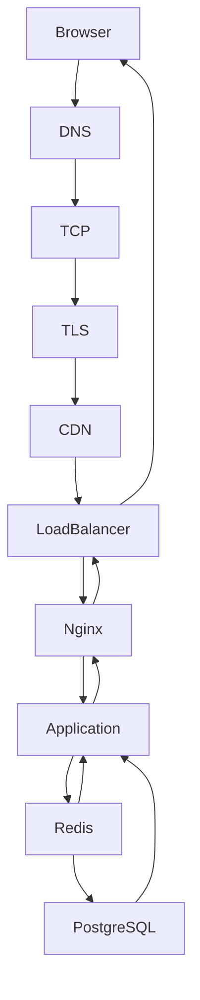
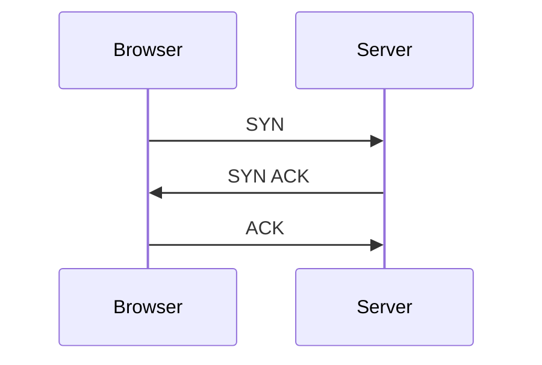
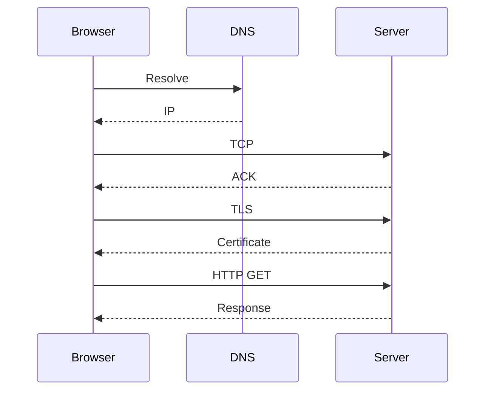
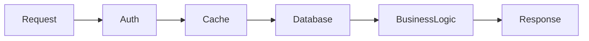
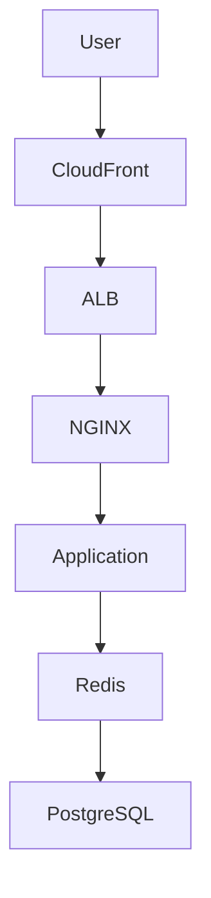

# Lab 05 — HTTP Tracing

> Linux Fundamentals Mastery
>
> Networking Labs Series
>
> Lab Goal:
>
> Learn how to trace a real HTTP request through every layer of a modern system, understand where latency is introduced, and develop the mindset required to debug production web applications.

---

# Why This Lab Exists

Most engineers can build APIs.

Many engineers can deploy APIs.

Very few engineers can answer:

```text
A user clicks a button.

The response takes 3 seconds.

Where exactly were those 3 seconds spent?
```

This is the real challenge of production engineering.

Modern applications are distributed systems.

A single HTTP request may travel through:

* Browser
* DNS
* TCP
* TLS
* CDN
* Load Balancer
* Reverse Proxy
* Application Server
* Cache
* Database
* External APIs

Before a single byte of useful data is returned.

Understanding HTTP tracing means understanding how modern software actually works.

---

# The Most Important Question

Whenever an HTTP request is slow:

```text
Where was the time spent?
```

Not:

```text
The website is slow.
```

The difference between junior and senior engineers is the ability to answer this question.

---

# Mental Model

Think of a customer ordering food.

```text
Customer
    ↓
Reception
    ↓
Kitchen
    ↓
Chef
    ↓
Food Preparation
    ↓
Delivery
```

If delivery takes 30 minutes:

Where is the delay?

* Customer?
* Reception?
* Kitchen?
* Chef?
* Delivery?

You investigate every step.

HTTP tracing is exactly the same.

---

# The Modern Request Journey

A user visits:

```text
https://api.company.com/users/123
```

What actually happens?

Most people imagine:

```text
Browser
   ↓
Server
```

Reality:

```text
Browser
   ↓
DNS
   ↓
TCP
   ↓
TLS
   ↓
CDN
   ↓
Load Balancer
   ↓
Reverse Proxy
   ↓
Application
   ↓
Redis
   ↓
Database
   ↓
Application
   ↓
Response
```

Every box adds latency.

Every box can fail.

---

# Full Request Architecture



---

# Understanding The Layers

Before debugging HTTP, understand what must succeed.

```text
Layer 1 → DNS

Layer 2 → Routing

Layer 3 → TCP

Layer 4 → TLS

Layer 5 → HTTP

Layer 6 → Application

Layer 7 → Database
```

Failure at any layer:

```text
Request fails
```

---

# Production Mindset

When someone says:

```text
Website is down.
```

Never believe them.

Investigate:

```text
DNS down?

TCP down?

TLS down?

Application down?

Database down?

External API down?
```

Symptoms often look identical.

Root causes rarely are.

---

# Stage 1 — DNS Resolution

First operation:

```text
api.company.com
```

must become:

```text
10.20.30.40
```

Check:

```bash
dig api.company.com
```

or

```bash
getent hosts api.company.com
```

---

# Why This Matters

If DNS takes:

```text
500ms
```

Your request is already slow before networking begins.

Many production incidents originate here.

---

# Stage 2 — TCP Connection

After DNS:

Browser knows:

```text
10.20.30.40
```

Now TCP handshake begins.



Connection established.

---

# Measuring TCP Cost

Use:

```bash
curl -w "\nTCP:%{time_connect}\n" https://example.com
```

Example:

```text
TCP:0.045
```

45 milliseconds spent establishing connection.

---

# Engineering Insight

For global users:

```text
India → US

TCP handshake alone
may cost 150ms+
```

Before HTTP starts.

---

# Stage 3 — TLS Negotiation

Modern HTTPS requires encryption.

TLS occurs after TCP.

Visualized:

```text
DNS

↓

TCP

↓

TLS

↓

HTTP
```

Many engineers incorrectly assume HTTPS begins immediately.

It doesn't.

---

# Measuring TLS Time

```bash
curl -w "\nTLS:%{time_appconnect}\n" https://example.com
```

Example:

```text
TLS:0.120
```

120ms spent negotiating encryption.

---

# Why TLS Matters

Large organizations often experience latency from:

* Certificate validation
* Handshake overhead
* Cross-region communication

Especially in microservice architectures.

---

# Stage 4 — Sending HTTP Request

Only now can HTTP begin.

Example:

```http
GET /users/123 HTTP/1.1

Host: api.company.com
```

Request enters application stack.

---

# Trace Full Request

```bash
curl -v https://example.com
```

Observe:

* DNS resolution
* TCP connection
* TLS handshake
* Headers
* Response

This is one of the most valuable debugging tools.

---

# Visualizing Request Flow



---

# Stage 5 — Reverse Proxy

Most production systems use:

* NGINX
* HAProxy
* Envoy
* Traefik

Request usually reaches these before the application.

```text
Browser

↓

NGINX

↓

Application
```

---

# Why Reverse Proxies Exist

They provide:

* TLS termination
* Rate limiting
* Compression
* Caching
* Load balancing
* Security

Modern web systems depend heavily on them.

---

# Stage 6 — Application Processing

Now application code executes.

Example:

```javascript
GET /users/:id
```

Application might:

1. Authenticate
2. Check permissions
3. Query Redis
4. Query Database
5. Call external services

This is where most latency originates.

---

# Internal Application Trace



---

# Database Latency

Very common scenario:

```text
HTTP appears slow.
```

Actual problem:

```sql
SELECT *
FROM users
```

takes:

```text
2.8 seconds
```

Application only spends:

```text
10ms
```

Database causes slowdown.

---

# Production Incident Example

Symptoms:

```text
API latency = 3 seconds
```

Investigation:

```text
DNS = 10ms

TCP = 30ms

TLS = 50ms

Application = 20ms

Database = 2890ms
```

Root Cause:

```text
Missing Database Index
```

Not networking.

---

# HTTP Status Code Investigation

Observe response:

```bash
curl -I https://example.com
```

Common results:

```text
200 OK

301 Redirect

403 Forbidden

404 Not Found

500 Internal Error

502 Bad Gateway

503 Service Unavailable

504 Gateway Timeout
```

---

# Understanding 502

Usually:

```text
NGINX
```

cannot reach:

```text
Application
```

Architecture:

```text
Client

↓

NGINX

↓

Backend
```

Backend fails.

NGINX returns:

```text
502
```

---

# Understanding 504

Request path exists.

Backend too slow.

Timeout occurs.

Very common in production.

---

# HTTP Tracing With Curl

Most useful command:

```bash
curl -w '
DNS: %{time_namelookup}
TCP: %{time_connect}
TLS: %{time_appconnect}
TTFB: %{time_starttransfer}
TOTAL: %{time_total}
' https://example.com
```

---

# Understanding Metrics

### DNS

Time spent resolving hostname.

### TCP

Connection establishment.

### TLS

Encryption negotiation.

### TTFB

Time To First Byte.

Often reveals server processing delays.

### TOTAL

Entire request lifecycle.

---

# TTFB Analysis

High TTFB usually means:

```text
Slow Database

Slow API

Slow Application

Resource Contention
```

Not necessarily networking.

---

# Linux Observability Tools

View connections:

```bash
ss -tanp
```

Observe packets:

```bash
tcpdump -i any port 443
```

Observe DNS:

```bash
tcpdump -i any port 53
```

Observe processes:

```bash
top
```

Observe disk activity:

```bash
iostat
```

Observe memory:

```bash
free -h
```

---

# What The Kernel Sees

Application says:

```text
Send HTTP Request
```

Kernel sees:

```text
DNS

↓

Route Lookup

↓

TCP

↓

TLS

↓

Socket Writes

↓

Socket Reads
```

Linux never sees:

```text
Business Logic
```

Linux sees packets and sockets.

Understanding this distinction is critical.

---

# Kubernetes Connection

Request path becomes:

```text
Ingress

↓

Service

↓

Pod

↓

Container

↓

Application

↓

Database
```

Tracing becomes harder.

But principles remain identical.

---

# Service Mesh Connection

With Istio/Linkerd:

```text
Application

↓

Sidecar Proxy

↓

Network

↓

Sidecar Proxy

↓

Application
```

Extra hops.

Extra latency.

Extra observability.

---

# Cloud Architecture Connection

Modern cloud request path:



Every layer must be measurable.

---

# Production Investigation Workflow

When request is slow:

Step 1

Measure DNS.

Step 2

Measure TCP.

Step 3

Measure TLS.

Step 4

Measure TTFB.

Step 5

Check application logs.

Step 6

Check database latency.

Step 7

Check external dependencies.

Step 8

Build latency breakdown.

Never guess.

Measure.

---

# Common Mistakes

## Mistake 1

Blaming application first.

Often DNS, TCP, or database.

---

## Mistake 2

Ignoring TLS latency.

Very common in distributed systems.

---

## Mistake 3

Only measuring total response time.

Always break latency into components.

---

## Mistake 4

Assuming HTTP is the problem.

HTTP sits on top of many dependencies.

---

# Engineering Mindset

Junior Engineer:

```text
API is slow.
```

Senior Engineer:

```text
Which layer is slow?
```

Infrastructure Engineer:

```text
Show me the latency budget.
```

Example:

```text
DNS 10ms

TCP 20ms

TLS 50ms

Application 40ms

Database 2000ms
```

Now the problem is obvious.

---

# Interview Questions

### Beginner

What happens when you open a website?

### Intermediate

Explain the path from browser to server.

### Intermediate

What is TTFB?

### Intermediate

How would you investigate a slow API?

### Advanced

How would you isolate DNS vs TCP vs TLS latency?

### Advanced

Why does a 504 Gateway Timeout occur?

### Advanced

How would you trace a request through Kubernetes?

### Advanced

How would you build an HTTP observability strategy?

---

# Lab Success Criteria

You should now be able to:

* Trace a request from browser to application
* Measure DNS latency
* Measure TCP latency
* Measure TLS latency
* Interpret TTFB
* Investigate HTTP failures
* Understand reverse proxies
* Understand load balancers
* Trace requests through cloud systems
* Analyze latency budgets
* Debug production web applications systematically

At this point you are no longer looking at a website as a webpage.

You are looking at it as a chain of interconnected systems whose behavior can be measured, traced, and explained.
