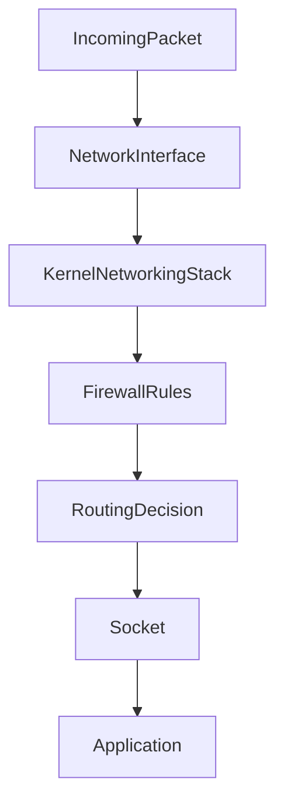
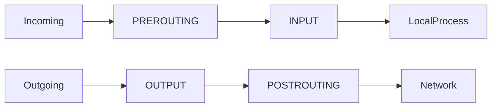
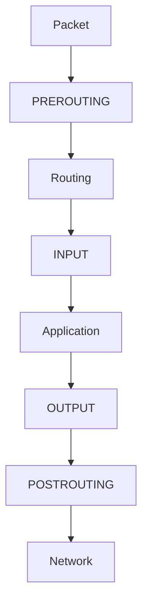
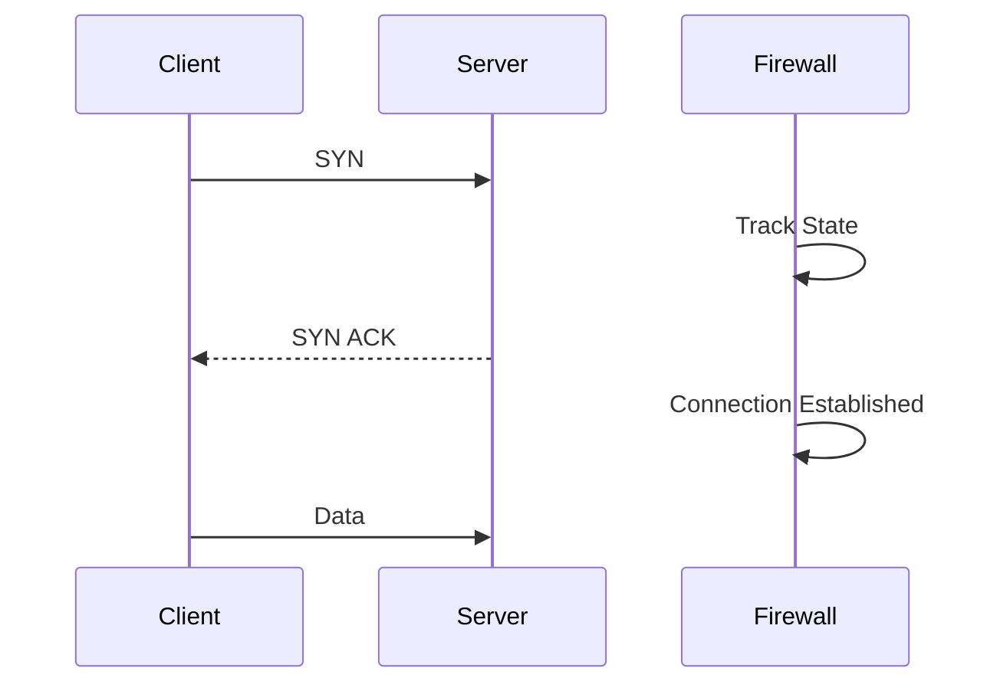
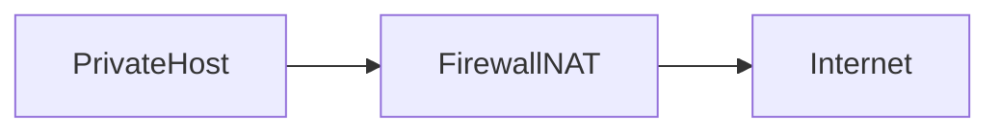

# Lab 06 — Firewall Labs: Packet Filtering, Traffic Control, and Production Security

> Linux Fundamentals Mastery
>
> Networking Labs Series
>
> Track:
>
> Linux Networking → Security → Infrastructure Engineering → Cloud Networking
>
> Lab Goal:
>
> Understand how Linux firewalls actually work, how packets flow through the kernel, how modern infrastructure uses packet filtering, and how to investigate real production connectivity failures caused by firewall rules.

---

# Why This Lab Exists

Most engineers think a firewall is:

```text
Something that blocks ports.
```

This is one of the most dangerous oversimplifications in infrastructure engineering.

A firewall is actually:

```text
A traffic decision engine.
```

Every packet entering or leaving a Linux system may be evaluated.

The firewall decides:

* Allow
* Reject
* Drop
* Redirect
* Log
* Modify

Before the application ever sees the packet.

---

# The Real Production Problem

A developer says:

```text
My API is down.
```

A platform engineer says:

```text
Show me the packet path.
```

Because:

* DNS may work
* Routing may work
* TCP may work

Yet packets still never reach the application.

Why?

Firewall.

---

# Mental Model

Imagine an airport.

Every traveler passes through security checkpoints.

Security asks:

```text
Who are you?

Where are you going?

What are you carrying?

Should you be allowed through?
```

Firewalls do exactly the same thing.

Every packet becomes a traveler.

---

# What A Firewall Actually Does

A firewall does not protect applications directly.

It protects network access.

Think carefully:

```text
Application
    ↑
Operating System
    ↑
Firewall
    ↑
Network
```

Traffic must pass through the firewall before reaching the application.

---

# Linux Packet Processing Pipeline

Understanding this diagram is more important than memorizing commands.



A packet encounters the firewall before application code executes.

---

# Why Firewalls Exist

Without firewalls:

```text
Every open service
becomes publicly accessible.
```

Examples:

```text
PostgreSQL
Redis
MongoDB
Kubernetes API
SSH
RabbitMQ
Elasticsearch
```

This is how many infrastructure breaches occur.

---

# Modern Linux Firewall Technologies

Linux has evolved significantly.

---

## iptables

Traditional firewall framework.

For many years:

```text
iptables
=
Linux Firewall
```

---

## nftables

Modern replacement.

Provides:

* Better performance
* Simpler architecture
* Improved scalability

Modern Linux distributions increasingly prefer nftables.

---

## firewalld

Management layer.

Provides:

```text
Zones

Policies

Abstractions
```

instead of raw rules.

---

# Why Infrastructure Engineers Must Learn Firewalls

Because cloud security groups, Kubernetes network policies, and service meshes all implement the same ideas.

Understanding Linux firewalls explains:

* AWS Security Groups
* Azure NSGs
* GCP Firewall Rules
* Kubernetes Network Policies
* Istio Authorization Policies

---

# First Investigation

View listening services:

```bash
ss -tulnp
```

Example:

```text
22 SSH
80 HTTP
443 HTTPS
5432 PostgreSQL
```

Question:

```text
Which services should actually be reachable?
```

Firewall design starts here.

---

# The Principle of Least Exposure

Most secure server:

```text
Only exposes
what is required.
```

Not:

```text
Everything works.
```

Security and convenience often conflict.

---

# Packet Flow Through Netfilter

Netfilter is the Linux packet filtering subsystem.

This is where firewall logic executes.

---

# Netfilter Architecture



Every packet passes through hooks.

Understanding these hooks is essential.

---

# The Five Critical Chains

---

## PREROUTING

Packet arrives.

Routing decision not made yet.

Useful for:

* NAT
* Traffic redirection

---

## INPUT

Packet destined for local machine.

Example:

```text
SSH

HTTP

HTTPS
```

---

## FORWARD

Packet passing through machine.

Common in:

```text
Routers

Kubernetes Nodes

Firewalls
```

---

## OUTPUT

Locally generated traffic.

Example:

```text
curl

wget

apt

database replication
```

---

## POSTROUTING

Packet about to leave system.

Commonly used for:

```text
NAT

Masquerading
```

---

# Visualizing Packet Journey



---

# Firewall Rules Are Ordered

Critical concept.

Rules are evaluated:

```text
Top
 ↓
Bottom
```

First matching rule wins.

---

Example:

```text
Allow SSH

Deny All
```

works.

But:

```text
Deny All

Allow SSH
```

fails.

Rule order matters.

---

# DROP vs REJECT

Most engineers confuse these.

---

## DROP

Firewall silently ignores packet.

Client waits.

Timeout occurs.

```text
No response.
```

---

## REJECT

Firewall explicitly refuses.

```text
Access denied.
```

Client receives immediate response.

---

# Production Investigation

User reports:

```text
Application hangs forever.
```

Likely:

```text
DROP
```

User reports:

```text
Connection refused.
```

Likely:

```text
REJECT
```

Understanding this distinction accelerates debugging.

---

# Connection Tracking

Modern firewalls are stateful.

This is one of the most important concepts in networking.

---

# Stateless Firewall

Every packet evaluated independently.

No memory.

---

# Stateful Firewall

Tracks:

```text
New Connections

Established Connections

Related Connections
```

Much smarter.

Much more secure.

---

# Connection Tracking Visualization



Firewall remembers connection state.

---

# Observe Connection States

View active sockets:

```bash
ss -tan
```

Observe:

```text
ESTABLISHED

TIME_WAIT

SYN_SENT

CLOSE_WAIT
```

Connection tracking relies heavily on these states.

---

# Investigating Local Firewall Configuration

iptables systems:

```bash
sudo iptables -L -n -v
```

nftables systems:

```bash
sudo nft list ruleset
```

firewalld systems:

```bash
sudo firewall-cmd --list-all
```

---

# Production Scenario 1

## SSH Suddenly Unreachable

Symptoms:

```text
Ping Works

Routing Works

SSH Fails
```

Investigation:

```bash
ss -ltn
```

SSH listening?

If yes:

```bash
iptables -L -n -v
```

Firewall likely blocking port 22.

---

# Production Scenario 2

## Database Works Locally But Not Remotely

Developer says:

```text
Database broken.
```

Reality:

```text
Firewall blocking 5432.
```

Classic incident.

---

# Production Scenario 3

## Kubernetes Pod Communication Failure

Pods cannot communicate.

Application healthy.

Investigation reveals:

```text
Network Policy
```

blocking traffic.

Conceptually identical to Linux firewall rules.

---

# Production Scenario 4

## Public Redis Exposure

Redis exposed:

```text
0.0.0.0:6379
```

Firewall absent.

Attackers connect.

Data stolen.

Root cause:

```text
No network boundary.
```

Not Redis itself.

---

# Understanding NAT

Firewalls frequently perform NAT.

Example:

```text
Private IP

10.0.0.10

↓

Public IP

52.x.x.x
```

Without NAT:

Private networks cannot access the Internet.

---

# NAT Visualization



Almost every cloud environment depends on NAT.

---

# Cloud Networking Connection

AWS Security Groups:

```text
Allow TCP 443
Allow TCP 22
```

Conceptually:

```text
Firewall Rules
```

---

# Kubernetes Connection

Kubernetes networking heavily uses:

```text
iptables

nftables

eBPF
```

Understanding Linux firewalls helps explain:

* Services
* kube-proxy
* Network Policies
* Service Meshes

---

# Performance Considerations

Every packet may require:

```text
Rule Evaluation

Connection Tracking

NAT Translation

Logging
```

Poor firewall design can become a bottleneck.

---

# Example

100,000 rules:

```text
Slow Processing
```

10 efficient rules:

```text
Fast Processing
```

---

# Observability

Firewall debugging requires visibility.

---

## Observe Packets

```bash
sudo tcpdump -i any
```

---

## Observe Connections

```bash
ss -tan
```

---

## Observe Counters

```bash
sudo iptables -L -v -n
```

Counters reveal:

```text
Which rules are matching.
```

Extremely valuable.

---

# Firewall Troubleshooting Workflow

When connectivity fails:

---

## Step 1

Verify DNS.

```bash
dig hostname
```

---

## Step 2

Verify routing.

```bash
ip route get destination
```

---

## Step 3

Verify service listening.

```bash
ss -ltn
```

---

## Step 4

Verify packet arrival.

```bash
tcpdump
```

---

## Step 5

Inspect firewall.

```bash
iptables
nft
firewalld
```

---

## Step 6

Compare expected path with actual path.

---

# What The Kernel Is Thinking

Incoming packet arrives.

Kernel asks:

```text
Which interface received this?
```

Then:

```text
Does a firewall rule match?
```

Then:

```text
Allow?

Reject?

Drop?
```

Only after passing those checks can the packet reach the application.

---

# Common Mistakes

---

## Mistake 1

Blaming applications first.

Many incidents are firewall issues.

---

## Mistake 2

Ignoring outbound filtering.

Security applies both directions.

---

## Mistake 3

Allowing databases publicly.

Very common breach vector.

---

## Mistake 4

Using "Allow Everything".

Not security.

---

## Mistake 5

Not documenting firewall rules.

Creates operational chaos.

---

# Engineering Mindset

Junior Engineer:

```text
The server is unreachable.
```

Senior Engineer:

```text
Where is the packet being dropped?
```

Infrastructure Engineer:

```text
Show me:

DNS

Route

Firewall

Socket

Application
```

in that order.

Because packets cannot magically disappear.

They are always being:

```text
Forwarded

Dropped

Rejected

Translated
```

Somewhere.

Your job is finding where.

---

# Interview Questions

### Beginner

What is a firewall?

### Beginner

Difference between DROP and REJECT?

### Intermediate

What is connection tracking?

### Intermediate

Explain INPUT and OUTPUT chains.

### Intermediate

What is NAT?

### Advanced

How does Netfilter work?

### Advanced

How would you debug a firewall issue?

### Advanced

How do Kubernetes network policies relate to Linux firewalls?

### Advanced

How do cloud security groups relate to iptables?

### Advanced

How can firewall rules become a performance bottleneck?

---

# Lab Success Criteria

You should now be able to:

* Explain how Linux firewalls work
* Understand Netfilter architecture
* Understand packet flow through kernel hooks
* Investigate firewall-related outages
* Understand stateful inspection
* Understand NAT
* Debug connectivity failures
* Relate Linux firewalls to cloud networking
* Relate Linux firewalls to Kubernetes networking
* Think like a platform engineer when diagnosing packet flow

At this point, you should no longer think of a firewall as "a thing that blocks ports."

You should think of it as:

```text
A programmable packet decision engine
inside the Linux kernel.
```
