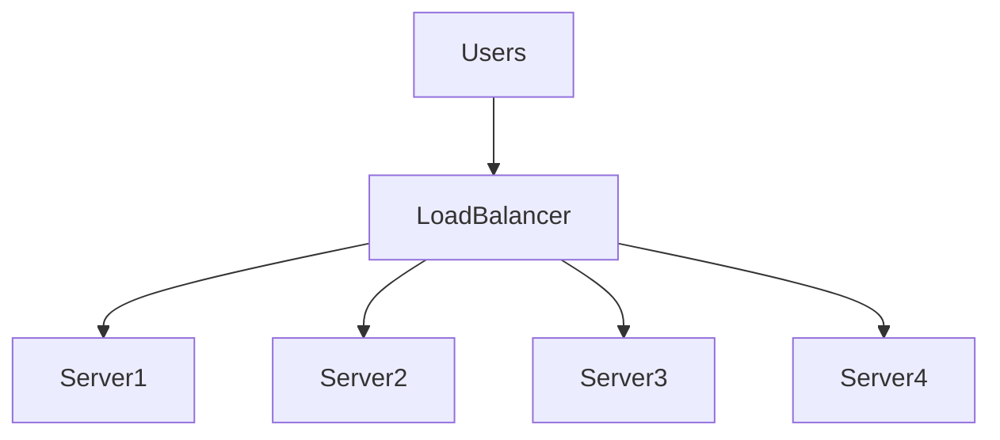
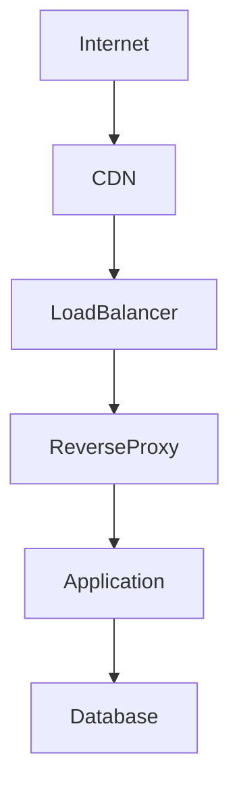
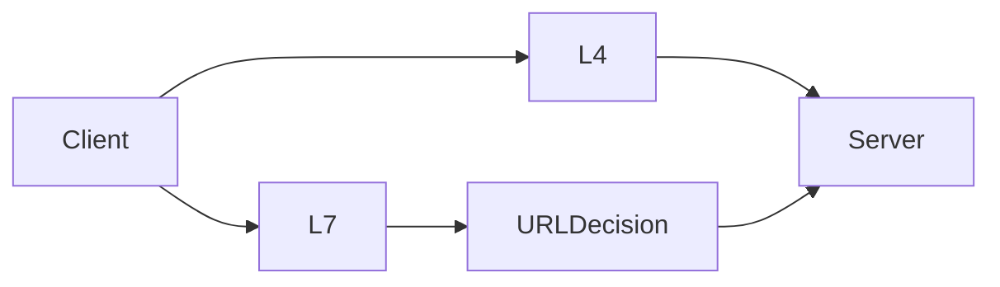
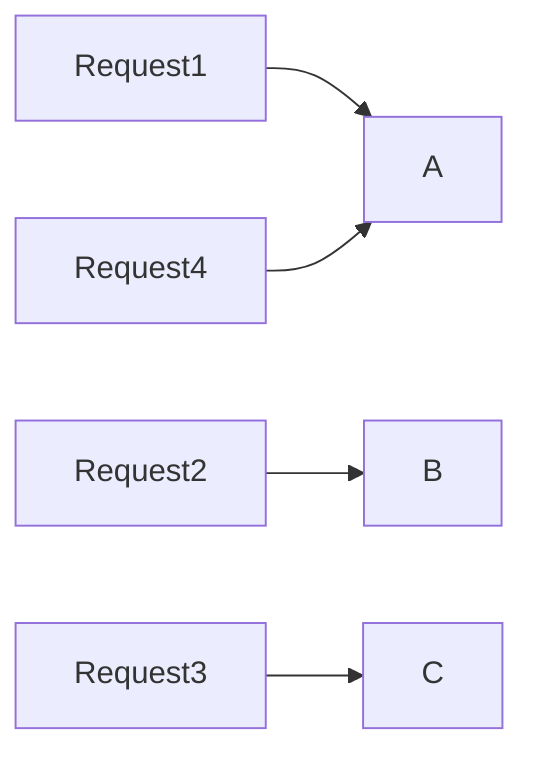
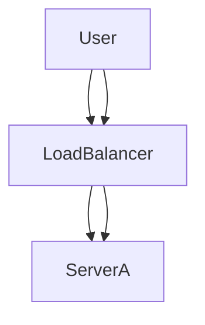
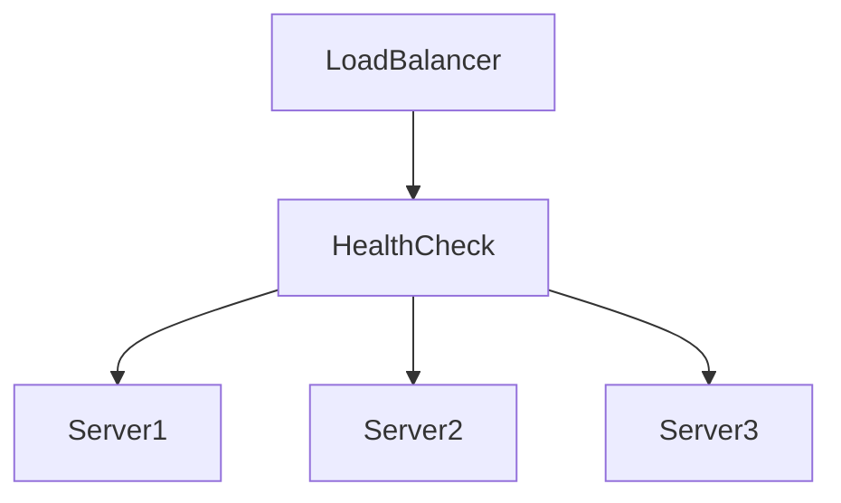
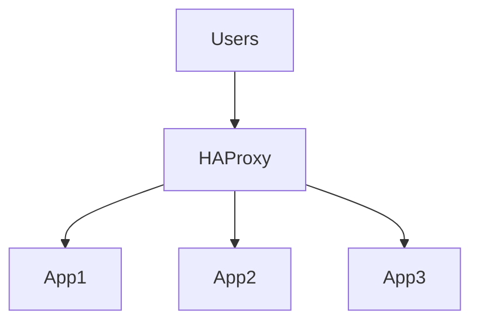
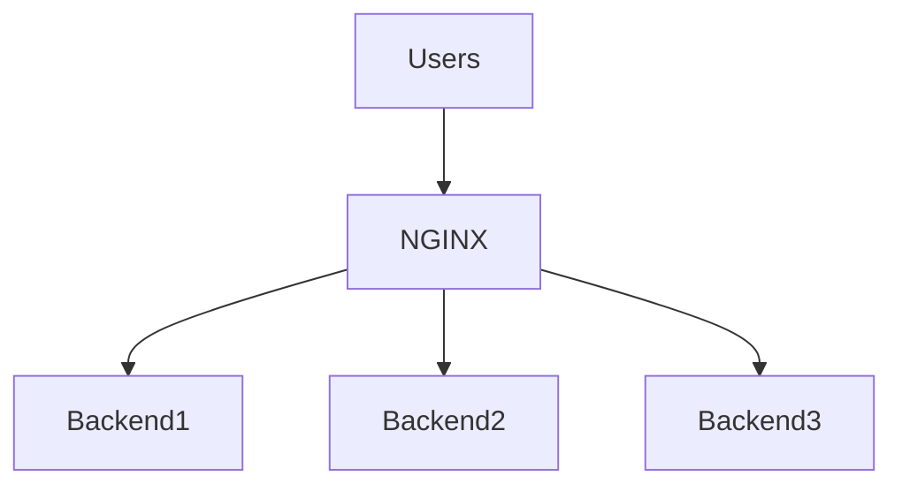
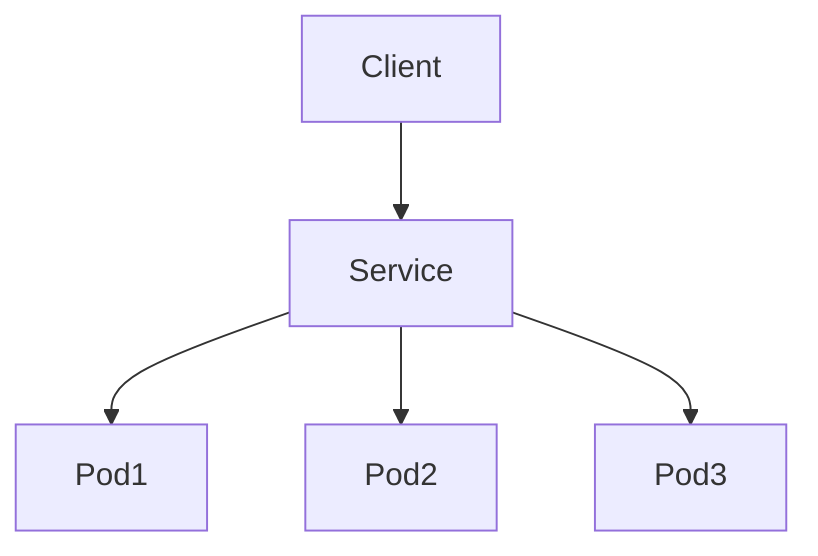
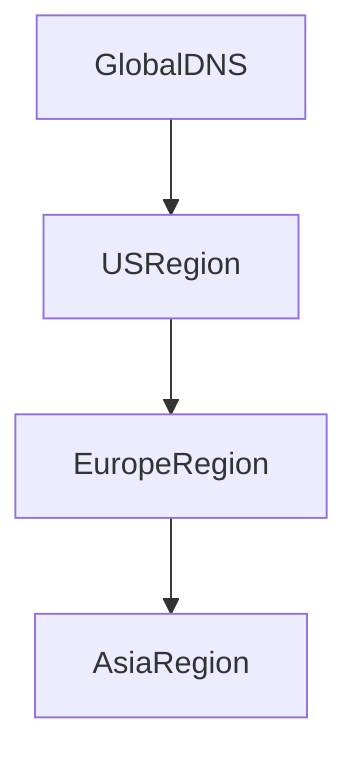

# Lab 07 — Load Balancer Labs: Traffic Distribution, High Availability, and Production Traffic Engineering

> Linux Fundamentals Mastery
>
> Networking Labs Series
>
> Track:
>
> Linux Networking → Distributed Systems → Cloud Infrastructure → Platform Engineering
>
> Lab Goal:
>
> Understand how load balancers actually work, why modern systems cannot scale without them, how Linux-based load balancing operates internally, and how to investigate real production incidents involving traffic distribution, availability, latency, and scaling.

---

# Why This Lab Exists

Most engineers think a load balancer is:

```text
Something that distributes traffic.
```

That definition is correct.

But it explains almost nothing.

A load balancer is actually one of the most critical infrastructure components in modern computing.

Without load balancers:

* Google would not scale
* Netflix would not scale
* AWS would not scale
* Kubernetes would not scale
* Most startups would experience outages during growth

Load balancing is where networking meets distributed systems.

---

# The Fundamental Problem

Imagine a server:

```text
Server A

100 Requests/Second
```

Everything works.

Then your startup grows.

```text
10,000 Requests/Second
```

What happens?

```text
CPU Saturation

Memory Pressure

Connection Exhaustion

Latency Increase

Failures
```

One machine becomes a bottleneck.

Load balancing exists to solve this problem.

---

# Mental Model

Imagine a supermarket.

Without load balancing:

```text
100 Customers

↓

1 Checkout Counter
```

Result:

```text
Huge Queue
```

With load balancing:

```text
100 Customers

↓

10 Checkout Counters
```

Result:

```text
Faster Processing
```

A load balancer acts like the queue manager.

---

# First Principles

A load balancer answers one question:

```text
Which backend should receive this request?
```

Everything else is implementation detail.

Every incoming request triggers a routing decision.

---

# The Evolution Of Scaling

Stage 1:

```text
User

↓

Single Server
```

Stage 2:

```text
Users

↓

Load Balancer

↓

Multiple Servers
```

Stage 3:

```text
Global Users

↓

Global Load Balancers

↓

Regional Load Balancers

↓

Clusters

↓

Services
```

Modern systems operate at Stage 3.

---

# Architecture Overview



The load balancer becomes the traffic controller.

---

# Why Load Balancers Matter

Load balancers provide:

* Scalability
* High Availability
* Fault Tolerance
* Traffic Engineering
* Traffic Visibility
* Security Controls
* SSL Termination

Most engineers only think about scaling.

Production engineers think about all seven.

---

# Load Balancer Placement

Most systems look like:



Notice:

Applications rarely receive traffic directly.

---

# Request Journey

A browser opens:

```text
https://api.company.com
```

Traffic path:

```text
Browser

↓

DNS

↓

Load Balancer

↓

Application

↓

Database
```

The application never sees the client directly.

The load balancer sits in front.

---

# Types Of Load Balancers

Understanding this distinction is critical.

---

# Layer 4 Load Balancer

Operates at:

```text
TCP
UDP
```

Understands:

```text
IP Addresses

Ports
```

Does NOT understand:

```text
HTTP

Cookies

URLs
```

Example:

```text
AWS NLB
```

---

# Layer 7 Load Balancer

Operates at:

```text
HTTP
HTTPS
gRPC
```

Understands:

```text
URLs

Headers

Cookies

Methods
```

Example:

```text
NGINX

HAProxy

Envoy

AWS ALB
```

---

# Visual Comparison



---

# Why Layer 7 Exists

Suppose:

```text
/api/*
```

must go to:

```text
Backend API
```

while:

```text
/images/*
```

must go to:

```text
Image Service
```

Only Layer 7 understands URLs.

---

# Load Balancing Algorithms

The next question:

```text
Which backend gets the request?
```

Algorithms answer this.

---

# Round Robin

Most common.

Example:

```text
Request 1 → Server A

Request 2 → Server B

Request 3 → Server C

Request 4 → Server A
```

---

# Visual



Simple.

Fair.

Widely used.

---

# Least Connections

Instead of rotating equally:

```text
Send traffic
to least busy server.
```

Example:

```text
Server A = 500 Connections

Server B = 50 Connections
```

New traffic:

```text
Server B
```

---

# Weighted Round Robin

Not all servers are equal.

Example:

```text
Server A = 32 CPUs

Server B = 8 CPUs
```

Traffic allocation:

```text
80%

20%
```

More powerful servers receive more requests.

---

# Hash-Based Routing

Decision based on:

```text
IP

Cookie

Session ID

User ID
```

Important for sticky sessions.

---

# Sticky Sessions

Suppose:

```text
User Login
```

Stored locally on Server A.

Next request reaches:

```text
Server B
```

User appears logged out.

Problem.

Solution:

```text
Session Affinity
```

Keep user on same backend.

---

# Sticky Session Visualization



Same user.

Same backend.

---

# Why Sticky Sessions Are Dangerous

They create uneven load.

One server may receive:

```text
10,000 Sessions
```

Another:

```text
500 Sessions
```

Modern systems prefer:

```text
Redis

Databases

Distributed Sessions
```

instead of sticky sessions.

---

# Health Checks

Critical concept.

Load balancers constantly ask:

```text
Are backends healthy?
```

---

# Without Health Checks

```text
Server Dead

↓

Traffic Continues

↓

Failures
```

---

# With Health Checks

```text
Server Dead

↓

Removed From Pool

↓

Traffic Redirected
```

---

# Health Check Architecture



---

# Investigating Health Checks

Example endpoint:

```text
/health

/ready

/live
```

Used heavily in:

* Kubernetes
* Cloud Platforms
* Service Meshes

---

# Production Incident

Symptoms:

```text
50% Requests Failing
```

Architecture:

```text
Load Balancer

↓

Server A (Healthy)

↓

Server B (Broken)
```

Every other request fails.

Root cause:

```text
Missing Health Check
```

Very common.

---

# SSL Termination

Modern HTTPS requires encryption.

Option 1:

```text
Client

↓

HTTPS

↓

Application
```

Application handles TLS.

---

Option 2:

```text
Client

↓

HTTPS

↓

Load Balancer

↓

HTTP

↓

Application
```

Load balancer handles TLS.

Most organizations choose Option 2.

---

# Why SSL Termination Exists

Benefits:

* Lower CPU usage
* Centralized certificate management
* Easier operations
* Simpler applications

---

# Connection Multiplexing

Imagine:

```text
1 Million Users
```

Opening connections.

Applications cannot efficiently manage all connections.

Load balancers aggregate and optimize connection management.

This dramatically improves scalability.

---

# Reverse Proxy vs Load Balancer

Common confusion.

---

## Reverse Proxy

Receives requests on behalf of servers.

Example:

```text
NGINX
```

---

## Load Balancer

Distributes traffic.

Example:

```text
HAProxy
```

---

Reality:

Many tools do both.

---

# Linux Internals Connection

At Linux level:

Load balancers rely on:

```text
Sockets

TCP

Routing

Connection Tracking

Kernel Networking
```

Nothing magical exists.

Load balancing is built on Linux networking primitives.

---

# HAProxy Architecture



One of the most widely used production load balancers.

---

# NGINX Load Balancing

Example architecture:



Extremely common in startups.

---

# Kubernetes Connection

Every Kubernetes Service is essentially a load balancer.

Example:

```text
Frontend Service
```

may route traffic to:

```text
Pod A

Pod B

Pod C
```

Users think:

```text
One Service
```

Reality:

```text
Many Pods
```

---

# Kubernetes Service Visualization



---

# Cloud Load Balancers

Examples:

* AWS ALB
* AWS NLB
* Azure Load Balancer
* Google Cloud Load Balancer

These are large-scale implementations of the same concepts.

---

# Global Load Balancing

Large companies add another layer.



Traffic routed to nearest region.

---

# Production Incident Analysis

## Incident 1

Application latency spikes.

Investigation:

```text
One backend overloaded.
```

Cause:

```text
Bad balancing algorithm.
```

---

## Incident 2

Users randomly logged out.

Cause:

```text
Session Affinity Problem.
```

---

## Incident 3

Traffic reaches dead servers.

Cause:

```text
Health Checks Missing.
```

---

## Incident 4

Load balancer CPU saturation.

Cause:

```text
SSL termination bottleneck.
```

---

# Observability

Infrastructure engineers monitor:

```text
Requests Per Second

Latency

Backend Health

Connection Counts

Error Rates

TLS Handshakes

Queue Length
```

Without observability:

```text
Load balancing becomes guesswork.
```

---

# Useful Investigation Commands

Observe connections:

```bash
ss -tan
```

Observe listening sockets:

```bash
ss -ltn
```

Observe traffic:

```bash
tcpdump -i any
```

Observe HTTP requests:

```bash
curl -v
```

Observe latency:

```bash
curl -w '
DNS:%{time_namelookup}
TCP:%{time_connect}
TTFB:%{time_starttransfer}
TOTAL:%{time_total}
'
```

---

# Scaling Mindset

Junior Engineer:

```text
Add bigger server.
```

Senior Engineer:

```text
Add more servers.
```

Platform Engineer:

```text
Distribute traffic intelligently.
```

System Architect:

```text
Design systems assuming individual servers will fail.
```

Load balancing is not about performance.

It is about survivability.

---

# Common Mistakes

## Mistake 1

No health checks.

---

## Mistake 2

Assuming round robin solves everything.

---

## Mistake 3

Using sticky sessions everywhere.

---

## Mistake 4

Ignoring TLS overhead.

---

## Mistake 5

Treating load balancer as infinite scale.

Load balancers themselves can become bottlenecks.

---

# What The Kernel Is Thinking

Incoming connection arrives.

Kernel asks:

```text
Accept Connection?
```

Load balancer asks:

```text
Which backend?
```

Backend asks:

```text
Can I handle this request?
```

Distributed systems are simply a chain of routing decisions.

---

# Interview Questions

### Beginner

What problem does a load balancer solve?

### Intermediate

Difference between Layer 4 and Layer 7 load balancing?

### Intermediate

Explain round robin.

### Intermediate

What are health checks?

### Advanced

Explain sticky sessions and their drawbacks.

### Advanced

How does Kubernetes Service perform load balancing?

### Advanced

Why is SSL termination commonly performed on load balancers?

### Advanced

How would you debug uneven traffic distribution?

### Advanced

What bottlenecks can exist inside a load balancer?

---

# Lab Success Criteria

You should now be able to:

* Explain why load balancers exist
* Understand traffic distribution algorithms
* Understand Layer 4 vs Layer 7 balancing
* Explain health checks
* Understand session affinity
* Understand SSL termination
* Connect load balancing to Kubernetes Services
* Connect load balancing to cloud platforms
* Investigate production traffic issues
* Think like a platform engineer designing scalable systems

At this point, you should no longer see a load balancer as:

```text
A server in front of servers
```

Instead, see it as:

```text
The traffic control plane
of a distributed system.
```
