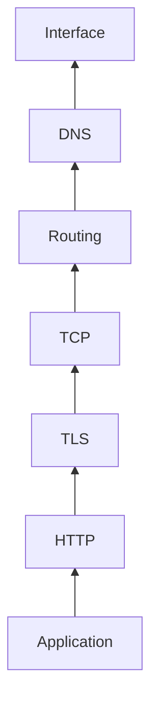
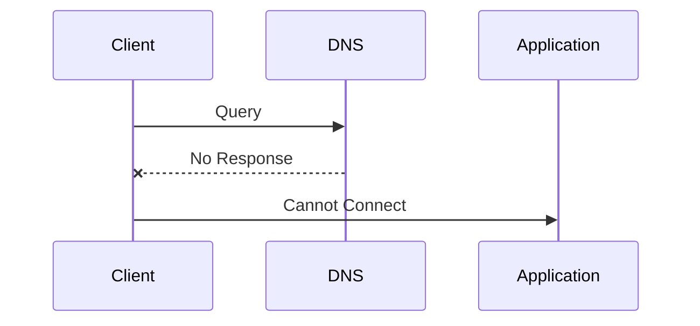
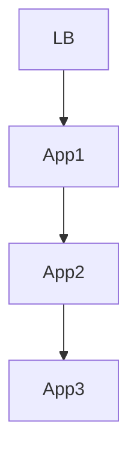
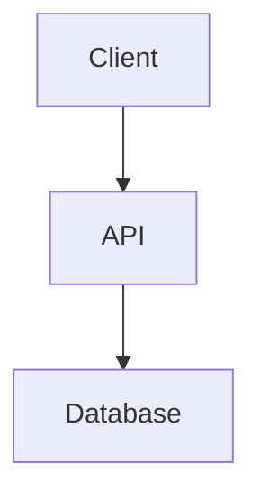
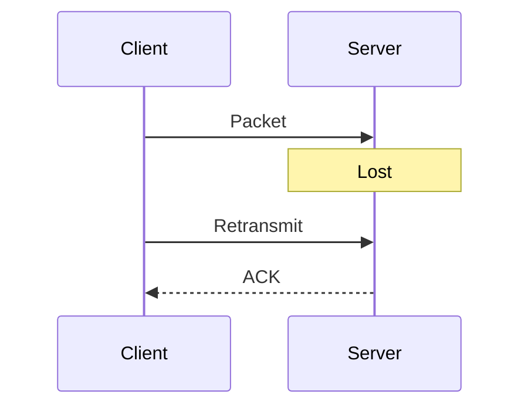
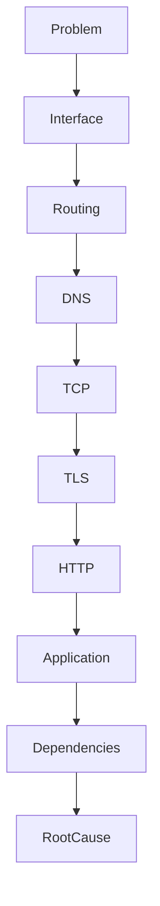

# Lab 08 — Network Failure Scenarios

> Linux Fundamentals Mastery
>
> Networking Labs Series
>
> Track:
>
> Linux Networking → Troubleshooting → Production Engineering → SRE
>
> Lab Goal:
>
> Learn how real network failures happen, how experienced engineers investigate them, and how to build a systematic debugging methodology that scales from a laptop to Kubernetes clusters, cloud platforms, and globally distributed systems.

---

# Why This Lab Exists

Most networking courses teach:

```text
DNS
TCP
Routing
Firewalls
HTTP
```

individually.

Real outages don't happen individually.

Real outages happen like this:

```text
Users Cannot Login
```

Nobody tells you:

* DNS is broken
* Route is broken
* Firewall is broken
* TCP is broken
* Database is broken

You only see:

```text
Application Not Working
```

Your job is finding the failing layer.

This lab teaches that skill.

---

# The Most Valuable Networking Skill

Not memorization.

Not commands.

Not protocols.

The most valuable skill is:

```text
Failure Isolation
```

The ability to answer:

```text
Which layer is actually broken?
```

---

# Mental Model

Think like a doctor.

Patient says:

```text
I feel sick.
```

Doctor doesn't immediately prescribe medicine.

Doctor investigates:

```text
Heart?

Lungs?

Blood?

Brain?

Infection?
```

Networking is identical.

User says:

```text
Website Not Working.
```

Engineer investigates:

```text
DNS?

Routing?

Firewall?

TCP?

TLS?

HTTP?

Application?
```

---

# The Universal Debugging Stack

Every networked application depends on these layers:

```text
Application
    ↑
HTTP/gRPC
    ↑
TLS
    ↑
TCP/UDP
    ↑
Routing
    ↑
DNS
    ↑
Network Interface
```

Failures usually occur in one layer.

Symptoms appear in all layers above it.

---

# Golden Rule

Never start debugging at the top.

Always start from the bottom.

Bad:

```text
API is down.
Let's restart Kubernetes.
```

Good:

```text
Can packets even reach the host?
```

---

# The Production Debugging Pyramid



Bottom layers support upper layers.

---

# Scenario 1 — DNS Failure

## User Report

```text
Website unavailable.
```

---

# Symptoms

```bash
ping 8.8.8.8
```

Works.

```bash
ping google.com
```

Fails.

---

# Analysis

Network connectivity exists.

Name resolution fails.

---

# Investigation

```bash
dig google.com
```

```bash
cat /etc/resolv.conf
```

```bash
resolvectl status
```

---

# Root Cause

Possible causes:

* Wrong DNS server
* Resolver failure
* VPN DNS override
* Expired DNS infrastructure

---

# Packet Journey



---

# Scenario 2 — Routing Failure

## User Report

```text
Cannot access remote service.
```

---

# Symptoms

DNS works.

Host unreachable.

---

# Investigation

```bash
ip route
```

```bash
ip route get DESTINATION
```

```bash
traceroute DESTINATION
```

---

# Example

Missing:

```text
default via 192.168.1.1
```

No gateway.

No Internet.

---

# Root Cause

Routing table corruption.

DHCP failure.

VPN misconfiguration.

Cloud route table mistake.

---

# Engineering Insight

Many engineers incorrectly blame firewalls.

Routing problems often appear identical.

---

# Scenario 3 — Firewall Blocking Traffic

## User Report

```text
SSH Timeout
```

---

# Symptoms

```bash
ping server
```

Works.

```bash
ssh server
```

Fails.

---

# Investigation

Server:

```bash
ss -ltn
```

Listening?

Then:

```bash
iptables -L -n -v
```

or

```bash
nft list ruleset
```

---

# Root Cause

Firewall drops TCP/22.

---

# Visualization


---

# Scenario 4 — TCP Handshake Failure

## User Report

```text
Application unreachable.
```

---

# Investigation

```bash
tcpdump -i any tcp
```

Observe:

```text
SYN

SYN

SYN

SYN
```

No SYN-ACK.

---

# Interpretation

Connection never established.

---

# Possible Causes

* Firewall
* Routing
* Server crash
* Load balancer failure

---

# Packet Analysis

Healthy:

```text
SYN

SYN-ACK

ACK
```

Broken:

```text
SYN

SYN

SYN

Timeout
```

---

# Scenario 5 — TLS Failure

## User Report

```text
HTTPS broken
```

---

# Symptoms

TCP works.

HTTPS fails.

---

# Investigation

```bash
openssl s_client -connect host:443
```

---

# Common Causes

Expired certificate.

Invalid certificate chain.

TLS version mismatch.

Clock drift.

---

# Visualization

```text
DNS ✓

TCP ✓

TLS ✗

HTTP Never Starts
```

---

# Scenario 6 — Application Listening Failure

## User Report

```text
API unavailable.
```

---

# Investigation

```bash
ss -ltn
```

Expected:

```text
0.0.0.0:8080
```

Actual:

```text
Nothing
```

---

# Root Cause

Application never started.

Network healthy.

Application broken.

---

# Production Lesson

Not every connectivity issue is networking.

---

# Scenario 7 — Load Balancer Failure

## Symptoms

Some requests succeed.

Some fail.

---

# Architecture



App2 unhealthy.

LB still routes traffic.

---

# Result

```text
33% Failure Rate
```

---

# Investigation

Health checks.

Backend status.

Load balancer metrics.

---

# Scenario 8 — Database Connectivity Failure

## Symptoms

API slow.

API timing out.

---

# Investigation

Application healthy.

HTTP healthy.

Database unreachable.

---

# Architecture



---

# Root Cause Possibilities

Firewall.

DNS.

Connection exhaustion.

Slow queries.

---

# Key Lesson

The API isn't slow.

The dependency is slow.

---

# Scenario 9 — Packet Loss

One of the most dangerous failures.

---

# Symptoms

```text
Random failures

Intermittent latency

Retransmissions
```

---

# Investigation

```bash
netstat -s
```

```bash
ss -s
```

```bash
tcpdump
```

---

# Effects

TCP retransmissions increase.

Latency increases dramatically.

Applications appear unstable.

---

# Visualization



---

# Scenario 10 — Connection Exhaustion

Modern production killer.

---

# Symptoms

```text
New requests fail.

Existing requests succeed.
```

---

# Investigation

```bash
ss -s
```

Observe:

```text
Thousands of connections.
```

---

# Causes

* Connection leaks
* Traffic spikes
* Poor pooling
* Load balancer issues

---

# Scenario 11 — Kubernetes Service Failure

## Symptoms

Pod healthy.

Service unreachable.

---

# Investigation

```bash
kubectl get svc
```

```bash
kubectl get endpoints
```

---

# Root Cause

Service has no endpoints.

Networking appears broken.

Actually:

```text
Service Discovery Failure
```

---

# Scenario 12 — CoreDNS Failure

## Symptoms

Entire cluster unstable.

---

# Reality

Pods healthy.

Nodes healthy.

DNS broken.

---

# Architecture


Without CoreDNS:

```text
Cluster appears dead.
```

---

# Scenario 13 — Cloud Security Group Failure

## Symptoms

Instance running.

Application running.

Traffic blocked.

---

# Root Cause

Cloud firewall.

Examples:

* AWS Security Group
* Azure NSG
* GCP Firewall Rule

---

# Engineering Lesson

Cloud networking is still networking.

Just more layers.

---

# Scenario 14 — NAT Failure

## Symptoms

Server reachable internally.

Cannot reach Internet.

---

# Root Cause

Broken NAT gateway.

Misconfigured masquerading.

Missing route.

---

# Architecture


---

# Scenario 15 — Asymmetric Routing

Advanced failure.

---

# Packet Path

```text
Request:
Path A

Response:
Path B
```

Firewall tracking breaks.

Connections fail.

---

# Symptoms

Extremely confusing.

Appears random.

---

# Investigation

```bash
traceroute
```

```bash
tcpdump
```

Routing analysis.

---

# The Universal Investigation Workflow

When something fails:

---

## Step 1

Verify Interface

```bash
ip addr
```

---

## Step 2

Verify Routing

```bash
ip route
```

---

## Step 3

Verify DNS

```bash
dig hostname
```

---

## Step 4

Verify Reachability

```bash
ping
```

---

## Step 5

Verify TCP

```bash
nc -vz host port
```

---

## Step 6

Verify TLS

```bash
openssl s_client
```

---

## Step 7

Verify HTTP

```bash
curl -v
```

---

## Step 8

Verify Application

Logs.

Metrics.

Tracing.

---

# The Production Incident Flowchart



---

# What Senior Engineers Actually Do

Junior Engineer:

```text
Restart Service
```

---

Mid-Level Engineer:

```text
Check Logs
```

---

Senior Engineer:

```text
Build Failure Tree
```

Example:

```text
Application Failure

├─ DNS
├─ Route
├─ Firewall
├─ TCP
├─ TLS
├─ HTTP
└─ Database
```

Then eliminate possibilities systematically.

---

# Common Mistakes

## Mistake 1

Assuming symptom equals cause.

---

## Mistake 2

Skipping layers.

---

## Mistake 3

Restarting before investigating.

---

## Mistake 4

Ignoring packet captures.

---

## Mistake 5

Ignoring dependencies.

---

# Engineering Mindset

Production networking is not:

```text
Knowing commands.
```

Production networking is:

```text
Building accurate mental models.
```

The best engineers are not the people who know the most commands.

They are the people who can answer:

```text
Exactly where did the packet stop?
```

---

# Interview Questions

### Intermediate

How would you investigate a website outage?

### Intermediate

How do you differentiate DNS failure from routing failure?

### Advanced

Explain packet loss symptoms.

### Advanced

How would you debug intermittent connectivity?

### Advanced

How would you investigate Kubernetes service failures?

### Advanced

What is asymmetric routing?

### Advanced

Design a network troubleshooting methodology for production systems.

---

# Lab Success Criteria

You should now be able to:

* Investigate failures systematically
* Separate symptoms from causes
* Diagnose DNS failures
* Diagnose routing failures
* Diagnose firewall issues
* Diagnose TCP problems
* Diagnose TLS failures
* Diagnose HTTP failures
* Investigate Kubernetes networking
* Investigate cloud networking
* Build production debugging workflows
* Think like an SRE during incidents

At this point, networking should no longer look like separate technologies.

You should see:

```text
One packet

Moving through many systems

Until it reaches its destination.
```

And troubleshooting becomes the process of discovering exactly where that journey stopped.
