# Lab 01 – Users and Groups

> Linux is not designed for a single user.
>
> Linux was built as a:
>
> ```text
> Multi-User
> Multi-Process
> Multi-Tenant
> Secure Operating System
> ```
>
> Every modern system depends on user isolation:
>
> * Linux Servers
> * Cloud VMs
> * Kubernetes Nodes
> * Databases
> * Containers
> * CI/CD Systems
> * SaaS Platforms
>
> Understanding users and groups is the foundation of Linux security.

---

# Lab Objective

By the end of this lab you will:

* Understand Linux user architecture
* Understand groups and permissions
* Create and manage users
* Create and manage groups
* Understand UID and GID
* Investigate authentication files
* Understand privilege separation
* Understand service accounts
* Connect users to containers and cloud systems
* Think like a Linux administrator

---

# Why This Matters

Imagine a production server.

It runs:

```text
PostgreSQL

Nginx

Redis

Prometheus

Docker

System Services
```

Should all run as:

```text
root
```

Absolutely not.

That would be a security disaster.

Linux solves this using:

```text
Users

Groups

Permissions

Privilege Separation
```

---

# The Problem

Without users:

```text
Every Process

Every Application

Every Person
```

would have access to:

```text
Everything
```

Result:

```text
Security Nightmare
```

---

# Mental Model

Think of a company.

```text
CEO

Managers

Engineers

HR

Finance
```

Everyone has:

```text
Different Responsibilities

Different Access Rights
```

Linux works exactly the same way.

---

# Linux Identity Model

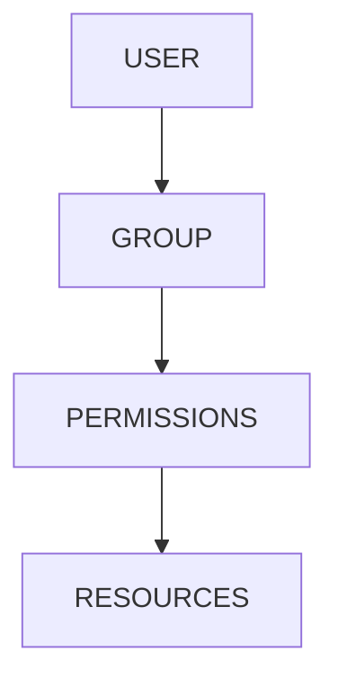

---

# First Principles

Every action in Linux occurs as a user.

Examples:

```text
Create File

Delete File

Read Configuration

Start Service

Open Network Port
```

Linux asks:

```text
Who Is Doing This?
```

before allowing the action.

---

# Core Linux Security Model

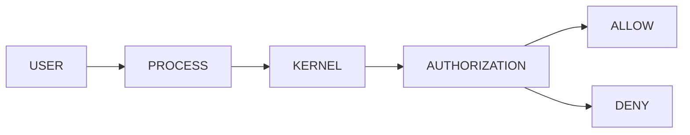

---

# Understanding Users

Display current user:

```bash
whoami
```

Example:

```text
vip
```

Display identity:

```bash
id
```

Example:

```text
uid=1000(vip)
gid=1000(vip)
groups=1000(vip)
```

---

# Lab Task 1

Run:

```bash
whoami

id
```

Document:

```text
Username

UID

Primary Group

Supplementary Groups
```

---

# What Is A User?

A Linux user is:

```text
An Identity

Not A Person
```

Examples:

```text
vip

ubuntu

postgres

nginx

redis
```

---

# User Types

Linux generally has:

```text
Human Users

System Users

Service Users
```

---

# Architecture

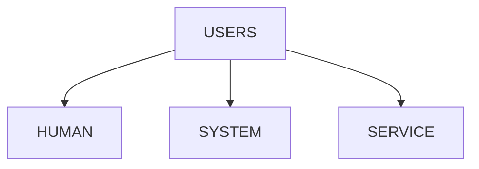

---

# Human Users

Examples:

```text
vip

alice

bob
```

Used for:

```text
Login

Development

Administration
```

---

# Service Users

Examples:

```text
postgres

mysql

nginx

redis
```

Purpose:

```text
Run Applications
```

---

# Why Service Users Exist

If PostgreSQL gets compromised:

```text
Attacker Gets

postgres User
```

instead of:

```text
root
```

Huge security improvement.

---

# Privilege Separation

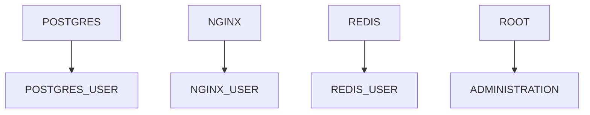

---

# Understanding UID

Every user has:

```text
UID
```

User ID.

Linux internally identifies users by UID.

Not username.

---

# Example

```text
Username: vip

UID: 1000
```

Linux sees:

```text
1000
```

not:

```text
vip
```

---

# Why UIDs Matter

Changing username:

```text
vip → vipul
```

does not change ownership.

Ownership depends on:

```text
UID
```

---

# UID Architecture

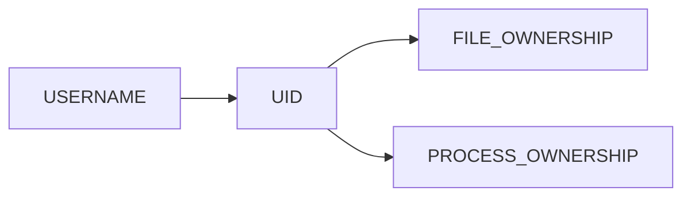

---

# Lab Task 2

Run:

```bash
id

cat /etc/passwd | head
```

Observe UID values.

---

# Understanding Groups

Groups allow:

```text
Shared Access
```

between users.

---

# Example

Team:

```text
alice

bob

charlie
```

all need:

```text
Project Files
```

Instead of managing permissions individually:

```text
Create Group
```

---

# Group Model

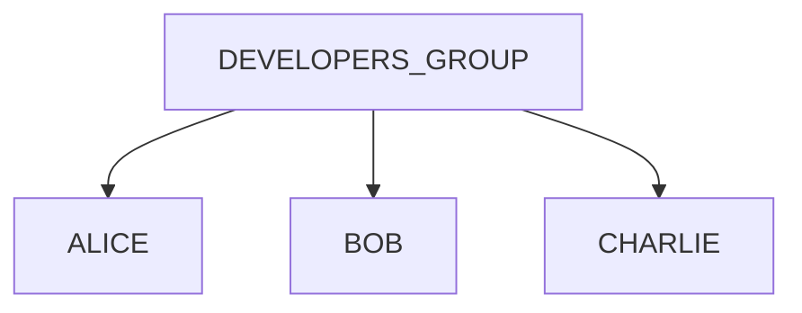

---

# Viewing Groups

Current groups:

```bash
groups
```

Or:

```bash
id
```

---

# Lab Task 3

Run:

```bash
groups

id
```

Record all groups.

---

# Understanding GID

Every group has:

```text
Group ID (GID)
```

Similar to UID.

---

# Architecture


---

# Important System Files

Linux stores user information in:

```text
/etc/passwd
```

Group information in:

```text
/etc/group
```

Passwords:

```text
/etc/shadow
```

---

# Authentication Architecture

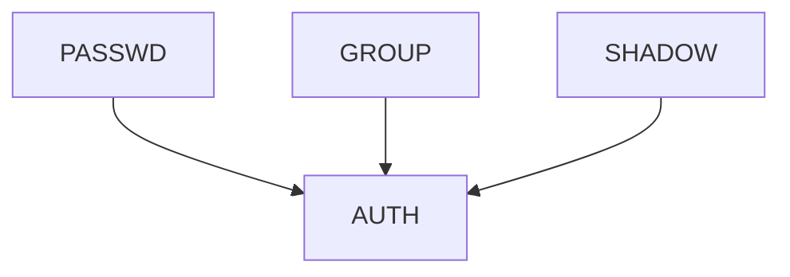

---

# Exploring /etc/passwd

View:

```bash
cat /etc/passwd
```

Example:

```text
vip:x:1000:1000:VIP:/home/vip:/bin/bash
```

---

# Field Breakdown

```text
username

password_placeholder

UID

GID

description

home_directory

shell
```

---

# Visualization

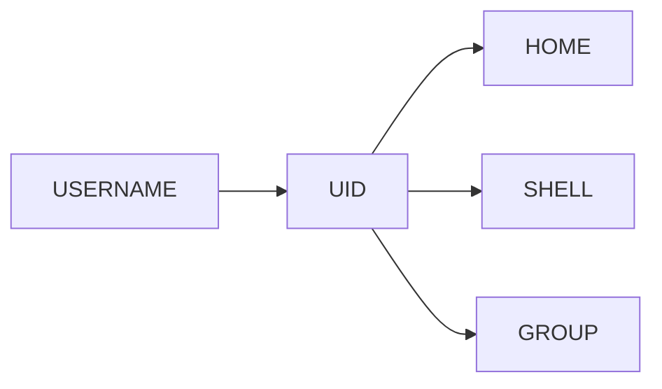

---

# Lab Task 4

Inspect:

```bash
cat /etc/passwd

cat /etc/group
```

Identify:

```text
Your User

Your UID

Your GID
```

---

# Creating Users

Create user:

```bash
sudo useradd engineer
```

Set password:

```bash
sudo passwd engineer
```

---

# Verify

```bash
id engineer
```

---

# User Creation Workflow

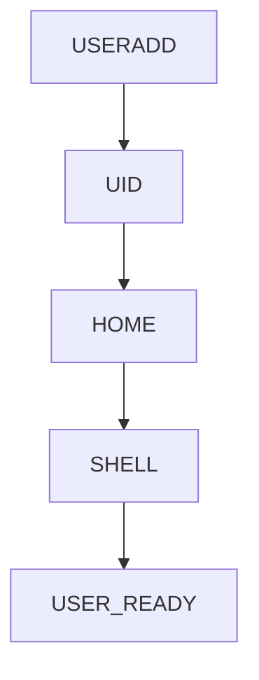

---

# Lab Task 5

Create test user:

```bash
sudo useradd testuser

sudo passwd testuser
```

Verify:

```bash
id testuser
```

---

# Creating Groups

Create group:

```bash
sudo groupadd developers
```

Verify:

```bash
grep developers /etc/group
```

---

# Group Creation Flow


---

# Adding User To Group

```bash
sudo usermod -aG developers testuser
```

Verify:

```bash
id testuser
```

---

# Lab Task 6

Create:

```bash
developers
```

group.

Add:

```text
testuser
```

Verify membership.

---

# Primary vs Secondary Groups

Every user has:

```text
Primary Group

Secondary Groups
```

---

# Architecture

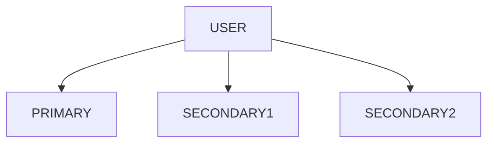

---

# Why Secondary Groups Matter

Example:

```text
Engineering Team

DevOps Team

Security Team
```

Single user may belong to all.

---

# Switching Users

Become another user:

```bash
su - testuser
```

Return:

```bash
exit
```

---

# Lab Task 7

Switch:

```bash
su - testuser
```

Verify:

```bash
whoami
```

Return.

---

# Understanding Root

Most powerful Linux account.

```text
UID 0
```

---

# Verify

```bash
id root
```

Output:

```text
uid=0(root)
```

---

# Why Root Exists

Required for:

```text
System Administration

Package Installation

Service Management

Kernel Operations
```

---

# Root Architecture

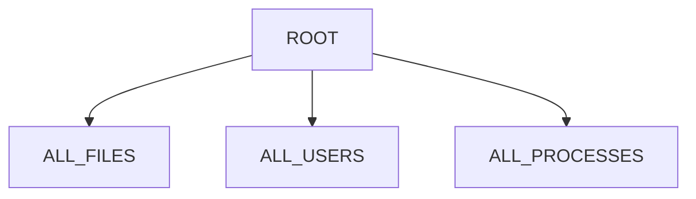

---

# Why Root Is Dangerous

Mistake:

```bash
rm -rf /
```

Potential catastrophe.

---

# Production Principle

```text
Least Privilege
```

Always.

---

# Least Privilege Model

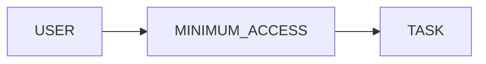

---

# Service Accounts

Check:

```bash
cat /etc/passwd
```

Find:

```text
postgres

redis

nobody

daemon
```

These are not humans.

They are service identities.

---

# Why Services Use Accounts

Security isolation.

Example:

```text
Nginx Breach
```

should not become:

```text
Full System Compromise
```

---

# Service Isolation Architecture

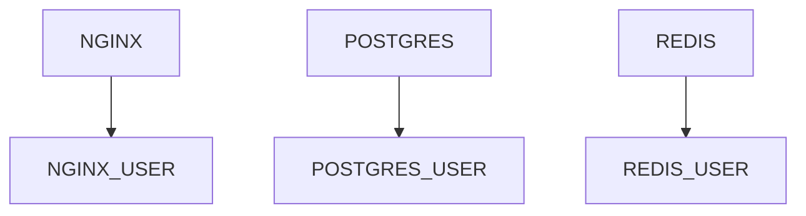

---

# Container Connection

Docker containers run as users.

Bad:

```dockerfile
USER root
```

Better:

```dockerfile
USER appuser
```

---

# Container Security Model

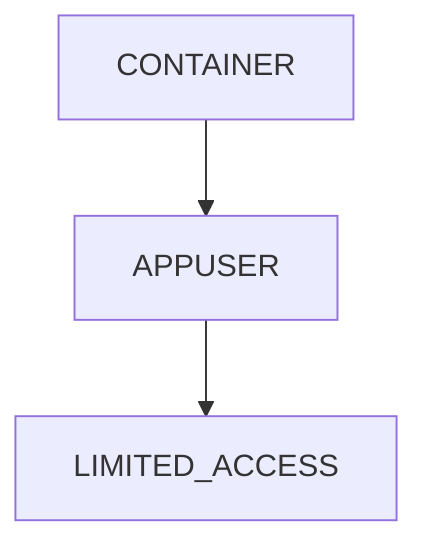

---

# Kubernetes Connection

Pods should avoid:

```text
root
```

Use:

```yaml
securityContext:
  runAsUser: 1000
```

---

# Cloud Connection

Cloud VMs use:

```text
ubuntu

ec2-user

azureuser
```

instead of:

```text
root
```

for security.

---

# Production Scenario

Web server:

```text
Nginx

PostgreSQL

Redis
```

Each runs under:

```text
Different User
```

Benefits:

```text
Isolation

Auditing

Security
```

---

# Guided Challenge

Investigate:

```bash
whoami

id

groups

cat /etc/passwd

cat /etc/group
```

Document findings.

---

# Semi-Guided Challenge

Create:

```text
developer1

developer2

developers group
```

Add users.

Verify memberships.

---

# Independent Challenge

Design user architecture for:

```text
Web Server

Database

Monitoring

Backup Service
```

Assign:

```text
Users

Groups

Privileges
```

---

# Linux Internals Deep Dive

Every process contains:

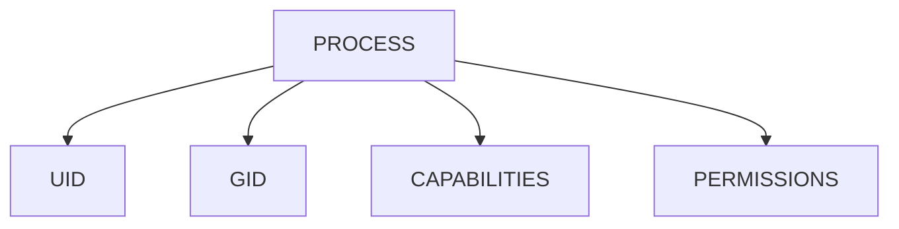

Kernel checks these values for every operation.

---

# Security Considerations

Never:

```text
Run Everything As Root
```

Always:

```text
Use Service Accounts

Use Groups

Apply Least Privilege
```

---

# Performance Considerations

Users themselves do not impact performance.

However:

```text
Poor Privilege Design

Poor Access Design
```

creates operational problems.

---

# Common Mistakes

## Mistake 1

Running applications as root.

---

## Mistake 2

Ignoring groups.

---

## Mistake 3

Sharing accounts.

---

## Mistake 4

Giving sudo to everyone.

---

## Mistake 5

Not auditing users.

---

# Troubleshooting

## Current User

```bash
whoami
```

---

## User Identity

```bash
id
```

---

## User Groups

```bash
groups
```

---

## User Database

```bash
cat /etc/passwd
```

---

## Group Database

```bash
cat /etc/group
```

---

## Switch User

```bash
su - username
```

---

# Engineering Mindset

Beginners think:

```text
Users Log In
```

Engineers think:

```text
Users Are Security Boundaries

Users Are Identities

Users Define Trust Levels
```

Ask:

```text
Who owns this process?

Who owns this file?

Who should access this resource?

What happens if this account is compromised?
```

---

# Interview Questions

### What is UID?

Unique User ID used internally by Linux.

---

### What is GID?

Group ID.

---

### What file stores users?

```text
/etc/passwd
```

---

### What file stores groups?

```text
/etc/group
```

---

### What is UID 0?

```text
root
```

---

### Why use groups?

To simplify permission management.

---

### Why use service accounts?

To isolate applications.

---

### Why avoid running as root?

To reduce security risk.

---

# Cheat Sheet

```bash
whoami

id

groups

cat /etc/passwd

cat /etc/group

sudo useradd username

sudo passwd username

sudo groupadd developers

sudo usermod -aG developers username

su - username
```

---

# Lab Success Criteria

You can complete this lab when you can:

✅ Explain users and groups

✅ Explain UID and GID

✅ Create users

✅ Create groups

✅ Add users to groups

✅ Understand service accounts

✅ Investigate authentication files

✅ Explain root user

✅ Connect users to Docker

✅ Connect users to Kubernetes

✅ Think like a Linux administrator

Congratulations.

You now understand the identity system that powers Linux security and forms the foundation of permissions, authentication, containers, cloud infrastructure, and production systems.
