# Lab 02 – File Permissions

> Users define identity.
>
> Permissions define authority.
>
> Linux security ultimately answers one question:
>
> ```text
> Who Can Do What?
> ```
>
> Every file access, every script execution, every database operation, every container startup, and every cloud workload depends on permissions.
>
> Understanding file permissions is one of the most important skills for Linux administrators, backend engineers, DevOps engineers, cloud engineers, and SREs.

---

# Lab Objective

By the end of this lab you will:

* Understand Linux permission architecture
* Understand Read, Write, Execute
* Understand ownership
* Analyze permission bits
* Use chmod
* Use chown
* Use chgrp
* Understand permission inheritance
* Understand directory permissions
* Connect permissions to containers and cloud systems
* Think like a Linux security engineer

---

# Why This Matters

Imagine:

```text
Database Password File
```

stored on a server.

Permissions:

```text
777
```

Result:

```text
Every User Can Read It

Every User Can Modify It

Every User Can Delete It
```

Security disaster.

Linux prevents this using permissions.

---

# The Problem

Multiple users share a system.

Example:

```text
alice

bob

postgres

nginx

redis
```

Without permissions:

```text
Everyone Accesses Everything
```

Result:

```text
No Security

No Isolation

No Trust
```

---

# Mental Model

Think of a building.

Different rooms:

```text
Server Room

HR Office

Finance Office

Meeting Room
```

Different access rights:

```text
Everyone

Managers

Administrators
```

Linux permissions work the same way.

---

# Security Model

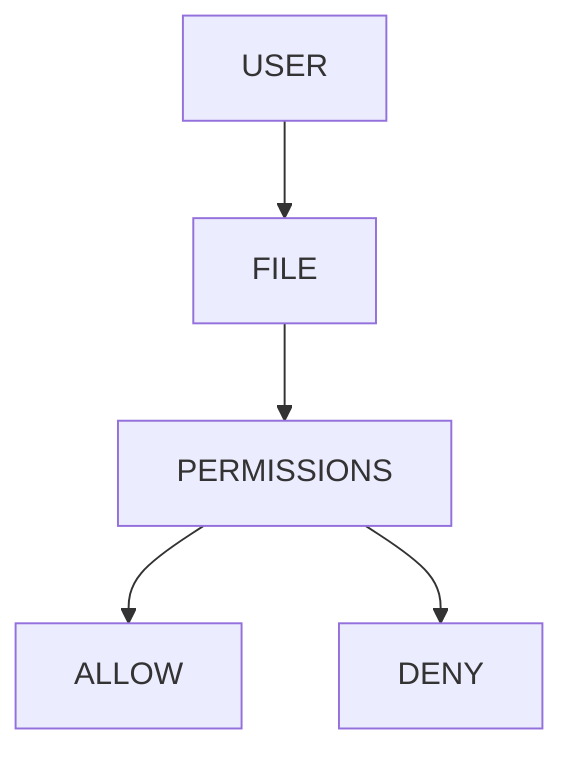

---

# First Principles

Every filesystem object has:

```text
Owner

Group

Permissions
```

Linux checks them before access.

---

# Permission Architecture

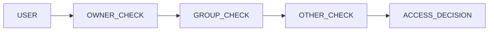

---

# Lab Environment Setup

Create workspace:

```bash
mkdir -p ~/permissions-lab

cd ~/permissions-lab
```

Create files:

```bash
touch file1

touch file2

mkdir project
```

---

# Viewing Permissions

Run:

```bash
ls -l
```

Example:

```text
-rw-r--r-- 1 vip vip 0 Jan 1 12:00 file1
```

---

# Breaking Down Output

```text
-rw-r--r--
```

contains all permission information.

---

# Permission Anatomy

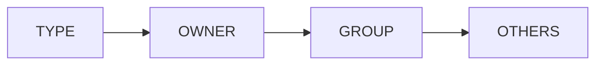

Example:

```text
-rw-r--r--
```

Breakdown:

```text
-

rw-

r--

r--
```

---

# Lab Task 1

Run:

```bash
ls -l
```

Document:

```text
File Type

Owner Permissions

Group Permissions

Other Permissions
```

---

# Understanding File Types

First character:

```text
-
```

means:

```text
Regular File
```

---

Other values:

```text
d = Directory

l = Symlink

c = Character Device

b = Block Device
```

---

# Examples

```bash
ls -ld .

ls -l
```

Observe:

```text
d

-
```

difference.

---

# Permission Categories

Linux evaluates:

```text
Owner

Group

Others
```

---

# Architecture

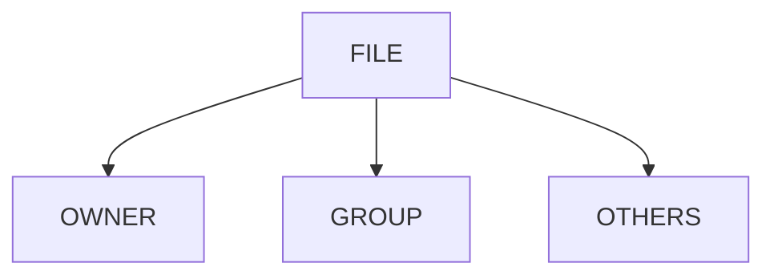

---

# Permission Types

Three permissions exist:

```text
Read

Write

Execute
```

---

# Read Permission

Symbol:

```text
r
```

Value:

```text
4
```

Allows:

```text
View File Contents
```

---

# Write Permission

Symbol:

```text
w
```

Value:

```text
2
```

Allows:

```text
Modify File
```

---

# Execute Permission

Symbol:

```text
x
```

Value:

```text
1
```

Allows:

```text
Execute Program
```

---

# Permission Values

```text
r = 4

w = 2

x = 1
```

Combined:

```text
rwx = 7

rw- = 6

r-x = 5

r-- = 4
```

---

# Numeric Permission Model

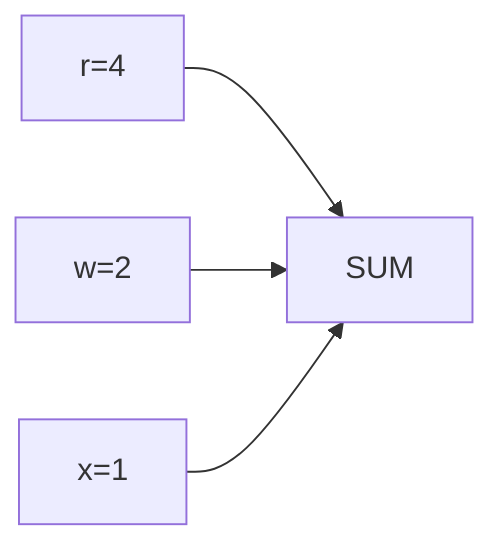

---

# Understanding rw-r--r--

Breakdown:

```text
Owner : rw- = 6

Group : r-- = 4

Other : r-- = 4
```

Numeric:

```text
644
```

---

# Lab Task 2

Inspect:

```bash
ls -l
```

Convert permissions into numeric form.

---

# Using chmod

Change permissions:

```bash
chmod 644 file1
```

Verify:

```bash
ls -l file1
```

---

# Permission Change Workflow

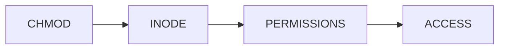

---

# Lab Task 3

Apply:

```bash
chmod 600 file1

chmod 644 file2
```

Verify results.

---

# Understanding Common Permission Sets

### 600

```text
rw-------

Owner Only
```

Used for:

```text
SSH Keys

Secrets

Credentials
```

---

### 644

```text
rw-r--r--
```

Used for:

```text
Configuration Files

Documents
```

---

### 755

```text
rwxr-xr-x
```

Used for:

```text
Scripts

Programs

Directories
```

---

### 700

```text
rwx------
```

Used for:

```text
Private Directories
```

---

# Permission Comparison

| Mode | Meaning           |
| ---- | ----------------- |
| 600  | Private File      |
| 644  | Public Read       |
| 700  | Private Directory |
| 755  | Executable        |
| 777  | Dangerous         |

---

# Why 777 Is Dangerous

```bash
chmod 777 file1
```

Meaning:

```text
Everyone

Can Read

Can Write

Can Execute
```

---

# Security Visualization

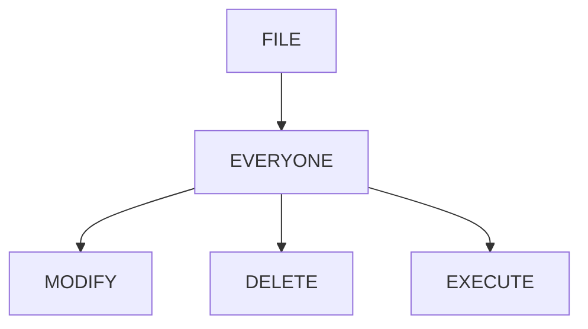

Production systems avoid:

```text
777
```

whenever possible.

---

# Lab Task 4

Experiment:

```bash
chmod 777 file1

ls -l file1
```

Observe.

Then restore:

```bash
chmod 644 file1
```

---

# Understanding Ownership

Every file has:

```text
Owner

Group
```

Display:

```bash
ls -l
```

Example:

```text
vip vip file1
```

---

# Ownership Architecture

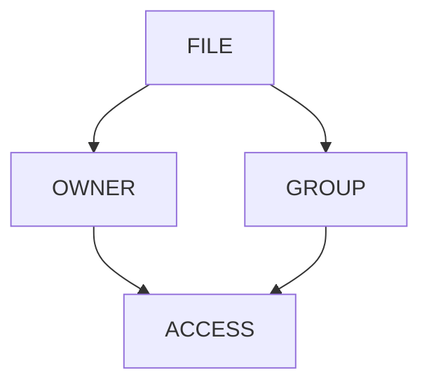

---

# Changing Owner

Use:

```bash
sudo chown testuser file1
```

Verify:

```bash
ls -l file1
```

---

# Changing Group

Use:

```bash
sudo chgrp developers file1
```

Verify:

```bash
ls -l file1
```

---

# Lab Task 5

Create:

```bash
sudo useradd testuser

sudo groupadd developers
```

Apply:

```bash
sudo chown testuser file1

sudo chgrp developers file1
```

Verify ownership.

---

# Directory Permissions

Files and directories behave differently.

---

# Example

Create:

```bash
mkdir secure-dir
```

Inspect:

```bash
ls -ld secure-dir
```

---

# Directory Permission Meaning

Read:

```text
List Contents
```

Write:

```text
Create/Delete Files
```

Execute:

```text
Enter Directory
```

---

# Directory Permission Model

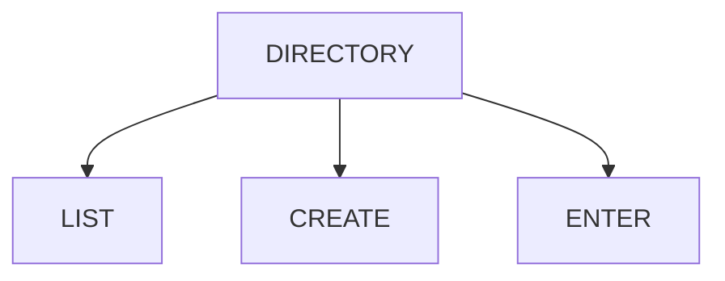

---

# Why Execute Matters

Without execute:

```text
Cannot Enter Directory
```

even if read exists.

---

# Lab Task 6

Create:

```bash
mkdir project

chmod 700 project
```

Test access with another user.

Observe behavior.

---

# Symbolic chmod

Instead of numeric:

```bash
chmod u+x script.sh
```

Meaning:

```text
Add Execute To Owner
```

---

# Common Examples

```bash
chmod u+x script.sh

chmod g+w project.txt

chmod o-r secret.txt

chmod a+r file.txt
```

---

# Visualization

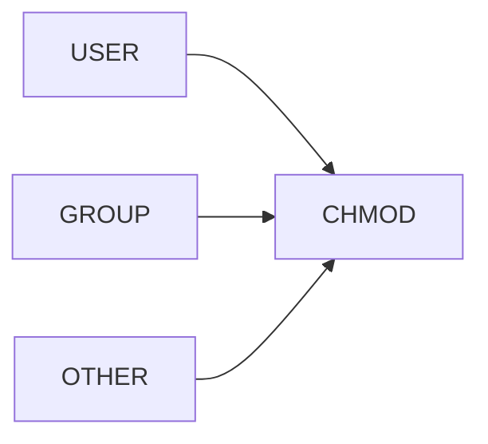

---

# Lab Task 7

Experiment:

```bash
touch script.sh

chmod u+x script.sh

ls -l script.sh
```

Observe permission changes.

---

# Understanding umask

New files inherit default permissions.

Check:

```bash
umask
```

Example:

```text
0022
```

---

# Why?

Linux prevents:

```text
New Files = 777
```

for security.

---

# Permission Creation Flow

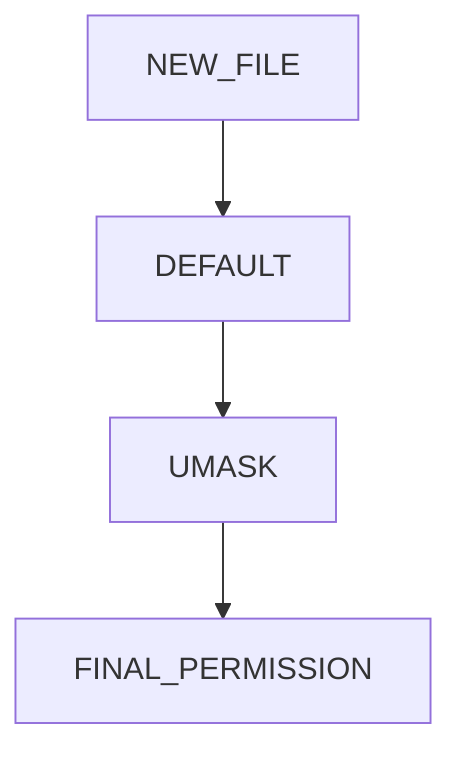

---

# Lab Task 8

Run:

```bash
umask

touch testfile

ls -l testfile
```

Observe defaults.

---

# Service Accounts and Permissions

Applications run under users.

Example:

```text
postgres

nginx

redis
```

Need access only to:

```text
Their Files
```

---

# Service Security Architecture

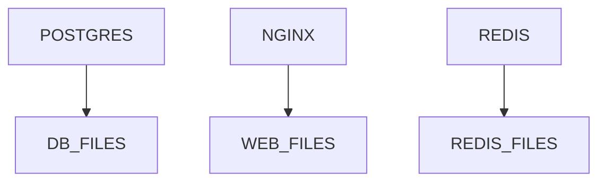

---

# Why This Matters

Compromised service:

```text
Should Not Access

Other Services
```

---

# Production Example

PostgreSQL data:

```text
/var/lib/postgresql
```

Ownership:

```text
postgres:postgres
```

Permissions:

```text
700
```

---

# Docker Connection

Containers should run as:

```text
appuser
```

not:

```text
root
```

Permissions protect:

```text
Volumes

Secrets

Configurations
```

---

# Container Permission Model

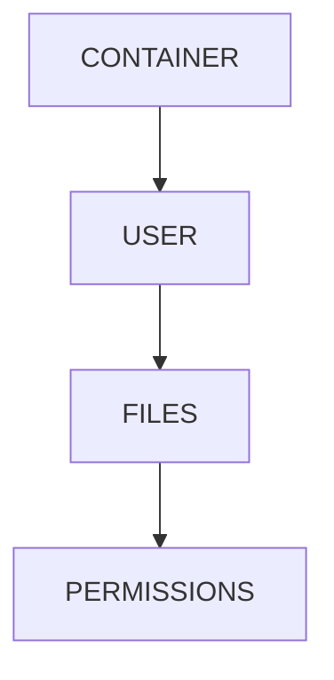

---

# Kubernetes Connection

Security context:

```yaml
securityContext:
  runAsUser: 1000
```

Controls filesystem access.

---

# Cloud Connection

Cloud VMs use:

```text
ubuntu

ec2-user

azureuser
```

Combined with permissions for isolation.

---

# Guided Challenge

Investigate:

```bash
ls -l

chmod

chown

chgrp
```

Document effects.

---

# Semi-Guided Challenge

Create:

```text
Private File

Shared File

Executable Script
```

Apply correct permissions.

---

# Independent Challenge

Design permissions for:

```text
Web Server

Database

Backup Service

Developers Group
```

Determine:

```text
Owner

Group

Permissions
```

for each.

---

# Linux Internals Deep Dive

Every file access:

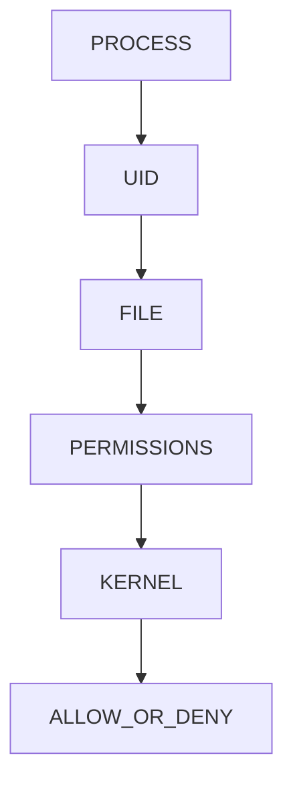

Kernel performs this check continuously.

---

# Security Considerations

Never:

```text
777 Everything
```

Always:

```text
Least Privilege
```

---

# Least Privilege Model

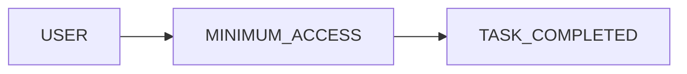

---

# Performance Considerations

Permission checks are extremely fast.

However:

```text
Poor Ownership

Poor Security Design
```

creates operational complexity.

---

# Common Mistakes

## Mistake 1

Using 777.

---

## Mistake 2

Running applications as root.

---

## Mistake 3

Incorrect ownership.

---

## Mistake 4

Ignoring group permissions.

---

## Mistake 5

Not understanding directory execute permission.

---

# Troubleshooting

## View Permissions

```bash
ls -l
```

---

## Change Permissions

```bash
chmod
```

---

## Change Owner

```bash
chown
```

---

## Change Group

```bash
chgrp
```

---

## Check Identity

```bash
id
```

---

# Engineering Mindset

Beginners think:

```text
Can I open this file?
```

Engineers think:

```text
Who Owns This?

Who Should Access It?

What Happens If This Account Is Compromised?

Are Permissions Too Broad?
```

---

# Interview Questions

### What does chmod do?

Changes permissions.

---

### What does chown do?

Changes owner.

---

### What does chgrp do?

Changes group.

---

### What does 755 mean?

```text
rwxr-xr-x
```

---

### What does 644 mean?

```text
rw-r--r--
```

---

### Why is 777 dangerous?

Everyone can modify the file.

---

### What does execute mean on directories?

Allows entering/traversing the directory.

---

### What principle should guide permissions?

```text
Least Privilege
```

---

# Cheat Sheet

```bash
ls -l

chmod 644 file

chmod 755 script.sh

chmod u+x script.sh

chown user file

chgrp group file

id

groups

umask

ls -ld directory
```

---

# Lab Success Criteria

You can complete this lab when you can:

✅ Explain Linux permissions

✅ Explain rwx

✅ Convert symbolic to numeric permissions

✅ Use chmod

✅ Use chown

✅ Use chgrp

✅ Understand directory permissions

✅ Understand ownership

✅ Apply least privilege

✅ Connect permissions to containers

✅ Think like a Linux security engineer

Congratulations.

You now understand the authorization system that protects Linux systems, cloud infrastructure, containers, databases, and production workloads from unauthorized access.
