# Lab 03 – Directory Permissions

> Most Linux beginners think:
>
> ```text
> File Permissions = Security
> ```
>
> But experienced Linux engineers know:
>
> ```text
> Directory Permissions
> Control The Entire Filesystem
> ```
>
> In production systems:
>
> * Databases store data in directories
> * Docker stores images in directories
> * Kubernetes mounts volumes as directories
> * Applications write logs to directories
> * User home folders are directories
>
> Understanding directory permissions is critical for Linux administration, DevOps, cloud engineering, platform engineering, and security.

---

# Lab Objective

By the end of this lab you will:

* Understand directory permission behavior
* Understand Read, Write, Execute on directories
* Understand traversal permissions
* Investigate real filesystem behavior
* Use chmod with directories
* Understand shared directories
* Understand sticky bit
* Understand production directory layouts
* Connect directory permissions to Docker and Kubernetes
* Think like a Linux security engineer

---

# Why This Matters

Imagine:

```text
/var/lib/postgresql
```

contains:

```text
Production Database
```

What happens if:

```text
Everyone Has Write Access?
```

Result:

```text
Database Corruption

Security Breach

Production Outage
```

Directory permissions prevent this.

---

# The Problem

Files live inside directories.

Example:

```text
project/

├── app.js
├── config.env
└── database.sql
```

Question:

```text
Can Users Access These Files?
```

Answer depends not only on file permissions but also:

```text
Directory Permissions
```

---

# Mental Model

Think of a building.

Files:

```text
Rooms
```

Directory:

```text
Hallway
```

Even if a room is unlocked:

```text
Cannot Enter Room

If Hallway Is Locked
```

---

# First Principles

Every filesystem object has permissions.

Files:

```text
Control Content Access
```

Directories:

```text
Control Navigation

Control Visibility

Control Creation

Control Deletion
```

---

# Files vs Directories

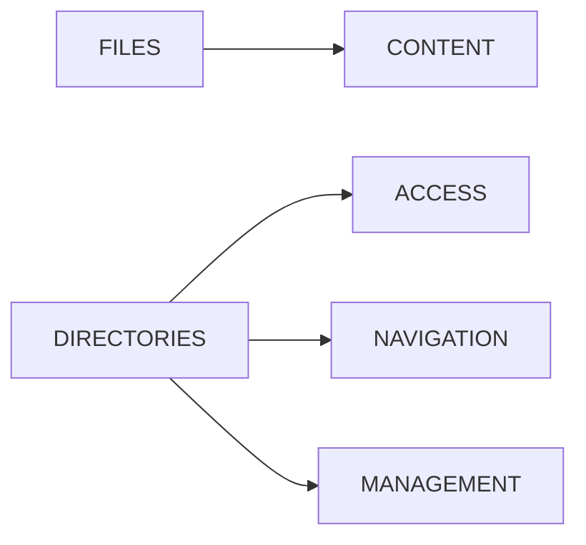

---

# Lab Environment Setup

Create workspace:

```bash
mkdir -p ~/directory-permissions-lab

cd ~/directory-permissions-lab
```

Create test structure:

```bash
mkdir project

touch project/file1

touch project/file2
```

---

# Viewing Directory Permissions

Run:

```bash
ls -ld project
```

Example:

```text
drwxr-xr-x
```

Notice:

```text
d
```

means:

```text
Directory
```

---

# Permission Anatomy

Example:

```text
drwxr-xr-x
```

Breakdown:

```text
d

rwx

r-x

r-x
```

---

# Visualization

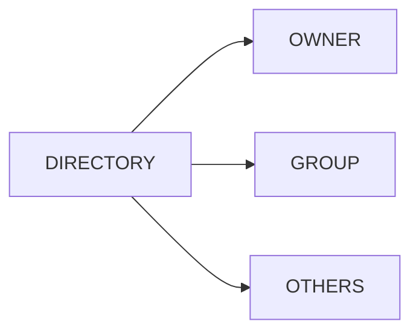

---

# Lab Task 1

Inspect:

```bash
ls -ld project
```

Answer:

```text
Who owns it?

What permissions exist?
```

---

# Understanding Read Permission

Directory Read:

```text
r
```

Value:

```text
4
```

Allows:

```text
Listing Directory Contents
```

Example:

```bash
ls project
```

---

# Read Permission Visualization


---

# Lab Task 2

Create:

```bash
mkdir read-test

touch read-test/file1

touch read-test/file2
```

Apply:

```bash
chmod 400 read-test
```

Try:

```bash
ls read-test
```

Observe results.

---

# Understanding Write Permission

Directory Write:

```text
w
```

Value:

```text
2
```

Allows:

```text
Create Files

Delete Files

Rename Files
```

inside directory.

---

# Important Discovery

Write permission on directory:

```text
Does NOT Mean

Modify File Content
```

It means:

```text
Modify Directory Entries
```

---

# Directory Write Visualization

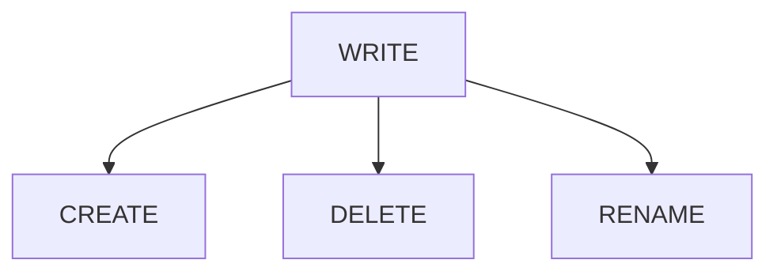

---

# Lab Task 3

Create:

```bash
mkdir write-test

chmod 700 write-test
```

Create file:

```bash
touch write-test/demo.txt
```

Observe.

---

# Understanding Execute Permission

Most misunderstood permission.

Directory Execute:

```text
x
```

Value:

```text
1
```

Allows:

```text
Enter Directory

Traverse Directory

Access Files By Name
```

---

# Why Execute Matters

Without execute:

```text
Cannot Enter Directory
```

even if read exists.

---

# Directory Traversal Model

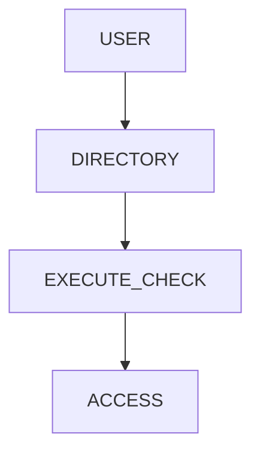

---

# Example

Create:

```bash
mkdir execute-test

touch execute-test/file.txt
```

Apply:

```bash
chmod 600 execute-test
```

Try:

```bash
cd execute-test
```

Result:

```text
Permission Denied
```

---

# Lab Task 4

Experiment:

```bash
mkdir execute-test

chmod 600 execute-test

cd execute-test
```

Observe behavior.

---

# The Famous Directory Matrix

Directory permissions behave differently than files.

---

## Read Only

```text
r--
```

Can:

```text
List Names
```

Cannot:

```text
Enter Directory
```

---

## Execute Only

```text
--x
```

Can:

```text
Enter Directory

Access Known Files
```

Cannot:

```text
List Contents
```

---

## Read + Execute

```text
r-x
```

Can:

```text
List Contents

Enter Directory
```

Cannot:

```text
Create/Delete Files
```

---

## Read + Write + Execute

```text
rwx
```

Full Control.

---

# Permission Matrix

| Permission | List | Enter | Create | Delete |
| ---------- | ---- | ----- | ------ | ------ |
| r--        | Yes  | No    | No     | No     |
| --x        | No   | Yes   | No     | No     |
| r-x        | Yes  | Yes   | No     | No     |
| rwx        | Yes  | Yes   | Yes    | Yes    |

---

# Deep Dive Example

Create:

```bash
mkdir matrix

touch matrix/file1
```

Experiment:

```bash
chmod 400 matrix

chmod 100 matrix

chmod 500 matrix

chmod 700 matrix
```

Observe behavior.

---

# Lab Task 5

Create a permission matrix table from your experiments.

---

# Why File Permissions Alone Are Not Enough

Example:

File:

```text
-rw-rw-rw-
```

Directory:

```text
d---------
```

Result:

```text
Cannot Access File
```

Why?

Because directory blocks traversal.

---

# Access Flow

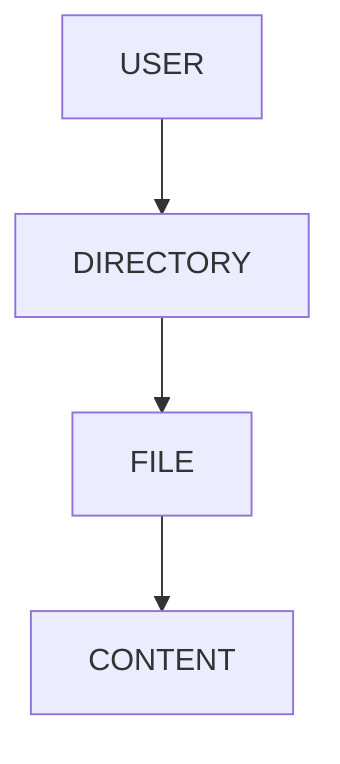

Directory access is checked first.

---

# Production Example

Home directories:

```text
/home/alice

/home/bob
```

Permissions:

```text
700
```

Commonly used.

---

# Why?

Users should not browse each other's files.

---

# Home Directory Architecture

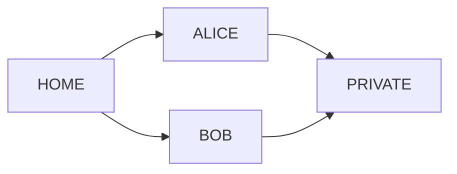

---

# Shared Team Directories

Example:

```text
/opt/project
```

Used by:

```text
Developers Group
```

Permissions:

```text
770
```

Meaning:

```text
Owner + Group Access

Others Denied
```

---

# Shared Directory Architecture

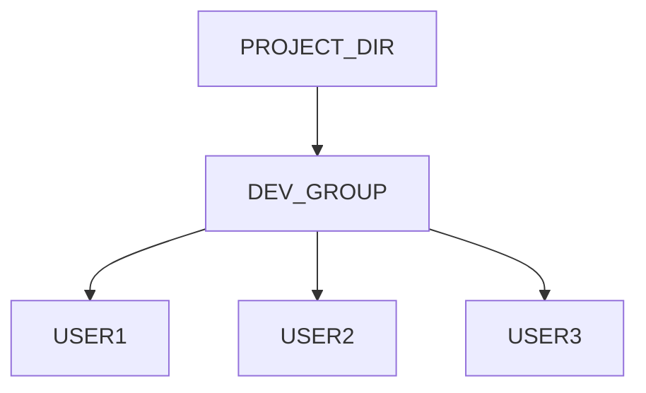

---

# Lab Task 6

Create:

```bash
sudo groupadd developers

mkdir shared

sudo chgrp developers shared

chmod 770 shared
```

Verify behavior.

---

# The Sticky Bit

One of Linux's most important directory features.

---

# Problem

Shared directory:

```text
/tmp
```

Many users write files.

Without protection:

```text
Users Could Delete Each Other's Files
```

---

# Solution

Sticky Bit.

---

# View Example

```bash
ls -ld /tmp
```

Output:

```text
drwxrwxrwt
```

Notice:

```text
t
```

---

# Sticky Bit Meaning

Users may:

```text
Create Files
```

But can only delete:

```text
Their Own Files
```

---

# Sticky Bit Visualization

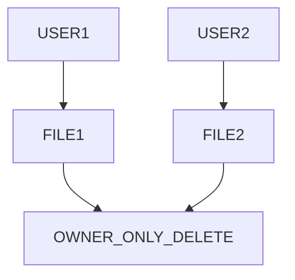

---

# Lab Task 7

Create:

```bash
mkdir sticky-demo

chmod 1777 sticky-demo
```

Inspect:

```bash
ls -ld sticky-demo
```

Observe:

```text
t
```

---

# Why /tmp Uses Sticky Bit

```text
Shared Access

Safe Deletion

Multi-User Protection
```

---

# Production Examples

### /tmp

```text
1777
```

---

### User Home

```text
700
```

---

### Web Content

```text
755
```

---

### Shared Team Folder

```text
770
```

---

# Common Directory Permission Layouts

| Permission | Usage               |
| ---------- | ------------------- |
| 700        | Private Directory   |
| 755        | Public Read         |
| 770        | Team Shared         |
| 777        | Unsafe              |
| 1777       | Shared + Sticky Bit |

---

# Docker Connection

Docker volumes are directories.

Example:

```text
/var/lib/docker
```

Permissions determine:

```text
Container Access
```

---

# Docker Storage Model

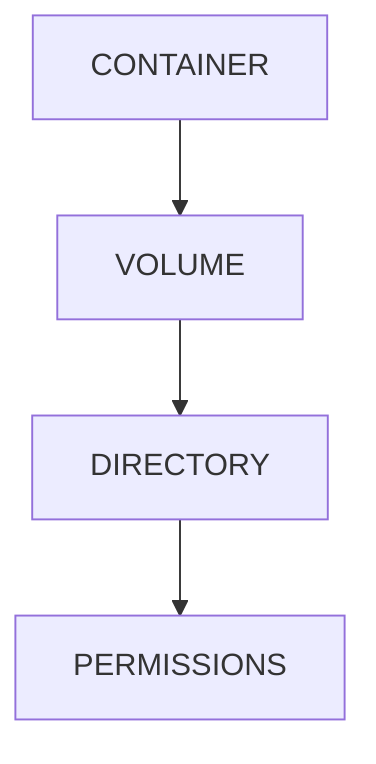

---

# Kubernetes Connection

Persistent Volumes become:

```text
Mounted Directories
```

Permissions control:

```text
Pod Access
```

---

# Kubernetes Example

```yaml
securityContext:
  runAsUser: 1000
  fsGroup: 1000
```

Controls directory ownership.

---

# Kubernetes Storage Architecture

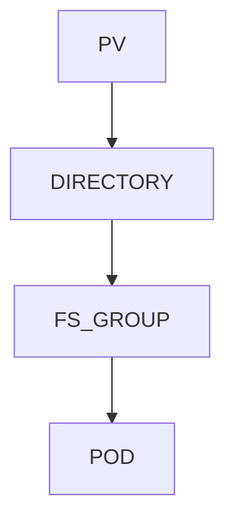

---

# Cloud Connection

Cloud VMs rely heavily on:

```text
Directory Isolation
```

for:

```text
Applications

Logs

Backups

Data
```

---

# Production Scenario

SaaS Application:

```text
/var/www/app

/var/log/app

/var/lib/postgresql
```

Each directory:

```text
Different Owner

Different Permissions
```

---

# Storage Isolation Architecture

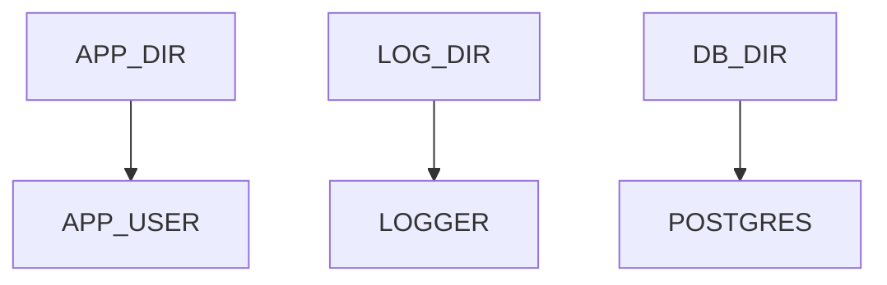

---

# Guided Challenge

Investigate:

```bash
ls -ld

chmod

mkdir

cd
```

Document permission effects.

---

# Semi-Guided Challenge

Create:

```text
Private Directory

Shared Directory

Sticky Directory
```

Apply correct permissions.

---

# Independent Challenge

Design directory layout for:

```text
Web Server

Database

Logs

Backups
```

Define:

```text
Ownership

Permissions

Groups
```

---

# Linux Internals Deep Dive

Directory is actually:

```text
Mapping

Filename → Inode
```

Example:

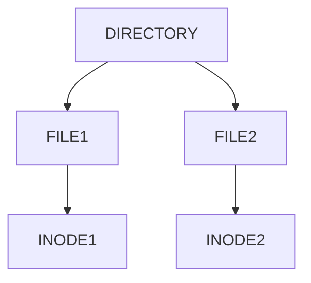

Write permission modifies:

```text
Directory Entries
```

not file content.

---

# Performance Considerations

Large directories can create:

```text
Metadata Overhead

Slow Lookups

Cache Pressure
```

Especially:

```text
Millions Of Files
```

in one directory.

---

# Security Considerations

Avoid:

```text
777
```

Use:

```text
Least Privilege
```

Always.

---

# Common Mistakes

## Mistake 1

Thinking file permissions are enough.

---

## Mistake 2

Ignoring execute permission.

---

## Mistake 3

Using 777.

---

## Mistake 4

Not using sticky bit.

---

## Mistake 5

Sharing sensitive directories.

---

# Troubleshooting

## View Directory Permissions

```bash
ls -ld directory
```

---

## Change Permissions

```bash
chmod 755 directory
```

---

## Change Owner

```bash
chown user directory
```

---

## Change Group

```bash
chgrp group directory
```

---

## View Sticky Bit

```bash
ls -ld /tmp
```

---

# Engineering Mindset

Beginners think:

```text
Can I Open This File?
```

Engineers think:

```text
Can I Reach This File?

Can I Traverse Directories?

Can I Create Entries?

Can I Delete Entries?

Can I Protect Shared Data?
```

---

# Interview Questions

### What does read permission on a directory do?

Allows listing contents.

---

### What does write permission on a directory do?

Allows creating, deleting, and renaming entries.

---

### What does execute permission on a directory do?

Allows traversal and access.

---

### What is the sticky bit?

Prevents users from deleting files they do not own in shared directories.

---

### Why does /tmp use 1777?

Shared access with protected deletion.

---

### What permission is commonly used for home directories?

```text
700
```

---

### What permission is commonly used for web content?

```text
755
```

---

### Why is directory execute permission important?

Without it, traversal is impossible.

---

# Cheat Sheet

```bash
ls -ld directory

chmod 755 directory

chmod 700 directory

chmod 770 directory

chmod 1777 directory

chown user directory

chgrp group directory

mkdir test

cd test

pwd
```

---

# Lab Success Criteria

You can complete this lab when you can:

✅ Explain directory permissions

✅ Explain directory read permission

✅ Explain directory write permission

✅ Explain directory execute permission

✅ Explain traversal

✅ Understand sticky bit

✅ Design shared directories

✅ Design secure home directories

✅ Connect permissions to Docker volumes

✅ Connect permissions to Kubernetes storage

✅ Think like a Linux security engineer

Congratulations.

You now understand one of the most misunderstood topics in Linux and a foundational concept behind filesystem security, container storage, cloud infrastructure, and production system design.
