# Lab 04 – Umask Analysis

> Every Linux engineer eventually asks:
>
> ```text
> Why was this file created with 644?
>
> Why wasn't it 777?
>
> Why are new directories 755?
>
> Why do Kubernetes volumes sometimes have strange permissions?
>
> Why do containers create files with unexpected ownership?
> ```
>
> The answer often lies in one small but extremely important Linux concept:
>
> ```text
> umask
> ```
>
> Most engineers know the command.
>
> Few understand how deeply it influences Linux security.
>
> This lab teaches umask from first principles and connects it to production systems, Docker, Kubernetes, cloud infrastructure, and Linux security engineering.

---

# Lab Objective

By the end of this lab you will:

* Understand why umask exists
* Understand default file permissions
* Understand default directory permissions
* Calculate umask values
* Investigate real filesystem behavior
* Modify umask safely
* Understand system-wide umask settings
* Connect umask to containers
* Connect umask to Kubernetes
* Think like a Linux security engineer

---

# Why This Matters

Imagine a production server.

An application creates:

```text
database-backup.sql
```

Without protection:

```text
-rwxrwxrwx
```

Everyone could:

```text
Read

Modify

Delete
```

The backup.

Security disaster.

Linux solves this using:

```text
umask
```

---

# The Problem

When a process creates:

```text
New File

New Directory
```

Linux must answer:

```text
What Permissions Should It Receive?
```

Granting:

```text
777
```

to everything would be dangerous.

Granting:

```text
000
```

would make files unusable.

Linux needs a balance.

---

# Mental Model

Think of a company.

Every new employee receives:

```text
Office Access

Email Access

Building Access
```

But not:

```text
CEO Access

Payroll Access

Datacenter Access
```

By default.

umask works similarly.

---

# First Principles

Every newly created object starts with a maximum permission.

Files:

```text
666
```

Directories:

```text
777
```

Then:

```text
umask removes permissions
```

---

# Core Formula

```text
Default Permission
-
umask
=
Final Permission
```

---

# Permission Creation Architecture

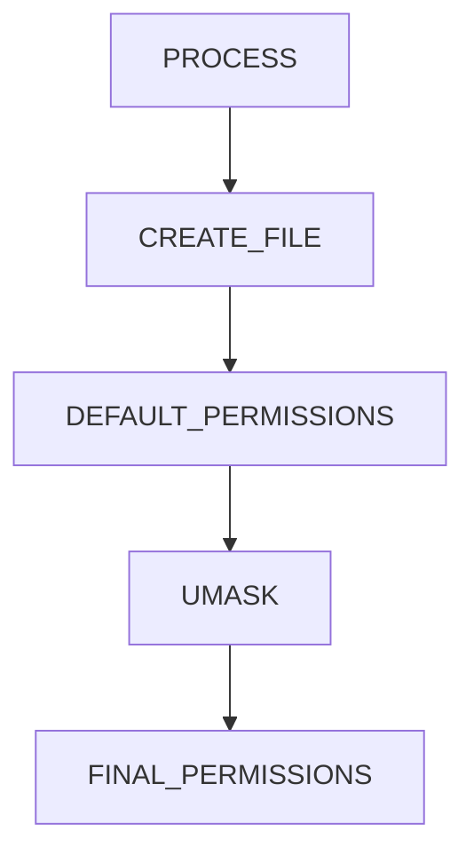

---

# Why Files Start At 666

Files normally do not need:

```text
Execute Permission
```

Example:

```text
notes.txt
```

should not automatically become executable.

Thus:

```text
666
```

is the starting point.

---

# Why Directories Start At 777

Directories require:

```text
Read

Write

Execute
```

to function properly.

Thus:

```text
777
```

is the starting point.

---

# Default Creation Model

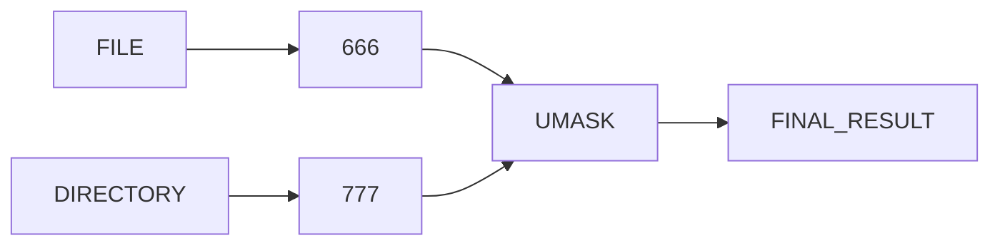

---

# Lab Environment Setup

Create workspace:

```bash
mkdir -p ~/umask-lab

cd ~/umask-lab
```

---

# Viewing Current Umask

Check:

```bash
umask
```

Example:

```text
0022
```

---

# Alternative View

```bash
umask -S
```

Example:

```text
u=rwx,g=rx,o=rx
```

---

# Lab Task 1

Run:

```bash
umask

umask -S
```

Record output.

---

# Understanding Umask 022

Most common Linux value.

```text
022
```

means:

```text
Owner loses nothing

Group loses write

Others lose write
```

---

# Calculation

File:

```text
666
-
022
=
644
```

Directory:

```text
777
-
022
=
755
```

---

# Visualization

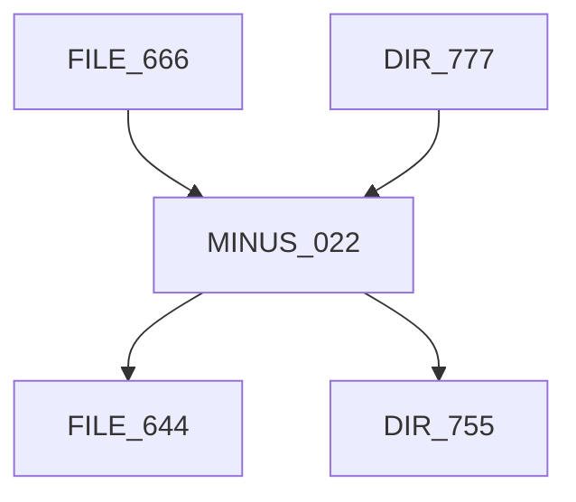

---

# Lab Task 2

Verify experimentally.

Create:

```bash
touch test-file

mkdir test-dir
```

Inspect:

```bash
ls -ld test-file test-dir
```

Expected:

```text
644

755
```

(on most systems)

---

# Understanding Permission Removal

Important:

```text
umask does NOT add permissions
```

It only:

```text
Removes Permissions
```

---

# Wrong Mental Model

```text
umask = permissions
```

Wrong.

---

# Correct Mental Model

```text
umask = permissions removed
```

Correct.

---

# Permission Flow

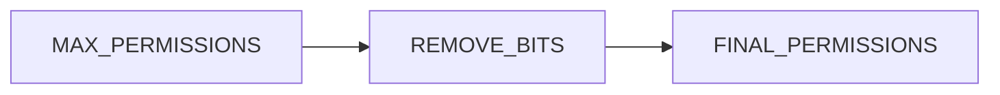

---

# Common Umask Values

| Umask | Files | Directories |
| ----- | ----- | ----------- |
| 022   | 644   | 755         |
| 027   | 640   | 750         |
| 077   | 600   | 700         |
| 002   | 664   | 775         |

---

# Understanding Umask 077

Most restrictive.

```text
077
```

Calculation:

File:

```text
666 - 077 = 600
```

Directory:

```text
777 - 077 = 700
```

---

# Result

Only owner can access.

Useful for:

```text
SSH Keys

Secrets

Credentials

Sensitive Data
```

---

# Security Visualization

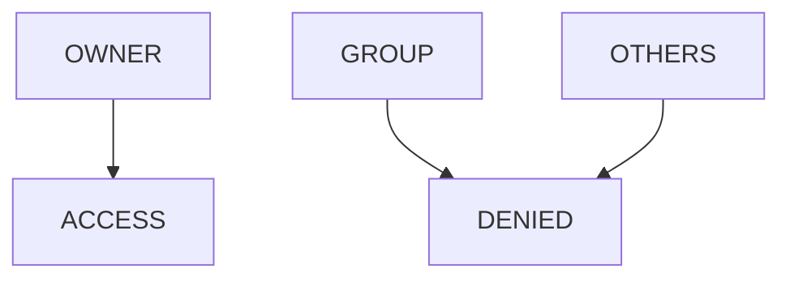

---

# Lab Task 3

Temporarily change:

```bash
umask 077
```

Create:

```bash
touch secret.txt

mkdir secret-dir
```

Inspect:

```bash
ls -ld secret.txt secret-dir
```

Observe:

```text
600

700
```

---

# Understanding Umask 002

Common in collaborative environments.

Calculation:

File:

```text
666 - 002 = 664
```

Directory:

```text
777 - 002 = 775
```

---

# Why Teams Use It

Allows:

```text
Group Collaboration
```

without giving access to others.

---

# Team Collaboration Model

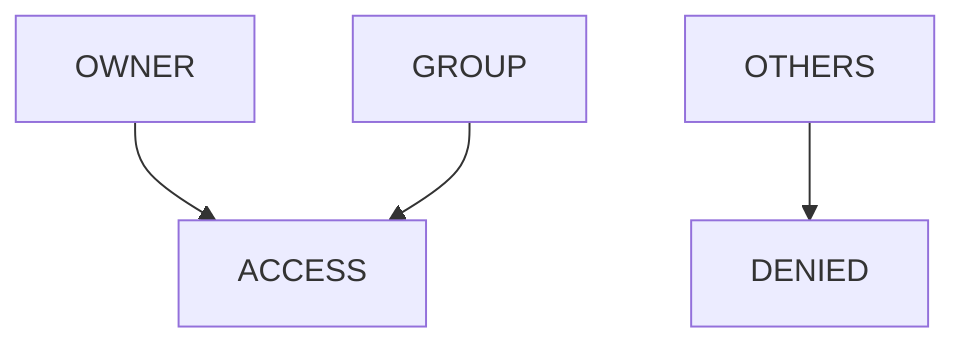

---

# Lab Task 4

Try:

```bash
umask 002

touch team-file

mkdir team-dir

ls -ld team-file team-dir
```

Analyze results.

---

# How Processes Use Umask

Every process inherits:

```text
Parent Process Umask
```

---

# Process Flow

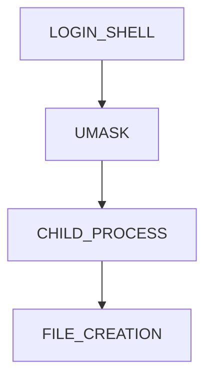

---

# Why This Matters

Applications:

```text
Nginx

PostgreSQL

Docker

Java Apps

Node.js Apps
```

inherit umask settings.

---

# Production Incident Example

Node.js application creates:

```text
uploads/
```

Unexpected permissions:

```text
700
```

Result:

```text
Web Server Cannot Read Uploads
```

Root cause:

```text
Incorrect Umask
```

---

# Investigating Process Umask

Current shell:

```bash
cat /proc/$$/status | grep Umask
```

Example:

```text
Umask: 0022
```

---

# Lab Task 5

Run:

```bash
cat /proc/$$/status | grep Umask
```

Observe process-level configuration.

---

# Understanding System-Wide Umask

Linux can configure defaults globally.

Common locations:

```text
/etc/profile

/etc/bash.bashrc

/etc/login.defs
```

---

# Architecture

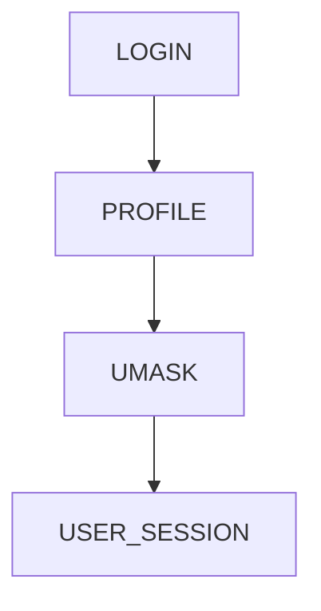

---

# Investigating System Defaults

Check:

```bash
grep UMASK /etc/login.defs
```

---

# Lab Task 6

Inspect:

```bash
grep UMASK /etc/login.defs
```

Document findings.

---

# User-Specific Umask

Users may override defaults.

Example:

```bash
echo "umask 077" >> ~/.bashrc
```

---

# User Override Flow

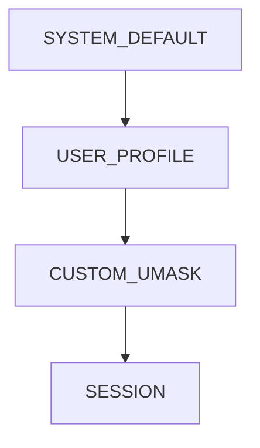

---

# Security Use Cases

---

## SSH Keys

Permissions:

```text
600
```

Why?

Private keys must remain private.

---

## Secrets

Permissions:

```text
600
```

Common.

---

## Shared Projects

Permissions:

```text
664

775
```

Common.

---

# Security Architecture

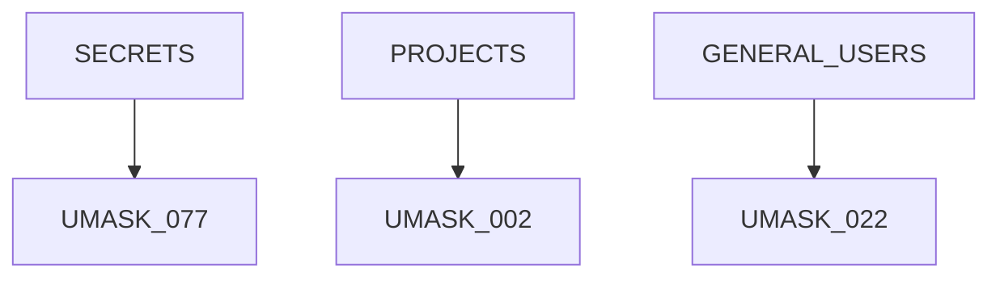

---

# Docker Connection

Containers inherit process umask.

Example:

```dockerfile
RUN umask 002
```

Applications create files accordingly.

---

# Container File Creation Flow

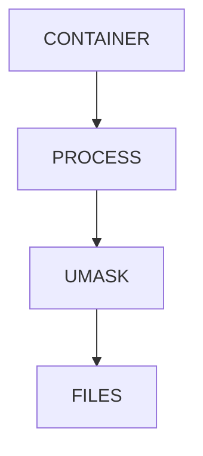

---

# Docker Volume Problem

Container creates:

```text
data.db
```

with:

```text
600
```

Host application expects:

```text
664
```

Permission issues appear.

---

# Kubernetes Connection

Pods create:

```text
Logs

Uploads

Cache Files

Secrets
```

All affected by:

```text
Process Umask
```

---

# Kubernetes Storage Architecture

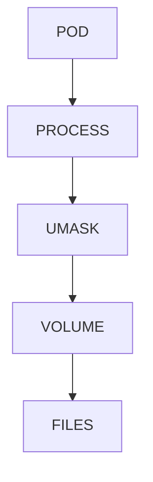

---

# Cloud Connection

Cloud VMs:

```text
EC2

Azure VM

Compute Engine
```

all use Linux umask behavior.

---

# Real Production Scenario

Shared application server:

```text
20 Developers

Shared Deployment Directory
```

Wrong umask:

```text
077
```

Result:

```text
Deployment Failures
```

because teammates cannot access files.

---

# Shared Deployment Architecture

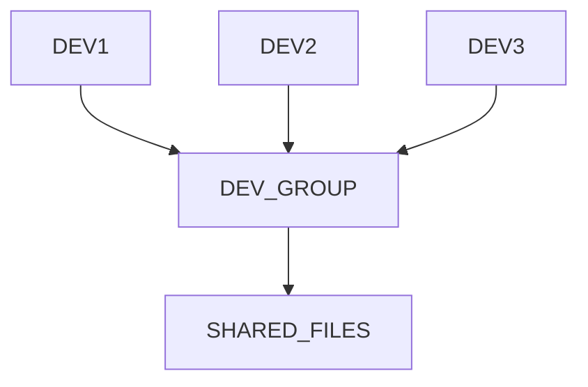

---

# Guided Challenge

Perform:

```bash
umask

touch file1

mkdir dir1

ls -ld file1 dir1
```

Document results.

---

# Semi-Guided Challenge

Test:

```text
022

027

077

002
```

Create files after each.

Record permissions.

---

# Independent Challenge

Create a permission matrix:

| Umask | File Result | Directory Result |
| ----- | ----------- | ---------------- |

Fill using experimentation.

---

# Linux Internals Deep Dive

System call:

```c
open()
mkdir()
creat()
```

eventually triggers:

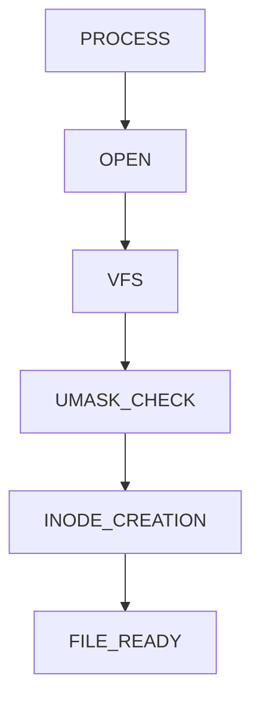

Kernel applies umask during inode creation.

---

# Performance Considerations

umask itself is:

```text
Extremely Cheap
```

No significant performance impact.

Its importance is:

```text
Security

Operations

Collaboration
```

---

# Security Considerations

Bad umask causes:

```text
Information Disclosure

Unauthorized Modification

Privilege Escalation Risks
```

---

# Common Mistakes

## Mistake 1

Thinking umask adds permissions.

---

## Mistake 2

Using 000.

Dangerous.

---

## Mistake 3

Using 077 in collaborative environments.

---

## Mistake 4

Ignoring container umask.

---

## Mistake 5

Not checking inherited umask.

---

# Troubleshooting

## Current Umask

```bash
umask
```

---

## Symbolic View

```bash
umask -S
```

---

## Process Umask

```bash
cat /proc/$$/status | grep Umask
```

---

## Login Defaults

```bash
grep UMASK /etc/login.defs
```

---

## Verify Results

```bash
touch file

mkdir dir

ls -ld file dir
```

---

# Engineering Mindset

Beginners think:

```text
Why Are New Files 644?
```

Engineers think:

```text
What Security Policy Produced These Permissions?

What Umask Is Active?

What Process Created This File?

Is This Appropriate For Production?
```

---

# Interview Questions

### What is umask?

A permission mask that removes permissions from newly created files and directories.

---

### Does umask add permissions?

No.

It only removes permissions.

---

### What permissions do files start with?

```text
666
```

---

### What permissions do directories start with?

```text
777
```

---

### What does umask 022 produce?

```text
Files: 644

Directories: 755
```

---

### What does umask 077 produce?

```text
Files: 600

Directories: 700
```

---

### Why is umask important?

Controls default security.

---

### How can you view current umask?

```bash
umask
```

---

# Cheat Sheet

```bash
umask

umask -S

umask 022

umask 027

umask 077

umask 002

touch file

mkdir dir

ls -ld file dir

cat /proc/$$/status | grep Umask

grep UMASK /etc/login.defs
```

---

# Lab Success Criteria

You can complete this lab when you can:

✅ Explain why umask exists

✅ Calculate permission results

✅ Understand default file permissions

✅ Understand default directory permissions

✅ Analyze real-world umask behavior

✅ Configure temporary umask values

✅ Investigate system-wide defaults

✅ Connect umask to containers

✅ Connect umask to Kubernetes

✅ Think like a Linux security engineer

Congratulations.

You now understand one of the most important hidden mechanisms in Linux security.

Every file created by every process on every Linux server passes through the umask system, making it a foundational concept for Linux administration, cloud engineering, platform engineering, container security, and production operations.
