# Lab 05 – SetUID and SetGID

> Linux security is built on a simple principle:
>
> ```text
> Users Should Only Have The Permissions They Need
> ```
>
> But what happens when a normal user needs to perform a task that requires elevated privileges?
>
> Example:
>
> ```text
> Change Password
>
> Access Shared Team Directories
>
> Run Administrative Utilities
> ```
>
> Linux solves this problem using:
>
> ```text
> SetUID
>
> SetGID
> ```
>
> These are among the most powerful—and most dangerous—features in Linux.
>
> Misconfigured SetUID programs have caused some of the largest privilege escalation vulnerabilities in Linux history.
>
> Understanding them is essential for:
>
> * Linux Administrators
> * DevOps Engineers
> * Security Engineers
> * Cloud Engineers
> * Platform Engineers
> * SREs

---

# Lab Objective

By the end of this lab you will:

* Understand why SetUID exists
* Understand why SetGID exists
* Investigate privilege escalation
* Understand effective user IDs
* Understand effective group IDs
* Analyze real SetUID programs
* Investigate SetGID directories
* Understand security implications
* Connect SetUID to containers and cloud systems
* Think like a Linux security engineer

---

# Why This Matters

Consider:

```text
/etc/shadow
```

Stores:

```text
User Password Hashes
```

Permissions:

```bash
ls -l /etc/shadow
```

Example:

```text
-rw------- root root
```

Only root can modify it.

---

Now ask:

```text
How Can A Normal User Change Their Password?
```

They cannot write:

```text
/etc/shadow
```

directly.

Yet:

```bash
passwd
```

works.

Why?

The answer:

```text
SetUID
```

---

# The Problem

Linux normally executes programs as:

```text
The User Running Them
```

Example:


But some programs require:

```text
Temporary Elevated Access
```

without giving users full root privileges.

---

# Mental Model

Think of a bank.

A customer:

```text
Cannot Open The Vault
```

directly.

But:

```text
Authorized Bank Employee
```

can access the vault on their behalf.

SetUID works similarly.

---

# First Principles

Normally:

```text
Process UID
=
User UID
```

Example:

```bash
id
```

Output:

```text
uid=1000(vip)
```

Programs run as:

```text
UID 1000
```

---

# Normal Execution Model

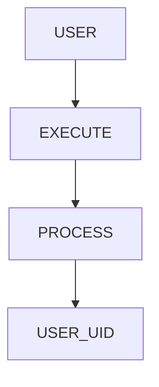

---

# Understanding Real UID

Every process has:

```text
Real UID
```

Meaning:

```text
Who Started The Process
```

---

# Understanding Effective UID

Every process also has:

```text
Effective UID
```

Meaning:

```text
Whose Privileges Are Being Used
```

This distinction is critical.

---

# UID Architecture

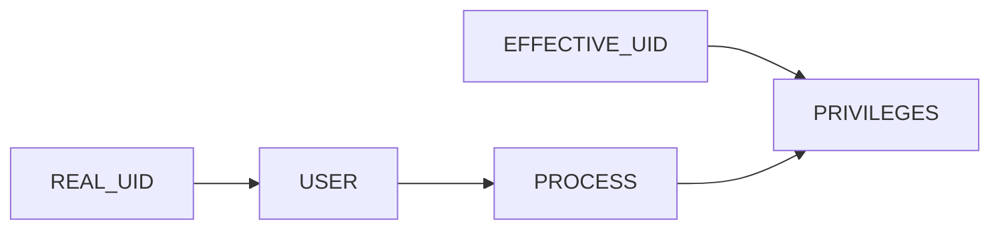

---

# SetUID Concept

When SetUID is enabled:

```text
Program Runs With

Owner's Privileges
```

instead of:

```text
User's Privileges
```

---

# SetUID Flow

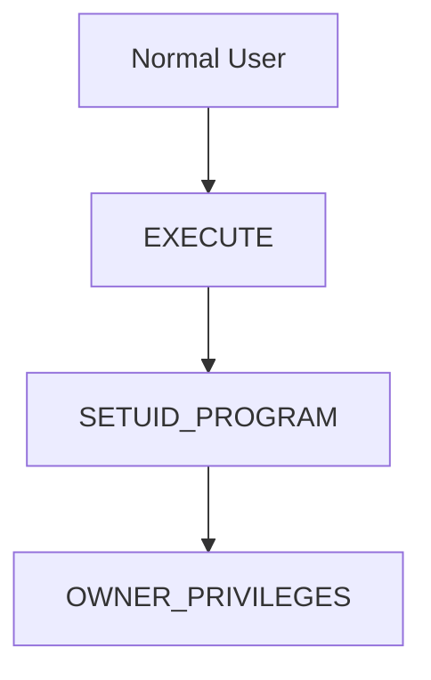

---

# Real Example

Check passwd:

```bash
ls -l /usr/bin/passwd
```

Example:

```text
-rwsr-xr-x
```

Notice:

```text
s
```

instead of:

```text
x
```

---

# What Does "s" Mean?

```text
SetUID Enabled
```

---

# Permission Breakdown

```text
-rwsr-xr-x

Owner: rws

Group: r-x

Others: r-x
```

---

# Visualization


---

# Lab Task 1

Inspect:

```bash
ls -l /usr/bin/passwd
```

Answer:

```text
Is SetUID Enabled?
```

---

# Why passwd Needs SetUID

User:

```text
vip
```

needs to update:

```text
/etc/shadow
```

Owned by:

```text
root
```

Without SetUID:

```text
Permission Denied
```

---

# Password Change Flow

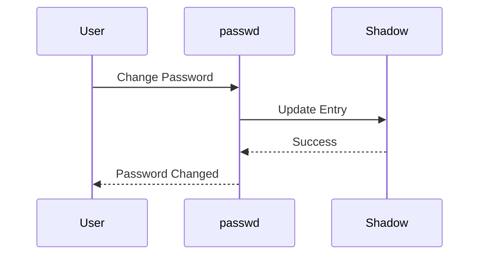

---

# Finding SetUID Programs

Search:

```bash
find /usr/bin -perm -4000 2>/dev/null
```

or:

```bash
find / -perm -4000 2>/dev/null
```

---

# Lab Task 2

Run:

```bash
find /usr/bin -perm -4000
```

Document:

```text
passwd

sudo

su

...
```

---

# Common SetUID Programs

Examples:

```text
passwd

sudo

su

mount

umount

chsh
```

---

# SetUID Architecture

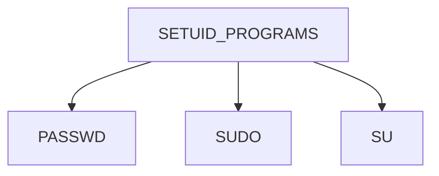

---

# Numeric Representation

SetUID bit:

```text
4000
```

Example:

```bash
chmod 4755 file
```

Breakdown:

```text
4 = SetUID

755 = rwxr-xr-x
```

---

# Lab Task 3

Create test file:

```bash
touch demo
chmod 4755 demo
ls -l demo
```

Observe:

```text
s
```

appearing.

---

# SetUID Visualization

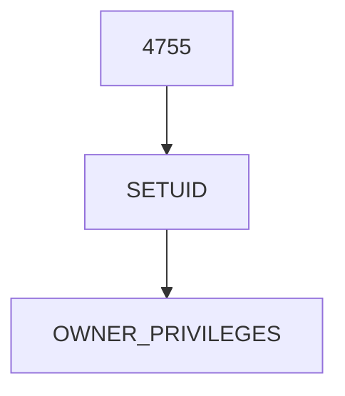

---

# Security Risks

Bad SetUID programs can lead to:

```text
Privilege Escalation
```

Meaning:

```text
Normal User

↓

Root Access
```

---

# Attack Model

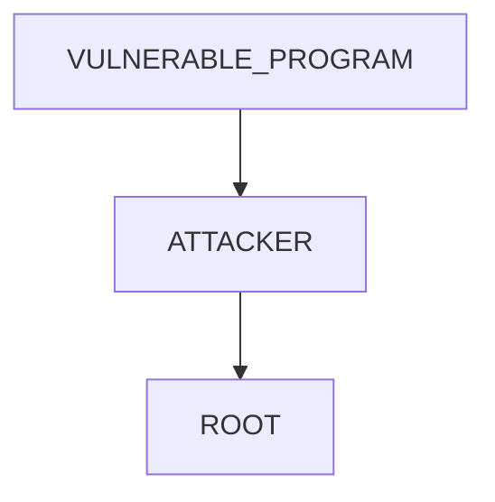

---

# Why SetUID Is Dangerous

If program contains:

```text
Buffer Overflow

Command Injection

Logic Bug
```

attacker may gain:

```text
Root Access
```

---

# Production Rule

```text
Minimize SetUID Programs
```

Always.

---

# Understanding SetGID

SetGID works similarly.

But for:

```text
Groups
```

instead of:

```text
Users
```

---

# SetGID Flow

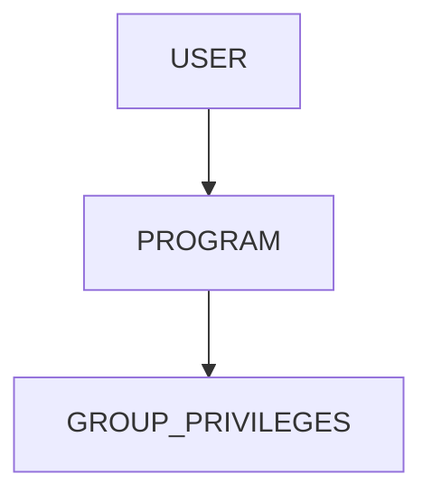

---

# Numeric Value

```text
2000
```

Example:

```bash
chmod 2755 file
```

---

# Viewing SetGID

Example:

```text
-rwxr-sr-x
```

Notice:

```text
s
```

in group position.

---

# Lab Task 4

Create:

```bash
touch sgid-demo

chmod 2755 sgid-demo

ls -l sgid-demo
```

Observe:

```text
r-s
```

in group section.

---

# SetGID On Directories

This is where SetGID becomes extremely useful.

---

# Problem

Team directory:

```text
/project
```

Members:

```text
alice

bob

charlie
```

New files should inherit:

```text
developers
```

group automatically.

---

# Without SetGID

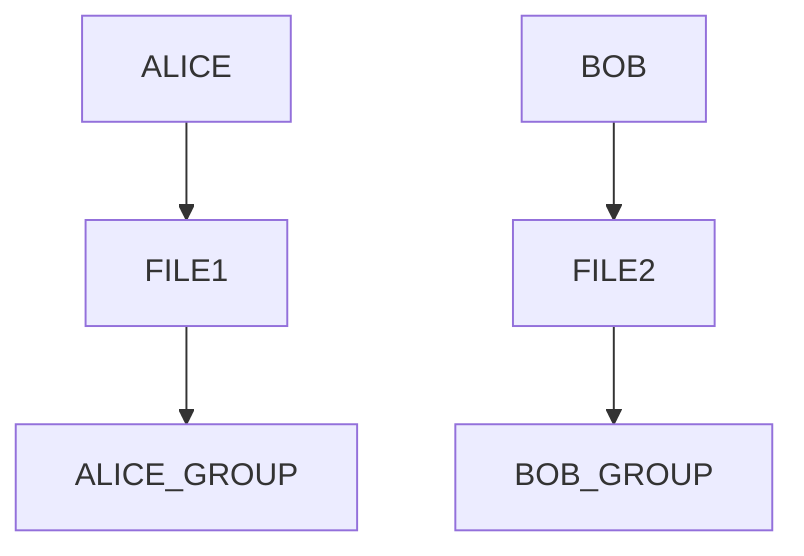

Inconsistent ownership.

---

# With SetGID

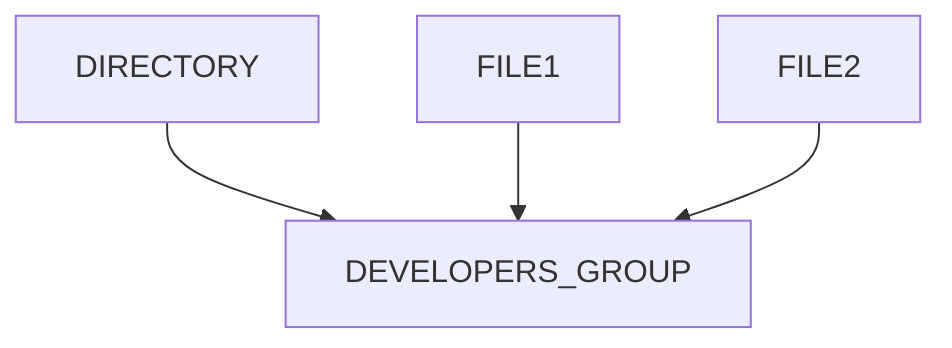

Consistent ownership.

---

# Create Shared Directory

```bash
sudo mkdir /shared

sudo chgrp developers /shared

chmod 2775 /shared
```

---

# Lab Task 5

Create:

```bash
mkdir teamdir

chmod 2775 teamdir
```

Inspect:

```bash
ls -ld teamdir
```

Observe:

```text
s
```

in group section.

---

# Why Organizations Use SetGID

Shared:

```text
Source Code

Documents

Configuration Repositories
```

need consistent ownership.

---

# Collaboration Architecture

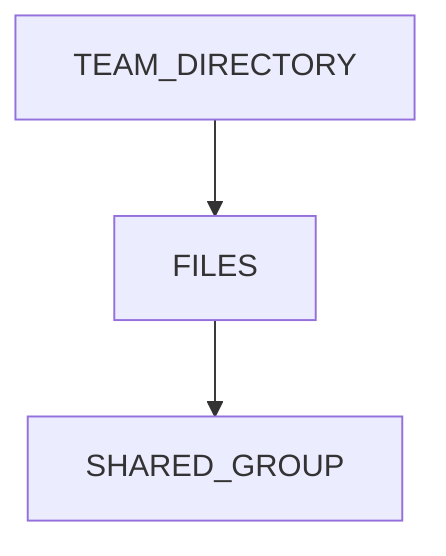

---

# Real Production Example

Application deployment directory:

```text
/opt/application
```

Owned by:

```text
appgroup
```

SetGID enabled:

```text
2775
```

New files automatically inherit:

```text
appgroup
```

---

# Effective UID Deep Dive

Display current UID:

```bash
id
```

Internally process contains:

```text
Real UID

Effective UID

Saved UID
```

---

# Process Identity Architecture

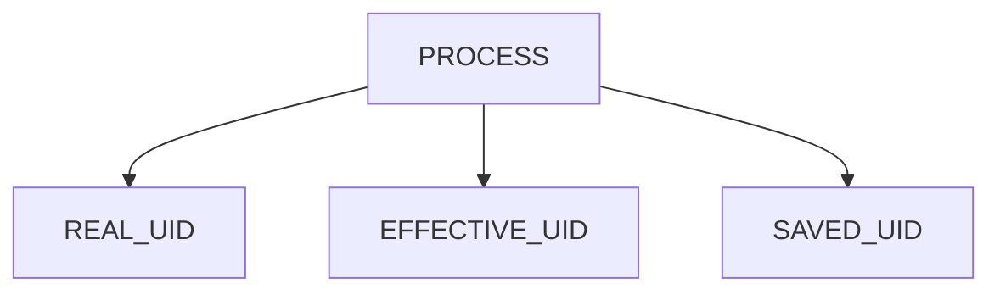

---

# Linux Internals

Kernel permission checks use:

```text
Effective UID
```

not:

```text
Real UID
```

This is why SetUID works.

---

# Permission Check Flow

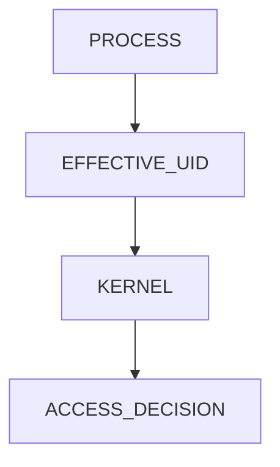

---

# Investigating SetUID Files

Search:

```bash
find / -perm -4000 2>/dev/null
```

---

# Investigating SetGID Files

Search:

```bash
find / -perm -2000 2>/dev/null
```

---

# Lab Task 6

Run both commands.

Categorize:

```text
Authentication

Administration

System Utilities
```

---

# Docker Connection

Containers generally disable many SetUID behaviors.

Why?

Security.

---

# Container Security Model

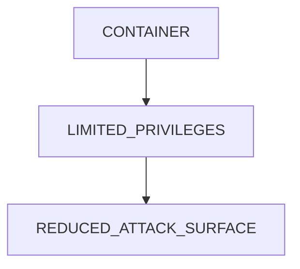

---

# Why Containers Avoid SetUID

Because:

```text
Privilege Escalation Risks
```

become dangerous in shared infrastructure.

---

# Kubernetes Connection

Kubernetes encourages:

```yaml
runAsNonRoot: true
```

instead of relying on:

```text
SetUID
```

---

# Kubernetes Security Architecture

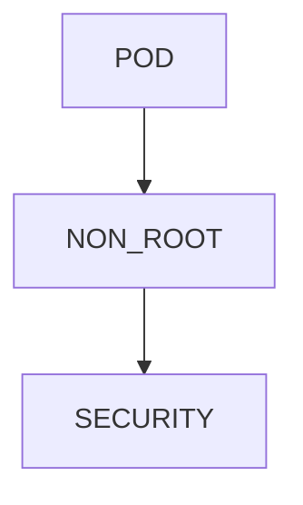

---

# Cloud Connection

Cloud security best practices:

```text
Avoid SetUID

Use IAM

Use Least Privilege
```

---

# Production Security Rules

Audit:

```bash
find / -perm -4000
```

Regularly.

Monitor:

```text
New SetUID Files
```

carefully.

---

# Guided Challenge

Investigate:

```bash
ls -l /usr/bin/passwd

find /usr/bin -perm -4000
```

Document findings.

---

# Semi-Guided Challenge

Create:

```text
SetUID Example

SetGID Example

SetGID Directory
```

Analyze permissions.

---

# Independent Challenge

Design permissions for:

```text
Shared Development Team

Application Deployment Directory

Database Administration Tools
```

Decide:

```text
SetUID?

SetGID?

Neither?
```

Explain reasoning.

---

# Security Considerations

Never:

```text
SetUID Scripts
```

in production.

Never:

```text
SetUID Custom Applications
```

without security review.

Always:

```text
Audit SetUID Programs
```

---

# Performance Considerations

SetUID overhead is negligible.

Security impact is enormous.

---

# Common Mistakes

## Mistake 1

Confusing SetUID with sudo.

---

## Mistake 2

Using SetUID unnecessarily.

---

## Mistake 3

Ignoring SetGID directories.

---

## Mistake 4

Trusting unknown SetUID binaries.

---

## Mistake 5

Not auditing privileged executables.

---

# Troubleshooting

## Find SetUID Files

```bash
find / -perm -4000 2>/dev/null
```

---

## Find SetGID Files

```bash
find / -perm -2000 2>/dev/null
```

---

## View Permissions

```bash
ls -l file
```

---

## Apply SetUID

```bash
chmod 4755 file
```

---

## Apply SetGID

```bash
chmod 2755 file
```

---

## SetGID Directory

```bash
chmod 2775 directory
```

---

# Engineering Mindset

Beginners think:

```text
Permissions Control Access
```

Engineers think:

```text
Which Identity Is The Process Using?

Who Owns The Executable?

Can Privileges Be Escalated?

Can This Become Root?
```

---

# Interview Questions

### What is SetUID?

Allows a program to run with the file owner's privileges.

---

### What is SetGID?

Allows a program to run with the file group's privileges.

---

### What numeric value represents SetUID?

```text
4000
```

---

### What numeric value represents SetGID?

```text
2000
```

---

### Why does passwd require SetUID?

To update:

```text
/etc/shadow
```

which is owned by root.

---

### What is Effective UID?

The UID used for permission checks.

---

### Why is SetUID dangerous?

It can enable privilege escalation.

---

### Why use SetGID directories?

To enforce consistent group ownership.

---

# Cheat Sheet

```bash
ls -l

find / -perm -4000 2>/dev/null

find / -perm -2000 2>/dev/null

chmod 4755 file

chmod 2755 file

chmod 2775 directory

id

whoami
```

---

# Lab Success Criteria

You can complete this lab when you can:

✅ Explain SetUID

✅ Explain SetGID

✅ Explain Effective UID

✅ Identify SetUID binaries

✅ Identify SetGID binaries

✅ Understand SetGID directories

✅ Explain passwd and /etc/shadow interaction

✅ Understand privilege escalation risks

✅ Connect SetUID to container security

✅ Think like a Linux security engineer

Congratulations.

You now understand one of the most powerful privilege mechanisms in Linux and one of the most important foundations of Linux security auditing, container hardening, cloud security, and production system administration.
