# Lab 06 – Access Control Lists (ACLs)

> Traditional Linux permissions are simple:
>
> ```text
> Owner
> Group
> Others
> ```
>
> This model worked well when systems were small.
>
> But modern infrastructure is not simple.
>
> Consider:
>
> ```text
> DevOps Team
> Backend Team
> Security Team
> Data Team
> Contractors
> CI/CD Systems
> Applications
> ```
>
> What if:
>
> ```text
> Alice needs read access
>
> Bob needs read-write access
>
> Security team needs read-only access
>
> Everyone else should be denied
> ```
>
> Traditional permissions become difficult.
>
> Linux solves this problem using:
>
> ```text
> Access Control Lists (ACLs)
> ```
>
> ACLs are one of the most important enterprise Linux security features and are heavily used in shared storage, NFS, enterprise applications, cloud environments, and large organizations.

---

# Lab Objective

By the end of this lab you will:

* Understand why ACLs exist
* Understand ACL architecture
* Configure ACLs
* Analyze ACL inheritance
* Understand default ACLs
* Compare ACLs with traditional permissions
* Troubleshoot ACL issues
* Understand enterprise use cases
* Connect ACLs to cloud and Kubernetes
* Think like a Linux security engineer

---

# Why This Matters

Suppose you have:

```text
project-report.pdf
```

Owned by:

```text
alice
```

Group:

```text
developers
```

Requirements:

```text
Alice → Full Access

Bob → Read Access

Charlie → Read Access

Security Team → Read Access

Everyone Else → No Access
```

Traditional Linux permissions cannot express this cleanly.

ACLs can.

---

# The Problem

Traditional permissions only support:

```text
Owner

Group

Others
```

Visualization:

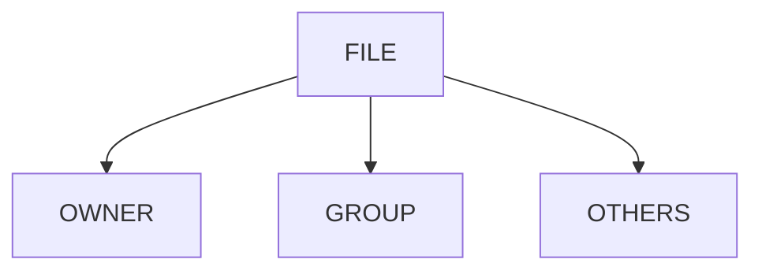

Only three permission categories.

Modern organizations need more.

---

# Mental Model

Think of a hotel.

Traditional permissions:

```text
Owner Suite

Staff Area

Public Area
```

ACLs:

```text
Room 101 → Alice

Room 101 → Bob

Room 101 → Security Team

Room 101 → Cleaning Staff
```

Fine-grained access control.

---

# First Principles

Traditional Linux permissions answer:

```text
Who owns this?
```

ACLs answer:

```text
Who else should access this?
```

---

# Traditional Permission Limitation

Example:

```bash
ls -l report.txt
```

Output:

```text
-rw-r----- alice developers report.txt
```

Only:

```text
Owner

Group

Others
```

supported.

---

# ACL Architecture

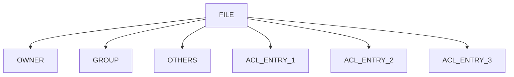

ACL extends traditional permissions.

---

# Linux Permission Evaluation

When access occurs:

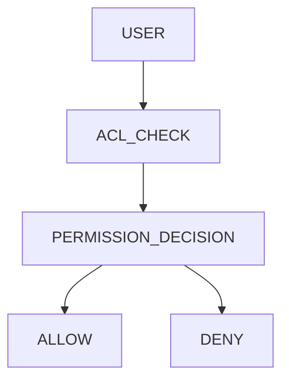

ACLs become part of the access decision.

---

# Lab Environment Setup

Install ACL tools:

Ubuntu/Debian:

```bash
sudo apt install acl
```

RHEL/CentOS:

```bash
sudo yum install acl
```

Verify:

```bash
which getfacl

which setfacl
```

---

# Core ACL Commands

Linux provides:

```text
setfacl

getfacl
```

---

# getfacl

Displays ACLs.

Example:

```bash
getfacl file.txt
```

---

# setfacl

Modifies ACLs.

Example:

```bash
setfacl -m u:bob:r file.txt
```

---

# ACL Tool Architecture

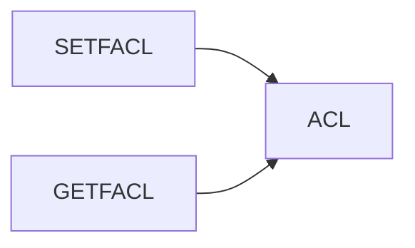

---

# Lab Task 1

Create:

```bash
mkdir acl-lab

cd acl-lab

touch report.txt
```

View ACL:

```bash
getfacl report.txt
```

Observe default ACL structure.

---

# Understanding ACL Output

Example:

```text
# owner: vip
# group: vip

user::rw-
group::r--
other::r--
```

This resembles traditional permissions.

---

# Visualization

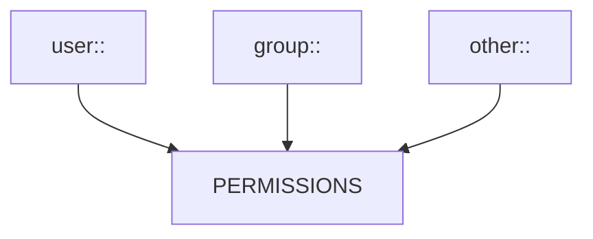

---

# Adding ACL For A User

Grant Bob read access:

```bash
setfacl -m u:bob:r report.txt
```

Verify:

```bash
getfacl report.txt
```

---

# Result

Output:

```text
user:bob:r--
```

appears.

---

# ACL Entry Model

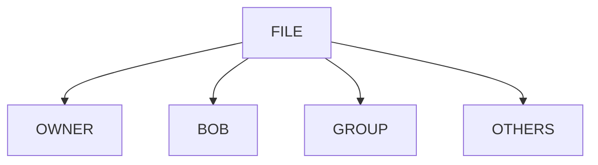

---

# Lab Task 2

Create test users:

```bash
sudo useradd bob

sudo useradd charlie
```

Add ACL:

```bash
setfacl -m u:bob:r report.txt
```

Verify.

---

# Multiple User ACLs

Example:

```bash
setfacl -m u:bob:r report.txt

setfacl -m u:charlie:rw report.txt
```

---

# Visualization

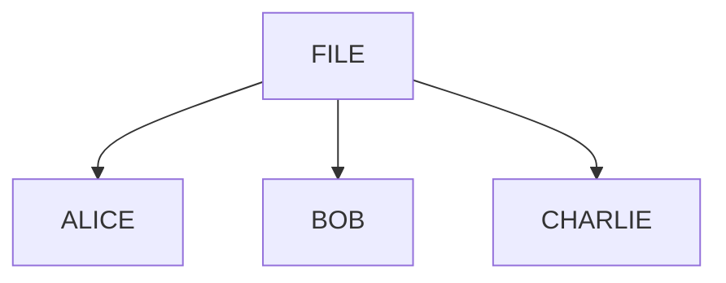

Different users.

Different permissions.

---

# Lab Task 3

Grant:

```text
Bob → Read

Charlie → Read Write
```

Verify with:

```bash
getfacl report.txt
```

---

# ACL Mask

One of the most misunderstood ACL concepts.

ACLs contain:

```text
mask
```

entry.

Example:

```text
mask::rw-
```

---

# Why Mask Exists

Mask defines:

```text
Maximum Effective Permission
```

for ACL entries.

---

# ACL Evaluation Flow

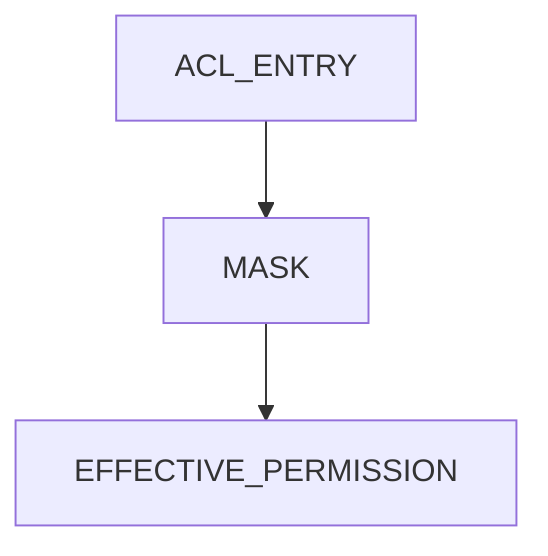

---

# Example

User:

```text
charlie
```

ACL:

```text
rwx
```

Mask:

```text
rw-
```

Effective:

```text
rw-
```

Mask limits access.

---

# Lab Task 4

Inspect ACL output.

Locate:

```text
mask::
```

entry.

Understand its effect.

---

# ACL For Groups

Grant group access:

```bash
setfacl -m g:developers:rwx project
```

Verify:

```bash
getfacl project
```

---

# Group ACL Architecture

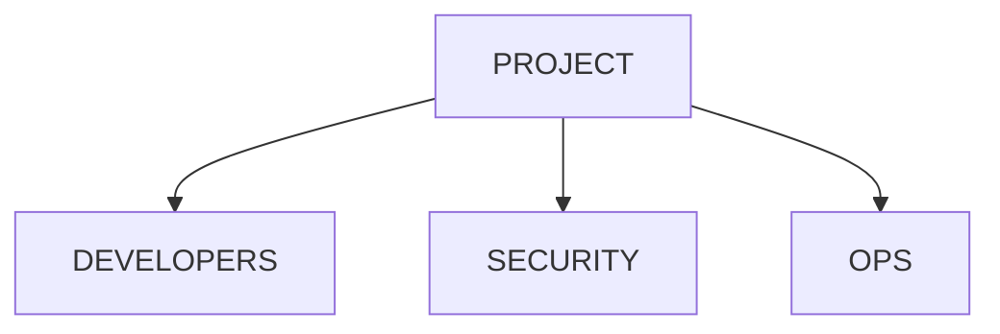

---

# Removing ACLs

Remove Bob:

```bash
setfacl -x u:bob report.txt
```

Verify:

```bash
getfacl report.txt
```

---

# Lab Task 5

Add:

```text
Bob

Charlie
```

Then remove Bob.

Observe changes.

---

# Default ACLs

One of ACL's most powerful features.

---

# Problem

Create directory:

```text
shared-project
```

New files should automatically inherit:

```text
Team Permissions
```

---

# Traditional Permissions Problem

New files may get:

```text
Unexpected Permissions
```

causing collaboration issues.

---

# Default ACL Solution

Apply:

```bash
setfacl -d -m g:developers:rwx shared-project
```

---

# Inheritance Model

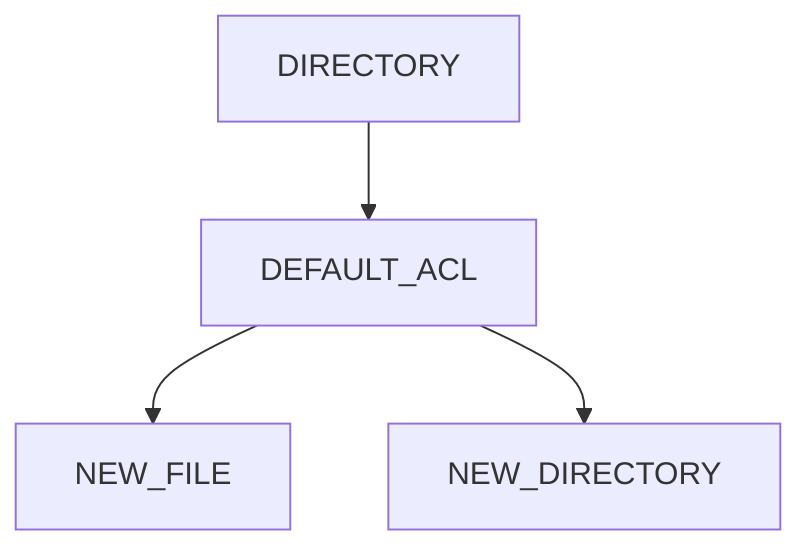

---

# Lab Task 6

Create:

```bash
mkdir shared-project
```

Apply default ACL.

Create files inside.

Observe inheritance.

---

# Why Enterprises Use Default ACLs

Useful for:

```text
Shared Repositories

Team Directories

NFS Shares

Application Data
```

---

# ACL vs Traditional Permissions

| Feature         | Traditional | ACL       |
| --------------- | ----------- | --------- |
| Owner           | Yes         | Yes       |
| Group           | Yes         | Yes       |
| Others          | Yes         | Yes       |
| Multiple Users  | No          | Yes       |
| Multiple Groups | No          | Yes       |
| Inheritance     | Limited     | Strong    |
| Enterprise Use  | Limited     | Excellent |

---

# Real Production Example

Shared source code:

```text
/opt/company-app
```

Requirements:

```text
Backend Team → RW

DevOps Team → RW

Security Team → Read

Others → None
```

ACLs are ideal.

---

# Enterprise Storage Architecture

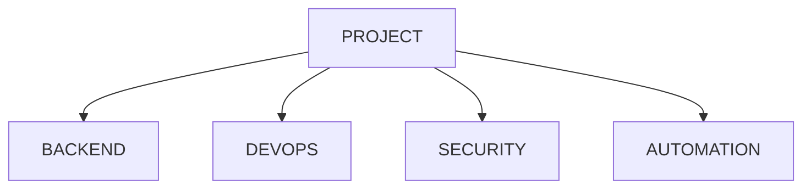

---

# NFS Connection

Network File Systems heavily use ACLs.

Reason:

```text
Hundreds Of Users

Hundreds Of Teams
```

Traditional permissions become insufficient.

---

# NFS Architecture

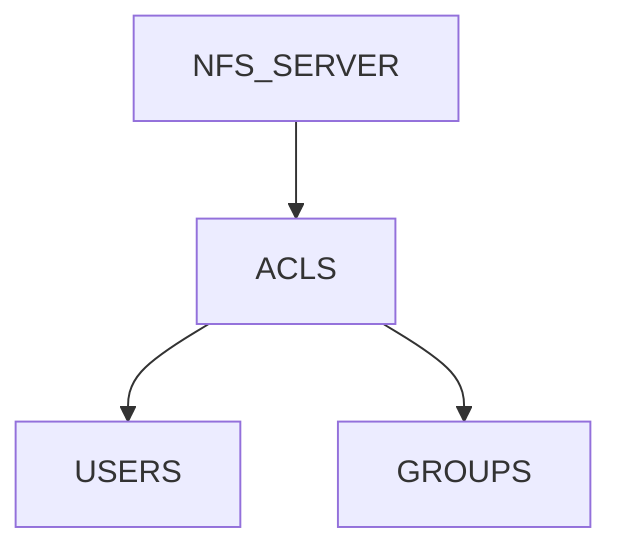

---

# Cloud Connection

Cloud storage systems frequently implement ACL concepts.

Examples:

```text
AWS EFS

Azure Files

Google Filestore
```

All support fine-grained access.

---

# Cloud Access Model

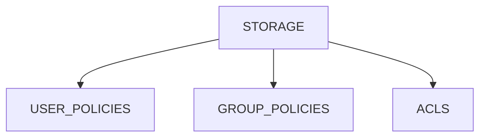

---

# Kubernetes Connection

Persistent Volumes often require:

```text
Shared Access

Multiple Pods

Multiple Teams
```

ACL concepts help manage access.

---

# Kubernetes Storage Model

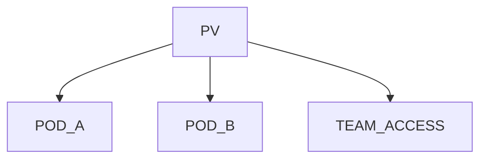

---

# Security Considerations

ACLs improve flexibility.

But:

```text
Complex Permissions

Complex Auditing
```

can occur.

---

# Security Principle

Always ask:

```text
Who Actually Has Access?
```

not:

```text
Who Appears To Have Access?
```

---

# ACL Audit Workflow

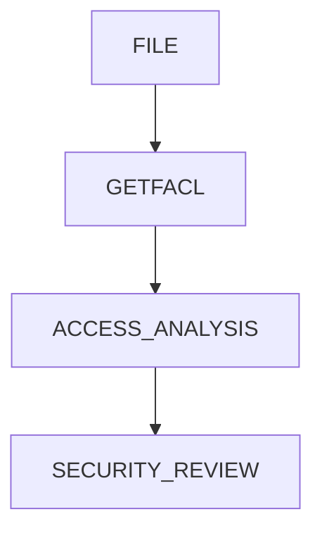

---

# Performance Considerations

ACL overhead is generally:

```text
Very Small
```

Modern filesystems handle ACL lookups efficiently.

---

# Linux Internals

ACL information is stored as:

```text
Extended Attributes (xattrs)
```

on supported filesystems.

---

# Internal Architecture

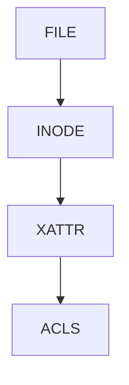

---

# Viewing Extended Attributes

Install:

```bash
sudo apt install attr
```

View:

```bash
getfattr -d report.txt
```

---

# Guided Challenge

Create:

```bash
touch project.txt
```

Grant:

```text
Bob → Read

Charlie → Read Write
```

Verify.

---

# Semi-Guided Challenge

Create:

```text
Shared Team Directory
```

Apply:

```text
Group ACL

Default ACL
```

Test inheritance.

---

# Independent Challenge

Design access control for:

```text
Developers

DevOps

Security

CI/CD System
```

using ACLs.

Document:

```text
Who Gets What Access
```

and why.

---

# Common Mistakes

## Mistake 1

Forgetting ACL masks.

---

## Mistake 2

Ignoring inherited ACLs.

---

## Mistake 3

Only checking ls -l.

ACLs may still exist.

---

## Mistake 4

Overcomplicated ACL structures.

---

## Mistake 5

Not auditing ACLs regularly.

---

# Troubleshooting

## View ACL

```bash
getfacl file.txt
```

---

## Add ACL

```bash
setfacl -m u:bob:r file.txt
```

---

## Remove ACL

```bash
setfacl -x u:bob file.txt
```

---

## Remove All ACLs

```bash
setfacl -b file.txt
```

---

## View Extended Attributes

```bash
getfattr -d file.txt
```

---

# Engineering Mindset

Beginners think:

```text
Owner

Group

Others
```

Engineers think:

```text
Who Actually Needs Access?

How Will This Scale?

Can We Audit It?

Can Teams Collaborate Safely?
```

ACLs are not just a permission feature.

They are:

```text
Access Architecture
```

for modern Linux systems.

---

# Interview Questions

### Why do ACLs exist?

To provide finer-grained access control than traditional permissions.

---

### Which commands manage ACLs?

```text
setfacl

getfacl
```

---

### What is an ACL mask?

Maximum effective permission applied to ACL entries.

---

### What are default ACLs?

ACLs inherited by newly created files and directories.

---

### Where are ACLs stored?

Typically as filesystem extended attributes.

---

### Why are ACLs useful in enterprises?

Support many users and groups without complex ownership changes.

---

### How do ACLs relate to cloud storage?

Cloud storage systems implement similar fine-grained access models.

---

# Cheat Sheet

```bash
sudo apt install acl

getfacl file.txt

setfacl -m u:bob:r file.txt

setfacl -m u:charlie:rw file.txt

setfacl -m g:developers:rwx project

setfacl -x u:bob file.txt

setfacl -b file.txt

setfacl -d -m g:developers:rwx shared-project

getfattr -d file.txt
```

---

# Lab Success Criteria

You can complete this lab when you can:

✅ Explain why ACLs exist

✅ Compare ACLs with traditional permissions

✅ Use getfacl

✅ Use setfacl

✅ Configure user ACLs

✅ Configure group ACLs

✅ Understand ACL masks

✅ Configure default ACLs

✅ Troubleshoot ACL issues

✅ Design enterprise access models

✅ Think like a Linux security engineer

Congratulations.

You now understand the access-control mechanism that bridges traditional Linux permissions and modern enterprise authorization requirements. ACLs are a foundational skill for Linux administration, enterprise storage, cloud infrastructure, DevOps collaboration, and large-scale platform engineering.
