# Lab 07 – Sudo Policies

> One of the biggest mistakes in Linux administration is:
>
> ```text
> Giving Everyone Root Access
> ```
>
> Beginners often think:
>
> ```text
> Root Solves Everything
> ```
>
> Production engineers think:
>
> ```text
> How Do We Avoid Using Root?
> ```
>
> Modern Linux infrastructure depends on:
>
> ```text
> Least Privilege
>
> Controlled Escalation
>
> Auditable Administration
> ```
>
> The mechanism that enables this is:
>
> ```text
> sudo
> ```
>
> Sudo is one of the most important security tools in Linux and powers administration across:
>
> * Linux Servers
> * Cloud Infrastructure
> * Kubernetes Nodes
> * CI/CD Systems
> * Databases
> * Enterprise Environments

---

# Lab Objective

By the end of this lab you will:

* Understand why sudo exists
* Understand least privilege
* Understand sudo architecture
* Configure sudo access safely
* Understand sudoers policies
* Investigate command restrictions
* Understand privilege escalation control
* Audit sudo activity
* Connect sudo to enterprise infrastructure
* Think like a Linux security engineer

---

# Why This Matters

Imagine:

```text
20 Linux Administrators

100 Developers

50 DevOps Engineers
```

Managing production systems.

Should everyone have:

```text
root
```

password?

Absolutely not.

That would mean:

```text
No Accountability

No Auditing

Massive Security Risk
```

Linux solves this with:

```text
sudo
```

---

# The Problem

Many operations require:

```text
Install Software

Manage Services

Modify Network Settings

Change Users

Edit System Files
```

These require:

```text
Root Privileges
```

But giving users root access creates risk.

---

# Mental Model

Think of a bank.

Employees:

```text
Can Access Certain Areas
```

But only:

```text
Authorized Personnel
```

can access:

```text
Vault

Security Systems

Financial Controls
```

Similarly:

```text
sudo
```

provides controlled access.

---

# First Principles

Without sudo:

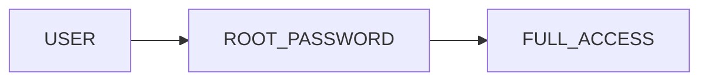

Everyone needing admin tasks must know root credentials.

Bad design.

---

# With Sudo

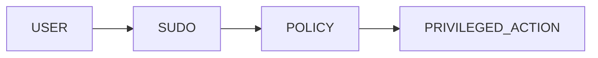

Access becomes:

```text
Controlled

Logged

Auditable
```

---

# Understanding Root

Root:

```text
UID 0
```

Can:

```text
Read Any File

Kill Any Process

Modify Kernel Settings

Control Entire System
```

---

# Root Authority Model

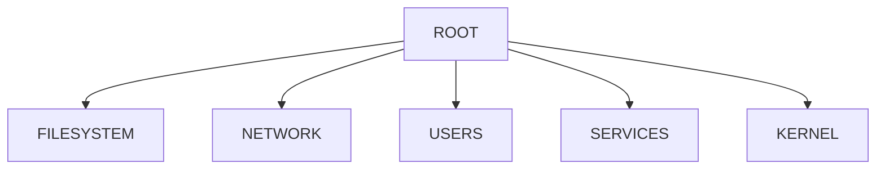

---

# Why Root Is Dangerous

Accidental command:

```bash
rm -rf /
```

Potential result:

```text
Destroyed System
```

---

# Production Principle

```text
Nobody Gets More Privileges Than Necessary
```

Known as:

```text
Least Privilege
```

---

# Security Pyramid

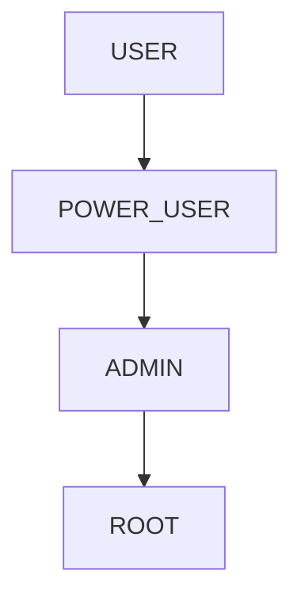

---

# Understanding sudo

Command:

```bash
sudo command
```

Example:

```bash
sudo systemctl restart nginx
```

Meaning:

```text
Run This Command

With Elevated Privileges
```

---

# Lab Environment Setup

Check sudo:

```bash
which sudo
```

Verify:

```bash
sudo -V
```

---

# Lab Task 1

Run:

```bash
which sudo

sudo -V
```

Document:

```text
Version

Location

Capabilities
```

---

# How Sudo Works

User:

```text
vip
```

runs:

```bash
sudo apt update
```

Flow:

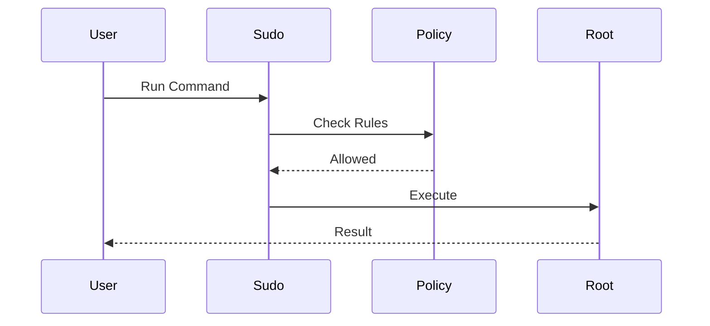

---

# Sudo Authentication

Typically:

```text
User Password
```

not:

```text
Root Password
```

This provides:

```text
Accountability
```

---

# Why This Matters

Logs can show:

```text
Who Performed Action

When

Which Command
```

---

# Accountability Architecture

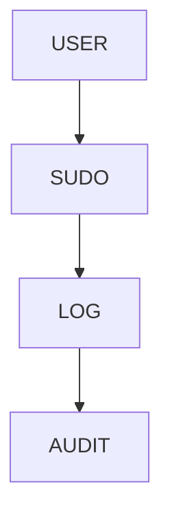

---

# Viewing Current Privileges

Check:

```bash
sudo -l
```

Shows:

```text
Allowed Commands
```

for current user.

---

# Lab Task 2

Run:

```bash
sudo -l
```

Analyze output.

---

# Understanding sudoers

Main configuration:

```text
/etc/sudoers
```

Additional policies:

```text
/etc/sudoers.d/
```

---

# Architecture

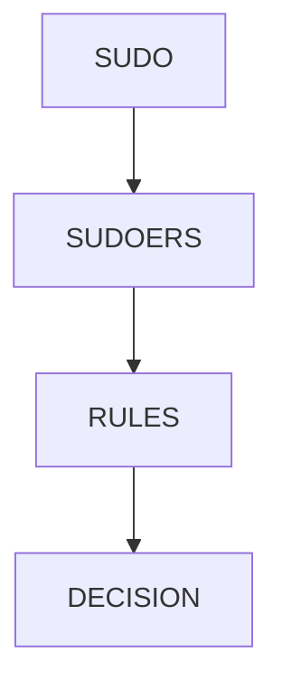

---

# Viewing Policies Safely

Never edit directly:

```bash
sudo visudo
```

instead of:

```bash
sudo nano /etc/sudoers
```

---

# Why visudo Exists

It:

```text
Validates Syntax

Prevents Lockouts

Protects Configuration
```

---

# Configuration Workflow

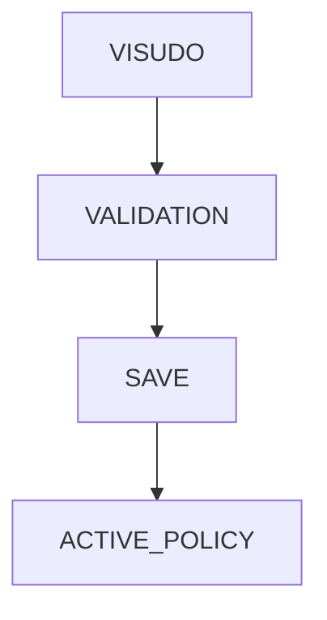

---

# Lab Task 3

Inspect:

```bash
sudo visudo
```

Read configuration.

Do not modify production systems.

---

# Understanding Sudo Rules

Example:

```text
vip ALL=(ALL:ALL) ALL
```

Meaning:

```text
User: vip

Host: ALL

Run As: ALL

Commands: ALL
```

---

# Rule Breakdown


---

# Example Analysis

```text
alice ALL=(ALL) ALL
```

Interpretation:

```text
Alice Can Run Any Command
As Any User
```

---

# Group-Based Sudo

Common configuration:

```text
%sudo ALL=(ALL:ALL) ALL
```

Meaning:

```text
Members Of sudo Group

Receive Sudo Access
```

---

# Lab Task 4

Check groups:

```bash
groups

id
```

Identify:

```text
sudo

wheel
```

if present.

---

# Creating Limited Sudo Access

Example:

```text
bob ALL=(root) /usr/bin/systemctl restart nginx
```

Meaning:

```text
Bob Can Only Restart Nginx
```

Not:

```text
Become Root
```

---

# Fine-Grained Access Model

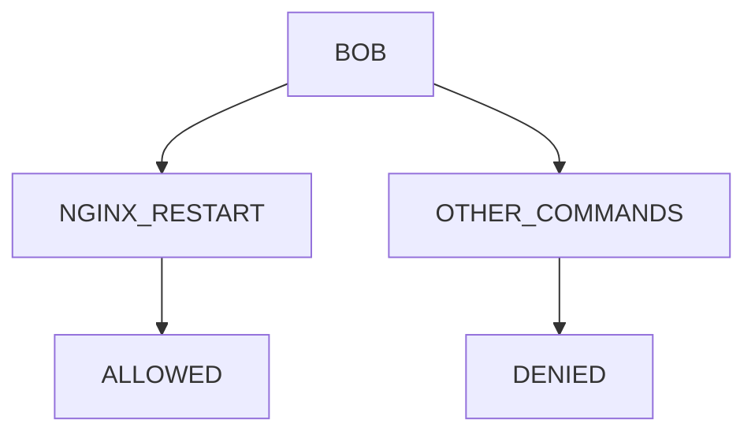

---

# Enterprise Example

Developers:

```text
Restart Application Service
```

Allowed.

But:

```text
Modify Firewall

Create Users

Edit sudoers
```

Denied.

---

# Role-Based Administration

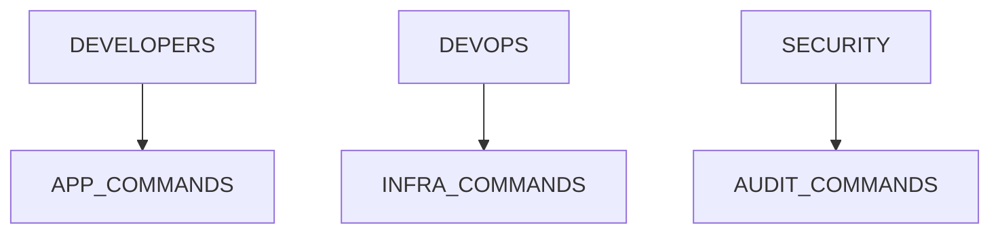

---

# Lab Task 5

Design policy:

```text
Developer

Can Restart Nginx

Cannot Become Root
```

Write sudoers entry.

---

# Passwordless Sudo

Example:

```text
deploy ALL=(root) NOPASSWD:/usr/bin/systemctl restart app
```

Meaning:

```text
No Password Needed
```

for specific command.

---

# Why Used?

Automation:

```text
CI/CD

Deployment Systems

Automation Scripts
```

---

# CI/CD Architecture

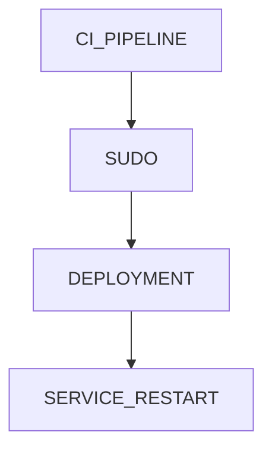

---

# Danger Of NOPASSWD

Too broad:

```text
NOPASSWD: ALL
```

can become security nightmare.

---

# Sudo Logging

Every sudo action is logged.

Check:

```bash
sudo journalctl | grep sudo
```

or:

```bash
grep sudo /var/log/auth.log
```

---

# Audit Architecture

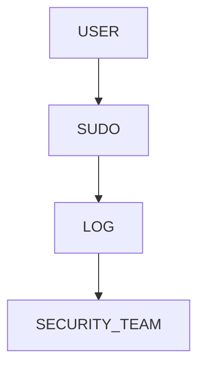

---

# Lab Task 6

Inspect sudo logs.

Document:

```text
Timestamp

User

Command
```

---

# Understanding RunAs

Example:

```text
alice ALL=(postgres) ALL
```

Allows:

```bash
sudo -u postgres psql
```

---

# Why Useful?

Database administration.

Without:

```text
Full Root Access
```

---

# Database Administration Flow

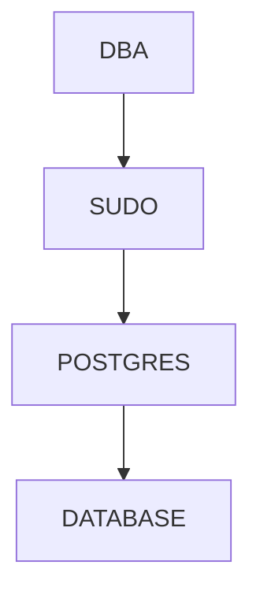

---

# Enterprise Scenario

Database team:

```text
Can Access PostgreSQL User
```

But:

```text
Cannot Access Root
```

---

# Sudo And Automation

Tools:

```text
Ansible

Jenkins

GitLab CI

GitHub Actions Runners
```

frequently rely on sudo.

---

# Automation Architecture

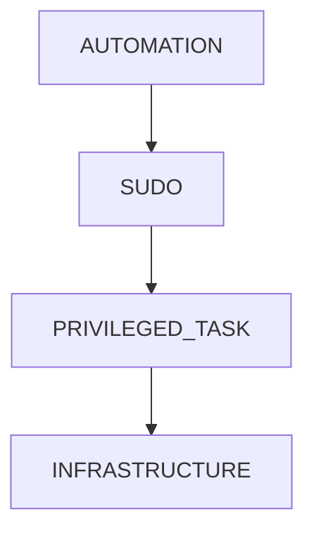

---

# Docker Connection

Docker often requires:

```bash
sudo docker ps
```

unless users belong to:

```text
docker
```

group.

---

# Docker Security Warning

Membership in:

```text
docker
```

group is effectively:

```text
Root-Level Access
```

---

# Docker Privilege Model

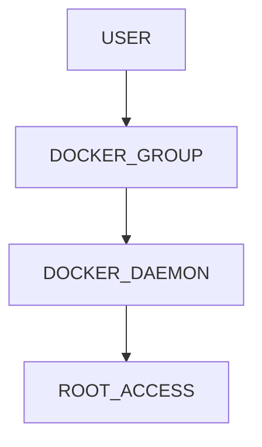

---

# Kubernetes Connection

Cluster administrators often use:

```text
sudo
```

to:

```text
Manage kubelet

Manage Containers

Modify Node Configuration
```

---

# Cloud Connection

Cloud VMs typically use:

```text
ubuntu

ec2-user

azureuser
```

combined with:

```text
sudo
```

instead of direct root login.

---

# Cloud Security Architecture

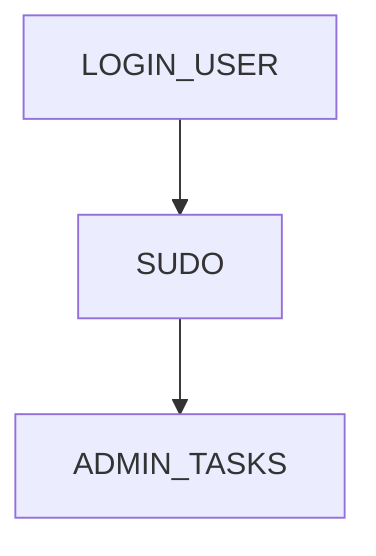

---

# Production Security Rules

Never:

```text
Share Root Password
```

Always:

```text
Use Individual Accounts
```

Always:

```text
Audit Sudo Usage
```

Always:

```text
Use Least Privilege
```

---

# Guided Challenge

Investigate:

```bash
sudo -l

groups

id

sudo -V
```

Document findings.

---

# Semi-Guided Challenge

Design sudo policies for:

```text
Developer

DevOps Engineer

Database Administrator
```

Determine allowed commands.

---

# Independent Challenge

Design sudo architecture for:

```text
SaaS Startup

10 Developers

2 DevOps Engineers

1 Security Engineer
```

Create:

```text
Roles

Privileges

Restrictions

Audit Strategy
```

---

# Linux Internals Deep Dive

Sudo execution flow:

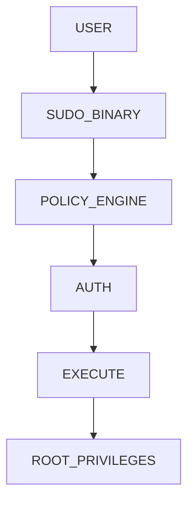

---

# Security Considerations

Never:

```text
Grant ALL=(ALL) ALL
```

to everyone.

Avoid:

```text
NOPASSWD: ALL
```

Use:

```text
Specific Commands

Specific Users

Specific Groups
```

---

# Performance Considerations

Sudo overhead is tiny.

Benefits:

```text
Security

Auditing

Control
```

far outweigh costs.

---

# Common Mistakes

## Mistake 1

Giving everyone full sudo.

---

## Mistake 2

Editing sudoers directly.

---

## Mistake 3

Using NOPASSWD excessively.

---

## Mistake 4

Sharing administrative accounts.

---

## Mistake 5

Ignoring audit logs.

---

# Troubleshooting

## Check Allowed Commands

```bash
sudo -l
```

---

## Edit Policies

```bash
sudo visudo
```

---

## Verify Sudo Group

```bash
groups
```

---

## View Logs

```bash
grep sudo /var/log/auth.log
```

---

## Check Sudo Version

```bash
sudo -V
```

---

# Engineering Mindset

Beginners think:

```text
Who Needs Root?
```

Engineers think:

```text
How Can We Avoid Root?

How Can We Audit Access?

How Can We Restrict Privileges?

How Can We Reduce Blast Radius?
```

---

# Interview Questions

### Why does sudo exist?

To provide controlled privilege escalation.

---

### What file controls sudo policies?

```text
/etc/sudoers
```

---

### What tool should edit sudoers?

```text
visudo
```

---

### What does sudo -l do?

Shows allowed commands.

---

### What is least privilege?

Grant only the permissions required.

---

### Why is NOPASSWD dangerous?

Can allow uncontrolled privileged execution.

---

### Why is sudo preferred over shared root accounts?

Provides accountability and auditing.

---

### Why is the docker group security-sensitive?

Members can effectively gain root access.

---

# Cheat Sheet

```bash
sudo -V

sudo -l

sudo visudo

id

groups

sudo journalctl | grep sudo

grep sudo /var/log/auth.log

sudo -u postgres psql

sudo systemctl restart nginx
```

---

# Lab Success Criteria

You can complete this lab when you can:

✅ Explain why sudo exists

✅ Explain least privilege

✅ Read sudo policies

✅ Understand sudoers syntax

✅ Configure restricted sudo access

✅ Understand NOPASSWD

✅ Audit sudo activity

✅ Connect sudo to automation

✅ Connect sudo to cloud infrastructure

✅ Think like a Linux security engineer

Congratulations.

You now understand the privilege delegation system that powers modern Linux administration, enterprise security, cloud infrastructure, CI/CD automation, Kubernetes node management, and production operations at scale.
