# Lab 08 – Linux Security Hardening

> Most Linux systems are not hacked because Linux is insecure.
>
> They are hacked because:
>
> ```text
> Misconfigurations
>
> Weak Passwords
>
> Excessive Privileges
>
> Poor Access Control
>
> Unpatched Software
>
> Human Mistakes
> ```
>
> Security hardening is the process of reducing the attack surface of a system before attackers find weaknesses.
>
> Production engineers do not ask:
>
> ```text
> Is My Server Secure?
> ```
>
> They ask:
>
> ```text
> What Can Be Compromised?
>
> How Can Attackers Enter?
>
> How Can We Limit Damage?
>
> How Can We Detect Attacks?
>
> How Can We Recover?
> ```
>
> This lab teaches practical Linux hardening from first principles and connects it to modern cloud, container, Kubernetes, platform engineering, and enterprise security.

---

# Lab Objective

By the end of this lab you will:

* Understand security hardening principles
* Analyze Linux attack surfaces
* Secure users and privileges
* Harden SSH
* Audit permissions
* Reduce exposed services
* Secure sudo policies
* Understand logging and auditing
* Connect Linux hardening to cloud and Kubernetes
* Think like a security engineer

---

# Why This Matters

Imagine a production server.

It hosts:

```text
Customer Data

Databases

Application Secrets

API Keys

Payment Information
```

An attacker only needs:

```text
One Weakness
```

Defenders must secure:

```text
Everything
```

This asymmetry is why hardening matters.

---

# The Security Reality

Most attacks follow:

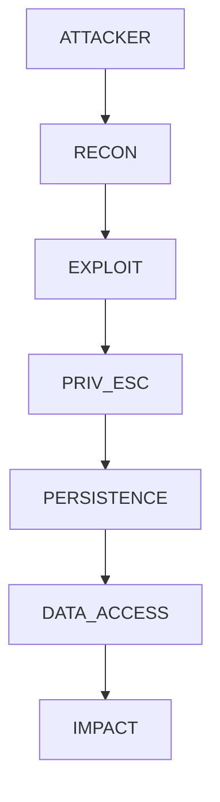

Security hardening aims to break this chain.

---

# Mental Model

Think of a castle.

Bad security:

```text
One Wall

One Gate

No Guards
```

Good security:

```text
Walls

Moats

Guards

Locks

Alarms

Escape Plans
```

This is called:

```text
Defense In Depth
```

---

# First Principles

Security is not:

```text
One Tool
```

Security is:

```text
Layers
```

---

# Security Layers

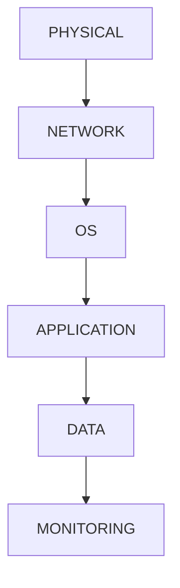

---

# Linux Attack Surface

Every running component increases risk.

Examples:

```text
SSH

Web Servers

Databases

Containers

Cron Jobs

Users

Sudo Rules
```

---

# Attack Surface Model

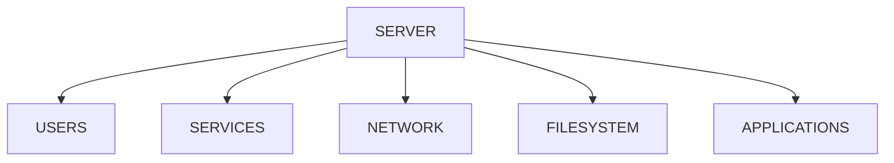

---

# Lab Environment Setup

Gather baseline information:

```bash
hostnamectl

uname -r

id

who

ss -tulpn

systemctl list-units --type=service
```

---

# Lab Task 1

Document:

```text
Kernel Version

Logged-in Users

Running Services

Listening Ports
```

---

# Security Principle 1

## Minimize Attack Surface

Every service:

```text
Consumes Resources

Introduces Risk

Requires Maintenance
```

---

# Example

Check listening ports:

```bash
ss -tulpn
```

or:

```bash
sudo netstat -tulpn
```

---

# Service Exposure Model

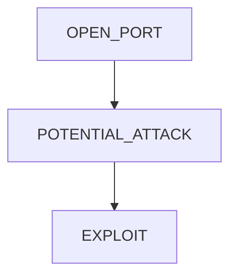

---

# Lab Task 2

Run:

```bash
ss -tulpn
```

Create table:

| Port | Service | Needed? |
| ---- | ------- | ------- |

---

# Security Principle 2

## Least Privilege

Users should receive:

```text
Minimum Necessary Access
```

Nothing more.

---

# Privilege Architecture

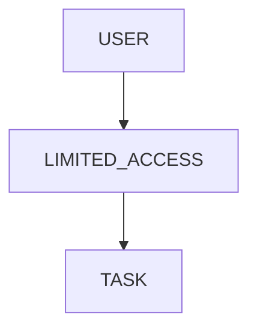

---

# Investigating Privileges

Check:

```bash
sudo -l

id

groups
```

---

# Lab Task 3

Audit:

```text
Users

Groups

Sudo Access
```

Identify excessive privileges.

---

# Security Principle 3

## Strong Authentication

Passwords are frequently attacked.

---

# Authentication Layers

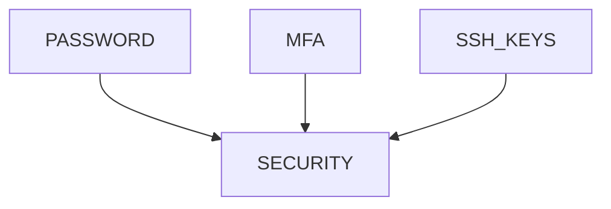

---

# Password Policy

Check:

```bash
sudo chage -l username
```

Review:

```text
Expiration

Age

Rotation
```

---

# Lab Task 4

Inspect password policies.

Document findings.

---

# SSH Hardening

SSH is often:

```text
The Main Entry Point
```

for attackers.

---

# SSH Architecture

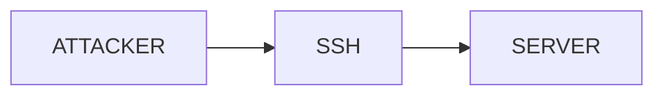

---

# Review Configuration

```bash
sudo grep -E "PermitRootLogin|PasswordAuthentication" \
/etc/ssh/sshd_config
```

---

# Recommended Settings

```text
PermitRootLogin no

PasswordAuthentication no

PubkeyAuthentication yes
```

---

# Why?

Eliminates:

```text
Root Login Attacks

Password Guessing
```

---

# Lab Task 5

Inspect SSH configuration.

Do NOT modify production servers blindly.

---

# Security Principle 4

## File Permission Hardening

Check:

```bash
find /home -type f -perm -777
```

Dangerous permissions:

```text
777

666
```

---

# Permission Risk Model

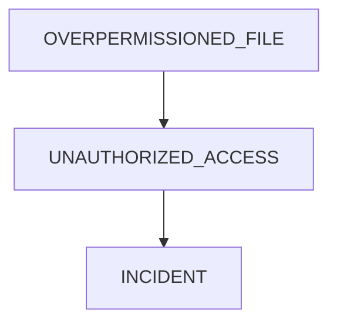

---

# Audit Sensitive Files

Examples:

```text
.env

id_rsa

config.yml

credentials.json
```

---

# Lab Task 6

Search:

```bash
find ~ -type f -perm /022
```

Identify risky files.

---

# Security Principle 5

## Secure Sudo

Review:

```bash
sudo -l
```

Inspect:

```bash
sudo visudo
```

---

# Dangerous Policy

```text
ALL=(ALL) NOPASSWD:ALL
```

---

# Why?

Essentially unrestricted root access.

---

# Sudo Risk Model

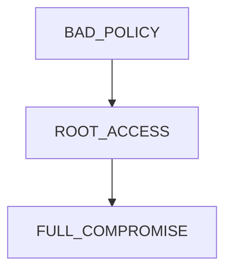

---

# Lab Task 7

Audit:

```text
Sudo Groups

NOPASSWD Rules

Excessive Permissions
```

---

# Security Principle 6

## Patch Management

Many attacks exploit:

```text
Known Vulnerabilities
```

not unknown ones.

---

# Patch Workflow

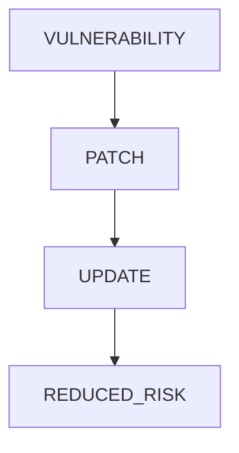

---

# Check Updates

Ubuntu:

```bash
sudo apt update

apt list --upgradable
```

RHEL:

```bash
sudo dnf check-update
```

---

# Lab Task 8

Determine:

```text
Available Updates

Kernel Updates

Security Updates
```

---

# Security Principle 7

## Logging And Auditing

If compromise occurs:

```text
Can You Detect It?
```

---

# Logging Architecture

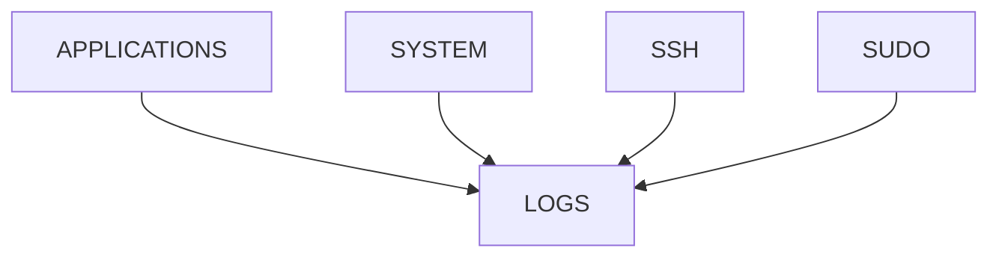

---

# Investigate Logs

```bash
journalctl

journalctl -xe

journalctl -u ssh
```

---

# Authentication Logs

Ubuntu:

```bash
grep ssh /var/log/auth.log
```

RHEL:

```bash
grep ssh /var/log/secure
```

---

# Lab Task 9

Review:

```text
SSH Events

Failed Logins

Sudo Activity
```

---

# Security Principle 8

## Service Hardening

Unused services should not run.

---

# Discover Services

```bash
systemctl list-unit-files --type=service
```

---

# Disable Example

```bash
sudo systemctl disable service

sudo systemctl stop service
```

---

# Service Hardening Model

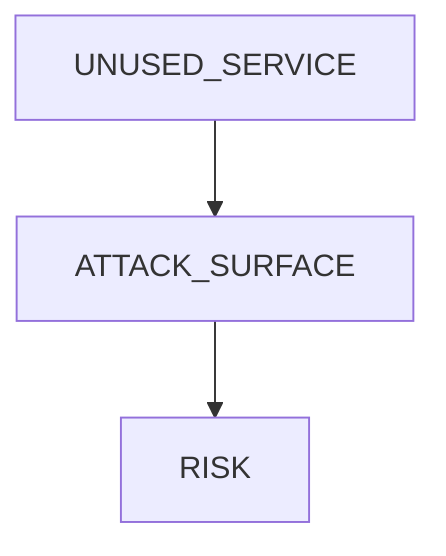

---

# Security Principle 9

## SetUID Audit

Find privileged binaries:

```bash
find / -perm -4000 2>/dev/null
```

---

# Why?

SetUID programs are common escalation targets.

---

# Privilege Escalation Flow

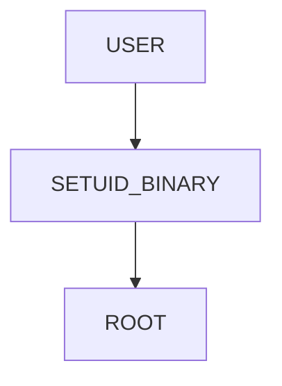

---

# Lab Task 10

Audit:

```bash
find / -perm -4000 2>/dev/null
```

Categorize findings.

---

# Security Principle 10

## Secrets Protection

Never store:

```text
Passwords

API Keys

Tokens
```

with weak permissions.

---

# Secret Storage Model

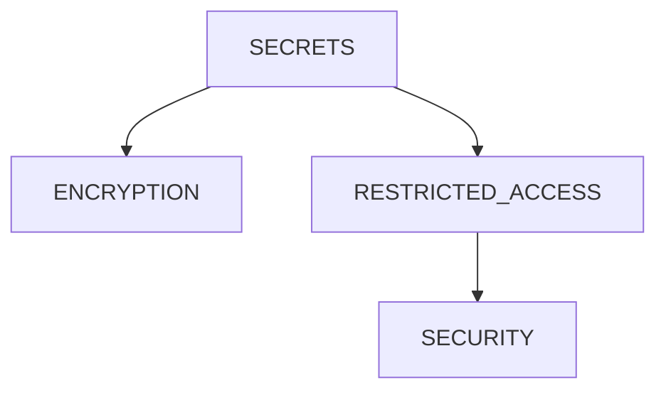

---

# Recommended Permissions

```text
600

640
```

for secrets.

---

# Linux Hardening Checklist

## Users

```text
Remove Unused Accounts

Enforce Strong Passwords

Use MFA
```

---

## SSH

```text
Disable Root Login

Use Keys

Limit Access
```

---

## Services

```text
Disable Unused Services

Close Unused Ports
```

---

## Filesystem

```text
Audit Permissions

Protect Secrets
```

---

## Updates

```text
Apply Security Patches
```

---

## Monitoring

```text
Collect Logs

Monitor Access
```

---

# Enterprise Hardening Architecture

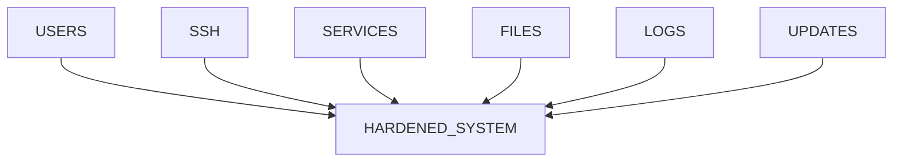

---

# Docker Connection

Containers add new attack surfaces.

Hardening includes:

```text
Non-Root Containers

Read-Only Filesystems

Minimal Images

Capability Restrictions
```

---

# Container Security Model

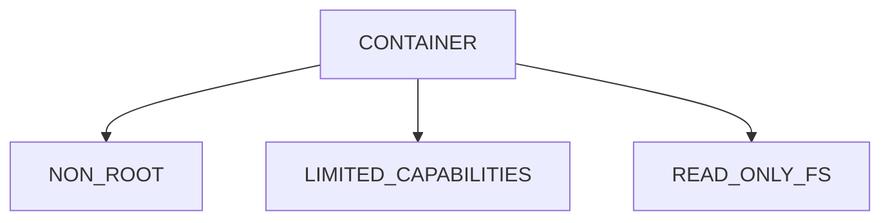

---

# Kubernetes Connection

Production clusters enforce:

```text
RBAC

Pod Security Standards

Network Policies

Non-Root Pods
```

---

# Kubernetes Security Architecture

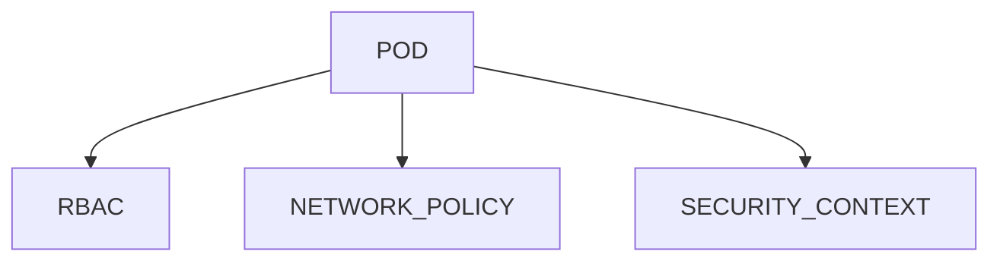

---

# Cloud Connection

Cloud hardening extends Linux hardening.

Additional controls:

```text
IAM

Security Groups

Encryption

Audit Trails
```

---

# Cloud Security Layers

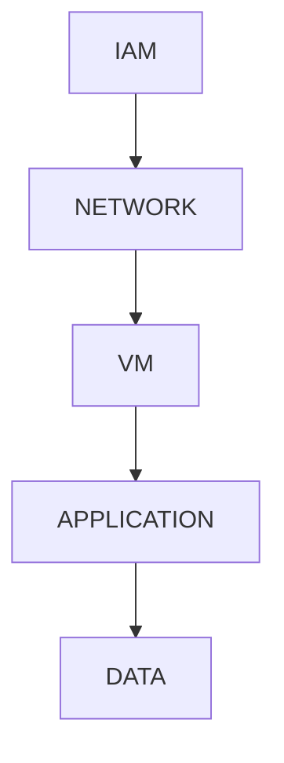

---

# Guided Challenge

Audit:

```bash
id

groups

sudo -l

ss -tulpn

journalctl
```

Document findings.

---

# Semi-Guided Challenge

Create a hardening report for your Linux machine.

Include:

```text
Users

Ports

Services

Sudo

SSH

Updates
```

---

# Independent Challenge

Design a hardening strategy for:

```text
Startup SaaS Platform

Ubuntu Servers

Docker

PostgreSQL

Nginx

CI/CD
```

Include:

```text
Identity

Access Control

Network Security

Logging

Patch Management

Incident Response
```

---

# Linux Internals Deep Dive

Security checks occur continuously:

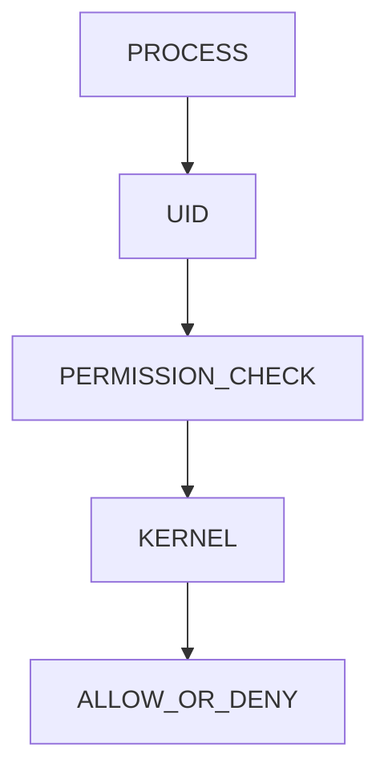

Every file access.

Every network connection.

Every process creation.

Every privilege escalation.

Passes through security controls.

---

# Performance Considerations

Security introduces:

```text
Authentication Checks

Logging

Auditing
```

Minor overhead.

Benefits vastly outweigh costs.

---

# Common Mistakes

## Mistake 1

Running everything as root.

---

## Mistake 2

Using password authentication only.

---

## Mistake 3

Ignoring updates.

---

## Mistake 4

Leaving unused services enabled.

---

## Mistake 5

Using 777 permissions.

---

## Mistake 6

Ignoring logs.

---

## Mistake 7

Trusting default configurations.

---

# Troubleshooting

## Open Ports

```bash
ss -tulpn
```

---

## Services

```bash
systemctl list-units --type=service
```

---

## Sudo Access

```bash
sudo -l
```

---

## SSH Settings

```bash
sudo grep -E \
"PermitRootLogin|PasswordAuthentication" \
/etc/ssh/sshd_config
```

---

## Updates

```bash
apt list --upgradable
```

---

## Logs

```bash
journalctl -xe
```

---

# Engineering Mindset

Beginners think:

```text
How Do I Make This Work?
```

Engineers think:

```text
How Can This Be Exploited?

How Can I Reduce Risk?

How Can I Detect Abuse?

How Can I Recover From Failure?
```

Security hardening is not a checklist.

It is a way of thinking.

---

# Interview Questions

### What is security hardening?

Reducing attack surface and improving security posture.

---

### Why disable root SSH login?

To reduce attack opportunities.

---

### Why use least privilege?

To limit blast radius after compromise.

---

### Why audit SetUID binaries?

They are common privilege escalation targets.

---

### Why are logs important?

They provide detection, auditing, and forensic evidence.

---

### What is attack surface?

The total number of exposed components that can be attacked.

---

### Why patch systems?

To remove known vulnerabilities.

---

### What is defense in depth?

Multiple independent security layers.

---

# Cheat Sheet

```bash
id

groups

sudo -l

ss -tulpn

systemctl list-units --type=service

journalctl -xe

journalctl -u ssh

find / -perm -4000 2>/dev/null

apt list --upgradable

grep ssh /var/log/auth.log

sudo visudo
```

---

# Lab Success Criteria

You can complete this lab when you can:

✅ Explain attack surface

✅ Explain least privilege

✅ Audit users and privileges

✅ Harden SSH

✅ Audit file permissions

✅ Audit sudo policies

✅ Review logs

✅ Identify unnecessary services

✅ Understand patch management

✅ Connect Linux security to Docker

✅ Connect Linux security to Kubernetes

✅ Connect Linux security to Cloud

✅ Think like a security engineer

Congratulations.

You have completed the Permissions & Security Labs section.

You now understand the identity, authorization, privilege delegation, access control, auditing, and hardening mechanisms that form the foundation of Linux security, cloud security, container security, and modern infrastructure engineering.
