# Lab 01 – Process Lifecycle

> Files store data.
>
> Processes perform work.
>
> Every application you use:
>
> ```text
> Chrome
> Nginx
> PostgreSQL
> Docker
> Kubernetes
> Redis
> VS Code
> ```
>
> eventually becomes:
>
> ```text
> One Or More Linux Processes
> ```
>
> Understanding the Linux process lifecycle is one of the most important concepts in operating systems, backend engineering, cloud computing, containerization, and distributed systems.
>
> If files are the "data" of Linux:
>
> ```text
> Processes Are The Living Organisms
> Of The Operating System
> ```

---

# Lab Objective

By the end of this lab you will:

* Understand what a process is
* Understand process creation
* Understand process states
* Understand process hierarchy
* Understand parent-child relationships
* Understand process termination
* Understand zombie processes
* Understand orphan processes
* Investigate process metadata
* Connect processes to containers and cloud infrastructure
* Think like a Linux systems engineer

---

# Why This Matters

Imagine:

```text
Your Website Is Down
```

Question:

```text
Is Nginx Running?

Is PostgreSQL Running?

Did The Process Crash?

Is It Stuck?

Is It Waiting?
```

Every production incident eventually becomes:

```text
A Process Investigation
```

---

# The Problem

A computer must run many tasks simultaneously.

Example:

```text
Browser

Terminal

Database

Web Server

SSH Session

Background Services
```

How does Linux manage all of them?

Answer:

```text
Processes
```

---

# Mental Model

Think of Linux as a city.

Files:

```text
Buildings
```

Processes:

```text
People
```

Memory:

```text
Workspace
```

CPU:

```text
Road Network
```

Scheduler:

```text
Traffic Controller
```

---

# First Principles

A program is:

```text
Static
```

Example:

```text
/usr/bin/nginx
```

A process is:

```text
A Running Instance
Of A Program
```

---

# Program vs Process

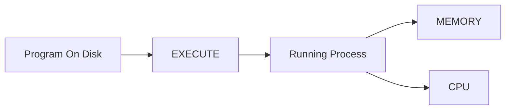

---

# Example

Program:

```bash
ls -l /usr/bin/nginx
```

Process:

```bash
ps aux | grep nginx
```

---

# Core Idea

One program can create:

```text
1 Process

10 Processes

1000 Processes
```

---

# Example

Open multiple terminals:

```bash
bash
bash
bash
```

Each creates:

```text
Separate Process
```

---

# Process Architecture

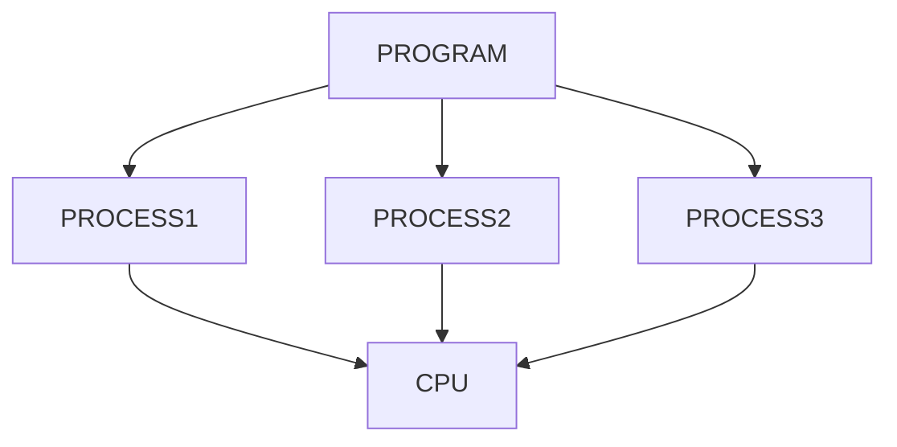

---

# Lab Environment Setup

Create workspace:

```bash
mkdir -p ~/process-lifecycle-lab

cd ~/process-lifecycle-lab
```

---

# Viewing Processes

Basic command:

```bash
ps
```

Better:

```bash
ps aux
```

or:

```bash
ps -ef
```

---

# Lab Task 1

Run:

```bash
ps aux | head
```

Identify:

```text
PID

USER

CPU

MEMORY
```

---

# Understanding PID

Every process receives:

```text
PID

(Process ID)
```

Example:

```bash
ps -ef
```

Output:

```text
UID   PID   PPID
```

---

# Why PID Exists

Linux needs a unique identifier.

Just like:

```text
Student Roll Number

Employee ID

Passport Number
```

---

# PID Visualization

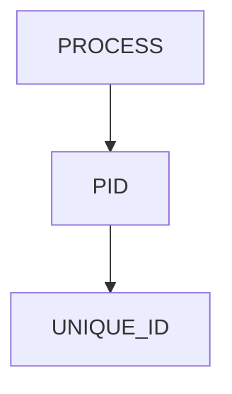

---

# Lab Task 2

Find current shell PID:

```bash
echo $$
```

Verify:

```bash
ps -p $$
```

---

# Understanding Process Metadata

Every process contains:

```text
PID

PPID

UID

GID

State

Memory

CPU Usage

Open Files

Environment Variables
```

---

# Process Structure

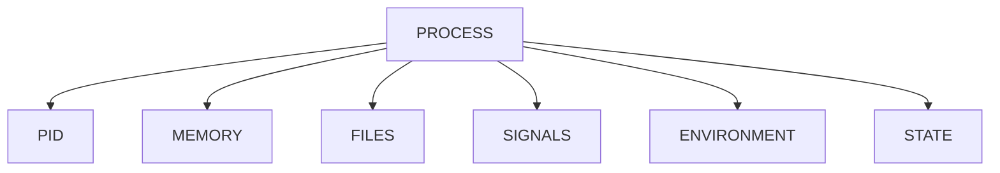

---

# Process Creation

Linux creates processes using:

```text
fork()
```

and

```text
exec()
```

---

# Why Two Steps?

Fork:

```text
Create Child Process
```

Exec:

```text
Replace Child
With New Program
```

---

# Process Creation Flow

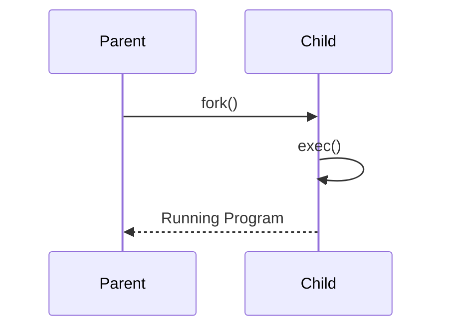

---

# Real Example

Shell:

```bash
ls
```

Internally:

```text
bash

↓

fork()

↓

child

↓

exec(ls)
```

---

# Lab Task 3

Open another terminal.

Run:

```bash
sleep 300
```

Inspect:

```bash
ps -ef | grep sleep
```

Observe process creation.

---

# Parent And Child Processes

Every process originates from:

```text
Another Process
```

---

# Process Tree

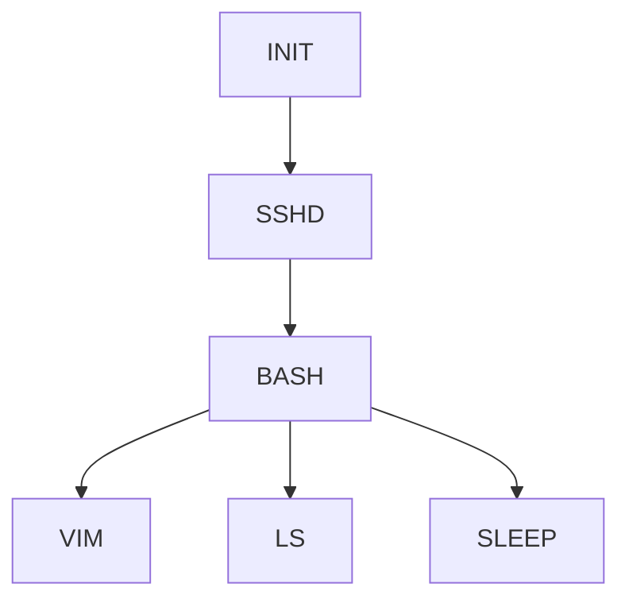

---

# Viewing Process Trees

Install:

```bash
sudo apt install psmisc
```

Use:

```bash
pstree
```

or:

```bash
pstree -p
```

---

# Lab Task 4

Run:

```bash
pstree -p
```

Observe:

```text
Parent

Child

Hierarchy
```

---

# Understanding PPID

PPID:

```text
Parent Process ID
```

Example:

```bash
ps -ef
```

Observe:

```text
PID

PPID
```

---

# Process Hierarchy Model

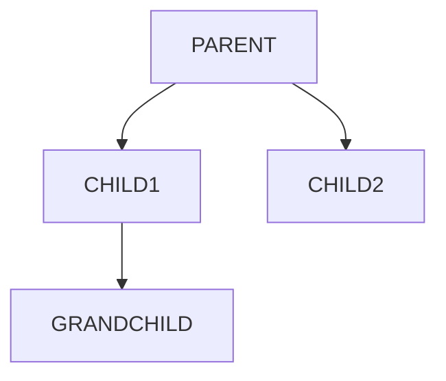

---

# Process States

Processes are not always running.

---

# Main States

| State | Meaning               |
| ----- | --------------------- |
| R     | Running               |
| S     | Sleeping              |
| D     | Uninterruptible Sleep |
| T     | Stopped               |
| Z     | Zombie                |

---

# State Machine

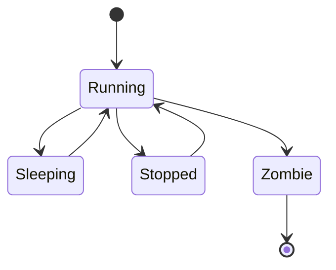

---

# Running State

Process actively using CPU.

Example:

```bash
yes > /dev/null
```

---

# Sleeping State

Most common state.

Process waiting for:

```text
Input

Network

Disk

Events
```

---

# Example

```bash
sleep 100
```

Process sleeps.

---

# Lab Task 5

Run:

```bash
sleep 300
```

Inspect:

```bash
ps aux | grep sleep
```

Identify state.

---

# Uninterruptible Sleep (D)

Waiting for:

```text
Disk

Storage

Hardware
```

Usually indicates:

```text
I/O Wait
```

---

# Why Production Engineers Care

Many D-state processes may indicate:

```text
Storage Failure

NFS Problems

Slow Disks
```

---

# Process State Visualization

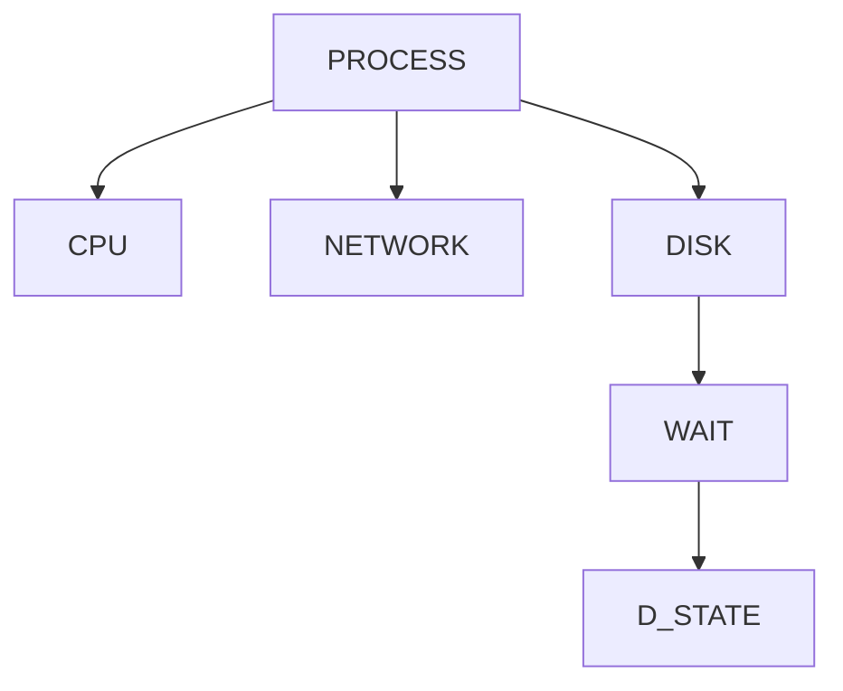

---

# Stopped Processes

Suspend process:

```bash
sleep 500

CTRL+Z
```

State becomes:

```text
T
```

---

# Lab Task 6

Run:

```bash
sleep 500
```

Press:

```text
CTRL+Z
```

Inspect:

```bash
jobs

ps
```

---

# Process Termination

Processes eventually end.

---

# Reasons

```text
Normal Completion

Signal

Crash

Kill Command
```

---

# Lifecycle Overview

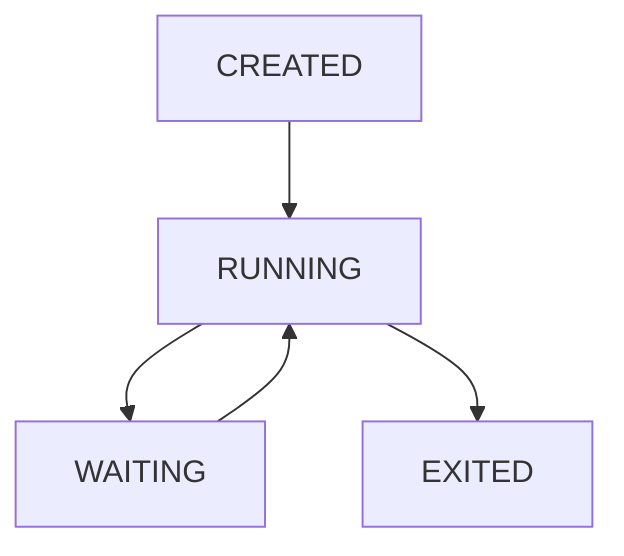

---

# Signals

Linux communicates with processes using:

```text
Signals
```

---

# Common Signals

| Signal  | Meaning       |
| ------- | ------------- |
| SIGTERM | Graceful Stop |
| SIGKILL | Force Kill    |
| SIGINT  | Ctrl+C        |
| SIGHUP  | Reload        |
| SIGSTOP | Pause         |

---

# Viewing Signals

```bash
kill -l
```

---

# Lab Task 7

Run:

```bash
sleep 300
```

Find PID:

```bash
ps -ef | grep sleep
```

Terminate:

```bash
kill PID
```

Observe behavior.

---

# Zombie Processes

One of Linux's most famous concepts.

---

# What Is A Zombie?

Process has:

```text
Finished Execution
```

but parent has not:

```text
Collected Exit Status
```

---

# Zombie Lifecycle

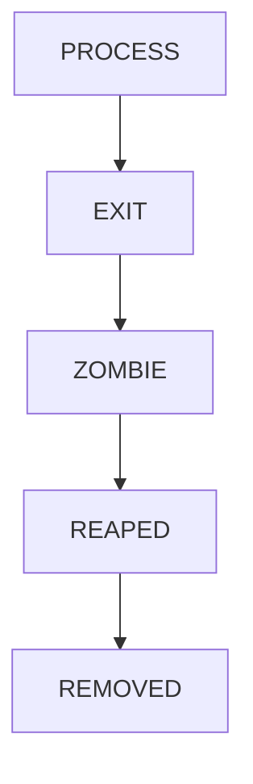

---

# Why Zombies Exist

Parent process needs:

```text
Exit Code

Statistics

Status
```

before cleanup.

---

# Zombie State

```text
Z
```

---

# Viewing Zombies

```bash
ps aux | grep Z
```

---

# Orphan Processes

Opposite situation.

---

# What Happens?

Parent dies.

Child remains.

---

# Example

```text
Parent Process Dies

Child Still Running
```

---

# Linux Solution

Orphan gets adopted by:

```text
PID 1
```

---

# Orphan Adoption

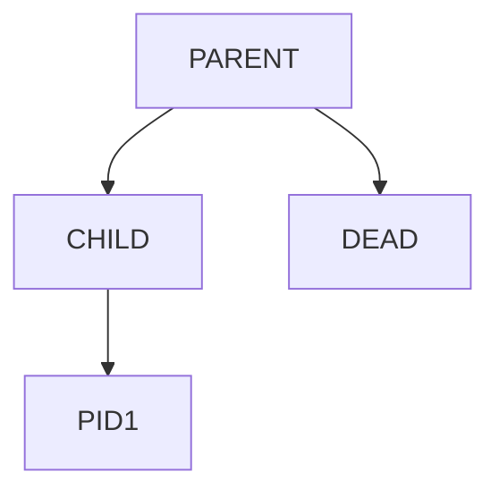

---

# Why PID 1 Matters

Historically:

```text
init
```

Modern Linux:

```text
systemd
```

PID:

```text
1
```

---

# View PID 1

```bash
ps -p 1
```

---

# Lab Task 8

Investigate:

```bash
ps -p 1 -f
```

Identify:

```text
init

systemd
```

---

# Linux Internals

Process creation:

```text
fork()
```

creates:

```text
task_struct
```

inside kernel.

---

# Kernel Process Model

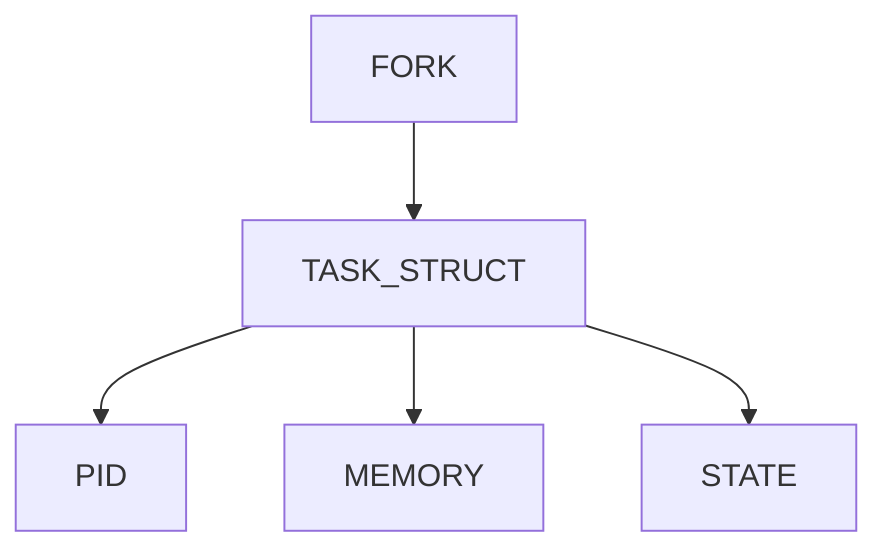

---

# Context Switching

CPU can execute:

```text
One Task Per Core
```

at a time.

Scheduler rapidly switches.

---

# Scheduling Model

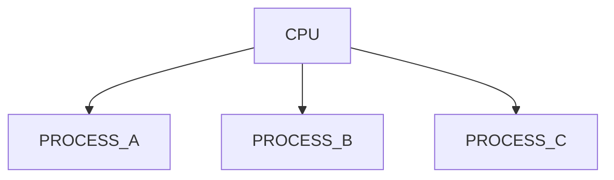

---

# Why Processes Matter

Everything becomes a process:

```text
Docker Containers

Kubernetes Pods

Databases

Web Servers

SSH Sessions
```

---

# Docker Connection

Container:

```text
Is Ultimately A Linux Process
```

---

# Container Architecture

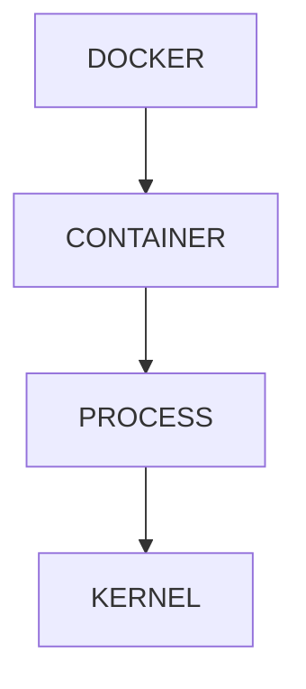

---

# Kubernetes Connection

Pod:

```text
One Or More Processes
```

inside namespaces and cgroups.

---

# Kubernetes Model

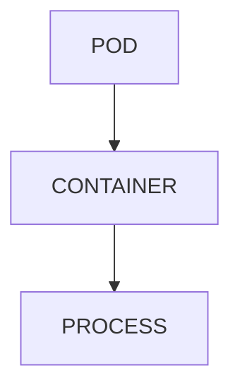

---

# Cloud Connection

Cloud VM:

```text
Linux

↓

Processes

↓

Services

↓

Applications
```

---

# Production Example

Website Request:

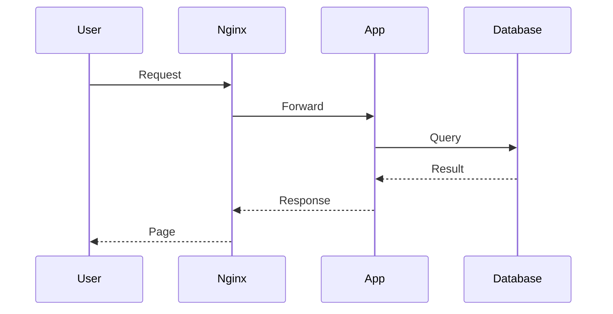

Every participant:

```text
Process
```

---

# Guided Challenge

Investigate:

```bash
ps aux

pstree -p

echo $$

ps -p 1
```

Document findings.

---

# Semi-Guided Challenge

Launch:

```bash
sleep 300

yes > /dev/null
```

Observe:

```text
State

CPU Usage

PID
```

---

# Independent Challenge

Create process map for:

```text
Browser

Terminal

SSH

Database

Docker
```

Explain:

```text
Parent

Child

Lifecycle

Termination
```

---

# Performance Considerations

Too many processes create:

```text
Scheduler Overhead

Memory Pressure

Context Switching Costs
```

---

# Security Considerations

Compromised process may gain:

```text
File Access

Network Access

Resource Access
```

depending on permissions.

---

# Common Mistakes

## Mistake 1

Confusing program with process.

---

## Mistake 2

Using SIGKILL immediately.

---

## Mistake 3

Ignoring zombie processes.

---

## Mistake 4

Ignoring process trees.

---

## Mistake 5

Not understanding parent-child relationships.

---

# Troubleshooting

## View Processes

```bash
ps aux
```

---

## View Tree

```bash
pstree -p
```

---

## Current Shell

```bash
echo $$
```

---

## PID 1

```bash
ps -p 1
```

---

## Process State

```bash
ps aux
```

---

## Kill Process

```bash
kill PID
```

---

## Force Kill

```bash
kill -9 PID
```

---

# Engineering Mindset

Beginners think:

```text
Applications Run
```

Engineers think:

```text
Which Process?

Which Parent?

Which State?

Which PID?

Which Signal?

Which Resource?
```

Everything in Linux starts with understanding processes.

---

# Interview Questions

### What is a process?

A running instance of a program.

---

### Difference between program and process?

Program is static.
Process is executing.

---

### What is PID?

Process ID.

---

### What is PPID?

Parent Process ID.

---

### What creates processes?

fork() and exec().

---

### What is a zombie process?

Exited process waiting for parent cleanup.

---

### What is an orphan process?

Child whose parent died.

---

### What process usually adopts orphans?

PID 1 (systemd/init).

---

### What does SIGTERM do?

Gracefully requests termination.

---

### What does SIGKILL do?

Immediately kills process.

---

# Cheat Sheet

```bash
ps

ps aux

ps -ef

pstree

pstree -p

echo $$

ps -p 1

kill PID

kill -9 PID

kill -l

jobs

bg

fg
```

---

# Lab Success Criteria

You can complete this lab when you can:

✅ Explain process lifecycle

✅ Explain PID and PPID

✅ Explain fork and exec

✅ Understand process states

✅ Identify running processes

✅ Read process trees

✅ Explain zombies

✅ Explain orphans

✅ Use signals

✅ Connect processes to Docker

✅ Connect processes to Kubernetes

✅ Think like a Linux systems engineer

Congratulations.

You now understand the fundamental execution model of Linux. Every application, container, database, web server, and cloud workload ultimately becomes a collection of Linux processes moving through this lifecycle.
