# Lab 02 – Foreground and Background Processes

> One of Linux's greatest strengths is its ability to perform multiple tasks simultaneously.
>
> While you are:
>
> ```text
> Editing Code
>
> Downloading Files
>
> Running Backups
>
> Monitoring Logs
>
> Executing Scripts
> ```
>
> Linux manages all of these activities using:
>
> ```text
> Foreground Processes
>
> Background Processes
>
> Job Control
> ```
>
> Understanding job control is essential for:
>
> * Linux Users
> * System Administrators
> * Backend Engineers
> * DevOps Engineers
> * Cloud Engineers
> * SREs
>
> because production systems constantly run long-lived background services and workloads.

---

# Lab Objective

By the end of this lab you will:

* Understand foreground processes
* Understand background processes
* Understand job control
* Use jobs command
* Use bg and fg
* Understand process groups
* Understand terminal control
* Understand nohup
* Understand detached processes
* Connect background processes to servers and containers
* Think like a Linux operator

---

# Why This Matters

Imagine running:

```bash
python backup.py
```

The script takes:

```text
4 Hours
```

Question:

```text
Can You Still Use The Terminal?
```

Without job control:

```text
No
```

Linux solves this problem using:

```text
Foreground

Background

Session Management
```

---

# The Problem

A terminal can interact with:

```text
One Foreground Process Group
```

at a time.

But engineers often need:

```text
Long Running Tasks

Monitoring

Automation

Multiple Activities
```

simultaneously.

---

# Mental Model

Think of your terminal as a microphone.

Foreground process:

```text
Currently Holding The Microphone
```

Background process:

```text
Working Quietly Behind The Scenes
```

Only one process can directly interact with the terminal at a time.

---

# First Principles

Every process belongs to:

```text
A Process Group
```

One process group controls:

```text
The Terminal
```

This is called:

```text
Foreground Process Group
```

---

# Terminal Control Architecture

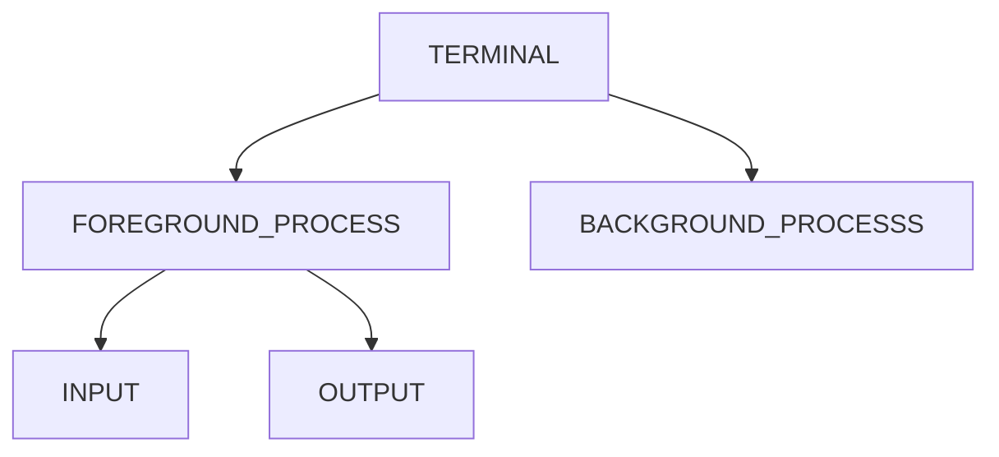

---

# Understanding Foreground Processes

Foreground processes:

```text
Receive Keyboard Input

Control Terminal

Display Output Directly
```

Example:

```bash
sleep 30
```

Your terminal becomes occupied.

---

# Foreground Process Flow


---

# Lab Task 1

Run:

```bash
sleep 60
```

Observe:

```text
Terminal Is Blocked
```

Try typing commands.

What happens?

---

# Why Foreground Exists

Interactive programs require:

```text
Keyboard Access
```

Examples:

```text
vim

nano

top

htop

less
```

---

# Interactive Process Model

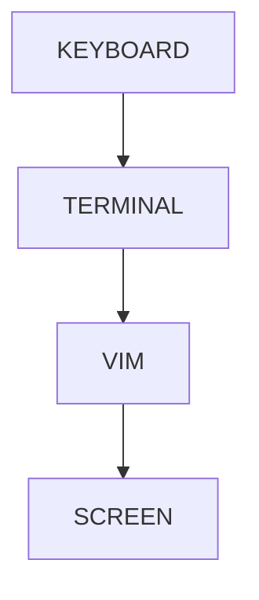

---

# Understanding Background Processes

Background processes:

```text
Continue Running

Do Not Control Terminal
```

---

# Start Background Process

```bash
sleep 300 &
```

Notice:

```text
[1] 12345
```

Where:

```text
1 = Job Number

12345 = PID
```

---

# Background Execution Flow

```mermaid
flowchart LR

COMMAND

COMMAND --> "&"

"&" --> BACKGROUND_PROCESS

BACKGROUND_PROCESS --> RUNNING
```

---

# Lab Task 2

Run:

```bash
sleep 300 &
```

Check:

```bash
jobs
```

Observe output.

---

# Why Background Processes Matter

Examples:

```text
Large Downloads

Backups

Compilations

Log Collection

Data Processing
```

should not block the terminal.

---

# Production Example

Run:

```bash
tar -czf backup.tar.gz huge_directory &
```

Continue working while backup runs.

---

# Viewing Jobs

Current shell jobs:

```bash
jobs
```

Example:

```text
[1]+ Running sleep 300 &
```

---

# Job Architecture

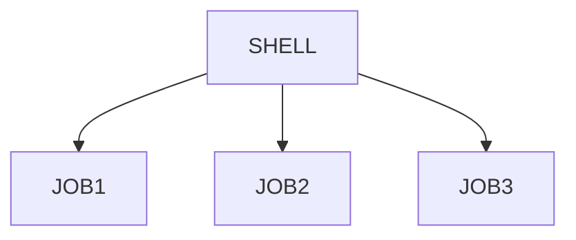

---

# Lab Task 3

Start:

```bash
sleep 200 &
sleep 300 &
sleep 400 &
```

Check:

```bash
jobs
```

Observe multiple jobs.

---

# Understanding Job Numbers

Example:

```text
[1]
[2]
[3]
```

These are:

```text
Shell Job IDs
```

Not:

```text
Linux PIDs
```

---

# Relationship


---

# Viewing Process IDs

Run:

```bash
jobs -l
```

Output:

```text
Job ID

PID

Status
```

---

# Lab Task 4

Run:

```bash
jobs -l
```

Map:

```text
Job Number

PID
```

for each process.

---

# Suspending Processes

Linux supports:

```text
Temporary Pause
```

using:

```text
CTRL + Z
```

---

# Example

Run:

```bash
sleep 500
```

Press:

```text
CTRL + Z
```

Result:

```text
Stopped
```

---

# Suspension Architecture

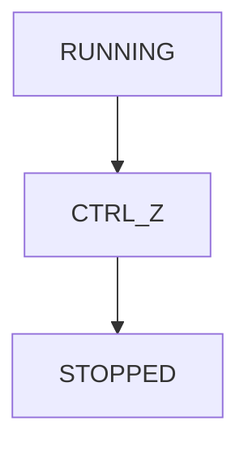

---

# Lab Task 5

Run:

```bash
sleep 500
```

Press:

```text
CTRL+Z
```

Check:

```bash
jobs
```

Observe status.

---

# Understanding Stopped Jobs

Stopped means:

```text
Process Exists

Memory Exists

Execution Paused
```

---

# State Transition

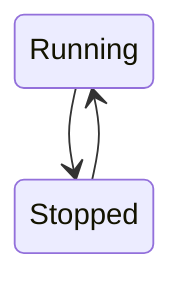

---

# Moving Jobs To Background

Continue stopped job:

```bash
bg %1
```

Meaning:

```text
Resume Job 1

In Background
```

---

# Background Recovery Flow


---

# Lab Task 6

Stop process.

Resume:

```bash
bg %1
```

Verify:

```bash
jobs
```

---

# Bringing Process To Foreground

Command:

```bash
fg %1
```

Moves job back to terminal.

---

# Foreground Recovery Flow


---

# Lab Task 7

Run:

```bash
fg %1
```

Observe terminal ownership.

---

# Understanding Signals

Job control uses signals.

---

# CTRL+C

Sends:

```text
SIGINT
```

Meaning:

```text
Interrupt Process
```

---

# CTRL+Z

Sends:

```text
SIGTSTP
```

Meaning:

```text
Suspend Process
```

---

# Signal Architecture

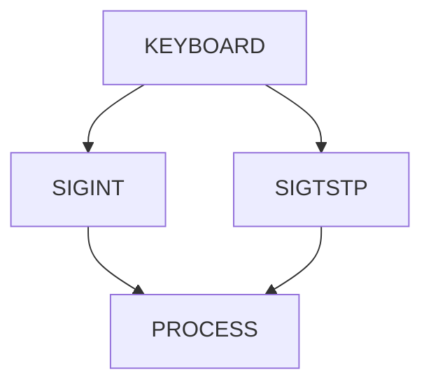

---

# Lab Task 8

Run:

```bash
sleep 300
```

Try:

```text
CTRL+C

CTRL+Z
```

Observe differences.

---

# Understanding Process Groups

Linux manages related processes together.

Example:

```bash
bash
 └── python
      └── worker
```

Same process group.

---

# Process Group Architecture

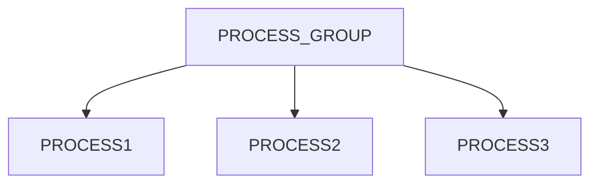

---

# Viewing Process Groups

Run:

```bash
ps -efj
```

Observe:

```text
PGID
```

(Process Group ID)

---

# Lab Task 9

Run:

```bash
ps -efj
```

Locate:

```text
PID

PPID

PGID
```

---

# Understanding nohup

Problem:

```text
SSH Session Ends
```

Background job may terminate.

---

# Example

Start:

```bash
python script.py &
```

Disconnect.

Result:

```text
Process May Die
```

---

# Solution

```bash
nohup python script.py &
```

---

# What nohup Does

Ignores:

```text
SIGHUP
```

signal.

---

# nohup Architecture

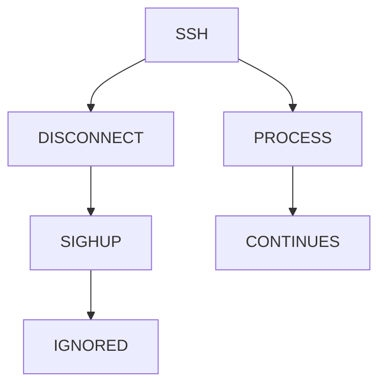

---

# Lab Task 10

Run:

```bash
nohup sleep 600 &
```

Observe:

```text
nohup.out
```

created.

---

# Why Servers Use Detached Processes

Examples:

```text
Web Servers

Databases

Monitoring Agents

Backup Systems
```

must survive terminal exits.

---

# Service Architecture

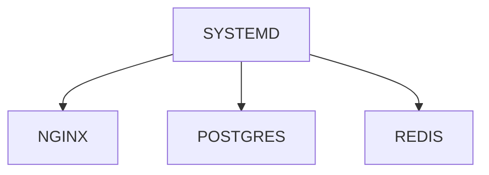

These are effectively long-lived background processes.

---

# Understanding disown

Remove job from shell tracking:

```bash
disown %1
```

---

# Why Useful?

After logout:

```text
Process Continues
```

without shell management.

---

# Job Control Flow

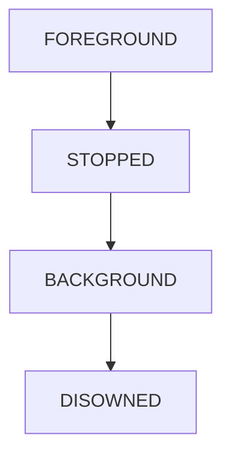

---

# Real Production Scenario

Developer:

```bash
python migrate.py
```

Migration takes:

```text
2 Hours
```

Better:

```bash
nohup python migrate.py > migrate.log 2>&1 &
```

Result:

```text
Process Continues

Logs Saved

Terminal Free
```

---

# Linux Internals

Each terminal maintains:

```text
Session

Process Groups

Foreground Group
```

Kernel routes signals accordingly.

---

# Terminal Control Architecture

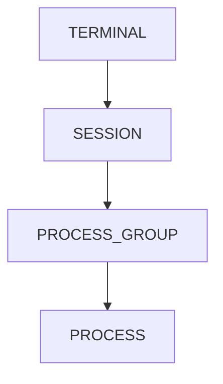

---

# Foreground vs Background

| Feature             | Foreground | Background |
| ------------------- | ---------- | ---------- |
| Keyboard Input      | Yes        | No         |
| Controls Terminal   | Yes        | No         |
| Visible Interaction | Yes        | Limited    |
| Interactive Apps    | Yes        | No         |
| Long Tasks          | Sometimes  | Ideal      |

---

# Docker Connection

Container main process:

```text
PID 1
```

typically runs in foreground.

Example:

```bash
docker run nginx
```

Foreground container.

---

# Container Process Model

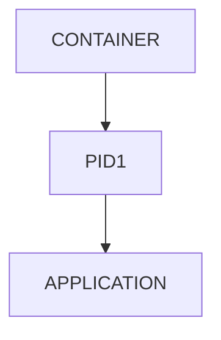

---

# Kubernetes Connection

Pods run:

```text
Foreground Process
```

inside container.

If PID 1 exits:

```text
Container Stops
```

---

# Kubernetes Architecture

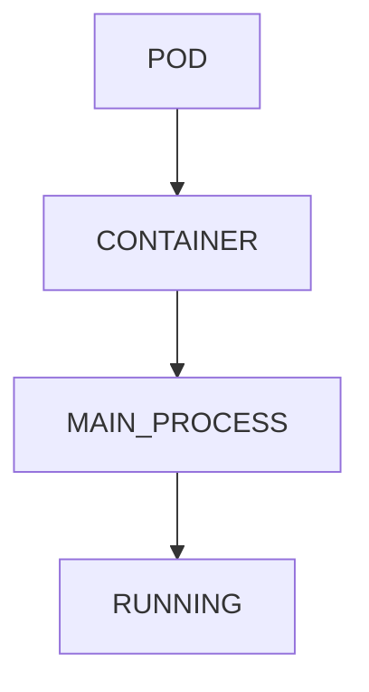

---

# Cloud Connection

Production servers rely heavily on:

```text
Background Processes

Daemons

Services
```

managed by:

```text
systemd
```

---

# Guided Challenge

Investigate:

```bash
jobs

jobs -l

ps -efj

nohup sleep 600 &
```

Document results.

---

# Semi-Guided Challenge

Create:

```text
Foreground Job

Stopped Job

Background Job

Detached Job
```

Observe lifecycle.

---

# Independent Challenge

Design execution strategy for:

```text
Backup Script

Database Migration

Log Monitoring

Long Build Process
```

Choose:

```text
Foreground?

Background?

nohup?

systemd?
```

Explain why.

---

# Performance Considerations

Too many background jobs may cause:

```text
CPU Contention

Memory Pressure

I/O Saturation
```

---

# Security Considerations

Background processes may:

```text
Consume Resources

Leak Secrets

Continue Running Unexpectedly
```

Always audit:

```bash
ps aux
```

---

# Common Mistakes

## Mistake 1

Confusing Job ID with PID.

---

## Mistake 2

Using CTRL+Z instead of proper shutdown.

---

## Mistake 3

Forgetting nohup for long SSH jobs.

---

## Mistake 4

Running too many background processes.

---

## Mistake 5

Ignoring detached workloads.

---

# Troubleshooting

## View Jobs

```bash
jobs
```

---

## View PID

```bash
jobs -l
```

---

## Resume Background

```bash
bg %1
```

---

## Bring Foreground

```bash
fg %1
```

---

## Detach Process

```bash
disown %1
```

---

## Run Detached

```bash
nohup command &
```

---

## View Processes

```bash
ps aux
```

---

# Engineering Mindset

Beginners think:

```text
Programs Run
```

Engineers think:

```text
Who Owns The Terminal?

Which Process Group?

Can It Survive Logout?

How Is It Managed?

Who Will Restart It?
```

---

# Interview Questions

### What is a foreground process?

A process controlling the terminal.

---

### What is a background process?

A process running without terminal control.

---

### What does & do?

Starts process in background.

---

### What does jobs show?

Current shell jobs.

---

### Difference between job ID and PID?

Job ID is shell-specific.
PID is system-wide.

---

### What does CTRL+Z do?

Suspends process.

---

### What does bg do?

Resumes process in background.

---

### What does fg do?

Moves process to foreground.

---

### What does nohup do?

Allows process to survive hangups/logout.

---

### What signal does CTRL+C send?

SIGINT.

---

# Cheat Sheet

```bash
sleep 300 &

jobs

jobs -l

bg %1

fg %1

nohup command &

disown %1

ps aux

ps -efj

echo $$

kill PID
```

---

# Lab Success Criteria

You can complete this lab when you can:

✅ Explain foreground processes

✅ Explain background processes

✅ Use jobs

✅ Use bg

✅ Use fg

✅ Suspend processes

✅ Understand process groups

✅ Use nohup

✅ Use disown

✅ Connect job control to Linux servers

✅ Connect processes to Docker and Kubernetes

✅ Think like a Linux operator

Congratulations.

You now understand Linux job control—the foundation of interactive terminals, long-running workloads, automation, server administration, remote operations, and production process management.
