# Lab 03 – Linux Signals

> Every operating system needs a way for processes to communicate.
>
> Imagine:
>
> ```text
> Stop This Process
>
> Reload Configuration
>
> Pause Execution
>
> Save State
>
> Shut Down Gracefully
> ```
>
> How does Linux tell a running process to perform these actions?
>
> The answer is:
>
> ```text
> Signals
> ```
>
> Signals are one of the oldest and most fundamental Inter-Process Communication (IPC) mechanisms in Unix and Linux.
>
> Understanding signals is essential for:
>
> * Linux Users
> * System Administrators
> * Backend Engineers
> * DevOps Engineers
> * SREs
> * Platform Engineers
> * Container Engineers
>
> because nearly every production system relies on signals for lifecycle management.

---

# Lab Objective

By the end of this lab you will:

* Understand why signals exist
* Understand signal architecture
* Understand signal delivery
* Use kill and killall
* Use pkill
* Investigate common signals
* Understand graceful vs forceful termination
* Understand signal handlers
* Connect signals to systemd, Docker, and Kubernetes
* Think like a production engineer

---

# Why This Matters

Imagine:

```text
Nginx Is Running
```

You update:

```text
nginx.conf
```

Question:

```text
How Can Nginx Reload Configuration

Without Restarting?
```

Linux solves this using:

```text
Signals
```

---

# The Problem

Processes are independent.

Example:

```text
PostgreSQL

Redis

Nginx

Java Application

Node.js API
```

Need a way to tell them:

```text
Stop

Pause

Reload

Continue
```

without directly modifying memory.

---

# Mental Model

Think of signals as:

```text
Emergency Notifications
```

for processes.

Examples:

```text
Fire Alarm

Pause Announcement

Shutdown Notice

Resume Work Notification
```

Processes receive signals similarly.

---

# First Principles

Signals are:

```text
Asynchronous Notifications
```

sent to processes.

A signal means:

```text
Attention!

Something Happened!
```

---

# Signal Architecture


---

# Core Components

Every signal involves:

```text
Sender

Kernel

Target Process
```

---

# Signal Delivery Flow

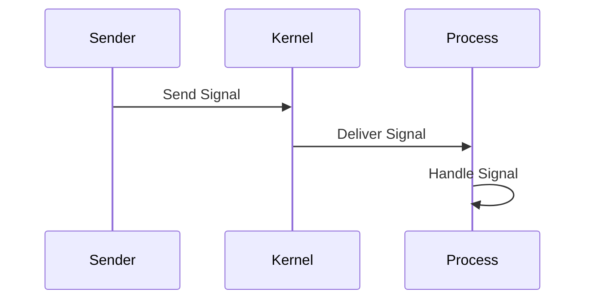

---

# Lab Environment Setup

Create workspace:

```bash
mkdir -p ~/signals-lab

cd ~/signals-lab
```

Start test process:

```bash
sleep 1000
```

Open another terminal.

---

# Understanding Process IDs

Signals target:

```text
PID
```

Example:

```bash
ps aux | grep sleep
```

Output:

```text
PID = 12345
```

---

# Lab Task 1

Run:

```bash
sleep 1000
```

Find PID:

```bash
ps aux | grep sleep
```

Record PID.

---

# The kill Command

Most famous signal command.

Syntax:

```bash
kill PID
```

Example:

```bash
kill 12345
```

---

# Important Misconception

The command:

```bash
kill
```

does not necessarily:

```text
Kill
```

a process.

It:

```text
Sends A Signal
```

---

# Signal Flow

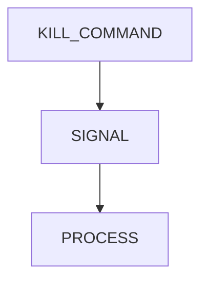

---

# Default Signal

Running:

```bash
kill PID
```

sends:

```text
SIGTERM
```

Signal number:

```text
15
```

---

# Why SIGTERM Exists

Allows:

```text
Cleanup

Save Data

Close Files

Release Resources
```

before termination.

---

# Graceful Shutdown Architecture

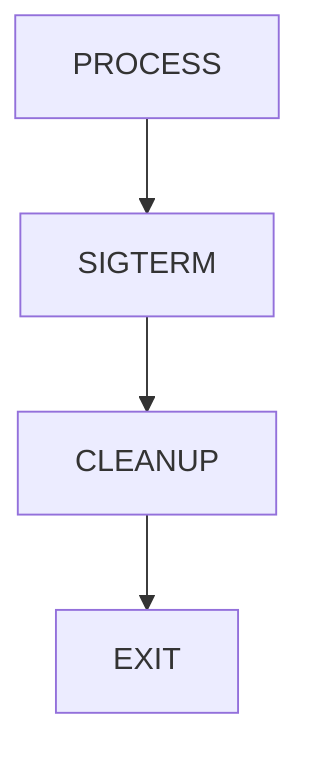

---

# Lab Task 2

Start:

```bash
sleep 1000
```

Find PID.

Terminate:

```bash
kill PID
```

Verify process exits.

---

# Viewing Available Signals

Run:

```bash
kill -l
```

Example output:

```text
1) SIGHUP

2) SIGINT

9) SIGKILL

15) SIGTERM

18) SIGCONT

19) SIGSTOP
```

---

# Lab Task 3

Run:

```bash
kill -l
```

Document:

```text
Signal Number

Signal Name
```

for common signals.

---

# Most Important Signals

| Signal  | Number | Purpose       |
| ------- | ------ | ------------- |
| SIGHUP  | 1      | Reload        |
| SIGINT  | 2      | Interrupt     |
| SIGQUIT | 3      | Quit          |
| SIGKILL | 9      | Force Kill    |
| SIGTERM | 15     | Graceful Stop |
| SIGSTOP | 19     | Pause         |
| SIGCONT | 18     | Resume        |

---

# Signal Map

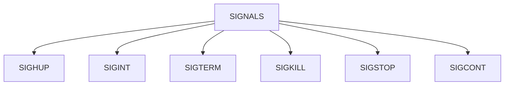

---

# Understanding SIGINT

Generated by:

```text
CTRL+C
```

---

# Example

Run:

```bash
sleep 1000
```

Press:

```text
CTRL+C
```

Process exits.

---

# Architecture


---

# Lab Task 4

Run:

```bash
sleep 1000
```

Press:

```text
CTRL+C
```

Observe termination.

---

# Understanding SIGSTOP

Pauses process.

Cannot be ignored.

---

# Example

Start:

```bash
sleep 1000
```

Find PID:

```bash
ps aux | grep sleep
```

Pause:

```bash
kill -STOP PID
```

---

# State Transition

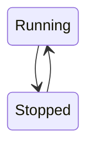

---

# Verify

Check:

```bash
ps aux
```

State:

```text
T
```

means:

```text
Stopped
```

---

# Lab Task 5

Pause process:

```bash
kill -STOP PID
```

Inspect state.

---

# Understanding SIGCONT

Resume stopped process.

Example:

```bash
kill -CONT PID
```

---

# Resume Flow


---

# Lab Task 6

Resume paused process.

Verify state changes.

---

# Understanding SIGHUP

Historically:

```text
Terminal Disconnected
```

signal.

Today commonly used for:

```text
Reload Configuration
```

---

# Example

Nginx:

```bash
sudo kill -HUP nginx_pid
```

Reloads configuration.

---

# Modern Reload Architecture

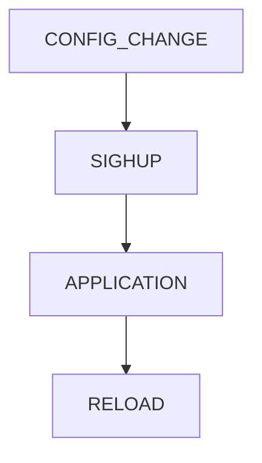

---

# Why Production Engineers Love SIGHUP

No downtime.

No restart.

No connection loss.

---

# Understanding SIGTERM

Recommended shutdown signal.

Example:

```bash
kill PID
```

or:

```bash
kill -TERM PID
```

---

# Graceful Termination

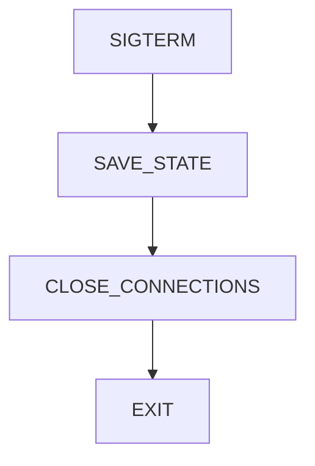

---

# Production Example

Database receives:

```text
SIGTERM
```

Database:

```text
Flushes Buffers

Writes Transactions

Closes Files
```

then exits.

---

# Understanding SIGKILL

Signal:

```text
9
```

Force termination.

---

# Example

```bash
kill -9 PID
```

or:

```bash
kill -KILL PID
```

---

# Why Dangerous?

Process cannot:

```text
Cleanup

Save Data

Flush Writes
```

---

# Force Kill Flow

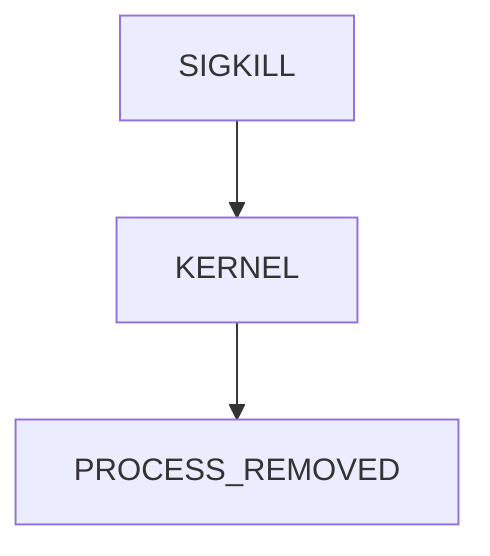

---

# Production Rule

Always:

```text
SIGTERM First
```

Only use:

```text
SIGKILL
```

if necessary.

---

# Lab Task 7

Start:

```bash
sleep 1000
```

Terminate using:

```bash
kill -9 PID
```

Observe behavior.

---

# Understanding killall

Target by name.

Example:

```bash
killall sleep
```

---

# Why Useful?

Avoid PID lookup.

---

# Architecture

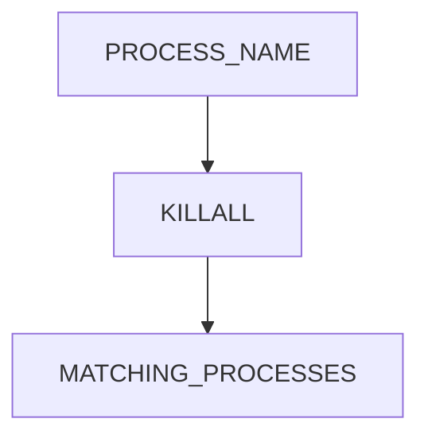

---

# Lab Task 8

Run multiple:

```bash
sleep 500 &
sleep 500 &
sleep 500 &
```

Terminate:

```bash
killall sleep
```

Observe.

---

# Understanding pkill

More powerful.

Example:

```bash
pkill sleep
```

---

# Why Useful?

Pattern matching.

---

# Examples

```bash
pkill nginx

pkill firefox

pkill -u username
```

---

# Process Selection Model

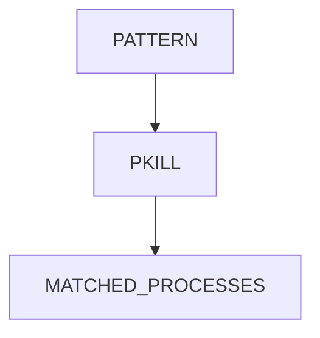

---

# Lab Task 9

Launch multiple sleep processes.

Use:

```bash
pkill sleep
```

Verify termination.

---

# Understanding Signal Handlers

Applications can react to signals.

Example:

```text
Node.js

Python

Java

Nginx

PostgreSQL
```

implement custom handlers.

---

# Handler Architecture

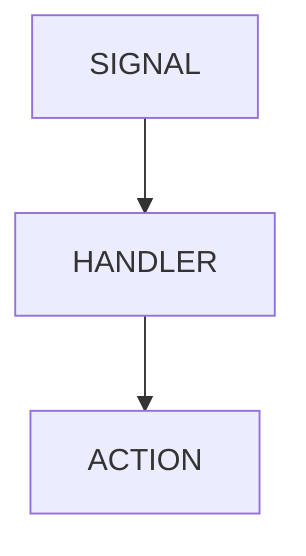

---

# Example Actions

SIGTERM:

```text
Save Data

Flush Logs

Shutdown Gracefully
```

SIGHUP:

```text
Reload Config
```

---

# Linux Internals

Signal delivery occurs through kernel structures.

Process contains:

```text
Pending Signals

Signal Masks

Signal Handlers
```

---

# Internal Model

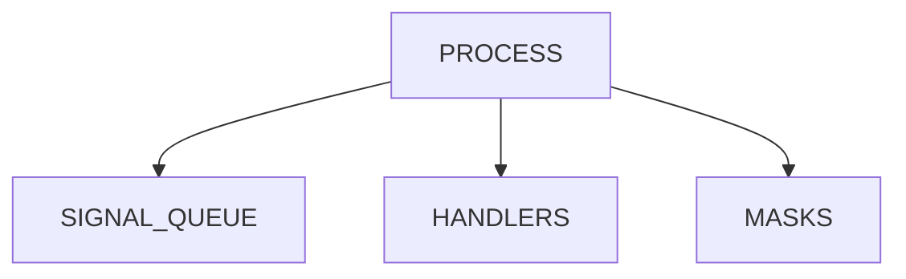

---

# Investigating Signals

View process details:

```bash
cat /proc/PID/status
```

Look for:

```text
SigQ

SigBlk

SigIgn

SigCgt
```

---

# Lab Task 10

Inspect:

```bash
cat /proc/$$/status
```

Find signal information.

---

# Signals And systemd

Systemd manages services using signals.

Stop service:

```bash
sudo systemctl stop nginx
```

Internally:

```text
SIGTERM

↓

SIGKILL (if required)
```

---

# Service Shutdown Flow

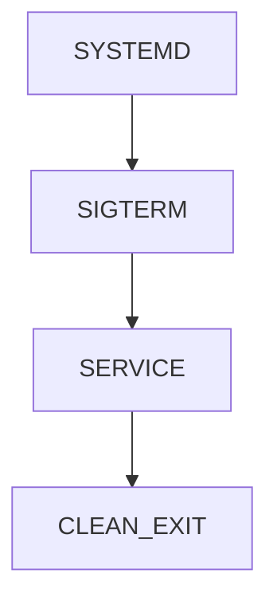

---

# Docker Connection

Container shutdown:

```bash
docker stop container
```

sends:

```text
SIGTERM
```

Waits.

Then:

```text
SIGKILL
```

if necessary.

---

# Docker Lifecycle

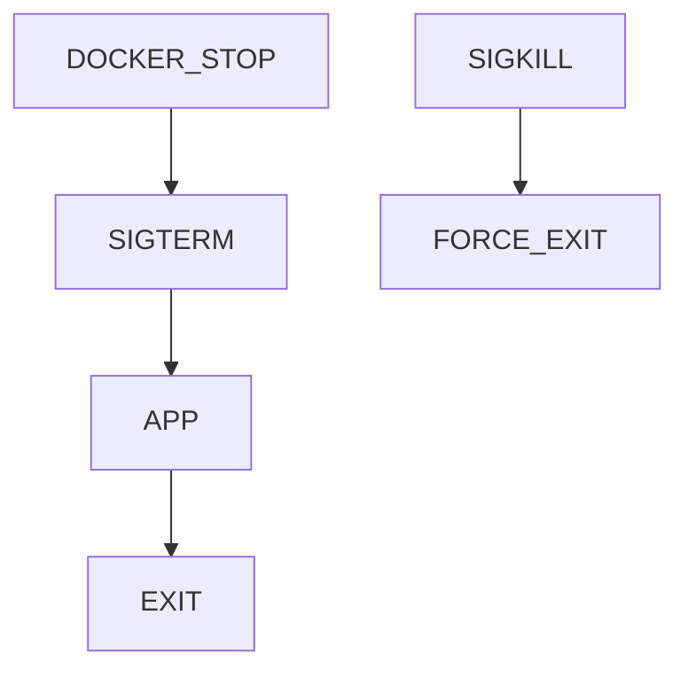

---

# Kubernetes Connection

Pod termination:

```text
SIGTERM

Grace Period

SIGKILL
```

---

# Kubernetes Shutdown Flow

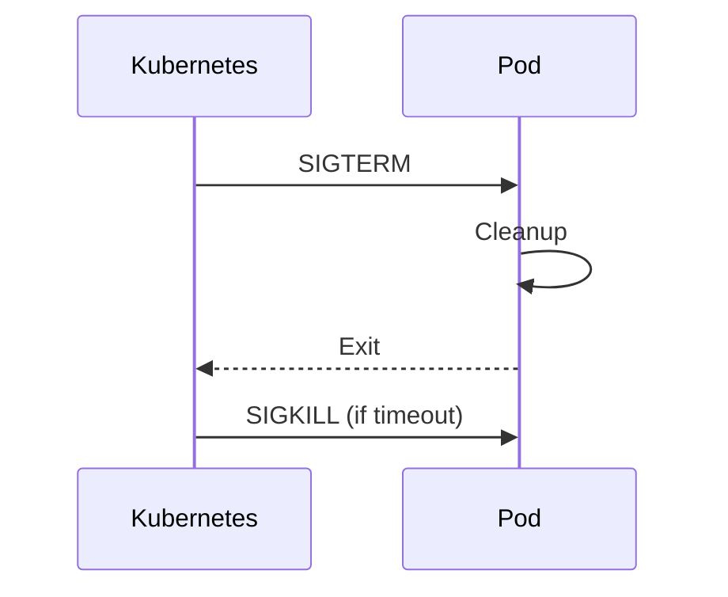

---

# Why This Matters

Applications must:

```text
Handle SIGTERM Properly
```

Otherwise:

```text
Lost Requests

Data Corruption

Failed Deployments
```

---

# Real Production Scenario

Deployment:

```text
Old Version

↓

SIGTERM

↓

Graceful Shutdown

↓

New Version
```

without downtime.

---

# Guided Challenge

Investigate:

```bash
kill -l

kill PID

kill -STOP PID

kill -CONT PID
```

Document behavior.

---

# Semi-Guided Challenge

Create process lifecycle:

```text
Start

Pause

Resume

Terminate
```

using signals.

---

# Independent Challenge

Design signal strategy for:

```text
Nginx

PostgreSQL

Node.js API

Redis
```

Determine:

```text
Reload Signal

Shutdown Signal

Emergency Signal
```

---

# Performance Considerations

Signals are:

```text
Extremely Lightweight
```

Kernel-level notifications.

---

# Security Considerations

Unauthorized signal sending can:

```text
Kill Services

Disrupt Workloads

Cause Outages
```

Permissions matter.

---

# Common Mistakes

## Mistake 1

Using SIGKILL first.

---

## Mistake 2

Ignoring graceful shutdown.

---

## Mistake 3

Killing wrong PID.

---

## Mistake 4

Ignoring signal handlers.

---

## Mistake 5

Not handling SIGTERM in applications.

---

# Troubleshooting

## List Signals

```bash
kill -l
```

---

## Send SIGTERM

```bash
kill PID
```

---

## Send SIGKILL

```bash
kill -9 PID
```

---

## Pause Process

```bash
kill -STOP PID
```

---

## Resume Process

```bash
kill -CONT PID
```

---

## Kill By Name

```bash
killall process
```

---

## Kill By Pattern

```bash
pkill process
```

---

# Engineering Mindset

Beginners think:

```text
kill = terminate
```

Engineers think:

```text
What Signal?

Can Application Cleanup?

Will Data Be Lost?

Can It Reload Instead?

Should We Gracefully Shutdown?
```

Signals are not merely process controls.

They are:

```text
The Communication Language
Between Linux Processes
And The Operating System
```

---

# Interview Questions

### What is a signal?

An asynchronous notification sent to a process.

---

### What signal does kill send by default?

SIGTERM (15).

---

### Difference between SIGTERM and SIGKILL?

SIGTERM allows cleanup.
SIGKILL immediately terminates.

---

### What signal does CTRL+C send?

SIGINT.

---

### What signal does CTRL+Z send?

SIGTSTP.

---

### What signal resumes a process?

SIGCONT.

---

### Why use SIGHUP?

Reload configuration.

---

### How does Docker stop containers?

SIGTERM followed by SIGKILL if necessary.

---

### How does Kubernetes terminate pods?

SIGTERM, grace period, then SIGKILL.

---

# Cheat Sheet

```bash
kill PID

kill -TERM PID

kill -9 PID

kill -STOP PID

kill -CONT PID

kill -HUP PID

kill -l

killall process

pkill process

ps aux

cat /proc/PID/status
```

---

# Lab Success Criteria

You can complete this lab when you can:

✅ Explain signals

✅ Send signals manually

✅ Use kill

✅ Use killall

✅ Use pkill

✅ Understand SIGTERM

✅ Understand SIGKILL

✅ Understand SIGSTOP

✅ Understand SIGCONT

✅ Understand SIGHUP

✅ Connect signals to systemd

✅ Connect signals to Docker

✅ Connect signals to Kubernetes

✅ Think like a production engineer

Congratulations.

You now understand Linux's fundamental process communication mechanism, which powers service management, graceful shutdowns, container orchestration, deployments, and production reliability across modern infrastructure.
