# Lab 04 – Process Monitoring

> Every production outage eventually becomes a monitoring problem.
>
> Questions engineers ask during incidents:
>
> ```text
> What Is Using CPU?
>
> What Is Consuming Memory?
>
> Which Process Is Stuck?
>
> Which Process Is Leaking Memory?
>
> Why Is The Server Slow?
>
> What Changed?
> ```
>
> Linux provides powerful tools to answer these questions.
>
> Process monitoring is one of the most important skills for:
>
> * Linux Administrators
> * Backend Engineers
> * DevOps Engineers
> * Cloud Engineers
> * SREs
> * Platform Engineers
>
> because production troubleshooting starts with understanding running processes.

---

# Lab Objective

By the end of this lab you will:

* Understand process monitoring
* Monitor CPU usage
* Monitor memory usage
* Monitor process states
* Use ps effectively
* Use top and htop
* Investigate process resource consumption
* Understand load averages
* Analyze bottlenecks
* Connect monitoring to cloud and containers
* Think like an SRE

---

# Why This Matters

Imagine:

```text
CPU = 100%

Website Slow

Database Timing Out

Users Complaining
```

Question:

```text
Which Process Is Responsible?
```

Without monitoring:

```text
Guessing
```

With monitoring:

```text
Evidence-Based Investigation
```

---

# The Problem

Linux systems constantly run:

```text
Web Servers

Databases

Containers

Background Jobs

Monitoring Agents

User Applications
```

Every process competes for:

```text
CPU

Memory

Disk

Network
```

Resources are limited.

---

# Mental Model

Think of a city.

Processes:

```text
Citizens
```

CPU:

```text
Road System
```

Memory:

```text
Housing
```

Disk:

```text
Warehouses
```

Network:

```text
Communication Lines
```

Monitoring tells us:

```text
Who Is Consuming Resources
```

---

# First Principles

Monitoring answers:

```text
Who?

What?

How Much?

For How Long?

Why?
```

---

# Process Resource Model

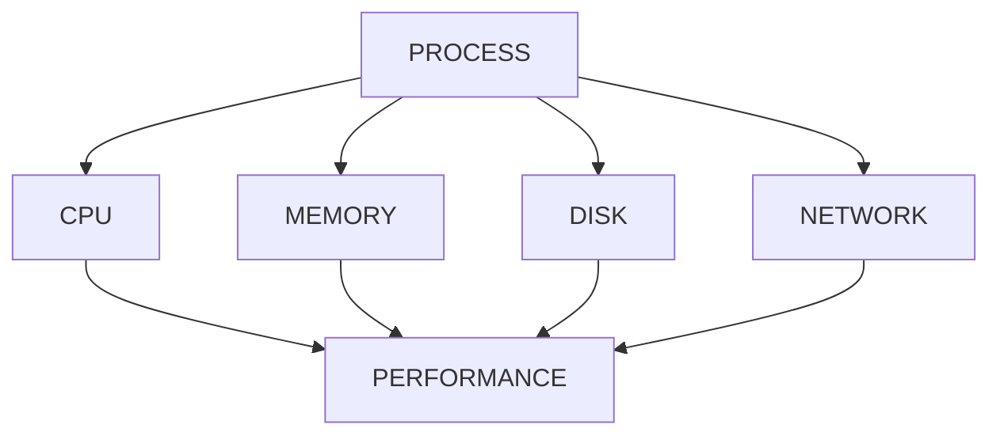

---

# Lab Environment Setup

Create workspace:

```bash
mkdir -p ~/process-monitoring-lab

cd ~/process-monitoring-lab
```

Create workload:

```bash
sleep 300 &
```

---

# Understanding ps

Most fundamental monitoring command.

Example:

```bash
ps
```

Better:

```bash
ps aux
```

or:

```bash
ps -ef
```

---

# Lab Task 1

Run:

```bash
ps aux | head
```

Identify:

```text
USER

PID

CPU

MEM

COMMAND
```

---

# Understanding ps Output

Example:

```text
USER PID %CPU %MEM COMMAND
```

Meaning:

| Field   | Meaning       |
| ------- | ------------- |
| USER    | Process Owner |
| PID     | Process ID    |
| %CPU    | CPU Usage     |
| %MEM    | Memory Usage  |
| COMMAND | Executable    |

---

# Process Visibility Architecture

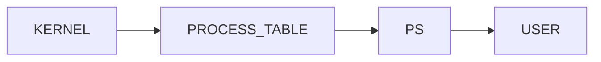

---

# Finding Specific Processes

Example:

```bash
ps aux | grep nginx
```

or:

```bash
ps -ef | grep postgres
```

---

# Lab Task 2

Find:

```bash
ps aux | grep sleep
```

Analyze output.

---

# Sorting By CPU Usage

Identify CPU-heavy processes:

```bash
ps aux --sort=-%cpu | head
```

---

# Why Useful?

Immediately shows:

```text
Top CPU Consumers
```

---

# Visualization

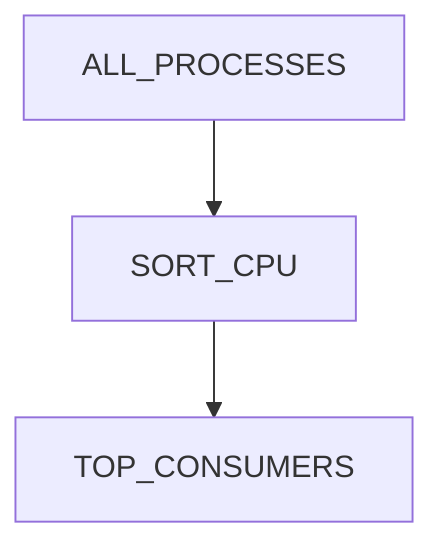

---

# Lab Task 3

Run:

```bash
ps aux --sort=-%cpu | head
```

Document top 5 processes.

---

# Sorting By Memory Usage

Find memory consumers:

```bash
ps aux --sort=-%mem | head
```

---

# Why Important?

Memory issues often cause:

```text
Slowness

OOM Events

Container Crashes
```

---

# Memory Monitoring Flow

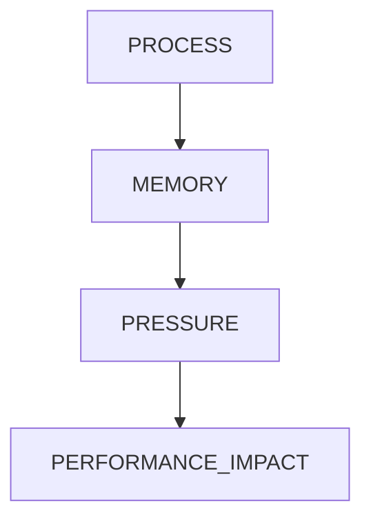

---

# Lab Task 4

Run:

```bash
ps aux --sort=-%mem | head
```

Analyze top memory consumers.

---

# Understanding top

Real-time monitoring tool.

Launch:

```bash
top
```

---

# What top Shows

```text
CPU

Memory

Load Average

Tasks

Process List
```

Live.

---

# top Architecture

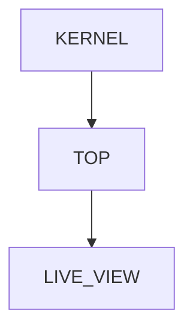

---

# Lab Task 5

Run:

```bash
top
```

Observe:

```text
CPU

MEM

TASKS

LOAD
```

Press:

```text
q
```

to quit.

---

# Understanding Load Average

One of Linux's most misunderstood metrics.

Example:

```text
Load Average:

0.15 0.20 0.30
```

---

# What It Means

Average number of tasks:

```text
Running

Waiting For CPU

Waiting For Resources
```

---

# Time Windows

```text
1 Minute

5 Minutes

15 Minutes
```

---

# Load Average Visualization

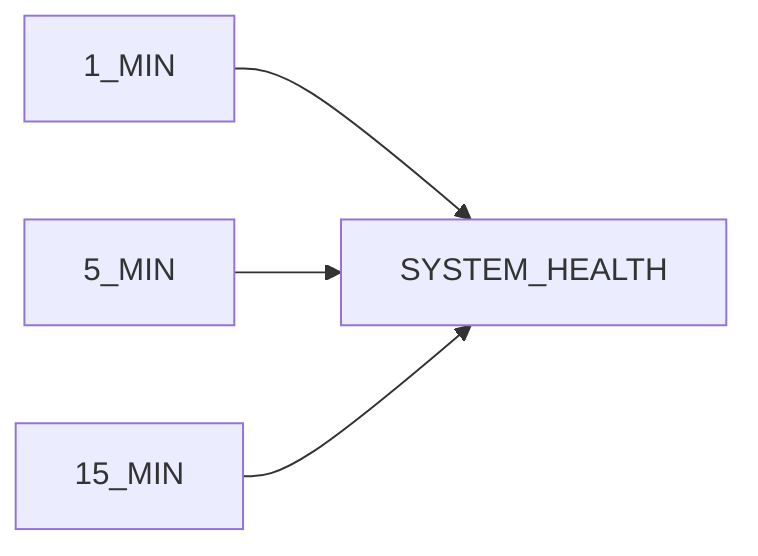

---

# Understanding CPU Cores

Example:

```text
4 CPU Cores
```

Load:

```text
4.0
```

means:

```text
System Fully Utilized
```

---

# Load Interpretation

| Cores | Load | Meaning    |
| ----- | ---- | ---------- |
| 4     | 1    | Light Load |
| 4     | 2    | Moderate   |
| 4     | 4    | Fully Busy |
| 4     | 8    | Overloaded |

---

# Lab Task 6

Run:

```bash
uptime
```

Interpret load average.

---

# Understanding htop

Improved version of top.

Install:

Ubuntu:

```bash
sudo apt install htop
```

RHEL:

```bash
sudo dnf install htop
```

---

# Launch

```bash
htop
```

---

# Advantages

```text
Colors

Mouse Support

Sorting

Filtering

Tree View
```

---

# htop Architecture

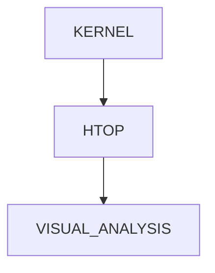

---

# Lab Task 7

Run:

```bash
htop
```

Explore:

```text
CPU Bars

Memory Bars

Process Tree
```

---

# Understanding Memory Usage

Monitor:

```bash
free -h
```

Example:

```text
Total

Used

Free

Available
```

---

# Memory Flow

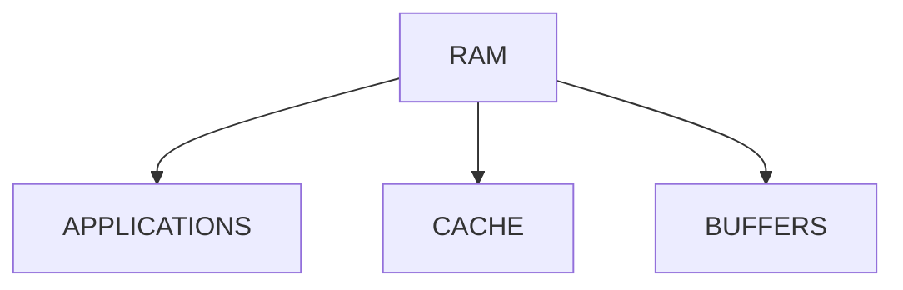

---

# Why Available Matters

Linux uses:

```text
Unused RAM

For Cache
```

which improves performance.

---

# Lab Task 8

Run:

```bash
free -h
```

Interpret:

```text
Used

Available

Cache
```

---

# Investigating Process Memory

Detailed view:

```bash
pmap PID
```

Example:

```bash
pmap 1234
```

---

# Why Useful?

Analyze:

```text
Memory Allocation

Memory Growth

Leaks
```

---

# Process Memory Model

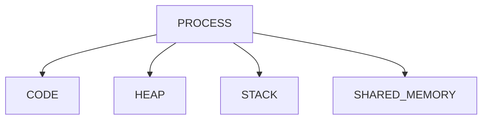

---

# Understanding /proc

Linux exposes process information via:

```text
/proc
```

---

# Example

```bash
ls /proc/PID
```

---

# Important Files

```text
status

maps

stat

cmdline
```

---

# Lab Task 9

Inspect current shell:

```bash
cat /proc/$$/status
```

Analyze output.

---

# Monitoring Open Files

Every process opens files.

View:

```bash
lsof -p PID
```

---

# Why Important?

Find:

```text
Log Files

Sockets

Database Files

Network Connections
```

---

# Open File Architecture

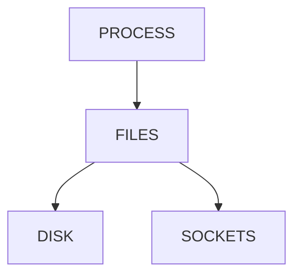

---

# Lab Task 10

Find PID:

```bash
echo $$
```

View:

```bash
lsof -p $$
```

Analyze results.

---

# Understanding vmstat

System-wide statistics:

```bash
vmstat 1
```

Updates every second.

---

# Useful Fields

```text
CPU

Memory

Swap

Context Switches
```

---

# vmstat Architecture

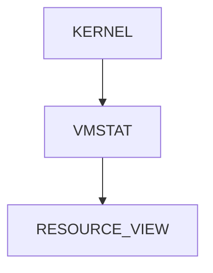

---

# Understanding pidstat

Per-process statistics.

Install:

```bash
sudo apt install sysstat
```

Run:

```bash
pidstat 1
```

---

# Why SREs Use pidstat

Monitor:

```text
CPU

Memory

Context Switches

I/O
```

per process.

---

# Process Analysis Workflow

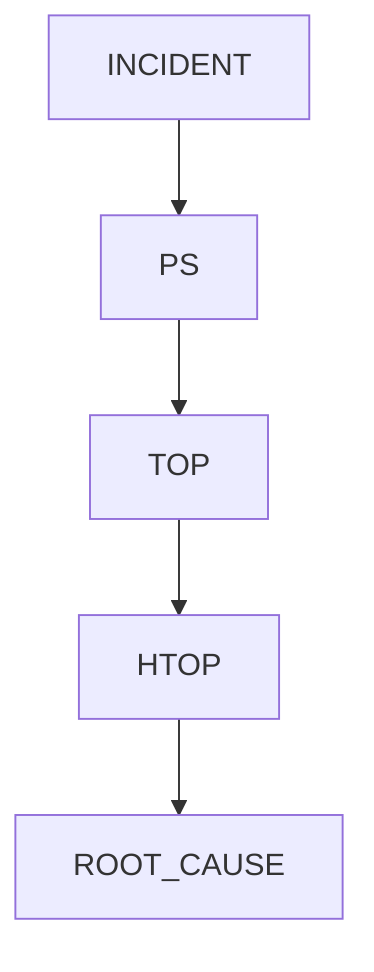

---

# Real Production Scenario

User reports:

```text
Website Slow
```

Investigation:

```bash
top

ps aux --sort=-%cpu

free -h

vmstat 1
```

Finding:

```text
CPU Saturation
```

Root cause identified.

---

# CPU Bottleneck Investigation

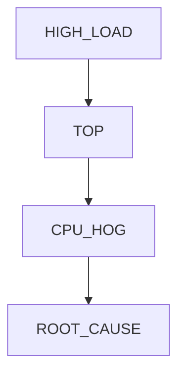

---

# Linux Internals

Process statistics originate from:

```text
task_struct
```

inside kernel.

Kernel tracks:

```text
CPU Time

Memory

State

Scheduling Info
```

---

# Internal Monitoring Architecture

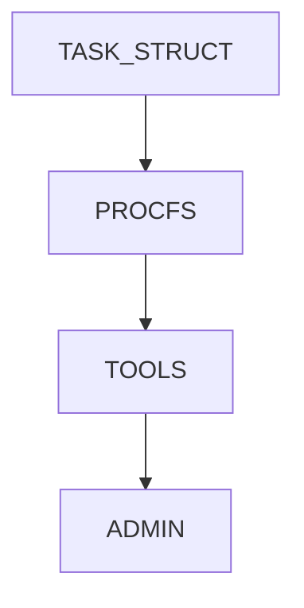

---

# Docker Connection

Containers are:

```text
Linux Processes
```

with namespaces and cgroups.

Monitor:

```bash
docker stats
```

---

# Container Monitoring Model

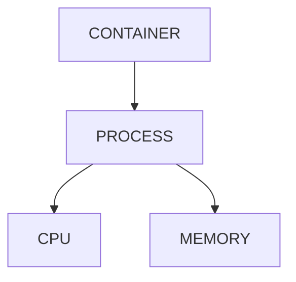

---

# Kubernetes Connection

Pods ultimately contain:

```text
Processes
```

Monitoring tools:

```text
kubectl top

Prometheus

Grafana
```

build on Linux process metrics.

---

# Kubernetes Monitoring Architecture

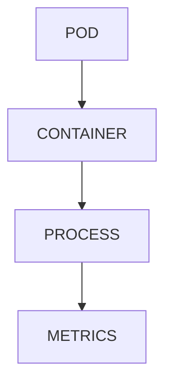

---

# Cloud Connection

Cloud monitoring services:

Examples:

```text
CloudWatch

Azure Monitor

Google Operations Suite
```

collect Linux process metrics.

---

# Monitoring Pyramid

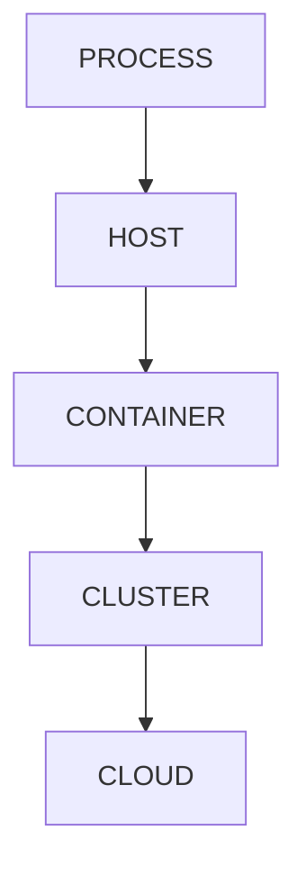

---

# Guided Challenge

Investigate:

```bash
ps aux

top

htop

free -h

uptime
```

Document observations.

---

# Semi-Guided Challenge

Launch:

```bash
yes > /dev/null
```

Monitor:

```bash
top

ps aux --sort=-%cpu
```

Identify resource usage.

Terminate process afterward.

---

# Independent Challenge

Create monitoring report:

```text
CPU

Memory

Top Processes

Load Average

Open Files
```

for your system.

Explain findings.

---

# Performance Considerations

Monitoring itself consumes:

```text
CPU

Memory

I/O
```

Keep collection frequency reasonable.

---

# Security Considerations

Monitoring reveals:

```text
Users

Processes

Commands

Network Activity
```

Protect access to monitoring tools.

---

# Common Mistakes

## Mistake 1

Confusing load average with CPU percentage.

---

## Mistake 2

Ignoring memory pressure.

---

## Mistake 3

Only looking at CPU.

---

## Mistake 4

Ignoring process states.

---

## Mistake 5

Not investigating open files.

---

# Troubleshooting

## View Processes

```bash
ps aux
```

---

## CPU Usage

```bash
ps aux --sort=-%cpu
```

---

## Memory Usage

```bash
ps aux --sort=-%mem
```

---

## Real-Time Monitoring

```bash
top
```

---

## Enhanced Monitoring

```bash
htop
```

---

## Memory Overview

```bash
free -h
```

---

## Load Average

```bash
uptime
```

---

## Open Files

```bash
lsof -p PID
```

---

## System Statistics

```bash
vmstat 1
```

---

# Engineering Mindset

Beginners think:

```text
The Server Is Slow
```

Engineers think:

```text
Which Resource?

Which Process?

Which Bottleneck?

What Evidence?

What Trend?
```

Monitoring transforms:

```text
Assumptions
```

into:

```text
Facts
```

---

# Interview Questions

### What does ps do?

Displays process information.

---

### Difference between top and ps?

ps is snapshot-based.
top is real-time.

---

### What is load average?

Average number of runnable/waiting tasks.

---

### Why is memory cache important?

Improves filesystem performance.

---

### What does htop improve?

Visualization and usability.

---

### What is /proc?

Virtual filesystem exposing kernel and process information.

---

### What does lsof show?

Files opened by processes.

---

### Why monitor open files?

Identify resource usage and leaks.

---

### How are containers monitored?

Using Linux process and cgroup metrics.

---

# Cheat Sheet

```bash
ps aux

ps -ef

ps aux --sort=-%cpu

ps aux --sort=-%mem

top

htop

free -h

uptime

vmstat 1

pidstat 1

lsof -p PID

cat /proc/PID/status
```

---

# Lab Success Criteria

You can complete this lab when you can:

✅ Use ps effectively

✅ Find CPU-heavy processes

✅ Find memory-heavy processes

✅ Use top

✅ Use htop

✅ Interpret load average

✅ Analyze memory usage

✅ Use /proc

✅ Investigate open files

✅ Connect monitoring to containers

✅ Connect monitoring to Kubernetes

✅ Think like an SRE

Congratulations.

You now understand the foundations of Linux process observability—the skills required to troubleshoot production systems, diagnose outages, monitor cloud infrastructure, analyze container workloads, and perform evidence-based performance investigations.
