# Lab 05 – Memory Analysis

> Most Linux performance problems are not CPU problems.
>
> They are:
>
> ```text
> Memory Problems
> ```
>
> Applications crash.
>
> Containers restart.
>
> Databases become slow.
>
> Kubernetes evicts pods.
>
> Servers freeze.
>
> Often the root cause is:
>
> ```text
> Memory Pressure
>
> Memory Leaks
>
> Swap Thrashing
>
> Out Of Memory Conditions
> ```
>
> Understanding memory analysis is one of the most important skills for:
>
> * Linux Engineers
> * Backend Engineers
> * DevOps Engineers
> * SREs
> * Database Administrators
> * Platform Engineers
>
> because modern systems are memory-intensive.

---

# Lab Objective

By the end of this lab you will:

* Understand Linux memory architecture
* Analyze memory usage
* Understand virtual memory
* Investigate memory pressure
* Understand swap behavior
* Detect memory leaks
* Understand OOM killer behavior
* Monitor memory-heavy processes
* Connect memory analysis to containers and Kubernetes
* Think like a performance engineer

---

# Why This Matters

Imagine:

```text
Website Suddenly Slow

Database Timing Out

Containers Restarting

System Freezing
```

CPU:

```text
20%
```

Disk:

```text
Normal
```

Network:

```text
Normal
```

What happened?

Very often:

```text
Memory Exhaustion
```

---

# The Problem

Applications need memory for:

```text
Code

Variables

Caches

Buffers

Connections

Threads
```

Memory is finite.

When demand exceeds supply:

```text
Performance Degrades
```

or:

```text
System Fails
```

---

# Mental Model

Think of RAM as a desk.

Small desk:

```text
Limited Workspace
```

Large desk:

```text
More Workspace
```

Too much work on a small desk:

```text
Constant Rearrangement
```

which is similar to:

```text
Swapping
```

---

# First Principles

Memory is the workspace where processes execute.

Without memory:

```text
No Process Can Run
```

---

# Linux Memory Architecture

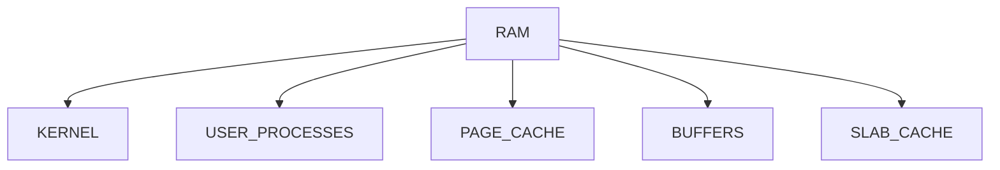

---

# Understanding RAM

Physical memory:

```text
Installed Hardware Memory
```

Example:

```text
8 GB

16 GB

64 GB
```

---

# View Memory

```bash
free -h
```

Example:

```text
total used free shared buff/cache available
```

---

# Lab Task 1

Run:

```bash
free -h
```

Record:

```text
Total Memory

Used Memory

Available Memory

Swap
```

---

# Why "Free Memory" Is Misleading

Many beginners see:

```text
Free = 200 MB
```

and panic.

Linux intentionally uses RAM for:

```text
Caching
```

---

# Memory Utilization Philosophy

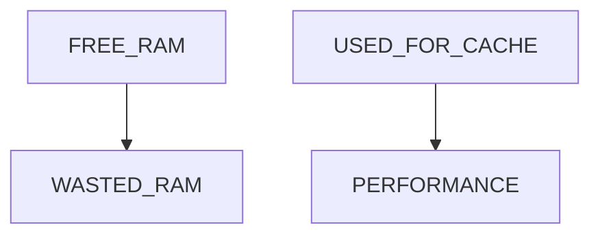

Linux prefers:

```text
Useful RAM
```

over:

```text
Unused RAM
```

---

# Important Metric

Focus on:

```text
Available Memory
```

not:

```text
Free Memory
```

---

# Memory Layout

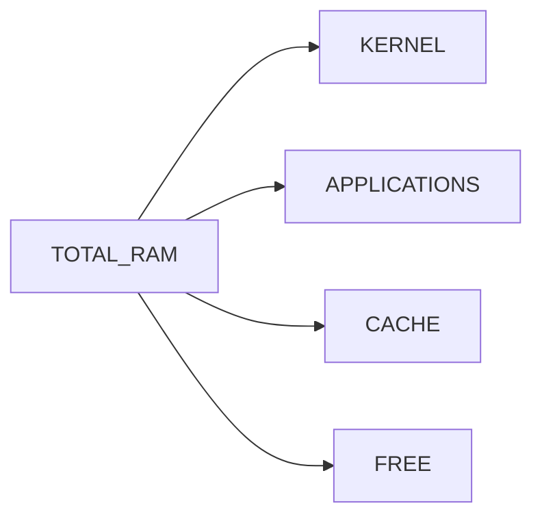

---

# Lab Task 2

Interpret:

```bash
free -h
```

Determine:

```text
How Much Is Cache?

How Much Is Available?
```

---

# Understanding Virtual Memory

Every process believes it owns:

```text
A Large Continuous Memory Space
```

Reality:

```text
Kernel Maps Virtual Memory

To Physical Memory
```

---

# Virtual Memory Architecture

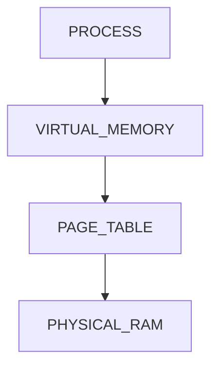

---

# Why Virtual Memory Exists

Provides:

```text
Isolation

Security

Flexibility

Large Address Spaces
```

---

# Example

Two processes may both think:

```text
Memory Starts At 0x0000
```

but map to different physical locations.

---

# Process Memory Components

Every process contains:

```text
Code Segment

Heap

Stack

Shared Libraries

Memory Mapped Files
```

---

# Process Memory Layout

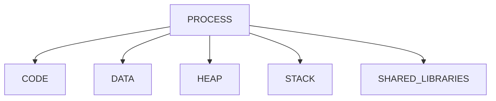

---

# Investigating Process Memory

Find process:

```bash
ps aux
```

View details:

```bash
pmap PID
```

---

# Lab Task 3

Find shell PID:

```bash
echo $$
```

Inspect:

```bash
pmap $$
```

Analyze output.

---

# Understanding RSS

RSS:

```text
Resident Set Size
```

Meaning:

```text
Actual Physical RAM Used
```

---

# Understanding VSZ

VSZ:

```text
Virtual Memory Size
```

Meaning:

```text
Total Virtual Address Space
```

---

# Compare

| Metric | Meaning           |
| ------ | ----------------- |
| RSS    | Physical RAM      |
| VSZ    | Virtual Memory    |
| %MEM   | Percentage of RAM |

---

# View RSS

```bash
ps aux
```

Observe:

```text
RSS

VSZ
```

columns.

---

# Lab Task 4

Run:

```bash
ps aux --sort=-rss | head
```

Find largest memory consumers.

---

# Understanding Page Cache

Linux aggressively caches:

```text
Files

Libraries

Disk Data
```

in RAM.

---

# Why?

Disk:

```text
Slow
```

RAM:

```text
Fast
```

---

# Cache Architecture

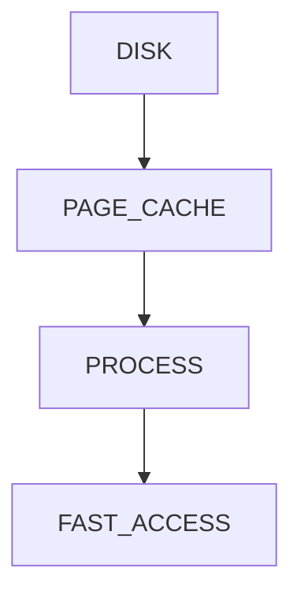

---

# Example

Read file first time:

```text
Disk Access
```

Second time:

```text
Cache Access
```

Much faster.

---

# Viewing Memory Statistics

```bash
cat /proc/meminfo
```

Contains:

```text
MemTotal

MemFree

Cached

Buffers

SwapTotal
```

---

# Lab Task 5

Inspect:

```bash
cat /proc/meminfo
```

Locate:

```text
Cached

Buffers

Available
```

---

# Understanding Swap

Swap:

```text
Disk Space Used As Memory
```

---

# Why Exists?

When RAM fills:

```text
Inactive Pages

↓

Moved To Disk
```

---

# Swap Architecture

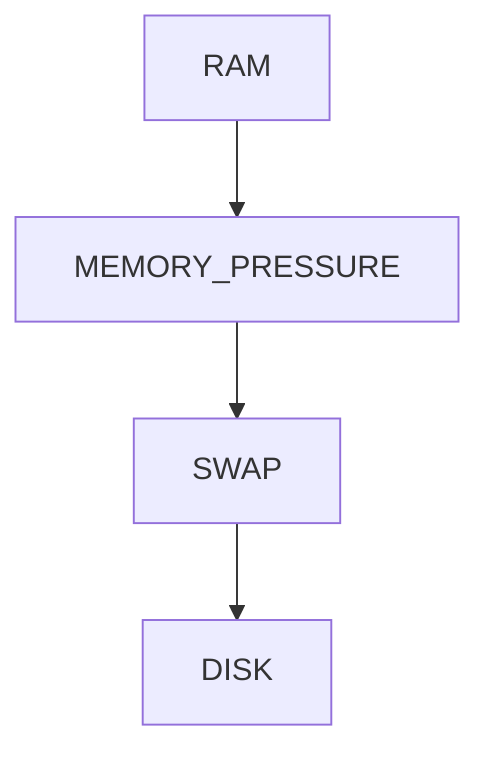

---

# View Swap

```bash
swapon --show
```

or:

```bash
free -h
```

---

# Lab Task 6

Run:

```bash
swapon --show

free -h
```

Analyze swap configuration.

---

# Why Swap Is Slow

RAM:

```text
Nanoseconds
```

Disk:

```text
Microseconds Or Milliseconds
```

Huge difference.

---

# Swap Thrashing

Occurs when:

```text
RAM Full

Constant Swapping

CPU Waiting

System Crawling
```

---

# Thrashing Visualization

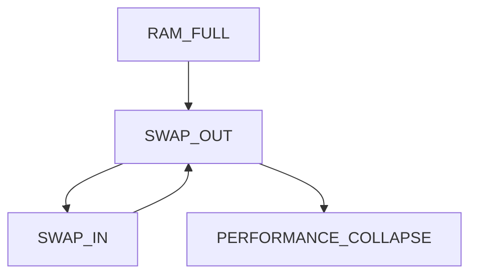

---

# Detecting Thrashing

Monitor:

```bash
vmstat 1
```

Fields:

```text
si

so
```

Meaning:

```text
Swap In

Swap Out
```

---

# Lab Task 7

Run:

```bash
vmstat 1
```

Observe:

```text
si

so
```

values.

---

# Understanding OOM Killer

OOM:

```text
Out Of Memory
```

---

# What Happens?

Kernel decides:

```text
Something Must Die
```

---

# OOM Flow

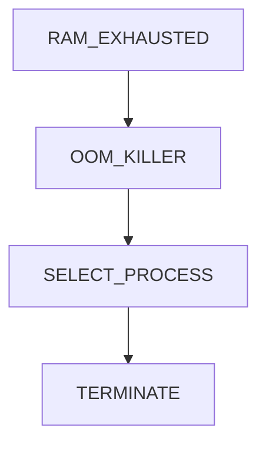

---

# Why OOM Exists

Prevent:

```text
Entire System Crash
```

---

# Checking OOM Events

View logs:

```bash
dmesg | grep -i oom
```

or:

```bash
journalctl -k | grep -i oom
```

---

# Lab Task 8

Check:

```bash
journalctl -k | grep -i oom
```

Look for historical OOM events.

---

# Memory Leaks

One of the most dangerous production issues.

---

# What Is A Leak?

Application allocates memory:

```text
malloc()

new()

allocation
```

but never releases it.

---

# Leak Pattern

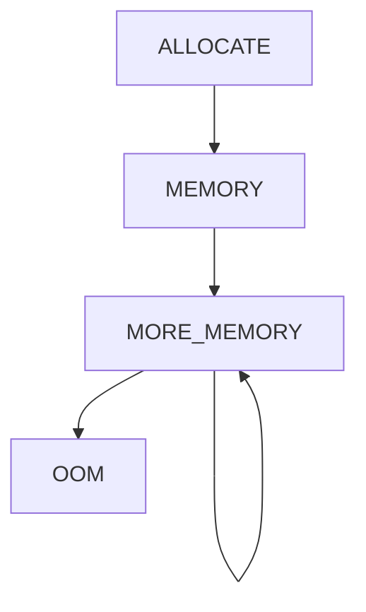

---

# Symptoms

```text
Memory Usage Slowly Increases

Days Or Weeks

Eventually OOM
```

---

# Detecting Leaks

Monitor:

```bash
ps aux --sort=-rss
```

over time.

Look for:

```text
Steady Growth
```

---

# Lab Task 9

Choose a long-running process.

Track RSS values.

Observe trends.

---

# Understanding smem

More accurate memory reporting.

Install:

```bash
sudo apt install smem
```

Run:

```bash
smem
```

---

# Why Useful?

Accounts for:

```text
Shared Libraries

Shared Memory
```

better than ps.

---

# Memory Analysis Workflow

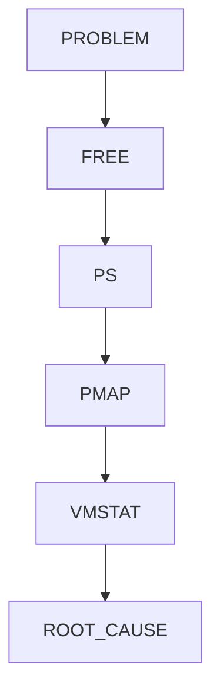

---

# Investigating Memory Pressure

Check:

```bash
free -h

vmstat 1

top

htop
```

---

# Memory Pressure Model

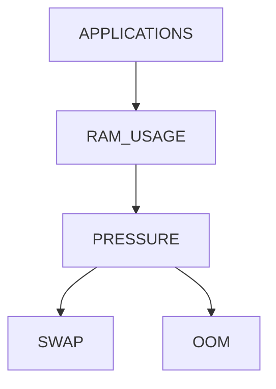

---

# Understanding top Memory Fields

Launch:

```bash
top
```

Observe:

```text
KiB Mem

KiB Swap
```

---

# Sort By Memory

Inside top:

```text
SHIFT+M
```

---

# Lab Task 10

Open:

```bash
top
```

Sort by memory.

Identify largest consumers.

---

# Linux Internals

Memory is managed using:

```text
Pages
```

Typically:

```text
4 KB
```

each.

---

# Page Architecture

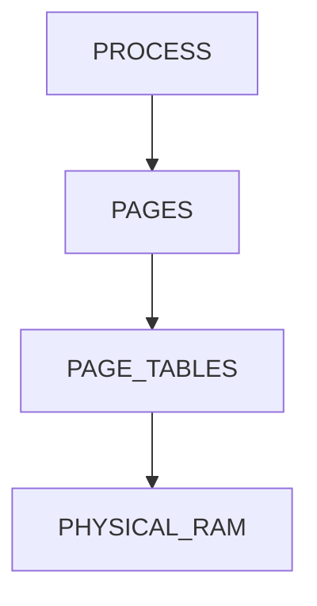

---

# Why Pages?

Enables:

```text
Efficient Allocation

Virtual Memory

Isolation

Swapping
```

---

# Memory Bottlenecks

Common causes:

```text
Memory Leaks

Too Many Processes

Large Caches

Poor Application Design

Insufficient RAM
```

---

# Bottleneck Investigation

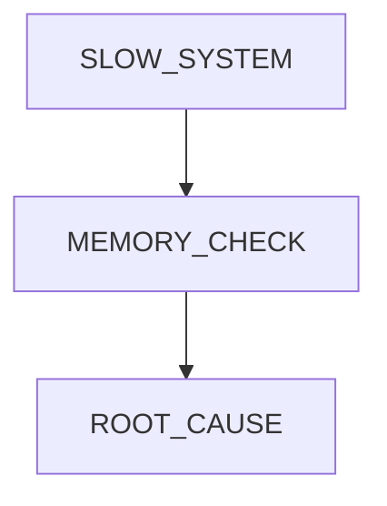

---

# Docker Connection

Containers have:

```text
Memory Limits
```

Example:

```bash
docker run --memory=512m app
```

---

# Container Memory Model

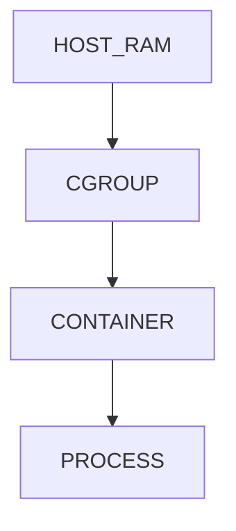

---

# Why Containers Restart

Often:

```text
OOM Kill Inside Container
```

---

# Check Container Stats

```bash
docker stats
```

---

# Kubernetes Connection

Kubernetes heavily relies on memory management.

Example:

```yaml
resources:
  requests:
    memory: "512Mi"
  limits:
    memory: "1Gi"
```

---

# Pod Memory Lifecycle

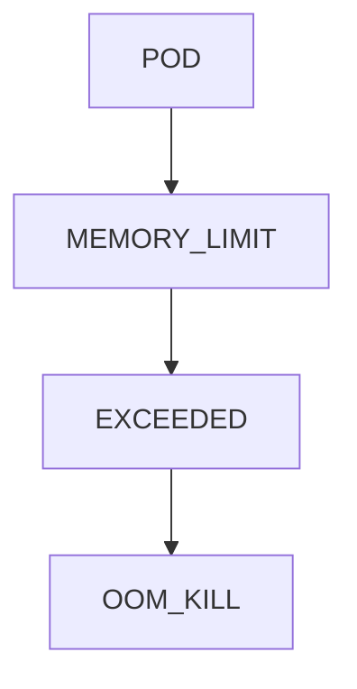

---

# Why SREs Care

Most Kubernetes failures involve:

```text
Memory

CPU

Storage
```

Memory is often the hardest.

---

# Cloud Connection

Cloud cost optimization often begins with:

```text
Memory Analysis
```

because:

```text
RAM Costs Money
```

---

# Cloud Optimization Flow

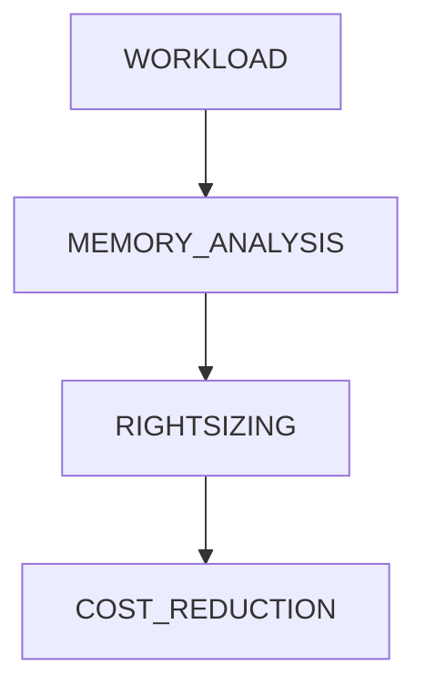

---

# Guided Challenge

Investigate:

```bash
free -h

cat /proc/meminfo

ps aux --sort=-rss

vmstat 1
```

Document findings.

---

# Semi-Guided Challenge

Create memory report:

```text
RAM

Cache

Swap

Top Processes
```

for your system.

---

# Independent Challenge

Design memory monitoring strategy for:

```text
PostgreSQL

Redis

Nginx

Node.js API
```

Determine:

```text
Normal Usage

Warning Threshold

Critical Threshold
```

---

# Performance Considerations

Memory shortages cause:

```text
Swapping

Latency

OOM Events

Application Crashes
```

---

# Security Considerations

Memory may contain:

```text
Passwords

Tokens

Secrets

Encryption Keys
```

Proper isolation matters.

---

# Common Mistakes

## Mistake 1

Looking only at free memory.

---

## Mistake 2

Ignoring available memory.

---

## Mistake 3

Ignoring swap usage.

---

## Mistake 4

Confusing RSS and VSZ.

---

## Mistake 5

Ignoring memory leaks.

---

## Mistake 6

Assuming cache is wasted RAM.

---

# Troubleshooting

## Memory Overview

```bash
free -h
```

---

## Detailed Memory Info

```bash
cat /proc/meminfo
```

---

## Top Memory Processes

```bash
ps aux --sort=-rss
```

---

## Process Memory Map

```bash
pmap PID
```

---

## Memory Statistics

```bash
vmstat 1
```

---

## Swap Configuration

```bash
swapon --show
```

---

## OOM Events

```bash
journalctl -k | grep -i oom
```

---

## Real-Time Analysis

```bash
top

htop
```

---

# Engineering Mindset

Beginners think:

```text
Memory Is RAM
```

Engineers think:

```text
How Much RAM?

How Much Cache?

How Much Swap?

Which Process?

What Trend?

What Bottleneck?
```

Memory analysis is not about:

```text
Current Usage
```

It is about:

```text
Behavior Over Time
```

---

# Interview Questions

### What is virtual memory?

An abstraction that gives processes isolated address spaces.

---

### Difference between RSS and VSZ?

RSS = physical memory.
VSZ = virtual memory.

---

### Why does Linux use page cache?

To improve disk performance.

---

### What is swap?

Disk space used as overflow memory.

---

### What is memory thrashing?

Excessive swapping causing severe slowdown.

---

### What is the OOM killer?

Kernel mechanism that terminates processes when memory is exhausted.

---

### Why is available memory more important than free memory?

Because Linux aggressively uses RAM for cache.

---

### Why do containers get OOM killed?

They exceed configured memory limits.

---

# Cheat Sheet

```bash
free -h

cat /proc/meminfo

ps aux --sort=-rss

pmap PID

vmstat 1

swapon --show

top

htop

smem

journalctl -k | grep -i oom
```

---

# Lab Success Criteria

You can complete this lab when you can:

✅ Explain Linux memory architecture

✅ Interpret free -h output

✅ Understand virtual memory

✅ Understand RSS and VSZ

✅ Analyze page cache

✅ Investigate swap behavior

✅ Detect memory pressure

✅ Investigate OOM events

✅ Connect memory to Docker

✅ Connect memory to Kubernetes

✅ Think like a performance engineer

Congratulations.

You now understand one of the most critical areas of Linux performance engineering. Memory analysis is the foundation of troubleshooting databases, containers, Kubernetes clusters, cloud workloads, backend applications, and large-scale production systems.
