# Lab 06 – CPU Pressure Analysis

> Most engineers think:
>
> ```text
> High CPU = Bad
> ```
>
> Reality is more complicated.
>
> Sometimes:
>
> ```text
> CPU = 100%
> ```
>
> and the system is healthy.
>
> Other times:
>
> ```text
> CPU = 30%
> ```
>
> and users are experiencing outages.
>
> CPU analysis is not about percentages.
>
> It is about understanding:
>
> ```text
> Scheduling
>
> Load
>
> Queuing
>
> Contention
>
> Parallelism
>
> Bottlenecks
> ```
>
> This lab teaches CPU analysis from first principles and connects it to Linux internals, containers, Kubernetes, databases, cloud computing, and distributed systems.

---

# Lab Objective

By the end of this lab you will:

* Understand CPU architecture
* Understand Linux scheduling
* Analyze CPU pressure
* Interpret load averages correctly
* Investigate CPU bottlenecks
* Identify CPU-heavy processes
* Understand context switching
* Understand CPU affinity
* Analyze multi-core systems
* Connect CPU analysis to containers and Kubernetes
* Think like a performance engineer

---

# Why This Matters

Imagine:

```text
Users Report Slowness
```

Monitoring shows:

```text
CPU Usage = 25%
```

Looks healthy.

But:

```text
Load Average = 40
```

System is overloaded.

Question:

```text
Why?
```

Understanding CPU pressure explains this.

---

# The Problem

Every process wants CPU time.

Examples:

```text
Nginx

PostgreSQL

Redis

Java

Node.js

Docker

Kubernetes Components
```

But CPUs are finite resources.

---

# Mental Model

Think of CPU cores as:

```text
Checkout Counters
```

in a supermarket.

Customers:

```text
Processes
```

Counters:

```text
CPU Cores
```

Queue:

```text
Run Queue
```

---

# Example

```text
4 CPU Cores

4 Processes
```

Everything runs smoothly.

---

# But:

```text
4 CPU Cores

400 Processes
```

Processes wait.

System slows.

---

# CPU Queue Model

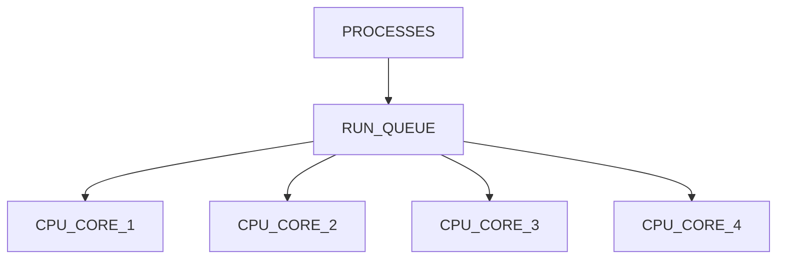

---

# First Principles

CPU pressure means:

```text
More Work

Than Available CPU Capacity
```

---

# CPU Resource Model

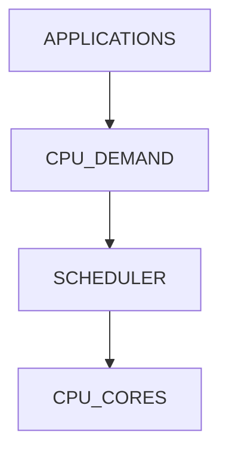

---

# Lab Environment Setup

Create workspace:

```bash
mkdir -p ~/cpu-pressure-lab

cd ~/cpu-pressure-lab
```

---

# Understanding CPU Cores

View:

```bash
nproc
```

or:

```bash
lscpu
```

---

# Lab Task 1

Run:

```bash
nproc

lscpu
```

Record:

```text
CPU Count

Threads

Sockets

Cores
```

---

# CPU Architecture

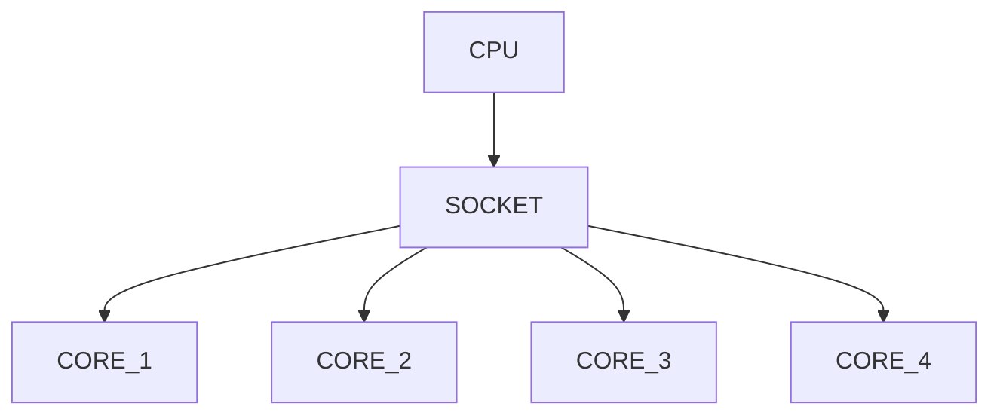

---

# Why Core Count Matters

A system with:

```text
1 Core
```

and:

```text
Load Average = 4
```

is overloaded.

---

But:

```text
64 Cores

Load Average = 4
```

is mostly idle.

---

# Understanding Load Average

One of Linux's most misunderstood metrics.

View:

```bash
uptime
```

Example:

```text
load average: 1.25 1.50 1.80
```

---

# What It Means

Average number of tasks:

```text
Running

Waiting For CPU

Waiting For Resources
```

---

# Load Average Timeline

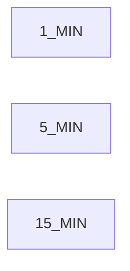

---

# Lab Task 2

Run:

```bash
uptime
```

Interpret:

```text
1 Minute

5 Minute

15 Minute
```

load values.

---

# Load Interpretation

| CPU Cores | Load | Meaning        |
| --------- | ---- | -------------- |
| 1         | 1    | Fully Utilized |
| 1         | 2    | Overloaded     |
| 4         | 4    | Fully Utilized |
| 4         | 8    | Overloaded     |
| 16        | 8    | Healthy        |

---

# CPU Scheduling

Linux uses:

```text
Scheduler
```

to decide:

```text
Who Gets CPU Next
```

---

# Scheduler Architecture

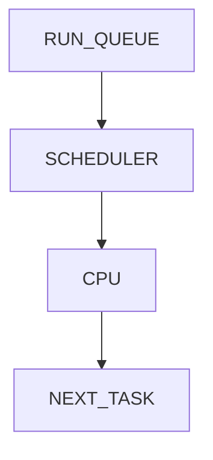

---

# Why Scheduler Exists

Hundreds of processes compete for:

```text
Few CPU Cores
```

Scheduler ensures fairness.

---

# Investigating CPU Usage

Run:

```bash
top
```

Observe:

```text
%CPU

Load

Tasks
```

---

# Lab Task 3

Launch:

```bash
top
```

Observe:

```text
CPU Usage

Load Average

Running Tasks
```

---

# Understanding CPU States

Inside top:

```text
us

sy

ni

id

wa

hi

si

st
```

---

# Meaning

| State | Meaning             |
| ----- | ------------------- |
| us    | User CPU            |
| sy    | Kernel CPU          |
| ni    | Nice Processes      |
| id    | Idle                |
| wa    | I/O Wait            |
| hi    | Hardware Interrupts |
| si    | Software Interrupts |
| st    | Steal Time          |

---

# CPU Time Distribution

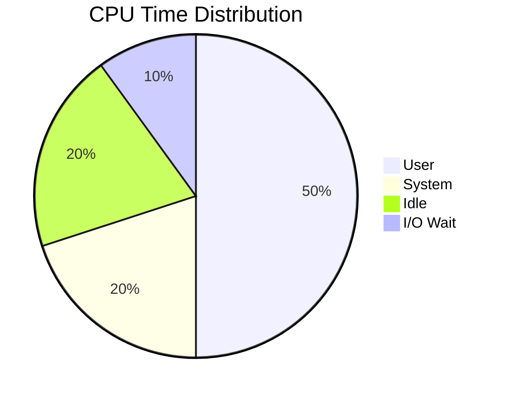

---

# Why I/O Wait Matters

Example:

```text
CPU = 20%

I/O Wait = 70%
```

System still feels slow.

Because:

```text
Processes Waiting For Disk
```

---

# CPU Bottleneck Flow

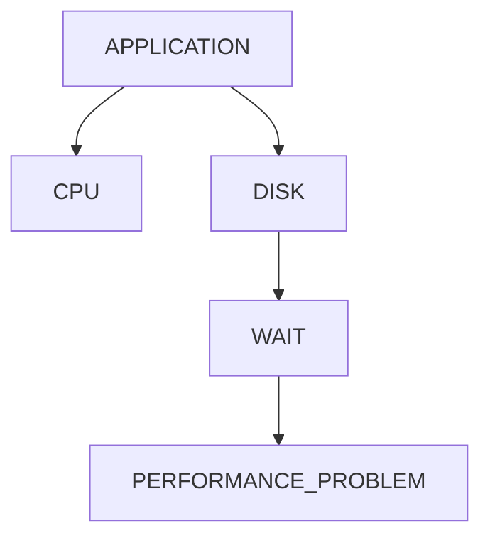

---

# Lab Task 4

Run:

```bash
top
```

Observe:

```text
wa
```

(I/O Wait)

value.

---

# Creating CPU Pressure

Launch workload:

```bash
yes > /dev/null
```

Open another terminal.

Check:

```bash
top
```

---

# What Happened?

```text
yes
```

consumes CPU continuously.

---

# CPU Pressure Visualization

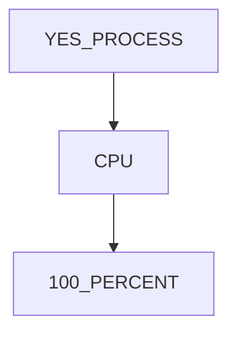

---

# Lab Task 5

Run:

```bash
yes > /dev/null
```

Observe:

```bash
top
```

Terminate:

```bash
CTRL+C
```

---

# Multiple CPU Consumers

Launch:

```bash
yes > /dev/null &
yes > /dev/null &
yes > /dev/null &
yes > /dev/null &
```

Observe load increase.

---

# Multi-Core Consumption

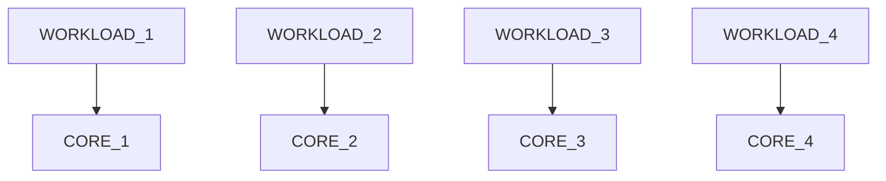

---

# Lab Task 6

Launch multiple workloads.

Compare:

```bash
uptime

top
```

---

# Finding CPU Hogs

Run:

```bash
ps aux --sort=-%cpu | head
```

---

# Why Useful?

Immediately identifies:

```text
CPU Heavy Processes
```

---

# Investigation Workflow

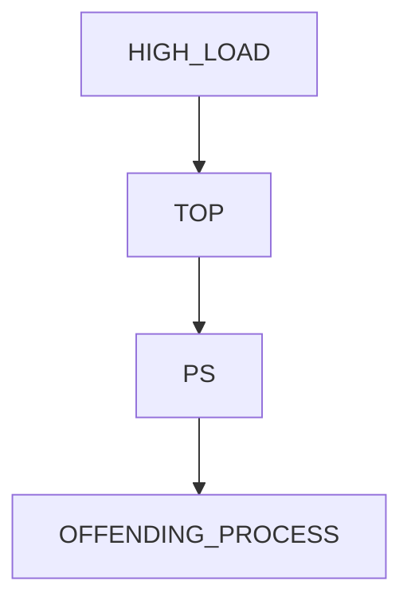

---

# Lab Task 7

Run:

```bash
ps aux --sort=-%cpu | head
```

Identify top consumers.

---

# Understanding Context Switching

CPU switches between processes.

---

# Why?

More processes than CPUs.

---

# Context Switch Model

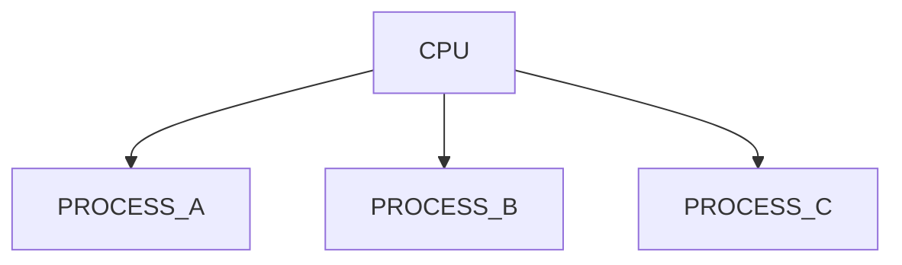

---

# Cost

Switching requires:

```text
Saving State

Loading State

Cache Effects
```

Not free.

---

# Viewing Context Switches

Run:

```bash
vmstat 1
```

Observe:

```text
cs
```

field.

---

# Lab Task 8

Run:

```bash
vmstat 1
```

Record:

```text
cs

r
```

values.

---

# Understanding Run Queue

Field:

```text
r
```

in vmstat.

Meaning:

```text
Processes Waiting For CPU
```

---

# Run Queue Visualization

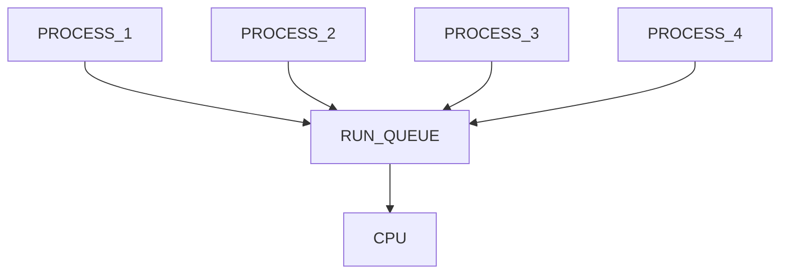

---

# Why Important?

High:

```text
r
```

often means:

```text
CPU Pressure
```

---

# Understanding CPU Affinity

A process can be pinned to CPUs.

Check:

```bash
taskset -p PID
```

---

# Why Used?

For:

```text
Databases

Trading Systems

Low-Latency Workloads
```

---

# CPU Affinity Model

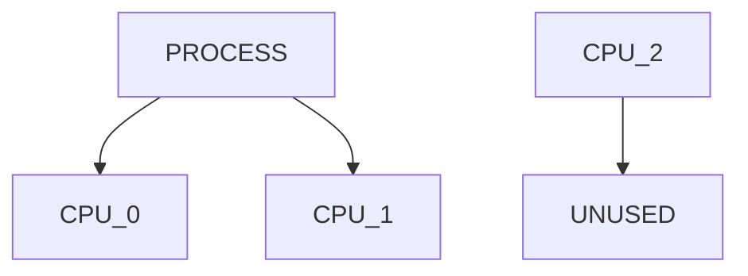

---

# Lab Task 9

Check current shell:

```bash
taskset -p $$
```

Analyze affinity mask.

---

# Understanding Nice Values

Adjust scheduling priority.

View:

```bash
ps -eo pid,ni,comm
```

---

# Range

```text
-20  Highest Priority

0    Default

19   Lowest Priority
```

---

# Scheduling Priority

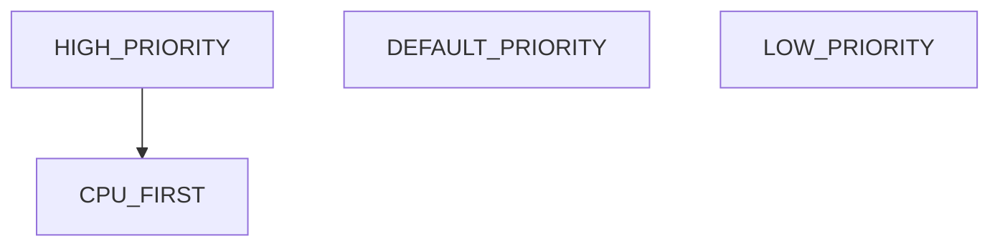

---

# Lab Task 10

Run:

```bash
ps -eo pid,ni,comm | head
```

Inspect priorities.

---

# Linux Internals

Scheduler uses:

```text
Completely Fair Scheduler (CFS)
```

---

# CFS Goal

Provide:

```text
Fair CPU Allocation
```

across processes.

---

# CFS Architecture

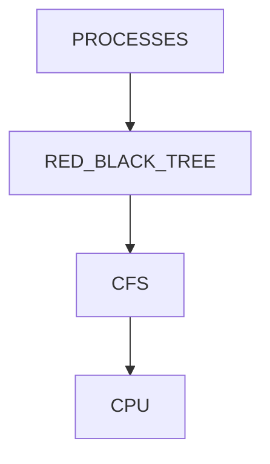

---

# CPU Pressure Investigation Workflow

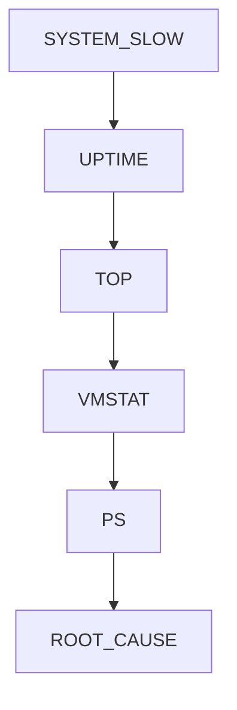

---

# Real Production Scenario

Customer complaint:

```text
API Slow
```

Investigation:

```bash
uptime

top

vmstat 1

ps aux --sort=-%cpu
```

Find:

```text
Run Queue = 50

CPU Cores = 8
```

System overloaded.

---

# Understanding CPU Saturation

CPU Saturation occurs when:

```text
Demand > Capacity
```

---

# Saturation Model

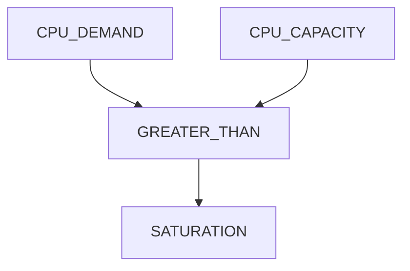

---

# Docker Connection

Containers share host CPUs.

Monitor:

```bash
docker stats
```

---

# Container CPU Model

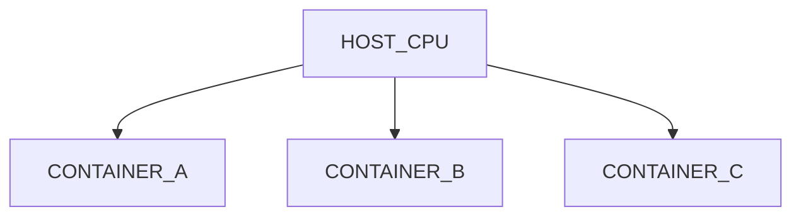

---

# CPU Limits

Example:

```bash
docker run --cpus=1 app
```

Limits CPU consumption.

---

# Kubernetes Connection

Pods request CPUs.

Example:

```yaml
resources:
  requests:
    cpu: "500m"
  limits:
    cpu: "2"
```

---

# Kubernetes CPU Architecture

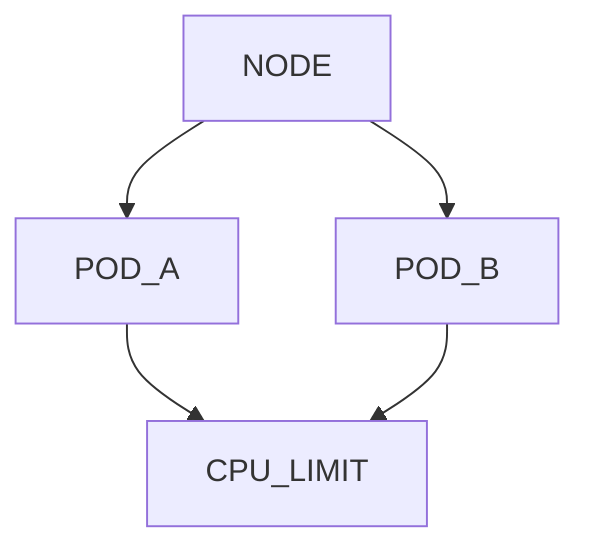

---

# Why Pods Get Slow

Possible reasons:

```text
CPU Throttling

Insufficient Requests

Node Saturation
```

---

# Cloud Connection

Cloud VM sizing often depends on:

```text
CPU Pressure Analysis
```

---

# Rightsizing Workflow

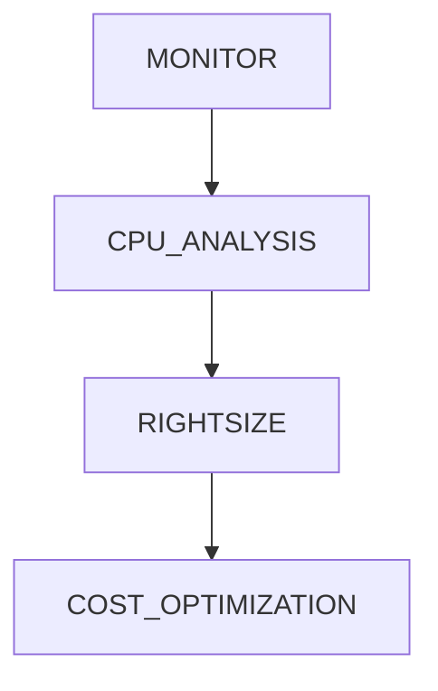

---

# Guided Challenge

Investigate:

```bash
nproc

uptime

top

vmstat 1

ps aux --sort=-%cpu
```

Document findings.

---

# Semi-Guided Challenge

Generate CPU pressure:

```bash
yes > /dev/null &
```

Run:

```bash
top

uptime
```

Observe changes.

---

# Independent Challenge

Create CPU analysis report for your system.

Include:

```text
CPU Count

Load Average

Top CPU Consumers

Run Queue

Context Switches
```

Explain whether system is healthy.

---

# Performance Considerations

CPU bottlenecks cause:

```text
Higher Latency

Queueing Delays

Reduced Throughput
```

---

# Security Considerations

CPU abuse can indicate:

```text
Cryptominers

Fork Bombs

Malware

Runaway Processes
```

Monitor continuously.

---

# Common Mistakes

## Mistake 1

Confusing CPU usage with load average.

---

## Mistake 2

Ignoring I/O wait.

---

## Mistake 3

Ignoring run queue.

---

## Mistake 4

Looking only at percentages.

---

## Mistake 5

Ignoring context switching.

---

# Troubleshooting

## CPU Count

```bash
nproc

lscpu
```

---

## Load Average

```bash
uptime
```

---

## Real-Time Analysis

```bash
top

htop
```

---

## CPU Consumers

```bash
ps aux --sort=-%cpu
```

---

## System Statistics

```bash
vmstat 1
```

---

## CPU Affinity

```bash
taskset -p PID
```

---

## Scheduler Priority

```bash
ps -eo pid,ni,comm
```

---

# Engineering Mindset

Beginners think:

```text
CPU Percentage
```

Engineers think:

```text
Load Average

Run Queue

Context Switching

Core Count

Scheduling

Saturation
```

CPU analysis is ultimately about:

```text
Work Demand

Versus

Compute Capacity
```

---

# Interview Questions

### What is CPU pressure?

Demand for CPU resources exceeding available capacity.

---

### What is load average?

Average runnable/waiting tasks over time.

---

### Why is load average important?

Shows queueing and contention.

---

### What is context switching?

Switching CPU execution between processes.

---

### What is CPU affinity?

Binding a process to specific CPU cores.

---

### What is nice value?

Scheduling priority adjustment.

---

### What is CPU saturation?

Demand exceeds CPU capacity.

---

### Why can a system be slow with low CPU usage?

High I/O wait or resource contention.

---

### What scheduler does Linux commonly use?

Completely Fair Scheduler (CFS).

---

# Cheat Sheet

```bash
nproc

lscpu

uptime

top

htop

vmstat 1

ps aux --sort=-%cpu

taskset -p PID

ps -eo pid,ni,comm

yes > /dev/null
```

---

# Lab Success Criteria

You can complete this lab when you can:

✅ Explain CPU pressure

✅ Interpret load average

✅ Analyze CPU saturation

✅ Use top effectively

✅ Use vmstat

✅ Investigate run queues

✅ Analyze context switches

✅ Understand CPU affinity

✅ Connect CPU analysis to containers

✅ Connect CPU analysis to Kubernetes

✅ Think like a performance engineer

Congratulations.

You now understand CPU analysis from the Linux kernel's perspective. This knowledge forms the foundation of performance engineering, capacity planning, container optimization, cloud cost optimization, distributed systems troubleshooting, and production incident response.
