# Lab 07 – Process Debugging

> Monitoring tells you:
>
> ```text
> Something Is Wrong
> ```
>
> Debugging tells you:
>
> ```text
> WHY It Is Wrong
> ```
>
> Production engineers are not paid to restart services.
>
> They are paid to answer:
>
> ```text
> Why Is The Process Hung?
>
> Why Is CPU At 100%?
>
> Why Is Memory Growing?
>
> Why Is The Application Not Responding?
>
> Why Is The Database Slow?
>
> Why Is The Container Restarting?
> ```
>
> Process debugging is the bridge between:
>
> ```text
> Observation
>
> And
>
> Root Cause Analysis
> ```
>
> This lab teaches Linux debugging from first principles and introduces the same techniques used by SREs, platform engineers, kernel engineers, backend engineers, and cloud infrastructure teams.

---

# Lab Objective

By the end of this lab you will:

* Understand process debugging fundamentals
* Investigate process states
* Use strace effectively
* Use lsof for process analysis
* Analyze open files and sockets
* Investigate stuck processes
* Understand system calls
* Understand process waiting behavior
* Analyze crashes
* Connect debugging to containers and Kubernetes
* Think like a production incident responder

---

# Why This Matters

Imagine:

```text
Customer Reports:

Website Is Frozen
```

Monitoring shows:

```text
CPU: Normal

Memory: Normal

Disk: Normal
```

Yet:

```text
Application Doesn't Respond
```

Question:

```text
What Is The Process Doing?
```

Process debugging answers that question.

---

# The Problem

Monitoring tools tell us:

```text
CPU Usage

Memory Usage

Load Average
```

But not:

```text
What The Process Is Actually Doing
```

Debugging reveals:

```text
System Calls

File Access

Network Calls

Wait States

Resource Dependencies
```

---

# Mental Model

Think of monitoring as:

```text
A Hospital Heart Monitor
```

It shows symptoms.

Think of debugging as:

```text
Medical Diagnosis
```

It reveals causes.

---

# First Principles

Every Linux process spends time:

```text
Running

Waiting

Reading

Writing

Communicating

Sleeping
```

Debugging means discovering:

```text
Which One?
```

---

# Process Activity Model

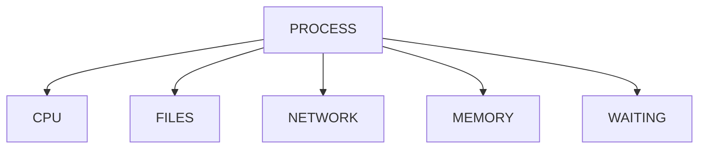

---

# Process Debugging Workflow

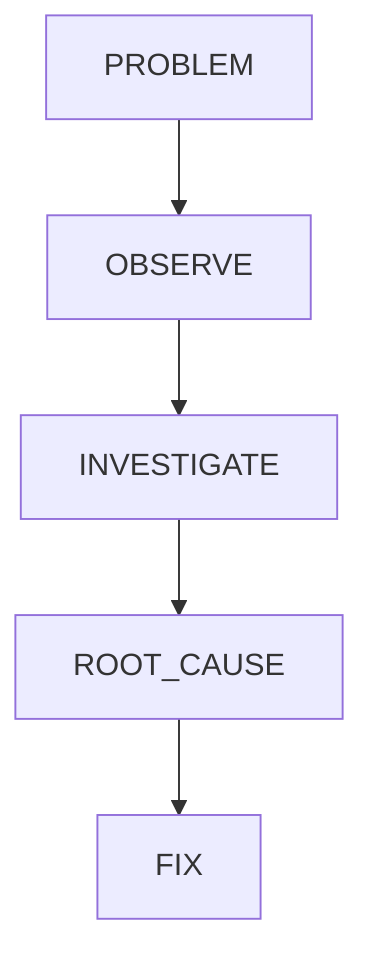

---

# Lab Environment Setup

Create workspace:

```bash
mkdir -p ~/process-debugging-lab

cd ~/process-debugging-lab
```

Launch sample process:

```bash
sleep 300
```

Open another terminal.

---

# Understanding Process States

Before debugging:

Determine:

```text
What State Is The Process In?
```

Check:

```bash
ps aux
```

or:

```bash
ps -eo pid,ppid,state,comm
```

---

# State Meanings

| State | Meaning               |
| ----- | --------------------- |
| R     | Running               |
| S     | Sleeping              |
| D     | Uninterruptible Sleep |
| T     | Stopped               |
| Z     | Zombie                |

---

# State Investigation Model

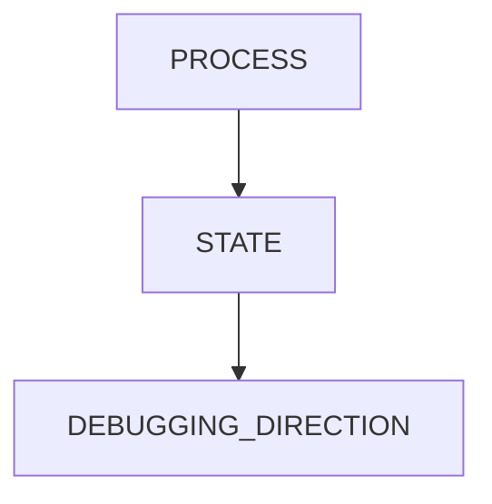

---

# Lab Task 1

Run:

```bash
sleep 300
```

Inspect:

```bash
ps -eo pid,state,comm
```

Find state.

---

# Why State Matters

Example:

```text
R = CPU Issue

D = Storage Issue

Z = Parent Process Issue
```

Different states imply different investigations.

---

# Understanding System Calls

Applications interact with Linux through:

```text
System Calls
```

Examples:

```text
open()

read()

write()

connect()

fork()

exec()
```

---

# Architecture


---

# Why Debugging Focuses On System Calls

Because every process eventually asks:

```text
Kernel

Please Do Something
```

---

# Introducing strace

One of the most powerful Linux debugging tools.

Install:

Ubuntu:

```bash
sudo apt install strace
```

RHEL:

```bash
sudo dnf install strace
```

---

# What strace Does

Shows:

```text
System Calls

Arguments

Return Values
```

in real time.

---

# Example

Run:

```bash
strace ls
```

Observe:

```text
open()

read()

close()
```

calls.

---

# strace Architecture

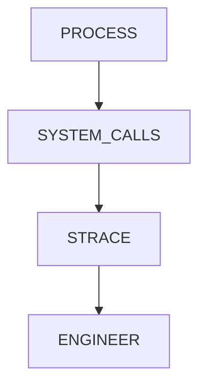

---

# Lab Task 2

Run:

```bash
strace ls
```

Identify:

```text
open

read

write
```

operations.

---

# Attaching To Existing Process

Find PID:

```bash
ps aux
```

Attach:

```bash
sudo strace -p PID
```

---

# Why Useful?

Answers:

```text
What Is This Process Doing Right Now?
```

---

# Live Debugging Flow

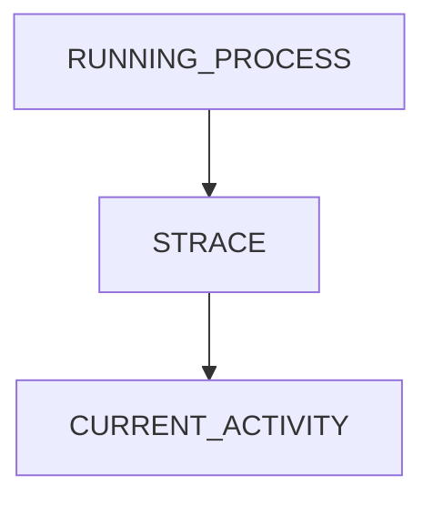

---

# Lab Task 3

Start:

```bash
sleep 300
```

Attach:

```bash
sudo strace -p PID
```

Observe output.

---

# Understanding Blocking

Many processes appear idle.

Actually:

```text
Waiting For Something
```

Examples:

```text
Network

Disk

User Input

Database
```

---

# Blocking Model

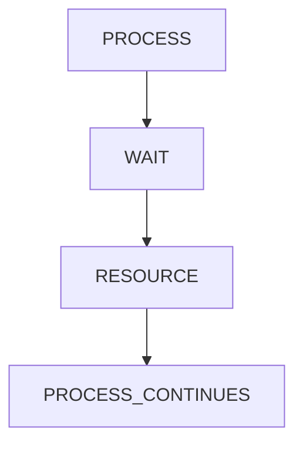

---

# Example

```bash
sudo strace -p PID
```

may show:

```text
poll()

select()

epoll_wait()
```

---

# Meaning

Process is:

```text
Waiting For Events
```

Not broken.

---

# Investigating Open Files

Every process uses:

```text
Files

Sockets

Pipes

Devices
```

---

# Introducing lsof

Meaning:

```text
List Open Files
```

---

# Example

```bash
lsof -p PID
```

---

# Why Important?

Shows:

```text
Logs

Database Files

Network Connections

Pipes
```

---

# File Relationship Model

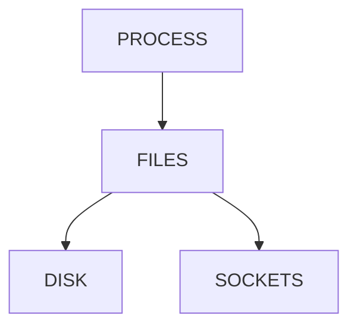

---

# Lab Task 4

Find current shell:

```bash
echo $$
```

Run:

```bash
lsof -p $$
```

Analyze output.

---

# Investigating Network Connections

View:

```bash
ss -tulpn
```

or:

```bash
lsof -i
```

---

# Why Useful?

Find:

```text
Listening Ports

Remote Connections

Unexpected Activity
```

---

# Network Debugging Flow

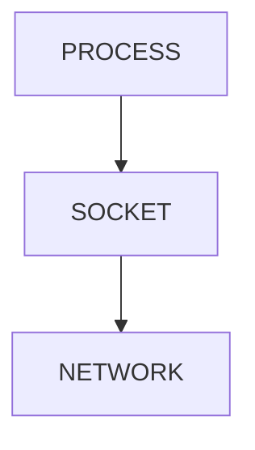

---

# Lab Task 5

Run:

```bash
lsof -i
```

Identify network-aware processes.

---

# Understanding /proc

Linux exposes process internals through:

```text
/proc
```

---

# Example

```bash
ls /proc/PID
```

---

# Important Files

```text
status

cmdline

maps

fd

stat
```

---

# Process Internals Model

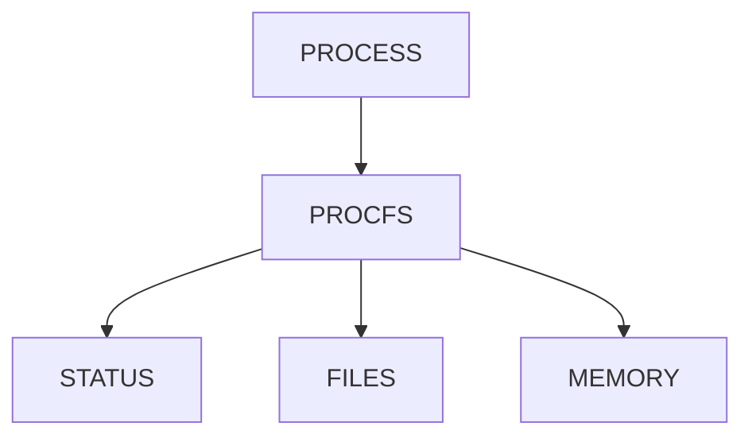

---

# Lab Task 6

Inspect current shell:

```bash
cat /proc/$$/status
```

Review fields.

---

# Understanding File Descriptors

Everything in Linux becomes:

```text
A File
```

Including:

```text
Sockets

Pipes

Devices
```

---

# File Descriptor Architecture

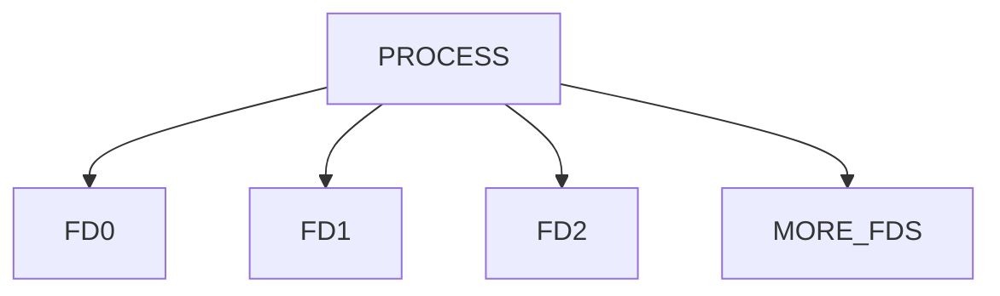

---

# Standard File Descriptors

| FD | Meaning |
| -- | ------- |
| 0  | stdin   |
| 1  | stdout  |
| 2  | stderr  |

---

# View File Descriptors

```bash
ls -l /proc/PID/fd
```

---

# Lab Task 7

Run:

```bash
ls -l /proc/$$/fd
```

Identify:

```text
stdin

stdout

stderr
```

---

# Investigating Hanging Processes

Common complaint:

```text
Application Hung
```

Possible causes:

```text
Disk Wait

Network Wait

Deadlock

External Dependency
```

---

# Debugging Workflow

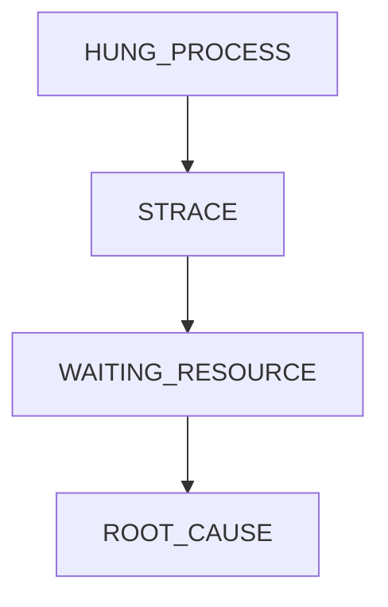

---

# Example

strace shows:

```text
connect()
```

never returns.

Likely:

```text
Network Problem
```

---

# Understanding D-State Processes

State:

```text
D
```

means:

```text
Uninterruptible Sleep
```

Usually:

```text
Storage

NFS

Hardware
```

related.

---

# Investigation

Run:

```bash
ps aux
```

Look for:

```text
D
```

state.

---

# Lab Task 8

Check:

```bash
ps -eo pid,state,comm
```

Find D-state processes if any.

---

# Understanding Process Trees

Many problems involve:

```text
Parent

Child

Worker
```

relationships.

---

# View Tree

```bash
pstree -p
```

---

# Why Useful?

Reveals:

```text
Worker Models

Services

Dependencies
```

---

# Process Tree Model

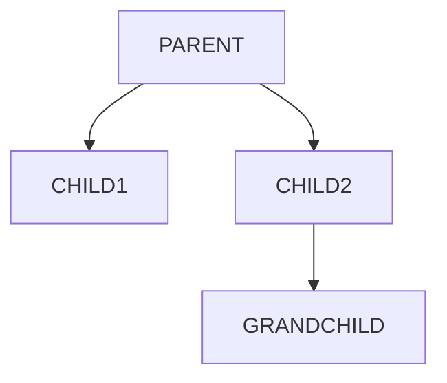

---

# Lab Task 9

Run:

```bash
pstree -p
```

Analyze hierarchy.

---

# Understanding Crash Investigation

Application crashes often generate:

```text
Core Dumps
```

---

# What Is A Core Dump?

Snapshot of process memory.

---

# Crash Flow

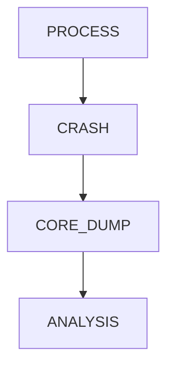

---

# Core Dump Settings

Check:

```bash
ulimit -c
```

---

# Meaning

```text
0
```

Core dumps disabled.

---

# Lab Task 10

Run:

```bash
ulimit -c
```

Determine whether core dumps are enabled.

---

# Advanced Debugging Tools

Common production tools:

```text
strace

lsof

gdb

perf

bcc

bpftrace
```

---

# Modern Linux Debugging Stack

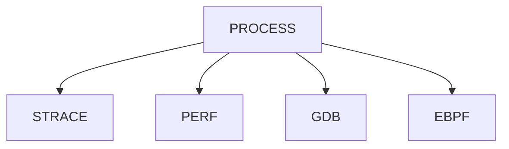

---

# Understanding perf

Used for:

```text
CPU Profiling

Performance Analysis

Hotspot Detection
```

---

# Example

```bash
sudo perf top
```

---

# Why Performance Engineers Use perf

Answers:

```text
Where CPU Time Is Spent
```

---

# Understanding eBPF

Modern observability technology.

Used by:

```text
Netflix

Meta

Google

Cloud Providers
```

---

# eBPF Architecture

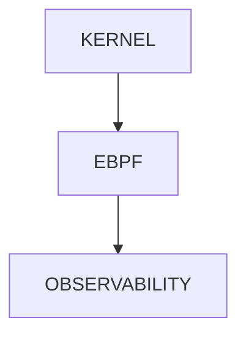

---

# Linux Internals

Processes are represented by:

```text
task_struct
```

inside the kernel.

---

# task_struct Contains

```text
PID

Memory

State

Files

Scheduling Data

Signals
```

---

# Internal View

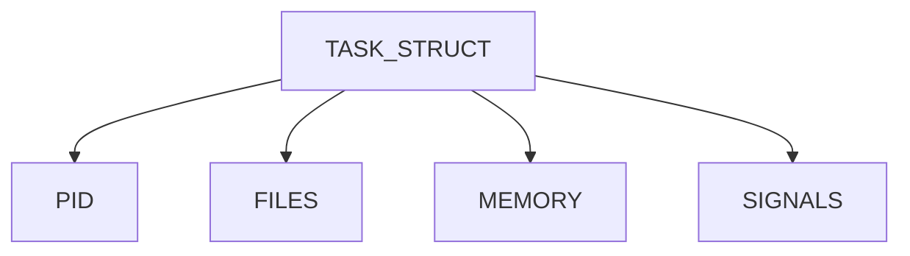

---

# Production Incident Example

Alert:

```text
API Timeout
```

Investigation:

```bash
top

ps aux

strace -p PID

lsof -p PID
```

Find:

```text
Waiting On Database Socket
```

Root cause identified.

---

# Process Debugging Playbook

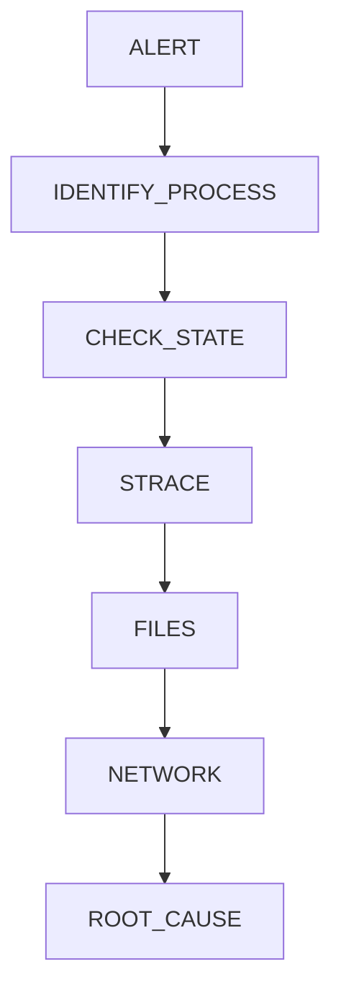

---

# Docker Connection

Containers are:

```text
Linux Processes
```

Debug:

```bash
docker top container

docker exec -it container bash
```

---

# Container Debugging Model

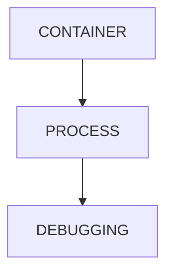

---

# Kubernetes Connection

Investigate:

```bash
kubectl top pod

kubectl logs

kubectl exec
```

Ultimately debugging:

```text
Linux Processes
```

inside containers.

---

# Kubernetes Incident Flow

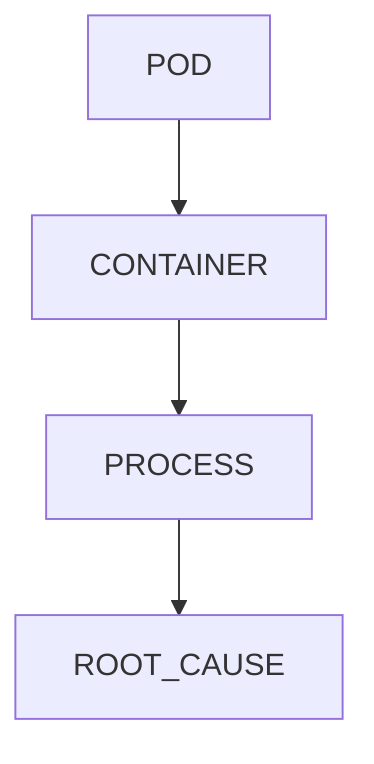

---

# Cloud Connection

Cloud outages often reduce to:

```text
CPU

Memory

Storage

Network

Processes
```

Debugging starts at the process layer.

---

# Guided Challenge

Investigate:

```bash
ps aux

strace ls

lsof -p $$

cat /proc/$$/status
```

Document findings.

---

# Semi-Guided Challenge

Start:

```bash
sleep 300
```

Attach:

```bash
sudo strace -p PID
```

Explain observed behavior.

---

# Independent Challenge

Build a debugging report for:

```text
Hung Process

Slow Process

CPU-Heavy Process
```

Describe:

```text
Symptoms

Investigation

Root Cause

Fix
```

---

# Performance Considerations

Debugging tools themselves consume resources.

Examples:

```text
strace

perf

gdb
```

Use carefully in production.

---

# Security Considerations

Debugging may expose:

```text
Secrets

Passwords

Tokens

Network Endpoints
```

Restrict access appropriately.

---

# Common Mistakes

## Mistake 1

Restarting before investigating.

---

## Mistake 2

Ignoring process state.

---

## Mistake 3

Ignoring open files.

---

## Mistake 4

Not checking network connections.

---

## Mistake 5

Using SIGKILL immediately.

---

## Mistake 6

Ignoring system calls.

---

# Troubleshooting Cheat Flow

```mermaid
flowchart TD

PROCESS_PROBLEM

PROCESS_PROBLEM --> PS

PS --> STATE

STATE --> STRACE

STRACE --> LSOF

LSOF --> ROOT_CAUSE
```

---

# Troubleshooting Commands

## Process State

```bash
ps aux
```

---

## Process Tree

```bash
pstree -p
```

---

## Trace System Calls

```bash
strace -p PID
```

---

## Open Files

```bash
lsof -p PID
```

---

## Network Connections

```bash
lsof -i

ss -tulpn
```

---

## Process Internals

```bash
cat /proc/PID/status
```

---

## File Descriptors

```bash
ls -l /proc/PID/fd
```

---

# Engineering Mindset

Beginners think:

```text
Restart The Service
```

Engineers think:

```text
What Is It Doing?

What Is It Waiting For?

What Resource Is Missing?

What Changed?

How Can I Prove It?
```

Debugging is not guessing.

Debugging is:

```text
Evidence Collection
```

until the root cause becomes obvious.

---

# Interview Questions

### What is strace?

A tool that traces system calls made by processes.

---

### Why are system calls important?

They reveal how applications interact with the kernel.

---

### What does lsof show?

Files and sockets opened by processes.

---

### What is a D-state process?

A process waiting in uninterruptible sleep, usually due to I/O.

---

### What is /proc?

A virtual filesystem exposing process and kernel information.

---

### Why inspect file descriptors?

To understand resource usage and dependencies.

---

### What is a core dump?

A memory snapshot generated during crashes.

---

### What is eBPF?

A modern kernel observability framework.

---

### What is perf used for?

Performance profiling and hotspot analysis.

---

# Cheat Sheet

```bash
ps aux

ps -eo pid,state,comm

pstree -p

strace ls

strace -p PID

lsof -p PID

lsof -i

ss -tulpn

cat /proc/PID/status

ls -l /proc/PID/fd

ulimit -c

perf top
```

---

# Lab Success Criteria

You can complete this lab when you can:

✅ Explain process debugging

✅ Use strace

✅ Analyze system calls

✅ Use lsof

✅ Investigate process states

✅ Analyze file descriptors

✅ Use /proc effectively

✅ Debug hanging processes

✅ Understand core dumps

✅ Connect debugging to Docker

✅ Connect debugging to Kubernetes

✅ Think like an incident responder

Congratulations.

You now understand the foundations of Linux process debugging. These are the same investigative techniques used in production outages, cloud incidents, container failures, database debugging, performance analysis, and large-scale distributed systems troubleshooting.
