# Lab 08 – Production Incident Response

> This lab is where everything comes together.
>
> Filesystems.
>
> Permissions.
>
> Processes.
>
> CPU.
>
> Memory.
>
> Networking.
>
> Storage.
>
> Services.
>
> Logs.
>
> Containers.
>
> Kubernetes.
>
> Cloud Infrastructure.
>
> Real-world engineering is not:
>
> ```text
> Memorizing Commands
> ```
>
> Real-world engineering is:
>
> ```text
> Diagnosing Problems
>
> Under Pressure
>
> With Incomplete Information
> ```
>
> Production Incident Response is one of the most valuable skills a Linux engineer can develop.
>
> This lab simulates how senior engineers, SREs, DevOps engineers, platform engineers, and incident commanders investigate real outages.

---

# Lab Objective

By the end of this lab you will:

* Understand incident response methodology
* Learn production troubleshooting workflows
* Investigate Linux outages
* Analyze CPU incidents
* Analyze memory incidents
* Analyze disk incidents
* Analyze network incidents
* Investigate service failures
* Perform root cause analysis
* Write postmortems
* Think like a senior production engineer

---

# Why This Matters

Imagine:

```text
Friday

11:58 PM

Production Alert Fires
```

Users report:

```text
Website Down
```

Executives ask:

```text
What Happened?
```

Customers ask:

```text
When Will It Be Fixed?
```

Your monitoring dashboard shows:

```text
Everything Red
```

What do you do?

---

# The Reality Of Production

Most engineers think incidents look like:

```text
Problem

↓

Cause

↓

Fix
```

Reality:

```text
Alert

↓

Confusion

↓

Investigation

↓

Wrong Hypothesis

↓

More Investigation

↓

Actual Root Cause

↓

Fix

↓

Postmortem
```

---

# Production Incident Lifecycle

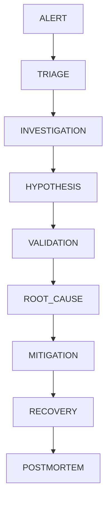

---

# Mental Model

Think like a doctor.

Bad engineer:

```text
Patient Looks Sick

↓

Give Medicine
```

Good engineer:

```text
Symptoms

↓

Diagnosis

↓

Evidence

↓

Treatment
```

Production incidents are diagnosis problems.

---

# First Principles

During an incident:

Never assume.

Always verify.

---

# Dangerous Approach

```text
Restart Everything
```

---

# Professional Approach

```text
Observe

Measure

Investigate

Prove

Fix
```

---

# Incident Response Philosophy

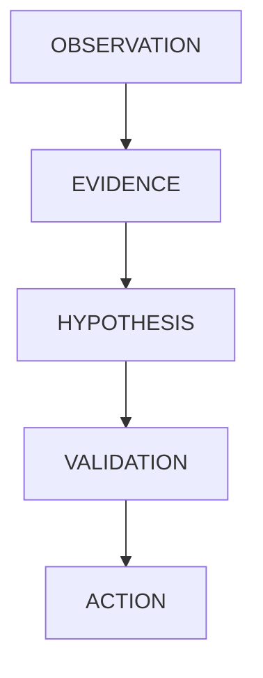

---

# Golden Rule

Never confuse:

```text
Symptom
```

with:

```text
Root Cause
```

---

# Example

Symptom:

```text
Website Slow
```

Root Cause:

```text
Database Connection Exhaustion
```

---

# Incident Severity Model

| Severity | Impact                     |
| -------- | -------------------------- |
| SEV-1    | Entire Service Down        |
| SEV-2    | Major Functionality Impact |
| SEV-3    | Partial Degradation        |
| SEV-4    | Minor Issue                |

---

# Why Severity Matters

Severity determines:

```text
Escalation

Resources

Communication

Response Speed
```

---

# Incident Management Architecture

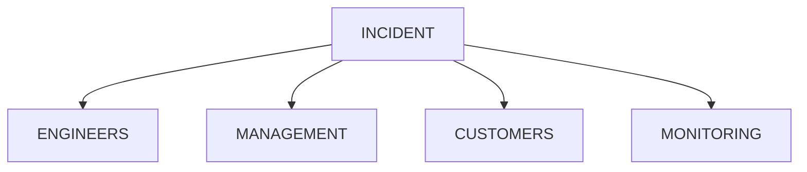

---

# Phase 1 — Triage

First goal:

```text
Understand Impact
```

Questions:

```text
Who Is Affected?

What Is Broken?

When Did It Start?

How Severe Is It?
```

---

# Triage Workflow

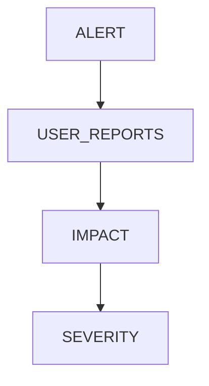

---

# Immediate Commands

```bash
uptime

top

free -h

df -h

systemctl status service

journalctl -xe
```

---

# Why These Commands?

They answer:

```text
CPU?

Memory?

Disk?

Services?

Logs?
```

---

# Production Checklist

```text
CPU

Memory

Disk

Network

Services

Logs
```

---

# Incident Investigation Pyramid

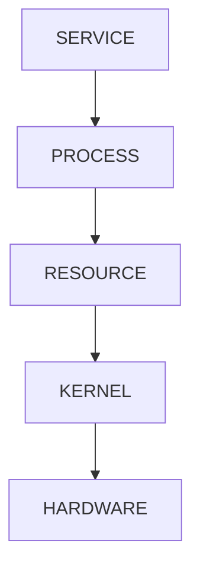

---

# Scenario 1

## Website Down

Alert:

```text
502 Bad Gateway
```

---

# Investigation

Check:

```bash
systemctl status nginx

systemctl status app

systemctl status postgresql
```

---

# Architecture

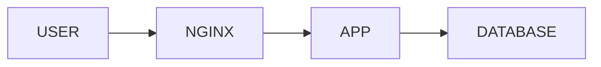

---

# Questions

```text
Is Nginx Running?

Is Application Running?

Is Database Running?
```

---

# Scenario 1 Lab Task

Investigate:

```bash
systemctl status nginx

journalctl -u nginx
```

Document findings.

---

# Scenario 2

## CPU Saturation

Users report:

```text
System Slow
```

---

# Investigation

```bash
uptime

top

htop

ps aux --sort=-%cpu
```

---

# CPU Analysis Workflow

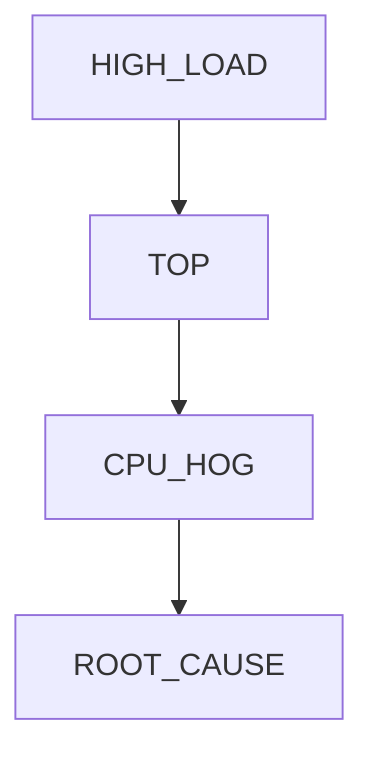

---

# Possible Causes

```text
Infinite Loops

Runaway Processes

Poor Queries

Cryptominers

Fork Bombs
```

---

# Scenario 2 Lab Task

Generate load:

```bash
yes > /dev/null
```

Observe:

```bash
top

uptime
```

---

# Scenario 3

## Memory Exhaustion

Symptoms:

```text
Containers Restarting

Applications Crashing

OOM Events
```

---

# Investigation

```bash
free -h

vmstat 1

ps aux --sort=-rss
```

---

# Memory Incident Flow

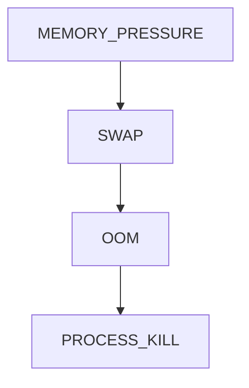

---

# Check OOM

```bash
journalctl -k | grep -i oom
```

---

# Scenario 3 Lab Task

Investigate memory usage.

Document largest consumers.

---

# Scenario 4

## Disk Full

Symptoms:

```text
Database Errors

Application Failures

Log Failures
```

---

# Investigation

```bash
df -h
```

---

# Why Dangerous?

Many applications cannot function when:

```text
Disk = 100%
```

---

# Storage Failure Architecture

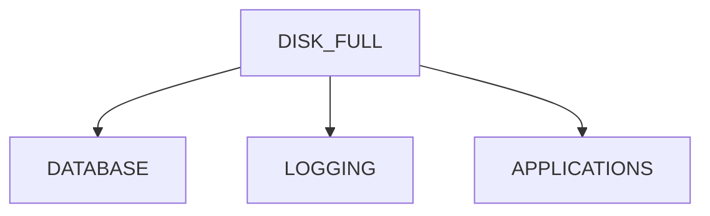

---

# Deep Investigation

```bash
du -sh /*

du -sh /var/*
```

---

# Scenario 4 Lab Task

Find largest directories.

---

# Scenario 5

## Network Failure

Users report:

```text
Cannot Connect
```

---

# Investigation

```bash
ping

ss -tulpn

ip addr

ip route
```

---

# Network Flow


---

# Questions

```text
DNS?

Firewall?

Routing?

Application?
```

---

# Scenario 5 Lab Task

Inspect:

```bash
ss -tulpn

ip addr
```

---

# Scenario 6

## Service Crash

Symptoms:

```text
Service Stops Unexpectedly
```

---

# Investigation

```bash
systemctl status service

journalctl -u service
```

---

# Why Logs Matter

Logs provide:

```text
Timeline

Errors

Context
```

---

# Service Failure Flow

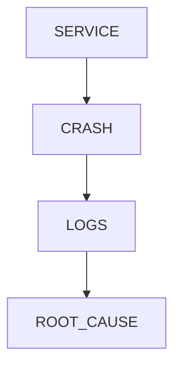

---

# Scenario 6 Lab Task

Analyze service logs.

Document errors.

---

# Scenario 7

## Zombie Processes

Check:

```bash
ps aux | grep Z
```

---

# Why Important?

Large numbers indicate:

```text
Parent Process Problems
```

---

# Process Failure Architecture

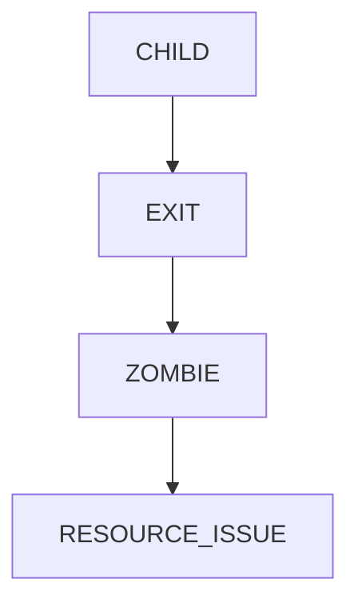

---

# Scenario 7 Lab Task

Investigate process hierarchy.

---

# Incident Investigation Workflow

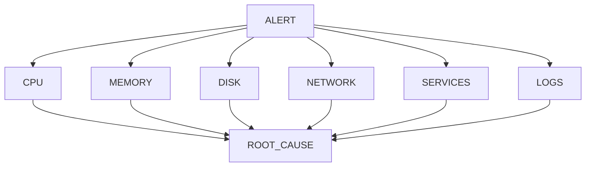

---

# Root Cause Analysis

Never stop at:

```text
Server Restarted
```

Ask:

```text
Why Did Restart Become Necessary?
```

---

# Five Whys Technique

Example:

```text
Website Down

↓

Why?

App Crashed

↓

Why?

Out Of Memory

↓

Why?

Memory Leak

↓

Why?

Bug Introduced

↓

Why?

No Load Testing
```

---

# Five Whys Visualization

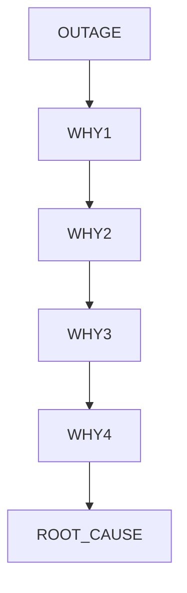

---

# Postmortems

Every major incident should produce:

```text
Learning
```

not:

```text
Blame
```

---

# Good Postmortem

Contains:

```text
Timeline

Impact

Root Cause

Detection

Mitigation

Lessons Learned

Action Items
```

---

# Postmortem Template

```text
Incident:

Impact:

Timeline:

Root Cause:

Resolution:

Prevention:
```

---

# Production Debugging Toolkit

```bash
top

htop

free -h

vmstat 1

df -h

du -sh

journalctl

systemctl status

ss -tulpn

ps aux

pstree

strace -p PID
```

---

# Incident Command Structure

Large incidents involve:

```text
Incident Commander

Investigators

Communications Lead

Subject Matter Experts
```

---

# Incident Organization

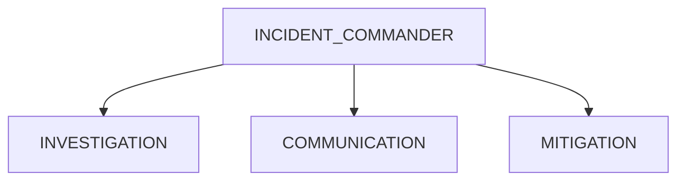

---

# Production Example

SaaS Outage:

```text
Customer Reports Errors
```

Investigation:

```bash
systemctl status app

journalctl -u app

free -h

top
```

Finding:

```text
Memory Leak

↓

OOM Kill

↓

App Restart
```

Root cause identified.

---

# Linux Internals Perspective

Every incident eventually touches:

```text
Processes

Memory

CPU

Storage

Networking
```

because these are Linux's fundamental resources.

---

# Incident Resource Model

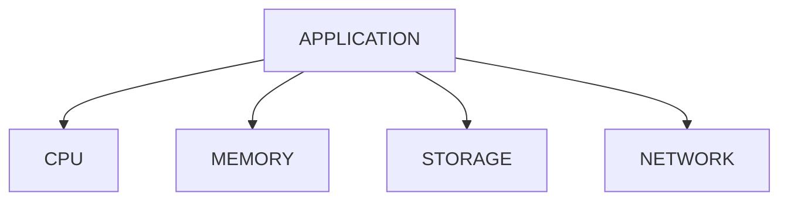

---

# Docker Connection

Container incidents often involve:

```text
OOM Kills

CPU Limits

Restart Loops

Storage Problems
```

---

# Container Investigation

```bash
docker ps

docker stats

docker logs container
```

---

# Container Incident Flow

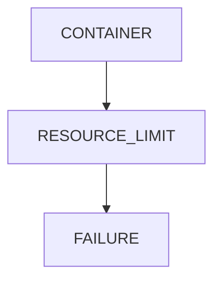

---

# Kubernetes Connection

Common incidents:

```text
CrashLoopBackOff

OOMKilled

Pending Pods

ImagePullBackOff
```

---

# Kubernetes Investigation

```bash
kubectl get pods

kubectl describe pod

kubectl logs pod
```

---

# Kubernetes Failure Model

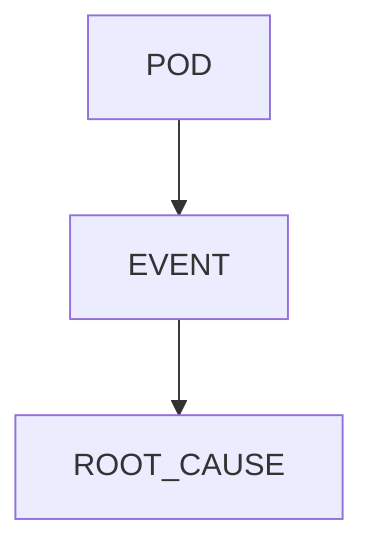

---

# Cloud Connection

Cloud incidents often involve:

```text
Resource Exhaustion

Networking

Storage

Misconfiguration
```

The Linux troubleshooting process remains the same.

---

# Full Incident Response Flow

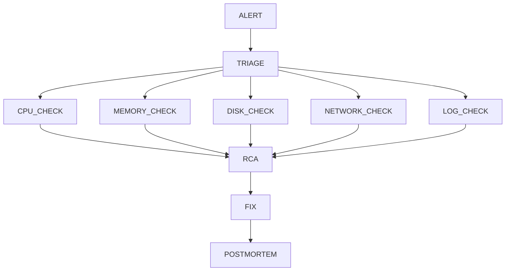

---

# Capstone Challenge

You are on-call.

Users report:

```text
Application Down
```

Investigate:

```bash
uptime

top

free -h

df -h

systemctl status

journalctl -xe

ss -tulpn
```

Build:

```text
Incident Timeline

Hypothesis

Evidence

Root Cause

Fix
```

---

# Performance Considerations

Incidents often arise from:

```text
Resource Saturation

Poor Capacity Planning

Unbounded Growth
```

---

# Security Considerations

Not every incident is accidental.

Potential causes:

```text
Malware

Cryptominers

Unauthorized Access

Misuse
```

Always consider security.

---

# Common Mistakes

## Mistake 1

Restarting before collecting evidence.

---

## Mistake 2

Ignoring logs.

---

## Mistake 3

Treating symptoms as causes.

---

## Mistake 4

Skipping root cause analysis.

---

## Mistake 5

Not documenting incidents.

---

## Mistake 6

Blaming individuals.

---

# Troubleshooting Flowchart

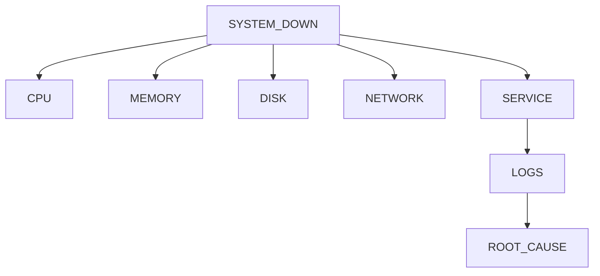

---

# Engineering Mindset

Beginners think:

```text
How Do I Restart It?
```

Engineers think:

```text
What Failed?

Why Did It Fail?

How Do I Prove It?

How Do We Prevent It?
```

Senior engineers think:

```text
How Do We Ensure

This Never Happens Again?
```

---

# Interview Questions

### What is incident response?

The process of detecting, investigating, mitigating, and learning from production failures.

---

### What is triage?

Determining impact, severity, and scope.

---

### What is root cause analysis?

Finding the underlying cause rather than symptoms.

---

### Why are logs important?

They provide evidence and timelines.

---

### What is the Five Whys technique?

A method for reaching the true root cause.

---

### Why should incidents have postmortems?

To improve systems and processes.

---

### What is a SEV-1 incident?

A critical outage affecting core functionality.

---

### What should you check first during an outage?

CPU, memory, disk, network, services, and logs.

---

# Incident Response Cheat Sheet

```bash
uptime

top

htop

free -h

vmstat 1

df -h

du -sh

ps aux

pstree

systemctl status service

journalctl -xe

journalctl -u service

ss -tulpn

ip addr

ip route

strace -p PID
```

---

# Lab Success Criteria

You can complete this lab when you can:

✅ Perform incident triage

✅ Investigate CPU incidents

✅ Investigate memory incidents

✅ Investigate storage incidents

✅ Investigate network incidents

✅ Analyze service failures

✅ Use logs effectively

✅ Perform root cause analysis

✅ Write postmortems

✅ Connect Linux incidents to Docker

✅ Connect Linux incidents to Kubernetes

✅ Think like an SRE

✅ Think like an Incident Commander

✅ Think like a Production Engineer

Congratulations.

You have completed the **Process Management Labs** section.

You now possess the mindset and workflow used by real-world Linux administrators, SREs, DevOps engineers, platform engineers, cloud engineers, and production incident responders to diagnose, mitigate, and learn from failures in modern systems.
