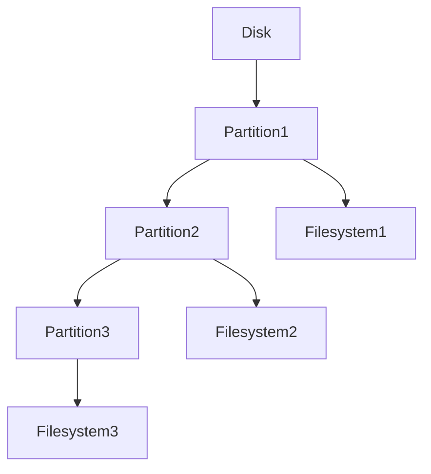
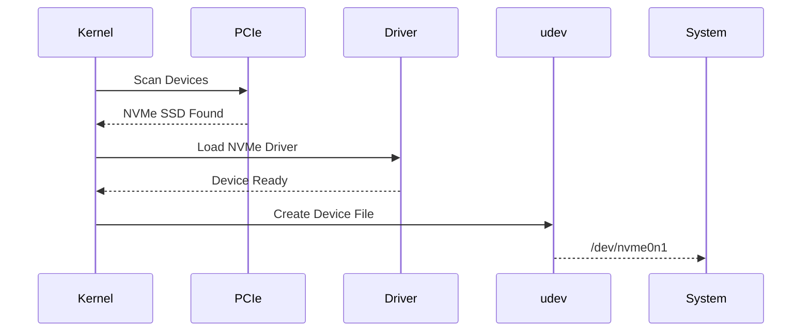

# Lab 01 — Disk Discovery

> Linux Fundamentals Mastery
>
> Storage Management Labs Series
>
> Track:
>
> Linux Storage → Filesystems → Infrastructure Engineering → Cloud Storage
>
> Lab Goal:
>
> Learn how Linux discovers storage devices, how disks appear inside the kernel, how to inspect storage hardware, and how to think like a systems engineer when investigating storage infrastructure.

---

# Why This Lab Exists

Most Linux users think storage looks like:

```text
C: Drive

D: Drive
```

Linux engineers think differently.

When a production database fails, a cloud volume disappears, a Kubernetes node goes read-only, or an SSD begins failing, engineers must understand:

```text
Physical Disk

↓

Kernel Device

↓

Partition

↓

Filesystem

↓

Mount Point

↓

Application
```

This lab teaches the first step:

> How Linux discovers and represents storage devices.

Before learning filesystems, LVM, RAID, cloud volumes, or distributed storage, you must understand where storage begins.

---

# The Fundamental Question

Every storage operation begins with:

```text
Where is the data physically stored?
```

Linux must answer:

```text
Which device?

Which partition?

Which filesystem?

Which mount point?
```

Everything starts with device discovery.

---

# Mental Model

Imagine a warehouse.

Storage devices are shelves.

Filesystems are labeling systems.

Mount points are access doors.

Applications are workers retrieving items.

Visualized:

```text
Warehouse
   ↓
Shelves
   ↓
Labels
   ↓
Access Doors
   ↓
Workers
```

Linux storage works similarly.

---

# What Happens During Boot?

When Linux boots:

```text
Firmware
   ↓
Kernel Starts
   ↓
Storage Controllers Detected
   ↓
Disks Detected
   ↓
Device Files Created
   ↓
Filesystems Mounted
```

Only then can applications access data.

---

# Linux Storage Architecture

```mermaid
flowchart TD

Application

--> Filesystem

--> VFS

--> Block Layer

--> Device Driver

--> Storage Controller

--> Physical Disk
```

Understanding this architecture is more important than memorizing commands.

---

# First Investigation — Discover Storage Devices

Display block devices:

```bash
lsblk
```

Example:

```text
NAME   SIZE TYPE
sda    500G disk
├─sda1 512M part
├─sda2 100G part
└─sda3 399G part
```

---

# What lsblk Actually Shows

Many beginners think:

```text
sda = filesystem
```

Wrong.

```text
sda = disk
```

The filesystem exists on top of partitions.

---

# Visualizing Storage Hierarchy



---

# Device Naming

Linux represents hardware as files.

Example:

```text
/dev/sda
/dev/sdb
/dev/nvme0n1
```

This is a profound Linux design philosophy:

```text
Everything Is A File
```

Storage devices are no exception.

---

# Traditional Disk Names

Older systems:

```text
/dev/sda
/dev/sdb
/dev/sdc
```

Meaning:

```text
Storage Device A
Storage Device B
Storage Device C
```

---

# Modern NVMe Devices

Modern SSDs often appear as:

```text
/dev/nvme0n1
/dev/nvme1n1
```

Example:

```text
nvme0n1

↓

NVMe Controller 0

↓

Namespace 1
```

---

# Why NVMe Matters

Traditional storage:

```text
CPU
 ↓
SATA Controller
 ↓
SSD
```

Modern storage:

```text
CPU
 ↓
PCIe
 ↓
NVMe SSD
```

Much lower latency.

Much higher throughput.

Modern cloud infrastructure depends heavily on NVMe.

---

# Investigating Hardware Information

Display detailed information:

```bash
sudo fdisk -l
```

Observe:

* Device size
* Sector size
* Partition layout
* Disk identifiers

---

# Understanding Sectors

Disks store data in sectors.

Historically:

```text
512 Bytes
```

Modern disks:

```text
4096 Bytes
```

(4K sectors)

---

# Why Sector Size Matters

Misaligned partitions cause:

```text
Extra Reads

Extra Writes

Reduced Performance
```

Storage performance often begins here.

---

# Viewing Kernel Disk Detection

Observe boot messages:

```bash
dmesg | grep -i disk
```

or

```bash
dmesg | grep -i nvme
```

---

# What Happens Internally

Kernel discovers:

```text
PCI Device

↓

Storage Controller

↓

Device Driver

↓

Block Device

↓

/dev Entry
```

---

# Device Discovery Visualization



---

# Understanding The Block Layer

One of Linux's most important subsystems.

Applications never talk directly to disks.

Instead:

```text
Application

↓

Filesystem

↓

Block Layer

↓

Disk
```

The block layer manages:

* Scheduling
* Queuing
* Request merging
* Optimization

---

# Visualizing Block I/O

```mermaid
flowchart LR

Application

--> Filesystem

--> BlockLayer

--> I/O Scheduler

--> Disk
```

---

# Why This Exists

Suppose:

```text
1000 Processes

↓

Read Data Simultaneously
```

Without a block layer:

```text
Chaos
```

The block layer coordinates access.

---

# Investigating Mounted Filesystems

Display mounted filesystems:

```bash
mount
```

or

```bash
findmnt
```

Observe relationship:

```text
Device

↓

Filesystem

↓

Mount Point
```

---

# Visual Example

```text
/dev/nvme0n1p2

↓

ext4

↓

/
```

Meaning:

Root filesystem lives on that partition.

---

# Mapping The Entire Storage Stack

Use:

```bash
lsblk -f
```

Example:

```text
NAME        FSTYPE MOUNTPOINT
nvme0n1
├─nvme0n1p1 ext4   /boot
└─nvme0n1p2 ext4   /
```

This is one of the most valuable storage commands.

---

# Production Scenario 1

## New Disk Added

Cloud engineer attaches:

```text
100GB EBS Volume
```

Server cannot see it.

---

# Investigation

```bash
lsblk
```

New disk missing.

Check:

```bash
dmesg
```

Potential causes:

* Volume attachment failed
* Driver issue
* Hypervisor issue

---

# Production Scenario 2

## Kubernetes Node Out Of Space

Symptoms:

```text
Pods Crash

Node Not Ready
```

Investigation:

```bash
df -h
```

and

```bash
lsblk
```

Understanding device layout becomes critical.

---

# Production Scenario 3

## Database Latency Spike

Symptoms:

```text
Slow Queries
```

Application appears healthy.

CPU appears healthy.

Problem:

```text
Storage Latency
```

Investigation begins at device layer.

---

# Understanding Virtual Disks

Cloud disks are virtual.

Example:

```text
AWS EBS

Azure Managed Disk

GCP Persistent Disk
```

Linux sees:

```text
/dev/nvme0n1
```

The kernel doesn't care whether storage is:

* Local SSD
* SAN
* Cloud Volume

Everything appears as block devices.

---

# Storage Stack In Cloud Systems

```mermaid
flowchart TD

Application

--> Filesystem

--> Block Layer

--> Virtual Device

--> Hypervisor

--> Physical Storage
```

Multiple abstraction layers exist.

---

# Observability Tools

Investigate devices:

```bash
lsblk
```

Detailed information:

```bash
fdisk -l
```

Filesystem mapping:

```bash
lsblk -f
```

Mounted filesystems:

```bash
findmnt
```

Kernel discovery:

```bash
dmesg
```

---

# What The Kernel Is Thinking

At boot:

```text
Scan Hardware
```

Then:

```text
Load Drivers
```

Then:

```text
Create Block Devices
```

Then:

```text
Expose Devices Under /dev
```

Only after that can filesystems mount.

---

# Common Mistakes

## Mistake 1

Confusing disks and partitions.

Wrong:

```text
sda = filesystem
```

Correct:

```text
sda = disk

sda1 = partition

ext4 = filesystem
```

---

## Mistake 2

Ignoring lsblk.

Many engineers jump directly to filesystem tools.

First understand device hierarchy.

---

## Mistake 3

Assuming cloud storage is different.

Cloud storage ultimately appears as Linux block devices.

---

## Mistake 4

Not checking dmesg.

Kernel logs often reveal discovery failures.

---

# Engineering Mindset

Junior Engineer:

```text
Disk Missing
```

Senior Engineer:

```text
At which layer?
```

```text
Hardware?

Controller?

Driver?

Block Device?

Partition?

Filesystem?

Mount?
```

Infrastructure engineers think in layers.

Storage problems become easier once layers are understood.

---

# Interview Questions

### Beginner

What does lsblk show?

### Beginner

Difference between disk and partition?

### Intermediate

How does Linux discover storage devices?

### Intermediate

Why does Linux represent disks under /dev?

### Intermediate

What is a block device?

### Advanced

Explain Linux storage architecture.

### Advanced

How does NVMe differ from SATA?

### Advanced

What role does the block layer play?

### Advanced

How would you investigate a missing disk?

### Advanced

How do cloud volumes appear inside Linux?

---

# Cheat Sheet

Discover disks:

```bash
lsblk
```

Filesystem mapping:

```bash
lsblk -f
```

Partition details:

```bash
sudo fdisk -l
```

Mounted filesystems:

```bash
findmnt
```

Kernel messages:

```bash
dmesg | grep -i disk
```

NVMe devices:

```bash
dmesg | grep -i nvme
```

Storage hardware:

```bash
lspci
```

---

# Lab Success Criteria

You should now be able to:

* Discover storage devices
* Understand Linux block devices
* Understand disk vs partition vs filesystem
* Understand device naming
* Investigate storage discovery
* Understand NVMe architecture
* Interpret lsblk output
* Understand the Linux block layer
* Relate cloud volumes to Linux devices
* Think like a storage engineer

At this point, you should no longer think of storage as:

```text
A hard drive
```

Instead think:

```text
A layered storage stack

Hardware

↓

Kernel

↓

Block Devices

↓

Filesystems

↓

Applications
```

That mental model is the foundation for everything that follows in Linux storage engineering.
